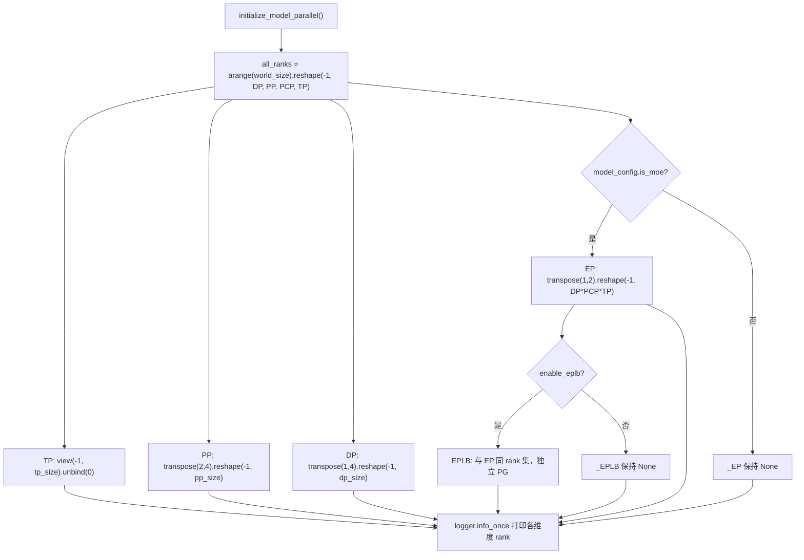
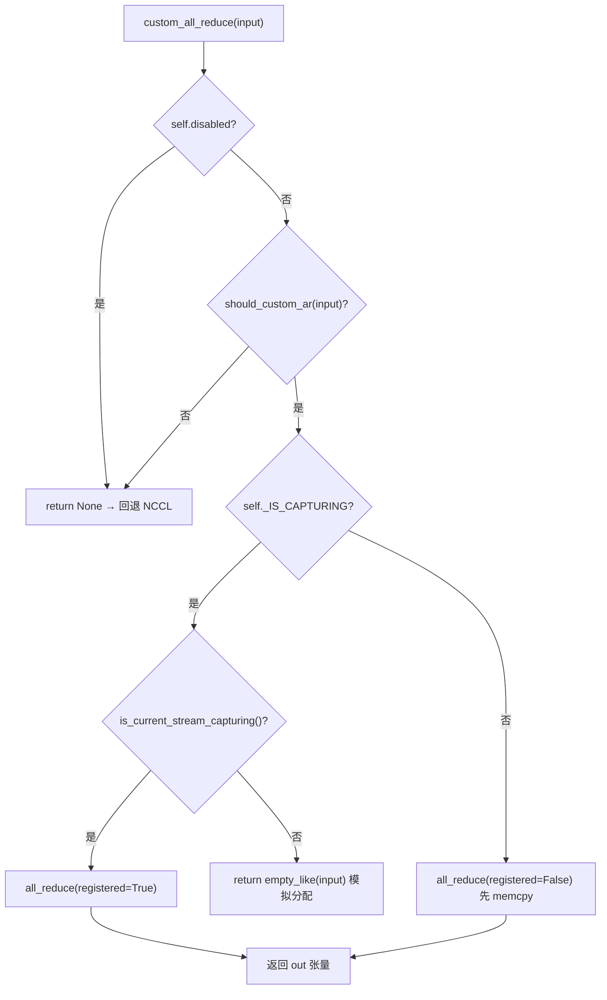

# Следующая глава: Глава 8 →

Статус проверки: FACT — номера строк реально привязаны

# В предыдущей главе мы прошли последнюю милю жизненного цикла одного инференса — от выборки logits до потокового вывода. Но когда модель слишком велика, чтобы поместиться на одной карте, этот конвейер приходится разделять между несколькими устройствами для совместного выполнения. Первоочередной вопрос распределённого инференса — не «как разрезать модель», а «после разрезания кто с кем говорит и каким способом». vLLM передаёт эти два вопроса соответственно топологии групп процессов в parallel_state.py и реализации коммуникатора в custom_all_reduce.py. В этой главе мы идём по цепочке «создание групп → разделение → коммуникация → перебалансировка нагрузки», послойно разбирая стратегии параллелизма TP, PP, EP и низкоуровневые примитивы коммуникации.

## 8.1 Топология групп процессов: как из сетки rank'ов вырезаются TP/PP/DP/EP

Интуитивная модель`new_group`，就会出现"我以为你在 TP 组里，其实你在 DP 组里"的通信错位——集合通信一旦有 rank 缺席，NCCL 会直接挂死而非报错。

## 数据结构与内存布局

`GroupCoordinator`是这一切的载体。它的字段设计直接对应"一个进程在多个并行维度上的多重身份"：

- `rank`是全局 rank，`ranks`是本组成员全局 rank 列表，`world_size`是组大小[FACT:vllm/distributed/parallel_state.py:434-436]。
- `local_rank`用于绑定设备，`rank_in_group`是组内序号——源码用一张表精确区分二者：跨两节点的 4 卡组里，rank 2 的`local_rank`是 0（它在节点 1 上是第一张卡），但`rank_in_group`是 2[FACT:vllm/distributed/parallel_state.py:437-445]。
- `cpu_group`与`device_group`成对存在：前者走 gloo 做元数据/对象通信，后者走 NCCL 做张量通信[FACT:vllm/distributed/parallel_state.py:446-447]。

这里有个关键设计：**为什么每个组都要维护一个 CPU 组？**因为`broadcast_object`、`send_object`这类操作传输的是 Python 对象（序列化后的字节），走 NCCL 既浪费显存又可能污染当前 CUDA 设备。`barrier()`的注释把这一点说得很直白：NCCL 的 barrier 内部是一次 broadcast，会偷偷创建 GPU 张量，容易搞乱当前设备，所以必须用 CPU 组[FACT:vllm/distributed/parallel_state.py:1355-1362]。

## Step-by-Step：`initialize_model_parallel`如何切网格

代入一个具体场景：8 卡、TP=2、PP=4、DP=1。核心是把一维 rank 序列 reshape 成多维网格，再沿每个维度切分。

第一步，构造 rank 网格。布局顺序被明确定义为`ExternalDP x DP x PP x PCP x TP` [FACT:vllm/distributed/parallel_state.py:2045-2060]：

```python
all_ranks = torch.arange(world_size).reshape(
    -1, data_parallel_size, pipeline_model_parallel_size,
    prefill_context_model_parallel_size, tensor_model_parallel_size,
)
```

第二步，切 TP 组：把网格 view 成`(-1, tp_size)`后 unbind，得到`[g0,g1],[g2,g3],...` [FACT:vllm/distributed/parallel_state.py:2065-2077]。注意 TP 组额外传了`use_message_queue_broadcaster=True`，因为 TP 组需要共享内存广播来分发元数据。

第三步，切 PP 组：`all_ranks.transpose(2, 4)`把 PP 维换到最后一维再切，得到`[g0,g2,g4,g6],[g1,g3,g5,g7]` [FACT:vllm/distributed/parallel_state.py:2175-2188]。这正是文档字符串里给出的例子[FACT:vllm/distributed/parallel_state.py:1997-1997]。

第四步，切 DP 组：`transpose(1, 4)`后切[FACT:vllm/distributed/parallel_state.py:2195-2202]。

第五步，切 EP 组——这里有个容易忽略的细节：EP 组只在 MoE 模型下创建，dense 模型直接跳过[FACT:vllm/distributed/parallel_state.py:2210-2241]。EP 组的 rank 集合是`DP x PCP x TP`的乘积，意味着 EP 复用了 DP 和 TP 的物理卡，而不是独立维度。



## 设计思考与踩坑

**EPLB 为什么要独立进程组？**注释给出了答案：把 EPLB 通信与 MoE 前向的集合通信隔离，防止"执行期的 torch.distributed"与"EPLB 的 torch.distributed"互相死锁[FACT:vllm/distributed/parallel_state.py:2243-2246]。这是一个典型的"用独立通信域换确定性"的权衡——多一个 PG 的显存开销，换来的是不会在权重搬运时卡死前向。

**DP 组的同步约束**是生产环境最常踩的坑：同一 DP 组内所有 rank 必须同时调用`generate`，否则死锁[FACT:vllm/distributed/parallel_state.py:2048-2051]。因为 DP 组内会做梯度/采样结果的 all-reduce，任何 rank 缺席都会让集合通信永久阻塞。

**销毁顺序**同样有讲究。`destroy()`先销毁 device communicator，再销毁 device_group 和 cpu_group[FACT:vllm/distributed/parallel_state.py:1380-1393]。注释解释了原因：device communicator 可能持有依赖这些 PG 的集合通信工作区（如 FlashInfer PCIe IPC barrier），必须先释放[FACT:vllm/distributed/parallel_state.py:1377-1377]。

# 8.2 通信原语：自定义 all-reduce 如何绕过 NCCL

## 直觉模型

NCCL 的 all-reduce 是"通用货车"，能拉任何货、走任何路，但启动开销和协议开销固定。当你要在 8 卡 NVLink 全互联的机器上反复做小张量 all-reduce（TP 的每个 attention/MLP 层都要做），通用货车的"过路费"就变得不可忽视。自定义 all-reduce 是"专用小推车"：只在同机、NVLink 全互联、张量大小合适的场景下启用，用一次`cudaMemcpy`换掉 NCCL 的握手与协议开销。

## 数据结构与内存布局

`CustomAllreduce`的初始化是一场"能力探测 + 资源预分配"的组合。关键字段：

- `_SUPPORTED_WORLD_SIZES = [2, 4, 6, 8, 16]`：只支持这些组大小[FACT:vllm/distributed/device_communicators/custom_all_reduce.py:113-129]。
- `meta_ptrs`：同步元数据 + 中间结果缓冲区，大小`ops.meta_size() + max_size` [FACT:vllm/distributed/device_communicators/custom_all_reduce.py:291-294]。
- `buffer_ptrs`：预注册的 IPC 缓冲区，eager 模式下输入张量先拷进来再算[FACT:vllm/distributed/device_communicators/custom_all_reduce.py:298-305]。
- `rank_data`：8MB 的 uint8 张量，存放所有 rank 的 IPC 缓冲区指针元组[FACT:vllm/distributed/device_communicators/custom_all_reduce.py:309-315]。

**为什么缓冲区要预注册？**因为 CUDA Graph 捕获要求所有地址在捕获时固定。`register_graph_buffers`在捕获结束时把所有用到的缓冲区地址广播给所有 rank 并注册[FACT:vllm/distributed/device_communicators/custom_all_reduce.py:474-491]。

## Step-by-Step：一次 all-reduce 的决策流

代入场景：TP 组内某层 MLP 输出需要 all-reduce，输入是 4MB 的 bf16 张量。

第一步，`custom_all_reduce`检查是否禁用、是否满足`should_custom_ar` [FACT:vllm/distributed/device_communicators/custom_all_reduce.py:529-533]。

第二步，`should_custom_ar`Поэлементная фильтрация: world_size > 8 — отклонить; dtype должен быть fp32/fp16/bf16; число байт должно быть кратно 16; должна быть слабая непрерывность; продолжить только если world_size==2 или полносвязная топология[FACT:vllm/distributed/device_communicators/custom_all_reduce.py:493-508]。

Третий шаг — ветвление в зависимости от того, находимся ли мы в захвате CUDA Graph: при захвате используется`registered=True`(адрес уже зафиксирован), иначе`registered=False`(требуется сначала memcpy в предварительно зарегистрированный буфер)[FACT:vllm/distributed/device_communicators/custom_all_reduce.py:529-545]。

Четвёртый шаг — фактический вызов`ops.all_reduce`, передача`buffer_ptrs[rank]`и`max_size` [FACT:vllm/distributed/device_communicators/custom_all_reduce.py:519-527]。



## Размышления о дизайне и подводные камни

**Путь деградации в многоузловых сценариях**— это самая изящная часть данного кода.`same_node`Когда`mnnvl_only`ложно,[FACT:vllm/distributed/device_communicators/custom_all_reduce.py:198-199]устанавливается в истину[FACT:vllm/distributed/device_communicators/custom_all_reduce.py:228-233]。`_group_can_attempt_mnnvl`, затем проверяется поддержка MNNVL (Multi-Node NVLink). Если не каждая карта в группе поддерживает MNNVL, пользовательская коллективная коммуникация немедленно отключается[FACT:vllm/distributed/device_communicators/custom_all_reduce.py:59-73]используется один CPU all-reduce (операция MIN), чтобы гарантировать, что все rank'и пойдут по одному и тому же потоку управления

**— это ключевая защита в гетерогенных кластерах от зависания, вызванного тем, что "часть rank'ов идёт по пути MNNVL, а часть — через NCCL".**：`_can_p2p`Стоимость проверки P2P`gpu_p2p_access_check`выполнит обход всех peer'ов с[FACT:vllm/distributed/device_communicators/custom_all_reduce.py:278-278], в комментарии сказано, что первое вычисление очень дорогое, но кэшируется`VLLM_SKIP_P2P_CHECK`. Если в продакшене обнаружена медленная загрузка, можно установить[FACT:vllm/distributed/device_communicators/custom_all_reduce.py:86-100]。

**для пропуска и довериться отчёту драйвера о P2P**Трёхуровневый выбор бэкенда для reduce-scatter`_select_reduce_scatter_backend`заслуживает отдельного рассмотрения:`mnnvl_multimem` > `mnnvl_lamport` > `legacy` [FACT:vllm/distributed/device_communicators/custom_all_reduce.py:601-636]возвращает по приоритету`(2,4,8)`. Путь multimem требует, чтобы world_size находился в[FACT:vllm/distributed/device_communicators/custom_all_reduce.py:103-104], а возможности устройства были (10,0) или (10,3) (уровень Blackwell)`VLLM_BATCH_INVARIANT`. Обратите внимание:[FACT:vllm/distributed/device_communicators/custom_all_reduce.py:628]отключает путь multimem

# — поскольку порядок редукции в multimem недетерминирован, что нарушает пакетную инвариантность.

## 8.3 EPLB: логика планирования ребалансировки нагрузки экспертов

Интуитивная модель

## В модели MoE 256 логических экспертов распределены по 32 картам, по 8 на карту. Но при реальном трафике некоторые "популярные эксперты" (например, обрабатывающие распространённые синтаксические структуры) получают большое количество маршрутизированных токенов, из-за чего карта, на которой они находятся, становится узким местом, а остальные карты простаивают. EPLB (Expert Parallel Load Balancer) — это "добавление реплик для популярных экспертов": веса популярных экспертов копируются на свободные карты, чтобы токены распределялись и туда. Без него реальная пропускная способность MoE была бы ограничена самой медленной картой.

`EplbModelState`Структуры данных и разметка памяти

- `physical_to_logical_map`использует три таблицы отображения для описания связи "логический эксперт ↔ физический эксперт":`(num_moe_layers, num_physical_experts)`: форма[FACT:vllm/distributed/eplb/eplb_state.py:105-120]。
- `logical_to_physical_map`, каждый физический слот хранит id логического эксперта, который он несёт`(num_moe_layers, num_logical_experts, max_replicas+1)`: форма[FACT:vllm/distributed/eplb/eplb_state.py:123-146]。
- `logical_replica_count`, разреженная матрица, -1 означает отсутствие отображения[FACT:vllm/distributed/eplb/eplb_state.py:147-161]。

`expert_load_window`: сколько реплик у каждого логического эксперта`(window_size, num_moe_layers, num_physical_experts)` [FACT:vllm/distributed/eplb/eplb_state.py:180-187]— это скользящее окно, форма[FACT:vllm/distributed/eplb/eplb_state.py:180-187]。

## . В комментарии особо отмечено: теперь записывается нагрузка всех физических экспертов, а не только локальных, чтобы обеспечить согласованность статистики для разных методов dispatch (naive all-to-all, DeepEP); при naive all-to-all каждый DP rank вносит одинаковый набор токенов, и нагрузка умножается на dp_size

Пошагово: полная цепочка одной перестановки`expert_rearrangement_step`Сценарий:`rearrange()`。

достигает порога, запускается`scatter_add_`Первый шаг — отобразить физическую нагрузку обратно на логических экспертов. С помощью`physical_to_logical_map`агрегируется по`invalid_idx`, недействительные слоты (<0) заполняются в[FACT:vllm/distributed/eplb/eplb_state.py:794-816]。

корзину и в конце отбрасываются`_allreduce_list`Второй шаг — межранговый all-reduce для получения глобальной логической нагрузки.[FACT:vllm/distributed/eplb/eplb_state.py:1045-1068]。

выполняет конкатенацию нагрузок нескольких моделей, затем один all-reduce и разбиение обратно, чтобы избежать множественных коммуникаций`policy.rebalance_experts`Третий шаг — вызов стратегии для вычисления нового отображения.[FACT:vllm/distributed/eplb/eplb_state.py:859-867]。

выполняется на host, поэтому окно нагрузки и текущее отображение нужно скопировать обратно на CPU[FACT:vllm/distributed/eplb/eplb_state.py:869-923]Четвёртый шаг — специфичная для ROCm проверка "пропуска перестановки": если улучшение неравномерности нагрузки по rank'ам от нового отображения меньше 5%, перестановка пропускается

. Это прагматичная оптимизация — сама перестановка имеет коммуникационные затраты, и если выгода недостаточна, её не делают.[FACT:vllm/distributed/eplb/eplb_state.py:925-942]。

```mermaid
sequenceDiagram
    participant Main as 主线程 step()
    participant Policy as DefaultEplbPolicy
    participant Comm as EplbCommunicator
    participant Async as async_worker 线程
    Main->>Main: expert_rearrangement_step >= interval
    Main->>Main: scatter_add_ 物理负载→逻辑负载
    Main->>Main: _allreduce_list 跨 rank 聚合
    Main->>Policy: rebalance_experts(load, replicas, groups, nodes, gpus, map)
    Policy-->>Main: new_physical_to_logical_map
    alt 同步模式
        Main->>Comm: rearrange_expert_weights_inplace()
        Comm-->>Main: 权重搬运完成
        Main->>Main: _commit_eplb_maps()
    else 异步模式
        Main->>Main: eplb_stats = EplbStats(...); rebalanced = True
        Main->>Async: rearrange_event.record()
        Async->>Comm: 后台搬运权重到 expert_buffer
        Async-->>Main: pending_result 就绪
        Main->>Main: _move_to_workspace() 提交
    end
```

## копирование

**Размышления о дизайне и подводные камни**Примитивы синхронизации в асинхронном режиме`rebalanced`— самое тонкое место в этом коде.[FACT:vllm/distributed/eplb/eplb_state.py:194-203]Флаг`rebalanced`синхронизируется через GIL между главным потоком и async worker'ом`_all_ranks_result_ready`. Но в комментарии предупреждают:[FACT:vllm/distributed/eplb/eplb_state.py:664-665]。`_all_ranks_result_ready`должен быть согласован на всех rank'ах, иначе[FACT:vllm/distributed/eplb/eplb_state.py:1024-1043]。

**внутри all-reduce приведёт к зависанию**：`_should_record_current_step`Предпочтительно использовать CPU-группу для all-reduce, так как CPU-группа надёжнее`window_size`Оптимизация "предварительной записи" скользящего окна[FACT:vllm/distributed/eplb/eplb_state.py:689-709]включает запись только тогда, когда до следующей перестановки остаётся не более`step_interval - window_size`шагов[FACT:vllm/distributed/eplb/eplb_state.py:1196-1199]。`should_record_tensor`. В комментарии объясняется: данные за`fill_`шагов перед каждым циклом перестановки будут перезаписаны скользящим окном, записывать их бессмысленно — это пустая трата вычислений GPU[FACT:vllm/distributed/eplb/eplb_state.py:272-278]。

**— это один и тот же скалярный тензор, общий для всех слоёв, одно**：`enable_elastic_ep`обновляет все слои`physical_expert_capacity`Резервирование ёмкости для эластичного EP`elastic_ep_max_dp_size`при[FACT:vllm/distributed/eplb/eplb_state.py:375-386]резервируется по`reconfigure_physical_expert_slots`, таблица отображения заполняет лишние слоты значением -1[FACT:vllm/distributed/eplb/eplb_state.py:1135-1160]。

**`_commit_eplb_maps`. Таким образом, при масштабировании не нужно перераспределять видеопамять — достаточно заполнить слоты -1 реальными экспертами.**отвечает за обновление представления при масштабировании вверх/вниз`PIN_MEMORY`Обработка pin memory в`non_blocking=True`: когда[FACT:vllm/distributed/eplb/eplb_state.py:1392-1400]включён и источник находится на CPU, сначала выполняется копирование в pinned-память, затем

# асинхронное копирование на GPU

Три блока кода разделяют одну философию проектирования:**Обмен обнаружения возможностей на детерминированную деградацию**。`GroupCoordinator`При`world_size == 1`напрямую обходить все коллективные коммуникации[FACT:vllm/distributed/parallel_state.py:736-738]；`CustomAllreduce`при невыполнении любого условия возвращать`None`позволяя вызывающей стороне откатиться на NCCL[FACT:vllm/distributed/device_communicators/custom_all_reduce.py:532-533]; EPLB пропускает перебалансировку, если улучшение менее 5%[FACT:vllm/distributed/eplb/eplb_state.py:916]. Этот паттерн «быстрый отказ + изящная деградация» позволяет одному и тому же коду работать на всём спектре оборудования — от одной карты до многоузлового MNNVL — без необходимости писать ветвления для каждой конфигурации.

Ещё одна общая черта —**согласованность потока управления важнее производительности**。`_group_can_attempt_mnnvl`Использование CPU all-reduce для принудительного направления всех rank по одной ветке[FACT:vllm/distributed/device_communicators/custom_all_reduce.py:59-73]，`_all_ranks_result_ready`Аналогично[FACT:vllm/distributed/eplb/eplb_state.py:1024-1043]. В распределённых системах ситуация «часть rank пошла по быстрому пути, часть — по медленному» гораздо опаснее, чем «все rank пошли по медленному пути» — первая приводит к зависанию, вторая лишь к замедлению.

# Итоги главы

- `GroupCoordinator`Преобразование одномерной последовательности rank в`ExternalDP x DP x PP x PCP x TP`сетку, с разбиением по измерениям на группы процессов TP/PP/DP/EP/EPLB; каждая группа одновременно поддерживает два PG: CPU (gloo) и device (NCCL).
- `CustomAllreduce`Через обнаружение возможностей (один узел, полносвязный NVLink, размер тензора, dtype, выравнивание на 16 байт) определяется, брать ли на себя all-reduce; в многоузловых сценариях происходит деградация до MNNVL или NCCL.
- EPLB использует три таблицы отображения для описания связей логических/физических экспертов, подсчитывает нагрузку через скользящее окно, вычисляет новое отображение стратегией, коммуникатор перемещает веса, поддерживаются синхронный и асинхронный режимы.
- Общий принцип проектирования всех трёх: обнаружение возможностей + детерминированная деградация + приоритет согласованности потока управления.

# Вопросы для размышления и самопроверки к главе

Q1: `GroupCoordinator.destroy()`Сначала уничтожается device communicator, затем process group[FACT:vllm/distributed/parallel_state.py:1380-1393]. Если поменять порядок — сначала уничтожить PG, а потом communicator — в каком сценарии произойдёт крах?

**Разбор ответа**: В комментарии явно указано, что device communicator может удерживать рабочие области коллективных коммуникаций, зависящие от этих PG, например FlashInfer PCIe IPC barrier[FACT:vllm/distributed/parallel_state.py:1377-1377]. Если сначала уничтожить PG, то внутри communicator`destroy()`при необходимости выполнить barrier или очистить коммуникации с использованием этих PG произойдёт обращение к уже уничтоженному ProcessGroup, что вызовет use-after-free или сбой внутренней проверки NCCL. Правильный порядок — «зависимый умирает первым»: communicator зависит от PG, поэтому communicator уничтожается первым.

Q2: `should_custom_ar`Требуется`inp_size % 16 == 0` [FACT:vllm/distributed/device_communicators/custom_all_reduce.py:493-508]. Если убрать эту проверку, что произойдёт с bf16-тензором размером 15 байт (например, 7,5 элемента — на практике невозможно, но предположим граничный случай 8 элементов = 16 байт)? Почему пользовательскому kernel нужно это выравнивание?

**Разбор ответа**: Пользовательский all-reduce kernel внутри использует векторизованную загрузку (например, 128-битную), требующую выравнивания адреса и размера на 16 байт, чтобы применять широкие инструкции загрузки вроде`float4`. Невыравненность приведёт к выходу kernel за границы чтения или вызовет исключение misaligned address. Что ещё более скрыто —`buffer_ptrs`предварительно зарегистрированный буфер выделяется по`max_size`если размер входных данных не кратен 16, после копирования в буфер в хвосте могут остаться остаточные данные, которые будут включены в редукцию, породив тихую ошибку. Поэтому эта проверка — одновременно и защита корректности, и предпосылка производительности.

Q3: В асинхронном режиме EPLB`rebalanced`флаг зависит от синхронизации через GIL[FACT:vllm/distributed/eplb/eplb_state.py:194-203], и в комментарии предупреждается, что все rank должны сохранять согласованность, иначе all-reduce зависнет[FACT:vllm/distributed/eplb/eplb_state.py:664-665]. Предположим, что на некотором rank из-за сетевых колебаний async worker досрочно установил`rebalanced`в False, тогда как остальные rank всё ещё имеют True,`_all_ranks_result_ready`что произойдёт?

**Разбор ответа**：`_all_ranks_result_ready`Для`has_result`выполняется all-reduce суммирование, затем проверяется равенство размеру группы[FACT:vllm/distributed/eplb/eplb_state.py:1030-1032]. Если на некотором rank`rebalanced`досрочно стало False, его`pending_result`возможно уже израсходован,`has_result`равно 0, из-за чего результат суммирования окажется меньше размера группы, и остальные rank будут бесконечно ждать. Хуже того, если этот rank уже вышел из`while ms.rebalanced`цикла, он больше не будет участвовать в последующих all-reduce, и all-reduce остальных rank заблокируется навсегда — это и есть описанное в комментарии «hang at collective communication calls». Средства защиты —`_all_ranks_result_ready`использовать CPU-группу вместо device-группы, и`drain_async`перед перебалансировкой явно опустошать все pending result[FACT:vllm/distributed/eplb/eplb_state.py:985-1022]。

Итак, мы разобрались с механизмами создания групп, разделения и перебалансировки нагрузки для межкарточного взаимодействия. Однако проблемы коммуникации в распределённом инференсе не ограничиваются одним экземпляром — когда prefill и decode разделены на разные экземпляры, KV Cache необходимо передавать между узлами. В следующей главе мы покинем «межкарточное взаимодействие» и перейдём к «межэкземплярному взаимодействию»: как KV Cache передаётся между экземплярами prefill и decode при раздельном развёртывании, и как абстракция KV Connector унифицирует транспортные бэкенды, такие как NIXL и Mooncake.
