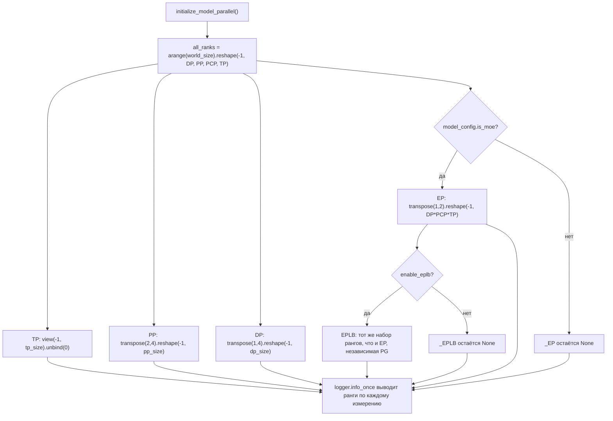
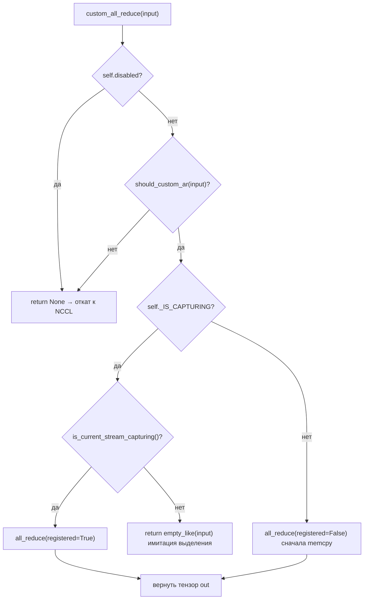

# Глава 8: Передача KV Cache и раздельное развертывание: разделение фаз Prefill и Decode

Статус проверки: FACT — номера строк реально привязаны

# В предыдущей главе мы прошли последнюю милю жизненного цикла одного инференса — от выборки logits до потокового вывода. Но когда модель слишком велика, чтобы поместиться на одной карте, этот конвейер приходится разделять между несколькими устройствами для совместного выполнения. Первоочередной вопрос распределённого инференса — не «как разрезать модель», а «после разрезания кто с кем говорит и каким способом». vLLM передаёт эти два вопроса соответственно топологии групп процессов в parallel_state.py и реализации коммуникатора в custom_all_reduce.py. В этой главе мы идём по цепочке «создание групп → разделение → коммуникация → перебалансировка нагрузки», послойно разбирая стратегии параллелизма TP, PP, EP и низкоуровневые примитивы коммуникации.

## 8.1 Топология групп процессов: как из сетки rank'ов вырезаются TP/PP/DP/EP

Интуитивная модель`new_group`, возникнет коммуникационное рассогласование типа «я думал, что ты в группе TP, а ты на самом деле в группе DP» — как только в коллективной коммуникации отсутствует хотя бы один rank, NCCL просто зависнет, а не выдаст ошибку.

## Структуры данных и компоновка памяти

`GroupCoordinator`является носителем всего этого. Дизайн его полей напрямую отражает «множественную идентичность одного процесса в нескольких измерениях параллелизма»:

- `rank`— это глобальный rank,`ranks`— список глобальных rank'ов членов данной группы,`world_size`— размер группы,[FACT:vllm/distributed/parallel_state.py:434-436]。
- `local_rank`используется для привязки устройства,`rank_in_group`— порядковый номер внутри группы — в исходном коде эти два понятия точно различаются с помощью таблицы: в группе из 4 карт на двух узлах у rank 2`local_rank`равно 0 (на узле 1 это первая карта), но`rank_in_group`равно 2[FACT:vllm/distributed/parallel_state.py:437-445]。
- `cpu_group`и`device_group`существуют в паре: первый использует gloo для передачи метаданных/объектов, второй использует NCCL для передачи тензоров[FACT:vllm/distributed/parallel_state.py:446-447]。

Здесь есть один ключевой момент проектирования:**Почему каждая группа должна поддерживать отдельную группу CPU?**Потому что`broadcast_object`、`send_object`Такие операции передают объекты Python (сериализованные байты), и использование NCCL приводит к бесполезному расходу видеопамяти и может загрязнить текущее устройство CUDA.`barrier()`В комментариях к этому прямо указано: barrier внутри NCCL по сути является broadcast, который незаметно создаёт тензоры на GPU и может нарушить работу текущего устройства, поэтому необходимо использовать группу CPU.[FACT:vllm/distributed/parallel_state.py:1355-1362]。

## Step-by-Step：`initialize_model_parallel`Как разбивать сетку

Рассмотрим конкретный сценарий: 8 GPU, TP=2, PP=4, DP=1. Суть в том, чтобы преобразовать одномерную последовательность rank в многомерную сетку, а затем разбить её по каждому измерению.

Первый шаг — построение сетки rank. Порядок размещения явно определён как`ExternalDP x DP x PP x PCP x TP` [FACT:vllm/distributed/parallel_state.py:2045-2060]：

```python
all_ranks = torch.arange(world_size).reshape(
    -1, data_parallel_size, pipeline_model_parallel_size,
    prefill_context_model_parallel_size, tensor_model_parallel_size,
)
```

Второй шаг — разбиение группы TP: преобразуем сетку в представление`(-1, tp_size)`затем выполняем unbind и получаем`[g0,g1],[g2,g3],...` [FACT:vllm/distributed/parallel_state.py:2065-2077]. Обратите внимание, что для группы TP дополнительно передаётся`use_message_queue_broadcaster=True`, поскольку группе TP требуется широковещательная передача через разделяемую память для распространения метаданных.

Третий шаг — разбиение группы PP:`all_ranks.transpose(2, 4)`Переставляем измерение PP в последнее измерение и выполняем разбиение, получая`[g0,g2,g4,g6],[g1,g3,g5,g7]` [FACT:vllm/distributed/parallel_state.py:2175-2188]. Именно этот пример приведён в строке документации.[FACT:vllm/distributed/parallel_state.py:1997-1997]。

Четвёртый шаг — разделение группы DP:`transpose(1, 4)`Разделение после[FACT:vllm/distributed/parallel_state.py:2195-2202]。

Пятый шаг — разделение группы EP. Здесь есть легко упускаемая деталь: группа EP создаётся только для MoE-моделей, для dense-моделей она пропускается.[FACT:vllm/distributed/parallel_state.py:2210-2241]. Набор рангов группы EP — это`DP x PCP x TP`произведение, что означает, что EP переиспользует физические карты DP и TP, а не является независимым измерением.



## Проектные соображения и подводные камни

**Почему для EPLB нужна независимая группа процессов?**Комментарий даёт ответ: изолировать коммуникацию EPLB от коллективной коммуникации прямого прохода MoE, чтобы предотвратить взаимную блокировку между "torch.distributed во время выполнения" и "torch.distributed в EPLB"[FACT:vllm/distributed/parallel_state.py:2243-2246]. Это типичный компромисс "независимый домен коммуникации в обмен на детерминированность" — дополнительный расход видеопамяти на одну PG в обмен на то, что прямой проход не зависнет при переносе весов.

**Ограничение синхронизации группы DP**— это самый частый подводный камень в производственной среде: все ранги внутри одной группы DP должны одновременно вызвать`generate`, иначе возникнет взаимоблокировка[FACT:vllm/distributed/parallel_state.py:2048-2051]. Поскольку внутри группы DP выполняется all-reduce градиентов/результатов сэмплирования, отсутствие любого ранга приведёт к бессрочной блокировке коллективной коммуникации.

**Порядок уничтожения**Также имеет свои тонкости.`destroy()`Сначала уничтожается device communicator, затем device_group и cpu_group[FACT:vllm/distributed/parallel_state.py:1380-1393]. В комментариях объясняется причина: device communicator может содержать рабочие области коллективных коммуникаций, зависящие от этих PG (например, FlashInfer PCIe IPC barrier), которые должны быть освобождены первыми[FACT:vllm/distributed/parallel_state.py:1377-1377]。

# 8.2 Коммуникационные примитивы: как пользовательский all-reduce обходит NCCL

## Интуитивная модель

All-reduce в NCCL — это «универсальный грузовик», способный перевезти любой груз по любой дороге, но с фиксированными накладными расходами на запуск и протокол. Когда вам нужно многократно выполнять all-reduce небольших тензоров на машине с 8 GPU, полностью соединёнными через NVLink (на каждом слое attention/MLP в TP), «плата за проезд» универсального грузовика становится недопустимо высокой. Пользовательский all-reduce — это «специализированная тележка»: он активируется только в сценариях с одной машиной, полносвязным NVLink и подходящим размером тензора, позволяя за один раз`cudaMemcpy`устранить накладные расходы NCCL на рукопожатие и протокол.

## Структуры данных и компоновка памяти

`CustomAllreduce`Инициализация представляет собой комбинацию «зондирования возможностей + предварительного выделения ресурсов». Ключевые поля:

- `_SUPPORTED_WORLD_SIZES = [2, 4, 6, 8, 16]`: поддерживаются только эти размеры групп[FACT:vllm/distributed/device_communicators/custom_all_reduce.py:113-129]。
- `meta_ptrs`: буфер для синхронизации метаданных и промежуточных результатов, размер`ops.meta_size() + max_size` [FACT:vllm/distributed/device_communicators/custom_all_reduce.py:291-294]。
- `buffer_ptrs`: предварительно зарегистрированный IPC-буфер; в eager-режиме входной тензор сначала копируется сюда, затем вычисляется[FACT:vllm/distributed/device_communicators/custom_all_reduce.py:298-305]。
- `rank_data`: тензор uint8 размером 8 МБ, хранящий кортежи указателей IPC-буферов всех рангов[FACT:vllm/distributed/device_communicators/custom_all_reduce.py:309-315]。

**Почему буферы должны быть предварительно зарегистрированы?**Поскольку захват CUDA Graph требует, чтобы все адреса были фиксированы на момент захвата.`register_graph_buffers`В конце захвата транслировать адреса всех используемых буферов всем рангам и зарегистрировать их[FACT:vllm/distributed/device_communicators/custom_all_reduce.py:474-491]。

## Пошагово: поток принятия решений для одного all-reduce

Рассмотрим сценарий: выход некоторого слоя MLP внутри TP-группы требует all-reduce, вход — тензор bf16 размером 4 МБ.

Первый шаг,`custom_all_reduce`проверить, отключено ли, выполнено ли условие`should_custom_ar` [FACT:vllm/distributed/device_communicators/custom_all_reduce.py:529-533]。

Второй шаг,`should_custom_ar`Поэлементная фильтрация: world_size > 8 — отклонить; dtype должен быть fp32/fp16/bf16; число байт должно быть кратно 16; должна быть слабая непрерывность; продолжить только если world_size==2 или полносвязная топология[FACT:vllm/distributed/device_communicators/custom_all_reduce.py:493-508]。

Третий шаг — ветвление в зависимости от того, находимся ли мы в захвате CUDA Graph: при захвате используется`registered=True`(адрес уже зафиксирован), иначе`registered=False`(требуется сначала memcpy в предварительно зарегистрированный буфер)[FACT:vllm/distributed/device_communicators/custom_all_reduce.py:529-545]。

Четвёртый шаг — фактический вызов`ops.all_reduce`, передача`buffer_ptrs[rank]`и`max_size` [FACT:vllm/distributed/device_communicators/custom_all_reduce.py:519-527]。



## Размышления о дизайне и подводные камни

**Путь деградации в многоузловых сценариях**— это самая изящная часть данного кода.`same_node`Когда`mnnvl_only`ложно,[FACT:vllm/distributed/device_communicators/custom_all_reduce.py:198-199]устанавливается в истину[FACT:vllm/distributed/device_communicators/custom_all_reduce.py:228-233]。`_group_can_attempt_mnnvl`, затем проверяется поддержка MNNVL (Multi-Node NVLink). Если не каждая карта в группе поддерживает MNNVL, пользовательская коллективная коммуникация немедленно отключается[FACT:vllm/distributed/device_communicators/custom_all_reduce.py:59-73]используется один CPU all-reduce (операция MIN), чтобы гарантировать, что все rank'и пойдут по одному и тому же потоку управления

**— это ключевая защита в гетерогенных кластерах от зависания, вызванного тем, что "часть rank'ов идёт по пути MNNVL, а часть — через NCCL".**：`_can_p2p`Стоимость проверки P2P`gpu_p2p_access_check`выполнит обход всех peer'ов с[FACT:vllm/distributed/device_communicators/custom_all_reduce.py:278-278], в комментарии сказано, что первое вычисление очень дорогое, но кэшируется`VLLM_SKIP_P2P_CHECK`. Если в продакшене обнаружена медленная загрузка, можно установить[FACT:vllm/distributed/device_communicators/custom_all_reduce.py:86-100]。

**для пропуска и довериться отчёту драйвера о P2P**Трёхуровневый выбор бэкенда для reduce-scatter`_select_reduce_scatter_backend`заслуживает отдельного рассмотрения:`mnnvl_multimem` > `mnnvl_lamport` > `legacy` [FACT:vllm/distributed/device_communicators/custom_all_reduce.py:601-636]возвращает по приоритету`(2,4,8)`. Путь multimem требует, чтобы world_size находился в[FACT:vllm/distributed/device_communicators/custom_all_reduce.py:103-104], а возможности устройства были (10,0) или (10,3) (уровень Blackwell)`VLLM_BATCH_INVARIANT`. Обратите внимание:[FACT:vllm/distributed/device_communicators/custom_all_reduce.py:628]отключает путь multimem

# — поскольку порядок редукции в multimem недетерминирован, что нарушает пакетную инвариантность.

## 8.3 EPLB: логика планирования ребалансировки нагрузки экспертов

Интуитивная модель

## В модели MoE 256 логических экспертов распределены по 32 картам, по 8 на карту. Но при реальном трафике некоторые "популярные эксперты" (например, обрабатывающие распространённые синтаксические структуры) получают большое количество маршрутизированных токенов, из-за чего карта, на которой они находятся, становится узким местом, а остальные карты простаивают. EPLB (Expert Parallel Load Balancer) — это "добавление реплик для популярных экспертов": веса популярных экспертов копируются на свободные карты, чтобы токены распределялись и туда. Без него реальная пропускная способность MoE была бы ограничена самой медленной картой.

`EplbModelState`Структуры данных и разметка памяти

- `physical_to_logical_map`использует три таблицы отображения для описания связи "логический эксперт ↔ физический эксперт":`(num_moe_layers, num_physical_experts)`: форма[FACT:vllm/distributed/eplb/eplb_state.py:105-120]。
- `logical_to_physical_map`, каждый физический слот хранит id логического эксперта, который он несёт`(num_moe_layers, num_logical_experts, max_replicas+1)`: форма[FACT:vllm/distributed/eplb/eplb_state.py:123-146]。
- `logical_replica_count`, разреженная матрица, -1 означает отсутствие отображения[FACT:vllm/distributed/eplb/eplb_state.py:147-161]。

`expert_load_window`: сколько реплик у каждого логического эксперта`(window_size, num_moe_layers, num_physical_experts)` [FACT:vllm/distributed/eplb/eplb_state.py:180-187]— это скользящее окно, форма[FACT:vllm/distributed/eplb/eplb_state.py:180-187]。

## . В комментарии особо отмечено: теперь записывается нагрузка всех физических экспертов, а не только локальных, чтобы обеспечить согласованность статистики для разных методов dispatch (naive all-to-all, DeepEP); при naive all-to-all каждый DP rank вносит одинаковый набор токенов, и нагрузка умножается на dp_size

Пошагово: полная цепочка одной перестановки`expert_rearrangement_step`Сценарий:`rearrange()`。

достигает порога, запускается`scatter_add_`Первый шаг — отобразить физическую нагрузку обратно на логических экспертов. С помощью`physical_to_logical_map`агрегируется по`invalid_idx`, недействительные слоты (<0) заполняются в[FACT:vllm/distributed/eplb/eplb_state.py:794-816]。

корзину и в конце отбрасываются`_allreduce_list`Второй шаг — межранговый all-reduce для получения глобальной логической нагрузки.[FACT:vllm/distributed/eplb/eplb_state.py:1045-1068]。

выполняет конкатенацию нагрузок нескольких моделей, затем один all-reduce и разбиение обратно, чтобы избежать множественных коммуникаций`policy.rebalance_experts`Третий шаг — вызов стратегии для вычисления нового отображения.[FACT:vllm/distributed/eplb/eplb_state.py:859-867]。

выполняется на host, поэтому окно нагрузки и текущее отображение нужно скопировать обратно на CPU[FACT:vllm/distributed/eplb/eplb_state.py:869-923]Четвёртый шаг — специфичная для ROCm проверка "пропуска перестановки": если улучшение неравномерности нагрузки по rank'ам от нового отображения меньше 5%, перестановка пропускается

. Это прагматичная оптимизация — сама перестановка имеет коммуникационные затраты, и если выгода недостаточна, её не делают.[FACT:vllm/distributed/eplb/eplb_state.py:925-942]。

```mermaid
sequenceDiagram
    participant Main as Главный поток step()
    participant Policy as DefaultEplbPolicy
    participant Comm as EplbCommunicator
    participant Async as Поток async_worker
    Main->>Main: expert_rearrangement_step >= interval
    Main->>Main: scatter_add_ физическая нагрузка→логическая нагрузка
    Main->>Main: _allreduce_list агрегация между рангами
    Main->>Policy: rebalance_experts(load, replicas, groups, nodes, gpus, map)
    Policy-->>Main: new_physical_to_logical_map
    alt Синхронный режим
        Main->>Comm: rearrange_expert_weights_inplace()
        Comm-->>Main: Перемещение весов завершено
        Main->>Main: _commit_eplb_maps()
    else Асинхронный режим
        Main->>Main: eplb_stats = EplbStats(...); rebalanced = True
        Main->>Async: rearrange_event.record()
        Async->>Comm: Фоновое перемещение весов в expert_buffer
        Async-->>Main: pending_result готов
        Main->>Main: _move_to_workspace() фиксация
    end
```

## копирование

**Размышления о дизайне и подводные камни**Примитивы синхронизации в асинхронном режиме`rebalanced`— самое тонкое место в этом коде.[FACT:vllm/distributed/eplb/eplb_state.py:194-203]Флаг`rebalanced`синхронизируется через GIL между главным потоком и async worker'ом`_all_ranks_result_ready`. Но в комментарии предупреждают:[FACT:vllm/distributed/eplb/eplb_state.py:664-665]。`_all_ranks_result_ready`должен быть согласован на всех rank'ах, иначе[FACT:vllm/distributed/eplb/eplb_state.py:1024-1043]。

**внутри all-reduce приведёт к зависанию**：`_should_record_current_step`Предпочтительно использовать CPU-группу для all-reduce, так как CPU-группа надёжнее`window_size`Оптимизация "предварительной записи" скользящего окна[FACT:vllm/distributed/eplb/eplb_state.py:689-709]включает запись только тогда, когда до следующей перестановки остаётся не более`step_interval - window_size`шагов[FACT:vllm/distributed/eplb/eplb_state.py:1196-1199]。`should_record_tensor`. В комментарии объясняется: данные за`fill_`шагов перед каждым циклом перестановки будут перезаписаны скользящим окном, записывать их бессмысленно — это пустая трата вычислений GPU[FACT:vllm/distributed/eplb/eplb_state.py:272-278]。

**— это один и тот же скалярный тензор, общий для всех слоёв, одно**：`enable_elastic_ep`обновляет все слои`physical_expert_capacity`Резервирование ёмкости для эластичного EP`elastic_ep_max_dp_size`при[FACT:vllm/distributed/eplb/eplb_state.py:375-386]резервируется по`reconfigure_physical_expert_slots`, таблица отображения заполняет лишние слоты значением -1[FACT:vllm/distributed/eplb/eplb_state.py:1135-1160]。

**`_commit_eplb_maps`. Таким образом, при масштабировании не нужно перераспределять видеопамять — достаточно заполнить слоты -1 реальными экспертами.**отвечает за обновление представления при масштабировании вверх/вниз`PIN_MEMORY`Обработка pin memory в`non_blocking=True`: когда[FACT:vllm/distributed/eplb/eplb_state.py:1392-1400]включён и источник находится на CPU, сначала выполняется копирование в pinned-память, затем

# асинхронное копирование на GPU

Три блока кода разделяют одну философию проектирования:**Обмен обнаружения возможностей на детерминированную деградацию**。`GroupCoordinator`При`world_size == 1`напрямую обходить все коллективные коммуникации[FACT:vllm/distributed/parallel_state.py:736-738]；`CustomAllreduce`при невыполнении любого условия возвращать`None`позволяя вызывающей стороне откатиться на NCCL[FACT:vllm/distributed/device_communicators/custom_all_reduce.py:532-533]; EPLB пропускает перебалансировку, если улучшение менее 5%[FACT:vllm/distributed/eplb/eplb_state.py:916]. Этот паттерн «быстрый отказ + изящная деградация» позволяет одному и тому же коду работать на всём спектре оборудования — от одной карты до многоузлового MNNVL — без необходимости писать ветвления для каждой конфигурации.

Ещё одна общая черта —**согласованность потока управления важнее производительности**。`_group_can_attempt_mnnvl`Использование CPU all-reduce для принудительного направления всех rank по одной ветке[FACT:vllm/distributed/device_communicators/custom_all_reduce.py:59-73]，`_all_ranks_result_ready`Аналогично[FACT:vllm/distributed/eplb/eplb_state.py:1024-1043]. В распределённых системах ситуация «часть rank пошла по быстрому пути, часть — по медленному» гораздо опаснее, чем «все rank пошли по медленному пути» — первая приводит к зависанию, вторая лишь к замедлению.

# Итоги главы

- `GroupCoordinator`Преобразование одномерной последовательности rank в`ExternalDP x DP x PP x PCP x TP`сетку, с разбиением по измерениям на группы процессов TP/PP/DP/EP/EPLB; каждая группа одновременно поддерживает два PG: CPU (gloo) и device (NCCL).
- `CustomAllreduce`Через обнаружение возможностей (один узел, полносвязный NVLink, размер тензора, dtype, выравнивание на 16 байт) определяется, брать ли на себя all-reduce; в многоузловых сценариях происходит деградация до MNNVL или NCCL.
- EPLB использует три таблицы отображения для описания связей логических/физических экспертов, подсчитывает нагрузку через скользящее окно, вычисляет новое отображение стратегией, коммуникатор перемещает веса, поддерживаются синхронный и асинхронный режимы.
- Общий принцип проектирования всех трёх: обнаружение возможностей + детерминированная деградация + приоритет согласованности потока управления.

# Вопросы для размышления и самопроверки к главе

Q1: `GroupCoordinator.destroy()`Сначала уничтожается device communicator, затем process group[FACT:vllm/distributed/parallel_state.py:1380-1393]. Если поменять порядок — сначала уничтожить PG, а потом communicator — в каком сценарии произойдёт крах?

**Разбор ответа**: В комментарии явно указано, что device communicator может удерживать рабочие области коллективных коммуникаций, зависящие от этих PG, например FlashInfer PCIe IPC barrier[FACT:vllm/distributed/parallel_state.py:1377-1377]. Если сначала уничтожить PG, то внутри communicator`destroy()`при необходимости выполнить barrier или очистить коммуникации с использованием этих PG произойдёт обращение к уже уничтоженному ProcessGroup, что вызовет use-after-free или сбой внутренней проверки NCCL. Правильный порядок — «зависимый умирает первым»: communicator зависит от PG, поэтому communicator уничтожается первым.

Q2: `should_custom_ar`Требуется`inp_size % 16 == 0` [FACT:vllm/distributed/device_communicators/custom_all_reduce.py:493-508]. Если убрать эту проверку, что произойдёт с bf16-тензором размером 15 байт (например, 7,5 элемента — на практике невозможно, но предположим граничный случай 8 элементов = 16 байт)? Почему пользовательскому kernel нужно это выравнивание?

**Разбор ответа**: Пользовательский all-reduce kernel внутри использует векторизованную загрузку (например, 128-битную), требующую выравнивания адреса и размера на 16 байт, чтобы применять широкие инструкции загрузки вроде`float4`. Невыравненность приведёт к выходу kernel за границы чтения или вызовет исключение misaligned address. Что ещё более скрыто —`buffer_ptrs`предварительно зарегистрированный буфер выделяется по`max_size`если размер входных данных не кратен 16, после копирования в буфер в хвосте могут остаться остаточные данные, которые будут включены в редукцию, породив тихую ошибку. Поэтому эта проверка — одновременно и защита корректности, и предпосылка производительности.

Q3: В асинхронном режиме EPLB`rebalanced`флаг зависит от синхронизации через GIL[FACT:vllm/distributed/eplb/eplb_state.py:194-203], и в комментарии предупреждается, что все rank должны сохранять согласованность, иначе all-reduce зависнет[FACT:vllm/distributed/eplb/eplb_state.py:664-665]. Предположим, что на некотором rank из-за сетевых колебаний async worker досрочно установил`rebalanced`в False, тогда как остальные rank всё ещё имеют True,`_all_ranks_result_ready`что произойдёт?

**Разбор ответа**：`_all_ranks_result_ready`Для`has_result`выполняется all-reduce суммирование, затем проверяется равенство размеру группы[FACT:vllm/distributed/eplb/eplb_state.py:1030-1032]. Если на некотором rank`rebalanced`досрочно стало False, его`pending_result`возможно уже израсходован,`has_result`равно 0, из-за чего результат суммирования окажется меньше размера группы, и остальные rank будут бесконечно ждать. Хуже того, если этот rank уже вышел из`while ms.rebalanced`цикла, он больше не будет участвовать в последующих all-reduce, и all-reduce остальных rank заблокируется навсегда — это и есть описанное в комментарии «hang at collective communication calls». Средства защиты —`_all_ranks_result_ready`использовать CPU-группу вместо device-группы, и`drain_async`перед перебалансировкой явно опустошать все pending result[FACT:vllm/distributed/eplb/eplb_state.py:985-1022]。

Итак, мы разобрались с механизмами создания групп, разделения и перебалансировки нагрузки для межкарточного взаимодействия. Однако проблемы коммуникации в распределённом инференсе не ограничиваются одним экземпляром — когда prefill и decode разделены на разные экземпляры, KV Cache необходимо передавать между узлами. В следующей главе мы покинем «межкарточное взаимодействие» и перейдём к «межэкземплярному взаимодействию»: как KV Cache передаётся между экземплярами prefill и decode при раздельном развёртывании, и как абстракция KV Connector унифицирует транспортные бэкенды, такие как NIXL и Mooncake.
