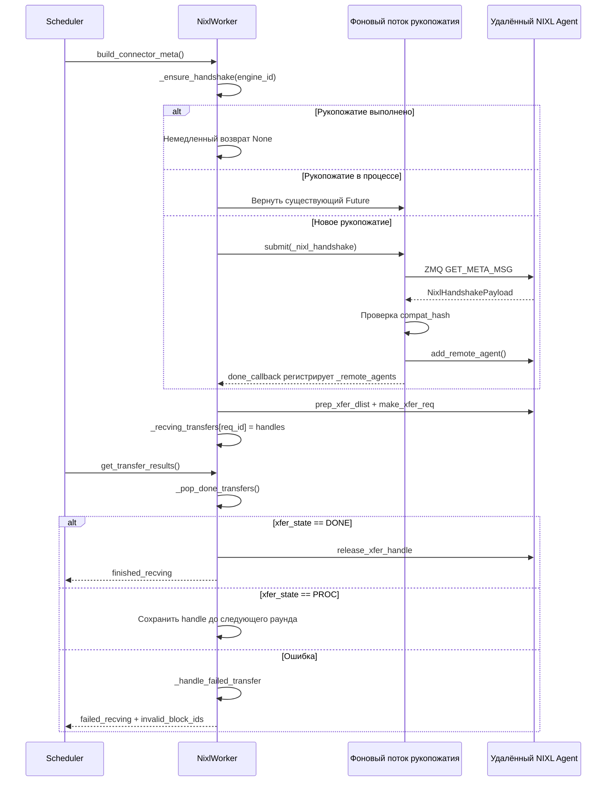

# Глава 9: Реализация спекулятивного декодирования: параллельная верификация кандидатов

В предыдущей главе мы сосредоточились на внутреннем устройстве одного экземпляра инференса: как формируются группы процессов TP/PP/DP/EP, как тензоры разделяются между картами, как EPLB выполняет перебалансировку экспертов на уровне MoE. Но все эти механизмы основаны на одном предположении — prefill и decode работают в одном экземпляре, а KV Cache от начала до конца находится в локальной видеопамяти. Раздельное развёртывание (Prefill-Decode Disaggregation, сокращённо PD-разделение) разрушает это предположение. Оно разделяет prefill и decode на два независимых экземпляра vLLM: экземпляр prefill выполняет только прямой проход по промпту, создаёт KV Cache и передаёт его экземпляру decode; экземпляр decode использует этот KV Cache для продолжения авторегрессионной генерации. Преимущество такого подхода в том, что ресурсы можно независимо конфигурировать в соответствии с характеристиками этапов — prefill является вычислительно-интенсивным, подходит для большого TP и большого batch; decode является интенсивным по доступу к памяти, подходит для малого batch и планирования с низкой задержкой. Они больше не мешают друг другу. Цена этого — необходимость передачи KV Cache между экземплярами. Это и есть главный герой данной главы — KV Connector. Комментарий в заголовке файла vllm/distributed/kv_transfer/kv_connector/v1/base.py уже перечисляет основные примитивы всей абстракции: сторона Scheduler отвечает за привязку метаданных, запрос попаданий в удалённый кэш и решение об асинхронном освобождении блоков; сторона Worker отвечает за фактическую загрузку и сохранение KV. Цель проектирования этого интерфейса — полностью развязать логику планирования верхнего уровня и транспортные бэкенды нижнего уровня (NIXL, Mooncake, MoRIIO). С инженерной точки зрения наибольший риск PD-разделения — не медленная передача, а несогласованность состояний: экземпляр prefill считает, что KV уже отправлен, а экземпляр decode его не получил; или экземпляр decode освободил блок раньше времени, а prefill всё ещё пишет в него. В данной главе мы выясним, как именно эта система коннекторов использует протокол рукопожатия, аренду (lease), heartbeat и механизмы восстановления после сбоев, чтобы закрыть эти граничные случаи.

# I. KVConnectorBase_V1: абстракция двух ролей и контракт метаданных

## Интуитивная модель

KV Connector похож на курьерскую систему между двумя филиалами. Магазин Prefill подготовил полуфабрикат (KV Cache), упаковал и отправил его в магазин Decode для дальнейшей обработки. Но курьерская система не может состоять только из действия «отправить» — ей нужна транспортная накладная (metadata), описывающая, что и куда отправляется; нужен механизм подтверждения получения; а также набор правил тайм-аута, чтобы посылка не застряла навсегда в пути, занимая полку.

Без этой абстракции каждому транспортному бэкенду (NIXL, Mooncake) пришлось бы самостоятельно реализовывать логику планирования, а Scheduler в vLLM должен был бы писать код адаптации для каждого бэкенда. Ценность KVConnectorBase_V1 в том, что он фиксирует этот контракт.

## Две роли: сторона Scheduler и сторона Worker

[FACT:vllm/distributed/kv_transfer/kv_connector/v1/base.py:137-142]определяет две роли коннектора:

```python
class KVConnectorRole(enum.Enum):
    # Connector running in the scheduler process
    SCHEDULER = 0
    # Connector running in the worker process
    WORKER = 1
```

Это разделение не случайно. Процесс Scheduler отвечает за глобальные решения планирования — какие запросы требуют передачи, когда можно освободить блок; процесс Worker отвечает за фактическое перемещение данных. Они взаимодействуют через`KVConnectorMetadata`.

[FACT:vllm/distributed/kv_transfer/kv_connector/v1/base.py:153-158]определяет базовый класс метаданных для направления Scheduler → Worker:

```python
class KVConnectorMetadata(ABC):  # noqa: B024
    """Abstract Metadata used to communicate
    Scheduler KVConnector -> Worker KVConnector.
    """
    pass
```

Обратное направление Worker → Scheduler,[FACT:vllm/distributed/kv_transfer/kv_connector/v1/base.py:161-176]определяет`KVConnectorWorkerMetadata`, который требует реализации метода`aggregate`— потому что в одном шаге движка несколько worker'ов могут возвращать свои метаданные, и их нужно агрегировать перед передачей Scheduler'у.

## Ключевая структура данных: KVConnectorTransferResults

[FACT:vllm/distributed/kv_transfer/kv_connector/v1/base.py:87-96]определяет структуру снимка результатов передачи:

```python
@dataclass
class KVConnectorTransferResults:
    finished_sending: set[str] = field(default_factory=set)
    finished_recving: set[str] = field(default_factory=set)
    failed_recving: set[str] = field(default_factory=set)
```

Обратите внимание на ключевые проектные решения в комментариях:**Неудачные приёмы также появляются в`finished_recving`**. Это делается для того, чтобы Scheduler мог освободить запрос из состояния "ожидание передачи" — даже если передача не удалась, запрос не должен зависнуть навсегда. Информация об ошибке передаётся отдельно через`failed_recving`, и Scheduler на её основе решает, повторить попытку или выполнить деградацию.

## Хуки жизненного цикла: от запроса до освобождения

Весь жизненный цикл коннектора строится вокруг нескольких ключевых хуков. На стороне Scheduler:

- `get_num_new_matched_tokens` [FACT:vllm/distributed/kv_transfer/kv_connector/v1/base.py:485-518]: запрашивает, сколько токенов может попасть в удалённый кэш. В комментарии особо подчёркивается, что "следует учитывать только фактически доступный максимальный префикс" — если некоторые токены недоступны из-за проблем с соединением или вытеснения, их нельзя засчитывать.
- `update_state_after_alloc` [FACT:vllm/distributed/kv_transfer/kv_connector/v1/base.py:520-544]: обновляет состояние после выделения block. В комментарии есть легко упускаемая ловушка — решение о необходимости загрузки должно основываться на`num_external_tokens`, а не на том, пуст ли`blocks`, потому что невыбранные подконнекторы MultiConnector также получают реальные block.
- `request_finished` [FACT:vllm/distributed/kv_transfer/kv_connector/v1/base.py:579-598]: вызывается при завершении запроса, возвращает`True`, что означает, что коннектор берёт на себя ответственность за асинхронное освобождение block.

На стороне Worker:

- `start_load_kv` / `wait_for_layer_load`: послойная загрузка с поддержкой конвейеризации.
- `save_kv_layer` / `wait_for_save`: послойное сохранение.
- `get_transfer_results` [FACT:vllm/distributed/kv_transfer/kv_connector/v1/base.py:396-397]: возвращает статус завершения асинхронной передачи.

[FACT:vllm/distributed/kv_transfer/kv_connector/v1/base.py:192-201]Есть ещё один легко упускаемый, но критически важный дизайн —`requires_kv_delivery`свойство:

```python
@property
def requires_kv_delivery(self) -> bool:
    """Whether this connector hands off KV that must be reliably delivered.
    ...
    """
    return self._kv_transfer_config.is_kv_producer
```

В комментарии объясняется мотивация: если запрос вытесняется до завершения передачи KV, его следует пересчитать, а не позволять ему завершиться и передать уже освобождённые вытеснением block. Только роль producer требует надёжной доставки; потеря best-effort кэша — это всего лишь будущий cache miss.

## Метаданные рукопожатия

[FACT:vllm/distributed/kv_transfer/kv_connector/v1/base.py:145-150]определяет базовый класс метаданных рукопожатия:

```python
class KVConnectorHandshakeMetadata(ABC):  # noqa: B024
    """Metadata used for out of band connector handshake between
    P/D workers. This needs to serializable.
    """
    pass
```

"Out of band" означает, что рукопожатие идёт не по обычному пути запроса, а через прямое взаимодействие между P/D worker. Это закладывает основу для протокола рукопожатия ZMQ в NIXL.

---

# II. Коннектор NIXL: рукопожатие, регистрация и построение дескрипторов

## Интуитивная модель

NIXL (NVIDIA Inference Xfer Library) — это низкоуровневая библиотека передачи от NVIDIA, поддерживающая UCX, GDS и другие бэкенды. Роль NixlBaseConnectorWorker подобна сортировочному центру курьерской компании — сначала нужно установить выделенную линию с сортировочным центром партнёра (рукопожатие), зарегистрировать layout своих стеллажей (зарегистрировать области памяти KV Cache), и только затем можно эффективно забирать и отправлять грузы по адресам.

Без этого механизма при каждой передаче пришлось бы заново согласовывать адреса и устанавливать соединения, а задержка стала бы неприемлемо высокой.

## Разметка памяти: Region и Descriptor

Ключевые концепции NIXL —**region**(область памяти) и**descriptor**(дескриптор). Каждый слой KV Cache регистрируется в NIXL как одна или несколько region, каждая region имеет базовый адрес, длину блока и шаг блока.

[FACT:vllm/distributed/kv_transfer/kv_connector/v1/nixl/base_worker.py:740-751]перечисляет ключевые поля, связанные с region:

```python
# Number of NIXL regions. Currently one region per cache
# (so 1 per layer for MLA, otherwise 2 per layer)
self.num_regions = 0
self.region_mem_types: list[str] = []
self.region_group_ids: list[int] = []
self._uses_region_group_mapping = False
self.region_names: list[str] = []
self.region_num_blocks: list[int] = []
self._mixed_mem_types = False
```

[FACT:vllm/distributed/kv_transfer/kv_connector/v1/nixl/base_worker.py:897-900]далее поясняет источник шага блока:

```python
# Per-region block stride in bytes. Taken from the registered tensor's
# stride(0) so it stays correct under layouts that interleave layers
# within a block (BLHNC/BHLNC), where stride > block_len.
self.block_stride_per_layer = list[int]()
```

Ключевое наблюдение здесь:**block_stride не равен block_len**. При таких чередующихся по слоям layout, как BLHNC/BHLNC, фактический шаг одного block может быть больше длины его полезных данных. Если напрямую использовать block_len в качестве шага, адреса будут читаться неправильно.

## Протокол рукопожатия: ZMQ + хэш совместимости

Рукопожатие — самая сложная часть коннектора NIXL.[FACT:vllm/distributed/kv_transfer/kv_connector/v1/nixl/base_worker.py:974-1128]Метод`_nixl_handshake`в

полностью демонстрирует этот процесс.[FACT:vllm/distributed/kv_transfer/kv_connector/v1/nixl/base_worker.py:988-998]Первый шаг — установка контекста устройства CUDA. Комментарий в

```python
# the first time we connect to a remote agent.
# be careful, the handshake happens in a background thread.
# it does not have an active cuda context until any cuda runtime
# call is made. when UCX fails to find a valid cuda context, it will
# disable any cuda ipc communication, essentially disabling any NVLink
# communication.
if not self.use_host_buffer:
    current_platform.set_device(self.device_id)
```

Копировать

Это очень скрытая ловушка: рукопожатие выполняется в фоновом потоке, и если явно не установить устройство, UCX не найдёт действительный контекст CUDA и молча отключит связь NVLink, деградировав до медленного пути.[FACT:vllm/distributed/kv_transfer/kv_connector/v1/nixl/base_worker.py:1029-1036]：

```python
msg = msgspec.msgpack.encode(
    (GET_META_MSG, remote_pp_rank, remote_rank)
)
# Set receive timeout to 5 seconds to avoid hanging on dead server
sock.setsockopt(zmq.RCVTIMEO, 5000)  # milliseconds
start_time = time.perf_counter()
sock.send(msg)
reply_parts = sock.recv_multipart()
```

Копировать[FACT:vllm/distributed/kv_transfer/kv_connector/v1/nixl/base_worker.py:1042-1045]Тайм-аут в 5 секунд предотвращает бесконечное ожидание после смерти удалённой стороны. Одновременно код использует RTT для оценки смещения часов

, сохраняя минимальный образец RTT — потому что высокий RTT — это лишь шум, искажающий оценку средней точки.[FACT:vllm/distributed/kv_transfer/kv_connector/v1/nixl/base_worker.py:1063-1080]：

```python
assert self.compat_hash is not None
if (
    self.enforce_compat_hash
    and handshake_payload.compatibility_hash != self.compat_hash
):
    raise RuntimeError(
        f"NIXL compatibility hash mismatch. "
        ...
    )
```

Копировать[FACT:vllm/distributed/kv_transfer/kv_connector/v1/nixl/base_worker.py:1372-1376]Хэш совместимости вычисляется в

```python
self.compat_hash = compute_nixl_compatibility_hash(
    self.vllm_config,
    self.backend_name,
    transfer_mode=self._TRANSFER_MODE,
)
```

Копировать`transfer_mode`Обратите внимание, что[FACT:vllm/distributed/kv_transfer/kv_connector/v1/nixl/base_worker.py:163-166]также участвует в хэше — комментарий в

## поясняет: push (WRITE) коннектор и pull (READ) коннектор никогда не должны успешно выполнить рукопожатие.

Асинхронное планирование рукопожатия[FACT:vllm/distributed/kv_transfer/kv_connector/v1/nixl/base_worker.py:824-835]：

```python
self._handshake_initiation_executor = ThreadPoolExecutor(
    # NIXL is not guaranteed to be thread-safe, limit 1 worker.
    max_workers=1,
    thread_name_prefix="vllm-nixl-handshake-initiator",
)
self._ready_requests = queue.Queue[tuple[ReqId, ReqMeta]]()
self._handshake_futures: dict[
    EngineId, Future[tuple[dict[tuple[int, int], str], float]]
] = {}
# Protects _handshake_futures and _remote_agents.
self._handshake_lock = threading.RLock()
```

`max_workers=1`Копировать`_handshake_lock`— потому что NIXL не гарантирует потокобезопасность.`_handshake_futures`защищает`_remote_agents`и

`_ensure_handshake` [FACT:vllm/distributed/kv_transfer/kv_connector/v1/nixl/base_worker.py:1257-1317]— два словаря.

## реализует идемпотентную инициацию рукопожатия: если рукопожатие уже успешно завершено, сразу возвращается None; если рукопожатие выполняется, возвращается существующий Future; иначе отправляется новая задача и регистрируется callback.

Построение дескрипторов: от block ID к NIXL descriptor[FACT:vllm/distributed/kv_transfer/kv_connector/v1/nixl/base_worker.py:172-310]После завершения рукопожатия необходимо построить дескрипторы для каждого запроса.`_compute_desc_ids`Метод

в[FACT:vllm/distributed/kv_transfer/kv_connector/v1/nixl/base_worker.py:226-262]— ядро этого процесса.

```python
# NOTE (NickLucche) With HMA, every kv group has the same number of layers
# and layers from different groups share the same kv tensor.
# eg block_ids=[[1, 2], [3]]->blocks [1, 2] need to be
# read across all regions, same for [3], but group0-group1 blocks will
# always differ (different areas). Therefore we can just flatten the
# block_ids and compute the descs ids for all groups at once.
```

. Комментарий объясняет обработку в сценарии HMA:[FACT:vllm/distributed/kv_transfer/kv_connector/v1/nixl/base_worker.py:285-304]：

```python
elif _is_ssm_spec(spec_type):
    # NOTE (NickLucche) SSM and Attention block regions can
    # be exchanged arbitrarily by manager.  Therefore, descs
    # are laid out as:
    #   [descs_fa (all regions) | descs_ssm (all regions)].
    # num_fa_descs offset must be computed per-engine since
    # P and D can have different num_blocks (and thus
    # different FA desc counts).
```

## Для гибридных SSM-моделей layout дескрипторов сложнее

Копировать[FACT:vllm/distributed/kv_transfer/kv_connector/v1/nixl/base_worker.py:2130-2178]Топология передачи и отображение TP`add_remote_agent`Гетерогенный TP — самый сложный сценарий коннектора NIXL.

Когда D.world_size > P.world_size, несколько D worker читают разные фрагменты KV head из одного и того же P worker. В документации приведён конкретный пример: D TP=4, P TP=2, tp_ratio=2. D-Worker0 читает первую половину KV head из P-Worker0, D-Worker1 читает вторую половину.

Для моделей MLA KV Cache реплицируется между TP worker, поэтому rank_offset всегда равен 0.

## Аренда и heartbeat: предотвращение преждевременного освобождения block

Это один из самых изящных элементов дизайна NIXL-коннектора. После отправки KV экземпляр Prefill не может немедленно освободить block — потому что экземпляр decode может всё ещё читать. Но если никогда не освобождать, видеопамять будет утекать.

Решение — аренда (lease).[FACT:vllm/distributed/kv_transfer/kv_connector/v1/nixl/base_worker.py:528-528]：

```python
kv_lease_duration: int = vllm_config.kv_transfer_config.get_from_extra_config(
    "kv_lease_duration", 30
)
# NOTE (NickLucche): For now we use a hardcoded value for a simpler interface.
self._lease_extension = kv_lease_duration * 2 // 3
```

По умолчанию аренда составляет 30 секунд, каждый heartbeat продлевает её на 20 секунд (2/3).

Обработка heartbeat находится в[FACT:vllm/distributed/kv_transfer/kv_connector/v1/nixl/base_worker.py:3014-3034]：

```python
def _handle_heartbeat(self, payload: str) -> None:
    new_expiry = time.perf_counter() + self._lease_extension
    for req_id in payload.split(","):
        if req_id in self._reqs_to_send:
            old = self._reqs_to_send[req_id]
            self._reqs_to_send[req_id] = max(old, new_expiry)
```

Обратите внимание`max(old, new_expiry)`— heartbeat может только продлить аренду, но не сократить её.

Освобождение после истечения аренды находится в[FACT:vllm/distributed/kv_transfer/kv_connector/v1/nixl/base_worker.py:2986-3012]：

```python
def _reap_expired_send_leases(self, done_sending: set[str]) -> None:
    """Reclaim expired send-side KV leases into ``done_sending``.

    ``_reqs_to_send`` is not ordered by expiry: heartbeats update the
    deadline in place, and mixed TTLs share the map, so a live head
    entry can sit in front of already-expired ones. Scan every entry
    rather than stopping at the first still-live request.
    """
```

Комментарий указывает на легко допускаемую ошибку: нельзя останавливать сканирование при обнаружении первого непросроченного запроса, потому что heartbeat обновляет время истечения на месте, из-за чего map не отсортирован по времени истечения.

## Конечный автомат передачи и восстановление после сбоев

Жизненный цикл передачи управляется через`_pop_done_transfers` [FACT:vllm/distributed/kv_transfer/kv_connector/v1/nixl/base_worker.py:3036-3086]:

```python
for handle in handles:
    try:
        xfer_state = self.nixl_wrapper.check_xfer_state(handle)
        if xfer_state == "DONE":
            res = self.nixl_wrapper.get_xfer_telemetry(handle)
            self.xfer_stats.record_transfer(res)
            self.nixl_wrapper.release_xfer_handle(handle)
        elif xfer_state == "PROC":
            in_progress.append(handle)
        else:
            self._log_failure(
                failure_type="transfer_failed",
                req_id=req_id,
                xfer_state=xfer_state,
            )
```

Передача NIXL имеет три состояния:`DONE`(завершено),`PROC`(выполняется), другие (ошибка).

Обработка ошибок находится в[FACT:vllm/distributed/kv_transfer/kv_connector/v1/nixl/base_worker.py:3103-3127]：

```python
def _handle_failed_transfer(
    self,
    req_id: str,
    handle: int | None,
    failed_req_ids: set[str] | None = None,
    record_failed_transfer: bool = True,
) -> bool:
    if record_failed_transfer:
        self.xfer_stats.record_failed_transfer()
    if failed_req_ids is not None:
        failed_req_ids.add(req_id)
    return handle is None or self._try_release_xfer_handle(req_id, handle)
```

`_try_release_xfer_handle` [FACT:vllm/distributed/kv_transfer/kv_connector/v1/nixl/base_worker.py:3088-3101]Комментарий в критически важен:

```python
except Exception as e:
    # A status error does not guarantee that the backend stopped DMA.
    self._log_failure(
        failure_type="transfer_release_failed",
        msg="Retaining handle and blocks until release succeeds",
        ...
    )
    return False
```

**Ошибка состояния не гарантирует, что бэкенд остановил DMA**. Если освобождение не удалось, необходимо сохранить handle и block до успешного освобождения. Это типичный дизайн в духе «лучше утечка, чем ошибка».

## Обработка block для неудачных запросов

При неудачном приёме,[FACT:vllm/distributed/kv_transfer/kv_connector/v1/nixl/base_worker.py:2876-2891]демонстрирует логику обработки:

```python
for req_id in done_recving:
    meta = self._recving_metadata.pop(req_id, None)
    assert meta is not None, f"{req_id} not found in recving_metadata list"

    # Skip KV sync and post-processing for failed requests
    if req_id in failed_recv_reqs:
        self._pending_recv_notifs.pop(req_id, None)
        # TODO (NickLucche) handle failed transfer for HMA.
        if not self._is_hma_required:
            self._invalid_block_ids.put(set(meta.local_block_ids[0]))
        logger.warning(
            "Skipping KV post-processing for failed request %s",
            req_id,
        )
        continue
```

ID неудачного block помещается в очередь`_invalid_block_ids`, Scheduler извлекает его через`get_block_ids_with_load_errors` [FACT:vllm/distributed/kv_transfer/kv_connector/v1/nixl/base_worker.py:3491-3504]и решает, повторять ли попытку.

## TTL-вытеснение удалённых движков

Долго работающие экземпляры постоянно сталкиваются с новыми удалёнными движками; без очистки память будет бесконечно расти.[FACT:vllm/distributed/kv_transfer/kv_connector/v1/nixl/base_worker.py:3506-3532]В`_evict_stale_engines`реализовано TTL-вытеснение:

```python
def _evict_stale_engines(self) -> None:
    """Scan for and evict remote engines that have exceeded their TTL.

    Called from the main thread in when a new remote engine appears.
    We can only go OOM as we discover and register a new remote, therefore we make
    sure we clean up stale engine data structures before then.
    """
    if self._engine_ttl  self._engine_ttl and eid not in busy:
            self._cleanup_remote_engine(eid)
```

Ключевое ограничение —`busy`множество — движки с активными передачами не могут быть вытеснены.[FACT:vllm/distributed/kv_transfer/kv_connector/v1/nixl/base_worker.py:3534-3546]Комментарий в объясняет причину:

```python
"""Remote engines a transfer is still reading from.

The timestamp is stamped when a read is issued and not refreshed while
it runs, so a transfer that outlives the TTL leaves its engine looking
idle. A peer that has lost its NIC holds one indefinitely.
"""
```

Если сетевая карта на противоположной стороне сломана, передача может зависнуть навсегда, временная метка не будет обновляться, и движок будет выглядеть простаивающим.`busy`Множество явно защищает эту ситуацию.

## Тайминг рукопожатия и передачи

Приведённая ниже диаграмма последовательности показывает ключевое взаимодействие от запроса до завершения передачи:



---

# III. Размышления о дизайне: почему сделано именно так

## Почему рукопожатие асинхронное?

Рукопожатие включает сетевой round-trip и может занимать десятки миллисекунд. При синхронном выполнении оно заблокирует основной цикл Scheduler, повлияв на планирование всех запросов. Асинхронное рукопожатие позволяет Scheduler сначала обработать другие запросы, а по завершении рукопожатия уведомить через callback.

Но асинхронность также приносит сложность:`_handshake_futures`словарь требует защиты блокировкой, в callback нужно обрабатывать как успех, так и неудачу, а также предотвращать повторные рукопожатия.

## Почему используется аренда, а не подсчёт ссылок?

Подсчёт ссылок требует, чтобы экземпляр decode явно уведомил prefill «я закончил чтение». Но если экземпляр decode упадёт, уведомление никогда не придёт, и block в prefill будет утекать навсегда.

Аренда — более надёжное решение: даже если decode упадёт, prefill автоматически освободит ресурсы по истечении аренды. Механизм heartbeat обеспечивает продление аренды в нормальных условиях.

## Почему при ошибке сохраняется handle?

[FACT:vllm/distributed/kv_transfer/kv_connector/v1/nixl/base_worker.py:3088-3101]Комментарий в ясно говорит: ошибка состояния не гарантирует остановку DMA. Если в этот момент освободить handle, DMA может всё ещё записывать данные в освобождённую память, что приведёт к повреждению данных или краху. Лучше временная утечка, чем этот риск.

## Почему TTL-вытеснение проверяет busy?

[FACT:vllm/distributed/kv_transfer/kv_connector/v1/nixl/base_worker.py:3534-3546]Комментарий в раскрывает скрытый сценарий бага: временная метка ставится при инициации чтения и не обновляется во время чтения. Если передача длится дольше TTL, движок выглядит простаивающим, но фактически всё ещё читается. Если в этот момент выполнить вытеснение, активная передача завершится ошибкой.

## Подводные камни в production

1. **Проблема с контекстом CUDA**: рукопожатие выполняется в фоновом потоке, необходимо явно`set_device`, иначе UCX молча отключит NVLink.

2. **Несовпадение хеша совместимости**: версия vLLM, модель, dtype, KV layout, attention backend экземпляров P/D должны полностью совпадать. При несовпадении рукопожатие завершится ошибкой, сообщение об ошибке подскажет, как отключить проверку (но это не рекомендуется).

3. **Истечение аренды**: если экземпляр decode сильно загружен, heartbeat может задерживаться, что приведёт к истечению аренды. В логах появится предупреждение "Releasing expired KV blocks". Можно увеличить`kv_lease_duration`。

4. **Несовпадение TP**: гетерогенный TP требует block-contiguous layout (например, LBHNC). При использовании неконтинуального layout гетерогенный TP завершится ошибкой.

5. **Исчерпание NIXL UAR**：[FACT:vllm/distributed/kv_transfer/kv_connector/v1/nixl/base_worker.py:631-636]предупреждение в комментариях: каждый поток UCX выделяет UAR (doorbell pages) через DevX, чрезмерное использование NIXL UAR исчерпает пространство UAR NIC, что приведёт к сбою NVSHMEM (используемого ядром DeepEP) при инициализации RDMA.

---

# Резюме главы

В этой главе подробно рассмотрены ключевые механизмы системы KV Connector:

1. **KVConnectorBase_V1**определена двусторонняя абстракция ролей на стороне Scheduler и на стороне Worker, через`KVConnectorMetadata`и`KVConnectorTransferResults`реализован обмен метаданными и обратная связь о результатах передачи.

2. **Коннектор NIXL**является наиболее зрелой реализацией: он устанавливает соединение между экземплярами P/D через протокол рукопожатия ZMQ, использует хеш совместимости для предотвращения несоответствия конфигураций и применяет асинхронный пул потоков для избежания блокировки основного цикла.

3. **Механизм аренды и heartbeat**решает проблему временной последовательности освобождения block: prefill после отправки KV не освобождает его немедленно, а ожидает продления heartbeat от decode или истечения аренды.

4. **Восстановление после сбоев**следует принципу «лучше утечка, чем неправильное использование»: при неудачном освобождении handle сохраняется, а ID неудачного block передаётся Scheduler для принятия решения о повторной попытке.

5. **Вытеснение по TTL**предотвращает неограниченный рост состояния удалённых движков при длительной работе, но должно защищать движки с активными передачами.

В следующей главе мы перейдём к другому направлению устранения накладных расходов: ускорение компиляции и CUDA Graph. Когда разделение PD решило проблему использования ресурсов, накладные расходы на запуск одного прямого прохода стали новым узким местом — как с помощью CUDA Graph сжать запуск сотен и тысяч ядер в одно воспроизведение.

# Вопросы для размышления и самопроверки к этой главе

Q1: Если убрать обработку исключений в`_try_release_xfer_handle`и напрямую вызвать`release_xfer_handle`, в каких сценариях это приведёт к повреждению данных? Почему?

**Справочный анализ**：`_try_release_xfer_handle` [FACT:vllm/distributed/kv_transfer/kv_connector/v1/nixl/base_worker.py:3088-3101]В комментариях к явно указано: "A status error does not guarantee that the backend stopped DMA." Если убрать обработку исключений, то когда`release_xfer_handle`выбрасывает исключение, вызывающая сторона будет считать, что освобождение прошло успешно, и продолжит освобождать block. Но на самом деле DMA бэкенда NIXL может всё ещё выполняться, записывая данные в эту память. Как только block будет перераспределён для другого запроса, запись DMA загрязнит KV Cache нового запроса, что приведёт к искажению вывода или NaN. Хуже того, если block будет возвращён в пул видеопамяти и переиспользован другим тензором, DMA может записать по недопустимому адресу и вызвать сбой. Правильный подход — сохранить handle и block и повторить попытку освобождения в следующем раунде`_pop_done_transfers`.

Q2: `_reap_expired_send_leases`В комментариях к сказано: «нельзя останавливать сканирование при обнаружении первого непросроченного запроса». Если изменить на break при обнаружении непросроченного, в каких сценариях это вызовет утечку block?

**Справочный анализ**：`_reqs_to_send`— это обычный dict, а не приоритетная очередь, отсортированная по времени истечения. Обработка heartbeat`_handle_heartbeat` [FACT:vllm/distributed/kv_transfer/kv_connector/v1/nixl/base_worker.py:3014-3034]обновляет время истечения на месте:`self._reqs_to_send[req_id] = max(old, new_expiry)`这意味着，先前添加的请求由于持续收到心跳而可能具有非常晚的过期时间，而排在其后的请求可能已经过期。如果在遇到第一个未过期请求时就 break，那么其后已经过期的请求将永远不会被回收，它们的 block 将持续占用显存。在长时间运行且请求模式混合的场景中（一些请求经常被心跳续期，而另一些请求的 decode 实例已经挂掉），这会累积成严重的显存泄漏。

Q3: `_evict_stale_engines`использует`_engines_with_inflight_transfers`для защиты движков с активными передачами. Если убрать эту защиту, в каких сценариях сетевых сбоев это приведёт к сбою передачи?

**Справочный анализ**：`_engines_with_inflight_transfers` [FACT:vllm/distributed/kv_transfer/kv_connector/v1/nixl/base_worker.py:3534-3546]В комментариях к объясняется ключевой сценарий: "The timestamp is stamped when a read is issued and not refreshed while it runs, so a transfer that outlives the TTL leaves its engine looking idle. A peer that has lost its NIC holds one indefinitely." Предположим, что сетевая карта удалённой стороны отказала, и операция чтения NIXL зависла дольше TTL (по умолчанию 3600 секунд).`_engine_last_active`Временная метка ставится при инициации чтения и не обновляется во время чтения, поэтому движок выглядит уже простаивающим. Если в этот момент`_evict_stale_engines`вытеснит этот движок, будет вызван`_cleanup_remote_engine`для освобождения`dst_xfer_side_handles`и удаления remote agent. Но выполняющийся DMA всё ещё использует эти ресурсы, и после освобождения это приведёт к сбою передачи или даже краху.`busy`Набор явно защищает этот случай, гарантируя, что движки с активными передачами не будут вытеснены.

К этому моменту мы уже увидели, как KV Connector устанавливает надёжный канал передачи данных между экземплярами prefill и decode, а также как он поддерживает согласованность состояния с помощью аренды, heartbeat и механизмов восстановления после сбоев. Но передача между экземплярами — лишь половина истории PD-разделения: когда KV Cache достигает экземпляра decode, движок вывода всё ещё должен эффективно выполнять каждый шаг прямого вычисления внутри одного экземпляра. А накладные расходы на планирование Python и запуск ядер — это следующее узкое место, ограничивающее задержку одного шага. В следующей главе мы перейдём к ускорению компиляции и CUDA Graph, чтобы увидеть, как vLLM устраняет эти накладные расходы с помощью torch.compile и piecewise backend, а также обеспечивает согласованное сосуществование CUDA Graph и динамических форм батчей.
