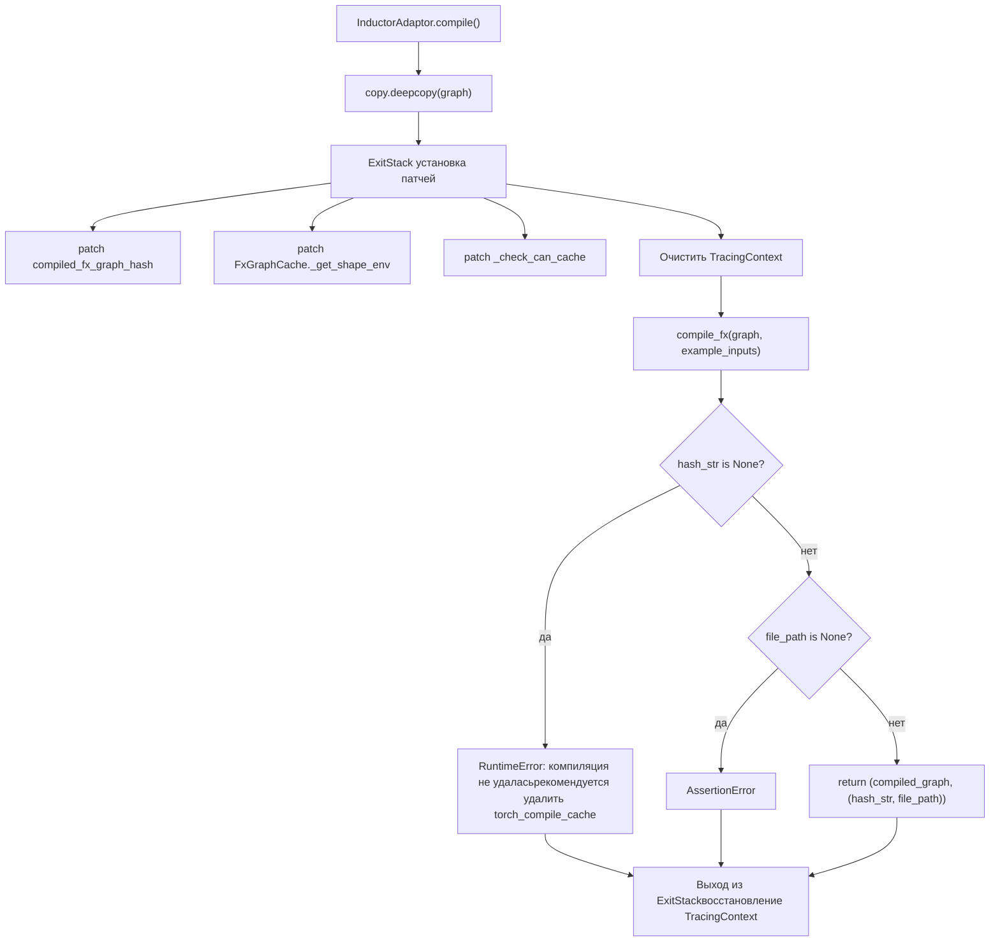

# Глава 10: Квантизация и высокопроизводительные ядра: AWQ, GPTQ и FP8

В предыдущей главе мы видели, как KV Connector через такие коннекторы, как NIXL и Mooncake, эффективно перемещает KV cache между движками Prefill и Decode, позволяя разделённой архитектуре снижать TTFT и повышать utilisation ресурсов. Но даже если передача происходит очень быстро, в авторегрессионном декодировании остаются две фиксированные издержки, которые нельзя устранить алгоритмически: накладные расходы на планирование интерпретатора Python и накладные расходы на запуск ядер GPU. Когда прямой проход модели разбивается на сотни операторов, каждый оператор проходит через вызов функции Python и запуск ядра CUDA, и накладные расходы на стороне CPU足以 заставляют GPU простаивать между двумя вычислениями. В этой главе анализируется, как vLLM использует torch.compile для слияния операторов в статический граф, а затем CUDA Graph для записи всей последовательности запусков ядер в одно воспроизведение, сводя оба типа накладных расходов почти к нулю.

# Кэш компиляции и слой адаптации компилятора: повторное использование результатов компиляции между процессами

## Интуитивная модель

Выгода от ускорения компиляции — «скомпилировать один раз, запускать много раз», но цена — время первой компиляции, которое может достигать нескольких минут. Без кэша при каждом перезапуске сервиса потребуется повторная компиляция, и время холодного старта становится неприемлемым.`CompilerInterface`Этот слой как раз решает вопросы «как сериализовать артефакты компиляции, как идентифицировать их хэшем и как точно попасть в них при следующем запуске». Без него система столкнётся не с крахом, а с деградацией при каждом перезапуске до «первого запуска» — в производственной среде с автомасштабированием это означает, что развёрнутые экземпляры в течение нескольких минут не смогут предоставлять сервис с низкой задержкой.

## Структуры данных и контракты интерфейсов

`CompilerInterface`Определяет абстрактный контракт адаптера компилятора, ядром которого являются четыре метода:`initialize_cache`Отвечает за перенаправление собственного каталога кэша компилятора в каталог кэша vLLM[FACT:vllm/compilation/compiler_interface.py:36-51]；`compute_hash`Собирает информацию о конфигурации, связанной с компилятором, для генерации хэша[FACT:vllm/compilation/compiler_interface.py:53-62]；`compile`Выполняет компиляцию и возвращает вызываемый объект и дескриптор[FACT:vllm/compilation/compiler_interface.py:64-95]；`load`Восстанавливает артефакт компиляции из дескриптора[FACT:vllm/compilation/compiler_interface.py:97-103]。

Ключевой дизайн здесь —`compile`возвращает кортеж из двух элементов`(callable, handle)`。`callable`— это результат компиляции, напрямую вызываемый в текущем процессе;`handle`— это «учётные данные для восстановления при следующем запуске», и документация явно требует, чтобы это был «plain Python object, preferably a string or a file path»[FACT:vllm/compilation/compiler_interface.py:81-81]. Это разделение позволяет пути попадания в кэш и пути первой компиляции идти по совершенно разному коду — при попадании вообще не нужен`compile`, нужен только`load`。

`compile_range`Параметр несёт семантику динамических форм. Комментарий поясняет, что он «could be concrete size (if compile_sizes is provided), e.g. [4, 4] or a range [5, 8]», и «Right now we only support one variable in ranges for all inputs, which is the batchsize (number of tokens) during inference»[FACT:vllm/compilation/compiler_interface.py:74-74]. Это ключевое ограничение стратегии компиляции vLLM: все динамические формы сводятся к одной переменной — числу токенов.

## Сценарий: полный поток одного запроса на компиляцию

Предположим, сервис запускается впервые,`InductorAdaptor.compile`вызывается. Сначала он увеличивает счётчик компиляций[FACT:vllm/compilation/compiler_interface.py:477-489], затем входит в тщательно сконструированный стек патчей.

Первый шаг — глубокая копия графа. Комментарий указывает: «inductor can inplace modify the graph, so we need to copy it»[FACT:vllm/compilation/compiler_interface.py:500-502], это защитный дизайн — после неудачной компиляции исходный граф всё ещё можно использовать для повторной попытки.

Второй шаг — установка серии monkey-patch.`hijacked_compile_fx_inner`Оборачивает внутреннюю функцию компиляции Inductor, после завершения компиляции извлекает хэш из`inductor_compiled_graph._fx_graph_cache_key`извлекает хэш[FACT:vllm/compilation/compiler_interface.py:512-536]。`hijack_compiled_fx_graph_hash`перехватывает саму функцию вычисления хэша[FACT:vllm/compilation/compiler_interface.py:538-542]. Зачем «перехватывать» хэш? Потому что vLLM нужно компилировать отдельно вне контекста трассировки Dynamo, а вычисление хэша Inductor зависит от этого контекста.

Третий шаг —`_check_can_cache`патч, он напрямую возвращает результат, не выполняя никаких проверок[FACT:vllm/compilation/compiler_interface.py:544-551]. Комментарий объясняет мотивацию: "Inductor refuses to cache the graph outside of Dynamo tracing context, and also disables caching for graphs with high-order ops. For vLLM, in either case, we want to cache the graph"[FACT:vllm/compilation/compiler_interface.py:544-551]。

Четвёртый шаг — очистка контекста трассировки. Это самое тонкое место: vLLM из`PiecewiseCompileInterpreter`внутренне вызывает`compile_fx`, в этот момент Dynamo`FakeTensorMode`и входные данные подграфа`FakeTensorMode`не согласованы,`detect_fake_mode()`вызовет сбой утверждения[FACT:vllm/compilation/compiler_interface.py:615-622]. Код сохраняет`TracingContext`, затем обнуляет его и регистрирует обратный вызов для восстановления при выходе[FACT:vllm/compilation/compiler_interface.py:623-630]。



## Проектные соображения: AlwaysHitShapeEnv и согласованность кэша

`AlwaysHitShapeEnv`Этот класс заслуживает отдельного анализа. Его docstring прямо указывает мотивацию: vLLM выполняет компиляцию байт-кода Dynamo только один раз, но должен многократно запускать компиляцию Inductor с разными формами плюс одной универсальной формой; компиляция для конкретной формы происходит вне контекста Dynamo, в этот момент Inductor не предоставляется shape environment, что приводит к сбою поиска в кэше кода Inductor[FACT:vllm/compilation/compiler_interface.py:114-131]。

Решение — предоставить фиктивное shape environment, которое "всегда попадает":`evaluate_guards_expression`всегда возвращает`True` [FACT:vllm/compilation/compiler_interface.py:144-145]，`get_pruned_guards`возвращает пустой список[FACT:vllm/compilation/compiler_interface.py:144-145]，`produce_guards_expression`возвращает пустую строку[FACT:vllm/compilation/compiler_interface.py:147-159]. Комментарий честно признаёт, что эти методы "obtained by trial-and-error until it works"[FACT:vllm/compilation/compiler_interface.py:137-142]— это хрупкое место, связанное с внутренней реализацией PyTorch, и наиболее подверженное проблемам при обновлении PyTorch.

Состав хэша кэша также критичен.`get_inductor_factors`Собирает три категории факторов: состояние системы`CacheBase.get_system()`, состояние PyTorch`torch_key()`, а также конфигурацию Inductor и functorch[FACT:vllm/compilation/compiler_interface.py:165-185]. Обратите внимание, что конфигурация functorch собирается в контексте`patch(_get_vllm_functorch_config())`, это гарантирует, что "конфигурация во время компиляции и ключ кэша всегда согласованы" — комментарий явно указывает, что это делается для согласованности[FACT:vllm/compilation/compiler_interface.py:188-189]и`set_functorch_config()`Обеспечить согласованность`get_inductor_factors()`. Если эти два места не согласованы, возникнет рассогласование "при компиляции использовалась конфигурация A, а ключ кэша вычислен по конфигурации B", что приведёт к попаданию в кэш, но загрузке неправильного артефакта.[FACT:vllm/compilation/compiler_interface.py:147-159]Производственные подводные камни:

это backport для torch < 2.10.0`_patch_standalone_compile_atomic_save`. Он изменяет[FACT:vllm/compilation/compiler_interface.py:205-243]на использование`CompiledArtifact.save()`для записи в бинарном формате, комментарий поясняет цель: "preventing corrupt cache files when multiple processes compile concurrently"`write_atomic`. В сценарии одновременного холодного запуска нескольких реплик несколько процессов будут параллельно записывать один и тот же файл кэша; неатомарная запись создаст обрезанный файл, и последующие процессы, прочитав повреждённый артефакт, будут вести себя непредсказуемо.[FACT:vllm/compilation/compiler_interface.py:208-210]PiecewiseBackend: компиляция по диапазонам форм и диспетчеризация во время выполнения

# Интуитивная модель

## это диспетчерский центр между компиляцией и выполнением. Он компилирует "один FX-подграф" в "вызываемые объекты для нескольких диапазонов форм" и во время выполнения выбирает наиболее подходящий из них на основе фактического числа токенов. Без него либо все формы шли бы через одну универсальную компиляцию (неоптимальная производительность), либо каждая форма компилировалась бы отдельно (взрыв времени компиляции).

`PiecewiseBackend`Структуры данных: RangeEntry и диапазон компиляции

## Ключевая структура данных —

, она связывает флаг`RangeEntry`и`compile_range`、`compiled`вместе`runnable`поддерживает[FACT:vllm/compilation/piecewise_backend.py:80-83]。`PiecewiseBackend`Построение диапазона компиляции состоит из двух шагов. Сначала обрабатывается`range_entries: dict[Range, RangeEntry]` [FACT:vllm/compilation/piecewise_backend.py:166-171]。

(точные размеры), для каждого размера генерируется`compile_sizes`одноточечный интервал`Range(start=size, end=size)`. Обратите внимание, что здесь для строки[FACT:vllm/compilation/piecewise_backend.py:166-171]сразу выбрасывается`"cudagraph_capture_sizes"`, и поясняется "should be handled in`NotImplementedError`— это явное объявление границы ответственности. Затем обрабатывается`post_init_cudagraph_sizes`" [FACT:vllm/compilation/piecewise_backend.py:166-171](интервалы), для каждого интервала генерируется entry`compile_ranges`поддерживает два взаимоисключающих режима, конструктор принудительно обеспечивает это через XOR-утверждение[FACT:vllm/compilation/piecewise_backend.py:173-173]。

`PiecewiseBackend`: режим компиляции (есть graph, нет compiled_runnables) идёт через[FACT:vllm/compilation/piecewise_backend.py:117-119]; режим предкомпиляции (нет graph, есть compiled_runnables) идёт через`compile_all_ranges()` [FACT:vllm/compilation/piecewise_backend.py:193-194]. Этот дизайн позволяет холодному и горячему запуску использовать один и тот же класс, различаются только источники данных.`load_all_ranges()` [FACT:vllm/compilation/piecewise_backend.py:193-194]Сценарии использования: от компиляции к диспетчеризации во время выполнения

## Этап компиляции

**обходит все range entry, для каждого нескомпилированного entry вызывает**：`compile_all_ranges`записывает событие трассировки`_log_compile_start`. Ключевое ветвление — в построении аргументов: если это одноточечный размер, вызывается[FACT:vllm/compilation/piecewise_backend.py:252-256]для генерации FakeTensor конкретной формы`create_concrete_args`; иначе вызывается[FACT:vllm/compilation/piecewise_backend.py:258-261]для прямого переиспользования метаданных placeholder из графа`get_fake_args_from_graph`реализация раскрывает детали конкретизации символьных форм. Она создаёт[FACT:vllm/compilation/piecewise_backend.py:262-263]。

`create_concrete_args`с`ShapeEnv`, затем обходит узлы placeholder. Для входов типа`FakeTensorMode` [FACT:vllm/compilation/piecewise_backend.py:54]использует`SymInt`для замены всех свободных символов на`concretize`; для типа`size` [FACT:vllm/compilation/piecewise_backend.py:47-52]необходимо одновременно конкретизировать shape, stride, storage_offset и с помощью`Tensor`вычислить требуемую длину хранилища, затем через`compute_required_storage_length`восстановить тензор`as_strided`Восстановить тензор[FACT:vllm/compilation/piecewise_backend.py:64-73]. Почему нельзя изменить только shape? Потому что stride и storage_offset также могут содержать символы, и все три должны быть согласованы, иначе`as_strided`выйдет за границы.

**Диспетчеризация во время выполнения**：`__call__`— это горячий путь. Если существует`sym_shape_indices`, извлечь runtime-форму из`args`, затем вызвать[FACT:vllm/compilation/piecewise_backend.py:357-362]для поиска. Логика поиска имеет приоритет: сначала проверить, попадает ли в точный`_find_range_for_shape`, при попадании вернуть этот точечный интервал`compile_sizes`; иначе перебрать[FACT:vllm/compilation/piecewise_backend.py:342-355]в поисках интервала, содержащего эту форму`compile_ranges`Копирование[FACT:vllm/compilation/piecewise_backend.py:342-355]。

```mermaid
flowchart TD
    call["PiecewiseBackend.__call__(*args)"] --> has_sym{"sym_shape_indices не пуст?"}
    has_sym -->|"да"| get_shape["runtime_shape = args[sym_shape_indices
```

## 〔Проектные выводы и архитектурные компромиссы〕

> **[Design Inference & Architectural Trade-offs]**
> `to_bytes`: когда pickle встречает`reducer_override`, сначала вызывается`CachingAutotuner`, затем сериализуется`obj.prepare_for_pickle()`. Зачем нужен этот хук?[FACT:vllm/compilation/piecewise_backend.py:209-218]Внутри хранит артефакты компиляции Triton и состояние времени выполнения; прямой pickle может завершиться неудачей или создать неиспользуемые повторно объекты;`CachingAutotuner`очевидно, преобразует объект в сериализуемую чистую форму.`prepare_for_pickle`При сериализации также временно включается

, что перекликается с логикой в`bundled_autograd_cache` [FACT:vllm/compilation/piecewise_backend.py:222]— когда`_get_vllm_functorch_config`не включён, эта конфигурация равна`VLLM_USE_MEGA_AOT_ARTIFACT`, при сериализации принудительно устанавливается в`False` [FACT:vllm/compilation/compiler_interface.py:160-161], чтобы гарантировать упаковку артефактов.`True`— это путь горячего запуска, он утверждает, что каждый range может быть найден в

`load_all_ranges`соответствующий key, иначе выбрасывается ошибка со списком доступных key`compiled_runnables`. Это сообщение об ошибке спроектировано очень практично — сразу перечисляет доступные key, что упрощает диагностику несоответствия версий кэша.[FACT:vllm/compilation/piecewise_backend.py:329-339]Обёртка CUDA Graph: захват, воспроизведение и вложенная диспетчеризация

# Интуитивная модель

## CUDA Graph записывает «последовательность запусков ядер» в статический граф, после чего каждое воспроизведение требует лишь одного вызова API.

— 这是捕获与回放执行器。它面临的主要难点是：vLLM 中批大小是动态的，而 CUDA Graph 要求固定的输入地址。解决方案是“按档位 batch descriptor 捕获”——为每个形状档位记录一张图，运行时通过 descriptor 在表中查找并回放。`CUDAGraphWrapper`Структуры данных: CUDAGraphEntry и контракт диспетчеризации

## Содержит три ключевых поля:

`CUDAGraphEntry`в качестве ключа диспетчеризации`batch_descriptor`— захваченный объект графа[FACT:vllm/compilation/cuda_graph.py:128-135]、`cudagraph`— выход при захвате (сохраняется как слабая ссылка для экономии памяти)[FACT:vllm/compilation/cuda_graph.py:128-135]、`output`используется только в режиме отладки для проверки совпадения адресов входа при воспроизведении[FACT:vllm/compilation/cuda_graph.py:128-135]。`input_addresses`Документация класса точно описывает контракт диспетчеризации: при инициализации выделяется runtime mode (FULL или PIECEWISE)[FACT:vllm/compilation/cuda_graph.py:128-135]。

`CUDAGraphWrapper`; во время выполнения из forward context принимаются runtime_mode и batch_descriptor и «blindly trust them»[FACT:vllm/compilation/cuda_graph.py:158-158]; если runtime_mode равен NONE или не совпадает, напрямую вызывается[FACT:vllm/compilation/cuda_graph.py:158-158]; иначе выполняется захват или воспроизведение[FACT:vllm/compilation/cuda_graph.py:158-158]Документация также особо оговаривает границу: «CUDAGraphWrapper does not store persistent buffers or copy any runtime inputs into that buffers for replay»[FACT:vllm/compilation/cuda_graph.py:158-158]。

. Это означает, что управление входными буферами — ответственность вызывающей стороны; wrapper отвечает только за сам граф.[FACT:vllm/compilation/cuda_graph.py:164-164]Сценарий: один захват и одно воспроизведение

## Путь захвата

**: когда**срабатывает и runtime_mode совпадает, сначала проверяется доступность forward context. Если недоступен (например, forward визуального энкодера), напрямую вызывается нижележащая функция`__call__`. Это ключевая ветвь для мультимодальных сценариев — forward ViT не идёт через CUDA Graph.[FACT:vllm/compilation/cuda_graph.py:232-233]Затем берутся

и`batch_descriptor`. Если mode равен NONE или не совпадает, напрямую вызывается`cudagraph_runtime_mode` [FACT:vllm/compilation/cuda_graph.py:242-244]. Этот дизайн «не совпало — пропускаем напрямую» позволяет сосуществовать вложенным wrapper: FULL wrapper снаружи, PIECEWISE wrapper внутри, во время выполнения активируется только один.[FACT:vllm/compilation/cuda_graph.py:246-256]Если у entry

равен None, выполняется захват. Сначала вызывается`cudagraph`для проверки корректности`validate_cudagraph_capturing_enabled()`, затем записываются адреса входа[FACT:vllm/compilation/cuda_graph.py:279], создаётся[FACT:vllm/compilation/cuda_graph.py:281-284]В контексте захвата есть несколько ключевых операций. Если`torch.cuda.CUDAGraph()` [FACT:vllm/compilation/cuda_graph.py:285]。

включён, то патчатся`gc_disable`и`gc.collect`. Комментарий объясняет причину: в режиме piecewise каждый слой должен захватить один граф, повторный GC сделает захват крайне медленным, поэтому «only run gc for the first graph, and disable gc for the rest»`torch.accelerator.empty_cache` [FACT:vllm/compilation/cuda_graph.py:288-303]. Затем устанавливается graph pool id[FACT:vllm/compilation/cuda_graph.py:289-294], и синхронизируется поток копирования offloader[FACT:vllm/compilation/cuda_graph.py:305-308]Настоящий захват выполняется в контексте[FACT:vllm/compilation/cuda_graph.py:310-312]。

. После захвата вызывается`torch.cuda.graph(cudagraph, pool=..., stream=...)`во избежание ошибок неjoin-нутых потоков`self.runnable(*args, **kwargs)` [FACT:vllm/compilation/cuda_graph.py:315-321]. Если`get_offloader().join_after_forward()`включён, output преобразуется в слабую ссылку для экономии памяти[FACT:vllm/compilation/cuda_graph.py:322-326]. Наконец, entry сохраняет слабую ссылку output и объект графа`weak_ref_output`, но[FACT:vllm/compilation/cuda_graph.py:327-334]возвращается исходный output, а не слабая ссылка[FACT:vllm/compilation/cuda_graph.py:338-339]— комментарий подчёркивает, что это нужно, чтобы PyTorch корректно управлял памятью во время захвата**Путь воспроизведения**: если у entry уже есть граф, в режиме отладки проверяется совпадение адресов входа[FACT:vllm/compilation/cuda_graph.py:343-346]。

**, затем синхронизируется offloader**, вызывается[FACT:vllm/compilation/cuda_graph.py:348-357]и возвращается[FACT:vllm/compilation/cuda_graph.py:359-361], вызов`entry.cudagraph.replay()`и возврат`entry.output` [FACT:vllm/compilation/cuda_graph.py:362-363]。

## Проектное размышление: почему выход должен быть слабой ссылкой, а возвращаемое значение — сильной

Это`CUDAGraphWrapper`— самое неинтуитивное место в`output`управляется пулом cudagraph PyTorch[FACT:vllm/compilation/cuda_graph.py:320]. Если entry хранит сильную ссылку на output, то видеопамять, занятая этим графом, никогда не освободится; но если во время захвата преобразовать её в слабую ссылку, PyTorch может освободить память до завершения захвата, что приведёт к сбою захвата. Поэтому код внутри блока захвата использует слабую ссылку[FACT:vllm/compilation/cuda_graph.py:334], в entry хранится слабая ссылка[FACT:vllm/compilation/cuda_graph.py:338], но возвращаемое значение функции — сильная ссылка[FACT:vllm/compilation/cuda_graph.py:346]. Это «тройственное состояние ссылок» — точный баланс между безопасностью памяти и эффективностью видеопамяти.

Ещё один заслуживающий внимания дизайн —`_all_instances`этот`WeakSet` [FACT:vllm/compilation/cuda_graph.py:173-176]. Он позволяет`clear_all_graphs`за один раз очистить графы всех wrapper'ов[FACT:vllm/compilation/cuda_graph.py:173-176], для экстренного освобождения при нехватке видеопамяти. Использование`WeakSet`вместо обычного множества сделано для того, чтобы не препятствовать сборке мусора wrapper'а — иначе сам wrapper будет утекать.

Производственные подводные камни:`__getattr__`в режиме отладки выбрасывает ошибку с контекстом для несуществующего атрибута[FACT:vllm/compilation/cuda_graph.py:211-217]. Это кажется мелочью, но при отладке «почему не удался вызов некоторого метода» возможность увидеть строковое описание runnable, обёрнутого wrapper'ом, гораздо полезнее, чем голый`AttributeError`.

# Проектное размышление: развязка компиляции и CUDA Graph

Проектный документ явно фиксирует мотивацию этого рефакторинга. Ранняя piecewise-компиляция была предназначена для поддержки захвата piecewise CUDA Graph, исключая операторы, не поддерживающие CUDA Graph (в основном attention)[FACT:docs/design/cuda_graphs.md:25]. Позже была добавлена поддержка full CUDA Graph, но «this tight coupling between compilation and cudagraph capture led to an all-or-nothing experience with little flexibility»[FACT:docs/design/cuda_graphs.md:25]。

После рефакторинга поставлены четыре цели: явно различать prefill/mixed и uniform-decode батчи и захватывать их отдельно[FACT:docs/design/cuda_graphs.md:25-25]; развязать логику захвата CUDA Graph и компиляцию, чтобы «capturing piecewise and full cudagraphs using the same compiled graph»[FACT:docs/design/cuda_graphs.md:25-25]; диспетчеризация во время выполнения по составу батча[FACT:docs/design/cuda_graphs.md:25-25]; централизованное управление для снижения сложности[FACT:docs/design/cuda_graphs.md:25-25]。

`BatchDescriptor`— ключевая структура ключа диспетчеризации, содержит`num_tokens`、`num_reqs`、`uniform`、`has_lora`четыре поля[FACT:docs/design/cuda_graphs.md:86-93]。`uniform`флаг особенно важен — многие бэкенды attention поддерживают full CUDA Graph только при uniform батче[FACT:docs/design/cuda_graphs.md:95-95]. Документ также предвещает возможное расширение этой структуры, например добавление`uniform_query_len`для поддержки нескольких длин uniform decode[FACT:docs/design/cuda_graphs.md:95-95]。

Приоритет диспетчеризации —`FULL > PIECEWISE > None`, если ключ диспетчеризации отсутствует, происходит откат к режиму NONE для eager-выполнения[FACT:docs/design/cuda_graphs.md:112-115]. Эта стратегия «деградация вместо ошибки» гарантирует выполнение любой комбинации батчей, различается лишь производительность.

`AttentionCGSupport`перечисление квантифицирует возможности CUDA Graph бэкенда, значения`ALWAYS=3 > UNIFORM_BATCH=2 > UNIFORM_SINGLE_TOKEN_DECODE=1 > NEVER=0` [FACT:docs/design/cuda_graphs.md:153-162]. Смешанные attention-модели (например, mamba mixer) берут минимум возможностей всех бэкендов и на основании этого деградируют режим CUDA Graph[FACT:docs/design/cuda_graphs.md:173-175]. Этот дизайн развязывает «декларацию возможностей» и «выбор режима» — новому бэкенду достаточно объявить возможности, стратегия деградации сработает автоматически.

# Резюме главы

# Размышления и самопроверка главы

Q1: если убрать`_check_can_cache`патч ([FACT:vllm/compilation/compiler_interface.py:544-551]), позволив Inductor самому решать, кэшировать ли, в каких сценариях это приведёт к инвалидации кэша компиляции? Почему в комментарии сказано «Inductor refuses to cache the graph outside of Dynamo tracing context»?

**Эталонный разбор**：`_check_can_cache`возвращает напрямую, не выполняя никаких проверок; комментарий поясняет, что Inductor отказывается кэшировать в двух случаях: вне контекста трассировки Dynamo и если граф содержит высокоуровневые операторы[FACT:vllm/compilation/compiler_interface.py:544-551]. Процесс компиляции vLLM как раз вне контекста Dynamo (`compile_fx`вызывается`PiecewiseCompileInterpreter`, и код явно очищает`TracingContext` [FACT:vllm/compilation/compiler_interface.py:623-625]). Если убрать патч, Inductor решит «некэшируемо», и каждая загрузка будет перекомпилировать, время холодного старта деградирует с секунд до минут. Что ещё более скрыто: поскольку vLLM полагается на`hijacked_compile_fx_inner`для извлечения`hash_str`, если путь кэша пропущен,`hash_str`может быть None, что вызовет[FACT:vllm/compilation/compiler_interface.py:640-652]RuntimeError. Это объясняет, почему в комментарии подчёркивается «vLLM today assumes and requires the monkey-patched functions to get hit»[FACT:vllm/compilation/compiler_interface.py:596-598]。

Q2: `CUDAGraphWrapper`при захвате преобразует output в слабую ссылку и сохраняет в entry ([FACT:vllm/compilation/cuda_graph.py:338]), но возвращает сильную ссылку ([FACT:vllm/compilation/cuda_graph.py:346]). Если и возвращаемое значение сделать слабой ссылкой, в каких сценариях произойдёт краш?

**Эталонный разбор**: во время захвата`output`управляется пулом cudagraph PyTorch[FACT:vllm/compilation/cuda_graph.py:320]. Если возвращаемое значение является слабой ссылкой, объект, полученный вызывающей стороной, может быть немедленно собран сборщиком мусора после выхода из блока захвата — поскольку в этот момент никакая сильная ссылка его не удерживает. PyTorch во время захвата требует, чтобы output оставался живым для корректного установления соответствия с пулом памяти; как только он будет собран, при последующем воспроизведении`entry.output`указывающая на него слабая ссылка станет недействительной,`replay()`объект, возвращённый после, может быть уже перезаписан или освобождён. Комментарий явно говорит: "we need to return the output, rather than the weak ref of the output, so that pytorch can correctly manage the memory during cuda graph capture"[FACT:vllm/compilation/cuda_graph.py:343-345]. Этот дизайн представляет собой точный баланс между "сильной ссылкой на этапе захвата и слабой ссылкой на этапе хранения".

Q3: В`PiecewiseBackend._find_range_for_shape`（[FACT:vllm/compilation/piecewise_backend.py:342-355]) поиск точного размера имеет приоритет над поиском по диапазону. Предположим,`compile_sizes=[8]`、`compile_ranges=[Range(1,16)]`, во время выполнения shape=8, какая запись будет выбрана? Если поменять приоритет местами, какие будут последствия?

**Справочный разбор**: текущая логика сначала проверяет`runtime_shape in self.compile_sizes`, при совпадении возвращает`Range(start=8, end=8)`точечную запись[FACT:vllm/compilation/piecewise_backend.py:342-355]. Эта запись скомпилирована с`create_concrete_args`, форма полностью конкретизирована, ядро Triton может выполнить максимальную специализацию (например, в`set_inductor_config`для точечного размера включается`max_autotune` [FACT:vllm/compilation/compiler_interface.py:747-754]). Если поменять приоритет местами, shape=8 попадёт в запись диапазона`Range(1,16)`— это универсальная версия, скомпилированная с символьными формами, с субоптимальной производительностью. Что ещё серьёзнее,`compile_sizes`обычно происходит из`cudagraph_capture_sizes`, эти размеры как раз являются теми позициями, которые должен захватывать CUDA Graph; если во время выполнения диспетчеризация идёт на универсальную запись, захваченный CUDA Graph граф не будет соответствовать диспетчеризованному runnable, что может привести к несоответствию форм при воспроизведении. Поэтому приоритет точного совпадения — это не только выбор производительности, но и требование корректности.

Следующая глава перейдёт к квантизации и пользовательским ядрам, чтобы посмотреть, как vLLM вмешивается в контроль точности уже на этапе загрузки весов и с помощью высокоспециализированных операторов действительно превращает выгоду от квантизации в рост пропускной способности.

В этой главе проанализированы два уровня механизма ускорения компиляции в vLLM. Первый уровень — CompilerInterface и PiecewiseBackend: первый определяет контракт адаптации компилятора и стратегию хеширования кэша, используя AlwaysHitShapeEnv для обхода проблемы отсутствия контекста Dynamo; второй компилирует отдельный подграф FX в несколько позиций форм, а во время выполнения выполняет диспетчеризацию по числу токенов. Второй уровень — CUDAGraphWrapper: он захватывает CUDA Graph по позициям BatchDescriptor, реализует вложенную диспетчеризацию через сопоставление runtime mode, позволяя режимам FULL и PIECEWISE сосуществовать на одном скомпилированном графе. Развязка этих двух уровней является ядром данной рефакторизации — артефакты компиляции могут быть переиспользованы обоими режимами CUDA Graph, а CUDA Graph может работать независимо от компиляции. Однако компиляция и захват графа решают проблему накладных расходов на планирование; точность весов самой модели и эффективность операторов остаются другой основной линией оптимизации. Следующая глава перейдёт к квантизации и пользовательским ядрам, чтобы посмотреть, как vLLM разбирает конфигурацию квантизации, выполняет преобразование форматов FP8/INT4/AWQ/GPTQ и т.д. при загрузке весов и с помощью _custom_ops и ядер Triton дополнительно выжимает производительность аппаратного обеспечения.
