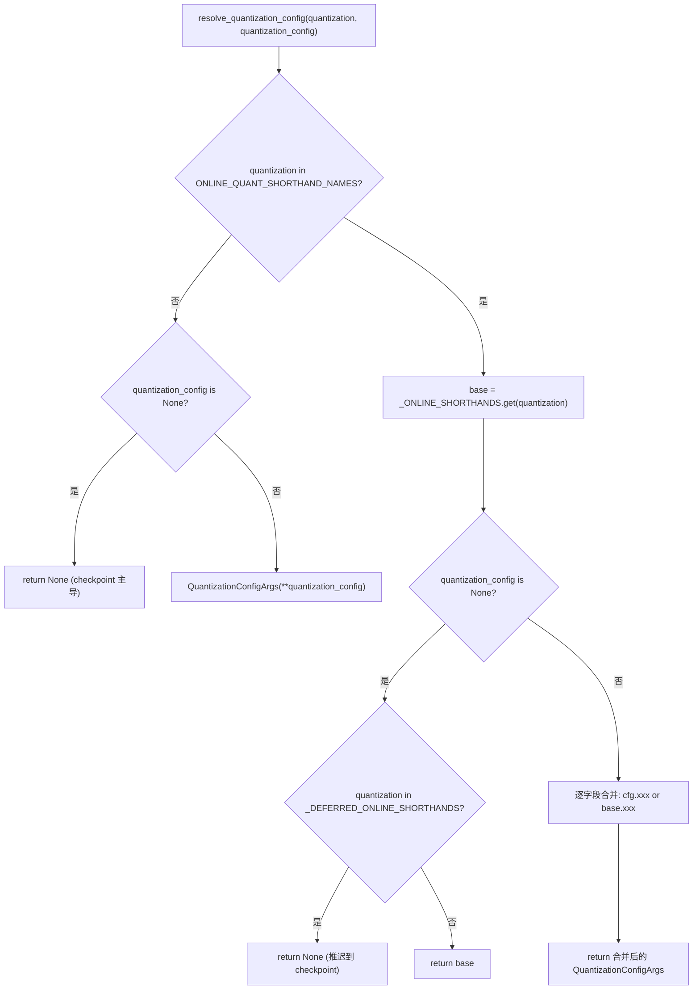
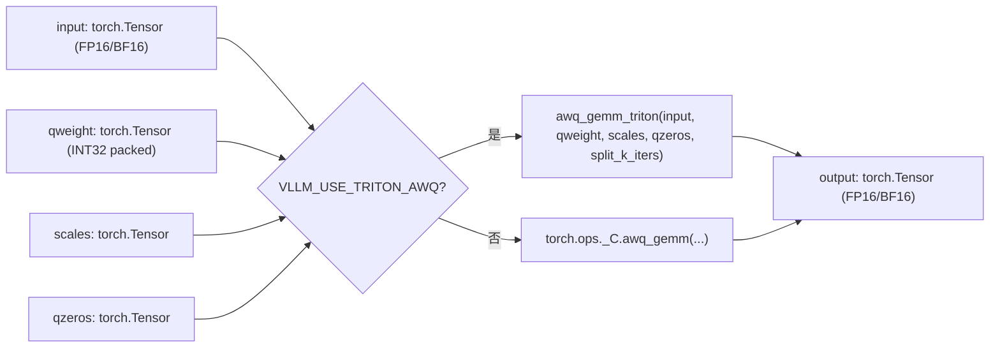
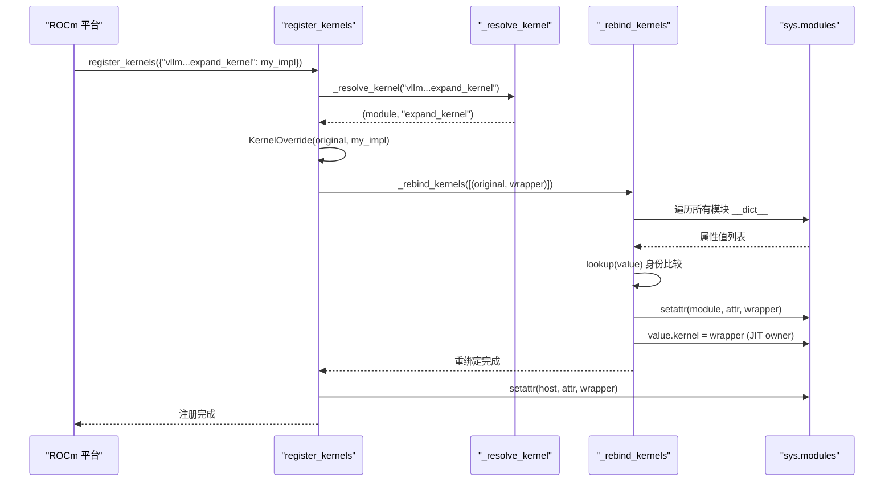

# Глава 11: Квантизация и пользовательские ядра: от загрузки весов до высокопроизводительных операторов

В предыдущей главе мы увидели, как torch.compile и CUDA Graph довели накладные расходы на планирование Python и запуск ядер до минимума. Но как бы быстро ни было планирование, если сами веса имеют формат FP16, а матричное умножение использует универсальный GEMM, аппаратные вычислительные возможности всё ещё сдерживаются пропускной способностью видеопамяти и неэффективными операторами. Квантизация и пользовательские ядра — это другая ортогональная основная линия оптимизации: первая снижает точность уже на этапе загрузки весов, вторая действительно превращает выгоду от квантизации в пропускную способность. Эта глава начинается с точки входа разбора конфигурации квантизации и доходит до регистрации операторов в _custom_ops и диспетчеризации ядер Triton.

# 11.1 Конфигурация квантизации: от строки CLI до QuantKey

## Интуитивная модель

Роль модуля конфигурации квантизации подобна переводчику меню в ресторане. Пользователь на входе говорит "я хочу fp8_per_tensor" (строка CLI), а кухне нужен точный номер рецепта (`QuantKey`). Переводчик должен обработать три типа входных данных: чистые сокращения CLI, метаданные квантизации, прилагаемые к checkpoint, и комбинированные сценарии, где оба叠加. Без этого слоя перевода кухня получит кучу неоднозначных строк и не сможет решить, какое ядро вызывать.

## Структуры данных и компоновка памяти

Основные структуры данных —`QuantSpec`и`QuantizationConfigArgs`. Первая описывает ключи квантизации весов и активаций для одного типа слоя (linear или MoE), вторая — видимая пользователю конфигурация верхнего уровня.

[FACT:vllm/config/quantization.py:73-99]

```python
@config
class QuantSpec:
    weight: QuantKeyField = None
    activation: QuantKeyField = None

    def __str__(self) -> str:
        def quant_key_str(quant_key: QuantKey | None) -> str:
            if quant_key is None:
                return "None"
            return next(
                (
                    name
                    for name, known_quant_key in QUANT_KEY_NAMES.items()
                    if known_quant_key == quant_key
                ),
                str(quant_key),
            )
        return quant_key_str(self.weight)
```

`weight`и`activation`оба являются необязательными`QuantKey`。`None`означает «откат к собственному значению по умолчанию класса метода» — обычно наследуется от checkpoint, а в сценарии онлайн-квантования это означает отсутствие квантования[FACT:vllm/config/quantization.py:74-74]。`QuantKey`сам по себе является сложным типом, содержащим объявления`NamedTuple`и`ClassVar[GroupShape]`, pydantic не может напрямую его интроспектировать, поэтому автор использовал`GetPydanticSchema`для внедрения пользовательского валидатора`_coerce_quant_key`, который унифицированно нормализует строки или`QuantKey`[FACT:vllm/config/quantization.py:60-69]。

`QuantizationConfigArgs`Структура полей заслуживает внимания[FACT:vllm/config/quantization.py:102-126]：

- `linear` / `moe`: они применяются соответственно к`LinearBase`и`FusedMoEFactory`слоям;
- `ignore`: список имён слоёв, пропускаемых при квантовании; онлайн-квантование также поддерживает подстановку fnmatch;
- `targets`: послойное переопределение онлайн-квантования; ключом может быть точное имя слоя,`re:`регулярное выражение с префиксом или шаблон fnmatch; значение взаимоисключающе с`linear`/`moe`.

`targets`Взаимоисключение`linear`/`moe`и`model_validator`обеспечивается[FACT:vllm/config/quantization.py:172-179]. Это ограничение не формализм:`targets`идёт по пути послойного переопределения,`linear`/`moe`идёт по пути глобальных значений по умолчанию; одновременное наличие обоих делает неопределённым, «какой именно spec использует конкретный слой».

## Пошагово: один разбор`--quantization fp8_per_tensor`

Сценарий: пользователь передаёт в командной строке`--quantization fp8_per_tensor`и одновременно через`--quantization-config`указывает активационное квантование для слоёв MoE.

Первый шаг:`resolve_quantization_config`вызывается с аргументами — строкой CLI и словарём конфигурации[FACT:vllm/config/quantization.py:233-235]. Сначала он проверяет, находится ли`quantization`в`ONLINE_QUANT_SHORTHAND_NAMES`— этот кортеж содержит все сокращённые имена плюс один`"online"` [FACT:vllm/config/quantization.py:216-222]。

Второй шаг:`fp8_per_tensor`попадает в таблицу сокращений,`base`разбирается как`_ONLINE_SHORTHANDS["fp8_per_tensor"]`, то есть и linear, и moe используют`kFp8StaticTensorSym` [FACT:vllm/config/quantization.py:188-190]。

Третий шаг:`quantization_config`непусто, конструируется как объект`QuantizationConfigArgs`. Затем вступает логика слияния[FACT:vllm/config/quantization.py:267-268]: каждое поле определяется с помощью`quantization_config.xxx or base.xxx`— поля, явно заданные пользователем, имеют приоритет; незаданные наследуют значения по умолчанию из сокращения. Здесь используется`or`, а не`if is not None`, намеренно:`QuantSpec`и пустой список оба falsy, семантически «не задано» и «пусто» эквивалентны.

Четвёртый шаг: если`quantization`отсутствует в таблице сокращений (например, это собственный`awq`из checkpoint) и`quantization_config`равно`None`, функция напрямую возвращает`None` [FACT:vllm/config/quantization.py:256-257]. Это означает «не накладывать онлайн-квантование»; метод квантования из checkpoint остаётся главным.

Есть легко упускаемая ветка:`_DEFERRED_ONLINE_SHORTHANDS`содержит`mxfp4`и`mxfp8` [FACT:vllm/config/quantization.py:233-235]. Эти два имени являются одновременно и сокращениями CLI, и именами методов квантования checkpoint. Когда пользователь передаёт только`--quantization mxfp4`без`quantization_config`, функция возвращает`None`, а не`base` [FACT:vllm/config/quantization.py:267-268], откладывая решение на метаданные checkpoint — только если в checkpoint нет информации о квантовании, происходит откат к онлайн-сокращению.



## Размышления о дизайне и подводные камни

`_coerce_spec`Валидатор обрабатывает тонкий сценарий: когда`linear`или`moe`получает строку, сначала проверяется`_ONLINE_SHORTHANDS`; при совпадении извлекается spec соответствующего поля; при несовпадении строка трактуется как одно имя`QuantKey`[FACT:vllm/config/quantization.py:130-139]. Это означает, что`linear="fp8_per_tensor"`и`linear="fp8_per_tensor_static"`идут двумя разными путями — первый является сокращением полной конфигурации, второй — отдельным ключом квантования. Если в сокращении это поле равно`None`(например, в`int8_per_channel_weight_only`нет поля`linear`), выбрасывается явное`ValueError`, а не молчаливый возврат`None` [FACT:vllm/config/quantization.py:130-139]。

Частая ловушка в продакшене:`targets`регулярные ключи в`_validate_targets`предварительно компилируются и проверяются[FACT:vllm/config/quantization.py:166-167], но ключи-шаблоны fnmatch не проверяются. Если пользователь написал шаблон fnmatch, который никогда не совпадёт ни с одним слоем, ошибки не будет — просто этот слой останется неквантованным; при диагностике нужно проверять, действительно ли совпадают имена слоёв.

# 11.2 `_custom_ops`: регистрация операторов и fake-реализации

## Интуитивная модель

`_custom_ops.py`— это слой адаптации между vLLM и низкоуровневыми операторами CUDA/C++, как таможня. В пространстве имён`torch.ops._C`PyTorch регистрируются скомпилированные операторы C++, но прямой вызов их имеет три проблемы: наборы операторов различаются на разных платформах (CUDA/ROCm/CPU/XPU),`torch.compile`нужны fake-реализации для вывода формы выходных данных, часть операторов требует предварительной обработки параметров на стороне Python.`_custom_ops`инкапсулирует все эти проблемы единообразно.

## Структуры данных и механизм регистрации

При загрузке модуля сначала вызывается`current_platform.import_kernels()` [FACT:vllm/_custom_ops.py:25-26], чтобы уровень платформы мог импортировать свою библиотеку операторов. Затем определяется`register_fake`— под`TYPE_CHECKING`это пустой декоратор; во время выполнения из`torch.library`импортируется[FACT:vllm/_custom_ops.py:25-26]。

Основная задача fake-реализации — позволить`torch.compile`на этапе трассировки знать форму и dtype выходных данных оператора без фактического выполнения. На примере`scaled_fp4_quant`:

[FACT:vllm/_custom_ops.py:90-100]

```python
if hasattr(torch.ops, "_C") and hasattr(torch.ops._C, "scaled_fp4_quant"):

    @register_fake("_C::scaled_fp4_quant")
    def _scaled_fp4_quant_fake(
        input: torch.Tensor,
        input_scale: torch.Tensor,
        is_sf_swizzled_layout: bool,
    ) -> tuple[torch.Tensor, torch.Tensor]:
        n = input.shape[-1]
        m = input.numel() // n
        return create_fp4_output_tensors(m, n, input.device, is_sf_swizzled_layout)
```

Обратите внимание на защиту`hasattr`: fake-реализация определяется только тогда, когда платформа действительно зарегистрировала`_C::scaled_fp4_quant`. Это гарантирует, что импорт модуля на CPU или старом GPU не упадёт из-за отсутствия оператора.

`create_fp4_output_tensors`демонстрирует детали раскладки памяти выходных данных FP4-квантования[FACT:vllm/_custom_ops.py:69-87]. Когда`is_sf_swizzled_layout=True`, тензор scale должен быть расположен в тайлах 128x4, как требуется Tensor Core: число строк округляется вверх до кратного 128, число столбцов (`n // 16`) округляется вверх до кратного 4, каждые 4 float8_e4m3 упаковываются в один int32[FACT:vllm/_custom_ops.py:55-64]. В комментарии явно указано, что ядро NVFP4-квантования явно обнуляет все padding-элементы scale, поэтому отдельное ядро нулевой инициализации не требуется[FACT:vllm/_custom_ops.py:60-61]。

## Пошагово: поток вызова одного AWQ GEMM

Сценарий: модель загрузила AWQ-квантованные веса; при прямом проходе нужно выполнить матричное умножение активаций и квантованных весов.

Первый шаг: вызывается`awq_gemm` [FACT:vllm/_custom_ops.py:587-592]. Функция сначала проверяет переменную окружения`VLLM_USE_TRITON_AWQ`. Если она истинна, отложенно импортируется`awq_gemm_triton`и вызывается — это чисто Triton-путь реализации, используемый на платформах без поддержки операторов CUDA или в сценариях отладки.

Второй шаг: путь по умолчанию вызывает`torch.ops._C.awq_gemm`, передавая input, qweight, scales, qzeros и`split_k_iters` [FACT:vllm/_custom_ops.py:598-598]。

Третий шаг: если`torch.ops._C.awq_gemm`существует, fake-реализация зарегистрирована[FACT:vllm/_custom_ops.py:601-616]. Форма, возвращаемая fake:`(split_k_iters, num_in_feats, qweight.size(1) * 8)`затем`.sum(0)`— это точно моделирует форму промежуточного результата split-K и итоговую форму после редукции.`qweight.size(1) * 8`из способа упаковки AWQ: каждый int32 хранит 8 4-битных весов.

Четвёртый шаг,`awq_dequantize`идёт по аналогичному пути[FACT:vllm/_custom_ops.py:553-559], но у fake-реализации другой вывод формы:`out_c = qout_c * 8`, поскольку после деквантизации число столбцов увеличивается в 8 раз[FACT:vllm/_custom_ops.py:587-592]。

Функции repack серии Marlin демонстрируют другой паттерн.`gptq_marlin_repack`fake-реализация вычисляет`pack_factor = 32 // num_bits`, выходная форма —`(size_k // 16, size_n * 16 // pack_factor)` [FACT:vllm/_custom_ops.py:1103-1119]. Здесь`16`— это Marlin tile size,`size_k // 16`означает, что измерение K разбивается по tile. В версии для MoE`gptq_marlin_moe_repack`на уровне Python в цикле по каждому expert вызывается repack для одного expert[FACT:vllm/_custom_ops.py:1154-1172], и утверждается`size_k % 16 == 0`— это жёсткое ограничение формата Marlin.



## Проектные соображения и подводные камни

fake-реализация должна полностью совпадать по выходной форме с реальным оператором, иначе`torch.compile`трассируемый граф при выполнении столкнётся с несовпадением форм.`create_fp4_output_tensors`В комментарии особо подчёркивается «Must match the C++ scaled_fp4_quant_func allocation exactly when padded_n is None»[FACT:vllm/_custom_ops.py:69-74]. Это легко ошибочное место: если на стороне C++ изменили логику выделения памяти, а fake не синхронизировали, скомпилированный граф упадёт при воспроизведении CUDA Graph.

Другая ловушка —`torch.library.custom_op`правила алиасинга.`safeFusedQuantizeNv`В комментарии указано, что torch 2.12+ не разрешает выходу пользовательского оператора быть алиасом любого входа, поэтому автор изменил возвращаемый тензор на in-place параметр[FACT:vllm/_custom_ops.py:4650-4655]. Такой подход «изменение формы API ради обхода ограничений фреймворка» очень распространён в слое адаптации операторов, и при отладке нужно обращать внимание, согласуется ли объявление`mutates_args`с фактическим поведением.

`CPUDNNLGEMMHandler`демонстрирует другой способ управления ресурсами: указатель handler хранится в int64 tensor,`__del__`при вызове`release_dnnl_matmul_handler`освобождает[FACT:vllm/_custom_ops.py:3708-3717]. Хранение указателя в tensor нужно, чтобы Python не оптимизировал его как целое число — это классический приём низкоуровневой привязки.

# 11.3 Планирование ядер Triton:`KernelOverride`и кросс-модульная перепривязка

## Интуитивная модель

Роль планировщика ядер Triton похожа на систему подмены должностей в компании. Когда некоторая платформа (например, ROCm) хочет заменить своим реализации ядра Triton в ядре vLLM, нельзя напрямую менять основной код — это загрязнит upstream.`dispatcher`позволяет платформе зарегистрировать замену, а затем незаметно подменить все ссылки на исходное ядро заменой. Без этого механизма каждой платформе пришлось бы поддерживать собственный fork, и при слиянии изменений upstream возникали бы постоянные конфликты.

## Структуры данных и layout памяти

Основная структура данных —`_registry`словарь и`KernelOverride`класс[FACT:vllm/triton_utils/dispatcher.py:29-36]。

`KernelOverride`ключевые поля[FACT:vllm/triton_utils/dispatcher.py:50-61]：

- `_impl`: функция реализации платформы;
- `arg_names`: кортеж имён параметров, зеркально отражающий исходное ядро, используется для привязки по ключевым словам при launch;
- `constexprs`: объявления constexpr, унаследованные от исходного ядра;
- `func`: указывает на функцию реализации, используется для интроспекции при warmup;
- `_forward_by_name`: булев флаг, определяющий, передавать ли параметры при launch по ключевым словам или позиционно.

`_forward_by_name`Логика вычисления`inspect.signature(impl).parameters`такова: сравнить`arg_names`с[FACT:vllm/triton_utils/dispatcher.py:50-61]исходного ядра на полное равенство. Если равны, значит имена параметров реализации совпадают с ядром, и можно безопасно передавать по ключевым словам; иначе необходимо передавать позиционно в порядке параметров исходного ядра.

## Step-by-Step: одна`register_kernels`перепривязка

Сценарий: платформа ROCm при инициализации вызывает`register_kernels({"vllm.v1.sample.rejection_sampler.expand_kernel": my_expand_impl})`。

Первый шаг,`register_kernels`проходит по overrides, для каждого имени вызывает`_resolve_kernel` [FACT:vllm/triton_utils/dispatcher.py:162-166]。`_resolve_kernel`разбивает имя по последнему`.`на имя модуля и имя атрибута[FACT:vllm/triton_utils/dispatcher.py:83-94]. Если первая буква последнего сегмента имени модуля заглавная, значит ядро принадлежит некоторому классу (JIT warmup owner), нужно сначала импортировать родительский модуль, затем`getattr`получить класс и вернуть`(类, 属性名)`; иначе импортировать сам модуль и вернуть`(模块, 属性名)`。

Второй шаг, получив объект исходного ядра, построить`KernelOverride`wrapper и записать в`_registry` [FACT:vllm/triton_utils/dispatcher.py:167-169]。

Третий шаг,`_rebind_kernels`выполняет сканирование всех модулей[FACT:vllm/triton_utils/dispatcher.py:97-144]. Он обходит`sys.modules`всех модулей в`__dict__`, для каждого значения атрибута выполняет сравнение по идентичности — заметьте,`is`, а не`==`, потому что некоторые значения атрибутов (например,`PlaceholderModule`sentinel) при hash/eq могут вызвать импорт или исключение[FACT:vllm/triton_utils/dispatcher.py:116-123]。

Четвёртый шаг, для атрибутов, совпавших с исходным ядром, напрямую`setattr`заменить на wrapper[FACT:vllm/triton_utils/dispatcher.py:125-135]. Для JIT warmup owner (объектов, у которых атрибут экземпляра`kernel`указывает на исходное ядро), заменить`value.kernel`и очистить кэшированный`_kernel_arg_names`, чтобы привязка launch заново выводилась из wrapper[FACT:vllm/triton_utils/dispatcher.py:138-139]。

Пятый шаг,`_rebind_kernels`после завершения только тогда заменить атрибут в месте определения на wrapper[FACT:vllm/triton_utils/dispatcher.py:170-174]. В комментарии объясняется важность порядка: если сначала заменить место определения, при сканировании исходное ядро уже не будет найдено[FACT:vllm/triton_utils/dispatcher.py:170-171]。



## Проектные соображения и подводные камни

`KernelOverride.__getitem__`возвращает`self._launch`, что делает`kernel[grid](**kwargs)`такой стандартный синтаксис launch Triton прозрачным для wrapper[FACT:vllm/triton_utils/dispatcher.py:63-74]。`_launch`Логика пересылки[FACT:vllm/triton_utils/dispatcher.py:63-74]делится на три случая`_forward_by_name`: при наличии позиционных аргументов они передаются напрямую;`RuntimeError`если истинно, передача по ключевым словам; иначе проверяется, есть ли в kwargs имена параметров, неизвестные исходному ядру, и если есть — выбрасывается

, если нет — значения извлекаются в порядке параметров исходного ядра и передаются позиционно.`RuntimeError`Это важная защита: если имена параметров, реализованные платформой, не совпадают с именами в ядре, и вызывающая сторона передаёт параметр, который реализация не распознаёт, молчаливое игнорирование приведёт к трудно диагностируемым ошибочным результатам. Явное сообщение об ошибке позволяет выявить проблему уже на этапе регистрации.

Одна ловушка в производственной среде:`_rebind_kernels`Сканирование в  имеет сложность O(число модулей × число атрибутов × число ядер). Для крупных моделей`sys.modules`может быть тысячи модулей, каждый с сотнями атрибутов. Хотя это выполняется только один раз при инициализации, при большом числе зарегистрированных ядер время запуска заметно возрастает.`lookup`Функция  использует линейный поиск вместо хеш-поиска, и комментарий объясняет причину — некоторые значения атрибутов не хешируемы[FACT:vllm/triton_utils/dispatcher.py:116-123]. Это типичный компромисс «корректность важнее производительности».

Ещё одна ловушка:`_resolve_kernel`Определение того, является ли атрибут атрибутом класса, выполняется по принципу «первая буква последнего сегмента имени модуля заглавная»[FACT:vllm/triton_utils/dispatcher.py:83-94]. Если имя модуля случайно начинается с заглавной буквы (что не соответствует соглашениям именования Python, но синтаксически допустимо), оно будет ошибочно определено как класс. Это дизайн по принципу «соглашение важнее конфигурации», опирающийся на внутренние соглашения об именовании vLLM.

# Размышления о дизайне

Два уровня механизмов — конфигурация квантизации и регистрация операторов — совместно образуют «поверхность регулировки точность-производительность» в vLLM.`QuantizationConfigArgs`Дизайн  отражает разделение «намерения пользователя» и «значения по умолчанию метода»:`None`означает не «не квантовать», а «позволить классу метода решить самому». Такое отложенное решение позволяет одной и той же конфигурации адаптироваться как к квантизации checkpoint, так и к онлайн-квантизации.

`_custom_ops`Паттерн fake-реализации  является стандартом`torch.compile`экосистемы, но уникальность vLLM заключается в повсеместном использовании`hasattr`guard-ов. Это позволяет одному и тому же модулю импортироваться на CUDA, ROCm, CPU, XPU без падения, ценой необходимости трёх фрагментов кода для каждого оператора: Python-обёртки, fake-реализации и платформенного guard-а.

Кросс-модульная перепривязка Triton dispatcher — это радикальное решение. Она не полагается на хуки импорта Python или`__getattr__`, а напрямую сканирует и заменяет все ссылки. Преимущество такого подхода — полнота: независимо от того, в сколькие места ядро было`from mod import kernel`скопировано, оно будет заменено; недостаток — хрупкость: любой новый способ хранения ссылки на ядро (например, захват замыканием) может избежать сканирования.

# Резюме главы

# Вопросы для размышления и самопроверки к этой главе

Q1: В`resolve_quantization_config`, если убрать ветку`_DEFERRED_ONLINE_SHORTHANDS`(то есть когда`quantization in _DEFERRED_ONLINE_SHORTHANDS`возвращать`base`вместо`None`), что произойдёт при загрузке модели, checkpoint которой содержит`quant_method: "mxfp4"`, а пользователь передаёт только`--quantization mxfp4`?

**Эталонный разбор**：`_DEFERRED_ONLINE_SHORTHANDS`Замысел дизайна  — дать приоритет методу квантизации из checkpoint[FACT:vllm/config/quantization.py:233-235]. Если убрать эту ветку,`mxfp4`попадёт в`_ONLINE_SHORTHANDS`и вернёт`base`(то есть`QuantSpec(weight=kMxfp4Static)`）[FACT:vllm/config/quantization.py:198-210]. В этом случае конфигурация онлайн-квантизации перекроет метод квантизации checkpoint, а веса checkpoint хранятся в формате`mxfp4`— если`kMxfp4Static`онлайн-конфигурации не полностью совпадает с фактическим форматом checkpoint (например, различается раскладка scale), загрузка весов завершится ошибкой или даст неверные результаты. Более скрытый случай: в checkpoint`mxfp4`может использоваться другой group size или scale dtype, значения по умолчанию онлайн-конфигурации не совпадут с ними, что приведёт к снижению точности инференса без сообщения об ошибке.

Q2: `KernelOverride._launch`В  , если`_forward_by_name`равно`False`и вызывающая сторона передаёт kwargs, содержащий имя параметра, неизвестное исходному ядру, код выбросит`RuntimeError`. Если убрать эту проверку и заменить её молчаливым игнорированием неизвестных параметров, в каких сценариях это приведёт к трудно диагностируемым проблемам?

**Эталонный разбор**：`_forward_by_name`равное`False`означает, что имена параметров платформенной реализации не совпадают с исходным ядром, и необходимо пересылать позиционно[FACT:vllm/triton_utils/dispatcher.py:50-61]. Если вызывающая сторона передаёт параметр, неизвестный исходному ядру (например, вышестоящий код добавил новый опциональный параметр), молчаливое игнорирование приведёт к потере значения этого параметра. В сценарии с Triton-ядром это обычно означает, что какой-то constexpr или измерение grid не был передан, и ядро может запуститься со значениями по умолчанию — результатом может стать неверный результат вычисления, а не падение. Поскольку ошибочные результаты Triton-ядер часто проявляются как числовые отклонения, а не исключения, диагностика крайне сложна. Явное`RuntimeError`позволяет выявить проблему уже при первом launch[FACT:vllm/triton_utils/dispatcher.py:63-74]。

Q3: `_rebind_kernels`После замены атрибута  у JIT warmup owner выполняется`kernel`. Если убрать эту строку, в каких случаях это приведёт к ошибке привязки при launch?`value.__dict__.pop("_kernel_arg_names", None)`Эталонный разбор

**: JIT warmup owner кэширует**, используемый при launch для привязки kwargs к параметрам ядра`_kernel_arg_names`. После замены[FACT:vllm/triton_utils/dispatcher.py:138-139]на wrapper,`kernel`wrapper-а может отличаться от исходного ядра (если имена параметров платформенной реализации различаются,`arg_names`wrapper-а по-прежнему зеркалирует исходное ядро, но`arg_names`может быть`_forward_by_name`). Если не очистить кэш, механизм warmup продолжит использовать старый список имён параметров для привязки, тогда как логика launch wrapper-а может ожидать иной способ привязки. Конкретно,`False`при`KernelOverride._launch`равном`_forward_by_name`извлекает значения в порядке`False`, и если кэшированный`self.arg_names`не совпадает с[FACT:vllm/triton_utils/dispatcher.py:79-80]wrapper-а, порядок извлечённых параметров будет нарушен, что приведёт к получению ядром неверных значений параметров.`_kernel_arg_names`Следующая глава переключится на продвинутые возможности инференса: как префиксный кэш переиспользует KV-блоки, как спекулятивное декодирование ускоряет большую модель с помощью маленькой, и как LoRA позволяет динамически переключать адаптеры без изменения весов базовой модели.`arg_names` 不一致，提取出的参数顺序会错乱，导致内核收到错误的参数值。

下一章将转向高级推理特性，看前缀缓存如何复用 KV block、投机解码如何用小模型加速大模型、以及 LoRA 如何在不改基座权重的前提下动态切换适配器。

В этой главе разобраны два уровня инфраструктуры квантования и пользовательских ядер в vLLM. Первый уровень — разбор конфигурации квантования: QuantSpec и QuantizationConfigArgs унифицируют CLI-строки, метаданные checkpoint и поуровневые переопределения в QuantKey, resolve_quantization_config обрабатывает раскрытие сокращений и слияние полей, а _DEFERRED_ONLINE_SHORTHANDS решает сценарии конфликта имён. Второй уровень — адаптация операторов: _custom_ops через защиту hasattr и register_fake реализует кросс-платформенную регистрацию операторов, fake-реализация точно повторяет выходные формы реальных операторов для поддержки torch.compile; dispatcher через KernelOverride и полное сканирование модулей обеспечивает платформенную замену ядер Triton. Оба уровня совместно поддерживают реализацию выгод от квантования — от загрузки весов до прямого вычисления. Далее мы перейдём к продвинутым функциям инференса, повышающим пропускную способность и снижающим задержку: как автоматическое префиксное кэширование переиспользует KV между запросами, как спекулятивное декодирование ускоряет генерацию с помощью черновой модели и как LoRA динамически переключает адаптеры.
