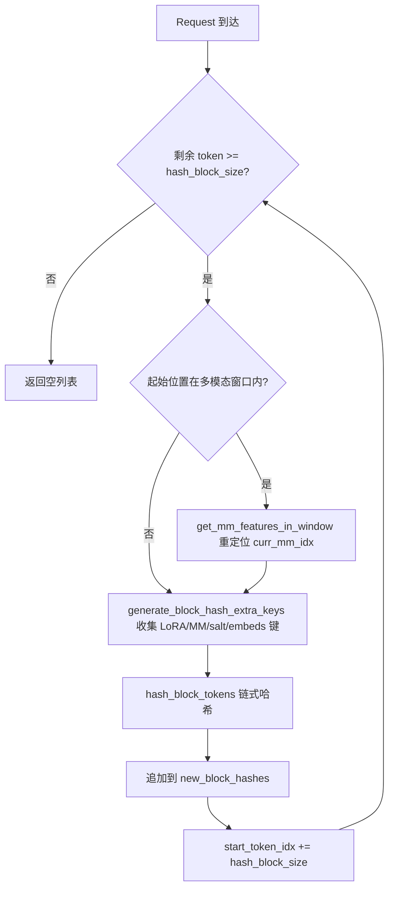
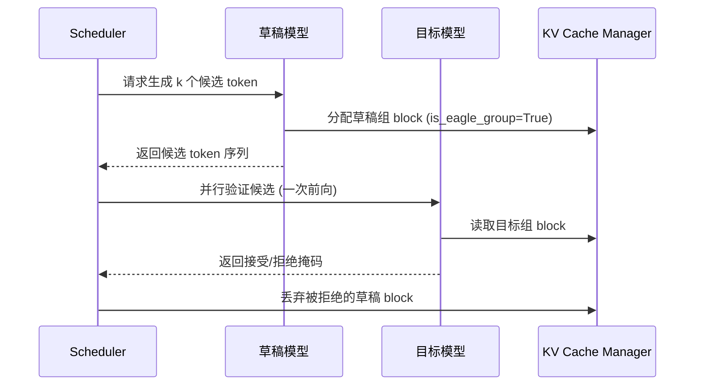

# Глава 12: Профилирование производительности и бенчмаркинг: ключевые метрики инференса

В предыдущей главе мы углубились в систему квантования и инфраструктуру пользовательских операторов vLLM, увидели, как разбирается конфигурация квантования и выбирается соответствующее ядро, а также как схемы FP8, INT4, AWQ, GPTQ выполняют преобразование при загрузке весов. Кроме того, мы выяснили, как _custom_ops регистрирует операторы CUDA, механизм планирования ядер Triton и как融合-ядра MoE сокращают обращения к видеопамяти. Эти низкоуровневые возможности проложили путь к более продвинутым оптимизациям инференса. В этой главе мы сосредоточимся на трёх продвинутых функциях инференса vLLM: автоматическом префиксном кэшировании (APC), спекулятивном декодировании и LoRA. Они кажутся независимыми, но на самом деле разделяют одну и ту же низкоуровневую инфраструктуру — хеширование KV-блоков, распределение слотов планировщиком и динамическое внедрение весов при выполнении модели. Ключ к их пониманию — понять, как они, не нарушая семантику страничной адресации PagedAttention, доводят «переиспользование» до предела.

# 12.1 Префиксное кэширование: как block hash отпечатывает префикс

## Интуитивная модель

Префиксное кэширование похоже на «общий сборник выдержек» в библиотеке: два студента пишут сочинения, оба начинают с цитаты одного и того же древнего текста, учителю достаточно один раз проверить этот фрагмент, а затем отдельно посмотреть различающиеся части. Без него каждый запрос должен с нуля выполнять prefill всего промпта, и в сценариях вопросов-ответов по длинным документам вычислительные ресурсы расходуются многократно.

## Структура данных: отображение из token в block hash

Ядро префиксного кэширования — «как определить, что префиксы двух запросов совпадают». Ответ vLLM: разбить последовательность token на блоки и вычислить для каждого блока цепной хеш. Цепной означает, что хеш N-го блока включает хеши предыдущих N-1 блоков, поэтому один block hash уникально отпечатывает весь префикс «от начала последовательности до конца этого блока».

Носителем хеша является`BlockHash`, он определён как`bytes`от`NewType`, а не голый`bytes`, чтобы на уровне типов предотвратить ошибочное использование[FACT:vllm/v1/core/kv_cache_utils.py:59-62]. Когда нужно объединить block hash с KV cache group id в ключ словаря, vLLM не использует кортеж, а напрямую приклеивает 4-байтовый big-endian group id к хвосту байтов хеша[FACT:vllm/v1/core/kv_cache_utils.py:75-76]：

```python
def make_block_hash_with_group_id(block_hash, group_id):
    return BlockHashWithGroupId(block_hash + group_id.to_bytes(4, "big", signed=False))
```

> **[Design Inference & Architectural Trade-offs]**
> Это типичная оптимизация «избегания выделения кортежей»: на горячем пути для каждого поиска блока нужно построить ключ, кортеж приносит дополнительные накладные расходы на выделение Python-объекта и хеширование, тогда как конкатенация байтовых строк выполняется на уровне C, и байтовая строка сама по себе хешируема. При извлечении срезом`key[:-4]`и`int.from_bytes(key[-4:])`восстанавливаются[FACT:vllm/v1/core/kv_cache_utils.py:87-89]。

Саму хеш-функцию выполняет`hash_block_tokens`, она передаёт хеш-функции родительский block hash, кортеж token id текущего блока и дополнительные ключи[FACT:vllm/v1/core/kv_cache_utils.py:650-680]. Заметьте, что родительский хеш первого блока — не`None`, а глобальный`NONE_HASH`：

```python
if not parent_block_hash:
    parent_block_hash = NONE_HASH
```

[FACT:vllm/v1/core/kv_cache_utils.py:674-675]。`NONE_HASH`Выбор seed скрывает проектное решение по безопасности: для криптографических хешей вроде SHA-256 seed фиксирован`"vllm-none-hash"`, так что разные процессы vLLM вычисляют одинаковый хеш для одинакового содержимого и могут совместно использовать префиксный кэш между узлами; а для некриптографических хешей вроде xxhash seed случаен для каждого процесса, потому что предсказуемый seed позволил бы злоумышленнику офлайн предвычислить коллизионные блоки[FACT:vllm/v1/core/kv_cache_utils.py:105-126]。`resolve_none_hash_seed`реализует это ветвление:`PYTHONHASHSEED`переменная окружения имеет приоритет, иначе для криптографического хеша используется фиксированный seed, для некриптографического —`os.urandom(32)` [FACT:vllm/v1/core/kv_cache_utils.py:132-145]。

## Сценарий: вычисление block hash для одного запроса

Предположим, запрос входит со 128 токенами, размер блока равен 16.`get_request_block_hasher`Возвращаемое замыкание отвечает за инкрементальные вычисления[FACT:vllm/v1/core/kv_cache_utils.py:802-861]：

Первый шаг — определить, с чего начать вычисления.`start_token_idx = len(request.block_hashes) * hash_block_size` [FACT:vllm/v1/core/kv_cache_utils.py:812-812], то есть количество уже вычисленных блоков, умноженное на размер блока. Если оставшихся токенов меньше одного блока, сразу вернуть пустой[FACT:vllm/v1/core/kv_cache_utils.py:812-812]。

Второй шаг — обработка мультимодального смещения. Если начальная позиция попадает внутрь некоторого мультимодального входа, нужно использовать`get_mm_features_in_window`для перепозиционирования`curr_mm_idx` [FACT:vllm/v1/core/kv_cache_utils.py:823-832]. Это связано с тем, что placeholder-токены мультимодального входа сами по себе не несут семантики, поэтому идентификатор mm-признака и его смещение внутри блока необходимо подмешать в хеш как дополнительные ключи.

Третий шаг — циклическое вычисление каждого блока.`generate_block_hash_extra_keys`Собрать все дополнительные ключи[FACT:vllm/v1/core/kv_cache_utils.py:611-647], включая имя LoRA, мультимодальные ключи, cache salt, хеш prompt embeds. При этом cache salt действует только на первом блоке[FACT:vllm/v1/core/kv_cache_utils.py:633-635], и это сделано намеренно: назначение salt — изолировать всё пространство имён кеша, и его достаточно внедрить один раз в начале цепочки.

Четвёртый шаг,`hash_block_tokens`хешировать вместе родительский хеш, кортеж токенов и дополнительные ключи, результат становится родительским хешем для следующего блока[FACT:vllm/v1/core/kv_cache_utils.py:851-857]. Так формируется цепочечная структура.

## Преобразование гранулярности при нескольких block size

Когда у модели есть несколько групп KV cache с разными block size, гранулярность хеширования и гранулярность блоков группы могут не совпадать.`BlockHashListWithBlockSize`Решение этой проблемы: оно не пересчитывает хеш, а использует свойство цепочечного хеширования — хеш целевого блока есть хеш последнего hash-блока внутри него[FACT:vllm/v1/core/kv_cache_utils.py:2781-2851]. Например, при hash block равном 16 и target block равном 32 хеш токенов 0-31 — это второй 16-size хеш (он уже цепочечно покрывает 0-31)[FACT:vllm/v1/core/kv_cache_utils.py:2794-2806]。`_get_value_at`Реализация этого — это`self.block_hashes[(idx + 1) * self.scale_factor - 1]` [FACT:vllm/v1/core/kv_cache_utils.py:2848-2851]。



## Размышления о дизайне и подводные камни

**Почему используется цепочечное хеширование, а не независимое?**Независимое хеширование не может различить случай «одинаковый блок встречается в разных позициях префикса». Цепочечное хеширование делает block hash уникальным отпечатком всего префикса, и именно это является предпосылкой того, что`find_longest_cache_hit`может безопасно переиспользовать KV.

**Ловушка некриптографического хеширования при межпроцессном взаимодействии.**Если используется xxhash и не задан`PYTHONHASHSEED`, то в каждом процессе`NONE_HASH`различается, что приводит к полному отказу межэкземплярного кеширования префиксов.`init_none_hash`будет выводить предупреждение[FACT:vllm/v1/core/kv_cache_utils.py:161-169]. В продакшене, если развёрнуто несколько экземпляров с общим кешем, необходимо явно задать`PYTHONHASHSEED`или перейти на sha256.

**Тонкости мультимодальных смещений.** `_gen_mm_extra_hash_keys`Использовать`(mm_identifier, offset - start_token_idx)`в качестве дополнительного ключа[FACT:vllm/v1/core/kv_cache_utils.py:552]. Смещение задаётся относительно начала блока, так что один и тот же mm-элемент в разных позициях блока даёт разные хеши, что предотвращает ложные попадания.

# 12.2 Спекулятивное декодирование: совместная работа черновика и верификации

## Интуитивная модель

Спекулятивное декодирование похоже на то, как секретарь сначала набрасывает несколько вариантов ответа за руководителя, а руководителю остаётся лишь быстро отметить, какой вариант подходит. Модель-черновик (drafter) с крайне низкой стоимостью предсказывает несколько токенов-кандидатов, целевая модель (target) за один прямой проход параллельно верифицирует этих кандидатов, принимая совпавшую часть. Без этого целевая модель могла бы генерировать только последовательно токен за токеном, и загрузка GPU на этапе decode была бы крайне низкой.

## Структура данных: аннотирование EAGLE group

Ключевой вопрос спекулятивного декодирования в управлении KV cache: как группируются KV-слои модели-черновика и KV-слои целевой модели?`_annotate_eagle_groups`Используются два правила для идентификации группы черновика[FACT:vllm/v1/core/kv_cache_utils.py:2134-2189]：

Правило первое — управляется spec:`non_causal_multi_token_decode`флаг объявляется на`MLAAttentionSpec`, устанавливается слоем внимания черновика, выполняющим некаузальное многотокенное декодирование, и способен пережить операцию`merge`[FACT:vllm/v1/core/kv_cache_utils.py:2175-2177]。

Правило второе — откат по позиции: MTP-черновики (например, DeepseekV4/V4.1 DSpark) переиспользуют собственные decoder-слои целевой модели, на spec нет меток, но их слои внимания черновика всегда регистрируются после всех целевых слоёв, поэтому аннотируется та группа, которая содержит последний зарегистрированный слой[FACT:vllm/v1/core/kv_cache_utils.py:2183-2184]. Это правило действует только тогда, когда группа точно разделяет`kv_cache_spec`все слои[FACT:vllm/v1/core/kv_cache_utils.py:2183-2184]。

## Сценарий: распределение KV при спекулятивном декодировании

Когда`speculative_config`включён и`use_eagle_block_drop()`истинно,`_annotate_eagle_groups`вызывается[FACT:vllm/v1/core/kv_cache_utils.py:2175-2177]. Результат аннотирования`is_eagle_group`влияет на последующую стратегию распределения блоков — блоки группы черновика могут быть отброшены после верификации.

В основном пути`get_kv_cache_groups`аннотирование происходит после группировки[FACT:vllm/v1/core/kv_cache_utils.py:2364-2365]. Если ни одна группа не аннотирована как группа черновика,`_warn_if_unannotated_eagle_mamba`выдаст предупреждение[FACT:vllm/v1/core/kv_cache_utils.py:2192-2222]。



## Размышления о дизайне и подводные камни

**Почему группу черновика нужно аннотировать отдельно?**Токены, сгенерированные моделью-черновиком, после верификации могут быть отклонены, и соответствующие KV нужно отбросить. Если KV черновика и целевые KV смешаны в одной группе, операция отбрасывания может ошибочно задеть целевые KV. Аннотирование позволяет планировщику точно освобождать ресурсы.

**Хрупкость правила отката по позиции.**Правило второе опирается на договорённость «слои черновика регистрируются последними», в комментариях явно указано, что это hacky check, и оставлен FIXME[FACT:vllm/v1/core/kv_cache_utils.py:2158-2159]. Когда хвостовой кеш черновика охватывает несколько групп, это правило аннотирует только группу, содержащую последний слой, и требует обобщения.

**Дополнительные ограничения модели Mamba.**Если включено спекулятивное декодирование, но ни одна группа не распознана как черновая, и существует группа Mamba, будет вызвано предупреждение[FACT:vllm/v1/core/kv_cache_utils.py:2211-2213]. Обычно это означает, что spec чернового слоя невозможно отличить от целевого слоя, и необходимо проверить порядок регистрации модели.

# 12.3 LoRA: динамические адаптеры без перезагрузки базовой модели

## Интуитивная модель

LoRA похожа на смену разных чехлов для одного и того же телефона: сам телефон (базовая модель) не меняется, а при смене чехла (адаптера) он приобретает другой стиль. Без этого для каждой задачи дообучения пришлось бы загружать полный набор весов, что не поместилось бы в видеопамять.

## Структура данных: двойной LRU-кэш и массив слотов

`LoRAModelManager`Два LRU-кэша управляют жизненным циклом адаптеров[FACT:vllm/lora/model_manager.py:115-120]：

```python
self._registered_adapters: AdapterLRUCache[LoRAModel] = AdapterLRUCache(
    self.capacity, self.deactivate_adapter
)
self._active_adapters: AdapterLRUCache[None] = AdapterLRUCache(
    self.lora_slots, self._deactivate_adapter
)
```

`capacity`— это общее количество адаптеров, которые можно кэшировать на стороне CPU (`max_cpu_loras`）[FACT:vllm/lora/model_manager.py:340-342]，`lora_slots`— это количество адаптеров, которые могут быть одновременно активны на стороне GPU (`max_loras`）[FACT:vllm/lora/model_manager.py:345-346]。`_registered_adapters`при удалении вызывает`deactivate_adapter`обратный вызов[FACT:vllm/lora/model_manager.py:71-74], гарантируя, что при вытеснении из кэша CPU копия на GPU также будет очищена.

`lora_index_to_id`— это массив длиной`lora_slots`, который сопоставляет индекс слота GPU с id адаптера[FACT:vllm/lora/model_manager.py:122]. Этот массив является ключевым индексом для punica wrapper при выполнении пакетных вычислений LoRA.

## Сценарий: активация адаптера

Когда запрос поступает с LoRA-адаптером,`activate_adapter`вызывается[FACT:vllm/lora/model_manager.py:352-409]：

Первый шаг — проверить, активирован ли он уже; если да, сразу вернуть[FACT:vllm/lora/model_manager.py:352-354]。

Второй шаг — найти свободный слот. Перебрать`lora_index_to_id`найти первый`None` [FACT:vllm/lora/model_manager.py:362-362]. Если свободного слота нет, выбросить`ValueError("No free lora slots")` [FACT:vllm/lora/model_manager.py:368-368]。

Третий шаг — обновить состояние и перебрать все обёрнутые модули, вызвать`module.set_lora(index, lora_a, lora_b)`скопировать веса в stacked buffer на GPU[FACT:vllm/lora/model_manager.py:377-401]. Если у какого-либо модуля нет соответствующих весов LoRA, вызвать`reset_lora(index)`обнулить[FACT:vllm/lora/model_manager.py:378-385]。

Четвёртый шаг — если ни один вес не был применён, вывести одноразовый отладочный лог[FACT:vllm/lora/model_manager.py:411-416]. Это ожидаемое поведение при конвейерном параллелизме или экспертном параллелизме — некоторые rank не содержат адаптированных слоёв.

## Обёртка модулей: от nn.Linear до BaseLayerWithLoRA

`_create_lora_modules`Перебрать все именованные модули модели[FACT:vllm/lora/model_manager.py:462-606]. Ключевая логика:

- Пропустить`PPMissingLayer` [FACT:vllm/lora/model_manager.py:473-474]。
- Фильтрация по`target_modules`: если не указано, использовать`is_supported_lora_module`для определения, иначе использовать`_match_target_modules` [FACT:vllm/lora/model_manager.py:479-493]。
- Обработка алиасных модулей: один и тот же базовый модуль может быть доступен по нескольким путям (например, MoE gate находится и в block, и в runner). В этом случае атрибут алиаса перенаправляется на тот же wrapper, но без повторной регистрации, иначе`activate_adapter`вызовет для алиаса`reset_lora`и очистит только что установленные веса[FACT:vllm/lora/model_manager.py:512-527]。
- Использовать`from_layer`создать wrapper и заменить исходный модуль[FACT:vllm/lora/model_manager.py:546-553]。

## Размышления о дизайне и подводные камни

**Изменение раскладки слотов вызывает обновление маппинга.** `set_adapter_mapping`сравнивает не только изменение mapping, но и`lora_index_to_id`снимок кортежа[FACT:vllm/lora/model_manager.py:1323-1331]. Причина ясно указана в комментарии: один внеполосный`add_lora()`может вызвать вытеснение LRU и перераспределение слотов, тогда как выполняющийся batch и его mapping не изменились[FACT:vllm/lora/model_manager.py:1323-1331]. Если смотреть только на mapping, punica metadata будет использовать устаревшую раскладку слотов.

**EP-срезы для MoE.**При включении экспертного параллелизма checkpoint содержит веса всех глобальных экспертов, но каждый rank владеет только`local_num_experts`из них.`_stack_moe_lora_weights`Сначала выполнить`global_num_experts`reshape, затем срез`[expert_start:expert_end]` [FACT:vllm/lora/model_manager.py:966-977]. Без EP срез является no-op.

**Момент выполнения pin_memory.**Упаковка весов (например,`pack_moe`) может сделать распределение pin_memory недействительным, поэтому pin_memory выполняется после объединения всех весов[FACT:vllm/lora/model_manager.py:916-934]. В комментарии явно указаны две причины: в MoE-моделях количество весов LoRA велико, и преждевременный pin даёт значительные накладные расходы; упаковка может сделать распределение недействительным[FACT:vllm/lora/model_manager.py:916-921]。

# Размышления о дизайне: точки взаимодействия трёх компонентов

Три особенности пересекаются на уровне управления KV cache. Префиксный кэш переиспользует KV через block hash; спекулятивное декодирование через`is_eagle_group`помечает и различает черновые KV; LoRA через`_gen_lora_extra_hash_keys`подмешивает имя адаптера в block hash[FACT:vllm/v1/core/kv_cache_utils.py:568-581], гарантируя, что одинаковые последовательности токенов для разных адаптеров не будут ошибочно попадать в KV друг друга.

`generate_block_hash_extra_keys`Помещает ключ LoRA в начало списка дополнительных ключей[FACT:vllm/v1/core/kv_cache_utils.py:640-642], вместе с ключами мультимодальности, cache salt и prompt embeds формируя полный вход хеширования. Это гарантирует: даже если токены двух запросов полностью совпадают, при разных LoRA-адаптерах их block hash будет разным, и KV не будут переиспользованы ошибочно.

# Краткое содержание главы

# Вопросы для размышления и самопроверки к этой главе

Q1: Если убрать логику случайного seed для некриптографического хеша в`init_none_hash`и всегда использовать фиксированный seed, в каких сценариях это создаст угрозу безопасности? Почему в комментариях к исходному коду особо подчёркивается, что xxhash требует секретного seed?

**Разбор ответа**: В исходном коде в`_NON_CRYPTO_HASH_FUNCTIONS`xxhash и xxhash_cbor явно указаны как алгоритмы, не устойчивые к коллизиям[FACT:vllm/v1/core/kv_cache_utils.py:125-126]。`resolve_none_hash_seed`для таких алгоритмов возвращается`os.urandom(32).hex()` [FACT:vllm/v1/core/kv_cache_utils.py:143-144]. Если перейти на фиксированный seed, злоумышленник сможет офлайн предвычислить блок, коллизирующий с целевым префиксом, и сконструировать запрос с тем же хешем, но другим содержимым, тем самым попасть в чужой KV cache и прочитать его — это утечка информации между запросами. Устойчивость SHA-256 к коллизиям не зависит от секретности seed, поэтому фиксированный seed влияет только на воспроизводимость, но не на безопасность[FACT:vllm/v1/core/kv_cache_utils.py:97-111]。

Q2: `_create_lora_modules`при обработке алиасных модулей, если убрать логику «не повторять регистрацию» и напрямую вызвать`register_module`также для алиаса, в`activate_adapter`что произойдёт? Пожалуйста, проанализируйте в сочетании с`reset_lora`путём вызова.

**Справочный анализ**：`activate_adapter`обходит`self.modules`и для каждого модуля вызывает`set_lora`или`reset_lora` [FACT:vllm/lora/model_manager.py:377-401]. Если и псевдоним, и каноническое имя зарегистрированы, один и тот же базовый wrapper будет доступен дважды. По пути канонического имени`_get_lora_layer_weights`может найти веса и вызвать`set_lora`для записи; по пути псевдонима из-за несовпадения имён`_get_lora_layer_weights`возвращает None, что вызывает`reset_lora(index)` [FACT:vllm/lora/model_manager.py:378-385], обнуляя только что записанные веса. Комментарии в исходном коде явно указывают на эту ловушку[FACT:vllm/lora/model_manager.py:519-523]. Правильный подход — перенаправить атрибут псевдонима на тот же wrapper, но не регистрировать его повторно[FACT:vllm/lora/model_manager.py:531-537]。

Q3: `BlockHashListWithBlockSize`зависит от свойства «хеш целевого блока равен хешу его последнего внутреннего hash-блока». Если хеш-функция не является цепной (то есть каждый блок хешируется независимо), сможет ли этот класс корректно работать? В каких случаях возникнут ошибочные попадания в кеш?

**Справочный анализ**: Нет.`_get_value_at`напрямую возвращает`self.block_hashes[(idx + 1) * self.scale_factor - 1]` [FACT:vllm/v1/core/kv_cache_utils.py:2848-2851], и это реализация предполагает, что хеш последнего hash-блока уже цепно покрывает все токены перед ним. Если хеширование независимое, это значение отпечатывает только содержимое последнего hash-блока, а не всего целевого блока. Два целевых блока могут различаться в первой половине, но иметь одинаковый последний hash-блок, что приведёт к коллизии хешей,`find_longest_cache_hit`ошибочно переиспользует несовпадающий KV. Комментарии в исходном коде явно указывают: «Each hash_block_size hash is already chained over its entire prefix»[FACT:vllm/v1/core/kv_cache_utils.py:2787-2792]。

Следующая глава перейдёт к системе плагинов и расширяемости и покажет, как vLLM поддерживает разнообразные формы развёртывания через абстракцию платформ, IO-процессоры и расширения эндпоинтов.

В этой главе разобраны внутренние механизмы трёх ключевых продвинутых функций инференса vLLM. Ядро префиксного кеширования — цепной хеш блоков: hash_block_tokens хеширует вместе родительский хеш, кортеж токенов и дополнительные ключи, а стратегия seed для NONE_HASH балансирует между межпроцессным совместным использованием и безопасностью от коллизий. Спекулятивное декодирование различает группы черновых KV через аннотацию is_eagle_group. LoRA управляет жизненным циклом адаптеров через двойной LRU-кеш и массив слотов, а также подмешивает имя адаптера в хеш блоков для изоляции кеша. Вместе эти функции демонстрируют глубину и гибкость vLLM в оптимизации инференса. Далее мы перейдём к системе плагинов и расширяемости vLLM и посмотрим, как плагины платформ адаптируются к новому оборудованию, как плагины IO processor вмешиваются в обработку мультимодального ввода и как плагины эндпоинтов внедряют пользовательские маршруты API. Понимание порядка загрузки при регистрации и обнаружении плагинов покажет, как расширять возможности vLLM без изменения核心ного кода.
