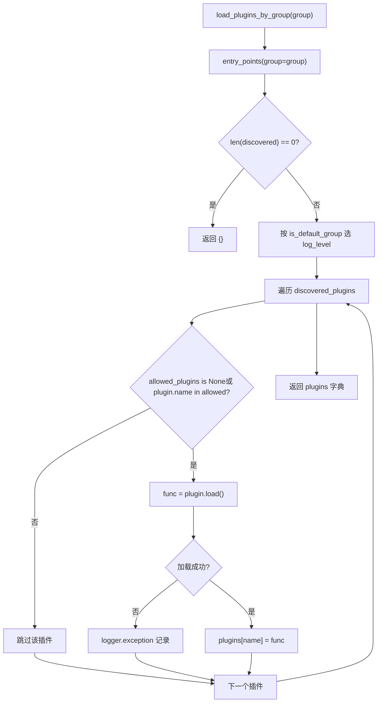
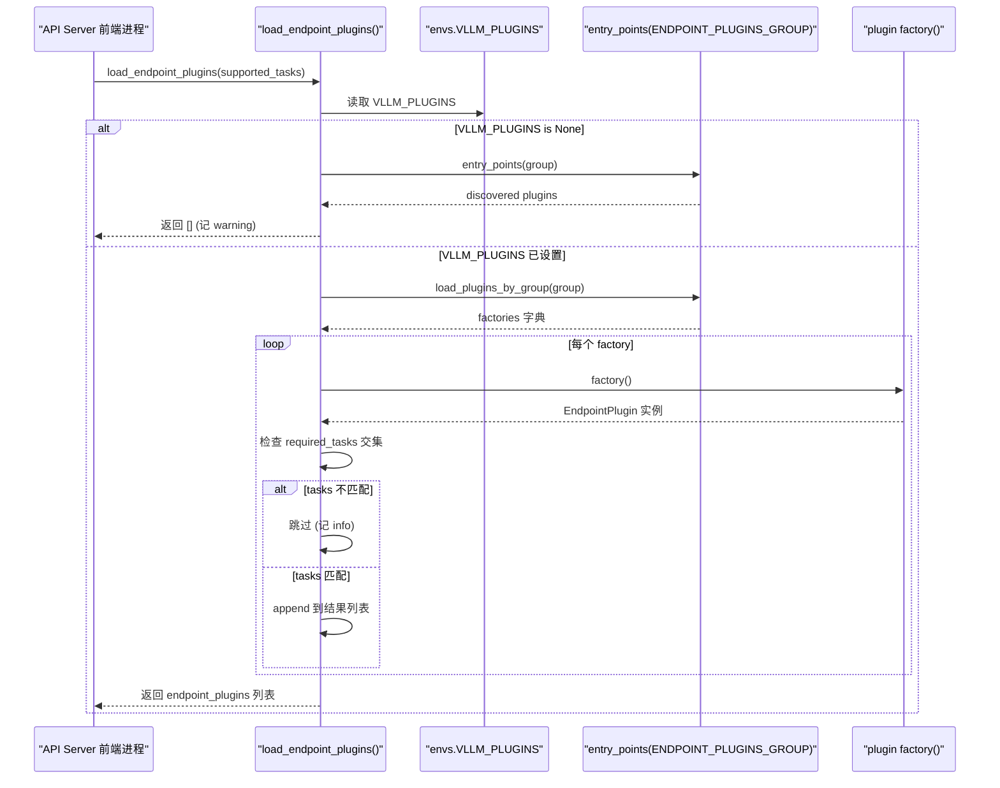

# Глава 13: Система плагинов и расширяемость: платформы, IO-процессоры и расширения эндпоинтов

В предыдущей главе мы увидели, что такие продвинутые функции, как префиксное кеширование, спекулятивное декодирование и LoRA, глубоко связаны с ядром планировщика, управления KV и выполнения модели. Но чтобы движок инференса действительно вышел в продакшен, одной производительности недостаточно — он должен ответить на более сложный вопрос: когда сообщество хочет подключить новое оборудование, новый формат мультимодального ввода или пользовательский HTTP-маршрут, как сделать это без форка核心ного кода? Именно в этом смысл системы плагинов. Архитектура vLLM изначально многопроцессная: фронтенд-процесс API Server, процесс EngineCore и Worker-процесс для каждого TP/PP rank. Если бы механизм плагинов просто «выполнял код при import», он либо повторно выполнялся бы в каждом процессе, накапливая побочные эффекты, либо выполнялся бы только в главном процессе, и Worker не получал бы расширения. В этой главе мы разберём, как vLLM использует стандартный механизм Python entry_points вместе с тремя ограничениями — группа (group) + граница процесса + момент загрузки — чтобы построить систему плагинов, которая охватывает все процессы и при этом точно контролирует поверхность暴露. Мы сосредоточимся на трёх основных линиях: плагины платформ (адаптация нового оборудования), плагины IO processor (вмешательство в обработку мультимодального ввода), плагины эндпоинтов (внедрение пользовательских маршрутов API). Стратегии загрузки у всех трёх совершенно разные, и понимание этого различия означает понимание философии компромисса vLLM между «возможностью расширения» и «границей безопасности».

# I. Обнаружение и загрузка плагинов: групповой контракт entry_points

## Интуитивная модель: «радиоканалы» плагинов

Представьте систему плагинов vLLM как набор радиоканалов. Каждый пакет плагина при установке через`setup.py`из`entry_points`«регистрирует» на некотором канале свой позывной (plugin name) и функцию отклика (plugin value). vLLM при запуске сканирует эти каналы и решает, какие каналы в каких процессах будут «прослушиваться».

Без этого механизма расширение vLLM возможно только через изменение исходного кода — сообществу при добавлении каждой новой аппаратной платформы приходилось бы поддерживать отдельный форк, что в итоге привело бы к расщеплению версий. Ценность механизма группировки заключается в следующем:**Один и тот же пакет плагина может быть зарегистрирован только в определённом канале, что ограничивает его загрузку конкретными процессами**。

## Структура данных: пять констант группировки и глобальный флаг

В vLLM в`vllm/plugins/__init__.py`в верхней части определены пять констант entry point group, каждая из которых соответствует определённой стратегии загрузки:

[FACT:vllm/plugins/__init__.py:16-30]

```python
DEFAULT_PLUGINS_GROUP = "vllm.general_plugins"
IO_PROCESSOR_PLUGINS_GROUP = "vllm.io_processor_plugins"
PLATFORM_PLUGINS_GROUP = "vllm.platform_plugins"
STAT_LOGGER_PLUGINS_GROUP = "vllm.stat_logger_plugins"
ENDPOINT_PLUGINS_GROUP = "vllm.endpoint_plugins"
```

В комментариях скрыта ключевая информация:`DEFAULT_PLUGINS_GROUP`в**все процессы**загрузка (process0, engine core, worker);`IO_PROCESSOR_PLUGINS_GROUP` **только в process0**；`PLATFORM_PLUGINS_GROUP`загружается во всех процессах, но момент срабатывания —`current_platform`при первом обращении;`STAT_LOGGER_PLUGINS_GROUP`только в process0 и в асинхронном режиме;`ENDPOINT_PLUGINS_GROUP`только во фронтенд-процессе API Server.

Сразу за этим следует модульная глобальная переменная`plugins_loaded = False` [FACT:vllm/plugins/__init__.py:32-33], которая является защитой идемпотентной загрузки — в комментарии чётко указано "make sure one process only loads plugins once".

## Пошагово: полный поток вызовов одного`load_plugins_by_group`вызова

Сценарий: пользователь в`setup.py`зарегистрировал`vllm.general_plugins`под`register_dummy_model`, теперь vLLM запускается, некоторый процесс вызывает`load_general_plugins()`。

**Шаг первый: защита идемпотентности.** `load_general_plugins`сначала проверяет`plugins_loaded`, если уже`True`— сразу возвращает[FACT:vllm/plugins/__init__.py:77-90]. Обратите внимание на тонкость: защита устанавливается**до**загрузки, что означает, что даже если последующая загрузка выбросит исключение, повторной попытки не будет. Это сделано намеренно — сбой загрузки плагина не должен приводить к повторным попыткам процесса.

**Шаг второй: обнаружение.**входит в`load_plugins_by_group`, через`importlib.metadata.entry_points(group=group)`получает все установленные entry points[FACT:vllm/plugins/__init__.py:36-45]данной группы. Если пусто, записывает debug-лог и возвращает пустой словарь.

**Шаг третий:分级рование логов.**Исходный код различает уровень логирования для групп по умолчанию и не по умолчанию:`is_default_group`если истинно, используется`logger.debug`, иначе`logger.info` [FACT:vllm/plugins/__init__.py:47-54]. Мотивация вполне практичная —`vllm.general_plugins`обычно содержит множество плагинов регистрации моделей, и использование INFO привело бы к заспамливанию логов; а плагинов платформ/эндпоинтов немного и они важны, поэтому заслуживают видимости на уровне INFO.

**Шаг четвёртый: фильтрация по белому списку.**читает`envs.VLLM_PLUGINS`, если`None`— загружает все, иначе загружает только плагины, имена которых есть в списке[FACT:vllm/plugins/__init__.py:62-70]. Обратите внимание, что`plugin.load()`обёрнут в try/except, сбой загрузки одного плагина лишь записывает exception-лог и не влияет на другие плагины[FACT:vllm/plugins/__init__.py:68-72]。

**Шаг пятый: выполнение.**возвращается в`load_general_plugins`, для каждой загруженной функции напрямую вызывается`func()` [FACT:vllm/plugins/__init__.py:77-90]. Именно поэтому документация подчёркивает, что функции плагинов должны быть**повторно входимыми (re-entrant)**— они могут вызываться многократно в нескольких процессах.

Приведённая ниже блок-схема описывает полный путь принятия решений`load_plugins_by_group`:



## Размышления о дизайне: почему используются entry_points, а не файл конфигурации

> **[Design Inference & Architectural Trade-offs]**
> Выбор`entry_points`вместо пользовательского файла конфигурации обусловлен ключевой мотивацией —**распространять плагины вместе с Python-пакетом**. После того как пользователь`pip install vllm-add-dummy-platform`, плагин автоматически появляется в соответствующей группе, без необходимости вручную редактировать конфигурацию vLLM. Это продолжает традицию экосистемы плагинов таких инструментов, как pytest, flake8. Цена — обнаружение плагинов зависит от метаданных пакета: если пакет плагина установлен не полностью (например, скопирован только каталог исходников без pip), entry_points не будут обнаружены.

---

# II. Плагины платформ: уровень абстракции для адаптации оборудования

## Интуитивная модель: платформа — это "переводчик аппаратных диалектов"

`Platform`Класс**— единственный переводчик**всего взаимодействия vLLM с оборудованием. Код модели вызывает только`current_platform.get_attn_backend_cls()`、`current_platform.is_cuda_alike()`такие абстрактные методы и никогда напрямую`import torch.cuda`. Без этого уровня абстракции для поддержки каждой новой аппаратной платформы пришлось бы добавлять в код модели ветвления`if device == "xpu"`, что в итоге превратилось бы в спагетти-код.

## Структура данных: расположение полей базового класса Platform

`Platform`— это чистый класс (не используется через экземпляры), ключевые атрибуты класса определены в начале`vllm/platforms/interface.py`[FACT:vllm/platforms/interface.py:135-179]：

```python
class Platform:
    _enum: PlatformEnum
    device_name: str
    device_type: str
    dispatch_key: str = "CPU"
    ray_device_key: str = ""
    device_control_env_var: str = "VLLM_DEVICE_CONTROL_ENV_VAR_PLACEHOLDER"
    ray_noset_device_env_vars: list[str] = []
    simple_compile_backend: str = "inductor"
    dist_backend: str = ""
    supported_quantization: list[str] = []
    additional_env_vars: list[str] = []
    _global_graph_pool: Any | None = None
```

`_enum`— это значение перечисления`PlatformEnum`, определяющее`is_cuda()`、`is_rocm()`и другие проверки[FACT:vllm/platforms/interface.py:69-78]。`device_control_env_var`— это платформо-независимая абстракция "переменной окружения видимости устройств" — для CUDA это`CUDA_VISIBLE_DEVICES`, другие платформы определяют свои[FACT:vllm/platforms/interface.py:151-152]。`_global_graph_pool`— это кэш пула памяти CUDA graph на уровне класса, лениво инициализируемый через`get_global_graph_pool`[FACT:vllm/platforms/interface.py:1210-1215]。

Примечательна`__getattr__`логика подстраховки[FACT:vllm/platforms/interface.py:1189-1208]: при обращении к несуществующему атрибуту Platform она пытается перенаправить его из пространства имён`torch.<device_type>`. Это позволяет коду платформы писать`current_platform.memory_allocated()`, а фактически вызывать`torch.cuda.memory_allocated()`. Но исходный код намеренно исключает dunder-методы — иначе проверка pickle`__getstate__`получила бы`None`и попыталась бы его вызвать[FACT:vllm/platforms/interface.py:1182-1185]。

## Пошагово: преобразование трёх пространств имён идентификаторов устройств

Наиболее подверженный ошибкам аспект абстракции платформы —**пространства имён идентификаторов устройств**. В комментариях исходного кода явно перечислены три[FACT:vllm/platforms/interface.py:275-283]：

- **logical**: внутренний local rank vLLM, индекс`_assigned_physical_gpu_ids`
- **visible**: номер torch/CUDA текущего процесса после переназначения через`CUDA_VISIBLE_DEVICES`
- **physical**: глобальный GPU ID, используемый топологическими API вроде NVML, не зависящий от переменных окружения

Сценарий: процессу Worker назначен физический GPU`[4, 5]`, переменная окружения`CUDA_VISIBLE_DEVICES=4,5`, теперь нужно преобразовать local rank 0 в`torch.device("cuda:0")`。

**Шаг первый: logical → physical.** `device_id_to_physical_device_id(0)`сначала проверяет`_assigned_physical_gpu_ids`, если установлено — сразу возвращает индекс`4` [FACT:vllm/platforms/interface.py:296-297]. Если не установлено, из`device_control_env_var`разбирает список через запятую и берёт элемент 0[FACT:vllm/platforms/interface.py:305-311]. Обратите внимание, что исходный код намеренно обрабатывает**пустую строку**как неустановленное значение — это допустимая конфигурация при запуске движка Ray на placement group только с CPU[FACT:vllm/platforms/interface.py:296-297]。

**Шаг второй: physical → visible.** `logical_device_id_to_visible_device_id(0)`Получив physical`4`, затем разбить переменные окружения на`[4, 5]`, найти`4`индекс`0`вернуть[FACT:vllm/platforms/interface.py:316-339]. Если physical ID отсутствует в списке видимых, выбросить`RuntimeError`— это жёсткая защита от межпроцессного ошибочного использования невидимых устройств.

`set_assigned_physical_gpu_ids`идемпотентный дизайн также заслуживает внимания: повторная установка того же значения — no-op, установка другого значения выбрасывает`RuntimeError` [FACT:vllm/platforms/interface.py:38-56]. Это предотвращает случайное перезаписывание маппинга устройств в многопоточной среде.

## Регистрация и внедрение конфигурации платформенных плагинов

Платформенные плагины регистрируются через`vllm.platform_plugins`группу, функция плагина возвращает полное квалифицированное имя класса платформы (или`None`означает, что текущая среда не поддерживается)[FACT:docs/design/plugin_system.md:50-50]. Минимальная реализация, приведённая в документации, требует[FACT:docs/design/plugin_system.md:100-100]：

- `_enum`обычно устанавливается в`PlatformEnum.OOT`（out-of-tree）
- `device_type`возвращает строку типа устройства, распознаваемую PyTorch
- `check_and_update_config`вызывается на раннем этапе инициализации vLLM,**необходимо здесь установить`worker_cls`**
- `get_attn_backend_cls`возвращает имя класса бэкенда внимания
- `get_device_communicator_cls`возвращает имя класса коммуникатора

`check_and_update_config`— самый критичный хук платформенного плагина[FACT:vllm/platforms/interface.py:583-592]. Он принимает`VllmConfig`ссылку и модифицирует на месте, может调整 block size, graph mode и т.д. Документация подчёркивает: "самое важное — worker_cls должен быть установлен здесь"[FACT:docs/design/plugin_system.md:105-105]— потому что vLLM нужно знать, какой класс Worker использовать для инстанцирования рабочего процесса.

## Размышления о дизайне: трёхэтапная стратегия выравнивания block size

Самая сложная логика в платформенном интерфейсе — это`update_block_size_for_backend` [FACT:vllm/platforms/interface.py:666-708]. Она разделена на три этапа для обеспечения совместимости block size с бэкендом внимания:

**Phase 1**: если пользователь явно не указал`--block-size`, вызвать`_preferred_block_size_for_backends`выбрать минимальный block size, поддерживаемый всеми бэкендами[FACT:vllm/platforms/interface.py:687-697]. Эта функция использует LCM (наименьшее общее кратное) для перебора кандидатов, потому что некоторые бэкенды (например, CPU_MLA) принимают только точные размеры, а не кратные[FACT:vllm/platforms/interface.py:622-663]。

**Phase 2**: гибридные модели (attention + mamba) требуют выравнивания block и mamba page size[FACT:vllm/platforms/interface.py:699-702]。

**Phase 3**: когда несколько KV dtype совместно используют block pool (например, nvfp4 основной + неквантованные skip-слои), необходимо расширить основной block до покрытия максимального padded spec page[FACT:vllm/platforms/interface.py:704-708]。

> **[Design Inference & Architectural Trade-offs]**
> Такой поэтапный дизайн отражает реальность, с которой сталкивается vLLM: ограничения на block size от разного оборудования, разных схем квантования и разных архитектур моделей конфликтуют между собой и не могут быть решены одной формулой. Поэтапность позволяет обрабатывать каждое ограничение независимо и в итоге получить решение, удовлетворяющее всем ограничениям.

---

# III. IO Processor и плагины эндпоинтов: обработка ввода и расширение API

## Интуитивная модель: IO Processor — это "слой мультимодального перевода"

Вход мультимодальных моделей (например, LLaVA) — не чистый текст, а смесь текста и изображений. Плагин IO Processor отвечает за преобразование исходных мультимодальных данных в тензоры, которые может потреблять модель, а затем за преобразование вывода модели обратно в человекочитаемый формат. Он как переводчик на таможне: входящий иностранный язык (изображения/аудио) переводится на родной язык модели, исходящий родной язык модели переводится обратно на иностранный.

## Пошагово: обнаружение и инстанцирование IO Processor

Сценарий: загрузка модели с HF config, содержащим поле`io_processor_plugin`.

**Шаг первый: определить имя плагина.** `get_io_processor`приоритетно использовать явно переданный`plugin_from_init`, иначе прочитать из`hf_config`поля`io_processor_plugin`значение[FACT:vllm/plugins/io_processors/__init__.py:42-50]. Если оба пусты, вернуть`None`— означает, что модель не нуждается в IO processor[FACT:vllm/plugins/io_processors/__init__.py:52-54]。

**Шаг второй: загрузить все установленные плагины.**вызвать`load_plugins_by_group(IO_PROCESSOR_PLUGINS_GROUP)`получить все плагины в этой группе[FACT:vllm/plugins/io_processors/__init__.py:59-61]。

**Шаг третий: построить загружаемый маппинг.**обойти каждый плагин, вызвать его функцию для получения`processor_cls_qualname`, если не`None`то записать в`loadable_plugins` [FACT:vllm/plugins/io_processors/__init__.py:66-76]. Обратите внимание, что вызов функции каждого плагина также обёрнут в try/except, единичная ошибка не влияет на остальные.

**Шаг четвёртый: валидация и инстанцирование.**если количество загружаемых плагинов равно 0, выбросить`ValueError`с сообщением "требуется плагин IOProcessor, но ни один не установлен"[FACT:vllm/plugins/io_processors/__init__.py:66-76]. Если требуемое моделью имя плагина отсутствует в списке загружаемых, выбросить`ValueError`и перечислить все доступные имена плагинов[FACT:vllm/plugins/io_processors/__init__.py:80-81]. Наконец, через`resolve_obj_by_qualname`разрешить имя класса и инстанцировать[FACT:vllm/plugins/io_processors/__init__.py:80-81]。

## Плагины эндпоинтов: безопасная позиция "по умолчанию отказ"

Плагины эндпоинтов — самый особый класс в этой главе, потому что они**по умолчанию не загружаются**。`load_endpoint_plugins`строка документации явно объясняет причину: плагины эндпоинтов добавляют HTTP-маршруты к API Server, расширяя поверхность сетевой экспозиции, поэтому применяется более строгая позиция "по умолчанию отказ", чем`load_plugins_by_group`[FACT:vllm/plugins/__init__.py:93-94]。

Конкретное правило: только когда имя плагина**явно присутствует в`VLLM_PLUGINS`**, и его`required_tasks`равно`None`или пересекается с tasks, поддерживаемыми сервером, он загружается[FACT:vllm/plugins/__init__.py:108-108]。

Сценарий: пользователь установил плагин эндпоинта, но забыл установить`VLLM_PLUGINS`。

**Шаг первый: проверить, не установлен ли VLLM_PLUGINS.**если`envs.VLLM_PLUGINS is None`, сначала обнаружить плагины в этой группе, если есть — записать warning "требуется явный allowlist"[FACT:vllm/plugins/__init__.py:126-126]. Обратите внимание, что комментарий в исходном коде особо указывает:`VLLM_PLUGINS=""`парсится как`[""]`а не`None`, поэтому рассматривается как "allowlist, не совпадающий ни с одним плагином", а не "не установлен"[FACT:vllm/plugins/__init__.py:108-108]. Это разграничение важно — пустая строка это явное "ничего не загружать", а`None`это "не сконфигурировано".

**Шаг второй: загрузка и инстанцирование.**получив фабричную функцию через`load_plugins_by_group`, поочерёдно вызвать`factory()`инстанцировать[FACT:vllm/plugins/__init__.py:133-141]. Ошибка инстанцирования записывается как exception и continue.

**Шаг третий: task-гейтинг.**проверить`plugin.required_tasks`, если не`None`и пересекается с`supported_tasks`Нет пересечения, пропустить этот плагин[FACT:vllm/plugins/__init__.py:144-145]. Это позволяет одному пакету плагина регистрировать разные конечные точки для разных задач (например, embedding vs generation).

Приведённая ниже диаграмма последовательности описывает полное взаимодействие плагина конечной точки от обнаружения до загрузки:



## Размышление о дизайне: граница процесса определяет стратегию загрузки

Различия в стратегиях загрузки трёх типов плагинов по сути являются отображением**границы процесса**:

| Тип плагина | Процесс загрузки | Поведение по умолчанию | Мотивация |
| --- | --- | --- | --- |
| general | Все процессы | Загружаются все | Регистрация модели должна быть видна каждому Worker |
| platform | Все процессы | Загружаются все | Абстракция оборудования используется всеми процессами |
| io_processor | Только process0 | Загружаются все | Обработка ввода происходит только на фронтенде |
| stat_logger | Только process0 (асинхронно) | Загружаются все | Логи собираются только в главном процессе |
| endpoint | Только API Server | **По умолчанию отклоняется** | Расширение поверхности сетевого воздействия требует явной авторизации |

> **[Design Inference & Architectural Trade-offs]**
> «Отклонение по умолчанию» для плагинов конечных точек — стандартная практика в области безопасности: любое расширение, увеличивающее поверхность атаки, должно быть opt-in. Остальные плагины загружаются по умолчанию, поскольку они не предоставляют напрямую сетевые интерфейсы, а экосистеме сообщества необходим низкопороговый опыт подключения.

## Производственная ловушка: тихая деградация при неудачной загрузке плагина

`load_plugins_by_group`Для каждого плагина`plugin.load()`обёрнут в try/except, при неудаче только записывается exception[FACT:vllm/plugins/__init__.py:68-72]. Это означает, что**повреждённый плагин не помешает запуску vLLM**, но и не выдаст явную ошибку — пользователь может быть озадачен вопросом «почему мой плагин не работает».

Рекомендация по диагностике: установите уровень логирования DEBUG, найдите`"Failed to load plugin"`. Если плагин находится в группе`vllm.general_plugins`, уровень логирования по умолчанию — DEBUG, и его нужно явно включить, чтобы увидеть детали загрузки[FACT:vllm/plugins/__init__.py:49-50]。

Другая ловушка — момент установки`plugins_loaded`защитного флага[FACT:vllm/plugins/__init__.py:77-90]: он устанавливается до загрузки`True`. Если первая загрузка по какой-то причине не удалась (например, исключение при сканировании entry_points), последующие вызовы будут сразу возвращаться без повторной попытки. В тестовой среде это может привести к странному явлению «плагин то работает, то нет».

---

# Краткое содержание главы

Система плагинов vLLM построена на Python`entry_points`, через**пять констант группировки**разделяет типы расширений, через**границу процесса**определяет область загрузки, через**`VLLM_PLUGINS`белый список**управляет набором загрузки. Плагины платформы используют`Platform`базовый класс для абстрагирования различий оборудования; преобразование трёх пространств имён идентификаторов устройств (logical/visible/physical) является ядром управления устройствами между процессами; плагины IO processor срабатывают через поле`io_processor_plugin`конфигурации HF и отвечают за трансляцию мультимодального ввода; плагины конечных точек придерживаются позиции «отклонение по умолчанию» и загружаются только при явном allowlist и совпадении task, чтобы контролировать поверхность сетевого воздействия.

Три основные линии используют один и тот же механизм обнаружения, но различия в стратегиях загрузки отражают компромисс vLLM между «удобством расширения» и «границами безопасности»: плагины, не предоставляющие сетевой доступ, загружаются по умолчанию, а плагины, предоставляющие сетевой доступ, требуют opt-in.

# Вопросы для размышления и самопроверки по главе

Q1: Если убрать`load_plugins_by_group`в`plugin.load()`try/except и позволить ошибке загрузки выбрасываться напрямую, как это повлияет на многопроцессный запуск vLLM? В каких сценариях это, наоборот, лучший дизайн?

> **[Design Inference & Architectural Trade-offs]**
> **Справочный анализ**: Текущая реализация[FACT:vllm/plugins/__init__.py:68-72]позволяет неудаче загрузки отдельного плагина тихо проглатываться, записывая только лог exception. Если убрать try/except, ошибка загрузки распространится вверх до`load_general_plugins`, что прервёт запуск процесса. В многопроцессном сценарии это приведёт к тому, что при неудаче загрузки плагина в каком-либо Worker-процессе весь движок не сможет запуститься — это может быть хорошо (быстрый отказ, избежание несогласованности состояния из-за работы части процессов с ошибками), а может быть плохо (баг одного опционального плагина обрушит весь сервис). Лучшим дизайном могло бы быть введение`VLLM_PLUGINS_STRICT`переменной окружения: по умолчанию мягкий режим (текущее поведение), в строгом режиме ошибка загрузки сразу выбрасывает исключение. Так производственная среда может требовать «все объявленные плагины должны успешно загрузиться», а среда разработки сохраняет отказоустойчивость.

Q2: `load_endpoint_plugins`В`VLLM_PLUGINS=""`,`VLLM_PLUGINS`и`None`не установлены (

> **[Design Inference & Architectural Trade-offs]**
> **〔Проектные предположения и архитектурные компромиссы〕**Справочный анализ`VLLM_PLUGINS=""`: Комментарий в исходном коде явно указывает, что`[""]`интерпретируется как`None`, а не[FACT:vllm/plugins/__init__.py:108-108], поэтому рассматривается как «allowlist, не совпадающий ни с одним плагином»`VLLM_PLUGINS is None`. Когда`load_endpoint_plugins`,`[]`сразу возвращает[FACT:vllm/plugins/__init__.py:126-126]и записывает warning`VLLM_PLUGINS=""`; а когда`load_plugins_by_group`, код продолжит выполнение до**, но поскольку пустая строка не совпадает ни с одним именем плагина, в итоге также возвращается пустой список. У обоих**результат одинаков**(плагины конечных точек не загружаются), но**：`None`семантика разная`""`означает «пользователь не настроил, мы активно отклоняем и предупреждаем»,

Q3: `device_id_to_physical_device_id`означает «пользователь явно настроил пустой allowlist, мы уважаем его намерение и не предупреждаем». Такое различие позволяет эксплуатации «тихо отключить все плагины конечных точек», установив пустую строку, не терпя шум warning при каждом запуске.`device_control_env_var`В[FACT:vllm/platforms/interface.py:302-308], почему исходный код обрабатывает пустой

**как неустановленный**? Если убрать эту проверку на пустую строку, что произойдёт в сценарии Ray с CPU-only placement group?[FACT:vllm/platforms/interface.py:296-297]Справочный анализ`!= ""`: Комментарий в исходном коде объясняет, что пустая переменная окружения — это легитимная конфигурация Ray при запуске CPU-only placement group на GPU-узлах`device_ids = "".split(",")`. Если убрать проверку`[""]`, код войдёт в ветку`device_ids[device_id]`, получит`int("")`, затем`ValueError`. Это приводит к сбою запуска движка при допустимой конфигурации Ray. После сохранения проверки пустая переменная окружения идёт в`else`ветку и напрямую возвращает`device_id`, то есть предполагается, что logical ID равен physical ID — это безопасно в сценарии CPU-only, поскольку нет GPU, которые нужно отображать. Этот случай показывает: «не установлена» и «установлена в пустое значение» для переменных окружения имеют разную семантику в системах распределённой оркестрации, и код должен обрабатывать это явно.

---

Следующая глава перейдёт к архитектурным компромиссам, производственным подводным камням и будущей эволюции. Мы соберём вместе механизмы, разобранные в предыдущих тринадцати главах, рассмотрим компромиссы vLLM между производительностью, сопровождаемостью и расширяемостью, а также обсудим направления эволюции inference-движков.

К этому моменту мы уже увидели, как vLLM через механизм группировки entry_points, момент загрузки с учётом границ процессов и дифференцированные стратегии для трёх типов плагинов — платформенных, IO processor и endpoint — открывает поверхность расширения, сохраняя стабильность ядра кода. Эта система плагинов позволяет подключать новое оборудование, новые форматы ввода и новые маршруты API неинвазивным способом, но сама расширяемость означает и больше измерений для компромиссов. Следующая глава завершит книгу, системно упорядочив напряжения в ключевых проектных решениях vLLM — continuous batching и фрагментация видеопамяти, CUDA Graph и динамические формы, разделённое развёртывание и сетевые накладные расходы — и представит список подводных камней production-среды и путь диагностики, а также обсудит тенденции эволюции в направлении Rust-фронтенда, IR-слоя и гетерогенного оборудования.
