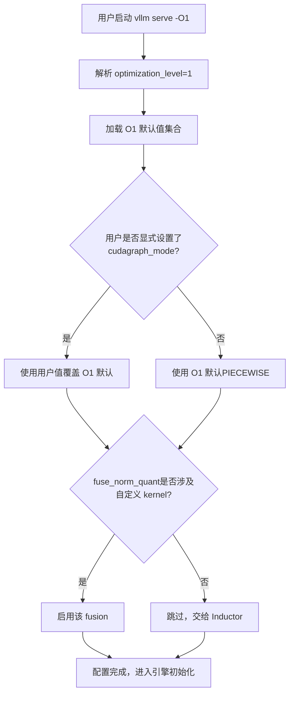
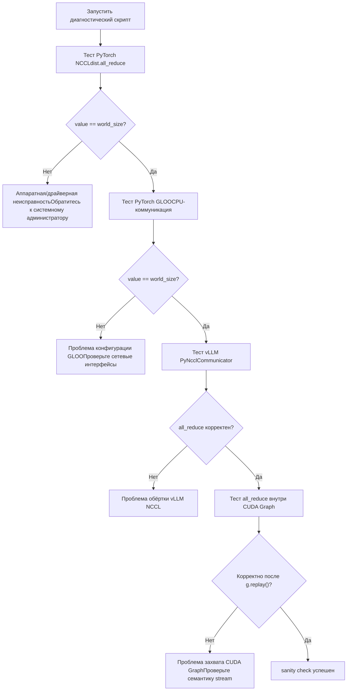

# Глава 14: Архитектурная эволюция vLLM V1 и перспективы развития

В предыдущей главе мы разобрали механизм плагинного расширения vLLM и увидели, как платформенные плагины, плагины IO processor и endpoint-плагины позволяют адаптировать движок к новому оборудованию, новым модальностям и новым API без изменения ядра кода. Эта расширяемость позволяет vLLM быстро принимать изменения, но чем больше точек расширения, тем сложнее пути взаимодействия в production-среде. Когда фрагментация видеопамяти, сбой рукопожатия NCCL, инвалидация кэша компиляции и сетевой джиттер возникают одновременно, механизмы, описанные в предыдущих тринадцати главах, начинают тянуть друг друга в разные стороны, обнажая напряжения, невидимые в идеальных условиях. Эта глава не вводит новых ключевых механизмов, а собирает эти механизмы вместе, опираясь на официальную документацию troubleshooting и учитывая дизайн инструмента bench для Rust-фронтенда, рассматривает компромиссы между производительностью и эксплуатационной пригодностью и даёт практический путь диагностики.

# I. Уровни оптимизации: явный контракт между временем запуска и производительностью выполнения

## Интуитивная модель

Уровни оптимизации похожи на «сюжетные режимы» камеры: автоматический режим (`-O2`) подходит для большинства сценариев, но когда нужно быстро поймать момент (отладка), переключение в ручной режим (`-O0`) даёт мгновенный отклик ценой снижения качества изображения (производительности). vLLM сделал этот компромисс явным контрактом из четырёх уровней, а не спрятал его в десятках булевых флагов, которые пользователь должен собирать сам.

## Раскладка полей четырёх уровней

vLLM предоставляет`-O0`до`-O3`четыре уровня[FACT:docs/design/optimization_levels.md:5-5]. Ключевой принцип дизайна:**явно установленные пользователем флаги имеют приоритет над значениями по умолчанию уровня оптимизации** [FACT:docs/design/optimization_levels.md:5-5]. Это означает, что уровень оптимизации — лишь набор значений по умолчанию, а не жёсткое ограничение.

`-O0`отключает всё: без autotuning, без компиляции, без cudagraph[FACT:docs/design/optimization_levels.md:32-33]. Конкретно это сводится к четырём переключателям:`cudagraph_mode=NONE`、`mode=NONE`, все fusion отключены,`enable_flashinfer_autotune=False` [FACT:docs/design/optimization_levels.md:37-40]。

`-O1`— балансная точка для сценариев разработки: включает`PIECEWISE`cudagraph и`VLLM_COMPILE`режим[FACT:docs/design/optimization_levels.md:50-51]. Обратите внимание на тонкую деталь:`fuse_norm_quant`и`fuse_act_quant`включаются только тогда, когда один из операторов использует пользовательский kernel, иначе автоматическое слияние Inductor даёт лучший эффект[FACT:docs/design/optimization_levels.md:61]. Это типичное проектное решение в духе «не отбирай работу у компилятора».

`-O2`— значение по умолчанию, ориентированное на production[FACT:docs/design/optimization_levels.md:66-67]. Оно на основе`-O1`добавляет`FULL_AND_PIECEWISE`cudagraph и`fuse_allreduce_rms` [FACT:docs/design/optimization_levels.md:72-73]。`-O3`в настоящее время эквивалентен`-O2`, резервируя[FACT:docs/design/optimization_levels.md:80-81]。

## для будущих более агрессивных экспериментальных оптимизаций. Выбор, управляемый сценарием

Когда пользователь выполняет`vllm serve model -O1`, что происходит внутри? Приведённая ниже блок-схема показывает, как уровень оптимизации взаимодействует с пользовательскими флагами:



Ключевой момент этой схемы —`check_user`ветка: явно установленное пользователем всегда имеет приоритет[FACT:docs/design/optimization_levels.md:5-5]. Это позволяет избежать трудно диагностируемых проблем вроде «уровень оптимизации тихо перезаписал мой отладочный флаг».

## Проектные соображения и подводные камни

Самая распространённая производственная ловушка уровней оптимизации —**слишком долгое время запуска**. Документация явно рекомендует: при слишком долгом времени запуска использовать`-O0`или`-O1` [FACT:docs/design/optimization_levels.md:87]. Но здесь есть скрытая цена —`-O0`при

нет cudagraph, накладные расходы CPU на запуск каждого kernel становятся заметны, и в сценариях с высокой конкурентностью пропускная способность может упасть в несколько раз.**Другая ловушка —**。`-O2`ошибки компиляции`FULL_AND_PIECEWISE`:`-O2`cudagraph предъявляет более сильные предположения к структуре модели; некоторые пользовательские модели не компилируются при`-O1`, но нормально работают при`debug_dump_path`. Документация рекомендует использовать[FACT:docs/design/optimization_levels.md:88]для получения более подробной отладочной информации`-O0`. Путь диагностики должен быть таким: сначала с помощью`-O1`、`-O2`убедиться в функциональной корректности, затем постепенно подниматься до

> **[Design Inference & Architectural Trade-offs]**
> 〔Проектные выводы и архитектурные компромиссы〕`--enforce-eager`Это одна и та же методология: сначала подтвердить корректность с наиболее консервативной конфигурацией, затем постепенно включать оптимизации, изолируя проблему до минимального различия в конфигурации.

---

# II. Список подводных камней в продакшене: путь диагностики от симптома к первопричине

## Интуитивная модель

Устранение неполадок в продакшене похоже на сортировку в отделении неотложной помощи: вы не можете провести полное обследование всех пациентов, сначала нужно по симптомам (OOM, зависание, краш) быстро сузить область поиска, а затем целенаправленно копать глубже. Документация по troubleshooting в vLLM по сути представляет собой руководство по сортировке.

## Классификация симптомов и инструменты диагностики

Документация делит типичные проблемы на несколько больших категорий; мы рассмотрим их в порядке возрастания сложности диагностики.

**Первая категория: зависание при скачивании/загрузке модели.**Симптом — длительное отсутствие отклика после запуска. Первопричина обычно в медленной сети или медленной общей файловой системе[FACT:docs/usage/troubleshooting.md:11-11]. Средство диагностики —`--load-format dummy`пропустить загрузку весов, чтобы изолировать, что именно медленно: скачивание или загрузка[FACT:docs/usage/troubleshooting.md:23-23]. Это типичный приём «изоляции методом дихотомии».

**Вторая категория: OOM видеопамяти.**Документация напрямую указывает на конфигурационный документ conserving_memory[FACT:docs/usage/troubleshooting.md:23]. Но OOM в продакшене часто вызван не слишком большим размером модели, а фрагментацией KV cache или превышением ожидаемого числа параллельных запросов.

**Третья категория: изменение качества генерации.**Это легко упускаемый подводный камень. v0.8.0 изменил источник параметров сэмплирования по умолчанию: с нейтральных значений по умолчанию vLLM на значения автора модели`generation_config.json` [FACT:docs/usage/troubleshooting.md:23-23]. В большинстве случаев это улучшает качество, но для некоторых моделей их конфигурация оказывается хуже[FACT:docs/usage/troubleshooting.md:23-23]. Метод диагностики — откатиться к`--generation-config vllm`и сравнить[FACT:docs/usage/troubleshooting.md:23-23]。

**Четвёртая категория: зависание (hang).**Это наиболее сложная для диагностики категория. Документация приводит набор постепенно расширяемых переменных окружения для отладки[FACT:docs/usage/troubleshooting.md:41-41]：

- `VLLM_LOGGING_LEVEL=DEBUG`: включить подробные логи
- `VLLM_LOG_STATS_INTERVAL=1.`: высокочастотный вывод состояния очереди и попаданий в кэш
- `CUDA_LAUNCH_BLOCKING=1`: определить, какой именно CUDA kernel даёт сбой
- `NCCL_DEBUG=TRACE`: включить подробные логи NCCL
- `VLLM_TRACE_FUNCTION=1`: записывать все вызовы функций, но это замедляет более чем в 100 раз[FACT:docs/usage/troubleshooting.md:41]

Здесь есть важная эксплуатационная дисциплина: после отладки необходимо отключить эти переменные окружения или просто открыть новый shell, иначе оставшаяся отладочная конфигурация будет постоянно замедлять систему[FACT:docs/usage/troubleshooting.md:11-11]。

## Ловушка границ процессов при отладке с точками останова

Многопроцессная архитектура vLLM делает обычные`pdb`точки останова неработоспособными — если точка останова срабатывает в дочернем процессе, будет выброшено`BdbQuit` [FACT:docs/usage/troubleshooting.md:45-54]. Два решения: использовать`forked-pdb` [FACT:docs/usage/troubleshooting.md:57-61], или установить`VLLM_ENABLE_V1_MULTIPROCESSING=0`чтобы оставить планировщик в том же процессе[FACT:docs/usage/troubleshooting.md:63-68]。

> **[Design Inference & Architectural Trade-offs]**
> Второй метод, хотя и удобен, изменяет модель выполнения — в однопроцессном режиме EngineCore и API Server больше не общаются через очередь, и некоторые баги параллелизма могут не воспроизводиться. Поэтому он подходит для локализации логических ошибок, но не для воспроизведения проблем параллелизма.

## Диагностика распределённой коммуникации

Для распределённого развёртывания есть отдельный документ по диагностике. Ключевая рекомендация:**задавать переменные окружения при создании кластера**, потому что переменные распространяются на все узлы; а установка в shell влияет только на локальный узел[FACT:docs/serving/distributed_troubleshooting.md:16-16]。

Частая проблема —`No available node types can fulfill resource request`, возникает даже при достаточном количестве GPU в кластере[FACT:docs/serving/distributed_troubleshooting.md:16-16]. Первопричина обычно в том, что у узла несколько IP, и vLLM выбрал неправильный. Решение — явно указать с помощью`VLLM_HOST_IP`и проверить с помощью`ray status`[FACT:docs/serving/distributed_troubleshooting.md:16-16]。

## Диагностический скрипт для сбоя инициализации NCCL

Документация предоставляет полный диагностический скрипт, послойно проверяющий стек коммуникации[FACT:docs/usage/troubleshooting.md:89-150]. Его дизайн очень многоуровневый:



Изящество этого скрипта в том, что он послойно изолирует: сначала проверяет самый нижний уровень PyTorch NCCL, затем GLOO на стороне CPU, затем собственную обёртку vLLM PyNcclCommunicator, и наконец коммуникацию внутри CUDA Graph[FACT:docs/usage/troubleshooting.md:90-146]. Сбой на каждом уровне указывает на разные первопричины.

Одна деталь в скрипте, заслуживающая внимания:`pynccl.disabled = False`предназначена для обратной совместимости с версиями 0.6.4 и ниже[FACT:docs/usage/troubleshooting.md:121-125]. В 0.6.5+ она включена по умолчанию, но эта строка кода сохранена, чтобы пользователи, читающие последнюю документацию, не запутались.

При многоузловом тестировании документация намеренно использует`--rdzv_backend=static`вместо`c10d`, потому что`c10d`при многоузловой конфигурации даёт сбой из-за ошибки разрешения DNS[FACT:docs/usage/troubleshooting.md:168-168]. Это типичная конфигурация из разряда «поймёшь, только наступив на грабли».

## Проектные размышления и подводные камни

**Сбой инициализации NCCL**（`ncclCommInitRank`выдаёт unhandled system error) обычно указывает на две первопричины: отсутствие`IPC_LOCK`capability или`/dev/shm`не смонтирован[FACT:docs/usage/troubleshooting.md:311-311]. Обе — классические ловушки контейнеризованного развёртывания.

**Несоответствие инструментальной цепочки CUDA PTX**（`the provided PTX was compiled with an unsupported toolchain`) означает, что PTX в wheel был скомпилирован более новой версией CUDA toolkit[FACT:docs/usage/troubleshooting.md:325-327]. Решение — включить прямую совместимость CUDA: в Docker добавить`-e VLLM_ENABLE_CUDA_COMPATIBILITY=1` [FACT:docs/usage/troubleshooting.md:325-327], на голом железе установить пакет`cuda-compat`и задать`VLLM_CUDA_COMPATIBILITY_PATH` [FACT:docs/usage/troubleshooting.md:325-327]。

**Известная проблема накладных расходов памяти NCCL**：vLLM `>= 0.4.3, <= 0.10.1.1`устанавливает`NCCL_CUMEM_ENABLE=0`для обхода бага NCCL; при подключении внешнего процесса к vLLM также необходимо задать эту переменную, иначе будет hang или краш[FACT:docs/usage/troubleshooting.md:375]. После исправления в NCCL 2.22.3 новые версии убрали это переопределение, чтобы разрешить оптимизацию производительности[FACT:docs/usage/troubleshooting.md:375]. Этот случай показывает:**межпроцессный контракт переменных окружения — это неявная зависимость распределённых систем**, и при обновлении его необходимо синхронизировать.

---

# III. Rust-фронтенд: философия проектирования zero-copy в инструменте bench

## Интуитивная модель

Если Python-фронтенд — это «функционально полный, но громоздкий» швейцарский нож, то Rust-инструмент bench — это «скальпель, созданный только для нагрузочного тестирования». Его цель проектирования — не покрытие функциональности, а минимизация собственных накладных расходов клиента при высокой параллельности, чтобы измеренные цифры реально отражали производительность сервера.

## Структуры данных и компоновка памяти

Основной структурой данных инструмента bench является`RequestFuncInput` [FACT:rust/src/bench/src/backends/mod.rs:59-89]. Он активно использует`Arc<str>`и`Arc<[u32]>`вместо`String`/`Vec`, что является ядром дизайна с нулевым копированием.

Рассмотрим несколько ключевых полей:`prompt: Arc<str>` [FACT:rust/src/bench/src/backends/mod.rs:50-52]— несколько параллельных запросов могут совместно использовать одну и ту же строку prompt, избегая клонирования для каждого запроса.`prompt_token_ids: Option<Arc<[u32]>>` [FACT:rust/src/bench/src/backends/mod.rs:77]— предварительно вычисленные token ID отправляются напрямую на сервер, минуя токенизацию на стороне сервера[FACT:rust/src/bench/src/backends/mod.rs:74-76]。

Самое изящное —`multi_modal_content: Option<Arc<[Arc<str>]>>` [FACT:rust/src/bench/src/backends/mod.rs:81]. Комментарий поясняет: мультимодальный контент передаётся как предварительно сериализованный фрагмент JSON, chat backend напрямую встраивает его в поток байтов payload, избегая любого парсинга или глубокого копирования base64-данных изображения[FACT:rust/src/bench/src/backends/mod.rs:78-80]. Это двухуровневая структура`Arc`: внешний уровень`Arc<[...]>`разделяет весь массив, внутренний уровень`Arc<str>`разделяет отдельные фрагменты.

`chat_messages_json: Option<Arc<str>>`имеет наивысший приоритет и вставляется в payload как есть[FACT:rust/src/bench/src/backends/mod.rs:82-85]。

## Десериализация без аллокаций

Парсинг SSE-потока — ещё одна ключевая точка производительности. В комментарии явно указано: используется типизированная десериализация, чтобы избежать построения полного дерева`serde_json::Value`, извлекаются только нужные поля[FACT:rust/src/bench/src/backends/mod.rs:20-24]。

`CompletionChunk`сохраняются только`choices`и`usage`два поля[FACT:rust/src/bench/src/backends/mod.rs:20-24]，`ChatChunk`Аналогично[FACT:rust/src/bench/src/backends/mod.rs:33-37]。`#[serde(default)]`позволяет отсутствующему полю`choices`по умолчанию быть пустым массивом[FACT:rust/src/bench/src/backends/mod.rs:20-24], что типично для потоковых ответов.

## Сценарий-ориентированный поток запросов

Как данные перемещаются при отправке нагрузочного запроса? Диаграмма потока данных ниже показывает преобразование от входа к выходу:

```mermaid
блок-схема LR
    input["RequestFuncInputArc<str> prompt"] --> build["build_headers+ сборка payload"]
    build --> send["reqwest::Clientsend_request"]
    send --> sse["SSE потоковый ответпоток байтов"]
    sse --> parse["CompletionChunkтипизированная десериализация"]
    parse --> output["RequestFuncOutputttft/itl/tpot"]
```

`Backend`Перечисление использует статическую диспетчеризацию, чтобы избежать проблем с async trait object[FACT:rust/src/bench/src/backends/mod.rs:150-154]。`send_request`Через`match`диспетчеризуется к конкретной реализации[FACT:rust/src/bench/src/backends/mod.rs:158-168]。`get_backend`В зависимости от`BackendKind`возвращается соответствующий бэкенд[FACT:rust/src/bench/src/backends/mod.rs:172-181]。

Одна деталь:`API_KEY`использует`OnceLock`кэширование, чтобы избежать syscall для переменных окружения на каждом запросе[FACT:rust/src/bench/src/backends/mod.rs:186-188]。`build_headers`Последовательно вставляются Content-Type, Authorization, extra headers, request-id[FACT:rust/src/bench/src/backends/mod.rs:191-215]。

## Размышления о дизайне и подводные камни

> **[Design Inference & Architectural Trade-offs]**
> Дизайн с нулевым копированием в Rust-инструменте bench отражает важное суждение:**накладные расходы клиента инструмента нагрузочного тестирования становятся источником погрешности измерений**. Если каждый запрос клонирует prompt, парсит полный JSON, глубоко копирует base64-изображения, то в измеренную задержку примешиваются накладные расходы клиента, и она не отражает реальную производительность сервера. Использование`Arc`для разделения неизменяемых данных и типизированной десериализации для пропуска ненужных полей по сути сводит накладные расходы клиента почти к нулю.

`RequestFuncOutput`Дизайн полей`ttft`（time to first token）、`itl`(массив inter-token latency),`tpot`（time per output token）[FACT:rust/src/bench/src/backends/mod.rs:93-105]. Эти три метрики соответствуют разным аспектам производительности: TTFT отражает prefill и задержку в очереди, ITL — стабильность decode, TPOT — общую пропускную способность. При нагрузочном тестировании, если смотреть только на среднюю задержку, можно скрыть джиттер ITL.

---

# Размышления о дизайне: глубинная логика архитектурных компромиссов

Сопоставив механизмы этой главы с предыдущими тринадцатью, можно увидеть несколько ключевых линий компромиссов в vLLM.

> **[Design Inference & Architectural Trade-offs]**
> **Непрерывная батчевая обработка vs фрагментация видеопамяти.**Непрерывная батчевая обработка позволяет батчу перестраиваться на каждом шаге, значительно повышая пропускную способность, но ценой этого является крайне частое выделение и освобождение KV cache. Механизм таблицы блоков PagedAttention как раз предназначен для обработки такого высокочастотного выделения — блоки фиксированного размера устраняют внешнюю фрагментацию, но вносят накладные расходы на косвенную адресацию через таблицу блоков и внутреннюю фрагментацию (последний блок может быть не заполнен). Это типичный компромисс «слой косвенности в обмен на уровень фрагментации», та же идея, что и виртуальная память с постраничной организацией в операционных системах.

**CUDA Graph vs динамические формы.**CUDA Graph требует статических форм, но размер батча при непрерывной батчевой обработке меняется на каждом шаге. Решение vLLM —`PIECEWISE`и`FULL_AND_PIECEWISE`режимы[FACT:docs/design/optimization_levels.md:50,72]— статизируемая часть захватывается в граф, динамическая остаётся eager.`-O0`Полное отключение cudagraph предназначено для отладки,`-O2`полное включение — для продакшена, промежуточный`-O1`— компромисс.

**Раздельное развёртывание vs сетевые накладные расходы.**KV Connector позволяет разделить prefill и decode на разные инстансы, но передача KV cache между инстансами вносит сетевую задержку. Требования к конфигурации GPUDirect RDMA в документации (`IPC_LOCK`、`/dev/shm`）[FACT:docs/usage/troubleshooting.md:311-311]) указывают на жёсткие требования этого пути к инфраструктуре. Сетевой джиттер приводит к таймауту передачи KV, что вызывает повторные попытки или деградацию.

**Эксплуатируемость vs производительность.**Уровни оптимизации, отладочные переменные окружения, диагностические скрипты — всё это цена, уплачиваемая за эксплуатируемость.`VLLM_TRACE_FUNCTION=1`замедляет в 100 раз[FACT:docs/usage/troubleshooting.md:41], но это последнее средство для локализации проблем с зависанием. Зрелый движок обязан предоставлять такие «медленные, но позволяющие всё разглядеть» инструменты.

---

# Резюме главы

Эта глава завершает книгу, пересматривая механизмы предыдущих тринадцати глав с производственной точки зрения.

Уровни оптимизации (`-O0`до`-O3`) — это явный контракт между временем запуска и производительностью, пользовательские флаги всегда имеют приоритет над значениями по умолчанию уровня[FACT:docs/design/optimization_levels.md:5-5]. Список подводных камней в продакшене охватывает полный диагностический путь от загрузки модели, OOM видеопамяти, изменения качества генерации до сбоев распределённой коммуникации; ключевая методология — «изоляция методом дихотомии» и «послойная верификация». Rust-инструмент bench с помощью`Arc`разделения и типизированной десериализации сводит накладные расходы клиента почти к нулю, гарантируя, что цифры нагрузочного тестирования реально отражают производительность сервера.

Три ключевые линии компромиссов проходят через всю книгу: непрерывная батчевая обработка и фрагментация видеопамяти, CUDA Graph и динамические формы, разделённое развёртывание и сетевые накладные расходы. Понимание этих напряжений важнее запоминания любого отдельного механизма — потому что каждая настройка в производственной среде по сути представляет собой поиск точки равновесия между этими напряжениями.

# Вопросы для размышления и самопроверки к этой главе

Вопрос 1: Если заменить`-O2`в`FULL_AND_PIECEWISE`cudagraph на`-O1`в`PIECEWISE`, в каких сценариях это вызовет регресс производительности? Почему?

**Справочный анализ**：`-O2`В`-O1`дополнительно добавляется`FULL_AND_PIECEWISE`режим cudagraph[FACT:docs/design/optimization_levels.md:72]。`FULL`Режим захватывает весь прямой проход в один граф, тогда как`PIECEWISE`захватывает только статически фиксируемые фрагменты. В производственных сценариях со стабильной формой батча`FULL`режим позволяет устранить больше накладных расходов на запуск ядер, обеспечивая более высокую пропускную способность. Однако если модель содержит динамический поток управления (например, маршрутизацию токенов в MoE),`FULL`режим может не справиться с захватом или после захвата вести себя некорректно — в этом случае`PIECEWISE`оказывается надёжнее. Регресс производительности проявится в случаях: частого изменения размера батча, из-за чего`FULL`граф не может быть использован, или когда структура модели запускает`FULL`резервный путь режима. Метод диагностики: сначала с помощью`-O1`подтвердить базовый уровень, затем перейти к`-O2`для сравнения, используя`VLLM_LOG_STATS_INTERVAL=1.`для наблюдения за состоянием очереди[FACT:docs/usage/troubleshooting.md:41-41]。

Вопрос 2: В диагностическом скрипте, почему перед тестированием vLLM PyNcclCommunicator нужно сначала протестировать PyTorch GLOO? Если пропустить тест GLOO и сразу тестировать PyNccl, что будет упущено?

**Справочный анализ**: Порядок выполнения скрипта — PyTorch NCCL → PyTorch GLOO → vLLM PyNccl → CUDA Graph[FACT:docs/usage/troubleshooting.md:90-146]. GLOO тестирует коммуникацию на стороне CPU[FACT:docs/usage/troubleshooting.md:106-112], а`PyNcclCommunicator`в vLLM требует GLOO-группу в качестве bootstrap[FACT:docs/usage/troubleshooting.md:120]. Если пропустить тест GLOO, то при сбое инициализации PyNccl вы не сможете различить, проблема ли это самого NCCL или проблема GLOO bootstrap. GLOO зависит от конфигурации сетевого интерфейса (`GLOO_SOCKET_IFNAME`）[FACT:docs/usage/troubleshooting.md:81-81], и в сложных сетевых средах это частая точка отказа. Ценность послойного тестирования в том, что оно позволяет изолировать неисправность до минимального различия в конфигурации.

Вопрос 3: Инструмент бенчмаркинга на Rust использует`Arc<str>`для совместного использования prompt. Если в сценарии нагрузочного тестирования каждый запрос должен отправлять разный prompt, теряет ли этот дизайн смысл? Почему?

**Справочный анализ**：`Arc<str>`Цель дизайна[FACT:rust/src/bench/src/backends/mod.rs:50-52]— позволить нескольким конкурентным запросам совместно использовать одну неизменяемую строку`Arc`. Если prompt каждого запроса различается,`Arc<str>`преимущество совместного использования действительно исчезает — каждому запросу нужно создавать свой`Arc<str>`. Но дизайн не теряет смысла:`String`по сравнению с`prompt_token_ids: Option<Arc<[u32]>>` [FACT:rust/src/bench/src/backends/mod.rs:77]по-прежнему избегает множественного клонирования в процессе прохождения запроса (например, из входной очереди в backend, затем в построение payload). Настоящая оптимизация нулевого копирования заключается в`Arc`— даже если текст prompt различается, предвычисленный массив token ID всё ещё может быть разделён через`Arc<str>`в течение жизненного цикла запроса, избегая повторного выделения. Дизайн инструмента нагрузочного тестирования предполагает либо «один prompt при высокой конкурентности», либо «предвычисленные token ID»: в первом случае`Arc<[u32]>`используется для совместного использования текста, во втором — для совместного использования последовательности токенов.

---

На этом разбор исходного кода всех четырнадцати глав книги завершается. Мы начали с одного вызова API, прошли через планировщик, менеджер KV cache, бэкенды внимания, уровень распределённой коммуникации, добрались до точки запуска GPU-ядер и вернулись к диагностическому пульту производственной эксплуатации. За каждым проектным решением vLLM стоит чётко определённый компромисс; понимание этих компромиссов — единственный способ принимать правильные инженерные решения при столкновении с новым оборудованием, новыми моделями и новыми нагрузками. Эволюция inference-движков не остановится — Rust-фронтенд, слой IR, поддержка гетерогенного оборудования стремительно развиваются — но базовая логика компромиссов стабильна, и именно эту ключевую способность книга стремится передать.

На этом мы завершили полный путь от точки входа запроса до GPU Kernel и увидели те компромиссы и подводные камни в производственной среде, которые превращают систему из «работающей» в «работающую стабильно». Эволюция vLLM не остановится на текущей архитектуре: более эффективные реализации внимания, более интеллектуальные стратегии планирования, более бесшовная гетерогенная поддержка — всё это уже в пути. Но как бы ни менялось будущее, понимание напряжений и компромиссов между этими механизмами всегда остаётся ключом к управлению inference-движком.
