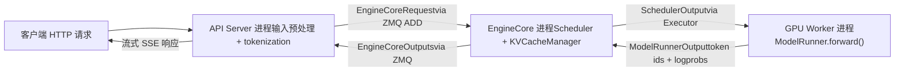
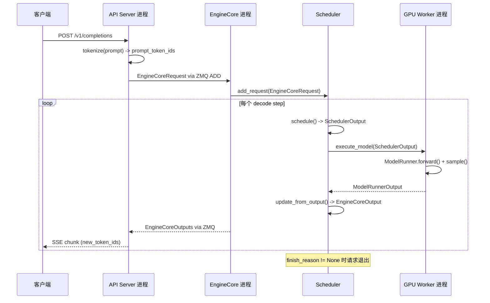

# 第 1 章：vLLM 的設計哲學與整體架構鳥瞰

假設你手頭有一張 A100，想用 LLaMA-7B 對外提供線上推理服務。最樸素的做法是：來一個請求，跑一次 model.generate()，返回結果。這個方案在併發量上來後會立刻崩潰——不是因為 GPU 算力不夠，而是因為兩件事：第一，顯存被碎片吃掉。自迴歸生成需要快取每一層的 Key/Value 張量（KV Cache）。如果每個請求都按 max_model_len 預分配一整塊連續顯存，一個 4096 token 的請求就要佔掉幾十 MB，而實際生成的序列可能只有 200 token。更糟的是，不同長度的請求交替進出，連續顯存塊被切得七零八落，最終明明總量夠用，卻找不到一塊足夠大的連續空間——這就是經典的顯存碎片問題。第二，批次處理效率低下。傳統靜態批次處理要求一個 batch 裡的所有請求同時開始、同時結束。但生成任務的輸出長度天然不可預測：一個請求可能 10 個 token 就停了，另一個要生成 2000 個。短請求結束後，它佔的 batch 槽位只能空等長請求跑完，GPU 利用率斷崖式下跌。vLLM 的兩個設計基石正是針對這兩個痛點：PagedAttention 用分頁機制消除顯存碎片，Continuous Batching 用迭代級排程消除批次處理空轉。本章不深入這兩個機制的實現細節（那是第 2、4 章的主題），而是先建立一張全局地圖：vLLM v1 的行程架構長什麼樣、各層職責如何劃分、一次請求從進入系統到吐出 token 要穿過哪些元件。理解了這張地圖，後續每一章的原始碼解讀才有落腳點。

# 行程架構：為什麼 vLLM 不是一個單行程程式

## 直覺模型

把 vLLM 想像成一家餐廳。前台（API Server）負責接待客人、記錄點單；後廚核心（EngineCore）決定先做哪道菜、用哪個灶台；每個灶台（GPU Worker）由一位廚師獨占操作。如果讓一個人既接待又炒菜，高峰期必然手忙腳亂——這就是為什麼 vLLM 要把這些角色拆成獨立行程。

> **[Design Inference & Architectural Trade-offs]**
> 這種多行程拆分的核心動機是**關注點分離**：HTTP 解析、tokenization、多模態資料載入是 CPU 密集型且可能阻塞的操作，而模型前向是 GPU 密集型。如果放在同一行程，Python 的 GIL 會讓兩者互相拖累。拆成獨立行程後，API Server 可以持續接收新請求，EngineCore 可以持續排程，GPU Worker 可以持續計算，三者透過 ZMQ 訊息佇列解耦。

## 行程拓撲與數量關係

vLLM v1 的行程架構可以用一個公式概括。對於`N`張 GPU、張量平行度`TP`、流水線平行度`PP`、資料平行度`DP`、API Server 數量`A`的部署：

| 行程類型 | 數量 | 職責 |
| --- | --- | --- |
| API Server | `A`（預設等於`DP`） | HTTP 請求處理、輸入預處理、結果串流返回 |
| EngineCore | `DP`（預設 1） | 排程、KV Cache 管理、協調 GPU Worker |
| GPU Worker | `N`（= `DP × PP × TP`） | 載入權重、執行前向、管理顯存 |
| DP Coordinator | `DP > 1`時為 1，否則 0 | DP 秩間負載均衡與 MoE 波次協調 |

[FACT:docs/design/arch_overview.md:113-113]給出了這張表的權威定義。一個典型的單機 4 卡部署（`vllm serve -tp=4`）會產生 1 個 API Server + 1 個 EngineCore + 4 個 GPU Worker = 6 個行程[FACT:docs/design/arch_overview.md:115-115]。而 8 卡 TP=2/DP=4 的部署則膨脹到 4 + 4 + 8 + 1 = 17 個行程[FACT:docs/design/arch_overview.md:123-123]。

這裡有一個容易被忽視的細節：**API Server 的數量預設跟隨 DP 大小**。當`--data-parallel-size 4`時，會自動啟動 4 個 API Server，每個都透過 ZMQ 以多對多拓撲連接到所有 EngineCore[FACT:docs/design/arch_overview.md:73-73]。這意味著任何一個 API Server 都能把請求路由到任何一個 EngineCore，避免了單點瓶頸。

## 資料流向

下面這張圖展示了一次請求在行程間的完整流轉路徑。注意每個節點標註的都是真實的類名和資料結構：



這張圖的關鍵在於：**API Server 和 EngineCore 之間是非同步訊息傳遞**，而不是函式呼叫。請求被序列化為`EngineCoreRequest`結構體（一個`msgspec.Struct`，見[FACT:vllm/v1/engine/__init__.py:109-113]），透過 ZMQ 的`ADD`訊息類型發送[FACT:vllm/v1/engine/__init__.py:287-299]。EngineCore 處理完後，把結果打包成`EngineCoreOutputs`返回[FACT:vllm/v1/engine/__init__.py:256-260]。

> **[Design Inference & Architectural Trade-offs]**
> 選擇 ZMQ 而非 gRPC 或共享記憶體，是因為 ZMQ 在行程間通訊場景下延遲極低（微秒級），且天然支援多對多拓撲和訊息佇列語義。對於推理服務這種對首 token 延遲敏感的場景，通訊開銷必須盡可能小。

## 設計思考：為什麼 EngineCore 是獨立行程而非執行緒

一個自然的問題是：既然 EngineCore 和 API Server 都在同一台機器上，為什麼不放在同一行程裡用執行緒通訊？

答案藏在 EngineCore 的工作模式裡。EngineCore 運行的是一個**忙迴圈**（busy loop），持續不斷地排程請求、分發工作給 GPU Worker[FACT:docs/design/arch_overview.md:73-73]。這個迴圈不能被打斷——一旦被 HTTP 解析或 tokenization 阻塞，整個推理流水線就會出現氣泡。獨立行程保證了 EngineCore 的 CPU 時間片不會被前端邏輯搶佔。

此外，獨立行程還帶來了**故障隔離**：如果 API Server 因為某個畸形請求崩潰，EngineCore 和 GPU Worker 不受影響，可以繼續服務其他 API Server 轉發過來的請求。

# 分層心智模型：從入口到 GPU 的職責邊界

## 直覺模型

如果說行程架構是「誰在哪裡幹活」，那麼分層模型就是「每層負責什麼決策」。vLLM 的程式碼組織遵循一條清晰的分層原則：**上層決定做什麼，下層決定怎麼做**。入口層決定接收哪些請求，引擎核心層決定先處理誰，執行器層決定用哪種並行策略，Worker 層決定如何在具體硬體上跑出結果。

## 四層結構

**入口層（Entrypoints）**提供兩種互動方式：離線推理的`LLM`類和線上服務的`vllm serve`命令[FACT:docs/design/arch_overview.md:16-16][FACT:docs/design/arch_overview.md:56-56]。這一層的核心職責是輸入預處理——tokenization、多模態資料載入、取樣參數解析——以及輸出的反 tokenization 和串流返回。它不關心排程策略，也不碰 GPU。

**引擎核心層（EngineCore）**是整個系統的大腦。它持有 Scheduler（決定每個 decode step 處理哪些請求）和 KV Cache Manager（管理分頁顯存），透過 Executor 抽象與 GPU Worker 通訊[FACT:docs/design/arch_overview.md:79-85]。這一層的關鍵設計是**排程與執行分離**：Scheduler 只產出「這一步要跑哪些 token」的決策（`SchedulerOutput`），具體怎麼在 GPU 上跑是 Worker 的事。

**執行器層（Executor）**是 EngineCore 和 Worker 之間的橋樑。它封裝了分散式執行策略——單行程用`UniProcExecutor`，多行程用`MultiprocExecutor`，Ray 叢集用`RayDistributedExecutor`。Executor 的抽象介面讓 EngineCore 不需要知道底層是單卡還是 8 卡 TP。

**Worker 層**每個 GPU 一個 Worker 行程，內部持有 ModelRunner 和實際的`torch.nn.Module`模型物件[FACT:docs/design/arch_overview.md:171-191]。ModelRunner 負責準備輸入張量、捕獲 CUDA Graph、執行前向計算。這一層是唯一直接操作 GPU 顯存和 CUDA 流的地方。

## 配置物件：貫穿所有層的全域狀態

四層之間靠什麼傳遞資訊？答案是`VllmConfig`——一個包含所有配置的巨型 dataclass[FACT:vllm/config/vllm.py:357-357]。

```python
@config(config=ConfigDict(arbitrary_types_allowed=True))
class VllmConfig:
    """Dataclass which contains all vllm-related configuration."""
    model_config: ModelConfig = None
    cache_config: CacheConfig = Field(default_factory=CacheConfig)
    parallel_config: ParallelConfig = Field(default_factory=ParallelConfig)
    scheduler_config: SchedulerConfig = Field(default_factory=SchedulerConfig.default_factory)
    # ... 还有 20+ 个子配置
```

[FACT:vllm/config/vllm.py:363-371]展示了核心欄位。這個設計選擇背後的邏輯值得展開。

> **[Design Inference & Architectural Trade-offs]**
> 文件中明確解釋了為什麼用一個大配置物件而非分散的參數傳遞：**可擴展性**。假設要加一個只影響 ModelRunner 的新特性，只需要在`VllmConfig`裡加一個欄位，ModelRunner 直接讀取即可，不需要修改 Engine、Worker、Model 的建構子簽名[FACT:docs/design/arch_overview.md:203-203]。在一個快速演進的推理框架裡，這種「加欄位不改介面」的能力極大降低了開發摩擦。

代價是`VllmConfig`變得極其龐大——從[FACT:vllm/config/vllm.py:356-3509]可以看出，這個類別跨越了超過 3000 行程式碼，包含數十個欄位和驗證方法。`__post_init__`方法[FACT:vllm/config/vllm.py:1405-2317]更是長達 900 多行，承擔了所有跨配置項的交叉驗證和預設值推導。

## 配置的雜湊與快取

`VllmConfig`還有一個容易被忽視但非常重要的能力：`compute_hash()` [FACT:vllm/config/vllm.py:464-580]。它為所有影響計算圖結構的配置項生成一個短雜湊。

```python
def compute_hash(self, include_version: bool = True) -> str:
    factors: list[Any] = []
    vllm_factors: list[Any] = []
    if include_version:
        from vllm import __version__
        vllm_factors.append(__version__)
    if self.model_config:
        vllm_factors.append(self.model_config.compute_hash())
    # ... 逐个追加各子配置的哈希
    hash_str = safe_hash(str(factors).encode(), usedforsecurity=False).hexdigest()[:10]
    return hash_str
```

[FACT:vllm/config/vllm.py:479-580]展示了完整的雜湊計算流程。注意註解中的警告：「Whenever a new field is added to this config, ensure that it is included in the factors list if it affects the computation graph」[FACT:vllm/config/vllm.py:465-467]。

> **[Design Inference & Architectural Trade-offs]**
> 這個雜湊的用途是**torch.compile 快取鍵**。vLLM 用`torch.compile`編譯模型前向圖，編譯結果會快取到磁碟。下次啟動時，如果配置雜湊相同，就可以直接複用編譯快取，跳過耗時的編譯過程。如果某個影響計算圖的配置項沒被納入雜湊，就會導致快取命中錯誤——用了舊配置編譯的圖來跑新配置，結果靜默錯誤。這就是為什麼註解裡反覆強調「影響計算圖的欄位必須加入雜湊」。

# 請求生命週期 Walkthrough：從 HTTP 到 Token

## 場景設定

假設客戶端向`vllm serve`啟動的服務發送一個 OpenAI 相容的`/v1/completions`請求，prompt 是 "The capital of France is"，要求生成 16 個 token。我們沿著原始碼追蹤這個請求的完整旅程。

## Step 1：API Server 接收並預處理

API Server 行程收到 HTTP 請求後，進行 tokenization 和取樣參數解析，然後建構`EngineCoreRequest`：

```python
class EngineCoreRequest(
    msgspec.Struct,
    array_like=True,
    omit_defaults=True,
    gc=False,
):
    request_id: str
    prompt_token_ids: list[int] | None
    mm_features: list[MultiModalFeatureSpec] | None
    sampling_params: SamplingParams | None
    pooling_params: PoolingParams | None
    arrival_time: float
    lora_request: LoRARequest | None
    cache_salt: str | None
    data_parallel_rank: int | None
    prompt_embeds: torch.Tensor | None = None
    # ... 更多字段
```

[FACT:vllm/v1/engine/__init__.py:109-124]定義了請求的核心結構。注意`msgspec.Struct`配合`array_like=True`和`omit_defaults=True`的組合[FACT:vllm/v1/engine/__init__.py:109-113]——這是為了**序列化效能**。`array_like`讓 msgspec 用位置陣列而非字典來編碼，`omit_defaults`跳過預設值欄位，兩者結合大幅減小了 ZMQ 訊息的體積。

> **[Design Inference & Architectural Trade-offs]**
> `gc=False`則告訴 msgspec 不要為這個結構體生成 GC 追蹤程式碼[FACT:vllm/v1/engine/__init__.py:109-113]。 對於高頻建立/銷毀的訊息物件，關閉 GC 追蹤可以減少 Python 垃圾回收器的壓力，這在每秒處理數千請求的場景下是必要的優化。

## Step 2：EngineCore 排程

EngineCore 收到請求後，Scheduler 將其放入等待佇列。在每個排程步中，Scheduler 決定是否將這個請求納入當前批次。如果納入，KV Cache Manager 會為它分配物理 block（PagedAttention 的核心操作，詳見第 2 章）。

排程結果被封裝為`SchedulerOutput`，透過 Executor 發送給 GPU Worker。

## Step 3：GPU Worker 執行前向

Worker 的 ModelRunner 接收`SchedulerOutput`，準備輸入張量（包括 block table、slot mapping 等 attention metadata），執行模型前向，取樣出下一個 token。

## Step 4：結果回傳

Worker 產出的 token 被封裝為`EngineCoreOutput`：

```python
class EngineCoreOutput(
    msgspec.Struct,
    array_like=True,
    omit_defaults=True,
    gc=False,
):
    request_id: str
    new_token_ids: list[int]
    new_logprobs: LogprobsLists | None = None
    finish_reason: FinishReason | None = None
    stop_reason: int | str | None = None
    # ...
```

[FACT:vllm/v1/engine/__init__.py:199-217]定義了輸出結構。`finish_reason`是一個`IntEnum`，取值包括`STOP`、`LENGTH`、`ABORT`、`ERROR`、`REPETITION` [FACT:vllm/v1/engine/__init__.py:68-69]。註解解釋了為什麼用`Int`而非`Str`：「Int rather than Str for more compact serialization」[FACT:vllm/v1/engine/__init__.py:56-57]——又是一個序列化體積優化。

多個`EngineCoreOutput`被打包進`EngineCoreOutputs`，透過 ZMQ 返回給 API Server[FACT:vllm/v1/engine/__init__.py:256-260]。

## Step 5：API Server 串流返回

API Server 收到`EngineCoreOutputs`後，對每個`EngineCoreOutput`進行反 tokenization，然後透過 SSE（Server-Sent Events）串流推送給客戶端。

## 完整時序

下面這張時序圖展示了跨行程的完整互動，標註了每一步的真實函式名和資料結構：



這張圖的關鍵資訊：**每個 decode step 都會產生一次`EngineCoreOutputs`回傳**，而不是等整個序列生成完才返回。這正是 Continuous Batching 的體現——已完成序列立即退出，新請求立即加入，輸出串流返回給客戶端。

# 設計思考與生產踩坑

## 配置驗證的「後置初始化」模式

`VllmConfig.__post_init__`是整個配置系統的核心。它不是一個簡單的欄位賦值，而是一個**多階段驗證流水線**：

1. 首先解析多模態編碼器模式[FACT:vllm/config/vllm.py:1416-1416]

2. 然後呼叫`try_verify_and_update_config()`，讓模型特定的配置鉤子有機會修改配置[FACT:vllm/config/vllm.py:1434-1434]

3. 接著驗證平行配置、量化配置、LoRA 配置之間的一致性[FACT:vllm/config/vllm.py:1442-1444]

4. 最後處理非同步排程、CUDA Graph、KV Transfer 等執行時特性的相容性檢查[FACT:vllm/config/vllm.py:1544-1635]

> **[Design Inference & Architectural Trade-offs]**
> 這種「後置初始化」模式解決了一個根本矛盾：**配置項之間存在依賴關係，但使用者可能以任意順序設定它們**。例如，`async_scheduling`是否啟用取決於 speculative_config 的方法類型、executor 後端是否支援、是否使用了 pipeline parallelism 等多個條件[FACT:vllm/config/vllm.py:1544-1575]。如果把這些邏輯放在欄位的`__set__`裡，會形成複雜的循環依賴。統一放在`__post_init__`裡按順序處理，邏輯清晰且易於除錯。

## 踩坑點：KV Connector 與 expandable_segments 的衝突

[FACT:vllm/config/vllm.py:1219-1260]中的`_verify_kv_transfer_compat`揭示了一個非常隱蔽的生產陷阱。

當使用 KV Connector（如 NIXL、Mooncake）做 PD 分離部署時，這些 connector 會透過`ibv_reg_mr`等機制**固定（pin）KV cache 的物理記憶體頁**。但如果同時設定了`PYTORCH_CUDA_ALLOC_CONF=expandable_segments:True`，PyTorch 的 CUDA VMM 分配器可能在執行時把同一個虛擬位址重映射到不同的物理頁[FACT:vllm/config/vllm.py:1227-1233]。

後果是什麼？Connector 註冊的 RDMA 記憶體區域指向了已經失效的物理頁。第一次跨節點 KV 傳輸就會報`IBV_WC_REM_ACCESS_ERR`或`NIXL_ERR_REMOTE_DISCONNECT` [FACT:vllm/config/vllm.py:1232-1233]。

vLLM 的應對策略是**保守拒絕**：只要檢測到`expandable_segments:True`且配置了任何 KV connector，就直接拋異常[FACT:vllm/config/vllm.py:1249-1260]。唯一的豁免是啟用了`enable_cumem_allocator`——因為 CuMem 分配器會在自己的記憶體池周圍關閉`expandable_segments` [FACT:vllm/config/vllm.py:1238-1241]。

> **[Design Inference & Architectural Trade-offs]**
> 這個案例的教訓是：**RDMA 記憶體註冊和虛擬記憶體重映射在語意上是不相容的**。任何涉及 GPU 顯存 pin 的功能（KV 傳輸、NCCL 註冊緩衝區等）都必須確保底層物理頁不會被分配器悄悄搬走。排查這類問題時，如果看到 RDMA 傳輸在第一次跨節點通訊時失敗，第一反應應該是檢查`PYTORCH_CUDA_ALLOC_CONF`。

## 踩坑點：非同步排程的自動降級鏈

`__post_init__`中關於`async_scheduling`的處理邏輯[FACT:vllm/config/vllm.py:1544-1635]展示了一個精心設計的**自動降級鏈**。

當使用者沒有顯式設定`async_scheduling`（值為`None`）時，vLLM 會嘗試自動啟用它，但需要依次檢查一系列不相容條件：

- 如果是 pooling 模型，禁用[FACT:vllm/config/vllm.py:1578-1587]
- 如果 speculative 方法不在支援列表中，禁用[FACT:vllm/config/vllm.py:1588-1601]
- 如果`disable_padded_drafter_batch=True`，禁用[FACT:vllm/config/vllm.py:1602-1610]
- 如果 executor 後端不支援，禁用[FACT:vllm/config/vllm.py:1611-1617]
- 如果是 ROCm DeepEP 高吞吐 DBO，禁用[FACT:vllm/config/vllm.py:1618-1624]
- 如果是 PP > 1 且使用 V1 Model Runner，禁用[FACT:vllm/config/vllm.py:1625-1633]

只有所有檢查都通過，才最終啟用[FACT:vllm/config/vllm.py:1639-1640]。

> **[Design Inference & Architectural Trade-offs]**
> 這個降級鏈的設計哲學是：**預設開啟最優配置，遇到不相容時靜默降級並記錄警告**。這比要求使用者手動配置每個相容性開關要友善得多。但代價是——當效能不如預期時，使用者需要翻日誌才能發現非同步排程被自動關閉了。生產環境中如果發現吞吐量異常，建議檢查啟動日誌中是否有 "Async scheduling will be disabled" 的警告。

# 本章小結

本章建立了 vLLM v1 的全域心智模型，核心要點：

1. **vLLM 解決的兩個根本問題**：顯存碎片（PagedAttention 分頁管理）和批次處理空轉（Continuous Batching 迭代級排程）。

2. **多進程架構**：API Server（入口）→ EngineCore（排程）→ GPU Worker（執行）三層進程，透過 ZMQ 非同步通訊。進程數量遵循`A + DP + N`公式。

3. **四層分層模型**：入口層負責預處理，引擎核心層負責排程決策，執行器層負責分散式策略，Worker 層負責 GPU 計算。

4. **VllmConfig 是貫穿所有層的全域狀態**，透過`compute_hash()`支援編譯快取，透過`__post_init__`實現跨配置項的驗證與預設值推導。

5. **請求生命週期**：HTTP → tokenize → `EngineCoreRequest` → Scheduler → Worker forward → `EngineCoreOutput`→ SSE 串流返回。

# 本章思考與自測

Q1: 如果將`EngineCoreRequest`的`msgspec.Struct`參數從`array_like=True, omit_defaults=True`改為預設值（即`array_like=False, omit_defaults=False`），在什麼場景下會導致效能問題？請結合[FACT:vllm/v1/engine/__init__.py:109-113]和[FACT:vllm/v1/engine/__init__.py:256-260]分析。

**參考解析**：`array_like=True`讓 msgspec 用位置陣列而非字典編碼結構體，`omit_defaults=True`跳過值為預設值的欄位。在預設配置下，每個`EngineCoreRequest`會被編碼為包含所有欄位名的字典結構，體積可能膨脹 2-3 倍。在高併發場景下（每秒數千請求），API Server 和 EngineCore 之間的 ZMQ 訊息量會顯著增加，導致序列化/反序列化 CPU 開銷上升和網路頻寬浪費。`EngineCoreOutputs`同樣使用了這兩個參數[FACT:vllm/v1/engine/__init__.py:256-260]，而它每個 decode step 都會產生，影響更大。此外`gc=False`關閉 GC 追蹤，對於高頻短生命週期物件能減輕 Python GC 壓力。

Q2: 在`VllmConfig.__post_init__`中，`async_scheduling`的自動啟用邏輯（[FACT:vllm/config/vllm.py:1576-1635]）採用了「依次檢查不兼容條件，全部通過才啟用」的策略。如果新增一個與異步調度不兼容的特性，但開發者忘記在這個檢查鏈中添加對應的分支，會導致什麼問題？請從系統行為角度分析。

**參考解析**：如果忘記添加檢查分支，異步調度會被錯誤地啟用。異步調度的核心假設是「當前 step 的調度決策不依賴上一步的輸出」，它允許 EngineCore 在上一步 GPU 計算尚未完成時就調度下一步。如果新特性違反了這一假設（例如某個需要讀取上一步 logits 的後處理邏輯），異步調度會導致數據競爭或結果錯誤。更隱蔽的是，這類 bug 可能只在特定併發時序下觸發，難以復現。這正是為什麼[FACT:vllm/config/vllm.py:1549-1552]中顯式啟用路徑採用「hard fail」策略——用戶主動開啟時直接報錯而非靜默降級，迫使開發者面對兼容性問題。

Q3: `VllmConfig.compute_hash()`的註釋警告「影響計算圖的欄位必須加入 factors 列表」（[FACT:vllm/config/vllm.py:465-467]）。假設某個新欄位`attention_sink_tokens`會影響 attention 計算邏輯但被遺漏在哈希中，在生產環境中會觸發什麼類型的故障？為什麼這類故障特別危險？

**參考解析**：`compute_hash()`的輸出被用作 torch.compile 編譯緩存的鍵。如果`attention_sink_tokens`影響計算圖結構但未納入哈希，那麼當用戶從`attention_sink_tokens=0`改為`attention_sink_tokens=4`時，哈希值不變，vLLM 會復用之前編譯的圖（不含 sink token 邏輯）。結果是模型靜默地產生錯誤輸出——不報錯、不崩潰，只是結果不對。這類故障特別危險的原因在於：(1) 它不會觸發任何異常或日誌警告；(2) 輸出仍然是「看起來合理」的文本，只是質量下降或行為異常；(3) 排查時需要對比編譯緩存命中情況和實際配置差異，定位成本極高。這就是為什麼註釋中反覆強調新欄位必須評估是否影響計算圖。

本章從一次樸素推理請求的崩潰現場出發，揭示了 vLLM 必須解決的兩個根本矛盾：顯存碎片與批處理空轉，並給出了 PagedAttention 與 Continuous Batching 這兩把鑰匙。我們隨後鳥瞰了 vLLM v1 的整體架構，理清了進程模型、組件分層以及請求的完整生命週期。有了這張全局地圖，下一章將深入 vLLM 最核心的數據結構——Request、Sequence 和 KV Cache 的 block 管理機制，揭示 PagedAttention 如何在代碼層面實現「邏輯連續、物理離散」的顯存映射。
