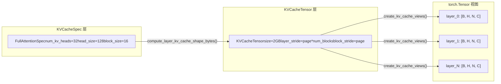

# 第 2 章：核心抽象：Request、Sequence 與 KV Cache 數據結構

上一章我們建立了 vLLM v1 的分層心智模型，知道請求從 API Server 出發，穿過 EngineCore，最終抵達 Worker 執行。但一個 HTTP 請求體裡的 JSON 字符串，是如何變成引擎內部可以調度、可以追蹤、可以中斷的對象的？這就是 Request 類要回答的問題。

# KV Cache 的規格體系：從 KVCacheSpec 到註冊表

Request 解決了「誰要計算」的問題，而`KVCacheSpec`解決的是「在哪裡計算」的問題。在 PagedAttention 的世界裡，每個模型層的 KV cache 都需要被精確地描述：它有多少個 head、每個 head 多大、一個 block 能存多少 token、是否需要量化。這些信息被編碼在`KVCacheSpec`的繼承體系中。

## 直覺模型：KVCacheSpec 是顯存的「戶型圖」

> **[Design Inference & Architectural Trade-offs]**
> 如果把 GPU 顯存想像成一塊待開發的土地，`KVCacheSpec`就是每棟樓（每個 cache group）的戶型圖：它規定了每層樓（每個 block）有多少個房間（head slot）、每個房間多大（head_size）、能住多少人（block_size 個 token）。而`KVCacheConfig`則是整個小區的規劃方案——總共多少棟樓、每棟樓佔多少地、哪些樓共用同一個地基（block table）。

沒有這套規格體系，KV cache 的分配就只能靠硬編碼的假設，無法支持從標準 MHA 到 MLA、從全注意力到滑動窗口、從 FP16 到 FP8 量化的多樣化模型需求。

## 數據結構：KVCacheSpec 的繼承樹與關鍵字段

`KVCacheSpec`是所有規格的基類，它是一個`@dataclass(frozen=True)` [FACT:vllm/v1/kv_cache_interface.py:150-152]。frozen 意味著規格對象一旦創建就不可變——這保證了多個組件（調度器、Worker、KV Cache Manager）看到的是同一份規格，不會因為某處修改而導致不一致。

基類定義了三個必須由子類實現的抽象屬性：`num_heads`、`tokens_per_state`、`state_content_size_bytes` [FACT:vllm/v1/kv_cache_interface.py:182-183]。這三個屬性共同決定了`page_size_bytes`——即一個 block 佔用的字節數。

`AttentionSpec`是最核心的子類，它引入了`num_kv_heads`、`head_size`、`dtype`、`kv_quant_mode`等字段[FACT:vllm/v1/kv_cache_interface.py:485-498]。其中`tokens_per_state`字段的設計尤為精妙：默認值為 1，表示一個 state 對應一個 token；但可以設為大於 1 的整數（如 DeepSeek-V4 的稀疏 MLA 將多個 token 壓縮為一個 state），或小於 1 的分數（如 Whisper 的 block pooling 用`Fraction(1, block_pool_size)`表示一個 token 對應多個 state）[FACT:vllm/v1/kv_cache_interface.py:501-501]。

`FullAttentionSpec`在`AttentionSpec`基礎上增加了`sliding_window`和`attention_chunk_size` [FACT:vllm/v1/kv_cache_interface.py:566-566]。注意它的文檔字符串解釋了一個重要的設計決策：當混合分配器被禁用時，滑動窗口注意力層在 KV Cache Manager 中被當作全注意力處理（為所有 token 分配 block），但在模型運行時仍按滑動窗口計算[FACT:vllm/v1/kv_cache_interface.py:540-545]。這是一種**保守分配、精確計算**的策略。

`MLAAttentionSpec`是 DeepSeek 系列模型的關鍵規格。它將`head_size_v`默認設為 0[FACT:vllm/v1/kv_cache_interface.py:670]，因為 MLA 只存儲一個 latent vector，沒有獨立的 V。`alignment`字段用於頁對齊填充[FACT:vllm/v1/kv_cache_interface.py:646-652]，這對 FlashMLA 等需要特定對齊的後端至關重要。

`MambaSpec`則完全不走 attention 的路線。它用`shapes`和`dtypes`元組描述狀態張量的形狀[FACT:vllm/v1/kv_cache_interface.py:1027-1028]，`state_content_size_bytes`是所有狀態張量大小的總和[FACT:vllm/v1/kv_cache_interface.py:1048-1052]。Mamba 的`max_memory_usage_bytes`根據`mamba_cache_mode`有三種不同的計算方式[FACT:vllm/v1/kv_cache_interface.py:1073-1084]，這反映了 Mamba 狀態管理的複雜性——它不像 attention 那樣線性增長，而是有固定的狀態大小。

## 場景驅動：從規格到顯存佈局的轉換

當引擎啟動時，它需要將所有層的`KVCacheSpec`轉換為實際的顯存佈局。這個過程由`KVCacheTensor`和`create_kv_cache_views`完成。

`KVCacheTensor`描述了一組同形狀層在 KV cache 分配中的位置[FACT:vllm/v1/kv_cache_interface.py:1406-1427]。它的核心字段是`layer_stride`和`block_stride`：前者是相鄰層之間的字節距離，後者是相鄰 block 之間的字節距離。文檔字符串詳細解釋了兩種佈局模式：層外層佈局（layer-outermost）給每層一個連續區域，塊外層佈局（block-outermost）讓每個 block 包含所有層的 page[FACT:vllm/v1/kv_cache_interface.py:1416-1416]。

`create_kv_cache_views`函數是這個過程的核心[FACT:vllm/v1/kv_cache_interface.py:353-417]。它接收一個扁平的 int8 buffer，通過`torch.as_strided`為每一層創建一個 4D 視圖`[B, H, N, C]`。關鍵參數是`strides`，它由`compute_layout_strides`計算得出[FACT:vllm/v1/kv_cache_interface.py:314-350]。這個函數按照`layout.stride_order`指定的維度順序，從最內層維度開始反向計算每個維度的字節步長。

這裡有一個值得注意的邊界檢查：當 kernel_block_size 小於 spec.block_size 時（即一個 manager block 被拆分為多個 kernel block），代碼會驗證 block_stride 是否等於 dense_page_size[FACT:vllm/v1/kv_cache_interface.py:381-382]。如果不等於，說明佈局中存在 padding，無法均勻拆分，此時會拋出帶有明確修復建議的 ValueError。

## 設計思考：註冊表模式與可擴展性

`KVCacheSpecRegistry`是 vLLM 可擴展性的關鍵設計[FACT:vllm/v1/kv_cache_spec_registry.py:39-40]。它維護了兩個全局字典：`_REGISTRY_KVCACHESPEC_LIST`存儲 spec 類到元數據的映射，`_REGISTRY_ROLE_MANAGERS`存儲角色到管理器的映射[FACT:vllm/v1/kv_cache_spec_registry.py:35-36]。

`get_manager_class`方法展示了註冊表的核心查找邏輯：它沿著 spec 類的 MRO（方法解析順序）向上遍歷，找到第一個已註冊的基類[FACT:vllm/v1/kv_cache_spec_registry.py:129-130]。這意味著一個自定義的`CustomFullAttentionSpec`如果沒有單獨註冊，會自動繼承`FullAttentionSpec`的管理器。這種**基於繼承的查找**使得新增 spec 類型時只需註冊差異部分。

`check_kv_cache_spec_registry`方法在啟動時驗證所有層的 spec 都已註冊[FACT:vllm/v1/kv_cache_spec_registry.py:165-174]。注意它使用`raise ValueError`而非`assert`，註釋明確說明這是為了在生產環境中也生效[FACT:vllm/v1/kv_cache_spec_registry.py:165-174]。這是一個重要的工程決策：Python 的`-O`標誌會移除 assert，但生產環境中的配置錯誤必須在啟動時就暴露，而不是在運行時才崩潰。

> **[Design Inference & Architectural Trade-offs]**
> 註冊表的延遲初始化設計（`_ensure_registered`）解決了一個循環依賴問題：`kv_cache_interface.py`需要引用註冊表來檢查 spec 類型，而註冊表需要導入`single_type_kv_cache_manager`來取得管理器類，後者又依賴`kv_cache_interface`。透過將實際註冊推遲到第一次查詢時執行，打破了這個循環。

# 本章小結

本章剖析了 vLLM v1 的兩個核心資料結構。`Request`是請求在引擎內部的生命週期載體，它透過雙 token 列表、非同步排程計數器和 block hash 機制，支撐了連續批次處理和前綴快取兩大核心功能。`KVCacheSpec`及其繼承體系則定義了 KV cache 的顯存佈局規格，從標準的`FullAttentionSpec`到`MLAAttentionSpec`、`MambaSpec`，涵蓋了多樣化的模型架構需求。註冊表模式使得新增 spec 類型無需修改核心程式碼，保證了系統的可擴展性。

至此，我們已經看清了 Request 如何從 EngineCoreRequest 轉換而來，以及它如何透過狀態計數器、block hash 等機制支撐排程決策。但一個外部請求究竟如何穿越 API Server、chat template 與多模態處理，最終變成 EngineCoreRequest？下一章將進入請求入口層，完整追蹤這條從 HTTP/CLI 到 EngineCore 的鏈路。
