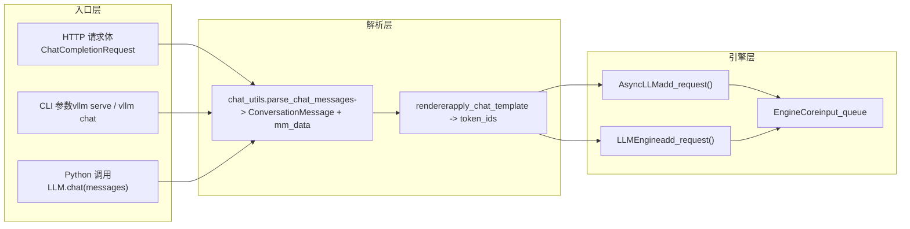

# 第 3 章：請求入口：從 HTTP/CLI 到 EngineCore 的完整鏈路

上一章我們剖析了 Request 與 KVCacheSpec 這兩個引擎內部的核心資料結構，理解了邏輯序列與物理顯存塊如何解耦。但一個 HTTP 請求體或一個 Python 字串，究竟如何穿越 API Server、chat template 與多模態處理，最終變成 EngineCoreRequest？本章將完整追蹤這條鏈路，並揭示同步 CLI、非同步 API 與離線 LLM 類三條入口路徑如何匯聚到同一引擎核心。

# 3.1 三條入口路徑的收斂點：AsyncLLMEngine 與 LLMEngine

在深入請求解析之前，必須先看清三條入口路徑的拓撲結構。vLLM 提供了三種使用方式：`vllm serve`啟動的 OpenAI 相容 HTTP 服務、命令列`vllm`工具、以及 Python 中直接實例化`LLM`類做離線推理。它們看似獨立，實則共享同一套引擎核心。

先看非同步 API 路徑的別名機制。

[FACT:vllm/engine/async_llm_engine.py:7-7]

這個檔案短得幾乎不像一個模組——它只做了一件事：把`AsyncLLMEngine`別名指向`vllm.v1.engine.async_llm.AsyncLLM`。這是一個典型的架構遷移痕跡。vLLM v0 時代的`AsyncLLMEngine`是一個龐大而複雜的類，v1 架構重寫後，新的`AsyncLLM`承擔了相同職責。為了不破壞既有使用者程式碼，vLLM 保留了舊模組路徑作為相容層。

> **[Design Inference & Architectural Trade-offs]**
> 這種「舊路徑別名指向新實現」的模式在 vLLM 中反覆出現（如`api_server.py`的 deprecation warning），說明專案在 v0 到 v1 的遷移中採取了漸進式策略：新程式碼用新路徑，舊程式碼不報錯但會收到警告，給使用者足夠的遷移窗口。

再看離線路徑的入口。

[FACT:vllm/entrypoints/llm.py:344-346]

`LLM.__init__`最終呼叫`LLMEngine.from_engine_args`，傳入`UsageContext.LLM_CLASS`。這個`UsageContext`枚舉是區分入口路徑的關鍵——它讓引擎知道自己是運行在離線批次處理模式還是在線服務模式，從而調整日誌、指標和資源管理策略。

[FACT:vllm/entrypoints/llm.py:357-359]

注意這裡`self.renderer = self.llm_engine.renderer`和`self.input_processor = self.llm_engine.input_processor`的賦值。離線`LLM`類並不自己實現 chat template 渲染，而是複用引擎內部的`renderer`。這意味著 chat template 的解析邏輯在離線與在線路徑上是同一份程式碼，只是呼叫時機不同。

三條路徑的收斂關係可以用下面的資料流圖表示。

這張圖揭示了一個關鍵設計：無論請求來自 HTTP、CLI 還是 Python，`chat_utils`都是多模態與 chat template 處理的唯一入口。它把異構的輸入格式統一為`ConversationMessage`列表加`MultiModalDataDict`，再交給 renderer 生成 token 序列。

# 3.2 chat_utils：從異構訊息到統一對話結構

`chat_utils.py`是整個請求入口層最複雜的模組，2264 行程式碼處理了 OpenAI 相容格式、自訂擴展、多模態嵌入、工具呼叫等所有輸入形態。它的核心職責可以用一句話概括：把使用者傳來的任意訊息列表，規範化為 chat template 能理解的`ConversationMessage`列表，同時把多模態資料抽取到獨立的`MultiModalDataDict`中。

## 直覺模型：翻譯官與行李分揀員

把`chat_utils`想像成機場的翻譯官兼行李分揀員。旅客（使用者）來自不同國家（OpenAI 格式、自訂格式、Harmony 格式），說著不同的語言。翻譯官先把所有人的話翻譯成統一的工作語言（`ConversationMessage`），同時把旅客託運的行李（圖片、音訊、影片）分揀到獨立的傳送帶上（`MultiModalDataDict`），貼上標籤（UUID），最後把人和行李分別送上同一架飛機（引擎）。

如果沒有這一層，引擎就必須理解每一種輸入格式的細節，多模態資料的提取邏輯會散落在各個入口中，任何新格式的加入都要改動引擎核心。

## 資料結構：追蹤器與解析器的雙類協作

`chat_utils`的核心是兩組類的協作：`BaseMultiModalItemTracker`及其子類負責「追蹤」多模態項，`BaseMultiModalContentParser`及其子類負責「解析」內容部分。

先看追蹤器的欄位佈局。

[FACT:vllm/entrypoints/chat_utils.py:598-601]

`_items_by_modality`是一個`defaultdict[str, list[_T]]`，按模態（image、audio、video 等）分組儲存待處理的項。`_modality_order`則專門為`vision_chunk`模態記錄每個 chunk 的原始模態（image 還是 video），因為統一視覺 chunk 模型會把兩者都映射到`vision_chunk`，但後續處理需要知道原始類型。

[FACT:vllm/entrypoints/chat_utils.py:613-615]

`use_unified_vision_chunk_modality`是一個`cached_property`，從 HuggingFace 配置中讀取`use_unified_vision_chunk`標誌。使用`cached_property`而非普通屬性，是因為這個檢查在每次`add`呼叫時都會觸發，快取可以避免重複的`getattr`開銷。

追蹤器的`add`方法是核心入口。

[FACT:vllm/entrypoints/chat_utils.py:656-684]

`add`方法先呼叫`_validate_add`做校驗，然後根據是否使用統一視覺 chunk 模態，把項存入不同的鍵下。注意`prompt_embeds`的特殊處理：它直接追加到`_items_by_modality["prompt_embeds"]`並返回`None`，因為預計算嵌入不經過 HF processor，沒有佔位符字串。

`_validate_add`中的校驗邏輯值得細看。

[FACT:vllm/entrypoints/chat_utils.py:686-721]

這裡有一個微妙的分支：當`enable_mm_embeds=True`且該模態的每 prompt 限制為 0 且原始模態以`_embeds`結尾時，跳過數量校驗。這是為了允許嵌入輸入繞過原始模態的數量限制——嵌入是預計算的，不佔用原始模態的處理資源。

## 場景驅動：一次帶圖片的 chat 請求如何被解析

假設使用者發送一個包含圖片 URL 和文字的 chat 請求。`parse_chat_messages`是同步路徑的入口。

[FACT:vllm/entrypoints/chat_utils.py:2161-2197]

`parse_chat_messages`建立`MultiModalItemTracker`，遍歷每條訊息呼叫`_parse_chat_message_content`，最後呼叫`_postprocess_messages`處理工具呼叫參數，再透過`mm_tracker.resolve_items()`物化多模態資料。

`_parse_chat_message_content`負責單條訊息的解析。

[FACT:vllm/entrypoints/chat_utils.py:2007-2029]

它先規範化 content：`None`變成空列表，字串變成單個文字 part。然後呼叫`_parse_chat_message_content_parts`，其中`wrap_dicts`參數由`content_format == "openai"`決定——這決定了輸出是結構化字典列表還是拼接後的字串。

`_parse_chat_message_content_parts`遍歷每個 part。

[FACT:vllm/entrypoints/chat_utils.py:1814-1853]

每個 part 經過`_parse_chat_message_content_part`處理。如果`wrap_dicts=False`，最終會把文字和佔位符拼接成單個字串；如果`wrap_dicts=True`，則返回結構化字典列表。

`_parse_chat_message_content_part`是分發的核心。

[FACT:vllm/entrypoints/chat_utils.py:1875-1884]

對於純文字 part，先做保留佔位符檢查，再根據`wrap_dicts`決定返回格式。對於結構化 part，呼叫`_parse_chat_message_content_mm_part`提取類型和內容。

[FACT:vllm/entrypoints/chat_utils.py:1690-1723]

`_parse_chat_message_content_mm_part`透過`MM_PARSER_MAP`查找對應的解析函式。注意`uuid is None`的條件——如果使用者提供了 UUID，說明媒體資料可能不在請求體中（已透過其他方式上傳），此時走下面的直接 URL 欄位分支。

[FACT:vllm/entrypoints/chat_utils.py:1731-1733]

當`part_type is None`或`uuid is not None`時，程式碼嘗試從 part 中直接提取 URL 欄位。這種「寬鬆解析」是為了相容那些不嚴格遵循 OpenAI 格式的客戶端。

回到`_parse_chat_message_content_part`，媒體類型的 part 會被分發到對應的`mm_parser`方法。

[FACT:vllm/entrypoints/chat_utils.py:1923-1968]

每個媒體類型呼叫對應的`parse_*`方法，這些方法內部會呼叫`tracker.add`把項加入追蹤器，並返回佔位符字串。最後根據`interleave_strings`決定返回佔位符還是`None`。

[FACT:vllm/entrypoints/chat_utils.py:1984-1999]

`prompt_embeds`的處理是特殊的：無論`interleave_strings`如何，都返回`PROMPT_EMBEDS_PLACEHOLDER_TOKEN`。註解解釋了原因——prompt_embeds 在 token 偏移處拼接，位置很重要，如果走`missing_placeholders`的前置填充邏輯會打亂順序。

## 非同步路徑的差異

非同步路徑使用`AsyncMultiModalItemTracker`和`AsyncMultiModalContentParser`。核心差異在`resolve_items`。

[FACT:vllm/entrypoints/chat_utils.py:906-952]

非同步版本用`asyncio.gather`並發等待所有模態項。註解明確指出：每個追蹤項已經是獨立的 awaitable，非同步連接器會把阻塞的解碼工作卸載到執行緒池，所以串行等待一個模態再等下一个會無謂地增加延遲。`return_exceptions=True`讓所有任務都完成或失敗後再統一拋出，避免第一個失敗就放棄仍在進行中的網路請求。

## 設計思考：為什麼追蹤器與解析器分離

> **[Design Inference & Architectural Trade-offs]**
> 追蹤器與解析器的分離是一個值得玩味的設計。追蹤器負責「狀態管理」——記錄每個模態有多少項、校驗數量限制、維護 vision_chunk 的原始模態順序。解析器負責「內容提取」——從 URL 取得圖片、從 base64 解碼嵌入、處理音訊格式轉換。這種分離使得同步和非同步路徑可以共享追蹤邏輯（`BaseMultiModalItemTracker`是抽象基類），只在解析器層面分叉。如果合併成一個類，同步和非同步的差異會滲透到追蹤邏輯中，導致程式碼重複和狀態管理複雜化。

# 3.3 從訊息到 token：renderer 與 EngineCore 的交接

`chat_utils`產出的`ConversationMessage`列表和`MultiModalDataDict`還需要經過 chat template 渲染才能變成 token 序列。這一步由 renderer 完成，之後請求才真正進入引擎。

## 場景驅動：chat template 渲染與請求投遞

`parse_chat_messages`返回後，呼叫方（如`OpenAIServingChat`）會把`conversation`和`mm_data`傳給 renderer。renderer 應用 chat template，把`ConversationMessage`列表渲染成文本，再 tokenize 成 token ID 序列。多模態佔位符（如`<##IMAGE##>`）在 tokenize 後會被替換為模型特定的佔位符 token。

渲染完成後，請求被封裝為`EngineCoreRequest`，透過`AsyncLLM.add_request()`或`LLMEngine.add_request()`投遞到 EngineCore 的輸入佇列。

[FACT:vllm/entrypoints/llm.py:420-484]

離線`LLM.generate`方法展示了這條鏈路：它先校驗`runner_type`，取得預設取樣參數，然後呼叫`_run_completion`。`_run_completion`內部會呼叫 renderer 渲染 prompt，再透過`llm_engine`投遞請求。

[FACT:vllm/entrypoints/llm.py:615-708]

`LLM.chat`方法則展示了 chat 路徑：它接收`messages`列表，呼叫`_run_chat`，後者內部會呼叫`parse_chat_messages`和 renderer。

## 設計思考：為什麼 renderer 在引擎內部

> **[Design Inference & Architectural Trade-offs]**
> `LLM.__init__`中`self.renderer = self.llm_engine.renderer`這一行揭示了一個重要設計決策：renderer 屬於引擎而非入口層。這意味著 chat template 的載入、快取和預熱（`self.renderer.warmup(ChatParams(...))`）都在引擎初始化時完成，入口層只是呼叫者。這樣做的好處是：離線`LLM`和線上`AsyncLLM`共享同一份 renderer 實作和快取，避免重複載入 tokenizer 和 chat template。同時，renderer 的預熱可以在引擎啟動時完成，避免首個請求的冷啟動延遲。

## 錯誤恢復與生產踩坑

`_postprocess_messages`中的工具呼叫參數處理是一個典型的生產環境陷阱。

[FACT:vllm/entrypoints/chat_utils.py:2118-2158]

當 assistant 訊息包含`tool_calls`時，`arguments`欄位可能是 JSON 字串、字典或無效 JSON。程式碼嘗試解析 JSON 字串，如果失敗則記錄警告並強制轉為空物件。註解解釋了原因：格式錯誤的`arguments`存在於對話歷史中，如果在這裡讓請求失敗，後續每一輪都會失敗，對話將無法恢復。這是一個深思熟慮的容錯設計——寧可讓模型看到空的工具參數，也不讓整個對話卡死。

另一個陷阱是保留佔位符的注入防護。

[FACT:vllm/entrypoints/chat_utils.py:1856-1872]

當`enable_prompt_embeds`開啟時，`PROMPT_EMBEDS_PLACEHOLDER_TOKEN`被註冊為不可分割的特殊 token。如果使用者文本中恰好包含這個字面序列，tokenizer 會把它編碼為同一個 token ID，renderer 會誤認為這是拼接點，允許呼叫者透過純文字內容移動或注入拼接位置。`_reject_reserved_placeholder_in_text`在文本 part 解析時拒絕這種輸入，堵住了這個安全漏洞。

[FACT:vllm/entrypoints/chat_utils.py:1889-1892]

注意這個檢查在`isinstance(part, str)`分支和結構化文本分支中都有呼叫，確保所有文本路徑都經過防護。

# 本章小結

本章追蹤了請求從外部進入系統的第一段鏈路。三條入口路徑——HTTP API、CLI 和離線`LLM`類——最終都匯聚到`chat_utils`的多模態解析層。`BaseMultiModalItemTracker`負責狀態管理，`BaseMultiModalContentParser`負責內容提取，兩者分離使得同步和非同步路徑可以共享追蹤邏輯。`parse_chat_messages`把異構訊息規範化為`ConversationMessage`列表和`MultiModalDataDict`，再交給引擎內部的 renderer 完成 chat template 渲染和 tokenize。最終，請求被封裝為`EngineCoreRequest`投遞到 EngineCore 的輸入佇列。

# 本章思考與自測

Q1: 在`_parse_chat_message_content_mm_part`中，如果去掉`uuid is None`這個條件（即改為`if isinstance(part_type, str) and part_type in MM_PARSER_MAP:`），在什麼場景下會導致問題？

**參考解析**：`uuid is None`條件的存在是為了處理「使用者提供了 UUID 但媒體資料不在請求體中」的場景。當使用者提供 UUID 時，媒體資料可能已經透過其他方式上傳（如預先上傳到媒體快取），此時請求體中的 part 可能只包含 UUID 而不包含實際的 URL 或資料。如果去掉這個條件，程式碼會嘗試透過`MM_PARSER_MAP[part_type](part)`解析，但 part 中可能沒有對應的資料欄位（如`image_url`為空），導致解析出`None`內容。更嚴重的是，後續的`parse_image(None, uuid)`會呼叫`_connector.fetch_image(None)`，可能觸發不必要的網路請求或異常。`uuid is not None`分支則走直接欄位提取路徑，正確處理了「有 UUID 無資料」的情況。參見[FACT:vllm/entrypoints/chat_utils.py:1713-1723]和[FACT:vllm/entrypoints/chat_utils.py:1731-1733]。

Q2: `AsyncMultiModalItemTracker.resolve_items`使用`asyncio.gather(..., return_exceptions=True)`而非預設的`return_exceptions=False`。如果改為`False`，在什麼並發場景下會導致資源洩漏？

**參考解析**：`return_exceptions=False`時，`asyncio.gather`會在第一個異常拋出時立即返回，但其他仍在進行中的任務不會被取消——它們會繼續在背景執行。這些任務可能持有網路連線、執行緒池工作項或檔案句柄。如果這些任務最終失敗，異常會被靜默丟棄（因為 gather 已經返回），導致資源洩漏和難以排查的錯誤。`return_exceptions=True`讓所有任務都完成或失敗後再統一檢查，確保沒有任務被遺棄。註解明確說明了這一點：「Gathering with return_exceptions=True lets every task finish (or itself fail) before we raise, instead of abandoning still-in-flight fetches (real network/thread-pool work) the moment the first one fails.」參見[FACT:vllm/entrypoints/chat_utils.py:924-931]。

Q3: `_postprocess_messages`中，當`arguments`是無效 JSON 時，程式碼選擇強制轉為空物件而非拋出異常。如果改為拋出異常，在什麼生產場景下會導致不可恢復的對話狀態？

**參考解析**：`arguments`欄位存在於對話歷史中（assistant 訊息的`tool_calls`）。如果某輪對話中模型生成了格式錯誤的`arguments`，這個錯誤會被保存在對話歷史中。如果`_postprocess_messages`在解析歷史時拋出異常，那麼後續每一輪請求都會因為歷史中的這個錯誤而失敗——即使當前輪次的輸入完全正確。使用者將無法繼續這個對話，只能放棄整個會話重新開始。強制轉為空物件讓對話可以繼續，模型看到空的工具參數後會重新生成正確的呼叫。註解解釋了這一點：「A malformed arguments string lives in conversation history, so failing the request here would fail every subsequent turn too and leave the conversation unrecoverable.」參見[FACT:vllm/entrypoints/chat_utils.py:2124-2139]。

下一章將進入排程器，看 EngineCore 如何用連續批次處理與顯存感知策略編排這些請求。

至此，請求已經完成從外部輸入到 EngineCoreRequest 的規範化轉換，並抵達引擎核心的入口。但請求進入之後並不會立即執行——引擎需要決定在每一步中處理哪些請求、如何分配有限的顯存資源。下一章將深入 EngineCore 的排程迴圈，剖析 Scheduler 如何在連續批次處理中權衡吞吐與延遲，以及 chunked prefill、prefix caching 與 KV block 分配如何協同工作。
