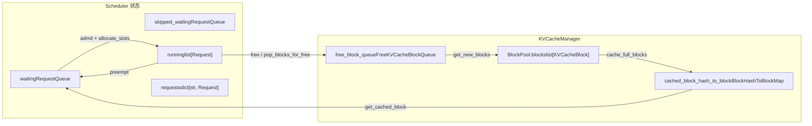
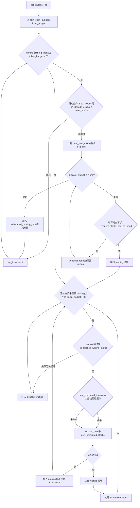

# 第 4 章：排程器：連續批次處理與顯存感知的請求編排

請求進入 EngineCore 的輸入佇列後，並不會立即被執行。每一步處理哪些請求、為每個請求分配多少 token 預算、顯存不足時優先犧牲誰，這些決策都集中在`Scheduler.schedule()`方法中。本章從排程器的資料結構入手，追蹤一次`schedule()`呼叫如何將 waiting 佇列、running 列表和 KV cache 池組織成一個可執行的批次。

# 4.1 排程器的資料結構：三個佇列與一個顯存池

排程器要回答的核心問題是：**在有限的 token 預算和 KV block 預算下，這一步該讓哪些請求前進多少 token？**要理解它，先要看清它手裡握著哪些狀態。

排程器維護三類請求容器。`self.requests`是全域字典，`req_id -> Request`，所有活躍請求的唯一真相來源[FACT:vllm/v1/core/sched/scheduler.py:208-209]。`self.waiting`和`self.skipped_waiting`是兩個優先級佇列，前者放正常等待排程的請求，後者放因非同步依賴或約束暫時無法排程的請求（如等待遠端 KV、等待結構化輸出語法編譯）[FACT:vllm/v1/core/sched/scheduler.py:208-209]。`self.running`是一個普通列表，存放已經進入運行態、持有 KV block 的請求[FACT:vllm/v1/core/sched/scheduler.py:208-209]。

這裡有一個容易被忽略的設計：`max_num_running_reqs`與`max_num_active_reqs`是兩個不同的上限。前者來自`max_num_seqs`，決定 model runner 的槽位數；後者來自`max_num_active_seqs`，只限制能進入 RUNNING 的請求數，預設等於前者[FACT:vllm/v1/core/sched/scheduler.py:123-131]。這個分離允許在不縮小 CUDA graph 捕獲容量的前提下，壓低實際並行解碼批次大小。

顯存側由`KVCacheManager`統一管理，它內部持有`BlockPool`。`BlockPool`的核心是`self.blocks`（全部`KVCacheBlock`的列表）和`free_block_queue`（一個按驅逐順序排列的空閒塊雙向鏈結串列）[FACT:vllm/v1/core/block_pool.py:171-177]。注意`null_block`的存在：它是從空閒佇列頭部彈出的第一個塊，`is_null=True`，引用計數不參與常規維護，專門用作佔位符[FACT:vllm/v1/core/block_pool.py:183-187]。當請求的某個 token 位置不需要真實 KV block（例如被滑動視窗跳過的位置）時，block table 裡就填這個 null block。

前綴快取的索引結構是`BlockHashToBlockMap`，它把`BlockHashWithGroupId`映射到一個`KVCacheBlock`或一個`{block_id: KVCacheBlock}`字典[FACT:vllm/v1/core/block_pool.py:56-59]。為什麼要用聯合類型？註解給出了答案：大多數雜湊只對應一個塊，用字典會產生不必要的 GC 開銷；只有當同一個雜湊被多個塊共享時才升級為字典[FACT:vllm/v1/core/block_pool.py:56-59]。這是一個典型的用類型複雜度換執行時開銷的取捨。

`KVCacheBlocks`是排程器與 KV cache 管理器之間的介面物件，它把內部資料結構隱藏起來。它的`blocks`欄位是`tuple[Sequence[KVCacheBlock], ...]`，外層維度是 KV cache group，內層是塊序列[FACT:vllm/v1/core/kv_cache_manager.py:41-54]。註解明確解釋了為什麼不用塊作為外層維度：那會假設所有 group 的塊數相同，而未來可能給不同 group 配置不同的 block size[FACT:vllm/v1/core/kv_cache_manager.py:43-48]。



這張圖錨定了排程器與顯存池之間的資料流：waiting 佇列的請求透過`allocate_slots`進入 running，running 的請求被搶佔時回到 waiting，釋放的塊回到空閒佇列，而前綴快取雜湊表是 waiting 請求命中快取的入口。

# 4.2 schedule() 主流程：running 優先、waiting 補充、搶佔兜底

`schedule()`是整個排程器的核心方法，它回傳一個`SchedulerOutput`，描述這一步要執行什麼。方法開頭的註解點明了設計哲學：排程器裡沒有「解碼階段」和「預填充階段」的區分，每個請求只有`num_computed_tokens`和`num_tokens_with_spec`，排程器的任務就是讓前者追上後者[FACT:vllm/v1/core/sched/scheduler.py:559-568]。這個統一視角是 chunked prefill、prefix caching、投機解碼能共存的基礎。

## 4.2.1 預算初始化與閾值計算

進入主迴圈前，排程器先設定兩個預算：`token_budget`初始化為`max_num_scheduled_tokens`，`input_budget`初始化為`max_num_batched_tokens` [FACT:vllm/v1/core/sched/scheduler.py:577-580]。兩者通常相等，但當模型可能在批次中追加 token（如投機解碼）時，`max_num_scheduled_tokens`會小於`max_num_batched_tokens`，差值就是留給 draft token 的空間。

`long_prefill_token_threshold`的處理值得單獨看。它的作用是防止一個長 prefill 餓死其他請求，但如果當前只有一個請求，就沒有人會被餓死，所以閾值被置零[FACT:vllm/v1/core/sched/scheduler.py:606-616]。當`adaptive_long_prefill_threshold`開啟時，閾值還會被抬高到`input_budget // num_eligible_reqs`，保證不會把單個請求的預算壓到公平份額以下[FACT:vllm/v1/core/sched/scheduler.py:617-622]。

## 4.2.2 running 請求的排程迴圈

主迴圈從`self.running`的頭部開始遍歷，`req_index`是游標[FACT:vllm/v1/core/sched/scheduler.py:624-627]。對每個請求，先做一系列跳過判斷：

- 非同步排程下，如果請求的輸出佔位符表明它已經達到`max_tokens`，跳過以避免多跑一步[FACT:vllm/v1/core/sched/scheduler.py:631-645]。
- V2 + PP + 非同步場景下，如果當前步還沒到`next_decode_eligible_step`，跳過以匹配 worker 側的取樣 token 廣播節奏[FACT:vllm/v1/core/sched/scheduler.py:647-651]。
- DP prefill 均衡開啟時，非節奏對齊步上的 prefill chunk 被推遲[FACT:vllm/v1/core/sched/scheduler.py:653-657]。

透過跳過判斷後，計算這個請求本步能前進多少 token：

```
num_new_tokens = request.num_tokens_with_spec
               + request.num_output_placeholders
               - request.num_computed_tokens
```

然後依次被`long_prefill_token_threshold`、`token_budget`、`input_budget - draft_slots`和`max_model_len`約束[FACT:vllm/v1/core/sched/scheduler.py:670-688]。如果請求帶編碼器輸入，還要經過`_try_schedule_encoder_inputs`調整[FACT:vllm/v1/core/sched/scheduler.py:700-712]。

接下來是最關鍵的一步：分配 KV block。`allocate_slots`被包在一個`while True`迴圈裡[FACT:vllm/v1/core/sched/scheduler.py:742-747]。如果回傳`None`，說明顯存不夠，排程器開始搶佔：按策略選出犧牲者（PRIORITY 策略選優先級最低的，FCFS 策略選 running 列表末尾的）[FACT:vllm/v1/core/sched/scheduler.py:761-767]，呼叫`_preempt_request`把它踢回 waiting 佇列，然後重試分配[FACT:vllm/v1/core/sched/scheduler.py:801-806]。如果犧牲者就是當前請求自己，說明已經沒有可搶佔的對象，跳出迴圈，當前請求也無法排程[FACT:vllm/v1/core/sched/scheduler.py:807-813]。

搶佔邏輯裡有一個精妙的細節：PRIORITY 策略下，如果被搶佔的請求已經在`scheduled_running_reqs`裡（即本步已經為它分配過資源），需要把它的 token 預算、block、投機 token、編碼器預算全部歸還[FACT:vllm/v1/core/sched/scheduler.py:779-797]。這保證了預算帳本的一致性。

分配成功後，請求被加入`scheduled_running_reqs`，記錄 block 和 token 數，扣減預算[FACT:vllm/v1/core/sched/scheduler.py:815-823]。投機解碼相關的 token 在這裡被裁剪並記錄[FACT:vllm/v1/core/sched/scheduler.py:825-841]。

## 4.2.3 waiting 請求的准入

running 迴圈結束後，如果本步沒有發生搶佔且排程器未暫停，開始處理 waiting 佇列[FACT:vllm/v1/core/sched/scheduler.py:868-872]。准入前先檢查兩個上限：`max_num_active_reqs`和`input_budget` [FACT:vllm/v1/core/sched/scheduler.py:873-879]。

waiting 請求的排程比 running 多了一個前綴快取查找步驟。當`request.num_computed_tokens == 0`時，呼叫`_get_local_prefix_cache_hit`查找本地快取命中[FACT:vllm/v1/core/sched/scheduler.py:932-939]。如果配置了 KV connector，還會查詢遠端快取命中[FACT:vllm/v1/core/sched/scheduler.py:942-954]。

這裡有一個處理本地與遠端命中衝突的精細邏輯。本地命中可能不是塊對齊的（`partial_tail`），而遠端命中如果嚴格超過本地完整命中，就丟棄本地的子塊尾部，讓遠端載入覆蓋它，避免寫時複製[FACT:vllm/v1/core/sched/scheduler.py:977-988]。反之則保留本地尾部，不載入外部[FACT:vllm/v1/core/sched/scheduler.py:989-995]。

准入成功後，請求從 waiting 佇列彈出，狀態設為 RUNNING，加入 running 列表[FACT:vllm/v1/core/sched/scheduler.py:1263-1319]。如果本步之後它仍在 prefill 中（`num_computed_tokens + num_new_tokens < request.num_tokens`），加入`_inflight_prefills`集合[FACT:vllm/v1/core/sched/scheduler.py:1326-1328]。



這張控制流圖覆蓋了`schedule()`的兩大迴圈和搶佔分支。注意 running 迴圈中`allocate_slots`失敗後的搶佔重試路徑，以及 waiting 迴圈中 blocked 狀態請求被移入`skipped_waiting`的旁路。

# 4.3 顯存感知的核心：allocate_slots 與搶佔

`allocate_slots`是排程器與顯存之間的閘門。它的參數列表本身就是一份顯存帳本：`num_new_tokens`是要新計算的 token 數，`num_new_computed_tokens`是前綴快取新命中的 token 數，`num_external_computed_tokens`是 connector 提供的外部命中數，`num_lookahead_tokens`是投機解碼預留的槽位[FACT:vllm/v1/core/kv_cache_manager.py:371-383]。

方法開頭的註解用一張 ASCII 圖精確描述了塊佈局[FACT:vllm/v1/core/kv_cache_manager.py:417-438]：

```
|  |  |   |   |  |
                                          |        |
                        |                       |
```

`comp`是已計算 token，`new_comp`是前綴快取命中，`ext_comp`是外部命中，`new`是本步新計算，`lookahead`是投機預留。分配分三個階段：先釋放不需要的塊並檢查是否有足夠空閒塊，再處理前綴 token，最後為新計算 token 分配塊[FACT:vllm/v1/core/kv_cache_manager.py:458-461]。

## 4.3.1 水位線與准入控制

`allocate_slots`裡有兩個准入閘門。第一個是`full_sequence_must_fit`：當開啟時，先檢查整個請求序列（而非僅第一個 chunk）能否裝下，裝不下直接返回`None` [FACT:vllm/v1/core/kv_cache_manager.py:515-531]。這防止 chunked prefill 下過度准入導致 KV cache 抖動。

第二個是水位線。`watermark_blocks`只在請求狀態為 WAITING 或 PREEMPTED 且已有請求被排程時生效[FACT:vllm/v1/core/kv_cache_manager.py:506-513]。它要求分配後至少保留一定比例的空閒塊，避免頻繁驅逐和搶佔。`reserved_blocks`則用於非同步 KV 載入場景，確保在途 prefill 的預留塊不被新請求吃掉[FACT:vllm/v1/core/kv_cache_manager.py:564-570]。

## 4.3.2 搶佔的代價與恢復

> **[Design Inference & Architectural Trade-offs]**
> `_preempt_request`做了一件看似暴力但必要的事：把請求的`num_computed_tokens`重置為 0[FACT:vllm/v1/core/sched/scheduler.py:1560-1561]。這意味著被搶佔的請求下次排程時要從頭重新 prefill。為什麼這麼設計？ 因為 vLLM 的 KV block 是請求私有的，搶佔時必須釋放全部塊，而釋放後無法保證重新分配時能拿到相同的塊，所以只能從頭計算。前綴快取的存在讓這個代價部分被抵消：如果被搶佔請求的前綴已經被快取，重新排程時能命中快取，不必真正重算。

搶佔還處理了非同步排程下的「陳舊輸出」問題。`num_stale_output_tokens`被設為`num_in_flight_tokens`，標記所有在途輸出為陳舊[FACT:vllm/v1/core/sched/scheduler.py:1571-1574]。這些 token 仍會被交付（丟棄會擾動投機解碼接受率），但不會修改重置後的計數器。`drop_stale_output`標誌決定是丟棄還是交付[FACT:vllm/v1/core/sched/scheduler.py:1539-1547]。

## 4.3.3 延遲釋放：非同步連接器的寫後讀風險

當使用 KV connector 且存在多個在途批次時，`defer_block_free`被設為`True` [FACT:vllm/v1/core/sched/scheduler.py:175-181]。原因是：一個步驟可能仍在寫入已釋放請求的 KV 塊，而消費者 connector 可能透過一個未與該寫入排序的載入重新分配並填充這些塊。

延遲釋放透過`deferred_frees`雙端佇列實現，每個條目是`(fence_seq, blocks)` [FACT:vllm/v1/core/sched/scheduler.py:388-390]。`_free_request_blocks`檢查`_request_blocks_can_be_freed`，如果請求的最後排程步還沒被處理完，就把塊放入延遲佇列[FACT:vllm/v1/core/sched/scheduler.py:2679-2688]。`_drain_deferred_frees`在`update_from_output`中推進`processed_step_seq`後調用，釋放 fence 已滿足的塊[FACT:vllm/v1/core/sched/scheduler.py:2701-2706]。

# 4.4 前綴快取命中判定與塊生命週期

前綴快取的查找入口是`KVCacheManager.get_computed_blocks`。它先檢查是否啟用快取且請求未標記跳過讀取[FACT:vllm/v1/core/kv_cache_manager.py:286-287]。然後調用`coordinator.find_longest_cache_hit`，傳入`request.block_hashes`和`max_cache_hit_length = request.num_tokens - 1` [FACT:vllm/v1/core/kv_cache_manager.py:295-300]。

為什麼是`num_tokens - 1`？註解解釋了：當所有 token 都命中快取時，必須重算最後一個 token 才能獲得 logits[FACT:vllm/v1/core/kv_cache_manager.py:289-294]。這是一個容易被忽略的邊界：即使前綴完全命中，也至少要計算一個 token。

塊的生命週期由`BlockPool`管理。`get_new_blocks`從空閒佇列頭部彈出塊，如果啟用快取，先調用`_maybe_evict_cached_block`清除其雜湊元資料，然後增加引用計數[FACT:vllm/v1/core/block_pool.py:683-702]。`free_blocks`則根據塊是否有雜湊決定放回佇列頭還是尾：無雜湊的塊 LIFO 複用（更好的 GPU 局部性），有雜湊的塊 FIFO 複用（LRU 驅逐行為）[FACT:vllm/v1/core/block_pool.py:785-805]。

`cache_full_blocks`是塊被寫入前綴快取雜湊表的時刻。它遍歷新滿的塊，跳過 null 塊和被 mask 的塊，為每個塊計算雜湊並插入`cached_block_hash_to_block` [FACT:vllm/v1/core/block_pool.py:272-300]。如果塊已經有雜湊（部分塊升級為滿塊的場景），先移除舊雜湊再插入新雜湊[FACT:vllm/v1/core/block_pool.py:285-293]。

`touch`方法處理快取命中時的引用計數：如果塊在空閒佇列中（`ref_cnt == 0`），先把它從佇列移除，再增加引用計數[FACT:vllm/v1/core/block_pool.py:754-770]。這保證了被命中的塊不會被驅逐。

# 設計思考

> **[Design Inference & Architectural Trade-offs]**
> **為什麼搶佔選擇「從頭重算」而非「部分保留」？**部分保留需要記錄每個請求的塊在搶佔時的物理位置，並在重新排程時嘗試恢復映射。但塊池是全域共享的，其他請求可能已經佔用了那些塊。維護這種映射的複雜度和記憶體開銷超過了重算的代價，尤其在前綴快取能命中大部分前綴的情況下。

> **[Design Inference & Architectural Trade-offs]**
> **水位線為什麼預設是 0？**水位線是防止頻繁搶佔的保險，但它以犧牲顯存利用率為代價。預設關閉意味著 vLLM 優先追求吞吐而非穩定性，使用者需要根據負載特徵自行開啟。

> **[Design Inference & Architectural Trade-offs]**
> **`skipped_waiting`佇列的存在意義。**如果沒有這個佇列，被阻塞的請求會一直佔據 waiting 佇列頭部，導致後面的請求無法被排程（FCFS 策略下）。把它分離出來，排程器可以跳過阻塞請求繼續處理後面的，同時保留阻塞請求的狀態以便後續提升。

# 本章小結

排程器的核心是`schedule()`方法中的兩個迴圈：running 迴圈優先保證已運行請求前進，waiting 迴圈在預算允許時准入新請求。顯存不足時透過搶佔 running 列表中優先級最低的請求來騰出空間，被搶佔請求的`num_computed_tokens`重置為 0，但前綴快取能抵消部分重算代價。`allocate_slots`是顯存閘門，透過`full_sequence_must_fit`、水位線和`reserved_blocks`三層准入控制防止過度分配。前綴快取透過塊雜湊索引實現跨請求共享，命中判定以`num_tokens - 1`為上限以保證至少計算一個 token 獲得 logits。

# 本章思考與自測

Q1: 在`schedule()`的 running 迴圈中，如果`allocate_slots`返回`None`且`_request_blocks_can_be_freed`對犧牲者返回`False`，程式碼會`break`跳出迴圈。如果去掉這個檢查，直接呼叫`_preempt_request`，在什麼場景下會導致狀態不一致？

**參考解析**：`_request_blocks_can_be_freed`檢查`request.last_sched_seq <= self.processed_step_seq` [FACT:vllm/v1/core/sched/scheduler.py:2672-2677]。當`defer_block_free`開啟時，如果犧牲者的最後排程步還沒被處理完，它的塊可能仍被在途 GPU 步驟寫入。直接搶佔會呼叫`_free_request_blocks`，而後者在`_request_blocks_can_be_freed`為`False`時會把塊放入`deferred_frees`而非立即釋放[FACT:vllm/v1/core/sched/scheduler.py:2679-2688]。但搶佔的語義是「立即騰出塊給當前請求」，延遲釋放無法滿足這個需求，`allocate_slots`會再次失敗，形成死迴圈。更嚴重的是，如果犧牲者的塊被延遲釋放後又被當前請求分配，而 GPU 仍在寫入犧牲者的塊，就會產生資料競爭。

Q2: `get_computed_blocks`中`max_cache_hit_length = request.num_tokens - 1`。如果改為`request.num_tokens`，在什麼情況下會導致輸出錯誤？

**參考解析**：當請求的所有 token 都命中快取時，`num_computed_tokens`會等於`num_tokens`。此時排程器認為不需要計算任何新 token，但取樣 logits 需要最後一個位置的隱藏狀態，而隱藏狀態來自前向傳播。如果沒有任何 token 被計算，就沒有 logits 可取樣，請求會卡住或產生錯誤輸出。註解明確說明了這一點[FACT:vllm/v1/core/kv_cache_manager.py:289-294]。此外，`allocate_slots`要求`num_computed_tokens`是塊大小對齊的，重算最後一個 token 可能觸發整個塊的重算，這是當前實作的已知限制。

Q3: `_preempt_request`把`num_computed_tokens`重置為 0，但保留了`request.num_tokens`（prompt + 已生成 token）。如果被搶佔請求重新排程時前綴快取未命中，它需要重算多少 token？如果命中，又能省下多少？

**參考解析**：`num_computed_tokens = 0`意味著重新排程時從第一個 token 開始[FACT:vllm/v1/core/sched/scheduler.py:1561]。`request.num_tokens`保持不變，包含原始 prompt 和已生成的輸出 token。如果前綴快取未命中，需要重算全部`num_tokens`個 token 的 prefill。如果命中，`get_computed_blocks`會返回命中的塊，`num_computed_tokens`從命中位置開始[FACT:vllm/v1/core/kv_cache_manager.py:296-300]。注意被搶佔請求的輸出 token 也在`num_tokens`中，它們的前綴雜湊在生成時已被快取（如果啟用），所以重新排程時這些輸出 token 的前綴也可能命中。但`max_cache_hit_length = num_tokens - 1`意味著最後一個 token 總要重算。

排程器輸出的`SchedulerOutput`明確了這一步的執行內容：新請求的塊 ID、快取請求的 token 數、投機 token、編碼器輸入等。下一章將追蹤這個輸出如何被 ModelRunner 消費，從`SchedulerOutput`一路走到 GPU 前向傳播。
