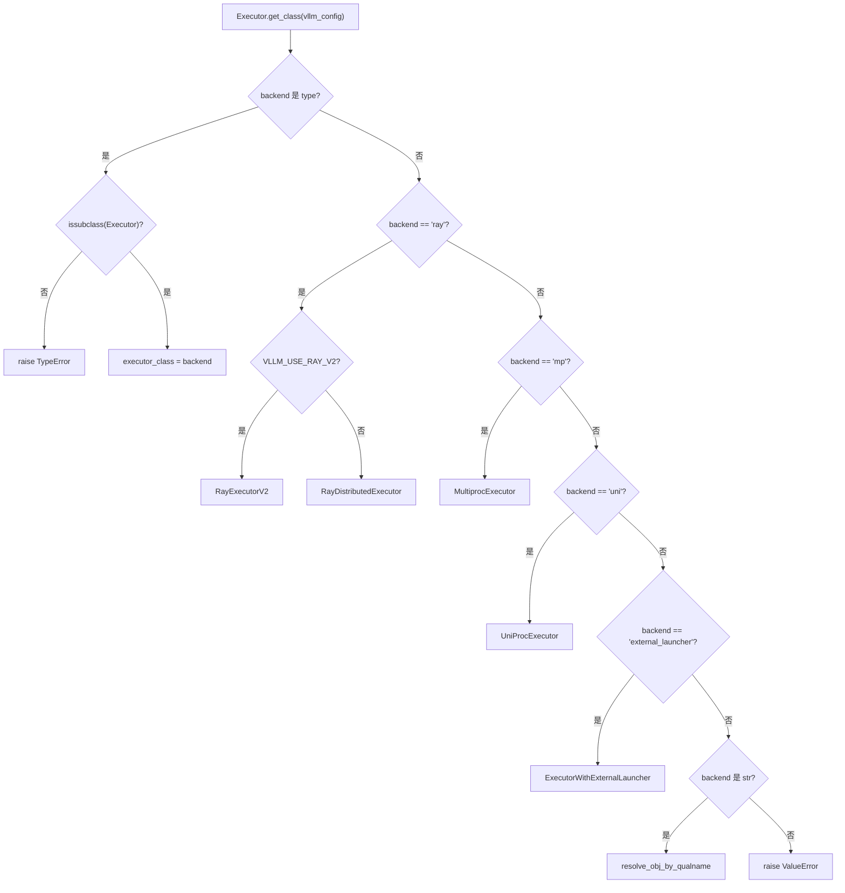
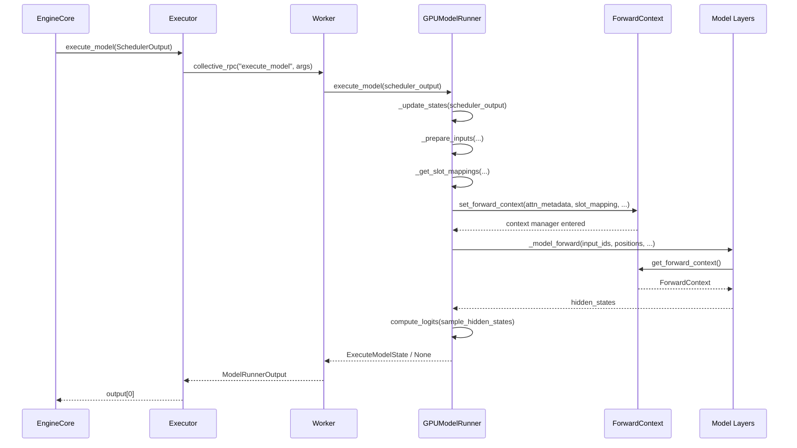

# 第 5 章：模型執行主幹：從 SchedulerOutput 到 GPU 前向傳播

上一章我們看到，Scheduler 在每一步的排程迴圈中決定了哪些請求進入 running 佇列、哪些被搶佔、哪些因顯存不足而等待，並最終產出一份 SchedulerOutput——它描述了本步該算什麼：哪些請求、各算多少 token、用哪些 KV block。但這份清單只是邏輯意圖，GPU 需要的是物理張量。本章追蹤 SchedulerOutput 如何被 Executor 分發到 Worker，再由 GPUModelRunner 翻譯成 input_ids、positions、slot_mapping 和 block table 等 GPU 可執行的輸入，最終透過 forward_context 把跨層共享的批描述注入模型每一層，完成從排程決策到前向傳播的跨越。

# 5.1 Executor：把排程結果送到每一張卡

## 直覺模型

`Executor`是 EngineCore 與 GPU Worker 之間的「傳令官」。若沒有它，EngineCore 就得自己知道叢集裡有幾張卡、每張卡在哪個行程、如何把`SchedulerOutput`序列化過去——排程邏輯會和分散式拓撲糾纏在一起。`Executor`把這個職責抽出來：EngineCore 只管呼叫`execute_model(scheduler_output)`，剩下的「發給誰、怎麼發、收幾個結果」由 Executor 決定。

## 類別階層與欄位

`Executor`是一個抽象基底類別，其類別層級欄位直接編碼了後端能力[FACT:vllm/v1/executor/abstract.py:48-49]：

```python
uses_ray: bool = False  # whether the executor uses Ray for orchestration.
supports_pp: bool = False  # whether the executor supports PP
```

這兩個旗標不是裝飾性的——上層程式碼會讀取它們來決定是否啟用某些最佳化路徑。`__init__`中初始化了`sleeping_tags`、`kv_output_aggregator`、`ec_output_aggregator`三個狀態欄位[FACT:vllm/v1/executor/abstract.py:119-120]，分別用於睡眠模式標籤追蹤、KV 連接器輸出聚合、編碼器連接器輸出聚合。

## 後端選擇：`get_class`的分支路由

`get_class`是一個靜態工廠，根據`distributed_executor_backend`配置回傳具體 Executor 類別[FACT:vllm/v1/executor/abstract.py:51-96]。它的分支結構值得細看：

- 若配置本身是一個`type`，驗證其是否為`Executor`子類別後直接使用[FACT:vllm/v1/executor/abstract.py:52-61]；
- `"ray"`分支下還有二級分支：`VLLM_USE_RAY_V2_EXECUTOR_BACKEND`為真時用`RayExecutorV2`，否則用`RayDistributedExecutor` [FACT:vllm/v1/executor/abstract.py:64-72]；
- `"mp"`映射到`MultiprocExecutor`，`"uni"`映射到`UniProcExecutor` [FACT:vllm/v1/executor/abstract.py:73-80]；
- 字串形式的自訂後端透過`resolve_obj_by_qualname`動態解析[FACT:vllm/v1/executor/abstract.py:85-90]。



## Step-by-Step：一次`execute_model`的呼叫流

代入場景：EngineCore 完成一步排程，拿到`SchedulerOutput`，呼叫`executor.execute_model(scheduler_output)`。

`Executor.execute_model`的實作極簡[FACT:vllm/v1/executor/abstract.py:237-238]：

```python
def execute_model(
    self, scheduler_output: SchedulerOutput, non_block: bool = False
) -> ModelRunnerOutput | None | Future[ModelRunnerOutput | None]:
    output = self.collective_rpc(
        "execute_model", args=(scheduler_output,), non_block=non_block
    )
    return output[0]
```

> **[Design Inference & Architectural Trade-offs]**
> 關鍵在`collective_rpc`——它把方法名和參數廣播到所有 Worker，收集每個 Worker 的回傳值列表，然後`output[0]`只取第一個。為什麼只取第一個？ 因為在張量平行下，所有 Worker 執行的是同一個邏輯前向，輸出在語意上等價；取樣結果由最後一個 PP stage 或 rank 0 決定，取`output[0]`避免了重複聚合。`collective_rpc`的文件明確建議「只傳控制訊息，資料面通訊另行建立」[FACT:vllm/v1/executor/abstract.py:220-221]，這正是`SchedulerOutput`的定位——它是控制訊息，真正的 token 資料透過 GPU 張量在 Worker 內部流轉。

`sample_tokens`走同樣的模式[FACT:vllm/v1/executor/abstract.py:257-258]，但回傳型別不含`None`——取樣必然產出結果。這兩個方法的分工對應了 vLLM v1 的「執行-取樣分離」設計：`execute_model`可能回傳`None`（表示前向已提交但取樣延後），此時狀態被暫存在`ExecuteModelState`中。

## 設計思考

`collective_rpc`被宣告為`@abstractmethod` [FACT:vllm/v1/executor/abstract.py:186-192]，意味著不同後端必須自己實作「如何把 RPC 發到 Worker」。`MultiprocExecutor`用共享記憶體佇列，`RayDistributedExecutor`用 Ray actor 呼叫，`UniProcExecutor`直接本地呼叫。這種抽象讓上層程式碼完全不需要關心分散式細節。

一個容易忽略的細節：`supported_tasks`被標記為`@cached_property` [FACT:vllm/v1/executor/abstract.py:306-309]，註解直言「避免不必要的 RPC 呼叫」。因為`get_supported_tasks`需要跨行程通訊，而任務列表在模型生命週期內不變，快取是正確且必要的優化。

# 5.2 GPUModelRunner：從 SchedulerOutput 到輸入張量

## 直覺模型

`GPUModelRunner`是「翻譯官」：它把`SchedulerOutput`裡的邏輯描述（請求 ID、token 數、塊 ID）翻譯成 GPU 能直接消費的物理張量。若沒有它，模型層就得自己處理「第 3 個請求的第 7 個 token 在哪個 KV 槽位」這種問題——這是災難性的關注點洩漏。

## 核心狀態與記憶體佈局

`GPUModelRunner`繼承自三個 Mixin[FACT:vllm/v1/worker/gpu_model_runner.py:479-480]：`LoRAModelRunnerMixin`、`KVConnectorModelRunnerMixin`、`ECConnectorModelRunnerMixin`，分別提供 LoRA 適配、KV 連接器、編碼器連接器能力。

`__init__`中快取了全部配置物件[FACT:vllm/v1/worker/gpu_model_runner.py:488-498]，並初始化了幾個關鍵旗標：

- `check_ep_fault`：僅當資料平行 > 1 且是 MoE 模型時，查詢 EP all2all 管理器是否支援容錯[FACT:vllm/v1/worker/gpu_model_runner.py:507-509]；
- `is_pooling_model`：由`runner_type == "pooling"`決定[FACT:vllm/v1/worker/gpu_model_runner.py:515]；
- `enable_prompt_embeds`：是否啟用 prompt embedding 輸入[FACT:vllm/v1/worker/gpu_model_runner.py:516]。

`ExecuteModelState`是一個`NamedTuple`，承載`execute_model()`與`sample_tokens()`之間的臨時狀態[FACT:vllm/v1/worker/gpu_model_runner.py:463-476]。它的欄位設計揭示了執行-取樣分離的本質：`logits`、`hidden_states`、`sample_hidden_states`是前向產物，`spec_decode_metadata`、`slot_mappings`是取樣階段仍需的元資料。註解明確說這是「在 execute_model() 回傳 None 後傳遞的臨時快取狀態」[FACT:vllm/v1/worker/gpu_model_runner.py:464-464]。

## Step-by-Step：`_update_states`如何同步快取狀態

代入場景：排程器決定本步處理請求 A（新請求）、B（上一步的 decode 繼續）、C（被搶佔後恢復），同時請求 D 已完成。

**第一步：清理已完成請求。**遍歷`finished_req_ids`，從`self.requests`字典彈出狀態，從`input_batch`移除[FACT:vllm/v1/worker/gpu_model_runner.py:1202-1217]。注意註解指出的邊界情況：`finished_req_ids`和`scheduled_req_ids`可能重疊——當請求被中止後又以相同 ID 重新提交時，它們被視為兩個不同請求[FACT:vllm/v1/worker/gpu_model_runner.py:1211-1215]。

**第二步：清零新分配的 KV 塊。**若`new_block_ids_to_zero`非空，呼叫`_zero_block_ids`清零顯存，防止陳舊 NaN 污染注意力或 SSM 計算[FACT:vllm/v1/worker/gpu_model_runner.py:1219-1222]。這是 PagedAttention 塊重用的安全前提。

**第三步：計算未排程請求集合。**這是最容易出錯的一步[FACT:vllm/v1/worker/gpu_model_runner.py:1238-1247]：

```python
scheduled_req_ids = scheduler_output.num_scheduled_tokens.keys()
cached_req_ids = self.input_batch.req_id_to_index.keys()
resumed_req_ids = scheduler_output.scheduled_cached_reqs.resumed_req_ids
unscheduled_req_ids = cached_req_ids - (scheduled_req_ids - resumed_req_ids)
```

註解解釋了為什麼是`scheduled_req_ids - resumed_req_ids`而非直接`scheduled_req_ids`：通常`cached_req_ids`和`resumed_req_ids`不相交，但在`reset_prefix_cache`觸發的強制搶佔場景下，恢復的請求需要先從持久批中清除再重新加入[FACT:vllm/v1/worker/gpu_model_runner.py:1241-1246]。

**第四步：處理新請求。**對每個`scheduled_new_reqs`，建構`CachedRequestState` [FACT:vllm/v1/worker/gpu_model_runner.py:1295-1308]。若取樣類型是`RANDOM_SEED`，建立帶種子的`torch.Generator` [FACT:vllm/v1/worker/gpu_model_runner.py:1277-1284]。若模型使用 M-RoPE，呼叫`_init_mrope_positions`預計算位置[FACT:vllm/v1/worker/gpu_model_runner.py:1319-1321]。

**第五步：更新執行中請求。**對每個`scheduled_cached_reqs`，更新`num_computed_tokens` [FACT:vllm/v1/worker/gpu_model_runner.py:1402]，處理塊 ID 追加或替換[FACT:vllm/v1/worker/gpu_model_runner.py:1437-1448]。若請求不在持久批中（`req_index is None`），加入`reqs_to_add` [FACT:vllm/v1/worker/gpu_model_runner.py:1450-1465]。

**第六步：壓縮與重排。** `condense()`填補移除請求留下的空洞[FACT:vllm/v1/worker/gpu_model_runner.py:1511-1512]，`_may_reorder_batch`讓注意力後端按需重排[FACT:vllm/v1/worker/gpu_model_runner.py:1513-1514]，`refresh_metadata()`刷新批元數據[FACT:vllm/v1/worker/gpu_model_runner.py:1515-1516]。

## 輸入張量準備：`_prepare_input_ids`的異步快路徑

`_prepare_input_ids`處理一個微妙問題：異步調度下，上一步的採樣 token 還在 GPU 上，本步的`input_ids`需要把它們填進去[FACT:vllm/v1/worker/gpu_model_runner.py:1767-1772]。

正常路徑（`prev_sampled_token_ids is None`）直接拷貝 CPU 張量到 GPU[FACT:vllm/v1/worker/gpu_model_runner.py:1788-1794]。異步路徑則遍歷請求，計算每個請求最後一個 token 在扁平化`input_ids`中的索引[FACT:vllm/v1/worker/gpu_model_runner.py:1809-1836]。註釋給出了具體例子：`cu_num_tokens = [2, 5, 8]`、`draft_tokens = [1, 2, 2]`時，`sample_flattened_indices = [0, 2, 5]`，`spec_flattened_indices = [1, 3, 4, 6, 7]` [FACT:vllm/v1/worker/gpu_model_runner.py:1820-1822]。

有一個關鍵優化[FACT:vllm/v1/worker/gpu_model_runner.py:1859-1868]：

```python
if common_indices_match and max_flattened_index == (num_common_tokens - 1):
    self.input_ids.gpu[:num_common_tokens].copy_(
        self.input_batch.prev_sampled_token_ids[:num_common_tokens, 0],
        non_blocking=True,
    )
    return
```

當批未變且無重排時，索引是`0..N-1`的同一排列，可直接用單次切片拷貝，避免 scatter 開銷。這是持久批優化的直接體現。

## `slot_mapping`與 block table

`_get_slot_mappings`返回兩種格式[FACT:vllm/v1/worker/gpu_model_runner.py:4078-4078]：按 KV cache group 索引的`dict[int, torch.Tensor]`供注意力元數據使用，按層名索引的`dict[str, torch.Tensor]`供`ForwardContext`使用。對 encoder-only 的 KV cache group，slot mapping 是全零張量[FACT:vllm/v1/worker/gpu_model_runner.py:4096-4115]；否則從`block_table.slot_mapping.gpu`切片[FACT:vllm/v1/worker/gpu_model_runner.py:4107-4109]。未使用的尾部填充`-1`，註釋說明這是`reshape_and_cache`在全 CUDA graph 模式下的需要[FACT:vllm/v1/worker/gpu_model_runner.py:4118-4122]。

`_get_block_table`對每個 KV cache group 獲取設備張量[FACT:vllm/v1/worker/gpu_model_runner.py:2319-2335]，並用`NULL_BLOCK_ID`填充 CUDAGraph padding 行——塊 0 被保留作 padding[FACT:vllm/v1/worker/gpu_model_runner.py:2332-2334]。

# 5.3 forward_context：跨層共享的批描述

## 直覺模型

`forward_context`是貼在教室前方的「統一通知板」：每個模型層抬頭就能看到本場考試的座位安排（attention metadata）和規則（slot mapping），不必各自去問。若沒有它，每個注意力層都得從參數裡接收這些信息——而模型層的`forward`簽名是固定的，無法為每層單獨傳參。

## 數據結構

`ForwardContext`是一個`@dataclass` [FACT:vllm/forward_context.py:141-202]，核心字段：

- `no_compile_layers`：從`static_forward_context`拷貝，標記不參與編譯的層[FACT:vllm/forward_context.py:132-137]；
- `attn_metadata`：層名到注意力元數據的映射，DBO 模式下是長度為 2 的列表（每個 microbatch 一個）[FACT:vllm/forward_context.py:144-152]；
- `slot_mapping`：層名到 slot mapping 張量的映射[FACT:vllm/forward_context.py:145]；
- `cudagraph_runtime_mode`：運行時 CUDA graph 模式，默認`NONE` [FACT:vllm/forward_context.py:155-157]；
- `batch_descriptor`：批描述符，用於 CUDA graph 分發[FACT:vllm/forward_context.py:158]；
- `is_padding`：token 軸上的布爾掩碼，`True`表示 padding 行[FACT:vllm/forward_context.py:162-165]。

`BatchDescriptor`是另一個`@dataclass(frozen=True)` [FACT:vllm/forward_context.py:30-57]，字段設計遵循「最小化描述項」原則：`num_tokens`、`num_reqs`（PIECEWISE 模式下可為 None）、`uniform`（所有請求 token 數相同）、`has_lora`、`num_active_loras`。註釋解釋了`num_active_loras`的存在原因：當`cudagraph_specialize_lora_count`啟用時，每個 LoRA 數量值捕獲獨立 CUDA graph，因為`fused_moe_lora`等內核的 grid size 依賴此值[FACT:vllm/forward_context.py:60-64]。

## 全局單例與上下文管理

`_forward_context`是一個模塊級全局變量[FACT:vllm/forward_context.py:199-201]，通過`override_forward_context`上下文管理器在進入時保存舊值、退出時恢復[FACT:vllm/forward_context.py:263-274]。`set_forward_context`是更高層的封裝[FACT:vllm/forward_context.py:277-394]，它額外處理 DP 元數據構造、batch descriptor 自動創建、平台特定 kwargs 注入。

## Step-by-Step：從`execute_model`到模型前向

代入場景：`GPUModelRunner.execute_model`已準備好所有輸入張量，即將調用模型。

在`execute_model`中，`set_forward_context`被調用[FACT:vllm/v1/worker/gpu_model_runner.py:4408-4420]：

```python
with (
    set_forward_context(
        attn_metadata,
        self.vllm_config,
        num_tokens=num_tokens_padded,
        num_tokens_across_dp=num_tokens_across_dp,
        cudagraph_runtime_mode=cudagraph_mode,
        batch_descriptor=batch_desc,
        ubatch_slices=ubatch_slices_padded,
        slot_mapping=slot_mappings,
        skip_compiled=has_encoder_input,
        is_padding=is_padding,
    ),
    ...
):
    model_output = self._model_forward(...)
```

`set_forward_context`內部先構造`DPMetadata`（若啟用 DP 或序列並行 MoE）[FACT:vllm/forward_context.py:299-328]，再調用`create_forward_context`構造`ForwardContext`實例[FACT:vllm/forward_context.py:347-358]，最後通過`override_forward_context`設置全局變量[FACT:vllm/forward_context.py:361-362]。

模型層通過`get_forward_context()`讀取[FACT:vllm/forward_context.py:208-214]。若未設置，斷言失敗並提示使用`set_forward_context`。



## 設計思考

> **[Design Inference & Architectural Trade-offs]**
> 為什麼用全局變量而非顯式傳參？ 因為模型層的`forward`簽名由 HuggingFace 約定固定，無法為每層注入額外參數。全局變量 + 上下文管理器是唯一能在不修改模型代碼的前提下實現跨層注入的方案。代價是隱式依賴——`get_forward_context()`的調用者必須確保自己在`set_forward_context`的作用域內。

`is_padding`字段的設計值得注意[FACT:vllm/forward_context.py:162-165]：註釋說「消費者可用它跳過 padding token 的工作」。這是 CUDA graph 場景下的優化——padding 行參與了圖捕獲但不應產生實際計算。

`all_moe_layers`與`moe_layer_index`是一對巧妙的 workaround[FACT:vllm/forward_context.py:170-195]。註釋詳細解釋了問題：`vllm.moe_forward`自定義算子會把層名字符串硬編碼進圖，導致 torch.compile 冷啟動時間過長。解決方案是把層名列表存在`ForwardContext`中，自定義算子按順序彈出字符串並遞增計數器。註釋也坦承這依賴「自定義算子按順序執行且 torch.compile 不會重排」的假設[FACT:vllm/forward_context.py:182-184]。

# 設計思考與生產踩坑

**異步調度的狀態一致性。** `_update_states`在異步投機解碼下採用「樂觀假設」策略：假設上一步所有 draft token 都被接受，先擴展`output_token_ids`，然後註冊一個延遲修正函數[FACT:vllm/v1/worker/gpu_model_runner.py:1376-1384]。修正函數在模型前向啟動後調用[FACT:vllm/v1/worker/gpu_model_runner.py:1509-1510]，從 GPU 讀取實際接受數並回退`num_computed_tokens` [FACT:vllm/v1/worker/gpu_model_runner.py:1547-1558]。這個設計的精妙之處在於：修正發生在「批已啟動」之後，不阻塞前向，保持了異步流水線的連續性。

**`_may_reorder_batch`的觸發條件。**該方法首先檢查`kv_cache_groups`是否為空[FACT:vllm/v1/worker/gpu_model_runner.py:1131-1132]。註釋解釋了為什麼不能簡單檢查`is_attention_free`：Mamba 模型也是 attention-free 的，但它用 KV cache 保存內部狀態[FACT:vllm/v1/worker/gpu_model_runner.py:1116-1139]。只有真正沒有 KV cache group 的模型才跳過重排。

**`_prepare_input_ids`的索引計算陷阱。**當批中既有上一步的 decode 請求又有新請求時，`num_common_tokens < total_without_spec`，需要先拷貝 CPU 張量再 scatter[FACT:vllm/v1/worker/gpu_model_runner.py:1849-1854]。若`num_common_tokens == 0`，說明沒有任何請求與上一步重疊，直接返回[FACT:vllm/v1/worker/gpu_model_runner.py:1855-1858]。這兩個分支的區分至關重要——漏掉任何一個都會導致`input_ids`部分未初始化。

**`AsyncGPUModelRunnerOutput`的流同步。**輸出拷貝在獨立 CUDA stream 上進行[FACT:vllm/v1/worker/gpu_model_runner.py:308-328]，使用`blocking=True`的 Event 避免忙輪詢 CUDA 驅動鎖[FACT:vllm/v1/worker/gpu_model_runner.py:296-298]。`get_output()`中先 synchronize 再釋放設備張量引用[FACT:vllm/v1/worker/gpu_model_runner.py:336-340]，順序不能顛倒——否則張量可能在拷貝完成前被回收。

# 本章小結

本章追蹤了`SchedulerOutput`從 EngineCore 到 GPU 前向的完整路徑。`Executor`透過`collective_rpc`把調度結果廣播到所有 Worker，`GPUModelRunner`的`_update_states`同步緩存狀態、`_prepare_inputs`構造輸入張量、`_get_slot_mappings`生成 KV 槽位映射，最後`set_forward_context`把批描述注入全局上下文供模型各層消費。異步調度路徑透過樂觀假設 + 延遲修正保持了流水線連續性，而`ForwardContext`的全局單例設計解決了模型層簽名固定與跨層元數據注入之間的矛盾。

# 本章思考與自測

Q1: `_update_states`中`unscheduled_req_ids = cached_req_ids - (scheduled_req_ids - resumed_req_ids)`這個表達式，如果把`resumed_req_ids`從減法中去掉，變成`cached_req_ids - scheduled_req_ids`，在什麼場景下會導致狀態不一致？

**參考解析**：註釋明確指出[FACT:vllm/v1/worker/gpu_model_runner.py:1241-1246]，`cached_req_ids`和`resumed_req_ids`通常不相交，但在`reset_prefix_cache`觸發的強制搶佔場景下，一個請求可能同時出現在`cached_req_ids`和`resumed_req_ids`中。此時`scheduled_req_ids - resumed_req_ids`會把這個請求從「已調度」集合中排除，使其落入`unscheduled_req_ids`，從而先從持久批中清除，再透過正常的 resumed 路徑重新加入。如果去掉`resumed_req_ids`，該請求會被認為「已調度」而保留在批中，但它的塊 ID 已被替換（`req_state.block_ids = new_block_ids` [FACT:vllm/v1/worker/gpu_model_runner.py:1448]），導致 block table 中的舊行與新塊 ID 不匹配，注意力計算會讀取錯誤的 KV 位置。

Q2: `_prepare_input_ids`的快速路徑[FACT:vllm/v1/worker/gpu_model_runner.py:1859-1868]用`common_indices_match and max_flattened_index == (num_common_tokens - 1)`作為條件。如果批中請求順序發生了變化（例如注意力後端重排了批），但`common_indices_match`仍為 True，會發生什麼？

**參考解析**：`common_indices_match`在循環中透過`prev_index == flattened_index`累積[FACT:vllm/v1/worker/gpu_model_runner.py:1835]。`prev_index`來自`prev_positions`，映射當前批位置到上一步批位置；`flattened_index`是當前批中該請求最後一個 token 的扁平索引。如果批被重排，`prev_index`和`flattened_index`的對應關係會改變，`common_indices_match`會變為 False，快速路徑不會觸發。但如果重排恰好使得`prev_index == flattened_index`對所有請求成立（例如交換了兩個 token 數相同的請求），快速路徑會錯誤地用`prev_sampled_token_ids[:num_common_tokens, 0]`直接切片拷貝——這會把請求 A 的採樣 token 填到請求 B 的位置。`max_flattened_index == num_common_tokens - 1`這個附加條件正是為了防止這種退化情況：它要求扁平索引恰好是`0..N-1`的排列，排除了任何非平凡重排。

Q3: `ForwardContext`使用模組級全局變量`_forward_context`而非線程局部變量。在`execute_model`與`sample_tokens`分離的異步調度下，如果`sample_tokens`在前向完成前被調用，`get_forward_context()`會返回什麼？這會導致什麼問題？

**參考解析**：`set_forward_context`是一個上下文管理器[FACT:vllm/forward_context.py:278-288]，在`with`塊退出時透過`override_forward_context`的`finally`恢復舊值[FACT:vllm/forward_context.py:263-274]。在`execute_model`中，`set_forward_context`的`with`塊只包裹`_model_forward`調用[FACT:vllm/v1/worker/gpu_model_runner.py:4408-4433]，前向返回後上下文即被恢復。如果`sample_tokens`在前向完成後調用，`get_forward_context()`會斷言失敗[FACT:vllm/forward_context.py:208-214]，因為`_forward_context`已被重置為`None`（或外層值）。這正是`ExecuteModelState`存在的原因[FACT:vllm/v1/worker/gpu_model_runner.py:463-476]：採樣所需的狀態（`logits`、`hidden_states`、`slot_mappings`）被顯式保存在 NamedTuple 中，而非依賴`ForwardContext`的隱式傳遞。如果誤以為`ForwardContext`在`sample_tokens`中仍可用，會觸發斷言錯誤或讀取到錯誤的元數據。

至此，我們走完了從 SchedulerOutput 到 GPU 前向傳播的完整路徑：Executor 分發、Worker 執行、GPUModelRunner 將邏輯清單翻譯為物理張量，並透過 forward_context 將批描述注入每一層。然而，模型前向傳播中最耗時的部分——注意力計算——尚未展開。下一章將深入注意力後端，看 attn_metadata 中的 block table 和 slot mapping 如何被 PagedAttention 內核消費，以及 FlashAttention、FlashInfer、Triton 等不同後端如何透過統一接口被選擇和調度。
