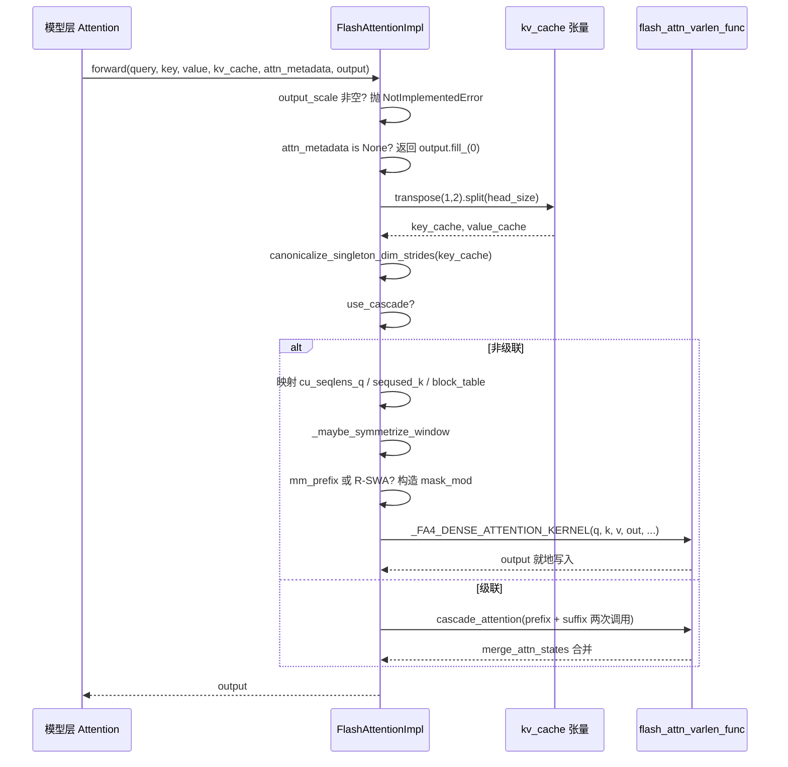

# 第 6 章：注意力後端與 PagedAttention 內核實現

上一章我們看到 GPUModelRunner 如何把調度結果翻譯成 input_ids、slot_mapping 和 block_table 等物理張量，並透過 forward_context 注入每一層。但真正消耗 GPU 時間的大頭——注意力計算——還懸在半空。attn_metadata 裡那些張量究竟被誰消費？FlashAttention、FlashInfer、Triton 這些實現憑什麼能在同一套模型程式碼下互換？答案在 AttentionBackend 抽象層。它把「注意力怎麼算」與「模型怎麼調」解耦：模型層只持有 AttentionImpl 引用，呼叫統一的 forward(query, key, value, kv_cache, attn_metadata, output)；而具體後端負責把 block_table、slot_mapping、seq_lens 翻譯成自家核心能吃的參數。本章以 FlashAttentionBackend 為主線，因為它同時覆蓋了 PagedAttention 的 gather 語意、CUDA Graph 相容、級聯注意力、DCP 分散式上下文等最豐富的分支。讀透它，其他後端只是參數映射的變體。這種「後端註冊 + 統一介面」的設計動機很直接：注意力核心演進極快（FA2→FA3→FA4，FlashInfer 迭代，Triton 自研），如果模型層直接依賴某個具體核心，每次核心升級都要改模型程式碼。抽象層把變化隔離在 get_impl_cls() 一個工廠方法後面。

# 後端選擇：能力宣告與元資料建構

## 直覺模型

把`AttentionBackend`想成招聘啟事：它不幹活，只宣告「我能處理哪些 dtype、哪些 head_size、哪些 KV cache 量化格式、哪些 attention 類型」。調度器拿著模型配置來匹配，匹配失敗就換下一個候選人。若沒有這層宣告，系統會在執行時才發現「這個 head_size 核心不支援」，直接崩潰。

## 能力矩陣：欄位即契約

`FlashAttentionBackend`的類別屬性就是它的能力邊界。`supported_dtypes`限定 fp16/bf16[FACT:vllm/v1/attention/backends/flash_attn.py:287-287]；`supported_kv_cache_dtypes`額外允許 fp8 系列[FACT:vllm/v1/attention/backends/flash_attn.py:298-299]。但「宣告支援」不等於「無條件支援」——`supports_kv_cache_dtype`對量化 KV 會進一步委託給`flash_attn_supports_kv_cache_dtype`做裝置相關判斷[FACT:vllm/v1/attention/backends/flash_attn.py:431-438]。

更精細的是`supports_combination`：它接收 head_size、dtype、block_size、use_mla、has_sink 等一整套組合參數，回傳`None`表示可用，回傳字串表示拒絕原因[FACT:vllm/v1/attention/backends/flash_attn.py:454-507]。例如 sink 在算力 < 9.0 上被拒[FACT:vllm/v1/attention/backends/flash_attn.py:467-468]，SM90 上 FP8 KV 配 mm_prefix 必須走 Triton[FACT:vllm/v1/attention/backends/flash_attn.py:472-472]。這種「回傳原因字串」的設計讓上層能給出可診斷的報錯，而非靜默回退。

block_size 的選擇同樣由能力驅動。預設回傳`MultipleOf(16)`，但 SM90 FP8-KV 強制 64[FACT:vllm/v1/attention/backends/flash_attn.py:297-324]，FA4 的 head_size=256 核心強制`FA4_HD256_PAGE_SIZE` [FACT:vllm/v1/attention/backends/flash_attn.py:326-352]。這解釋了為什麼 KV cache 的 block 大小不是隨便定的——它被核心的 TMA tile 尺寸反向約束。

## 元資料結構：FlashAttentionMetadata 的欄位佈局

`FlashAttentionMetadata`是 dataclass，欄位分四組[FACT:vllm/v1/attention/backends/flash_attn.py:511-566]：

第一組是基礎批描述：`num_actual_tokens`（去掉 padding 的真實 token 數）、`max_query_len`、`query_start_loc`（前綴和，用於 varlen 核心定位每條序列的起止）、`seq_lens`、`block_table`、`slot_mapping` [FACT:vllm/v1/attention/backends/flash_attn.py:520-526]。注意原始碼註解裡那張 ASCII 圖[FACT:vllm/v1/attention/backends/flash_attn.py:512-518]，它精確區分了`context_len`（歷史 KV）、`query_len`（本次新增）、`seq_len`（兩者之和）——這是理解 varlen 核心參數的關鍵。

第二組是級聯注意力欄位：`use_cascade`、`common_prefix_len`、`cu_prefix_query_lens`等[FACT:vllm/v1/attention/backends/flash_attn.py:528-533]。

第三組是 DCP（Decode Context Parallel）欄位：`max_dcp_context_kv_len`、`dcp_context_kv_lens`，以及區分 decode/prefill 請求數的計數器[FACT:vllm/v1/attention/backends/flash_attn.py:535-544]。

第四組是可選調度與特殊遮罩：`scheduler_metadata`（FA3 AOT 調度用）、`causal`（可為 bool 或張量，支援逐序列因果）、`mm_prefix_query_range_tensor`（多模態雙向範圍）、R-SWA 相關欄位[FACT:vllm/v1/attention/backends/flash_attn.py:546-566]。

> **[Design Inference & Architectural Trade-offs]**
> `causal`欄位類型是`bool | torch.Tensor`而非純 bool，這是為了支援「同一批次裡部分序列因果、部分非因果」的場景（如 PrefixLM）。當它是張量時，FA4 的`dynamic_causal`參數接管，FA2/FA3 會直接拋 NotImplementedError[FACT:vllm/v1/attention/backends/flash_attn.py:1429-1433]。

## build() 的 Step-by-Step

代入場景：一個混合批次，3 條 decode 序列 + 2 條 prefill 序列，無級聯、無 DCP。

第一步，從`common_attn_metadata`解包基礎張量[FACT:vllm/v1/attention/backends/flash_attn.py:824-832]。第二步，決定是否啟用 AOT 排程：`aot_schedule = self.aot_schedule and not fast_build and not envs.VLLM_BATCH_INVARIANT` [FACT:vllm/v1/attention/backends/flash_attn.py:836-838]。`self.aot_schedule`在`__init__`裡由`get_flash_attn_version() == 3`決定[FACT:vllm/v1/attention/backends/flash_attn.py:709-709]——只有 FA3 支援預計算排程中繼資料。第三步，首次 build 時惰性填充`aot_sliding_window`：遍歷所有`FlashAttentionImpl`層收集滑窗配置，若配置唯一則採用，若多於一種則關閉 AOT[FACT:vllm/v1/attention/backends/flash_attn.py:848-851]。

第四步，計算`max_num_splits`。預設 0（讓 FA3 用啟發式），僅當啟用 full CUDA graph 且 token 數在捕獲範圍內時才設為`self.max_num_splits` [FACT:vllm/v1/attention/backends/flash_attn.py:856-866]。註解解釋了原因：`num_splits > 1`會分配`[num_splits, num_heads, num_tokens, head_size]`的中間緩衝，顯存代價高，只在 CUDA graph 場景值得[FACT:vllm/v1/attention/backends/flash_attn.py:862-865]。

第五步，走非級聯非 DCP 分支，呼叫`_get_scheduler_metadata`生成 FA3 的排程中繼資料[FACT:vllm/v1/attention/backends/flash_attn.py:976-986]。第六步，`_store_scheduler_metadata`處理 CUDA graph 場景：把新中繼資料拷進預分配緩衝，並把剩餘部分清零[FACT:vllm/v1/attention/backends/flash_attn.py:671-684]。清零這一步至關重要——註解明確指出，否則某些 thread block 會讀到無效中繼資料並覆寫輸出緩衝[FACT:vllm/v1/attention/backends/flash_attn.py:671-672]。

第七步，構造`FlashAttentionMetadata`並返回[FACT:vllm/v1/attention/backends/flash_attn.py:992-1015]。

```mermaid
flowchart TD
    start["build(common_prefix_len, common_attn_metadata)"] --> unpack["解包 query_start_loc / seq_lens / block_table / slot_mapping"]
    unpack --> aot{"aot_schedule 且非 fast_build 且非 BATCH_INVARIANT?"}
    aot -->|是| sw_check{"aot_sliding_window 已初始化?"}
    aot -->|否| maxsplit
    sw_check -->|否, 首次| collect["_get_sliding_window_configs 收集层滑窗"]
    collect --> sw_unique{"配置数量 == 1?"}
    sw_unique -->|是| set_sw["设置 aot_sliding_window"]
    sw_unique -->|否, >1| disable_aot["self.aot_schedule = False"]
    set_sw --> maxsplit
    disable_aot --> maxsplit
    sw_check -->|是| maxsplit["计算 max_num_splits"]
    maxsplit --> cg_check{"use_full_cuda_graph 且 tokens |是| set_splits["max_num_splits = self.max_num_splits"]
    cg_check -->|否| zero_splits["max_num_splits = 0"]
    set_splits --> branch
    zero_splits --> branch
    branch{"dcp_world_size > 1?"}
    branch -->|是| dcp_path["计算 dcp_context_kv_lens, 可能 skip"]
    branch -->|否| cascade_check{"common_prefix_len > 0?"}
    cascade_check -->|是| cascade_path["构造 prefix/suffix 双份 scheduler_metadata"]
    cascade_check -->|否| normal_path["_get_scheduler_metadata 单份"]
    dcp_path --> store
    cascade_path --> store
    normal_path --> store
    store["_store_scheduler_metadata: CUDA graph 时拷入预分配缓冲并清零尾部"] --> build_meta["构造 FlashAttentionMetadata"]
    build_meta --> mm_check{"mm_req_doc_ranges 非空?"}
    mm_check -->|是| fill_mm["fill_mm_prefix_query_ranges + 拷贝到 GPU"]
    mm_check -->|否| rswa_check
    fill_mm --> rswa_check{"rswa_window 非空?"}
    rswa_check -->|是| copy_rswa["拷贝 prefix_lens 到持久缓冲"]
    rswa_check -->|否| done
    copy_rswa --> done["返回 attn_metadata"]
```

---

# forward()：從中繼資料到核心呼叫的完整鏈路

## 直覺模型

`forward()`是後端的「總裝車間」：它拿到模型層算好的 Q/K/V、KV cache 張量、以及上一步構建的中繼資料，把 KV cache 的物理佈局調整成核心期望的形狀，然後分派到具體核心。若沒有這一步，核心會讀到錯誤的記憶體佈局，輸出靜默錯誤——比崩潰更難查。

## KV cache 的記憶體佈局變換

vLLM 的 KV cache 物理形狀是`[num_blocks, num_kv_heads, block_size, 2 * head_size]`——K 和 V 拼在最後一維[FACT:vllm/v1/attention/backends/flash_attn.py:1246-1247]。但 FlashAttention 核心期望 K 和 V 分開，且佈局為`[num_blocks, block_size, num_kv_heads, head_size]`。

變換發生在`forward()`開頭：`kv_cache.transpose(1, 2).split(self.head_size, dim=-1)` [FACT:vllm/v1/attention/backends/flash_attn.py:1310-1310]。`transpose(1,2)`把`[blocks, heads, block_size, 2D]`變成`[blocks, block_size, heads, 2D]`，`split`沿最後一維切成 K 和 V。注意`transpose`只改 stride 不搬資料，所以後續核心必須支援非連續存取。

緊接著是`canonicalize_singleton_dim_strides` [FACT:vllm/v1/attention/backends/flash_attn.py:1310-1310]。註解點明了動機：當`num_kv_heads=1`（TP 場景常見）時，size-1 維度的 stride 是退化的，而 FA3/FA4 在 H100+ 上用 TMA，要求 stride 至少 16 位元組對齊[FACT:vllm/v1/attention/backends/flash_attn.py:1310-1310]。這是一個典型的「邏輯上等價、物理上不合法」的陷阱。

## 非級聯路徑的參數流轉

進入`if not attn_metadata.use_cascade`分支後，參數逐一映射[FACT:vllm/v1/attention/backends/flash_attn.py:1326-1342]：`cu_seqlens_q = query_start_loc`，`seqused_k = seq_lens`，`block_table = attn_metadata.block_table`。`descale_shape`取`(batch_size, num_kv_heads)`，用於 FP8 量化的 scale 廣播——註解說明 flash-attn 期望 descale 形狀是`(num_sequences, num_kv_heads)`，用`.expand()`避免複製[FACT:vllm/v1/attention/backends/flash_attn.py:1258-1258]。

然後是滑窗的對稱化處理。`_maybe_symmetrize_window`的邏輯：因果滑窗`(w, 0)`在非因果場景下要變成`(w, w)`，讓雙向 query 能往兩個方向看[FACT:vllm/v1/attention/backends/flash_attn.py:587-589]。註解還強調「層自己的 window 優先於 group 的 window」，因為一個 KV cache group 可能同時容納視窗層和全局層（如 Gemma-3 關閉 hybrid KV cache manager 時）[FACT:vllm/v1/attention/backends/flash_attn.py:1362-1365]。

## 遮罩分支：mm_prefix 與 R-SWA

當`mm_prefix_query_ranges`非空且滿足 FA4 + 靜態因果條件時，程式碼構造 CuTE-DSL 的`mask_mod` [FACT:vllm/v1/attention/backends/flash_attn.py:1374-1407]。關鍵動作是`causal = False`和`sliding_window_size = None` [FACT:vllm/v1/attention/backends/flash_attn.py:1406-1407]。註解解釋了原因：mm_prefix 的語義是`(causal ∧ window) ∨ bidirectional-range`，不是 causal 的子集；FA #155 之後設定 mask_mod 不再自動清除 causal/local，呼叫方必須顯式關閉，否則內建 causal 路徑會短路 mask_mod[FACT:vllm/v1/attention/backends/flash_attn.py:1402-1405]。

`_make_mm_prefix_mask_mod`用`functools.cache`快取[FACT:vllm/v1/attention/backends/flash_attn.py:1793-1802]。註解給出硬核理由：FA4 的`hash_callable`會把閉包單元的`repr()`混入編譯鍵，嵌套的`_load_q_range`每次呼叫位址不同，會導致每次 forward 都觸發完整 JIT 重編譯[FACT:vllm/v1/attention/backends/flash_attn.py:1793-1802]。這是生產環境效能陷阱的典型樣本。

遮罩內部有個座標轉換細節：FA4 傳的是局部`q_idx`（當前 prefill chunk 內 0-based），而`kv_idx`是絕對位置。程式碼用`q_abs = q_idx + seqlen_k - seqlen_q`恢復絕對位置[FACT:vllm/v1/attention/backends/flash_attn.py:1859-1865]。`__vec_size__ = 1`的設定也有講究：`_load_q_range`讀 lane 0，一次呼叫不能跨 query 行[FACT:vllm/v1/attention/backends/flash_attn.py:1897-1897]。

R-SWA 的 mask_mod 類似，但語義是`causal & (in_prefix | in_window)` [FACT:vllm/v1/attention/backends/flash_attn.py:1945-1948]，且`use_fast_sampling = True`讓 FA4 跳過完全被遮罩的 KV block，不載入其資料[FACT:vllm/v1/attention/backends/flash_attn.py:1950-1950]。

## FA4 hd256 的特殊處理

當`self.fa4_hd256`為真時，程式碼強制 page 對齊：`num_pages = cdiv(max_seqlen_k, FA4_HD256_PAGE_SIZE)`，`max_seqlen_k`向上取整到頁邊界，`block_table`截斷到精確頁數，`num_splits = 1` [FACT:vllm/v1/attention/backends/flash_attn.py:1442-1448]。註解說明 hd256 核心要求頁對齊長度、精確寬度 block table、且不支援 SplitKV。

最終呼叫`_FA4_DENSE_ATTENTION_KERNEL(...)`，把 q、k、v、out、cu_seqlens_q、seqused_k、block_table、softcap、mask_mod、aux_tensors 等一併傳入[FACT:vllm/v1/attention/backends/flash_attn.py:1450-1475]。

## KV cache 寫入：do_kv_cache_update

`forward()`唯讀 KV cache，寫入由`do_kv_cache_update`完成。它呼叫`reshape_and_cache_flash`，用`slot_mapping`把新算出的 K/V 散射寫入 cache[FACT:vllm/v1/attention/backends/flash_attn.py:1532-1541]。註解指出：`key`/`value`是 padded 的而`slot_mapping`不是，但不需要手動切片，因為 op 用`slot_mapping`的 shape 決定實際 token 數[FACT:vllm/v1/attention/backends/flash_attn.py:1527-1531]。這裡不做 stride 規範化，因為沒有 TMA 內核參與[FACT:vllm/v1/attention/backends/flash_attn.py:1520-1521]。



---

# 設計思考：為什麼這樣寫

> **[Design Inference & Architectural Trade-offs]**
> **能力聲明與實現分離**。`supports_combination`返回原因字串而非 bool，這是為了讓上層在回退到其他後端時能記錄「為什麼沒用 FA」，極大降低線上排查成本。相比靜默回退，這種設計把決策依據顯式化。

**CUDA Graph 兼容性是元數據設計的隱形約束**。`_store_scheduler_metadata`的「拷入 + 清零尾部」模式[FACT:vllm/v1/attention/backends/flash_attn.py:671-684]反覆出現在 R-SWA 持久緩衝[FACT:vllm/v1/attention/backends/flash_attn.py:787-798]和 mm_prefix 暫存區[FACT:vllm/v1/attention/backends/flash_attn.py:800-813]中。共同模式是：在`__init__`裡預分配最大尺寸的持久緩衝，`build()`裡只做拷貝不做分配。原因在註釋裡點明——CUDA graph 捕獲期間不能有分配操作[FACT:vllm/v1/attention/backends/flash_attn.py:1044-1046]。

**DCP 與 fused draft decode 的互斥**。`supports_draft_decode_metadata_update = self.dcp_world_size == 1` [FACT:vllm/v1/attention/backends/flash_attn.py:742-742]。註釋解釋：fused draft decode 跨 draft 步複用捕獲的元數據對象，但 DCP 的 build-time 主機側決策（如`skip_dcp_context_attention()`）會改變元數據形狀，這些 Python 字段在 graph replay 之間不會原地刷新[FACT:vllm/v1/attention/backends/flash_attn.py:736-741]。這是一個「性能優化與正確性衝突時選擇正確性」的典型取捨。

**級聯注意力的啟發式門檻**。`use_cascade_attention`用一串閾值過濾：common_prefix_len < 256 直接拒絕[FACT:vllm/v1/attention/backends/flash_attn.py:1967-1967]，alibi/sliding_window/local_attention 不支持[FACT:vllm/v1/attention/backends/flash_attn.py:1978-1979]，請求數 < 8 拒絕[FACT:vllm/v1/attention/backends/flash_attn.py:1982-1984]，DCP 場景禁用[FACT:vllm/v1/attention/backends/flash_attn.py:1985-1987]。通過後還要用粗略性能模型比較 cascade 與 FlashDecoding 的 CTA 數和 wave 數[FACT:vllm/v1/attention/backends/flash_attn.py:2011-2029]。註釋坦承這個模型「very rough」[FACT:vllm/v1/attention/backends/flash_attn.py:2009-2010]。

**生產踩坑點**：`forward()`裡有一段醒目註釋，警告 piece-wise CUDA graph 下此方法在 eager 模式執行，`view`/`slice`等看似無 GPU 操作的方法實際很慢，改動必須 benchmark[FACT:vllm/v1/attention/backends/flash_attn.py:1277-1284]。這解釋了為什麼代碼裡大量使用`[:num_actual_tokens]`切片而非更「優雅」的寫法——每一處都是性能權衡的結果。

---

# 本章小結

本章沿`FlashAttentionBackend`走完了注意力後端的完整生命週期：能力聲明（`supports_*`系列）→ 元數據構建（`build()`把`CommonAttentionMetadata`翻譯成`FlashAttentionMetadata`）→ 內核調用（`forward()`變換 KV cache 佈局、構造掩碼、分派到 FA 內核）。核心機制包括：KV cache 的`transpose+split`佈局變換、退化 stride 的規範化、CUDA graph 下的持久緩衝模式、mm_prefix/R-SWA 的 CuTE-DSL 掩碼構造、以及級聯注意力的啟發式決策。

關鍵設計原則：能力聲明與實現分離、CUDA graph 兼容性驅動元數據預分配、性能優化與正確性衝突時優先正確性（DCP 禁用 fused draft decode）。

下一章將轉向採樣與輸出：`logits`如何經處理器鏈（溫度、top-p、懲罰項）變成 token，結構化輸出如何約束解碼，以及流式返回如何與調度器協作。

# 本章思考與自測

Q1: 如果把`_store_scheduler_metadata`中的`self.scheduler_metadata[n:] = 0`清零操作刪掉，在什麼場景下會導致輸出錯誤？為什麼註釋特別強調這一點？

**參考解析**：`_store_scheduler_metadata`在 CUDA graph 場景下把新元數據拷入預分配緩衝的前 n 個位置[FACT:vllm/v1/attention/backends/flash_attn.py:671-684]。如果不清零尾部，上一次 build 殘留的調度元數據會被本次內核讀到。註釋明確指出「some thread blocks may use the invalid scheduler metadata and overwrite the output buffer」[FACT:vllm/v1/attention/backends/flash_attn.py:671-672]。觸發場景：批次大小從大變小（如從 8 條序列降到 3 條），緩衝區前 3 個位置是新數據，但第 4-8 個位置還是舊批次的數據。FA3 的調度元數據包含 tile 分配信息，內核按 batch_size 讀取時若 batch_size 計算有偏差或內核按固定 stride 掃描，就會讀到髒數據並寫壞輸出。這是 CUDA graph 複用緩衝的經典陷阱：緩衝區生命週期跨越多次 replay，必須顯式清理。

Q2: `_make_mm_prefix_mask_mod`用`functools.cache`緩存，註釋說否則會「force a full JIT recompile every forward」。如果去掉這個緩存裝飾器，性能會退化多少？為什麼 FA4 的編譯鍵會受閉包地址影響？

**參考解析**：註釋解釋 FA4 的`hash_callable`會把閉包單元的`repr()`混入編譯鍵[FACT:vllm/v1/attention/backends/flash_attn.py:1793-1802]。`_make_mm_prefix_mask_mod`內部定義了嵌套函數`_load_q_range`，每次調用工廠函數都會創建新的函數對象，其`repr()`包含記憶體位址，位址每次不同 → 編譯鍵每次不同 → FA4 認為需要重新 JIT 編譯。快取後相同`(sliding_window, sliding_window_left)`參數復用同一函式物件，編譯鍵穩定。效能退化程度取決於 FA4 編譯耗時，但可以確定是「每次 forward 都觸發完整編譯」，在 decode 迴圈中每步都編譯一次，延遲會從毫秒級退化到秒級。這是「看似無害的 Python 閉包」引發 JIT 快取失效的典型案例。

Q3: `supports_draft_decode_metadata_update = self.dcp_world_size == 1`這行程式碼在 DCP 場景下停用了 fused draft decode。假設你強行把它改成`True`，在投機解碼 + DCP 的組合下會出現什麼具體錯誤？

**參考解析**：註解說明 fused draft decode 跨 draft 步復用捕獲的元資料物件，而 DCP 的 build-time 主機側決策（如`skip_dcp_context_attention()`）會改變元資料形狀/控制路徑，例如`max_dcp_context_kv_len` [FACT:vllm/v1/attention/backends/flash_attn.py:736-741]。這些 Python 欄位在 CUDA graph replay 之間不會原地刷新。具體錯誤：draft 步之間序列長度增長，`skip_dcp_context_attention`的判定可能從 True 變 False（或反之），但復用的元資料物件仍保留舊值。若舊值是`max_dcp_context_kv_len = 0`，核心會走「無 DCP context」路徑[FACT:vllm/v1/attention/backends/flash_attn.py:1565-1589]，跳過跨 rank 的 context 注意力，導致輸出缺失上下文資訊——靜默錯誤，不崩潰。這正是「效能優化與正確性衝突時選擇正確性」的體現。

至此，注意力後端從抽象介面到核心實現的完整鏈路已經打通：模型層透過 AttentionImpl 統一呼叫，後端負責將 block_table、slot_mapping 等元資料翻譯為具體核心參數，而 FlashAttentionBackend 的 PagedAttention 實現則展示了分頁 KV Cache 下的 gather 語義與 CUDA Graph 相容策略。但注意力計算產出的只是隱藏狀態，模型最終要輸出的是下一個 token。這些隱藏狀態如何變成 logits，logits 又如何經過取樣與後處理，最終以串流文本返回給客戶端？下一章將追蹤這最後一公里。
