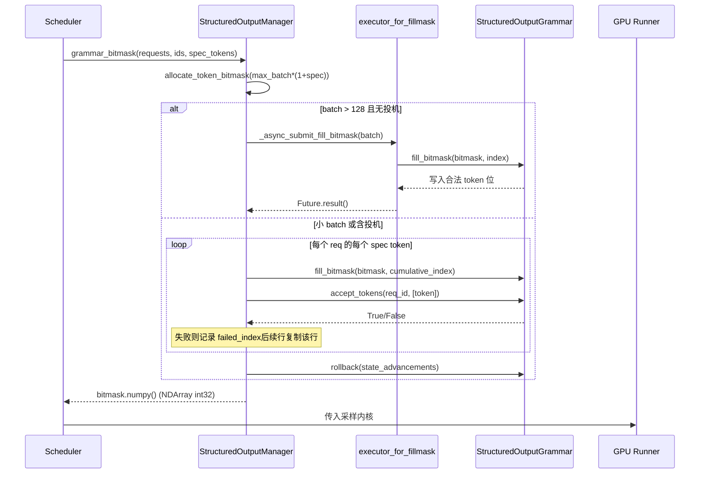

# 第 7 章：取樣與輸出：Logits 處理、結構化輸出與串流返回

上一章我們追蹤了注意力後端如何把 block table 翻譯成核心參數，在非連續顯存上完成 gather 式注意力計算。但注意力產出的只是隱藏狀態——模型真正要交付給使用者的是下一個 token 的文本。本章追蹤這最後一公里：隱藏狀態經 lm_head 投影為 logits 後，如何穿過一條精心排序的處理器鏈（溫度、懲罰、top-k/top-p、結構化約束），被取樣成 token id，再經 detokenizer 還原為文本並串流推送。這條鏈路上任何一步順序錯亂或狀態洩漏，都會讓輸出品質靜默劣化。

# Sampler：處理器鏈的順序即正確性

**直覺模型**：Sampler 像一條裝配流水線，logits 是待加工的毛坯。流水線上每個工位（processor）都會修改毛坯，而工位的先後順序直接決定成品——先削再磨和先磨再削得到的是兩種東西。若沒有這條鏈，模型只能輸出原始機率分佈，使用者拿到的就是無法控制溫度、無法抑制重複、無法約束格式的「裸取樣」。

## 資料結構與記憶體佈局

Sampler 本身是`nn.Module`，但它的核心狀態極薄：只持有`topk_topp_sampler`子模組、`logprobs_mode`與`use_fp64_gumbel`標誌[FACT:vllm/v1/sample/sampler.py:61-64]。真正的批級狀態全部封裝在`SamplingMetadata`中，由 forward 參數傳入。這種「無狀態 Sampler + 外部元資料」的設計是刻意的：Sampler 實例在引擎生命週期內只建立一次，而每個 decode step 的批組成都在變，把狀態外置才能讓 Sampler 被 CUDA Graph 捕獲後安全重放。

關鍵常量是`_SAMPLING_EPS = 1e-5` [FACT:vllm/v1/sample/sampler.py:18]。它同時充當兩個語義：溫度低於此值視為貪心，以及`apply_temperature`中防止除零的兜底。

## Step-by-Step Walkthrough

代入場景：一個 batch 中混合了貪心請求與隨機取樣請求，部分請求還開了 logprobs。

**第一步，快照原始 logprobs。**在施加任何懲罰或溫度之前，若請求需要 logprobs，先按`logprobs_mode`決定快照內容[FACT:vllm/v1/sample/sampler.py:84-93]。注意註解明確點出與 V0 的差異：V1 用**原始 logits**（懲罰與溫度之前）計算 top-k logprobs[FACT:vllm/v1/sample/sampler.py:72-77]。這是語意契約——使用者看到的 logprob 應反映模型真實分佈，而非被懲罰扭曲後的分佈。

**第二步，統一轉到 float32。** [FACT:vllm/v1/sample/sampler.py:95-96]無論輸入是 bf16 還是 fp16，都上轉 float32。原因是後續的 log_softmax、top-k、累積機率在低精度下會累積誤差，尤其在 vocab 達 15 萬時。

**第三步，非 argmax 不變處理器鏈。** `apply_logits_processors`依次施加：allowed token 白名單遮罩、bad words 排除、`non_argmax_invariant`處理器、懲罰項[FACT:vllm/v1/sample/sampler.py:391-404]。這裡的分類是核心設計——`non_argmax_invariant`指那些**會改變貪心結果**的處理器（如 min_tokens、logit_bias），它們必須在貪心取樣之前生效；而`argmax_invariant`處理器（如 min_p）不改變 argmax，可以推遲到溫度之後。

**第四步，取樣。** `sample`方法先判斷是否全隨機[FACT:vllm/v1/sample/sampler.py:256-271]：若`all_greedy`，直接 argmax 返回；否則先算貪心結果備用，再施加溫度、argmax 不變處理器、top-k/top-p[FACT:vllm/v1/sample/sampler.py:275-291]。最後用`torch.where`按溫度閾值在貪心與隨機結果間選擇[FACT:vllm/v1/sample/sampler.py:305-306]，並複用`greedy_sampled`張量作為輸出緩衝，避免額外分配。

**第五步，收集 logprobs 並封裝輸出。**按`num_logprobs`分三種情況：None 只返回指定 token 的 logprobs；-1 返回全量未排序 logprobs；否則 top-k[FACT:vllm/v1/sample/sampler.py:120-131]。最終 token id 轉 int32 壓縮體積，擴展為`[num_requests, 1]`的二維張量[FACT:vllm/v1/sample/sampler.py:138-148]。

```mermaid
flowchart TD
    in_logits["logits (bf16/fp16)"] --> snap{"需要 logprobs?"}
    snap -->|是| raw["compute_logprobs / cloneraw_logprobs 快照"]
    snap -->|否| f32
    raw --> f32["logits.to(float32)"]
    f32 --> proc["apply_logits_processors"]
    proc --> mask{"allowed_token_ids_mask?"}
    mask -->|是| fill["masked_fill_(-inf)"]
    mask -->|否| bad
    fill --> bad{"bad_words_token_ids?"}
    bad -->|是| apply_bad["apply_bad_words"]
    bad -->|否| noninv
    apply_bad --> noninv["non_argmax_invariant 处理器"]
    noninv --> pen["apply_penalties"]
    pen --> sample["sample()"]
    sample --> allg{"all_greedy?"}
    allg -->|是| greedy["greedy_sample (argmax)"]
    allg -->|否| temp["apply_temperature"]
    temp --> arginv["argmax_invariant 处理器"]
    arginv --> topp["topk_topp_sampler"]
    topp --> where["torch.where(temp  out
    where --> out["SamplerOutputsampled_token_ids"]
```

## 設計思考與踩坑

**為什麼懲罰項必須在溫度之前？**溫度是對分佈的縮放，懲罰是對特定 token 的加減分。若先縮放再懲罰，懲罰的絕對幅度會被溫度放大或縮小，導致同一組懲罰參數在不同溫度下行為不一致。V1 把懲罰固定在溫度前，保證了參數語意的穩定性。

**`mark_unbacked`的編譯陷阱。**在`gather_logprobs`中，`batched_count_greater_than`被編譯，而 batch 維度從 1 變到 ≥2 時會觸發 dynamo 的 0/1 特化重編譯[FACT:vllm/v1/sample/sampler.py:345-348]。`mark_unbacked`把該維度標記為完全符號化，避免這次重編譯。生產環境中若看到 decode 首個請求後突然卡頓一次，很可能就是這類重編譯。

**`gpu_sync_allowed`的同步邊界。** `batched_count_greater_than`內部可能觸發 GPU 同步，vLLM 用`gpu_sync_allowed(first_only=True)`上下文顯式宣告「這裡允許同步，但只允許第一次」[FACT:vllm/v1/sample/sampler.py:345-348]。若在 CUDA Graph 捕獲區內意外同步，會導致捕獲失敗——這是排查圖捕獲問題的關鍵線索。

# 結構化輸出：位元遮罩與語法的雙軌狀態機

**直覺模型**：結構化輸出像給取樣器戴上一副「語法眼鏡」——每一步只能看見符合 JSON schema 或文法的 token。若沒有它，模型可能生成語法錯誤的 JSON，下游解析器直接崩潰。vLLM 的實現精髓在於：語法狀態機在 CPU 側推進，而約束以位元遮罩形式傳給 GPU 側取樣。

## 資料結構與記憶體佈局

`StructuredOutputManager`是引擎級單例，持有`backend`（xgrammar/guidance/outlines/lm-format-enforcer 之一）、`reasoner_cls`與兩個執行緒池[FACT:vllm/v1/structured_output/__init__.py:39-98]。

位元遮罩是核心資料結構：`_grammar_bitmask`是形狀為`[max_batch_size * (1 + max_num_spec_tokens), vocab_size/32]`的 int32 張量[FACT:vllm/v1/structured_output/__init__.py:327-336]。每個 bit 對應一個 token 是否合法。`_full_mask = torch.tensor(-1, dtype=torch.int32)`表示「全 1」——所有 token 合法[FACT:vllm/v1/structured_output/__init__.py:59]。

兩個執行緒池分工明確：`executor`負責語法編譯（CPU 密集，worker 數為 CPU 數一半）[FACT:vllm/v1/structured_output/__init__.py:71-78]；`executor_for_fillmask`負責大 batch 位元遮罩並行填充，僅在 batch 超過 128 時啟用[FACT:vllm/v1/structured_output/__init__.py:62-69]。

## Step-by-Step Walkthrough

**語法初始化。**請求首次進入時`grammar_init`被呼叫[FACT:vllm/v1/structured_output/__init__.py:115-176]。若 backend 未初始化則按配置選擇實現[FACT:vllm/v1/structured_output/__init__.py:130-165]。隨後提交編譯任務：預設走非同步`executor.submit`，但在`external_launcher`模式下必須同步[FACT:vllm/v1/structured_output/__init__.py:167-176]。

**位元遮罩生成。**每個 decode step，`grammar_bitmask`為批內所有結構化請求生成遮罩[FACT:vllm/v1/structured_output/__init__.py:314-442]。大 batch 走並行路徑：按 16 個一批提交到執行緒池[FACT:vllm/v1/structured_output/__init__.py:346-373]。小 batch 走串行路徑，逐 token 推進語法狀態[FACT:vllm/v1/structured_output/__init__.py:374-433]。

**投機解碼下的遮罩對齊。**這是最精妙的部分。當有 draft token 時，每個請求需要`1 + max_num_spec_tokens`行遮罩。串行路徑逐 token 處理：若某 draft token 被語法拒絕，記錄`failed_index`，後續行直接複製該行的遮罩[FACT:vllm/v1/structured_output/__init__.py:396-418]。這保證了「draft 被拒後，後續位置的約束狀態回退到拒絕點」。

**狀態回滾。**位元遮罩填充過程中語法狀態被推進了`state_advancements`步，但 draft token 尚未被真正接受，因此必須`grammar.rollback(state_advancements)`回退[FACT:vllm/v1/structured_output/__init__.py:422-430]。真正接受發生在`accept_tokens` [FACT:vllm/v1/structured_output/__init__.py:444-466]。



## 設計思考與踩坑

**為什麼 external_launcher 必須同步編譯？**註解給出了精確原因：非同步編譯會讓`WAITING_FOR_STRUCTURED_OUTPUT_GRAMMAR → WAITING`狀態轉換在不同 TP rank 上發生於不同時刻，破壞 external_launcher 依賴的確定性假設[FACT:vllm/v1/structured_output/__init__.py:47-56]。這是分散式確定性與非同步優化衝突的典型案例。

**推理模型下的約束起點。** `_get_constraint_start`決定從第幾個 token 開始施加語法約束[FACT:vllm/v1/structured_output/__init__.py:220-292]。對於帶思維鏈的模型，reasoning 階段不應受 JSON 約束，只有 reasoning 結束後才啟動。`enable_in_reasoning`為 True 時直接返回 0（全程約束）[FACT:vllm/v1/structured_output/__init__.py:235-236]。若 reasoner 支援`find_reasoning_end_offset`，用它精確定位[FACT:vllm/v1/structured_output/__init__.py:261-267]；否則回退到逐 token 回退搜尋[FACT:vllm/v1/structured_output/__init__.py:287-291]。

**`validate_tokens`的前綴語義。**投機解碼時 draft token 可能違反語法，`validate_tokens`返回「最長合法前綴」[FACT:vllm/v1/structured_output/__init__.py:294-312]。注意它先剝離投機填充（-1），再計算約束起點，最後只對約束區間內的 token 做語法校驗。

# Detokenizer：增量解碼與 stop string 的邊界博弈

**直覺模型**：detokenizer 像一位逐字謄抄的書記員，把 token id 翻譯成人類可讀文字。難點在於：token 與字元不是一一對應（一個 token 可能只對應半個 UTF-8 字元），且 stop string 可能橫跨多個 token。若沒有增量解碼，每步都要從頭解碼整個序列，O(n²) 的開銷會拖垮吞吐。

## 資料結構與記憶體佈局

`IncrementalDetokenizer`基類只持`token_ids`列表[FACT:vllm/v1/engine/detokenizer.py:32-33]。`BaseIncrementalDetokenizer`增加了 stop 相關欄位：`stop`列表、`min_tokens`、`include_stop_str_in_output`、`stop_buffer_length`與`_last_output_text_offset` [FACT:vllm/v1/engine/detokenizer.py:70-94]。

`stop_buffer_length`是關鍵：當 stop string 不包含在輸出中時，它等於最長 stop string 長度減一[FACT:vllm/v1/engine/detokenizer.py:87-90]。這個「回退緩衝」確保串流輸出不會提前吐出可能是 stop string 前綴的字元。

兩條實作路徑：`FastIncrementalDetokenizer`用 tokenizers 函式庫的`DecodeStream` [FACT:vllm/v1/engine/detokenizer.py:166-246]；`SlowIncrementalDetokenizer`用 Python 側`detokenize_incrementally` [FACT:vllm/v1/engine/detokenizer.py:249-305]。選擇依據是 tokenizers 版本 ≥ 0.22.0 且 tokenizer 類型匹配[FACT:vllm/v1/engine/detokenizer.py:32-33][FACT:vllm/v1/engine/detokenizer.py:61-63]。

## Step-by-Step Walkthrough

**增量解碼。** `update`接收新 token ids 與`stop_terminated`標誌[FACT:vllm/v1/engine/detokenizer.py:96-142]。若 stop 終止且不包含 stop string，則最後一個 token 被排除在解碼外[FACT:vllm/v1/engine/detokenizer.py:107-111]。隨後逐 token 呼叫`decode_next`累積文字[FACT:vllm/v1/engine/detokenizer.py:117-122]。

**stop string 偵測。** `check_stop_strings`只在新增字元範圍內搜尋[FACT:vllm/v1/engine/detokenizer.py:308-360]。搜尋起點是`1 - new_char_count - stop_string_len` [FACT:vllm/v1/engine/detokenizer.py:338]，這個偏移確保跨 token 邊界的 stop string 也能被捕獲。多個 stop string 同時匹配時，選擇**最早完成**的那個[FACT:vllm/v1/engine/detokenizer.py:342-347]。

**串流輸出切片。** `get_next_output_text`按`delta`參數決定返回全量還是增量[FACT:vllm/v1/engine/detokenizer.py:148-163]。未完成時保留`stop_buffer_length`個字元不吐[FACT:vllm/v1/engine/detokenizer.py:145-146]，用`_last_output_text_offset`記錄已發送位置[FACT:vllm/v1/engine/detokenizer.py:148-163]。

**異常恢復。** `FastIncrementalDetokenizer._protected_step`處理兩類異常：OverflowError/TypeError 記錄日誌返回 None[FACT:vllm/v1/engine/detokenizer.py:225-229]；「Invalid prefix」錯誤則**重建 DecodeStream**並重試[FACT:vllm/v1/engine/detokenizer.py:222-246]。後者應對 tokenizer 產生非單調 UTF-8 輸出的邊界情況。

## 設計思考與踩坑

**stop_buffer_length 的權衡。**緩衝越長，串流延遲越大（使用者看到文字的時間推後），但越不容易漏檢跨 token 的 stop string。取「最長 stop string 長度減一」是精確下界：任何 stop string 的前綴最多這麼長。

**min_tokens 與 stop_check_offset。**當輸出 token 數未達`min_tokens`時，`stop_check_offset`被持續推到文字末尾[FACT:vllm/v1/engine/detokenizer.py:120-122]，意味著這段文字不會被 stop 偵測。這防止了模型在開頭就撞上 stop string 導致空輸出。

**Fast 路徑的 added_token_ids 快取。**當`spaces_between_special_tokens`為 False 時，需要抑制特殊 token 間的空格[FACT:vllm/v1/engine/detokenizer.py:192-207]。程式碼把`added_token_ids`快取在 tokenizer 物件上[FACT:vllm/v1/engine/detokenizer.py:195-200]，避免每次 decode 都重建字典。

# 設計思考

三個模組共享一條設計哲學：**把狀態推進與約束檢查分離，讓 GPU 側只做無狀態的張量運算**。Sampler 無狀態，狀態在`SamplingMetadata`；語法狀態機在 CPU 側推進，GPU 只消費位元遮罩；detokenizer 的`_last_output_text_offset`是唯一的串流游標。這種分離讓每個 GPU 側元件都能被 CUDA Graph 捕獲。

另一條主線是**順序即語義**。Sampler 的處理器鏈順序、結構化輸出的約束起點、detokenizer 的 stop 偵測偏移，任何一處順序錯誤都不會崩潰，只會靜默產出錯誤結果——這正是這類程式碼最難除錯之處。

# 本章小結

- Sampler 的處理器鏈嚴格排序：原始 logprobs 快照 → float32 → 白名單/bad words → non-argmax-invariant → 懲罰 → 溫度 → argmax-invariant → top-k/top-p。
- 結構化輸出用位元遮罩把 CPU 側語法狀態傳給 GPU，投機解碼下透過`failed_index`複製與`rollback`保證狀態一致。
- Detokenizer 用`stop_buffer_length`回退緩衝平衡串流延遲與 stop string 跨 token 偵測，Fast 路徑依賴 tokenizers ≥ 0.22.0 的`DecodeStream`。

# 本章思考與自測

Q1: 若把`apply_logits_processors`中懲罰項（`apply_penalties`）移到溫度之後執行，在 temperature=2.0 的高溫取樣場景下會出現什麼具體偏差？為什麼？

**參考解析**：溫度是對整個 logits 向量的縮放（`logits.div_(temp)`）[FACT:vllm/v1/sample/sampler.py:241-242]。懲罰項（如 repetition penalty）是對特定 token 的乘性/加性調整。若先縮放再懲罰，懲罰的絕對幅度會被溫度放大 2 倍，導致同一組`repetition_penalty`參數在高溫下抑制效果遠強於低溫，參數語義隨溫度漂移。V1 把懲罰固定在溫度前[FACT:vllm/v1/sample/sampler.py:403-404]，保證懲罰幅度與溫度解耦。此外，懲罰屬於`non_argmax_invariant`類別（會影響貪心結果），而貪心路徑在溫度之前就已返回[FACT:vllm/v1/sample/sampler.py:261-271]，若移到溫度後，貪心請求將完全繞過懲罰，行為不一致。

Q2: 在`grammar_bitmask`的串行路徑中，若把`grammar.rollback(state_advancements)` [FACT:vllm/v1/structured_output/__init__.py:422-430]這行刪除，在投機解碼 + 結構化輸出的組合下會發生什麼？請結合`accept_tokens`的呼叫時機分析。

**參考解析**：位元遮罩填充時，程式碼對每個 draft token 呼叫`grammar.accept_tokens`推進語法狀態以生成下一位置的遮罩[FACT:vllm/v1/structured_output/__init__.py:396-418]，但這只是「試探性推進」——draft token 尚未被目標模型驗證接受。若刪除`rollback`，語法狀態會永久停留在「所有 draft 都被接受」的位置。當目標模型實際拒絕了部分 draft token 時，真正接受的 token 序列與語法狀態不匹配：`accept_tokens` [FACT:vllm/v1/structured_output/__init__.py:444-466]會基於錯誤的語法狀態校驗，導致合法 token 被拒或非法 token 被放行。結果是 JSON 輸出靜默損壞，不崩潰但下游解析失敗。

Q3: `check_stop_strings`的搜尋起點是`1 - new_char_count - stop_string_len` [FACT:vllm/v1/engine/detokenizer.py:338]。若改成從 0 開始全量搜尋，功能上是否正確？在長序列串流場景下會帶來什麼效能問題？

**參考解析**：功能上正確——從 0 搜尋能找到所有匹配，包括跨 token 邊界的。但效能上，每步都對整個`output_text`做`find`，複雜度從 O(new_char_count) 退化為 O(total_length)，長序列下是 O(n²)。更嚴重的是，從 0 搜尋可能匹配到**已經發送給使用者的歷史文本**中的 stop string 子串，導致重複觸發 stop 或錯誤截斷。原設計的偏移`1 - new_char_count - stop_string_len`精確覆蓋「新增字元 + 可能跨界的 stop string 前綴」這一最小必要窗口，既保證不漏檢又避免歷史誤匹配。

至此，單機上的推理全鏈路已經打通：從注意力計算到取樣輸出，每個環節都直接影響最終交付的文本品質。但當模型規模超出單卡容量時，這條鏈路必須跨越多個裝置協同完成。下一章我們將離開單機，進入分散式並行：TP、PP、EP 如何切分模型，通訊原語如何在 rank 間同步這些取樣結果。
