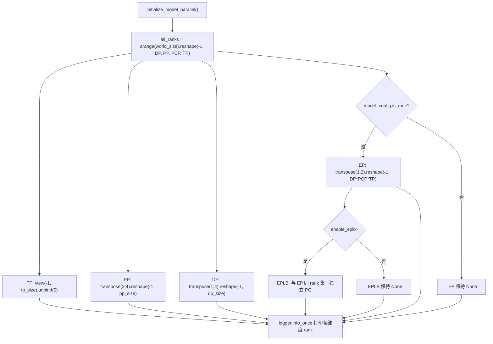
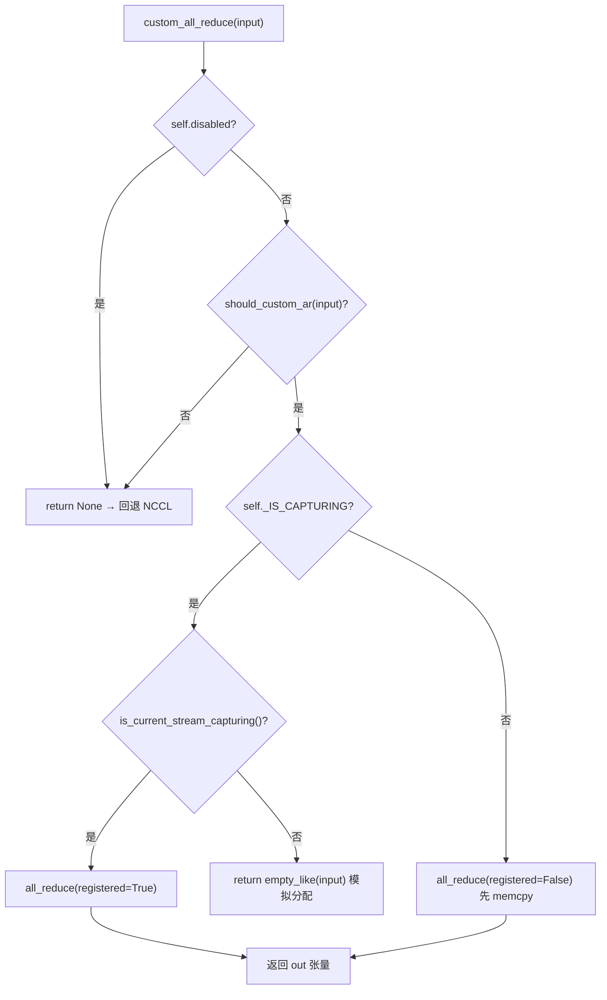

# 第 8 章：分散式並行：TP、PP、EP 與通訊原語

上一章我們走完了單次推理生命週期的最後一公里，從 logits 取樣到串流輸出。但當模型大到單卡放不下時，這條流水線就必須被切分到多個裝置上協同執行。分散式推理的第一性問題不是「怎麼切模型」，而是「切完之後，誰和誰說話、用什麼方式說話」。vLLM 把這兩個問題分別交給 parallel_state.py 的進程組拓撲和 custom_all_reduce.py 的通訊器實現。本章沿著「建組 → 切分 → 通訊 → 負載再平衡」這條鏈路，逐層拆開 TP、PP、EP 的並行策略與底層通訊原語。

# 8.1 進程組拓撲：一張 rank 網格如何切出 TP/PP/DP/EP

## 直覺模型

把 8 張 GPU 想成一張 8 個座位的長桌。張量並行（Tensor Parallelism，TP）要求「同桌的人必須同時舉杯」，流水線並行（Pipeline Parallelism，PP）要求「相鄰座位接力傳菜」，資料並行（Data Parallelism，DP）要求「不同桌各吃各的但最後對帳」，專家並行（Expert Parallelism，EP）要求「token 按科室分診」。若沒有統一的座位編排，每個模組各自`new_group`，就會出現「我以為你在 TP 組裡，其實你在 DP 組裡」的通信錯位——集合通信一旦有 rank 缺席，NCCL 會直接掛死而非報錯。

## 資料結構與記憶體佈局

`GroupCoordinator`是這一切的載體。它的欄位設計直接對應「一個行程在多個平行維度上的多重身份」：

- `rank`是全域 rank，`ranks`是組成員全域 rank 列表，`world_size`是組大小[FACT:vllm/distributed/parallel_state.py:434-436]。
- `local_rank`用於綁定裝置，`rank_in_group`是組內序號——原始碼用一張表精確區分二者：跨兩節點的 4 卡組裡，rank 2 的`local_rank`是 0（它在節點 1 上是第一張卡），但`rank_in_group`是 2[FACT:vllm/distributed/parallel_state.py:437-445]。
- `cpu_group`與`device_group`成對存在：前者走 gloo 做元資料/物件通信，後者走 NCCL 做張量通信[FACT:vllm/distributed/parallel_state.py:446-447]。

這裡有個關鍵設計：**為什麼每個組都要維護一個 CPU 組？**因為`broadcast_object`、`send_object`這類操作傳輸的是 Python 物件（序列化後的位元組），走 NCCL 既浪費顯存又可能污染當前 CUDA 裝置。`barrier()`的註解把這一點說得很直白：NCCL 的 barrier 內部是一次 broadcast，會偷偷建立 GPU 張量，容易搞亂當前裝置，所以必須用 CPU 組[FACT:vllm/distributed/parallel_state.py:1355-1362]。

## Step-by-Step：`initialize_model_parallel`如何切網格

代入一個具體場景：8 卡、TP=2、PP=4、DP=1。核心是把一維 rank 序列 reshape 成多維網格，再沿每個維度切分。

第一步，建構 rank 網格。佈局順序被明確定義為`ExternalDP x DP x PP x PCP x TP` [FACT:vllm/distributed/parallel_state.py:2045-2060]：

```python
all_ranks = torch.arange(world_size).reshape(
    -1, data_parallel_size, pipeline_model_parallel_size,
    prefill_context_model_parallel_size, tensor_model_parallel_size,
)
```

第二步，切 TP 組：把網格 view 成`(-1, tp_size)`後 unbind，得到`[g0,g1],[g2,g3],...` [FACT:vllm/distributed/parallel_state.py:2065-2077]。注意 TP 組額外傳了`use_message_queue_broadcaster=True`，因為 TP 組需要共享記憶體廣播來分發元資料。

第三步，切 PP 組：`all_ranks.transpose(2, 4)`把 PP 維換到最後一維再切，得到`[g0,g2,g4,g6],[g1,g3,g5,g7]` [FACT:vllm/distributed/parallel_state.py:2175-2188]。這正是文件字串裡給出的例子[FACT:vllm/distributed/parallel_state.py:1997-1997]。

第四步，切 DP 組：`transpose(1, 4)`後切[FACT:vllm/distributed/parallel_state.py:2195-2202]。

第五步，切 EP 組——這裡有個容易忽略的細節：EP 組只在 MoE 模型下建立，dense 模型直接跳過[FACT:vllm/distributed/parallel_state.py:2210-2241]。EP 組的 rank 集合是`DP x PCP x TP`的乘積，意味著 EP 複用了 DP 和 TP 的物理卡，而不是獨立維度。



## 設計思考與踩坑

**EPLB 為什麼要獨立行程組？**註解給出了答案：把 EPLB 通信與 MoE 前向的集合通信隔離，防止「執行期的 torch.distributed」與「EPLB 的 torch.distributed」互相死鎖[FACT:vllm/distributed/parallel_state.py:2243-2246]。這是一個典型的「用獨立通信域換確定性」的權衡——多一個 PG 的顯存開銷，換來的是不會在權重搬運時卡死前向。

**DP 組的同步約束**是生產環境最常踩的坑：同一 DP 組內所有 rank 必須同時呼叫`generate`，否則死鎖[FACT:vllm/distributed/parallel_state.py:2048-2051]。因為 DP 組內會做梯度/取樣結果的 all-reduce，任何 rank 缺席都會讓集合通信永久阻塞。

**銷毀順序**同樣有講究。`destroy()`先銷毀 device communicator，再銷毀 device_group 和 cpu_group[FACT:vllm/distributed/parallel_state.py:1380-1393]。註解解釋了原因：device communicator 可能持有依賴這些 PG 的集合通信工作區（如 FlashInfer PCIe IPC barrier），必須先釋放[FACT:vllm/distributed/parallel_state.py:1377-1377]。

# 8.2 通信原語：自訂 all-reduce 如何繞過 NCCL

## 直覺模型

NCCL 的 all-reduce 是「通用貨車」，能拉任何貨、走任何路，但啟動開銷和協定開銷固定。當你要在 8 卡 NVLink 全互聯的機器上反覆做小張量 all-reduce（TP 的每個 attention/MLP 層都要做），通用貨車的「過路費」就變得不可忽視。自訂 all-reduce 是「專用小推車」：只在同機、NVLink 全互聯、張量大小合適的場景下啟用，用一次`cudaMemcpy`換掉 NCCL 的握手與協定開銷。

## 資料結構與記憶體佈局

`CustomAllreduce`的初始化是一場「能力探測 + 資源預分配」的組合。關鍵欄位：

- `_SUPPORTED_WORLD_SIZES = [2, 4, 6, 8, 16]`：只支援這些組大小[FACT:vllm/distributed/device_communicators/custom_all_reduce.py:113-129]。
- `meta_ptrs`：同步元資料 + 中間結果緩衝區，大小`ops.meta_size() + max_size` [FACT:vllm/distributed/device_communicators/custom_all_reduce.py:291-294]。
- `buffer_ptrs`：預註冊的 IPC 緩衝區，eager 模式下輸入張量先拷進來再算[FACT:vllm/distributed/device_communicators/custom_all_reduce.py:298-305]。
- `rank_data`：8MB 的 uint8 張量，存放所有 rank 的 IPC 緩衝區指標元組[FACT:vllm/distributed/device_communicators/custom_all_reduce.py:309-315]。

**為什麼緩衝區要預註冊？**因為 CUDA Graph 捕獲要求所有位址在捕獲時固定。`register_graph_buffers`在捕獲結束時把所有用到的緩衝區位址廣播給所有 rank 並註冊[FACT:vllm/distributed/device_communicators/custom_all_reduce.py:474-491]。

## Step-by-Step：一次 all-reduce 的決策流

代入場景：TP 組內某層 MLP 輸出需要 all-reduce，輸入是 4MB 的 bf16 張量。

第一步，`custom_all_reduce`檢查是否禁用、是否滿足`should_custom_ar` [FACT:vllm/distributed/device_communicators/custom_all_reduce.py:529-533]。

第二步，`should_custom_ar`逐條過濾：world_size > 8 拒絕；dtype 必須是 fp32/fp16/bf16；位元組數必須是 16 的倍數；必須弱連續；world_size==2 或全互聯才繼續[FACT:vllm/distributed/device_communicators/custom_all_reduce.py:493-508]。

第三步，根據是否在 CUDA Graph 捕獲中分流：捕獲中用`registered=True`（位址已固定），否則`registered=False`（需要先 memcpy 到預註冊緩衝區）[FACT:vllm/distributed/device_communicators/custom_all_reduce.py:529-545]。

第四步，實際調用`ops.all_reduce`，傳入`buffer_ptrs[rank]`和`max_size` [FACT:vllm/distributed/device_communicators/custom_all_reduce.py:519-527]。



## 設計思考與踩坑

**多機場景的降級路徑**是這段程式碼最精妙的部分。`same_node`為假時，`mnnvl_only`置真[FACT:vllm/distributed/device_communicators/custom_all_reduce.py:198-199]，隨後檢查 MNNVL（Multi-Node NVLink）能力。如果組內不是每張卡都支援 MNNVL，直接禁用自訂集合通訊[FACT:vllm/distributed/device_communicators/custom_all_reduce.py:228-233]。`_group_can_attempt_mnnvl`用一次 CPU all-reduce（MIN 操作）確保所有 rank 走同一條控制流[FACT:vllm/distributed/device_communicators/custom_all_reduce.py:59-73]——這是異構叢集裡避免「部分 rank 進 MNNVL 路徑、部分走 NCCL」導致掛死的關鍵防護。

**P2P 檢查的代價**：`_can_p2p`會遍歷所有 peer 做`gpu_p2p_access_check`，註解說首次計算很貴但會快取[FACT:vllm/distributed/device_communicators/custom_all_reduce.py:278-278]。生產環境如果發現啟動慢，可以設`VLLM_SKIP_P2P_CHECK`跳過，直接信任驅動的 P2P 報告[FACT:vllm/distributed/device_communicators/custom_all_reduce.py:86-100]。

**reduce-scatter 的三級後端選擇**值得單獨看：`_select_reduce_scatter_backend`按優先級返回`mnnvl_multimem` > `mnnvl_lamport` > `legacy` [FACT:vllm/distributed/device_communicators/custom_all_reduce.py:601-636]。multimem 路徑要求 world_size 在`(2,4,8)`且設備能力是 (10,0) 或 (10,3)（Blackwell 級）[FACT:vllm/distributed/device_communicators/custom_all_reduce.py:103-104]。注意`VLLM_BATCH_INVARIANT`會禁用 multimem 路徑[FACT:vllm/distributed/device_communicators/custom_all_reduce.py:628]——因為 multimem 的歸約順序不確定，會破壞批次不變性。

# 8.3 EPLB：專家負載再平衡的調度邏輯

## 直覺模型

MoE 模型裡，256 個邏輯專家分到 32 張卡上，每卡 8 個。但真實流量下，某些「熱門專家」（比如處理常見語法結構的）會被大量 token 路由到，導致持有它的卡成為瓶頸，其他卡空轉。EPLB（Expert Parallel Load Balancer）就是「給熱門專家加副本」：把熱門專家的權重複製到空閒卡上，讓 token 分流過去。若沒有它，MoE 的實際吞吐會被最慢的那張卡鎖死。

## 資料結構與記憶體佈局

`EplbModelState`用三張映射表描述「邏輯專家 ↔ 物理專家」的關係：

- `physical_to_logical_map`：形狀`(num_moe_layers, num_physical_experts)`，每個物理槽位存它承載的邏輯專家 id[FACT:vllm/distributed/eplb/eplb_state.py:105-120]。
- `logical_to_physical_map`：形狀`(num_moe_layers, num_logical_experts, max_replicas+1)`，稀疏矩陣，-1 表示無映射[FACT:vllm/distributed/eplb/eplb_state.py:123-146]。
- `logical_replica_count`：每個邏輯專家有幾個副本[FACT:vllm/distributed/eplb/eplb_state.py:147-161]。

`expert_load_window`是滑動視窗，形狀`(window_size, num_moe_layers, num_physical_experts)` [FACT:vllm/distributed/eplb/eplb_state.py:180-187]。註解特別指出：現在記錄所有物理專家的負載而非僅本地專家，以保證不同 dispatch 方法（naive all-to-all、DeepEP）統計一致；naive all-to-all 下每個 DP rank 貢獻相同 token 集，負載會被乘以 dp_size[FACT:vllm/distributed/eplb/eplb_state.py:180-187]。

## Step-by-Step：一次重排的完整鏈路

代入場景：`expert_rearrangement_step`達到閾值，觸發`rearrange()`。

第一步，把物理負載映射回邏輯專家。用`scatter_add_`按`physical_to_logical_map`聚合，無效槽位（<0）填到`invalid_idx`桶裡最後丟棄[FACT:vllm/distributed/eplb/eplb_state.py:794-816]。

第二步，跨 rank all-reduce 得到全局邏輯負載。`_allreduce_list`對多個模型的負載做拼接後一次 all-reduce 再拆開，避免多次通訊[FACT:vllm/distributed/eplb/eplb_state.py:1045-1068]。

第三步，調用策略計算新映射。`policy.rebalance_experts`在 host 上運行，所以負載視窗和當前映射都要拷回 CPU[FACT:vllm/distributed/eplb/eplb_state.py:859-867]。

第四步，ROCm 特化的「跳過重排」判斷：如果新映射帶來的 rank 負載不均衡改善小於 5%，就跳過這次重排[FACT:vllm/distributed/eplb/eplb_state.py:869-923]。這是一個務實的優化——重排本身有通訊成本，收益不夠就不做。

第五步，執行權重搬運並提交新映射[FACT:vllm/distributed/eplb/eplb_state.py:925-942]。

```mermaid
sequenceDiagram
    participant Main as 主线程 step()
    participant Policy as DefaultEplbPolicy
    participant Comm as EplbCommunicator
    participant Async as async_worker 线程
    Main->>Main: expert_rearrangement_step >= interval
    Main->>Main: scatter_add_ 物理负载→逻辑负载
    Main->>Main: _allreduce_list 跨 rank 聚合
    Main->>Policy: rebalance_experts(load, replicas, groups, nodes, gpus, map)
    Policy-->>Main: new_physical_to_logical_map
    alt 同步模式
        Main->>Comm: rearrange_expert_weights_inplace()
        Comm-->>Main: 权重搬运完成
        Main->>Main: _commit_eplb_maps()
    else 异步模式
        Main->>Main: eplb_stats = EplbStats(...); rebalanced = True
        Main->>Async: rearrange_event.record()
        Async->>Comm: 后台搬运权重到 expert_buffer
        Async-->>Main: pending_result 就绪
        Main->>Main: _move_to_workspace() 提交
    end
```

## 設計思考與踩坑

**非同步模式的同步原語**是這段程式碼最微妙的地方。`rebalanced`標誌依賴 GIL 在主執行緒和 async worker 之間同步[FACT:vllm/distributed/eplb/eplb_state.py:194-203]。但註解警告：`rebalanced`必須在所有 rank 上保持一致，否則`_all_ranks_result_ready`裡的 all-reduce 會掛死[FACT:vllm/distributed/eplb/eplb_state.py:664-665]。`_all_ranks_result_ready`優先使用 CPU 組做 all-reduce，因為 CPU 組更可靠[FACT:vllm/distributed/eplb/eplb_state.py:1024-1043]。

**滑動視窗的「提前錄製」優化**：`_should_record_current_step`只在距離下次重排不超過`window_size`步時才開啟錄製[FACT:vllm/distributed/eplb/eplb_state.py:689-709]。註解解釋：每個重排週期前`step_interval - window_size`步的資料會被滑動視窗覆蓋，錄了也白錄，浪費 GPU 計算[FACT:vllm/distributed/eplb/eplb_state.py:1196-1199]。`should_record_tensor`是所有層共享的同一個純量張量，一次`fill_`更新所有層[FACT:vllm/distributed/eplb/eplb_state.py:272-278]。

**彈性 EP 的容量預留**：`enable_elastic_ep`時，`physical_expert_capacity`按`elastic_ep_max_dp_size`預留，映射表用 -1 填充多餘槽位[FACT:vllm/distributed/eplb/eplb_state.py:375-386]。這樣擴容時不需要重新分配顯存，只需把 -1 槽位填上真實專家。`reconfigure_physical_expert_slots`負責在擴容/縮容時刷新視圖[FACT:vllm/distributed/eplb/eplb_state.py:1135-1160]。

**`_commit_eplb_maps`的 pin memory 處理**：當`PIN_MEMORY`開啟且源在 CPU 時，先拷到 pinned 記憶體再`non_blocking=True`非同步拷貝到 GPU[FACT:vllm/distributed/eplb/eplb_state.py:1392-1400]。這是為了避免 H2D 拷貝阻塞主執行緒——映射表每層每輪都要更新，同步拷貝會成為瓶頸。

# 設計思考

三塊程式碼共享一個設計哲學：**用能力探測換確定性降級**。`GroupCoordinator`在`world_size == 1`時直接 bypass 所有集合通訊[FACT:vllm/distributed/parallel_state.py:736-738]；`CustomAllreduce`在任一條件不滿足時返回`None`讓呼叫方回退 NCCL[FACT:vllm/distributed/device_communicators/custom_all_reduce.py:532-533]；EPLB 在改善不足 5% 時跳過重排[FACT:vllm/distributed/eplb/eplb_state.py:916]。這種「快速失敗 + 優雅降級」的模式，讓同一份程式碼能在從單卡到多機 MNNVL 的全譜系硬體上運行，而不需要為每種配置寫分支。

另一個共性是**控制流一致性優先於效能**。`_group_can_attempt_mnnvl`用 CPU all-reduce 強制所有 rank 走同一分支[FACT:vllm/distributed/device_communicators/custom_all_reduce.py:59-73]，`_all_ranks_result_ready`同理[FACT:vllm/distributed/eplb/eplb_state.py:1024-1043]。在分散式系統裡，「部分 rank 走了快路徑、部分走了慢路徑」比「所有 rank 都走慢路徑」危險得多——前者會掛死，後者只是慢。

# 本章小結

- `GroupCoordinator`把一維 rank 序列 reshape 成`ExternalDP x DP x PP x PCP x TP`網格，沿各維度切分出 TP/PP/DP/EP/EPLB 行程群組；每個群組同時維護 CPU（gloo）和 device（NCCL）兩個 PG。
- `CustomAllreduce`透過能力探測（同機、NVLink 全互聯、張量大小、dtype、16 位元組對齊）決定是否接管 all-reduce，多機場景降級到 MNNVL 或 NCCL。
- EPLB 用三張映射表描述邏輯/物理專家關係，透過滑動視窗統計負載、策略計算新映射、通訊器搬運權重，支援同步與非同步兩種模式。
- 三者的共同設計原則：能力探測 + 確定性降級 + 控制流一致性優先。

# 本章思考與自測

Q1: `GroupCoordinator.destroy()`先銷毀 device communicator 再銷毀 process group[FACT:vllm/distributed/parallel_state.py:1380-1393]。如果把順序反過來，先銷毀 PG 再銷毀 communicator，在什麼場景下會崩潰？

**參考解析**：註解明確指出 device communicator 可能持有依賴這些 PG 的集合通訊工作區，例如 FlashInfer PCIe IPC barrier[FACT:vllm/distributed/parallel_state.py:1377-1377]。如果先銷毀 PG，communicator 的`destroy()`內部若還要用這些 PG 做一次 barrier 或清理通訊，就會存取已銷毀的 ProcessGroup，觸發 use-after-free 或 NCCL 內部斷言失敗。正確順序是「依賴者先死」：communicator 依賴 PG，所以 communicator 先銷毀。

Q2: `should_custom_ar`要求`inp_size % 16 == 0` [FACT:vllm/distributed/device_communicators/custom_all_reduce.py:493-508]。如果去掉這個檢查，一個 15 位元組的 bf16 張量（比如 7.5 個元素，實際不可能，但假設是 8 個元素 = 16 位元組邊界情況）會怎樣？為什麼自訂 kernel 需要這個對齊？

**參考解析**：自訂 all-reduce kernel 內部用向量化載入（如 128-bit load），要求位址和大小按 16 位元組對齊才能用`float4`之類的寬載入指令。不對齊會導致 kernel 讀取越界或觸發 misaligned address 異常。更隱蔽的是，`buffer_ptrs`預註冊緩衝區按`max_size`分配，如果輸入大小不是 16 的倍數，拷貝進緩衝區後尾部可能有殘留資料被一起歸約，產生靜默錯誤。所以這個檢查既是正確性防護也是效能前提。

Q3: EPLB 非同步模式下，`rebalanced`標誌依賴 GIL 同步[FACT:vllm/distributed/eplb/eplb_state.py:194-203]，且註解警告所有 rank 必須保持一致否則 all-reduce 掛死[FACT:vllm/distributed/eplb/eplb_state.py:664-665]。假設某個 rank 因為網路抖動，async worker 提前把`rebalanced`置為 False，而其他 rank 還是 True，`_all_ranks_result_ready`會發生什麼？

**參考解析**：`_all_ranks_result_ready`對`has_result`做 all-reduce 求和，然後判斷是否等於組大小[FACT:vllm/distributed/eplb/eplb_state.py:1030-1032]。如果某個 rank 的`rebalanced`提前變 False，它的`pending_result`可能已被消費，`has_result`為 0，導致求和結果小於組大小，其他 rank 會一直等待。更糟的是，如果這個 rank 已經退出`while ms.rebalanced`迴圈，它不會再參與後續的 all-reduce，其他 rank 的 all-reduce 會永久阻塞——這就是註解所說的「hang at collective communication calls」。防護手段是`_all_ranks_result_ready`用 CPU 組而非 device 組，且`drain_async`在重排前顯式排空所有 pending result[FACT:vllm/distributed/eplb/eplb_state.py:985-1022]。

至此，我們釐清了卡間通訊的建組、切分與負載再平衡機制。但分散式推理的通訊挑戰不止於單實例內部——當 prefill 與 decode 被拆到不同實例上時，KV Cache 需要跨節點傳輸。下一章我們將離開「卡間通訊」，進入「實例間通訊」：KV Cache 如何在分離式部署的 prefill 與 decode 實例之間傳輸，KV Connector 抽象如何統一 NIXL、Mooncake 等傳輸後端。
