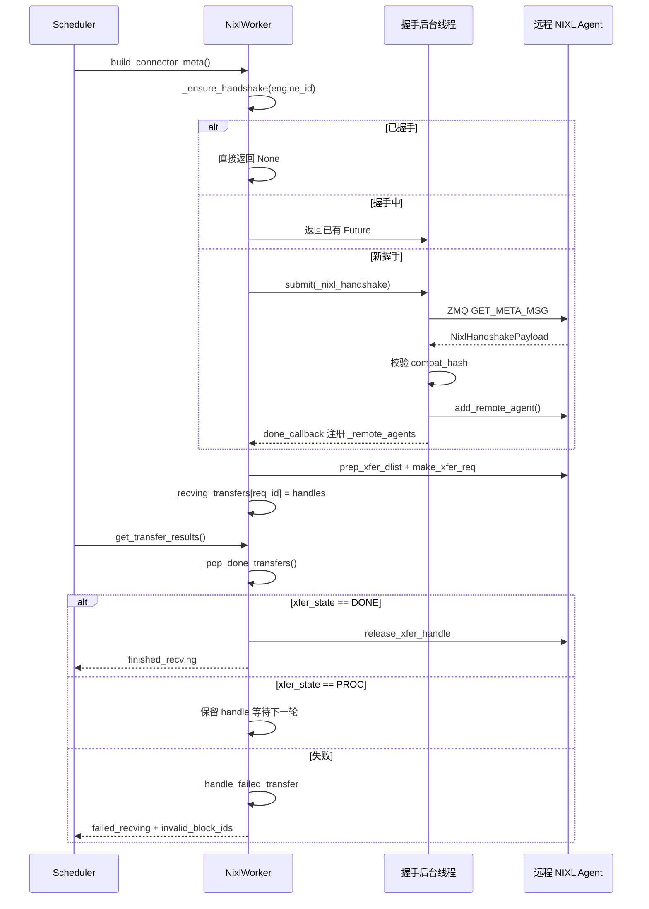

# 第 9 章：KV Cache 傳輸與分離式部署（PD 分離）

上一章我們把視角鎖在單個推理實例內部：TP/PP/DP/EP 進程組如何建組，張量如何在卡間切分，EPLB 如何在 MoE 層做專家再平衡。但所有這些機制都建立在同一個前提上——prefill 和 decode 跑在同一個實例裡，KV Cache 從頭到尾待在本地顯存。分離式部署（Prefill-Decode Disaggregation，簡稱 PD 分離）打破了這個前提。它把 prefill 和 decode 拆成兩個獨立的 vLLM 實例：prefill 實例只做 prompt 的前向計算，產出 KV Cache 後交給 decode 實例；decode 實例拿著這份 KV Cache 繼續自迴歸生成。這樣做的好處是資源可以按階段特性獨立配置——prefill 是計算密集型，適合大 TP、大 batch；decode 是訪存密集型，適合小 batch、低延遲調度。兩者不再互相拖累。代價是：KV Cache 必須跨實例傳輸。這就是本章的主角——KV Connector。vllm/distributed/kv_transfer/kv_connector/v1/base.py 的檔案頭註解已經把整個抽象的核心原語列了出來：Scheduler 側負責綁定元數據、查詢遠端快取命中、決定是否異步釋放 block；Worker 側負責實際的 KV 載入與保存。這套介面的設計目標，是讓上層調度邏輯與底層傳輸後端（NIXL、Mooncake、MoRIIO）徹底解耦。從工程角度看，PD 分離最大的風險不是傳輸慢，而是狀態不一致：prefill 實例認為 KV 已經發出去了，decode 實例卻沒收到；或者 decode 實例提前釋放了 block，prefill 還在往裡寫。本章要探明的，正是這套連接器體系如何用握手協議、租約（lease）、心跳和失敗恢復機制來兜住這些邊界。

# 一、KVConnectorBase_V1：雙角色抽象與元數據契約

## 直覺模型

KV Connector 就像兩家分店之間的快遞系統。Prefill 店算好了半成品（KV Cache），打包寄給 Decode 店繼續加工。但快遞系統不能只有「發貨」這一個動作——它需要一張運單（metadata）說明寄什麼、寄到哪；需要一個簽收機制確認對方收到了；還需要一套超時規則，防止包裹永遠卡在路上佔著貨架。

如果沒有這套抽象，每個傳輸後端（NIXL、Mooncake）都要自己實現調度邏輯，vLLM 的 Scheduler 就得為每種後端寫一套適配代碼。KVConnectorBase_V1 的價值，就是把這套契約固定下來。

## 雙角色：Scheduler 側與 Worker 側

[FACT:vllm/distributed/kv_transfer/kv_connector/v1/base.py:137-142]定義了連接器的兩種角色：

```python
class KVConnectorRole(enum.Enum):
    # Connector running in the scheduler process
    SCHEDULER = 0
    # Connector running in the worker process
    WORKER = 1
```

這個劃分不是隨意的。Scheduler 進程負責全局調度決策——哪些請求需要傳輸、什麼時候可以釋放 block；Worker 進程負責實際的數據搬運。兩者通過`KVConnectorMetadata`通信。

[FACT:vllm/distributed/kv_transfer/kv_connector/v1/base.py:153-158]定義了 Scheduler 到 Worker 方向的元數據基類：

```python
class KVConnectorMetadata(ABC):  # noqa: B024
    """Abstract Metadata used to communicate
    Scheduler KVConnector -> Worker KVConnector.
    """
    pass
```

反向的 Worker 到 Scheduler 方向，[FACT:vllm/distributed/kv_transfer/kv_connector/v1/base.py:161-176]定義了`KVConnectorWorkerMetadata`，它要求實現`aggregate`方法——因為一個 engine step 裡可能有多個 worker 各自返回元數據，需要聚合後再交給 Scheduler。

## 核心數據結構：KVConnectorTransferResults

[FACT:vllm/distributed/kv_transfer/kv_connector/v1/base.py:87-96]定義了傳輸結果的快照結構：

```python
@dataclass
class KVConnectorTransferResults:
    finished_sending: set[str] = field(default_factory=set)
    finished_recving: set[str] = field(default_factory=set)
    failed_recving: set[str] = field(default_factory=set)
```

注意註解裡的關鍵設計：**失敗的接收也會出現在`finished_recving`裡**。這是為了讓 Scheduler 能把請求從「等待傳輸」狀態中釋放出來——即使傳輸失敗了，請求也不能永遠卡著。失敗資訊透過`failed_recving`單獨傳遞，Scheduler 據此決定是重試還是降級。

## 生命週期鉤子：從請求到釋放

整個連接器的生命週期圍繞幾個關鍵鉤子展開。Scheduler 側：

- `get_num_new_matched_tokens` [FACT:vllm/distributed/kv_transfer/kv_connector/v1/base.py:485-518]：查詢遠端快取能命中多少 token。註解特別強調「應該只考慮實際可用的最大前綴」，如果某些 token 因為連線問題或驅逐拿不到，就不能算進去。
- `update_state_after_alloc` [FACT:vllm/distributed/kv_transfer/kv_connector/v1/base.py:520-544]：block 分配後更新狀態。註解裡有個容易踩的坑——判斷是否載入要看`num_external_tokens`，而不是`blocks`是否為空，因為 MultiConnector 的非選中子連接器也會收到真實 block。
- `request_finished` [FACT:vllm/distributed/kv_transfer/kv_connector/v1/base.py:579-598]：請求完成時呼叫，回傳`True`表示連接器接管 block 的非同步釋放責任。

Worker 側：

- `start_load_kv` / `wait_for_layer_load`：逐層載入，支援流水線。
- `save_kv_layer` / `wait_for_save`：逐層儲存。
- `get_transfer_results` [FACT:vllm/distributed/kv_transfer/kv_connector/v1/base.py:396-397]：回傳非同步傳輸的完成情況。

[FACT:vllm/distributed/kv_transfer/kv_connector/v1/base.py:192-201]還有一個容易被忽略但很關鍵的設計——`requires_kv_delivery`屬性：

```python
@property
def requires_kv_delivery(self) -> bool:
    """Whether this connector hands off KV that must be reliably delivered.
    ...
    """
    return self._kv_transfer_config.is_kv_producer
```

註解解釋了動機：如果請求在 KV 交接還沒完成時被搶占，應該重新計算而不是讓它完成並交接已經被搶占釋放的 block。只有 producer 角色才需要可靠交付，best-effort 快取丟了只是未來的一次 cache miss。

## 握手元資料

[FACT:vllm/distributed/kv_transfer/kv_connector/v1/base.py:145-150]定義了握手元資料的基類：

```python
class KVConnectorHandshakeMetadata(ABC):  # noqa: B024
    """Metadata used for out of band connector handshake between
    P/D workers. This needs to serializable.
    """
    pass
```

「out of band」意味著握手不走正常的請求路徑，而是 P/D worker 之間直接通訊。這為 NIXL 的 ZMQ 握手協議埋下了伏筆。

---

# 二、NIXL 連接器：握手、註冊與描述符構建

## 直覺模型

NIXL（NVIDIA Inference Xfer Library）是 NVIDIA 提供的底層傳輸庫，支援 UCX、GDS 等多種後端。NixlBaseConnectorWorker 的角色，就像快遞公司的分揀中心——它需要先和對方分揀中心建立專線（握手），登記自己的貨架佈局（註冊 KV Cache 記憶體區域），然後才能高效地按位址取貨發貨。

如果沒有這套機制，每次傳輸都要重新協商位址、重新建立連線，延遲會高到無法接受。

## 記憶體佈局：Region 與 Descriptor

NIXL 的核心概念是**region**（記憶體區域）和**descriptor**（描述符）。每個 KV Cache 層在 NIXL 中註冊為一個或多個 region，每個 region 有基底位址、塊長度、塊步長。

[FACT:vllm/distributed/kv_transfer/kv_connector/v1/nixl/base_worker.py:740-751]列出了 region 相關的核心欄位：

```python
# Number of NIXL regions. Currently one region per cache
# (so 1 per layer for MLA, otherwise 2 per layer)
self.num_regions = 0
self.region_mem_types: list[str] = []
self.region_group_ids: list[int] = []
self._uses_region_group_mapping = False
self.region_names: list[str] = []
self.region_num_blocks: list[int] = []
self._mixed_mem_types = False
```

[FACT:vllm/distributed/kv_transfer/kv_connector/v1/nixl/base_worker.py:897-900]進一步說明了塊步長的來源：

```python
# Per-region block stride in bytes. Taken from the registered tensor's
# stride(0) so it stays correct under layouts that interleave layers
# within a block (BLHNC/BHLNC), where stride > block_len.
self.block_stride_per_layer = list[int]()
```

這裡的關鍵洞察是：**block_stride 不等於 block_len**。在 BLHNC/BHLNC 這類層間交錯的佈局下，一個 block 的實際跨度可能大於其有效資料長度。如果直接用 block_len 做步長，會讀錯位址。

## 握手協議：ZMQ + 相容性雜湊

握手是 NIXL 連接器最複雜的部分。[FACT:vllm/distributed/kv_transfer/kv_connector/v1/nixl/base_worker.py:974-1128]的`_nixl_handshake`方法完整展示了這個過程。

第一步是設定 CUDA 裝置上下文。[FACT:vllm/distributed/kv_transfer/kv_connector/v1/nixl/base_worker.py:988-998]的註解解釋了原因：

```python
# the first time we connect to a remote agent.
# be careful, the handshake happens in a background thread.
# it does not have an active cuda context until any cuda runtime
# call is made. when UCX fails to find a valid cuda context, it will
# disable any cuda ipc communication, essentially disabling any NVLink
# communication.
if not self.use_host_buffer:
    current_platform.set_device(self.device_id)
```

這是一個非常隱蔽的坑：握手在背景執行緒執行，如果沒有顯式設定裝置，UCX 找不到有效的 CUDA 上下文，會靜默停用 NVLink 通訊，退化成慢速路徑。

第二步是透過 ZMQ 發送元資料查詢。[FACT:vllm/distributed/kv_transfer/kv_connector/v1/nixl/base_worker.py:1029-1036]：

```python
msg = msgspec.msgpack.encode(
    (GET_META_MSG, remote_pp_rank, remote_rank)
)
# Set receive timeout to 5 seconds to avoid hanging on dead server
sock.setsockopt(zmq.RCVTIMEO, 5000)  # milliseconds
start_time = time.perf_counter()
sock.send(msg)
reply_parts = sock.recv_multipart()
```

5 秒逾時是防止對端死掉後無限等待。同時，程式碼用 RTT 估算時鐘偏移[FACT:vllm/distributed/kv_transfer/kv_connector/v1/nixl/base_worker.py:1042-1045]，保留最小 RTT 樣本——因為高 RTT 只是雜訊，會扭曲中點估計。

第三步是相容性校驗。[FACT:vllm/distributed/kv_transfer/kv_connector/v1/nixl/base_worker.py:1063-1080]：

```python
assert self.compat_hash is not None
if (
    self.enforce_compat_hash
    and handshake_payload.compatibility_hash != self.compat_hash
):
    raise RuntimeError(
        f"NIXL compatibility hash mismatch. "
        ...
    )
```

相容性雜湊在[FACT:vllm/distributed/kv_transfer/kv_connector/v1/nixl/base_worker.py:1372-1376]計算：

```python
self.compat_hash = compute_nixl_compatibility_hash(
    self.vllm_config,
    self.backend_name,
    transfer_mode=self._TRANSFER_MODE,
)
```

注意`transfer_mode`也參與雜湊——[FACT:vllm/distributed/kv_transfer/kv_connector/v1/nixl/base_worker.py:163-166]的註解說明：push（WRITE）連接器和 pull（READ）連接器永遠不應該握手成功。

## 非同步握手排程

握手是非同步的，透過執行緒池執行。[FACT:vllm/distributed/kv_transfer/kv_connector/v1/nixl/base_worker.py:824-835]：

```python
self._handshake_initiation_executor = ThreadPoolExecutor(
    # NIXL is not guaranteed to be thread-safe, limit 1 worker.
    max_workers=1,
    thread_name_prefix="vllm-nixl-handshake-initiator",
)
self._ready_requests = queue.Queue[tuple[ReqId, ReqMeta]]()
self._handshake_futures: dict[
    EngineId, Future[tuple[dict[tuple[int, int], str], float]]
] = {}
# Protects _handshake_futures and _remote_agents.
self._handshake_lock = threading.RLock()
```

`max_workers=1`是因為 NIXL 不保證執行緒安全。`_handshake_lock`保護`_handshake_futures`和`_remote_agents`兩個字典。

`_ensure_handshake` [FACT:vllm/distributed/kv_transfer/kv_connector/v1/nixl/base_worker.py:1257-1317]實現了冪等的握手發起：如果已經握手成功直接回傳 None；如果正在握手中回傳已有的 Future；否則提交新任務並註冊回呼。

## 描述符構建：從 block ID 到 NIXL descriptor

握手完成後，需要為每個請求構建描述符。[FACT:vllm/distributed/kv_transfer/kv_connector/v1/nixl/base_worker.py:172-310]的`_compute_desc_ids`是核心。

對於純 attention 模型（無 SSM），走快速路徑[FACT:vllm/distributed/kv_transfer/kv_connector/v1/nixl/base_worker.py:226-262]。註解解釋了 HMA 場景下的處理：

```python
# NOTE (NickLucche) With HMA, every kv group has the same number of layers
# and layers from different groups share the same kv tensor.
# eg block_ids=[[1, 2], [3]]->blocks [1, 2] need to be
# read across all regions, same for [3], but group0-group1 blocks will
# always differ (different areas). Therefore we can just flatten the
# block_ids and compute the descs ids for all groups at once.
```

對於混合 SSM 模型，描述符佈局更複雜[FACT:vllm/distributed/kv_transfer/kv_connector/v1/nixl/base_worker.py:285-304]：

```python
elif _is_ssm_spec(spec_type):
    # NOTE (NickLucche) SSM and Attention block regions can
    # be exchanged arbitrarily by manager.  Therefore, descs
    # are laid out as:
    #   [descs_fa (all regions) | descs_ssm (all regions)].
    # num_fa_descs offset must be computed per-engine since
    # P and D can have different num_blocks (and thus
    # different FA desc counts).
```

## 傳輸拓撲與 TP 映射

異構 TP 是 NIXL 連接器最複雜的場景。[FACT:vllm/distributed/kv_transfer/kv_connector/v1/nixl/base_worker.py:2130-2178]的`add_remote_agent`文件詳細解釋了各種情況：

當 D.world_size > P.world_size 時，多個 D worker 從同一個 P worker 讀取不同的 KV head 分片。文件給出了具體例子：D TP=4，P TP=2，tp_ratio=2。D-Worker0 讀取 P-Worker0 的前半部分 KV head，D-Worker1 讀取後半部分。

對於 MLA 模型，KV Cache 在 TP worker 間是複製的，所以 rank_offset 永遠是 0。

## 租約與心跳：防止 block 被過早釋放

這是 NIXL 連接器最精妙的設計之一。Prefill 實例發送 KV 後，不能立即釋放 block——因為 decode 實例可能還在讀。但如果永遠不釋放，顯存會洩漏。

解決方案是租約（lease）。[FACT:vllm/distributed/kv_transfer/kv_connector/v1/nixl/base_worker.py:528-528]：

```python
kv_lease_duration: int = vllm_config.kv_transfer_config.get_from_extra_config(
    "kv_lease_duration", 30
)
# NOTE (NickLucche): For now we use a hardcoded value for a simpler interface.
self._lease_extension = kv_lease_duration * 2 // 3
```

預設租約 30 秒，每次心跳延長 20 秒（2/3）。

心跳處理在[FACT:vllm/distributed/kv_transfer/kv_connector/v1/nixl/base_worker.py:3014-3034]：

```python
def _handle_heartbeat(self, payload: str) -> None:
    new_expiry = time.perf_counter() + self._lease_extension
    for req_id in payload.split(","):
        if req_id in self._reqs_to_send:
            old = self._reqs_to_send[req_id]
            self._reqs_to_send[req_id] = max(old, new_expiry)
```

注意`max(old, new_expiry)`——心跳只能延長租約，不能縮短。

租約過期後的回收在[FACT:vllm/distributed/kv_transfer/kv_connector/v1/nixl/base_worker.py:2986-3012]：

```python
def _reap_expired_send_leases(self, done_sending: set[str]) -> None:
    """Reclaim expired send-side KV leases into ``done_sending``.

    ``_reqs_to_send`` is not ordered by expiry: heartbeats update the
    deadline in place, and mixed TTLs share the map, so a live head
    entry can sit in front of already-expired ones. Scan every entry
    rather than stopping at the first still-live request.
    """
```

註釋指出了一個容易犯的錯誤：不能因為遇到第一個未過期的請求就停止掃描，因為心跳會原地更新過期時間，導致 map 不是按過期時間排序的。

## 傳輸狀態機與失敗恢復

傳輸的生命週期透過`_pop_done_transfers` [FACT:vllm/distributed/kv_transfer/kv_connector/v1/nixl/base_worker.py:3036-3086]管理：

```python
for handle in handles:
    try:
        xfer_state = self.nixl_wrapper.check_xfer_state(handle)
        if xfer_state == "DONE":
            res = self.nixl_wrapper.get_xfer_telemetry(handle)
            self.xfer_stats.record_transfer(res)
            self.nixl_wrapper.release_xfer_handle(handle)
        elif xfer_state == "PROC":
            in_progress.append(handle)
        else:
            self._log_failure(
                failure_type="transfer_failed",
                req_id=req_id,
                xfer_state=xfer_state,
            )
```

NIXL 傳輸有三種狀態：`DONE`（完成）、`PROC`（進行中）、其他（失敗）。

失敗處理在[FACT:vllm/distributed/kv_transfer/kv_connector/v1/nixl/base_worker.py:3103-3127]：

```python
def _handle_failed_transfer(
    self,
    req_id: str,
    handle: int | None,
    failed_req_ids: set[str] | None = None,
    record_failed_transfer: bool = True,
) -> bool:
    if record_failed_transfer:
        self.xfer_stats.record_failed_transfer()
    if failed_req_ids is not None:
        failed_req_ids.add(req_id)
    return handle is None or self._try_release_xfer_handle(req_id, handle)
```

`_try_release_xfer_handle` [FACT:vllm/distributed/kv_transfer/kv_connector/v1/nixl/base_worker.py:3088-3101]的註釋很關鍵：

```python
except Exception as e:
    # A status error does not guarantee that the backend stopped DMA.
    self._log_failure(
        failure_type="transfer_release_failed",
        msg="Retaining handle and blocks until release succeeds",
        ...
    )
    return False
```

**狀態錯誤不保證後端停止了 DMA**。如果釋放失敗，必須保留 handle 和 block，直到釋放成功。這是一個典型的「寧可洩漏也不要用錯」的設計。

## 失敗請求的 block 處理

當接收失敗時，[FACT:vllm/distributed/kv_transfer/kv_connector/v1/nixl/base_worker.py:2876-2891]展示了處理邏輯：

```python
for req_id in done_recving:
    meta = self._recving_metadata.pop(req_id, None)
    assert meta is not None, f"{req_id} not found in recving_metadata list"

    # Skip KV sync and post-processing for failed requests
    if req_id in failed_recv_reqs:
        self._pending_recv_notifs.pop(req_id, None)
        # TODO (NickLucche) handle failed transfer for HMA.
        if not self._is_hma_required:
            self._invalid_block_ids.put(set(meta.local_block_ids[0]))
        logger.warning(
            "Skipping KV post-processing for failed request %s",
            req_id,
        )
        continue
```

失敗的 block ID 被放入`_invalid_block_ids`隊列，Scheduler 透過`get_block_ids_with_load_errors` [FACT:vllm/distributed/kv_transfer/kv_connector/v1/nixl/base_worker.py:3491-3504]取出，決定是否重試。

## 遠端引擎的 TTL 驅逐

長期運行的實例會不斷遇到新的遠端引擎，如果不清理，記憶體會無限增長。[FACT:vllm/distributed/kv_transfer/kv_connector/v1/nixl/base_worker.py:3506-3532]的`_evict_stale_engines`實現了 TTL 驅逐：

```python
def _evict_stale_engines(self) -> None:
    """Scan for and evict remote engines that have exceeded their TTL.

    Called from the main thread in when a new remote engine appears.
    We can only go OOM as we discover and register a new remote, therefore we make
    sure we clean up stale engine data structures before then.
    """
    if self._engine_ttl  self._engine_ttl and eid not in busy:
            self._cleanup_remote_engine(eid)
```

關鍵約束是`busy`集合——有進行中傳輸的引擎不能被驅逐。[FACT:vllm/distributed/kv_transfer/kv_connector/v1/nixl/base_worker.py:3534-3546]的註釋解釋了原因：

```python
"""Remote engines a transfer is still reading from.

The timestamp is stamped when a read is issued and not refreshed while
it runs, so a transfer that outlives the TTL leaves its engine looking
idle. A peer that has lost its NIC holds one indefinitely.
"""
```

如果對端網卡壞了，傳輸可能永遠掛著，時間戳不會刷新，引擎看起來是空閒的。`busy`集合顯式保護了這種情況。

## 握手與傳輸的時序

下面這張時序圖展示了從請求到傳輸完成的核心互動：



---

# 三、設計思考：為什麼這樣設計

## 為什麼握手要異步？

握手涉及網路往返，可能耗時幾十毫秒。如果同步執行，會阻塞 Scheduler 的主迴圈，影響所有請求的調度。異步握手讓 Scheduler 可以先處理其他請求，握手完成後透過回調通知。

但異步也帶來了複雜性：`_handshake_futures`字典需要鎖保護，回調裡要處理成功和失敗兩種情況，還要防止重複握手。

## 為什麼用租約而不是引用計數？

引用計數需要 decode 實例顯式通知 prefill「我讀完了」。但如果 decode 實例崩潰，通知永遠不會到達，prefill 的 block 就永遠洩漏了。

租約是更魯棒的方案：即使 decode 崩潰，租約到期後 prefill 自動回收。心跳機制則保證正常情況下的租約續期。

## 為什麼失敗時保留 handle？

[FACT:vllm/distributed/kv_transfer/kv_connector/v1/nixl/base_worker.py:3088-3101]的註釋說得很清楚：狀態錯誤不保證 DMA 停止。如果此時釋放 handle，DMA 可能還在往已釋放的記憶體寫資料，導致資料損壞或崩潰。寧可暫時洩漏，也不能冒這個風險。

## 為什麼 TTL 驅逐要檢查 busy？

[FACT:vllm/distributed/kv_transfer/kv_connector/v1/nixl/base_worker.py:3534-3546]的註釋揭示了一個隱蔽的 bug 場景：時間戳在讀取發起時打上，讀取期間不刷新。如果傳輸時間超過 TTL，引擎看起來是空閒的，但實際上還在被讀取。如果此時驅逐，正在進行的傳輸會失敗。

## 生產環境踩坑點

1. **CUDA 上下文問題**：握手在後台線程執行，必須顯式`set_device`，否則 UCX 會靜默禁用 NVLink。

2. **兼容性哈希不匹配**：P/D 實例的 vLLM 版本、模型、dtype、KV layout、attention backend 必須完全一致。不一致時握手會失敗，錯誤信息會提示如何禁用檢查（但不建議）。

3. **租約過期**：如果 decode 實例負載很高，心跳可能延遲，導致租約過期。日誌裡會出現 "Releasing expired KV blocks" 警告。可以調大`kv_lease_duration`。

4. **TP 不匹配**：異構 TP 需要 block-contiguous 佈局（如 LBHNC）。如果用了非連續佈局，異構 TP 會失敗。

5. **NIXL UAR 耗盡**：[FACT:vllm/distributed/kv_transfer/kv_connector/v1/nixl/base_worker.py:631-636]的註釋警告：每個 UCX 執行緒透過 DevX 分配 UAR（doorbell pages），過多的 NIXL UAR 使用會耗盡 NIC UAR 空間，導致 NVSHMEM（DeepEP 核心使用）在 RDMA 初始化時失敗。

---

# 本章小結

本章深入了 KV Connector 體系的核心機制：

1. **KVConnectorBase_V1**定義了 Scheduler 側和 Worker 側的雙角色抽象，透過`KVConnectorMetadata`和`KVConnectorTransferResults`實現元資料交換和傳輸結果回饋。

2. **NIXL 連接器**是最成熟的實現，它透過 ZMQ 握手協定建立 P/D 實例間的連接，用相容性雜湊防止配置不匹配，用非同步執行緒池避免阻塞主迴圈。

3. **租約與心跳**機制解決了 block 釋放的時序問題：prefill 發送 KV 後不立即釋放，而是等待 decode 的心跳續期或租約過期。

4. **失敗恢復**遵循「寧可洩漏也不要用錯」的原則：釋放失敗時保留 handle，失敗的 block ID 上報給 Scheduler 決定重試。

5. **TTL 驅逐**防止長期運行時遠端引擎狀態無限增長，但必須保護有進行中傳輸的引擎。

下一章我們將轉向另一個消除開銷的方向：編譯加速與 CUDA Graph。當 PD 分離解決了資源利用率問題後，單次前向的啟動開銷成為新的瓶頸——如何用 CUDA Graph 把成百上千個核心啟動壓縮成一次重放。

# 本章思考與自測

Q1: 如果把`_try_release_xfer_handle`中的異常處理去掉，直接呼叫`release_xfer_handle`，在什麼場景下會導致資料損壞？為什麼？

**參考解析**：`_try_release_xfer_handle` [FACT:vllm/distributed/kv_transfer/kv_connector/v1/nixl/base_worker.py:3088-3101]的註釋明確指出："A status error does not guarantee that the backend stopped DMA." 如果去掉異常處理，當`release_xfer_handle`拋出異常時，呼叫方會認為釋放成功，繼續釋放 block。但實際上 NIXL 後端的 DMA 可能還在進行中，正在往這塊記憶體寫資料。一旦 block 被重新分配給其他請求，DMA 寫入會污染新請求的 KV Cache，導致輸出亂碼或 NaN。更糟的是，如果 block 被釋放回顯示記憶體池並被其他張量複用，DMA 可能寫入非法位址導致崩潰。正確的做法是保留 handle 和 block，在下一輪`_pop_done_transfers`中重試釋放。

Q2: `_reap_expired_send_leases`的註釋說「不能因為遇到第一個未過期的請求就停止掃描」。如果改成遇到未過期就 break，在什麼場景下會觸發 block 洩漏？

**參考解析**：`_reqs_to_send`是一個普通 dict，不是按過期時間排序的優先佇列。心跳處理`_handle_heartbeat` [FACT:vllm/distributed/kv_transfer/kv_connector/v1/nixl/base_worker.py:3014-3034]會原地更新過期時間：`self._reqs_to_send[req_id] = max(old, new_expiry)`。這意味著一個先加入的請求可能因為持續收到心跳而擁有很晚的過期時間，排在它後面的請求可能已經過期。如果遇到第一個未過期就 break，後面已過期的請求永遠不會被回收，它們的 block 會一直佔用顯示記憶體。在長時間運行、請求模式混合（有些請求被頻繁心跳續期，有些請求的 decode 實例已經崩潰）的場景下，這會累積成嚴重的顯示記憶體洩漏。

Q3: `_evict_stale_engines`用`_engines_with_inflight_transfers`保護有進行中傳輸的引擎。如果去掉這個保護，在什麼網路故障場景下會導致傳輸失敗？

**參考解析**：`_engines_with_inflight_transfers` [FACT:vllm/distributed/kv_transfer/kv_connector/v1/nixl/base_worker.py:3534-3546]的註釋解釋了一個關鍵場景："The timestamp is stamped when a read is issued and not refreshed while it runs, so a transfer that outlives the TTL leaves its engine looking idle. A peer that has lost its NIC holds one indefinitely." 假設對端網卡故障，一個 NIXL 讀操作掛起超過 TTL（預設 3600 秒）。`_engine_last_active`時間戳在讀取發起時打上，讀取期間不刷新，所以引擎看起來已經空閒。如果此時`_evict_stale_engines`驅逐了這個引擎，會呼叫`_cleanup_remote_engine`釋放`dst_xfer_side_handles`並移除 remote agent。但正在進行的 DMA 還在使用的這些資源，釋放後會導致傳輸失敗甚至崩潰。`busy`集合顯式保護了這種情況，確保有進行中傳輸的引擎不會被驅逐。

至此，我們已經看清 KV Connector 如何在 prefill 與 decode 實例之間建立可靠的資料通道，以及它如何用租約、心跳和失敗恢復機制守住狀態一致性。但跨實例傳輸只是 PD 分離的一半故事——當 KV Cache 抵達 decode 實例後，推理引擎仍需在單實例內部高效執行每一步前向計算。而 Python 調度與內核啟動開銷，正是制約單步延遲的下一道瓶頸。下一章將轉向編譯加速與 CUDA Graph，看 vLLM 如何用 torch.compile 和 piecewise backend 消除這些開銷，並讓 CUDA Graph 與動態批處理形狀協調共存。
