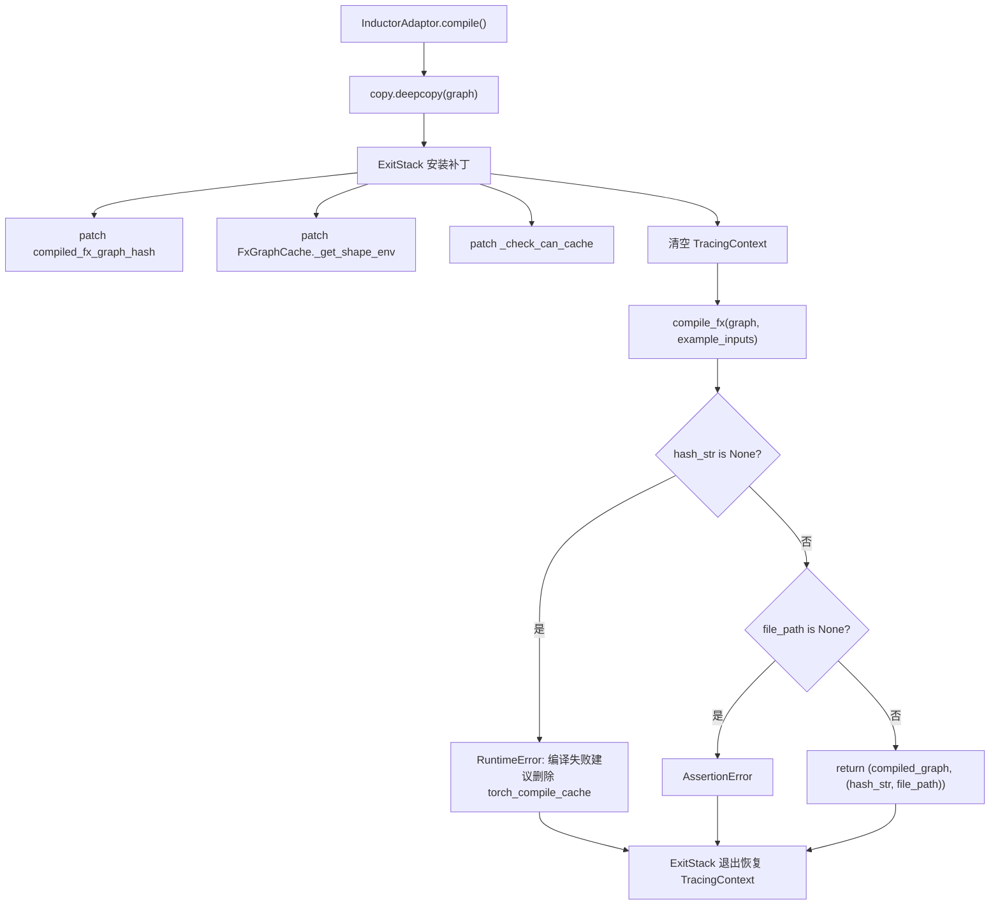
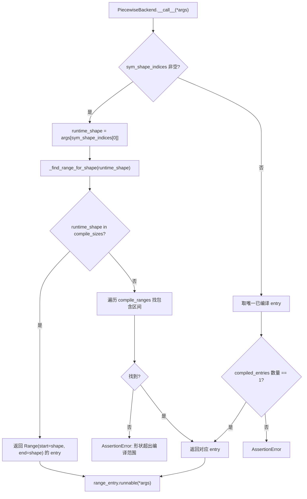

# 第 10 章：編譯加速與 CUDA Graph：消除啟動與調度開銷

上一章我們看到，KV Connector 透過 NIXL、Mooncake 等連接器在 Prefill 與 Decode 引擎之間高效搬運 KV cache，讓分離式架構在降低 TTFT 的同時提升了資源利用率。但即便傳輸再快，自迴歸解碼中仍有兩項無法靠演算法消除的固定成本：Python 解譯器的調度開銷與 GPU 內核的啟動開銷。當模型前向被拆成數百個算子，每個算子都要經歷一次 Python 函式呼叫和一次 CUDA 內核啟動時，CPU 側的開銷足以讓 GPU 在兩次計算之間空轉。本章剖析 vLLM 如何用 torch.compile 把算子融合成靜態圖，再用 CUDA Graph 把整段內核啟動序列錄製成一次重放，從而把這兩類開銷壓到接近零。

# 編譯快取與編譯器適配層：讓編譯結果跨進程複用

## 直覺模型

編譯加速的收益是「一次編譯、多次執行」，但代價是首次編譯耗時可能長達數分鐘。如果沒有快取，每次服務重啟都要重新編譯，冷啟動時間無法接受。`CompilerInterface`這一層要解決的正是「編譯產物如何序列化、如何用雜湊標識、如何在下次啟動時精確命中」的問題。若沒有它，系統面臨的災難不是崩潰，而是每次重啟都退化成「首次執行」——在自動擴縮容的生產環境中，這意味著擴容出來的實例在數分鐘內無法提供低延遲服務。

## 資料結構與介面契約

`CompilerInterface`定義了編譯器適配器的抽象契約，核心是四個方法：`initialize_cache`負責把編譯器自身的快取目錄重定向到 vLLM 的快取目錄下[FACT:vllm/compilation/compiler_interface.py:36-51]；`compute_hash`收集編譯器相關的配置資訊生成雜湊[FACT:vllm/compilation/compiler_interface.py:53-62]；`compile`執行編譯並返回可呼叫物件與句柄[FACT:vllm/compilation/compiler_interface.py:64-95]；`load`從句柄恢復編譯產物[FACT:vllm/compilation/compiler_interface.py:97-103]。

這裡的關鍵設計是`compile`返回一個二元組`(callable, handle)`。`callable`是本次進程內可直接呼叫的編譯結果；`handle`是「下次啟動時用來恢復」的憑證，文件明確要求它應當是「plain Python object, preferably a string or a file path」[FACT:vllm/compilation/compiler_interface.py:81-81]。這個分離讓快取命中路徑與首次編譯路徑可以走完全不同的程式碼——命中時根本不需要`compile`，只需要`load`。

`compile_range`參數承載了動態形狀的語義。註解說明它「could be concrete size (if compile_sizes is provided), e.g. [4, 4] or a range [5, 8]」，且「Right now we only support one variable in ranges for all inputs, which is the batchsize (number of tokens) during inference」[FACT:vllm/compilation/compiler_interface.py:74-74]。這是 vLLM 編譯策略的核心約束：所有動態形狀被歸約為單一變數——token 數。

## 場景驅動：一次編譯請求的完整流轉

假設服務首次啟動，`InductorAdaptor.compile`被呼叫。它首先遞增編譯計數器[FACT:vllm/compilation/compiler_interface.py:477-489]，然後進入一個精心構造的補丁堆疊。

第一步是深拷貝圖。註解指出「inductor can inplace modify the graph, so we need to copy it」[FACT:vllm/compilation/compiler_interface.py:500-502]，這是防禦性設計——編譯失敗後原圖仍可用於重試。

第二步是安裝一系列 monkey-patch。`hijacked_compile_fx_inner`包裝了 Inductor 的內部編譯函式，在編譯完成後從`inductor_compiled_graph._fx_graph_cache_key`抓取雜湊[FACT:vllm/compilation/compiler_interface.py:512-536]。`hijack_compiled_fx_graph_hash`則攔截雜湊計算函式本身[FACT:vllm/compilation/compiler_interface.py:538-542]。為什麼要「劫持」雜湊？因為 vLLM 需要在 Dynamo 追蹤上下文之外單獨編譯，而 Inductor 的雜湊計算依賴該上下文。

第三步是`_check_can_cache`補丁，它直接返回、不做任何檢查[FACT:vllm/compilation/compiler_interface.py:544-551]。註解解釋了動機：「Inductor refuses to cache the graph outside of Dynamo tracing context, and also disables caching for graphs with high-order ops. For vLLM, in either case, we want to cache the graph」[FACT:vllm/compilation/compiler_interface.py:544-551]。

第四步是清理追蹤上下文。這是最微妙的一處：vLLM 從`PiecewiseCompileInterpreter`內部呼叫`compile_fx`，此時 Dynamo 的`FakeTensorMode`與子圖輸入的`FakeTensorMode`不一致，`detect_fake_mode()`會斷言失敗[FACT:vllm/compilation/compiler_interface.py:615-622]。程式碼儲存`TracingContext`後將其置空，並註冊回調在退出時恢復[FACT:vllm/compilation/compiler_interface.py:623-630]。

## 設計思考：AlwaysHitShapeEnv 與快取一致性

`AlwaysHitShapeEnv`這個類別值得單獨剖析。它的文件字串直白地說明了動機：vLLM 只執行一次 Dynamo 位元組碼編譯，但要用不同形狀加一個通用形狀多次執行 Inductor 編譯；針對特定形狀的編譯發生在 Dynamo 上下文之外，此時沒有 shape environment 提供給 Inductor，會導致 Inductor 程式碼快取查找失敗[FACT:vllm/compilation/compiler_interface.py:114-131]。

解決方案是提供一個「永遠命中」的假 shape environment：`evaluate_guards_expression`恆返回`True` [FACT:vllm/compilation/compiler_interface.py:144-145]，`get_pruned_guards`返回空列表[FACT:vllm/compilation/compiler_interface.py:144-145]，`produce_guards_expression`返回空字串[FACT:vllm/compilation/compiler_interface.py:147-159]。註解坦承這些方法是「obtained by trial-and-error until it works」[FACT:vllm/compilation/compiler_interface.py:137-142]——這是與 PyTorch 內部實作耦合的脆弱點，也是升級 PyTorch 時最易出問題的地方。

快取雜湊的構成同樣關鍵。`get_inductor_factors`收集三類因子：系統狀態`CacheBase.get_system()`、PyTorch 狀態`torch_key()`、以及 Inductor 與 functorch 的配置[FACT:vllm/compilation/compiler_interface.py:165-185]。注意 functorch 配置是在`patch(_get_vllm_functorch_config())`上下文中採集的[FACT:vllm/compilation/compiler_interface.py:188-189]，這保證了「編譯時配置與快取鍵始終一致」——註解明確說這是為了讓`set_functorch_config()`和`get_inductor_factors()`保持一致[FACT:vllm/compilation/compiler_interface.py:147-159]。如果這兩處不一致，就會出現「編譯時用了配置 A、快取鍵按配置 B 計算」的錯配，導致快取命中卻載入了錯誤的產物。

生產踩坑：`_patch_standalone_compile_atomic_save`是針對 torch < 2.10.0 的 backport[FACT:vllm/compilation/compiler_interface.py:205-243]。它把`CompiledArtifact.save()`改為用`write_atomic`寫二進位格式，註解說明目的是「preventing corrupt cache files when multiple processes compile concurrently」[FACT:vllm/compilation/compiler_interface.py:208-210]。在多副本同時冷啟動的場景下，多個行程會並發寫同一個快取檔案，非原子寫會產生半截檔案，後續行程讀到損壞產物後行為不可預測。

# PiecewiseBackend：按形狀分檔編譯與執行時派發

## 直覺模型

`PiecewiseBackend`是編譯與執行之間的排程中樞。它把「一個 FX 子圖」編譯成「多個形狀檔位的可呼叫物件」，並在執行時根據實際 token 數選擇最合適的那一個。若沒有它，要麼所有形狀都走同一個通用編譯（效能次優），要麼每個形狀都單獨編譯（編譯時間爆炸）。

## 資料結構：RangeEntry 與編譯範圍

核心資料結構是`RangeEntry`，它把`compile_range`、`compiled`標誌和`runnable`綁定在一起[FACT:vllm/compilation/piecewise_backend.py:80-83]。`PiecewiseBackend`維護一個`range_entries: dict[Range, RangeEntry]` [FACT:vllm/compilation/piecewise_backend.py:166-171]。

編譯範圍的構造分兩步。首先處理`compile_sizes`（精確尺寸），每個尺寸生成一個`Range(start=size, end=size)`的單點區間[FACT:vllm/compilation/piecewise_backend.py:166-171]。注意這裡對字串`"cudagraph_capture_sizes"`直接拋`NotImplementedError`，並說明「should be handled in`post_init_cudagraph_sizes`" [FACT:vllm/compilation/piecewise_backend.py:166-171]——這是一個顯式的職責邊界聲明。然後處理`compile_ranges`（區間），每個區間生成一個 entry[FACT:vllm/compilation/piecewise_backend.py:173-173]。

`PiecewiseBackend`支援兩種互斥模式，建構函式用異或斷言強制這一點[FACT:vllm/compilation/piecewise_backend.py:117-119]：編譯模式（有 graph，無 compiled_runnables）走`compile_all_ranges()` [FACT:vllm/compilation/piecewise_backend.py:193-194]；預編譯模式（無 graph，有 compiled_runnables）走`load_all_ranges()` [FACT:vllm/compilation/piecewise_backend.py:193-194]。這個設計讓冷啟動與熱啟動共享同一個類別，只是資料來源不同。

## 場景驅動：從編譯到執行時派發

**編譯階段**：`compile_all_ranges`遍歷所有 range entry，對每個未編譯的 entry 呼叫`_log_compile_start`記錄追蹤事件[FACT:vllm/compilation/piecewise_backend.py:252-256]。關鍵分支在參數構造：如果是單點尺寸，呼叫`create_concrete_args`生成具體形狀的 FakeTensor[FACT:vllm/compilation/piecewise_backend.py:258-261]；否則呼叫`get_fake_args_from_graph`直接復用圖中的 placeholder 元資料[FACT:vllm/compilation/piecewise_backend.py:262-263]。

`create_concrete_args`的實作揭示了符號形狀具體化的細節。它構造一個帶`ShapeEnv`的`FakeTensorMode` [FACT:vllm/compilation/piecewise_backend.py:54]，然後遍歷 placeholder 節點。對`SymInt`類型的輸入，用`concretize`把所有自由符號替換為`size` [FACT:vllm/compilation/piecewise_backend.py:47-52]；對`Tensor`類型，則要同時具體化 shape、stride、storage_offset，並用`compute_required_storage_length`算出所需儲存長度，再透過`as_strided`重建張量[FACT:vllm/compilation/piecewise_backend.py:64-73]。為什麼不能只改 shape？因為 stride 和 storage_offset 也可能含符號，且三者必須自洽，否則`as_strided`會越界。

**執行時派發**：`__call__`是熱路徑。如果存在`sym_shape_indices`，從`args`中取出執行時形狀[FACT:vllm/compilation/piecewise_backend.py:357-362]，然後呼叫`_find_range_for_shape`查找。查找邏輯有優先級：先看是否命中精確的`compile_sizes`，命中則返回該單點區間[FACT:vllm/compilation/piecewise_backend.py:342-355]；否則遍歷`compile_ranges`找包含該形狀的區間[FACT:vllm/compilation/piecewise_backend.py:342-355]。

## 設計思考：序列化與 CachingAutotuner 的特殊處理

> **[Design Inference & Architectural Trade-offs]**
> `to_bytes`方法負責把編譯產物序列化，用於 AOT 快取。這裡有一個精妙的`reducer_override`：當 pickle 遇到`CachingAutotuner`時，先呼叫`obj.prepare_for_pickle()`再序列化[FACT:vllm/compilation/piecewise_backend.py:209-218]。為什麼需要這個鉤子？`CachingAutotuner`內部持有 Triton 編譯產物和執行時狀態，直接 pickle 可能失敗或產生不可複用的物件；`prepare_for_pickle`顯然是把物件轉換成可序列化的純淨形態。

序列化時還臨時開啟`bundled_autograd_cache` [FACT:vllm/compilation/piecewise_backend.py:222]，這與`_get_vllm_functorch_config`中的邏輯呼應——當`VLLM_USE_MEGA_AOT_ARTIFACT`未啟用時該配置為`False` [FACT:vllm/compilation/compiler_interface.py:160-161]，序列化時則強制為`True`，確保產物被打包。

`load_all_ranges`是熱啟動路徑，它斷言每個 range 都能在`compiled_runnables`中找到對應 key，否則拋出包含可用 key 列表的錯誤[FACT:vllm/compilation/piecewise_backend.py:329-339]。這個錯誤訊息設計得很實用——直接列出可用 key，便於排查快取版本不匹配。

# CUDA Graph 包裝器：捕獲、重放與嵌套派發

## 直覺模型

CUDA Graph 把「一串核心啟動」錄製成一張靜態圖，之後每次重放只需一次 API 呼叫。`CUDAGraphWrapper`就是錄製與重放的執行者。它面臨的核心難題是：vLLM 的批次大小是動態的，而 CUDA Graph 要求輸入位址固定。解決方案是「按 batch descriptor 分檔捕獲」——每個形狀檔位錄一張圖，執行時按 descriptor 查表重放。

## 資料結構：CUDAGraphEntry 與派發契約

`CUDAGraphEntry`持有三個關鍵欄位：`batch_descriptor`作為派發鍵[FACT:vllm/compilation/cuda_graph.py:128-135]、`cudagraph`是捕獲的圖物件[FACT:vllm/compilation/cuda_graph.py:128-135]、`output`是捕獲時的輸出（用弱引用保存以省記憶體）[FACT:vllm/compilation/cuda_graph.py:128-135]。`input_addresses`僅在除錯模式下用於校驗重放時輸入位址一致[FACT:vllm/compilation/cuda_graph.py:128-135]。

`CUDAGraphWrapper`的類別文件精確描述了派發契約：初始化時分配一個 runtime mode（FULL 或 PIECEWISE）[FACT:vllm/compilation/cuda_graph.py:158-158]；執行時從 forward context 接收 runtime_mode 和 batch_descriptor 並「blindly trust them」[FACT:vllm/compilation/cuda_graph.py:158-158]；若 runtime_mode 為 NONE 或不匹配則直接呼叫[FACT:vllm/compilation/cuda_graph.py:158-158]；否則執行捕獲或重放[FACT:vllm/compilation/cuda_graph.py:158-158]。

文件還特別聲明了一個邊界：「CUDAGraphWrapper does not store persistent buffers or copy any runtime inputs into that buffers for replay」[FACT:vllm/compilation/cuda_graph.py:164-164]。這意味著輸入緩衝區的管理是呼叫方的責任——wrapper 只負責圖本身。

## 場景驅動：一次捕獲與一次重放

**捕獲路徑**：當`__call__`被觸發且 runtime_mode 匹配時，先檢查 forward context 是否可用。若不可用（如視覺編碼器的前向），直接呼叫底層函式[FACT:vllm/compilation/cuda_graph.py:232-233]。這是多模態場景的關鍵分支——ViT 前向不走 CUDA Graph。

接著取`batch_descriptor`和`cudagraph_runtime_mode` [FACT:vllm/compilation/cuda_graph.py:242-244]。若 mode 為 NONE 或不匹配，直接呼叫[FACT:vllm/compilation/cuda_graph.py:246-256]。這個「不匹配就直通」的設計讓嵌套 wrapper 得以共存：FULL wrapper 在外層、PIECEWISE wrapper 在內層，執行時只有一個會被激活。

若 entry 的`cudagraph`為 None，進入捕獲。先呼叫`validate_cudagraph_capturing_enabled()`校驗合法性[FACT:vllm/compilation/cuda_graph.py:279]，然後記錄輸入位址[FACT:vllm/compilation/cuda_graph.py:281-284]，建立`torch.cuda.CUDAGraph()` [FACT:vllm/compilation/cuda_graph.py:285]。

捕獲上下文中有幾處關鍵操作。若`gc_disable`開啟，則 patch 掉`gc.collect`和`torch.accelerator.empty_cache` [FACT:vllm/compilation/cuda_graph.py:288-303]。註解解釋了原因：piecewise 模式下每層都要捕獲一張圖，反覆 GC 會讓捕獲極慢，所以「only run gc for the first graph, and disable gc for the rest」[FACT:vllm/compilation/cuda_graph.py:289-294]。接著設定 graph pool id[FACT:vllm/compilation/cuda_graph.py:305-308]，並同步 offloader 的拷貝流[FACT:vllm/compilation/cuda_graph.py:310-312]。

真正的捕獲在`torch.cuda.graph(cudagraph, pool=..., stream=...)`上下文中執行`self.runnable(*args, **kwargs)` [FACT:vllm/compilation/cuda_graph.py:315-321]。捕獲後呼叫`get_offloader().join_after_forward()`避免未 join 的流錯誤[FACT:vllm/compilation/cuda_graph.py:322-326]。若`weak_ref_output`開啟，把 output 轉為弱引用以省記憶體[FACT:vllm/compilation/cuda_graph.py:327-334]。最後 entry 保存弱引用 output 和圖物件[FACT:vllm/compilation/cuda_graph.py:338-339]，但**返回的是原始 output 而非弱引用**——註解強調這是為了讓 PyTorch 在捕獲期間正確管理記憶體[FACT:vllm/compilation/cuda_graph.py:343-346]。

**重放路徑**：若 entry 已有圖，除錯模式下校驗輸入位址一致[FACT:vllm/compilation/cuda_graph.py:348-357]，然後同步 offloader[FACT:vllm/compilation/cuda_graph.py:359-361]，呼叫`entry.cudagraph.replay()`並返回`entry.output` [FACT:vllm/compilation/cuda_graph.py:362-363]。

## 設計思考：為什麼輸出要弱引用，而返回要強引用

這是`CUDAGraphWrapper`中最反直覺的一處。捕獲時`output`由 PyTorch 的 cudagraph pool 管理[FACT:vllm/compilation/cuda_graph.py:320]。如果 entry 強引用 output，那麼這張圖佔用的顯存永遠無法釋放；但如果在捕獲期間就把它轉成弱引用，PyTorch 可能在捕獲完成前就回收記憶體，導致捕獲失敗。所以程式碼在捕獲區塊內用弱引用[FACT:vllm/compilation/cuda_graph.py:334]，在 entry 中存弱引用[FACT:vllm/compilation/cuda_graph.py:338]，但函式返回值是強引用[FACT:vllm/compilation/cuda_graph.py:346]。這個「三重引用狀態」是記憶體安全與顯存效率的精確平衡。

另一個值得注意的設計是`_all_instances`這個`WeakSet` [FACT:vllm/compilation/cuda_graph.py:173-176]。它讓`clear_all_graphs`能一次性清空所有 wrapper 的圖[FACT:vllm/compilation/cuda_graph.py:173-176]，用於顯存緊張時的緊急回收。用`WeakSet`而非普通集合，是為了不阻止 wrapper 被 GC——否則 wrapper 本身會洩漏。

生產踩坑：`__getattr__`的實作會在除錯模式下對不存在的屬性拋出帶上下文的錯誤[FACT:vllm/compilation/cuda_graph.py:211-217]。這看似小事，但在排查「為什麼某個方法呼叫失敗」時，能看到 wrapper 包裝的 runnable 字串描述，比裸`AttributeError`有用得多。

# 設計思考：編譯與 CUDA Graph 的解耦

設計文件明確記錄了這次重構的動機。早期 piecewise 編譯是為了支援 piecewise CUDA Graph 捕獲，把不支援 CUDA Graph 的算子（主要是 attention）排除在外[FACT:docs/design/cuda_graphs.md:25]。後來加入 full CUDA Graph 支援，但「this tight coupling between compilation and cudagraph capture led to an all-or-nothing experience with little flexibility」[FACT:docs/design/cuda_graphs.md:25]。

重構後的目標有四條：顯式區分 prefill/mixed 與 uniform-decode 批次並分別捕獲[FACT:docs/design/cuda_graphs.md:25-25]；把 CUDA Graph 捕獲邏輯與編譯解耦，使「capturing piecewise and full cudagraphs using the same compiled graph」[FACT:docs/design/cuda_graphs.md:25-25]；執行時按批次組成派發[FACT:docs/design/cuda_graphs.md:25-25]；集中控制以降低複雜度[FACT:docs/design/cuda_graphs.md:25-25]。

`BatchDescriptor`是派發鍵的核心結構，包含`num_tokens`、`num_reqs`、`uniform`、`has_lora`四個欄位[FACT:docs/design/cuda_graphs.md:86-93]。`uniform`標誌尤為關鍵——許多 attention 後端只在批次 uniform 時支援 full CUDA Graph[FACT:docs/design/cuda_graphs.md:95-95]。文件還預告了這個結構可能擴展，比如加入`uniform_query_len`支援多種 uniform decode 長度[FACT:docs/design/cuda_graphs.md:95-95]。

派發優先級是`FULL > PIECEWISE > None`，若派發鍵不存在則回退到 NONE 模式做 eager 執行[FACT:docs/design/cuda_graphs.md:112-115]。這個「降級而非報錯」的策略保證了任何批次組合都能執行，只是效能不同。

`AttentionCGSupport`枚舉量化了後端的 CUDA Graph 能力，取值`ALWAYS=3 > UNIFORM_BATCH=2 > UNIFORM_SINGLE_TOKEN_DECODE=1 > NEVER=0` [FACT:docs/design/cuda_graphs.md:153-162]。混合 attention 模型（如 mamba mixer）取所有後端能力的最小值，並據此降級 CUDA Graph 模式[FACT:docs/design/cuda_graphs.md:173-175]。這個設計讓「能力宣告」與「模式選擇」解耦——新增後端只需宣告能力，降級策略自動生效。

# 本章小結

# 本章思考與自測

Q1: 若把`_check_can_cache`補丁（[FACT:vllm/compilation/compiler_interface.py:544-551]）去掉，讓 Inductor 自己決定是否快取，在什麼場景下會導致編譯快取失效？為什麼註解說「Inductor refuses to cache the graph outside of Dynamo tracing context」？

**參考解析**：`_check_can_cache`直接返回、不做任何檢查，註解說明 Inductor 在兩種情況下拒絕快取：一是在 Dynamo 追蹤上下文之外，二是圖含高階算子[FACT:vllm/compilation/compiler_interface.py:544-551]。vLLM 的編譯流程恰恰在 Dynamo 上下文之外（`compile_fx`被`PiecewiseCompileInterpreter`呼叫，且程式碼顯式清空了`TracingContext` [FACT:vllm/compilation/compiler_interface.py:623-625]）。若去掉補丁，Inductor 會判定「不可快取」，每次啟動都重新編譯，冷啟動時間從秒級退化到分鐘級。更隱蔽的是，由於 vLLM 依賴`hijacked_compile_fx_inner`抓取`hash_str`，若快取路徑被跳過，`hash_str`可能為 None，觸發[FACT:vllm/compilation/compiler_interface.py:640-652]的 RuntimeError。這解釋了為什麼註解強調「vLLM today assumes and requires the monkey-patched functions to get hit」[FACT:vllm/compilation/compiler_interface.py:596-598]。

Q2: `CUDAGraphWrapper`在捕獲時把 output 轉為弱引用存入 entry（[FACT:vllm/compilation/cuda_graph.py:338]），但返回強引用（[FACT:vllm/compilation/cuda_graph.py:346]）。若把返回值也改成弱引用，會在什麼場景下崩潰？

**參考解析**：捕獲期間`output`由 PyTorch 的 cudagraph pool 管理[FACT:vllm/compilation/cuda_graph.py:320]。若返回值是弱引用，呼叫方拿到的物件可能在捕獲區塊退出後立即被 GC 回收——因為此時沒有任何強引用持有它。PyTorch 在捕獲期間需要 output 保持存活以正確建立記憶體池的映射關係；一旦被回收，後續重放時`entry.output`指向的弱引用已失效，`replay()`後返回的物件可能已被覆蓋或釋放。註解明確說「we need to return the output, rather than the weak ref of the output, so that pytorch can correctly manage the memory during cuda graph capture」[FACT:vllm/compilation/cuda_graph.py:343-345]。這個設計是「捕獲期強引用、儲存期弱引用」的精確平衡。

Q3: 在`PiecewiseBackend._find_range_for_shape`（[FACT:vllm/compilation/piecewise_backend.py:342-355]）中，精確尺寸查找優先於區間查找。假設`compile_sizes=[8]`、`compile_ranges=[Range(1,16)]`，執行時 shape=8，會命中哪個 entry？若把優先級反過來，會有什麼後果？

**參考解析**：當前邏輯先檢查`runtime_shape in self.compile_sizes`，命中則返回`Range(start=8, end=8)`的單點 entry[FACT:vllm/compilation/piecewise_backend.py:342-355]。這個 entry 是用`create_concrete_args`編譯的，形狀完全具體化，Triton 核心可做最大程度特化（如`set_inductor_config`中單點尺寸會開啟`max_autotune` [FACT:vllm/compilation/compiler_interface.py:747-754]）。若優先級反過來，shape=8 會命中區間`Range(1,16)`的 entry——那是用符號形狀編譯的通用版本，效能次優。更嚴重的是，`compile_sizes`通常來自`cudagraph_capture_sizes`，這些尺寸正是 CUDA Graph 要捕獲的檔位；若執行時派發到通用 entry，CUDA Graph 捕獲的圖與派發的 runnable 不一致，可能導致重放時形狀不匹配。所以精確優先不僅是效能選擇，更是正確性要求。

下一章將轉向量化與自訂核心，看 vLLM 如何從權重載入階段就介入精度控制，並用高度特化的算子把量化收益真正兌現為吞吐提升。

本章剖析了 vLLM 編譯加速的兩層機制。第一層是 CompilerInterface 與 PiecewiseBackend：前者定義了編譯器適配契約與快取雜湊策略，用 AlwaysHitShapeEnv 繞過 Dynamo 上下文缺失的問題；後者把單個 FX 子圖編譯成多個形狀檔位，執行時按 token 數派發。第二層是 CUDAGraphWrapper：它按 BatchDescriptor 分檔捕獲 CUDA Graph，透過 runtime mode 匹配實現嵌套派發，讓 FULL 與 PIECEWISE 兩種模式在同一編譯圖上共存。兩者的解耦是本次重構的核心——編譯產物可被兩種 CUDA Graph 模式複用，CUDA Graph 也可脫離編譯獨立工作。不過，編譯與圖捕獲解決的是排程開銷，模型本身的權重精度與算子效率仍是另一條優化主線。下一章將轉向量化與自訂核心，看 vLLM 如何解析量化配置、在權重載入時完成 FP8/INT4/AWQ/GPTQ 等格式轉換，並藉助 _custom_ops 與 Triton 核心進一步壓榨硬體效能。
