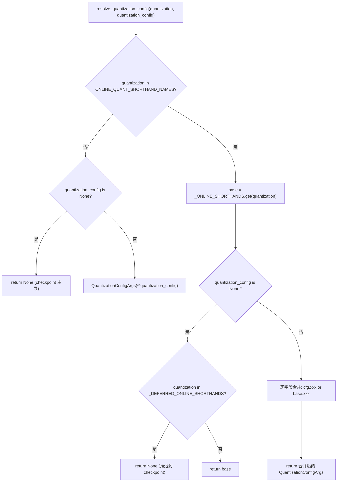
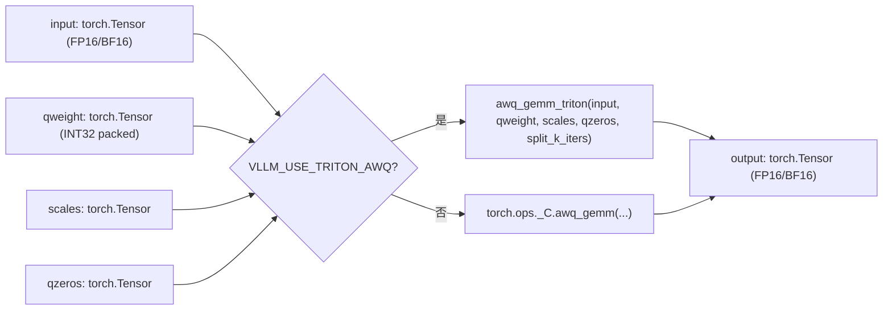
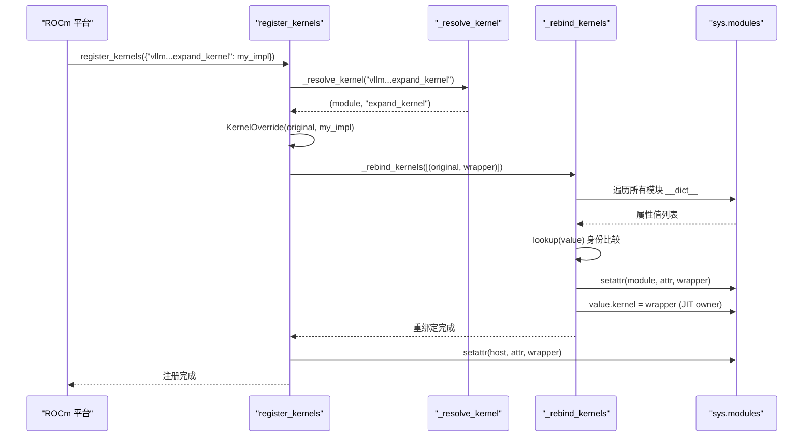

# 第 11 章：量化與自訂核心：從權重載入到高效能算子

上一章我們看到，torch.compile 與 CUDA Graph 把 Python 排程與核心啟動開銷壓到了極致。但排程再快，如果權重本身是 FP16、矩陣乘法走的是通用 GEMM，硬體算力仍然被顯示記憶體頻寬和低效算子拖住。量化與自訂核心是另一條正交的優化主線：前者在權重載入階段就把精度壓下來，後者把量化收益真正兌現為吞吐。本章從量化配置的解析入口出發，一路走到 _custom_ops 的算子註冊與 Triton 核心排程。

# 11.1 量化配置：從 CLI 字串到 QuantKey

## 直覺模型

量化配置模組的角色，像一家餐廳的點菜單翻譯器。使用者在前台說「我要 fp8_per_tensor」（CLI 字串），後廚需要的是精確的配方編號（`QuantKey`）。翻譯器必須處理三種輸入：純 CLI 簡寫、checkpoint 自帶的量化元資料、以及兩者疊加的組合場景。若沒有這層翻譯，後廚會收到一堆含義模糊的字串，無法決定該呼叫哪個 kernel。

## 資料結構與記憶體佈局

核心資料結構是`QuantSpec`與`QuantizationConfigArgs`。前者描述單類層（linear 或 MoE）的權重與啟動量化鍵，後者是使用者可見的頂層配置。

[FACT:vllm/config/quantization.py:73-99]

```python
@config
class QuantSpec:
    weight: QuantKeyField = None
    activation: QuantKeyField = None

    def __str__(self) -> str:
        def quant_key_str(quant_key: QuantKey | None) -> str:
            if quant_key is None:
                return "None"
            return next(
                (
                    name
                    for name, known_quant_key in QUANT_KEY_NAMES.items()
                    if known_quant_key == quant_key
                ),
                str(quant_key),
            )
        return quant_key_str(self.weight)
```

`weight`與`activation`都是可選的`QuantKey`。`None`的語義是「回退到方法類自己的預設值」——通常繼承自 checkpoint，在線量化場景下則意味著不量化[FACT:vllm/config/quantization.py:74-74]。`QuantKey`本身是一個包含`NamedTuple`與`ClassVar[GroupShape]`聲明的複雜型別，pydantic 無法直接內省它，因此作者用`GetPydanticSchema`注入了一個自訂校驗器`_coerce_quant_key`，把字串或`QuantKey`統一歸一化[FACT:vllm/config/quantization.py:60-69]。

`QuantizationConfigArgs`的欄位佈局值得注意[FACT:vllm/config/quantization.py:102-126]：

- `linear` / `moe`：分別作用於`LinearBase`與`FusedMoEFactory`層；
- `ignore`：跳過量化的層名列表，在線量化還支援 fnmatch 通配；
- `targets`：逐層在線量化覆蓋，鍵可以是精確層名、`re:`前綴的正則、或 fnmatch 模式，值與`linear`/`moe`互斥。

`targets`與`linear`/`moe`的互斥由`model_validator`強制[FACT:vllm/config/quantization.py:172-179]。這個約束不是形式主義：`targets`走的是逐層覆蓋路徑，`linear`/`moe`走的是全域預設路徑，兩者同時存在會讓「某層到底用哪個 spec」變得不可判定。

## Step-by-Step：一次`--quantization fp8_per_tensor`的解析

代入場景：使用者在命令列傳入`--quantization fp8_per_tensor`，同時透過`--quantization-config`指定了 MoE 層的激活量化。

第一步，`resolve_quantization_config`被呼叫，參數是 CLI 字串與配置字典[FACT:vllm/config/quantization.py:233-235]。它先檢查`quantization`是否在`ONLINE_QUANT_SHORTHAND_NAMES`中——這個元組包含所有簡寫名加一個`"online"` [FACT:vllm/config/quantization.py:216-222]。

第二步，`fp8_per_tensor`命中簡寫表，`base`被解析為`_ONLINE_SHORTHANDS["fp8_per_tensor"]`，即 linear 與 moe 都用`kFp8StaticTensorSym` [FACT:vllm/config/quantization.py:188-190]。

第三步，`quantization_config`非空，被構造為`QuantizationConfigArgs`物件。隨後進入合併邏輯[FACT:vllm/config/quantization.py:267-268]：每個欄位用`quantization_config.xxx or base.xxx`決定——使用者顯式設置的欄位優先，未設置的繼承簡寫預設值。這裡用`or`而非`if is not None`是有意的：`QuantSpec`和空列表都是 falsy，語義上「未設置」與「空」等價。

第四步，如果`quantization`不在簡寫表中（比如是 checkpoint 自帶的`awq`），且`quantization_config`為`None`，函式直接返回`None` [FACT:vllm/config/quantization.py:256-257]。這表示「不疊加在線量化」，checkpoint 的量化方法保持主導。

有一個容易忽略的分支：`_DEFERRED_ONLINE_SHORTHANDS`包含`mxfp4`與`mxfp8` [FACT:vllm/config/quantization.py:233-235]。這兩個名字既是 CLI 簡寫，又是 checkpoint 量化方法名。當使用者只傳`--quantization mxfp4`而沒有`quantization_config`時，函式返回`None`而非`base` [FACT:vllm/config/quantization.py:267-268]，把決定權推遲給 checkpoint 元資料——只有當 checkpoint 沒有量化資訊時，才回退到在線簡寫。



## 設計思考與踩坑

`_coerce_spec`校驗器處理了一個微妙場景：當`linear`或`moe`收到字串時，先查`_ONLINE_SHORTHANDS`，命中則取出對應欄位的 spec；未命中則當作單個`QuantKey`名處理[FACT:vllm/config/quantization.py:130-139]。這意味著`linear="fp8_per_tensor"`和`linear="fp8_per_tensor_static"`走的是兩條不同路徑——前者是完整配置簡寫，後者是單個量化鍵。如果簡寫中該欄位為`None`（比如`int8_per_channel_weight_only`沒有`linear`欄位），會拋出明確的`ValueError`而非靜默返回`None` [FACT:vllm/config/quantization.py:130-139]。

生產環境的一個常見陷阱：`targets`的正則鍵在`_validate_targets`中被預編譯驗證[FACT:vllm/config/quantization.py:166-167]，但 fnmatch 模式的鍵不做驗證。如果使用者寫了一個永遠匹配不到任何層的 fnmatch 模式，不會報錯，只是該層保持未量化——排查時需要檢查層名是否真的匹配。

# 11.2 `_custom_ops`：算子註冊與 fake 實現

## 直覺模型

`_custom_ops.py`是 vLLM 與底層 CUDA/C++ 算子之間的適配層，像一座海關。PyTorch 的`torch.ops._C`命名空間裡註冊著編譯好的 C++ 算子，但直接呼叫它們有三個問題：不同平台（CUDA/ROCm/CPU/XPU）的算子集不同、`torch.compile`需要 fake 實現來推導輸出形狀、部分算子需要 Python 側的參數預處理。`_custom_ops`把這些問題統一封裝。

## 資料結構與註冊機制

模組載入時首先呼叫`current_platform.import_kernels()` [FACT:vllm/_custom_ops.py:25-26]，讓平台層有機會匯入自己的算子庫。隨後定義`register_fake`——在`TYPE_CHECKING`下是空裝飾器，執行時從`torch.library`匯入[FACT:vllm/_custom_ops.py:25-26]。

fake 實現的核心作用是讓`torch.compile`在追蹤階段知道算子的輸出形狀與 dtype，而不實際執行。以`scaled_fp4_quant`為例：

[FACT:vllm/_custom_ops.py:90-100]

```python
if hasattr(torch.ops, "_C") and hasattr(torch.ops._C, "scaled_fp4_quant"):

    @register_fake("_C::scaled_fp4_quant")
    def _scaled_fp4_quant_fake(
        input: torch.Tensor,
        input_scale: torch.Tensor,
        is_sf_swizzled_layout: bool,
    ) -> tuple[torch.Tensor, torch.Tensor]:
        n = input.shape[-1]
        m = input.numel() // n
        return create_fp4_output_tensors(m, n, input.device, is_sf_swizzled_layout)
```

注意`hasattr`守衛：只有當平台真的註冊了`_C::scaled_fp4_quant`時，fake 實現才被定義。這保證了在 CPU 或舊 GPU 上匯入模組不會因為缺少算子而崩潰。

`create_fp4_output_tensors`展示了 FP4 量化輸出的記憶體佈局細節[FACT:vllm/_custom_ops.py:69-87]。當`is_sf_swizzled_layout=True`時，scale 張量需要按 Tensor Core 要求的 128x4 tile 排布：行數向上取整到 128 的倍數，列數（`n // 16`）向上取整到 4 的倍數，每 4 個 float8_e4m3 打包進一個 int32[FACT:vllm/_custom_ops.py:55-64]。註解明確指出 NVFP4 量化核心會顯式清零所有 padding 的 scale 條目，因此不需要單獨的零初始化 kernel[FACT:vllm/_custom_ops.py:60-61]。

## Step-by-Step：一次 AWQ GEMM 的呼叫流

代入場景：模型載入了一個 AWQ 量化的權重，前向傳播時需要對激活與量化權重做矩陣乘法。

第一步，呼叫`awq_gemm` [FACT:vllm/_custom_ops.py:587-592]。函式首先檢查環境變數`VLLM_USE_TRITON_AWQ`。如果為真，延遲匯入`awq_gemm_triton`並呼叫——這是一條純 Triton 實現路徑，用於不支援 CUDA 算子的平台或除錯場景。

第二步，預設路徑呼叫`torch.ops._C.awq_gemm`，傳入 input、qweight、scales、qzeros 和`split_k_iters` [FACT:vllm/_custom_ops.py:598-598]。

第三步，如果`torch.ops._C.awq_gemm`存在，fake 實作被註冊[FACT:vllm/_custom_ops.py:601-616]。fake 返回的形狀是`(split_k_iters, num_in_feats, qweight.size(1) * 8)`然後`.sum(0)`——這精確模擬了 split-K 的中間結果形狀與歸約後的最終形狀。`qweight.size(1) * 8`來自 AWQ 的打包方式：每個 int32 存 8 個 4-bit 權重。

第四步，`awq_dequantize`走類似路徑[FACT:vllm/_custom_ops.py:553-559]，但 fake 實作的形狀推導不同：`out_c = qout_c * 8`，因為反量化後列數擴展 8 倍[FACT:vllm/_custom_ops.py:587-592]。

Marlin 系列的 repack 函式展示了另一種模式。`gptq_marlin_repack`的 fake 實作計算`pack_factor = 32 // num_bits`，輸出形狀是`(size_k // 16, size_n * 16 // pack_factor)` [FACT:vllm/_custom_ops.py:1103-1119]。這裡的`16`是 Marlin tile size，`size_k // 16`表示 K 維度按 tile 切分。MoE 版本的`gptq_marlin_moe_repack`在 Python 層迴圈每個 expert 呼叫單 expert 的 repack[FACT:vllm/_custom_ops.py:1154-1172]，並斷言`size_k % 16 == 0`——這是 Marlin 格式的硬約束。



## 設計思考與踩坑

fake 實作必須與真實算子的輸出形狀完全一致，否則`torch.compile`追蹤出的圖會在執行時形狀不匹配。`create_fp4_output_tensors`的註解特別強調「Must match the C++ scaled_fp4_quant_func allocation exactly when padded_n is None」[FACT:vllm/_custom_ops.py:69-74]。這是一個容易出錯的點：如果 C++ 側改了分配邏輯而 fake 沒同步，編譯後的圖會在 CUDA Graph 重放時崩潰。

另一個陷阱是`torch.library.custom_op`的別名規則。`safeFusedQuantizeNv`的註解指出，torch 2.12+ 不允許自訂算子的輸出別名任何輸入，因此作者把返回張量改為 in-place 參數[FACT:vllm/_custom_ops.py:4650-4655]。這種「為了繞過框架限制而改變 API 形態」的做法在算子適配層很常見，排查時需要留意`mutates_args`宣告是否與實際行為一致。

`CPUDNNLGEMMHandler`展示了另一種資源管理模式：handler 指標存在一個 int64 tensor 裡，`__del__`時呼叫`release_dnnl_matmul_handler`釋放[FACT:vllm/_custom_ops.py:3708-3717]。把指標存進 tensor 是為了防止被 Python 的整數內聯最佳化掉——這是一個底層綁定的經典技巧。

# 11.3 Triton 核心調度：`KernelOverride`與跨模組重綁定

## 直覺模型

Triton 核心調度器的角色，像一家公司的崗位替身系統。當某個平台（比如 ROCm）需要用自己的實作替換 vLLM 核心裡的 Triton 核心時，不能直接改核心程式碼——那會污染上游。`dispatcher`允許平台註冊一個替身，然後把所有指向原核心的引用悄悄換成替身。若沒有這層機制，每個平台都得維護一份 fork，合併上游變更時衝突不斷。

## 資料結構與記憶體佈局

核心資料結構是`_registry`字典與`KernelOverride`類[FACT:vllm/triton_utils/dispatcher.py:29-36]。

`KernelOverride`的關鍵欄位[FACT:vllm/triton_utils/dispatcher.py:50-61]：

- `_impl`：平台實作函式；
- `arg_names`：鏡像原核心的參數名元組，用於 launch 時的關鍵字綁定；
- `constexprs`：從原核心繼承的 constexpr 宣告；
- `func`：指向實作函式，供 warmup 內省；
- `_forward_by_name`：布林標誌，決定 launch 時按關鍵字還是按位置轉發參數。

`_forward_by_name`的計算邏輯是：比較`inspect.signature(impl).parameters`與原核心的`arg_names`是否完全相等[FACT:vllm/triton_utils/dispatcher.py:50-61]。如果相等，說明實作的參數名與核心一致，可以安全地按關鍵字轉發；否則必須按原核心的參數順序位置轉發。

## Step-by-Step：一次`register_kernels`的重綁定

代入場景：ROCm 平台在初始化時呼叫`register_kernels({"vllm.v1.sample.rejection_sampler.expand_kernel": my_expand_impl})`。

第一步，`register_kernels`遍歷 overrides，對每個名字呼叫`_resolve_kernel` [FACT:vllm/triton_utils/dispatcher.py:162-166]。`_resolve_kernel`把名字按最後一個`.`拆成模組名與屬性名[FACT:vllm/triton_utils/dispatcher.py:83-94]。如果模組名的最後一段首字母大寫，說明核心屬於某個類（JIT warmup owner），需要先匯入父模組再`getattr`拿到類，返回`(类, 属性名)`；否則匯入模組本身，返回`(模块, 属性名)`。

第二步，拿到原核心物件後，構造`KernelOverride`包裝器，並記錄到`_registry` [FACT:vllm/triton_utils/dispatcher.py:167-169]。

第三步，`_rebind_kernels`執行全模組掃描[FACT:vllm/triton_utils/dispatcher.py:97-144]。它遍歷`sys.modules`中所有模組的`__dict__`，對每個屬性值做身份比較——注意是`is`而非`==`，因為某些屬性值（如`PlaceholderModule`哨兵）在 hash/eq 時會觸發匯入或異常[FACT:vllm/triton_utils/dispatcher.py:116-123]。

第四步，對於匹配到原核心的屬性，直接`setattr`替換為 wrapper[FACT:vllm/triton_utils/dispatcher.py:125-135]。對於 JIT warmup owner（實例屬性`kernel`指向原核心的物件），替換`value.kernel`並清除快取的`_kernel_arg_names`，讓 launch 綁定重新從 wrapper 推導[FACT:vllm/triton_utils/dispatcher.py:138-139]。

第五步，`_rebind_kernels`完成後，才把定義處的屬性也替換為 wrapper[FACT:vllm/triton_utils/dispatcher.py:170-174]。註解解釋了順序的重要性：如果先替換定義處，掃描時就找不到原核心了[FACT:vllm/triton_utils/dispatcher.py:170-171]。



## 設計思考與踩坑

`KernelOverride.__getitem__`返回`self._launch`，使得`kernel[grid](**kwargs)`這種 Triton 標準 launch 語法對 wrapper 透明[FACT:vllm/triton_utils/dispatcher.py:63-74]。`_launch`的轉發邏輯分三種情況[FACT:vllm/triton_utils/dispatcher.py:63-74]：有位置參數時直接透傳；`_forward_by_name`為真時按關鍵字轉發；否則檢查 kwargs 中是否有原核心不認識的參數名，有則拋`RuntimeError`，無則按原核心參數順序提取值位置轉發。

這個`RuntimeError`是一個重要的防禦：如果平台實現的參數名與內核不一致，且調用方傳了實現不認識的參數，靜默忽略會導致難以排查的錯誤結果。顯式報錯讓問題在註冊階段就暴露。

一個生產環境的陷阱：`_rebind_kernels`的掃描是 O(模組數 × 屬性數 × 內核數) 的。對於大型模型，`sys.modules`可能有數千個模組，每個模組數百個屬性。雖然只在初始化時執行一次，但如果註冊的內核很多，啟動時間會明顯增加。`lookup`函數用線性掃描而非雜湊查找，註釋解釋了原因——某些屬性值不可雜湊[FACT:vllm/triton_utils/dispatcher.py:116-123]。這是一個典型的「正確性優先於效能」的權衡。

另一個陷阱：`_resolve_kernel`透過「模組名最後一段首字母大寫」來判斷是否是類屬性[FACT:vllm/triton_utils/dispatcher.py:83-94]。如果某個模組名恰好以大寫字母開頭（不符合 Python 命名慣例但語法合法），會被誤判為類。這是一個約定優於配置的設計，依賴 vLLM 內部的命名規範。

# 設計思考

量化配置與算子註冊這兩層機制，共同構成了 vLLM 的「精度-效能」調節面。`QuantizationConfigArgs`的設計體現了「用戶意圖」與「方法預設值」的分離：`None`不是「不量化」，而是「讓方法類自己決定」。這種延遲決策讓同一份配置可以適配 checkpoint 量化和線上量化兩種場景。

`_custom_ops`的 fake 實現模式是`torch.compile`生態的標配，但 vLLM 的獨特之處在於`hasattr`守衛的普遍使用。這讓同一個模組可以在 CUDA、ROCm、CPU、XPU 上匯入而不崩潰，代價是每個算子都需要三處程式碼：Python 包裝、fake 實現、以及平台守衛。

Triton dispatcher 的跨模組重綁定是一個激進的方案。它不依賴 Python 的匯入鉤子或`__getattr__`，而是直接掃描並替換所有引用。這種做法的優點是徹底——無論內核被`from mod import kernel`複製到多少地方，都能被替換；缺點是脆弱——任何持有內核引用的新方式（比如閉包捕獲）都可能逃過掃描。

# 本章小結

# 本章思考與自測

Q1: 在`resolve_quantization_config`中，如果去掉`_DEFERRED_ONLINE_SHORTHANDS`分支（即`quantization in _DEFERRED_ONLINE_SHORTHANDS`時返回`base`而非`None`），在載入一個 checkpoint 自帶`quant_method: "mxfp4"`的模型且用戶只傳`--quantization mxfp4`時會發生什麼？

**參考解析**：`_DEFERRED_ONLINE_SHORTHANDS`的設計意圖是讓 checkpoint 量化方法優先[FACT:vllm/config/quantization.py:233-235]。如果去掉這個分支，`mxfp4`會命中`_ONLINE_SHORTHANDS`並返回`base`（即`QuantSpec(weight=kMxfp4Static)`）[FACT:vllm/config/quantization.py:198-210]。此時線上量化配置會覆蓋 checkpoint 的量化方法，而 checkpoint 的權重是按`mxfp4`格式儲存的——如果線上配置的`kMxfp4Static`與 checkpoint 的實際格式不完全一致（比如 scale 佈局不同），權重載入會失敗或產生錯誤結果。更隱蔽的情況是：checkpoint 的`mxfp4`可能使用了不同的 group size 或 scale dtype，線上配置的預設值與之不匹配，導致推理精度下降但不報錯。

Q2: `KernelOverride._launch`中，如果`_forward_by_name`為`False`且調用方傳入的 kwargs 包含一個原內核不認識的參數名，程式碼會拋出`RuntimeError`。如果把這個檢查去掉，改為靜默忽略未知參數，在什麼場景下會導致難以排查的問題？

**參考解析**：`_forward_by_name`為`False`意味著平台實現的參數名與原內核不一致，必須按位置轉發[FACT:vllm/triton_utils/dispatcher.py:50-61]。如果調用方傳入了一個原內核不認識的參數（比如上游新增了一個可選參數），靜默忽略會導致該參數的值丟失。在 Triton 內核場景下，這通常意味著某個 constexpr 或 grid 維度沒有被傳遞，內核可能用預設值啟動——結果可能是錯誤的計算結果而非崩潰。由於 Triton 內核的錯誤結果往往表現為數值偏差而非異常，排查難度極高。顯式`RuntimeError`讓問題在第一次 launch 時就暴露[FACT:vllm/triton_utils/dispatcher.py:63-74]。

Q3: `_rebind_kernels`在替換 JIT warmup owner 的`kernel`屬性後，會執行`value.__dict__.pop("_kernel_arg_names", None)`。如果去掉這行，在什麼情況下會導致 launch 綁定錯誤？

**參考解析**：JIT warmup owner 快取了`_kernel_arg_names`，用於 launch 時把 kwargs 綁定到內核參數[FACT:vllm/triton_utils/dispatcher.py:138-139]。替換`kernel`為 wrapper 後，wrapper 的`arg_names`可能與原內核不同（如果平台實現的參數名不同，wrapper 的`arg_names`仍然鏡像原內核，但`_forward_by_name`可能為`False`）。如果不清除快取，warmup 機制會繼續用舊的參數名列表做綁定，而 wrapper 的 launch 邏輯可能期望不同的綁定方式。具體來說，`KernelOverride._launch`在`_forward_by_name`為`False`時按`self.arg_names`的順序提取值[FACT:vllm/triton_utils/dispatcher.py:79-80]，如果快取的`_kernel_arg_names`與 wrapper 的`arg_names`不一致，提取出的參數順序會錯亂，導致內核收到錯誤的參數值。

下一章將轉向高級推理特性，看前綴快取如何複用 KV block、投機解碼如何用小模型加速大模型、以及 LoRA 如何在不改基座權重的前提下動態切換適配器。

本章剖析了 vLLM 量化與自訂核心的兩層基礎設施。第一層是量化配置解析：QuantSpec 與 QuantizationConfigArgs 把 CLI 字串、checkpoint 中介資料、逐層覆寫統一正規化為 QuantKey，resolve_quantization_config 處理簡寫展開與欄位合併，_DEFERRED_ONLINE_SHORTHANDS 解決了名稱衝突場景。第二層是算子適配：_custom_ops 透過 hasattr 守衛與 register_fake 實現跨平台算子註冊，fake 實現精確鏡像真實算子的輸出形狀以支援 torch.compile；dispatcher 透過 KernelOverride 與全模組掃描實現 Triton 核心的平台替換。兩者共同支撐了從權重載入到前向計算的量化收益兌現。接下來，我們將轉向提升吞吐與降低延遲的高級推理特性：自動前綴快取如何複用跨請求的 KV，投機解碼如何用草稿模型加速生成，以及 LoRA 如何動態切換適配器。
