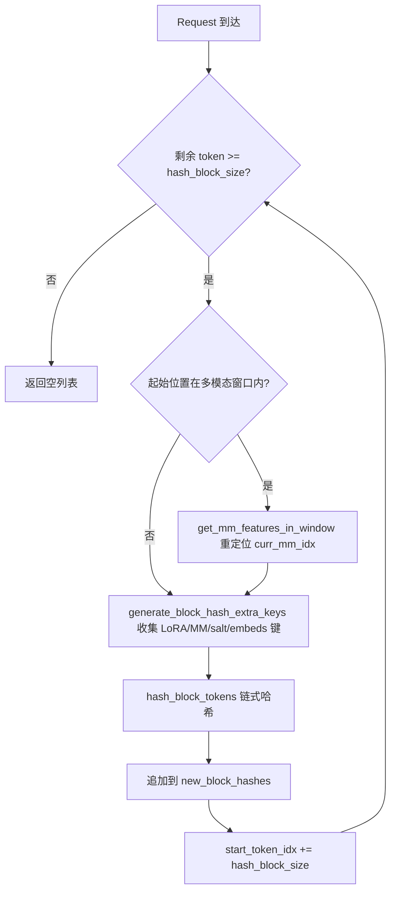
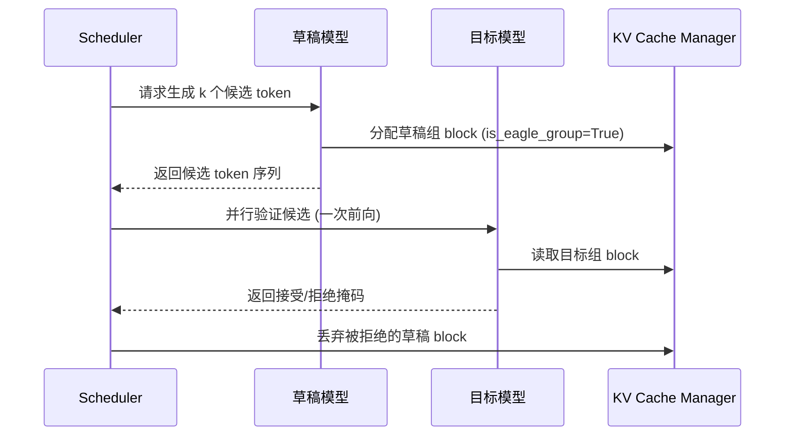

# 第 12 章：高級推理特性：前綴快取、投機解碼與 LoRA

上一章我們深入了 vLLM 的量化體系與自訂算子基礎設施，看到量化配置如何被解析並選擇對應 kernel，以及 FP8、INT4、AWQ、GPTQ 等方案如何在權重載入時完成轉換。同時，我們探明了 _custom_ops 如何註冊 CUDA 算子、Triton 核心的調度機制，以及 MoE 融合核心如何減少顯存往返。這些底層能力為更高級的推理優化鋪平了道路。本章將聚焦 vLLM 的三大高級推理特性：自動前綴快取（APC）、投機解碼與 LoRA。它們看似獨立，實則共享同一套底層基礎設施——KV block 的雜湊、調度器的 slot 分配、以及模型執行時的動態權重注入。理解它們的關鍵，是理解它們如何在不破壞 PagedAttention 分頁語義的前提下，把「複用」這件事做到極致。

# 12.1 前綴快取：block hash 如何指紋化一段前綴

## 直覺模型

前綴快取就像圖書館的「公共段落摘抄本」：兩個學生寫作文，開頭都引用同一段古文，老師只需要批改一次這段古文，後面各自不同的部分再分別看。若沒有它，每個請求都要從頭 prefill 整段 prompt，長文檔問答場景下算力被重複消耗數倍。

## 資料結構：從 token 到 block hash 的映射

前綴快取的核心是「如何判斷兩個請求的前綴相同」。vLLM 的答案是：把 token 序列按 block 切分，對每個 block 計算一個鏈式雜湊。鏈式意味著第 N 個 block 的雜湊包含了前 N-1 個 block 的雜湊，因此一個 block hash 唯一指紋化了「從序列開頭到該 block 末尾」的整段前綴。

雜湊的載體是`BlockHash`，它被定義為`bytes`的`NewType`，而非裸`bytes`，目的是在類型層面防止誤用[FACT:vllm/v1/core/kv_cache_utils.py:59-62]。當需要把 block hash 與 KV cache group id 組合成字典鍵時，vLLM 沒有用元組，而是把 4 位元組大端 group id 直接拼接到 hash 位元組尾部[FACT:vllm/v1/core/kv_cache_utils.py:75-76]：

```python
def make_block_hash_with_group_id(block_hash, group_id):
    return BlockHashWithGroupId(block_hash + group_id.to_bytes(4, "big", signed=False))
```

> **[Design Inference & Architectural Trade-offs]**
> 這是一個典型的「避免元組分配」優化：在熱路徑上，每個 block 的查找都要構造鍵，元組會帶來額外的 Python 物件分配與雜湊開銷，而位元組串拼接在 C 層完成，且位元組串本身就是可雜湊的。取回時用切片`key[:-4]`和`int.from_bytes(key[-4:])`還原[FACT:vllm/v1/core/kv_cache_utils.py:87-89]。

雜湊函數本身由`hash_block_tokens`承擔，它把父 block hash、當前 block 的 token id 元組、以及額外鍵一起餵給雜湊函數[FACT:vllm/v1/core/kv_cache_utils.py:650-680]。注意第一個 block 的父雜湊不是`None`，而是全局的`NONE_HASH`：

```python
if not parent_block_hash:
    parent_block_hash = NONE_HASH
```

[FACT:vllm/v1/core/kv_cache_utils.py:674-675]。`NONE_HASH`的種子選擇藏著一個安全設計：對 SHA-256 這類密碼學雜湊，種子是固定的`"vllm-none-hash"`，使得不同 vLLM 進程對相同內容算出相同雜湊，從而跨節點共享前綴快取；而對 xxhash 這類非密碼學雜湊，種子是每進程隨機的，因為可預測的種子會讓攻擊者離線預計算碰撞 block[FACT:vllm/v1/core/kv_cache_utils.py:105-126]。`resolve_none_hash_seed`實現了這個分叉：`PYTHONHASHSEED`環境變數優先，否則密碼學雜湊用固定種子、非密碼學雜湊用`os.urandom(32)` [FACT:vllm/v1/core/kv_cache_utils.py:132-145]。

## 場景驅動：一次請求的 block hash 計算

假設一個請求帶著 128 個 token 進入，block size 為 16。`get_request_block_hasher`返回的閉包負責增量計算[FACT:vllm/v1/core/kv_cache_utils.py:802-861]：

第一步，確定從哪裡開始算。`start_token_idx = len(request.block_hashes) * hash_block_size` [FACT:vllm/v1/core/kv_cache_utils.py:812-812]，即已算過的 block 數乘以 block 大小。若剩餘 token 不足一個 block，直接返回空[FACT:vllm/v1/core/kv_cache_utils.py:812-812]。

第二步，處理多模態偏移。如果起始位置落在某個多模態輸入內部，需要用`get_mm_features_in_window`重新定位`curr_mm_idx` [FACT:vllm/v1/core/kv_cache_utils.py:823-832]。這是因為多模態輸入的 placeholder token 本身不攜帶語意，必須把 mm 特徵標識符和它在 block 內的偏移作為額外鍵摻入雜湊。

第三步，迴圈計算每個 block。`generate_block_hash_extra_keys`收集所有額外鍵[FACT:vllm/v1/core/kv_cache_utils.py:611-647]，包括 LoRA 名、多模態鍵、cache salt、prompt embeds 雜湊。其中 cache salt 只在第一個 block 生效[FACT:vllm/v1/core/kv_cache_utils.py:633-635]，這是有意為之：salt 的作用是隔離整個快取命名空間，只需在鏈的起點注入一次。

第四步，`hash_block_tokens`把父雜湊、token 元組、額外鍵一起雜湊，結果作為下一個 block 的父雜湊[FACT:vllm/v1/core/kv_cache_utils.py:851-857]。鏈式結構由此形成。

## 多 block size 的粒度轉換

當模型有多個 KV cache group 且 block size 不同時，雜湊粒度與 group 的 block 粒度可能不一致。`BlockHashListWithBlockSize`解決這個問題：它不重新計算雜湊，而是利用鏈式雜湊的性質——一個 target block 的雜湊，就是它內部最後一個 hash block 的雜湊[FACT:vllm/v1/core/kv_cache_utils.py:2781-2851]。例如 hash block 為 16、target block 為 32 時，token 0-31 的雜湊就是第二個 16-size 雜湊（它已經鏈式覆蓋了 0-31）[FACT:vllm/v1/core/kv_cache_utils.py:2794-2806]。`_get_value_at`的實現就是`self.block_hashes[(idx + 1) * self.scale_factor - 1]` [FACT:vllm/v1/core/kv_cache_utils.py:2848-2851]。



## 設計思考與踩坑

**為什麼用鏈式雜湊而非獨立雜湊？**獨立雜湊無法區分「相同 block 出現在不同前綴位置」的情況。鏈式雜湊讓 block hash 唯一指紋化整段前綴，這正是`find_longest_cache_hit`能安全復用 KV 的前提。

**非密碼學雜湊的跨進程陷阱。**若使用 xxhash 且未設`PYTHONHASHSEED`，每個進程的`NONE_HASH`不同，導致跨實例前綴快取完全失效。`init_none_hash`會列印警告[FACT:vllm/v1/core/kv_cache_utils.py:161-169]。生產環境若部署多實例共享快取，必須顯式設定`PYTHONHASHSEED`或改用 sha256。

**多模態偏移的微妙之處。** `_gen_mm_extra_hash_keys`把`(mm_identifier, offset - start_token_idx)`作為額外鍵[FACT:vllm/v1/core/kv_cache_utils.py:552]。偏移是相對 block 起點的，這樣同一個 mm 項出現在不同 block 位置時雜湊不同，避免誤命中。

# 12.2 投機解碼：草稿與驗證的協同

## 直覺模型

投機解碼像秘書先替領導起草幾版回覆，領導只需快速圈定哪版可用。草稿模型（drafter）用極低成本預測多個候選 token，目標模型（target）一次前向並行驗證這些候選，接受匹配的部分。若沒有它，目標模型只能逐 token 串行生成，GPU 利用率在 decode 階段極低。

## 資料結構：EAGLE group 的標註

投機解碼在 KV cache 管理上的核心問題是：草稿模型的 KV 層與目標模型的 KV 層如何分組？`_annotate_eagle_groups`用兩條規則識別草稿組[FACT:vllm/v1/core/kv_cache_utils.py:2134-2189]：

規則一是 spec 驅動：`non_causal_multi_token_decode`標誌位聲明在`MLAAttentionSpec`上，由運行非因果多 token decode 的草稿注意力層設置，且能存活過`merge`操作[FACT:vllm/v1/core/kv_cache_utils.py:2175-2177]。

規則二是位置回退：MTP 草稿器（如 DeepseekV4/V4.1 DSpark）復用目標模型自己的 decoder 層，spec 上無標記，但它們的草稿注意力層總是在所有目標層之後註冊，因此標註持有最後註冊層的那個 group[FACT:vllm/v1/core/kv_cache_utils.py:2183-2184]。這個規則只在 group 恰好劃分了`kv_cache_spec`所有層時才生效[FACT:vllm/v1/core/kv_cache_utils.py:2183-2184]。

## 場景驅動：投機解碼的 KV 分配

當`speculative_config`啟用且`use_eagle_block_drop()`為真時，`_annotate_eagle_groups`被調用[FACT:vllm/v1/core/kv_cache_utils.py:2175-2177]。標註結果`is_eagle_group`影響後續的 block 分配策略——草稿組的 block 可以在驗證後被丟棄。

在`get_kv_cache_groups`的主路徑中，標註發生在分組之後[FACT:vllm/v1/core/kv_cache_utils.py:2364-2365]。若沒有任何 group 被標註為草稿組，`_warn_if_unannotated_eagle_mamba`會發出警告[FACT:vllm/v1/core/kv_cache_utils.py:2192-2222]。



## 設計思考與踩坑

**為什麼草稿組需要單獨標註？**草稿模型生成的 token 在驗證後可能被拒絕，對應的 KV 需要丟棄。若草稿 KV 與目標 KV 混在同一 group，丟棄操作會誤傷目標 KV。標註讓調度器能精確回收。

**位置回退規則的脆弱性。**規則二依賴「草稿層最後註冊」這一約定，註釋中明確標註這是 hacky check 並留了 FIXME[FACT:vllm/v1/core/kv_cache_utils.py:2158-2159]。當草稿的尾部快取跨多個 group 時，該規則只標註持有最後一層的 group，需要泛化。

**Mamba 模型的額外約束。**若啟用投機解碼但無 group 被識別為草稿組，且存在 Mamba group，會觸發警告[FACT:vllm/v1/core/kv_cache_utils.py:2211-2213]。這通常意味著草稿層的 spec 與目標層無法區分，需要檢查模型註冊順序。

# 12.3 LoRA：不重載基座的動態適配器

## 直覺模型

LoRA 像給同一台手機換不同的手機殼：手機本體（基座模型）不變，換個殼（適配器）就變成不同風格。若沒有它，每個微調任務都要載入一份完整權重，顯存無法承受。

## 資料結構：雙 LRU 快取與 slot 陣列

`LoRAModelManager`用兩個 LRU 快取管理適配器生命週期[FACT:vllm/lora/model_manager.py:115-120]：

```python
self._registered_adapters: AdapterLRUCache[LoRAModel] = AdapterLRUCache(
    self.capacity, self.deactivate_adapter
)
self._active_adapters: AdapterLRUCache[None] = AdapterLRUCache(
    self.lora_slots, self._deactivate_adapter
)
```

`capacity`是 CPU 側能快取的適配器總數（`max_cpu_loras`）[FACT:vllm/lora/model_manager.py:340-342]，`lora_slots`是 GPU 側能同時啟用的適配器數（`max_loras`）[FACT:vllm/lora/model_manager.py:345-346]。`_registered_adapters`被移除時會觸發`deactivate_adapter`回呼[FACT:vllm/lora/model_manager.py:71-74]，確保 CPU 快取淘汰時 GPU 上的副本也被清理。

`lora_index_to_id`是一個長度為`lora_slots`的陣列，把 GPU slot 索引映射到適配器 id[FACT:vllm/lora/model_manager.py:122]。這個陣列是 punica wrapper 做批量 LoRA 計算時的核心索引。

## 場景驅動：適配器啟用

當請求攜帶 LoRA 適配器進入時，`activate_adapter`被呼叫[FACT:vllm/lora/model_manager.py:352-409]：

第一步，檢查是否已啟用，若是則直接返回[FACT:vllm/lora/model_manager.py:352-354]。

第二步，尋找空閒 slot。遍歷`lora_index_to_id`找到第一個`None` [FACT:vllm/lora/model_manager.py:362-362]。若無空閒 slot，拋出`ValueError("No free lora slots")` [FACT:vllm/lora/model_manager.py:368-368]。

第三步，更新狀態並遍歷所有已包裝模組，呼叫`module.set_lora(index, lora_a, lora_b)`把權重拷貝到 GPU 的 stacked buffer[FACT:vllm/lora/model_manager.py:377-401]。若某模組沒有對應 LoRA 權重，呼叫`reset_lora(index)`清零[FACT:vllm/lora/model_manager.py:378-385]。

第四步，若沒有任何權重被應用，列印一次性除錯日誌[FACT:vllm/lora/model_manager.py:411-416]。這在流水線並行或專家並行下是預期行為——某些 rank 不持有被適配的層。

## 模組包裝：從 nn.Linear 到 BaseLayerWithLoRA

`_create_lora_modules`遍歷模型所有命名模組[FACT:vllm/lora/model_manager.py:462-606]。關鍵邏輯：

- 跳過`PPMissingLayer` [FACT:vllm/lora/model_manager.py:473-474]。
- 根據`target_modules`過濾：若未指定則用`is_supported_lora_module`判斷，否則用`_match_target_modules` [FACT:vllm/lora/model_manager.py:479-493]。
- 處理別名模組：同一個底層模組可能透過多個路徑被存取（如 MoE gate 既在 block 上又在 runner 內）。此時把別名屬性重定向到同一個 wrapper，但不重複註冊，否則`activate_adapter`會對別名呼叫`reset_lora`清掉剛設置的權重[FACT:vllm/lora/model_manager.py:512-527]。
- 用`from_layer`建立 wrapper 並替換原模組[FACT:vllm/lora/model_manager.py:546-553]。

## 設計思考與踩坑

**slot 佈局變化觸發映射更新。** `set_adapter_mapping`不僅比較 mapping 是否變化，還比較`lora_index_to_id`的元組快照[FACT:vllm/lora/model_manager.py:1323-1331]。原因註釋說得很清楚：一次帶外的`add_lora()`可能觸發 LRU 淘汰並重新分配 slot，而執行中的 batch 及其 mapping 沒變[FACT:vllm/lora/model_manager.py:1323-1331]。若只看 mapping，punica metadata 會用過期的 slot 佈局。

**MoE 的 EP 切片。**當啟用專家並行時，checkpoint 持有所有全域專家的權重，但每個 rank 只擁有`local_num_experts`個。`_stack_moe_lora_weights`先按`global_num_experts`reshape，再切片`[expert_start:expert_end]` [FACT:vllm/lora/model_manager.py:966-977]。非 EP 時切片是 no-op。

**pin_memory 的時機。**權重打包（如`pack_moe`）可能使 pin_memory 分配失效，因此 pin_memory 在所有權重合併之後執行[FACT:vllm/lora/model_manager.py:916-934]。註釋明確指出兩個原因：MoE 模型 LoRA 權重數量龐大，過早 pin 開銷顯著；打包可能使分配失效[FACT:vllm/lora/model_manager.py:916-921]。

# 設計思考：三者的協同點

三個特性在 KV cache 管理層交匯。前綴快取透過 block hash 複用 KV；投機解碼透過`is_eagle_group`標註區分草稿 KV；LoRA 透過`_gen_lora_extra_hash_keys`把適配器名摻入 block hash[FACT:vllm/v1/core/kv_cache_utils.py:568-581]，確保不同適配器的相同 token 序列不會誤命中彼此的 KV。

`generate_block_hash_extra_keys`把 LoRA 鍵放在額外鍵列表的最前面[FACT:vllm/v1/core/kv_cache_utils.py:640-642]，與多模態鍵、cache salt、prompt embeds 鍵共同構成完整的雜湊輸入。這保證了：即使兩個請求的 token 完全相同，只要 LoRA 適配器不同，它們的 block hash 就不同，KV 不會串用。

# 本章小結

# 本章思考與自測

Q1: 若把`init_none_hash`中非密碼學雜湊的隨機種子邏輯去掉，改為始終使用固定種子，在什麼場景下會引入安全風險？為什麼原始碼註釋特別強調 xxhash 需要保密種子？

**參考解析**：原始碼在`_NON_CRYPTO_HASH_FUNCTIONS`中明確把 xxhash 和 xxhash_cbor 列為非碰撞 resistant 的演算法[FACT:vllm/v1/core/kv_cache_utils.py:125-126]。`resolve_none_hash_seed`對這類演算法返回`os.urandom(32).hex()` [FACT:vllm/v1/core/kv_cache_utils.py:143-144]。若改為固定種子，攻擊者可以離線預計算與目標前綴碰撞的 block，構造出雜湊相同但內容不同的請求，從而命中並讀取他人的 KV cache——這是跨請求的資訊洩露。SHA-256 的碰撞 resistant 不依賴種子保密，所以固定種子只影響可重現性不影響安全性[FACT:vllm/v1/core/kv_cache_utils.py:97-111]。

Q2: `_create_lora_modules`中處理別名模組時，若去掉「不重複註冊」的邏輯，直接對別名也呼叫`register_module`，在`activate_adapter`時會發生什麼？請結合`reset_lora`的呼叫路徑分析。

**參考解析**：`activate_adapter`遍歷`self.modules`並對每個模組呼叫`set_lora`或`reset_lora` [FACT:vllm/lora/model_manager.py:377-401]。若別名和規範名都註冊，同一個底層 wrapper 會被存取兩次。規範名路徑下`_get_lora_layer_weights`能找到權重並呼叫`set_lora`寫入；別名路徑下由於名稱不匹配，`_get_lora_layer_weights`回傳 None，觸發`reset_lora(index)` [FACT:vllm/lora/model_manager.py:378-385]，把剛寫入的權重清零。原始碼註解明確指出了這個陷阱[FACT:vllm/lora/model_manager.py:519-523]。正確做法是把別名屬性重定向到同一個 wrapper 但不重複註冊[FACT:vllm/lora/model_manager.py:531-537]。

Q3: `BlockHashListWithBlockSize`依賴「target block 的雜湊等於其內部最後一個 hash block 的雜湊」這一性質。若雜湊函式不是鏈式的（即每個 block 獨立雜湊），這個類還能正確工作嗎？在什麼情況下會產生錯誤的快取命中？

**參考解析**：不能。`_get_value_at`直接回傳`self.block_hashes[(idx + 1) * self.scale_factor - 1]` [FACT:vllm/v1/core/kv_cache_utils.py:2848-2851]，這個實作的前提是最後一個 hash block 的雜湊已經鏈式覆蓋了它之前的所有 token。若雜湊是獨立的，這個值只指紋化了最後一個 hash block 的內容，而非整個 target block。兩個 target block 可能前半部分不同但最後一個 hash block 相同，導致雜湊碰撞，`find_longest_cache_hit`會錯誤地複用不匹配的 KV。原始碼註解明確說明「Each hash_block_size hash is already chained over its entire prefix」[FACT:vllm/v1/core/kv_cache_utils.py:2787-2792]。

下一章將轉向外掛系統與可擴充性，看 vLLM 如何透過平台抽象、IO 處理器與端點擴充支援多樣化的部署形態。

本章剖析了 vLLM 三大進階推理特性的底層機制。前綴快取的核心是鏈式 block hash：hash_block_tokens 把父雜湊、token 元組、額外鍵一起雜湊，NONE_HASH 的種子策略在跨行程共享與碰撞安全之間權衡。投機解碼透過 is_eagle_group 標註區分草稿 KV 組。LoRA 透過雙 LRU 快取與 slot 陣列管理適配器生命週期，並在 block hash 中摻入適配器名實現快取隔離。這些特性共同展現了 vLLM 在推理優化上的深度與靈活性。接下來，我們將轉向 vLLM 的外掛系統與可擴充性，看平台外掛如何適配新硬體，IO processor 外掛如何介入多模態輸入處理，以及端點外掛如何注入自訂 API 路由。理解外掛註冊與發現的載入順序，將揭示如何在不修改核心程式碼的前提下擴充 vLLM 的能力。
