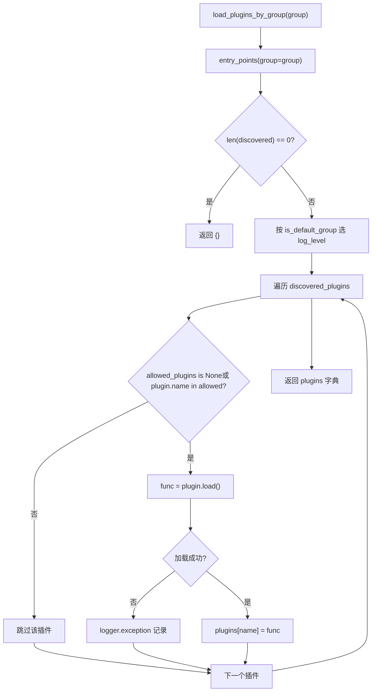
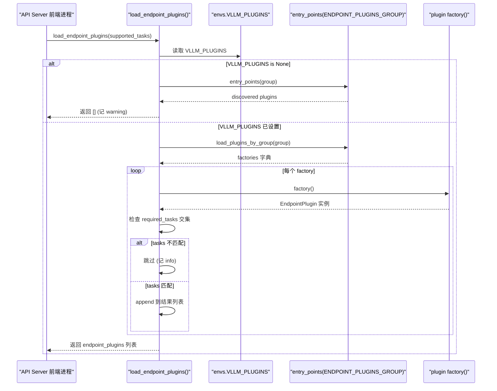

# 第 13 章：外掛系統與可擴充性：平台、IO 處理器與端點擴充

上一章我們看到，前綴快取、投機解碼與 LoRA 這些進階特性都深度耦合在排程器、KV 管理與模型執行的核心路徑中。但一個推理引擎要真正走向生產，光有性能還不夠——它必須回答一個更棘手的問題：當社群想接入一塊新硬體、一種新的多模態輸入格式、或一條自訂 HTTP 路由時，如何在不 fork 核心程式碼的前提下完成？這正是外掛系統存在的意義。vLLM 的架構天然是多行程的：API Server 前端行程、EngineCore 行程、以及每個 TP/PP rank 對應的 Worker 行程。如果外掛機制只是簡單地「在 import 時執行一段程式碼」，那麼它要么在每個行程裡重複執行導致副作用疊加，要么只在主行程執行導致 Worker 拿不到擴充。本章要拆解的，就是 vLLM 如何用 Python 標準的 entry_points 機制，配合分組（group）+ 行程邊界 + 載入時機三重約束，構建出一套既能覆蓋所有行程、又能精確控制暴露面的外掛體系。我們聚焦三條主線：平台外掛（適配新硬體）、IO processor 外掛（介入多模態輸入處理）、端點外掛（注入自訂 API 路由）。三者的載入策略截然不同，理解這種差異，就理解了 vLLM 對「擴充能力」與「安全邊界」的權衡哲學。

# 一、外掛發現與載入：entry_points 的分組契約

## 直覺模型：外掛的「廣播頻道」

把 vLLM 的外掛系統想像成一組廣播頻道。每個外掛套件在安裝時，透過`setup.py`的`entry_points`向某個頻道「註冊」自己的呼號（plugin name）和回應函式（plugin value）。vLLM 在啟動時掃描這些頻道，決定哪些頻道在哪些行程裡被「收聽」。

若沒有這套機制，擴展 vLLM 只能靠改原始碼——社群每加一塊硬體就要維護一個 fork，最終版本分裂。分組機制的價值在於：**同一個外掛套件可以只註冊到某個特定頻道，從而被限定在特定行程載入**。

## 資料結構：五個分組常數與全域旗標位

vLLM 在`vllm/plugins/__init__.py`頂部定義了五個 entry point group 常數，每個常數對應一個載入策略：

[FACT:vllm/plugins/__init__.py:16-30]

```python
DEFAULT_PLUGINS_GROUP = "vllm.general_plugins"
IO_PROCESSOR_PLUGINS_GROUP = "vllm.io_processor_plugins"
PLATFORM_PLUGINS_GROUP = "vllm.platform_plugins"
STAT_LOGGER_PLUGINS_GROUP = "vllm.stat_logger_plugins"
ENDPOINT_PLUGINS_GROUP = "vllm.endpoint_plugins"
```

註解裡藏著關鍵資訊：`DEFAULT_PLUGINS_GROUP`在**所有行程**載入（process0、engine core、worker）；`IO_PROCESSOR_PLUGINS_GROUP` **只在 process0**；`PLATFORM_PLUGINS_GROUP`在所有行程載入，但觸發時機是`current_platform`首次被存取時；`STAT_LOGGER_PLUGINS_GROUP`只在 process0 且非同步模式下；`ENDPOINT_PLUGINS_GROUP`只在 API Server 前端行程。

緊接著是一個模組級全域變數`plugins_loaded = False` [FACT:vllm/plugins/__init__.py:32-33]，它是冪等載入的守衛——註解明確寫著「make sure one process only loads plugins once」。

## Step-by-Step：一次`load_plugins_by_group`的完整呼叫流

代入場景：使用者在`setup.py`裡註冊了`vllm.general_plugins`下的`register_dummy_model`，現在 vLLM 啟動，某個行程呼叫`load_general_plugins()`。

**第一步：冪等守衛。** `load_general_plugins`先檢查`plugins_loaded`，若已為`True`直接回傳[FACT:vllm/plugins/__init__.py:77-90]。注意這裡有個微妙之處：守衛在載入**之前**就置位，意味著即使後續載入拋異常，也不會重試。這是刻意的——外掛載入失敗不應導致行程反覆嘗試。

**第二步：發現。**進入`load_plugins_by_group`，透過`importlib.metadata.entry_points(group=group)`拿到該分組下所有已安裝的 entry points[FACT:vllm/plugins/__init__.py:36-45]。若為空，記 debug 日誌後回傳空字典。

**第三步：日誌分級。**原始碼區分了預設分組與非預設分組的日誌級別：`is_default_group`為真時用`logger.debug`，否則用`logger.info` [FACT:vllm/plugins/__init__.py:47-54]。動機很實際——`vllm.general_plugins`下通常掛著大量模型註冊外掛，用 INFO 會刷屏；而平台/端點外掛數量少且重要，值得 INFO 可見。

**第四步：白名單過濾。**讀取`envs.VLLM_PLUGINS`，若為`None`則載入全部，否則只載入名字在列表中的外掛[FACT:vllm/plugins/__init__.py:62-70]。注意`plugin.load()`被包在 try/except 裡，單個外掛載入失敗只記 exception 日誌，不影響其他外掛[FACT:vllm/plugins/__init__.py:68-72]。

**第五步：執行。**回到`load_general_plugins`，對每個載入到的函式直接呼叫`func()` [FACT:vllm/plugins/__init__.py:77-90]。這就是為什麼文件強調外掛函式必須**可重入（re-entrant）**——它可能在多個行程中被多次呼叫。

下面這張流程圖刻畫了`load_plugins_by_group`的完整決策路徑：



## 設計思考：為什麼用 entry_points 而非設定檔

> **[Design Inference & Architectural Trade-offs]**
> 選擇`entry_points`而非自訂設定檔，核心動機是**讓外掛隨 Python 套件一起散佈**。使用者`pip install vllm-add-dummy-platform`後，外掛自動出現在對應分組中，無需手動編輯 vLLM 的設定。這與 pytest、flake8 等工具的外掛生態一脈相承。代價是外掛發現依賴套件的中繼資料，若外掛套件安裝不完整（如只複製了原始碼目錄而沒走 pip），entry_points 就掃不到。

---

# 二、平台外掛：硬體適配的抽象層

## 直覺模型：平台是「硬體方言翻譯官」

`Platform`類是整個 vLLM 與硬體對話的**唯一翻譯官**。模型程式碼只呼叫`current_platform.get_attn_backend_cls()`、`current_platform.is_cuda_alike()`這類抽象方法，從不直接`import torch.cuda`。若沒有這層抽象，每支援一塊新硬體就要在模型程式碼裡加`if device == "xpu"`的分支，最終變成義大利麵。

## 資料結構：Platform 基類的欄位佈局

`Platform`是一個純類（非實例化使用），關鍵類別屬性定義在`vllm/platforms/interface.py`開頭[FACT:vllm/platforms/interface.py:135-179]：

```python
class Platform:
    _enum: PlatformEnum
    device_name: str
    device_type: str
    dispatch_key: str = "CPU"
    ray_device_key: str = ""
    device_control_env_var: str = "VLLM_DEVICE_CONTROL_ENV_VAR_PLACEHOLDER"
    ray_noset_device_env_vars: list[str] = []
    simple_compile_backend: str = "inductor"
    dist_backend: str = ""
    supported_quantization: list[str] = []
    additional_env_vars: list[str] = []
    _global_graph_pool: Any | None = None
```

`_enum`是`PlatformEnum`列舉值，決定`is_cuda()`、`is_rocm()`等判定[FACT:vllm/platforms/interface.py:69-78]。`device_control_env_var`是平台無關的「裝置可見性環境變數」抽象——CUDA 是`CUDA_VISIBLE_DEVICES`，其他平台各自定義[FACT:vllm/platforms/interface.py:151-152]。`_global_graph_pool`是類別級別的 CUDA graph 記憶體池快取，透過`get_global_graph_pool`惰性初始化[FACT:vllm/platforms/interface.py:1210-1215]。

值得注意的是`__getattr__`的兜底邏輯[FACT:vllm/platforms/interface.py:1189-1208]：當存取 Platform 上不存在的屬性時，它會嘗試從`torch.<device_type>`命名空間轉發。這允許平台程式碼寫`current_platform.memory_allocated()`而實際呼叫`torch.cuda.memory_allocated()`。但原始碼特意排除了 dunder 方法——否則 pickle 檢查`__getstate__`時會拿到`None`並試圖呼叫它[FACT:vllm/platforms/interface.py:1182-1185]。

## Step-by-Step：裝置 ID 的三命名空間轉換

平台抽象中最容易踩坑的是**裝置 ID 命名空間**。原始碼註解明確列出三種[FACT:vllm/platforms/interface.py:275-283]：

- **logical**：vLLM 內部的 local rank，索引`_assigned_physical_gpu_ids`
- **visible**：當前行程經`CUDA_VISIBLE_DEVICES`重映射後的 torch/CUDA 序號
- **physical**：NVML 等拓撲 API 使用的全域 GPU ID，不受環境變數影響

代入場景：一個 Worker 行程被分配了實體 GPU`[4, 5]`，環境變數`CUDA_VISIBLE_DEVICES=4,5`，現在需要把 local rank 0 轉成`torch.device("cuda:0")`。

**第一步：logical → physical。** `device_id_to_physical_device_id(0)`先查`_assigned_physical_gpu_ids`，若已設定則直接索引回傳`4` [FACT:vllm/platforms/interface.py:296-297]。若未設定，則從`device_control_env_var`拆分逗號列表取第 0 項[FACT:vllm/platforms/interface.py:305-311]。注意原始碼特意把**空字串**當作未設定處理——這是 Ray 在純 CPU placement group 上啟動引擎時的合法配置[FACT:vllm/platforms/interface.py:296-297]。

**第二步：physical → visible。** `logical_device_id_to_visible_device_id(0)`拿到 physical`4`後，再把環境變數拆成`[4, 5]`，找到`4`的索引`0`返回[FACT:vllm/platforms/interface.py:316-339]。若 physical ID 不在可見列表中，拋`RuntimeError`——這是防止跨進程誤用不可見設備的硬防護。

`set_assigned_physical_gpu_ids`的冪等設計也值得注意：重複設置相同值是無操作，設置不同值則拋`RuntimeError` [FACT:vllm/platforms/interface.py:38-56]。這防止了多線程環境下設備映射被意外覆蓋。

## 平台插件的註冊與配置注入

平台插件透過`vllm.platform_plugins`分組註冊，插件函數返回平台類的全限定名（或`None`表示當前環境不支援）[FACT:docs/design/plugin_system.md:50-50]。文檔給出的最小實現要求[FACT:docs/design/plugin_system.md:100-100]：

- `_enum`通常設為`PlatformEnum.OOT`（out-of-tree）
- `device_type`返回 PyTorch 認識的設備類型字串
- `check_and_update_config`在 vLLM 初始化早期被調用，**必須在此設置`worker_cls`**
- `get_attn_backend_cls`返回注意力後端類名
- `get_device_communicator_cls`返回通信器類名

`check_and_update_config`是平台插件最關鍵的鉤子[FACT:vllm/platforms/interface.py:583-592]。它接收`VllmConfig`引用並原地修改，可以調整 block size、graph mode 等。文檔強調「最重要的是 worker_cls 必須在此設置」[FACT:docs/design/plugin_system.md:105-105]——因為 vLLM 需要知道用哪個 Worker 類來實例化工作進程。

## 設計思考：block size 對齊的三階段策略

平台接口中最複雜的邏輯是`update_block_size_for_backend` [FACT:vllm/platforms/interface.py:666-708]。它分三階段確保 block size 與注意力後端兼容：

**Phase 1**：若用戶未顯式指定`--block-size`，調用`_preferred_block_size_for_backends`選出所有後端都支持的最小 block size[FACT:vllm/platforms/interface.py:687-697]。這個函數用 LCM（最小公倍數）枚舉候選值，因為某些後端（如 CPU_MLA）只接受精確尺寸而非倍數[FACT:vllm/platforms/interface.py:622-663]。

**Phase 2**：混合模型（attention + mamba）需對齊 block 與 mamba page size[FACT:vllm/platforms/interface.py:699-702]。

**Phase 3**：多種 KV dtype 共享 block pool 時（如 nvfp4 主 + 未量化 skip 層），需把主 block 撐大到能覆蓋最大的 padded spec page[FACT:vllm/platforms/interface.py:704-708]。

> **[Design Inference & Architectural Trade-offs]**
> 這種分階段設計反映了 vLLM 面對的現實：不同硬件、不同量化方案、不同模型架構對 block size 的約束互相衝突，無法用單一公式解決。分階段讓每個約束獨立處理，最後取滿足所有約束的解。

---

# 三、IO Processor 與端點插件：輸入處理與 API 擴展

## 直覺模型：IO Processor 是「多模態翻譯層」

多模態模型（如 LLaVA）的輸入不是純文本，而是文本 + 圖像的混合體。IO Processor 插件負責把原始多模態數據轉換成模型能吃的張量，再把模型輸出轉回人類可讀格式。它像海關的翻譯官：進來的外語（圖像/音頻）翻譯成模型母語，出去的模型母語翻譯回外語。

## Step-by-Step：IO Processor 的發現與實例化

代入場景：加載一個帶`io_processor_plugin`字段的 HF config 的模型。

**第一步：確定插件名。** `get_io_processor`優先使用顯式傳入的`plugin_from_init`，否則從`hf_config`的`io_processor_plugin`字段讀取[FACT:vllm/plugins/io_processors/__init__.py:42-50]。若兩者都為空，返回`None`——表示該模型不需要 IO processor[FACT:vllm/plugins/io_processors/__init__.py:52-54]。

**第二步：加載所有已安裝插件。**調用`load_plugins_by_group(IO_PROCESSOR_PLUGINS_GROUP)`拿到該分組下所有插件[FACT:vllm/plugins/io_processors/__init__.py:59-61]。

**第三步：構建可加載映射。**遍歷每個插件，調用其函數拿到`processor_cls_qualname`，若非`None`則記入`loadable_plugins` [FACT:vllm/plugins/io_processors/__init__.py:66-76]。注意這裡每個插件的函數調用也被 try/except 包裹，單個失敗不影響其他。

**第四步：校驗與實例化。**若可加載插件數為 0，拋`ValueError`提示「需要 IOProcessor 插件但一個都沒裝」[FACT:vllm/plugins/io_processors/__init__.py:66-76]。若模型要求的插件名不在可加載列表中，拋`ValueError`並列出所有可用插件名[FACT:vllm/plugins/io_processors/__init__.py:80-81]。最後透過`resolve_obj_by_qualname`解析類名並實例化[FACT:vllm/plugins/io_processors/__init__.py:80-81]。

## 端點插件：默認拒絕的安全姿態

端點插件是本章最特殊的一類，因為它**默認不加載**。`load_endpoint_plugins`的文檔字串明確解釋了原因：端點插件會向 API Server 添加 HTTP 路由，擴大了網絡暴露面，因此採取比`load_plugins_by_group`更嚴格的「默認拒絕」姿態[FACT:vllm/plugins/__init__.py:93-94]。

具體規則是：只有當插件名**顯式出現在`VLLM_PLUGINS`中**，且其`required_tasks`為`None`或與服務器支持的 tasks 有交集時，才被加載[FACT:vllm/plugins/__init__.py:108-108]。

代入場景：用戶安裝了端點插件但忘了設`VLLM_PLUGINS`。

**第一步：檢查 VLLM_PLUGINS 是否未設。**若`envs.VLLM_PLUGINS is None`，先發現該分組下的插件，若有則記 warning 提示「必須顯式 allowlist」[FACT:vllm/plugins/__init__.py:126-126]。注意源碼註釋特別指出：`VLLM_PLUGINS=""`解析為`[""]`而非`None`，因此被視為「匹配不到任何插件的 allowlist」，而非「未設置」[FACT:vllm/plugins/__init__.py:108-108]。這個邊界區分很重要——空字串是顯式的「什麼都不加載」，而`None`是「未配置」。

**第二步：加載並實例化。**透過`load_plugins_by_group`拿到工廠函數後，逐個調用`factory()`實例化[FACT:vllm/plugins/__init__.py:133-141]。實例化失敗記 exception 並 continue。

**第三步：task 門控。**檢查`plugin.required_tasks`，若不為`None`且與`supported_tasks`無交集，跳過該外掛[FACT:vllm/plugins/__init__.py:144-145]。這允許同一個外掛套件針對不同任務（如 embedding vs generation）註冊不同端點。

下面這張時序圖刻畫了端點外掛從發現到載入的完整互動：



## 設計思考：行程邊界決定載入策略

三類外掛的載入策略差異，本質是**行程邊界**的映射：

| 外掛類型 | 載入行程 | 預設行為 | 動機 |
| --- | --- | --- | --- |
| general | 所有行程 | 全部載入 | 模型註冊需在每個 Worker 可見 |
| platform | 所有行程 | 全部載入 | 硬體抽象被所有行程依賴 |
| io_processor | 僅 process0 | 全部載入 | 輸入處理只在前端發生 |
| stat_logger | 僅 process0（非同步） | 全部載入 | 日誌只在主行程收集 |
| endpoint | 僅 API Server | **預設拒絕** | 擴大網路暴露面，需顯式授權 |

> **[Design Inference & Architectural Trade-offs]**
> 端點外掛的「預設拒絕」是安全工程的標準做法：任何擴大攻擊面的擴展都應 opt-in。而其他外掛預設載入，是因為它們不直接暴露網路介面，且社群生態需要低摩擦的接入體驗。

## 生產踩坑：外掛載入失敗的靜默降級

`load_plugins_by_group`對每個外掛的`plugin.load()`用 try/except 包裹，失敗只記 exception[FACT:vllm/plugins/__init__.py:68-72]。這意味著**一個損壞的外掛不會阻止 vLLM 啟動**，但也不會給出顯式錯誤——使用者可能困惑於「為什麼我的外掛沒生效」。

排查建議：把日誌級別調到 DEBUG，搜尋`"Failed to load plugin"`。若外掛在`vllm.general_plugins`分組下，預設日誌級別是 DEBUG，需要顯式開啟才能看到載入詳情[FACT:vllm/plugins/__init__.py:49-50]。

另一個坑是`plugins_loaded`守衛的置位時機[FACT:vllm/plugins/__init__.py:77-90]：它在載入前就置`True`。若首次載入因某種原因失敗（如 entry_points 掃描異常），後續呼叫會直接返回而不重試。這在測試環境中可能導致「外掛時好時壞」的詭異現象。

---

# 本章小結

vLLM 的外掛系統建立在 Python`entry_points`之上，透過**五個分組常數**劃分擴展類型，透過**行程邊界**決定載入範圍，透過**`VLLM_PLUGINS`白名單**控制載入集合。平台外掛用`Platform`基類抽象硬體差異，其裝置 ID 三命名空間轉換（logical/visible/physical）是跨行程裝置管理的核心；IO processor 外掛透過 HF config 的`io_processor_plugin`欄位觸發，負責多模態輸入的翻譯；端點外掛採取「預設拒絕」姿態，只有顯式 allowlist 且 task 匹配時才載入，以控制網路暴露面。

三條主線共享同一套發現機制，但載入策略的差異體現了 vLLM 對「擴展便利性」與「安全邊界」的權衡：不暴露網路的外掛預設載入，暴露網路的外掛必須 opt-in。

# 本章思考與自測

Q1: 若把`load_plugins_by_group`中`plugin.load()`的 try/except 去掉，讓載入失敗直接拋出，會對 vLLM 的多行程啟動產生什麼影響？在什麼場景下這反而是更好的設計？

> **[Design Inference & Architectural Trade-offs]**
> **參考解析**：當前實現[FACT:vllm/plugins/__init__.py:68-72]讓單個外掛載入失敗被靜默吞掉，只記 exception 日誌。若去掉 try/except，載入失敗會向上傳播到`load_general_plugins`，進而中斷行程啟動。在多行程場景下，這會導致：若某個 Worker 行程的外掛載入失敗，整個引擎無法啟動——這可能是好事（快速失敗，避免部分行程帶病運行導致狀態不一致），也可能是壞事（一個可選外掛的 bug 拖垮整個服務）。 更好的設計可能是引入`VLLM_PLUGINS_STRICT`環境變數：預設寬鬆（當前行為），嚴格模式下載入失敗即拋異常。這樣生產環境可以要求「所有聲明的外掛必須成功載入」，而開發環境保持容錯。

Q2: `load_endpoint_plugins`中，`VLLM_PLUGINS=""`與`VLLM_PLUGINS`未設置（`None`）的行為差異是什麼？原始碼為什麼要特意區分這兩種情況？

> **[Design Inference & Architectural Trade-offs]**
> **參考解析**：原始碼註釋明確指出`VLLM_PLUGINS=""`解析為`[""]`而非`None`，因此被視為「匹配不到任何外掛的 allowlist」[FACT:vllm/plugins/__init__.py:108-108]。當`VLLM_PLUGINS is None`時，`load_endpoint_plugins`直接返回`[]`並記 warning[FACT:vllm/plugins/__init__.py:126-126]；而當`VLLM_PLUGINS=""`時，程式碼會繼續走到`load_plugins_by_group`，但由於空字串不匹配任何外掛名，最終也返回空列表。兩者的**結果相同**（都不載入端點外掛），但**語義不同**：`None`表示「使用者未配置，我們主動拒絕並警告」，`""`表示「使用者顯式配置了空 allowlist，我們尊重其意圖不警告」。 這種區分讓維運可以透過設置空字串來「靜默停用所有端點外掛」，而不必忍受每次啟動的 warning 噪音。

Q3: `device_id_to_physical_device_id`中，為什麼原始碼把空的`device_control_env_var`當作未設置處理[FACT:vllm/platforms/interface.py:302-308]？若去掉這個空字串檢查，在 Ray 的 CPU-only placement group 場景下會發生什麼？

**參考解析**：原始碼註釋解釋，空的環境變數是 Ray 在 GPU 節點上啟動 CPU-only placement group 時的合法配置[FACT:vllm/platforms/interface.py:296-297]。若去掉`!= ""`檢查，程式碼會進入`device_ids = "".split(",")`分支，得到`[""]`，然後`device_ids[device_id]`返回空字串，最終`int("")`拋`ValueError`。這會導致引擎在合法的 Ray 配置下啟動失敗。保留檢查後，空環境變數走`else`分支直接返回`device_id`，即假設 logical ID 等於 physical ID——這在 CPU-only 場景下是安全的，因為沒有 GPU 需要映射。這個案例說明：環境變數的「未設定」與「設定為空」在分散式編排系統中語意不同，程式碼必須顯式處理。

---

下一章將轉向架構權衡、生產踩坑與未來演進，我們會把前十三章拆解過的機制放在一起，審視 vLLM 在效能、可維護性與擴展性之間的取捨，並展望推理引擎的演進方向。

至此，我們已經看清 vLLM 如何透過 entry_points 的分組機制、行程邊界感知的載入時機，以及平台、IO processor、端點三類外掛的差異化策略，在保持核心程式碼穩定的同時打開擴展面。這套外掛體系讓新硬體、新輸入格式和新 API 路由都能以非侵入方式接入，但擴展性本身也意味著更多需要權衡的維度。下一章將收束全書，系統梳理 vLLM 關鍵設計決策中的張力——連續批次處理與顯存碎片、CUDA Graph 與動態形狀、分離式部署與網路開銷——並給出一份生產環境踩坑清單與診斷路徑，同時展望 Rust 前端、IR 層與異構硬體方向的演進趨勢。
