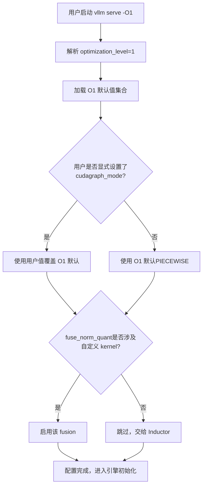
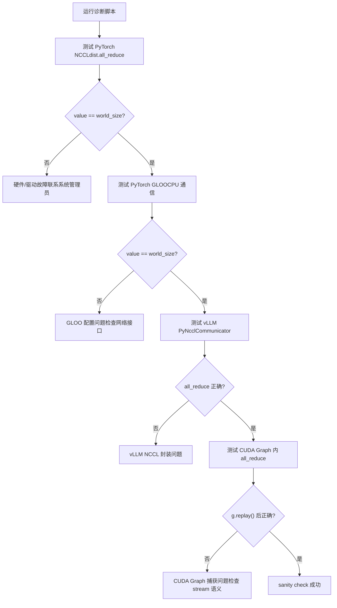
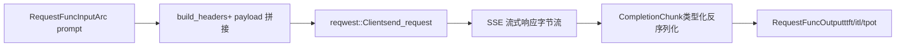

# 第 14 章：架構權衡、生產踩坑與未來演進

上一章我們拆解了 vLLM 的外掛化擴展機制，看到平台外掛、IO processor 外掛和端點外掛如何在不修改核心程式碼的前提下，讓引擎適配新硬體、新模態和新 API。這種可擴展性讓 vLLM 能夠快速擁抱變化，但擴展點越多，生產環境中的互動路徑就越複雜。當顯存碎片化、NCCL 握手失敗、編譯快取失效、網路抖動這些真實問題同時出現時，前十三章介紹的機制會彼此拉扯，暴露出理想環境下不曾顯現的張力。本章不再引入新的核心機制，而是把這些機制放在一起，以官方 troubleshooting 文件為錨點，結合 Rust 前端 bench 工具的設計，審視效能與可運維性之間的取捨，並給出一份可操作的診斷路徑。

# 一、優化等級：啟動時間與執行效能的顯式契約

## 直覺模型

優化等級就像相機的「場景模式」：自動檔（`-O2`）適合大多數場景，但當你需要快速抓拍（除錯）時，切到手動檔（`-O0`）能立刻響應，代價是畫質（效能）下降。vLLM 把這種取捨做成了顯式的四檔契約，而不是藏在幾十個布林 flag 裡讓使用者自己拼。

## 四檔的欄位佈局

vLLM 提供`-O0`到`-O3`四個等級[FACT:docs/design/optimization_levels.md:5-5]。核心設計原則是：**使用者顯式設定的 flag 優先於優化等級的預設值** [FACT:docs/design/optimization_levels.md:5-5]。這意味著優化等級只是一組預設值的集合，不是硬性約束。

`-O0`關閉一切：無 autotuning、無編譯、無 cudagraph[FACT:docs/design/optimization_levels.md:32-33]。具體落到四個開關：`cudagraph_mode=NONE`、`mode=NONE`、所有 fusion 關閉、`enable_flashinfer_autotune=False` [FACT:docs/design/optimization_levels.md:37-40]。

`-O1`是開發場景的平衡點：啟用`PIECEWISE`cudagraph 和`VLLM_COMPILE`模式[FACT:docs/design/optimization_levels.md:50-51]。注意這裡有個精妙的細節：`fuse_norm_quant`和`fuse_act_quant`只在其中一個算子使用自訂 kernel 時才啟用，否則 Inductor 的自動融合效果更好[FACT:docs/design/optimization_levels.md:61]。這是一個典型的「不要和編譯器搶活幹」的設計判斷。

`-O2`是預設值，面向生產[FACT:docs/design/optimization_levels.md:66-67]。它在`-O1`基礎上追加`FULL_AND_PIECEWISE`cudagraph 和`fuse_allreduce_rms` [FACT:docs/design/optimization_levels.md:72-73]。`-O3`當前等同於`-O2`，為未來更激進的實驗性優化預留[FACT:docs/design/optimization_levels.md:80-81]。

## 場景驅動的選擇流程

當一個使用者執行`vllm serve model -O1`時，內部發生了什麼？下面的流程圖展示了優化等級如何與使用者 flag 互動：

這個流程的關鍵在於`check_user`分支：使用者顯式設定永遠優先[FACT:docs/design/optimization_levels.md:5-5]。這避免了「優化等級悄悄覆蓋了我的除錯 flag」這類難以排查的問題。

## 設計思考與踩坑

優化等級最常見的生產陷阱是**啟動時間過長**。文件明確建議：啟動時間過長時用`-O0`或`-O1` [FACT:docs/design/optimization_levels.md:87]。但這裡有個隱性代價——`-O0`下沒有 cudagraph，每個 kernel 的 CPU 發射開銷會暴露出來，在高併發場景下吞吐可能下降數倍。

另一個陷阱是**編譯錯誤**。`-O2`的`FULL_AND_PIECEWISE`cudagraph 對模型結構有更強的假設，某些自訂模型在`-O2`下編譯失敗但在`-O1`下正常。文件建議用`debug_dump_path`獲取更多除錯資訊[FACT:docs/design/optimization_levels.md:88]。排查路徑應該是：先用`-O0`確認功能正確，再逐步升到`-O1`、`-O2`，定位是哪一檔引入的問題。

> **[Design Inference & Architectural Trade-offs]**
> 這種「分級降級」的排查思路，本質上和 CUDA Graph 的`--enforce-eager`是同一套方法論：先用最保守的配置確認正確性，再逐步啟用優化，把問題隔離到最小的配置差異上。

---

# 二、生產踩坑清單：從症狀到根因的診斷路徑

## 直覺模型

生產環境的故障排查就像急診分診：你不能對所有病人做全套檢查，必須先根據症狀（OOM、hang、崩潰）快速縮小範圍，再針對性深挖。vLLM 的 troubleshooting 文件本質上就是一份分診手冊。

## 症狀分類與診斷工具

文件把常見問題分成幾大類，我們按診斷難度遞進梳理。

**第一類：模型下載/載入掛起。**症狀是啟動後長時間無回應。根因通常是網路慢或共享檔案系統慢[FACT:docs/usage/troubleshooting.md:11-11]。診斷手段是`--load-format dummy`跳過權重載入，隔離出到底是下載慢還是載入慢[FACT:docs/usage/troubleshooting.md:23-23]。這是一個典型的「二分法隔離」技巧。

**第二類：顯存 OOM。**文件直接指向 conserving_memory 配置文件[FACT:docs/usage/troubleshooting.md:23]。但生產中的 OOM 往往不是模型太大，而是 KV cache 碎片或並行請求數超預期。

**第三類：生成品質變化。**這是一個容易被忽視的坑。v0.8.0 改變了預設取樣參數的來源：從 vLLM 的中性預設值改為模型作者的`generation_config.json` [FACT:docs/usage/troubleshooting.md:23-23]。大多數情況下這提升了品質，但某些模型的配置反而更差[FACT:docs/usage/troubleshooting.md:23-23]。診斷方法是回退到`--generation-config vllm`對比[FACT:docs/usage/troubleshooting.md:23-23]。

**第四類：卡死（hang）。**這是最難診斷的一類。文件給出了一組遞進的除錯環境變數[FACT:docs/usage/troubleshooting.md:41-41]：

- `VLLM_LOGGING_LEVEL=DEBUG`：打開詳細日誌
- `VLLM_LOG_STATS_INTERVAL=1.`：高頻輸出佇列和快取命中狀態
- `CUDA_LAUNCH_BLOCKING=1`：定位是哪個 CUDA kernel 出問題
- `NCCL_DEBUG=TRACE`：打開 NCCL 詳細日誌
- `VLLM_TRACE_FUNCTION=1`：記錄所有函式呼叫，但會拖慢 100 倍以上[FACT:docs/usage/troubleshooting.md:41]

這裡有個重要的運維紀律：除錯完必須關閉這些環境變數，或直接開新 shell，否則殘留的除錯配置會持續拖慢系統[FACT:docs/usage/troubleshooting.md:11-11]。

## 斷點除錯的行程邊界陷阱

vLLM 的多行程架構讓常規`pdb`斷點失效——斷點如果在子行程中執行，會拋出`BdbQuit` [FACT:docs/usage/troubleshooting.md:45-54]。兩種解法：用`forked-pdb` [FACT:docs/usage/troubleshooting.md:57-61]，或設定`VLLM_ENABLE_V1_MULTIPROCESSING=0`把排程器留在同行程[FACT:docs/usage/troubleshooting.md:63-68]。

> **[Design Inference & Architectural Trade-offs]**
> 第二種方法雖然方便，但會改變執行模型——單行程模式下 EngineCore 和 API Server 不再透過佇列通訊，某些並行 bug 可能無法重現。所以它適合定位邏輯錯誤，不適合重現並行問題。

## 分散式通訊的診斷

分散式部署有專門的診斷文件。核心建議是：**在叢集建立時設定環境變數**，因為變數會傳播到所有節點；而在 shell 中設定只影響本地節點[FACT:docs/serving/distributed_troubleshooting.md:16-16]。

一個高頻問題是`No available node types can fulfill resource request`，即使叢集有足夠 GPU 也會出現[FACT:docs/serving/distributed_troubleshooting.md:16-16]。根因通常是節點有多個 IP，vLLM 選錯了。解法是用`VLLM_HOST_IP`顯式指定，並用`ray status`驗證[FACT:docs/serving/distributed_troubleshooting.md:16-16]。

## NCCL 初始化失敗的診斷腳本

文件提供了一個完整的診斷腳本，逐層驗證通訊堆疊[FACT:docs/usage/troubleshooting.md:89-150]。它的設計很有層次：

這個腳本的精妙之處在於它逐層隔離：先驗證最底層的 PyTorch NCCL，再驗證 CPU 側的 GLOO，再驗證 vLLM 自己的 PyNcclCommunicator 封裝，最後驗證 CUDA Graph 內的通訊[FACT:docs/usage/troubleshooting.md:90-146]。每一層失敗都指向不同的根因。

腳本中一個值得注意的細節：`pynccl.disabled = False`是為了向後相容 0.6.4 及以下版本[FACT:docs/usage/troubleshooting.md:121-125]。0.6.5+ 預設啟用，但保留這行程式碼讓讀最新文件的用戶不會困惑。

多節點測試時，文件特意用`--rdzv_backend=static`而非`c10d`，因為`c10d`在多節點下會因 DNS 解析失敗[FACT:docs/usage/troubleshooting.md:168-168]。這是一個典型的「踩過坑才知道」的配置。

## 設計思考與踩坑

**NCCL 初始化失敗**（`ncclCommInitRank`報 unhandled system error）通常指向兩個根因：缺少`IPC_LOCK`capability 或`/dev/shm`未掛載[FACT:docs/usage/troubleshooting.md:311-311]。這兩個都是容器化部署的經典陷阱。

**CUDA PTX 工具鏈不匹配**（`the provided PTX was compiled with an unsupported toolchain`）說明 wheel 裡的 PTX 是用更高版本的 CUDA toolkit 編譯的[FACT:docs/usage/troubleshooting.md:325-327]。解法是啟用 CUDA forward compatibility：Docker 下加`-e VLLM_ENABLE_CUDA_COMPATIBILITY=1` [FACT:docs/usage/troubleshooting.md:325-327]，裸機下裝`cuda-compat`套件並設定`VLLM_CUDA_COMPATIBILITY_PATH` [FACT:docs/usage/troubleshooting.md:325-327]。

**已知的 NCCL 記憶體開銷問題**：vLLM `>= 0.4.3, <= 0.10.1.1`會設定`NCCL_CUMEM_ENABLE=0`來規避 NCCL bug，外部行程連接 vLLM 時也必須設定這個變數，否則會 hang 或崩潰[FACT:docs/usage/troubleshooting.md:375]。NCCL 2.22.3 修復後，新版本移除了這個覆蓋以允許效能優化[FACT:docs/usage/troubleshooting.md:375]。這個案例說明：**跨行程的環境變數契約是分散式系統的隱性依賴**，升級時必須同步。

---

# 三、Rust 前端：bench 工具的零拷貝設計哲學

## 直覺模型

如果說 Python 前端是「功能完備但笨重」的瑞士軍刀，Rust bench 工具就是「只為壓測而生」的手術刀。它的設計目標不是功能覆蓋，而是在高並行下把客戶端自身的開銷壓到最低，讓測出來的數字真實反映伺服器端效能。

## 資料結構與記憶體佈局

bench 工具的核心資料結構是`RequestFuncInput` [FACT:rust/src/bench/src/backends/mod.rs:59-89]。它大量使用`Arc<str>`和`Arc<[u32]>`而非`String`/`Vec`，這是零拷貝設計的核心。

看幾個關鍵欄位：`prompt: Arc<str>` [FACT:rust/src/bench/src/backends/mod.rs:50-52]——多個並發請求可以共享同一個 prompt 字串，避免每個請求都克隆一份。`prompt_token_ids: Option<Arc<[u32]>>` [FACT:rust/src/bench/src/backends/mod.rs:77]——預計算的 token ID 直接發給服務端，跳過服務端 tokenization[FACT:rust/src/bench/src/backends/mod.rs:74-76]。

最精妙的是`multi_modal_content: Option<Arc<[Arc<str>]>>` [FACT:rust/src/bench/src/backends/mod.rs:81]。註解解釋：多模態內容作為預序列化的 JSON 片段，chat backend 直接拼接進 payload 位元組流，避免任何解析或深拷貝 base64 圖像資料[FACT:rust/src/bench/src/backends/mod.rs:78-80]。這是一個雙層`Arc`結構：外層`Arc<[...]>`共享整個陣列，內層`Arc<str>`共享單個片段。

`chat_messages_json: Option<Arc<str>>`優先級最高，直接原樣拼進 payload[FACT:rust/src/bench/src/backends/mod.rs:82-85]。

## 零分配反序列化

SSE 流式回應的解析是另一個效能關鍵點。註解明確指出：使用型別化反序列化避免構建完整的`serde_json::Value`樹，只提取需要的欄位[FACT:rust/src/bench/src/backends/mod.rs:20-24]。

`CompletionChunk`只保留`choices`和`usage`兩個欄位[FACT:rust/src/bench/src/backends/mod.rs:20-24]，`ChatChunk`同理[FACT:rust/src/bench/src/backends/mod.rs:33-37]。`#[serde(default)]`讓缺失的`choices`欄位預設為空陣列[FACT:rust/src/bench/src/backends/mod.rs:20-24]，這是流式回應的常見情況。

## 場景驅動的請求流程

當一個壓測請求發出時，資料如何流轉？下面的資料流圖展示了從輸入到輸出的轉換：

`Backend`列舉用靜態分發避免 async trait object 的問題[FACT:rust/src/bench/src/backends/mod.rs:150-154]。`send_request`透過`match`分發到具體實作[FACT:rust/src/bench/src/backends/mod.rs:158-168]。`get_backend`根據`BackendKind`返回對應後端[FACT:rust/src/bench/src/backends/mod.rs:172-181]。

一個細節：`API_KEY`用`OnceLock`快取，避免每個請求都做一次環境變數 syscall[FACT:rust/src/bench/src/backends/mod.rs:186-188]。`build_headers`依次插入 Content-Type、Authorization、extra headers、request-id[FACT:rust/src/bench/src/backends/mod.rs:191-215]。

## 設計思考與踩坑

> **[Design Inference & Architectural Trade-offs]**
> Rust bench 工具的零拷貝設計反映了一個重要判斷：**壓測工具的客戶端開銷會成為測量誤差的來源**。如果每個請求都克隆 prompt、解析完整 JSON、深拷貝 base64 圖像，那麼測出來的延遲裡就混入了客戶端開銷，無法真實反映服務端效能。用`Arc`共享不可變資料、用型別化反序列化跳過無關欄位，本質上是把客戶端開銷壓到接近零。

`RequestFuncOutput`的欄位設計也值得注意：`ttft`（time to first token）、`itl`（inter-token latency 陣列）、`tpot`（time per output token）[FACT:rust/src/bench/src/backends/mod.rs:93-105]。這三個指標分別對應不同的效能維度：TTFT 反映 prefill 和排隊延遲，ITL 反映 decode 的穩定性，TPOT 反映整體吞吐。壓測時如果只看平均延遲，會掩蓋 ITL 的抖動。

---

# 設計思考：架構權衡的底層邏輯

把本章和前面十三章的機制放在一起，能看到 vLLM 的幾條核心權衡線。

> **[Design Inference & Architectural Trade-offs]**
> **連續批次處理 vs 顯存碎片。**連續批次處理讓批次每步重組，吞吐大幅提升，但代價是 KV cache 的分配和釋放極其頻繁。PagedAttention 的塊表機制正是為了應對這種高頻分配——固定大小的 block 消除了外部碎片，但引入了塊表的間接尋址開銷和內部碎片（最後一個 block 可能未填滿）。 這是一個典型的「用間接層換碎片率」的權衡，和作業系統的虛擬記憶體分頁是同一思路。

**CUDA Graph vs 動態形狀。**CUDA Graph 要求靜態形狀，但連續批次處理的批次大小每步都在變。vLLM 的解法是`PIECEWISE`和`FULL_AND_PIECEWISE`模式[FACT:docs/design/optimization_levels.md:50,72]——把可靜態化的部分捕獲成圖，動態部分保持 eager。`-O0`完全關閉 cudagraph 是為了除錯，`-O2`全開是為了生產，中間的`-O1`是折中。

**分離式部署 vs 網路開銷。**KV Connector 讓 prefill 和 decode 可以分離到不同實例，但 KV cache 的跨實例傳輸引入了網路延遲。文件中 GPUDirect RDMA 的配置要求（`IPC_LOCK`、`/dev/shm`）[FACT:docs/usage/troubleshooting.md:311-311]說明這條路徑對基礎設施有硬性要求。網路抖動會導致 KV 傳輸超時，進而觸發重試或降級。

**可運維性 vs 效能。**優化等級、除錯環境變數、診斷腳本，這些都是為可運維性付出的成本。`VLLM_TRACE_FUNCTION=1`會拖慢 100 倍[FACT:docs/usage/troubleshooting.md:41]，但它是定位 hang 問題的最後手段。一個成熟的引擎必須提供這些「慢但能看清」的工具。

---

# 本章小結

本章收束全書，把前十三章的機制放在生產視角下重新審視。

優化等級（`-O0`到`-O3`）是啟動時間與執行效能的顯式契約，使用者 flag 永遠優先於等級預設值[FACT:docs/design/optimization_levels.md:5-5]。生產踩坑清單涵蓋了從模型載入、顯存 OOM、生成品質變化到分散式通訊失敗的完整診斷路徑，核心方法論是「二分法隔離」和「逐層驗證」。Rust bench 工具用`Arc`共享和型別化反序列化把客戶端開銷壓到接近零，確保壓測數字真實反映服務端效能。

三條核心權衡線貫穿全書：連續批次處理與顯存碎片、CUDA Graph 與動態形狀、分離式部署與網路開銷。理解這些張力，比記住任何單個機制都重要——因為生產環境的每一次調優，本質上都是在這些張力之間找平衡點。

# 本章思考與自測

Q1: 若把`-O2`的`FULL_AND_PIECEWISE`cudagraph 改為`-O1`的`PIECEWISE`，在什麼場景下會觸發效能回退？為什麼？

**參考解析**：`-O2`在`-O1`基礎上追加`FULL_AND_PIECEWISE`cudagraph 模式[FACT:docs/design/optimization_levels.md:72]。`FULL`模式會把整個前向傳播捕獲成一張圖，而`PIECEWISE`只捕獲可靜態化的片段。在批次形狀穩定的生產場景下，`FULL`模式能消除更多 kernel 發射開銷，吞吐更高。但如果模型包含動態控制流（如 MoE 的 token 路由），`FULL`模式可能無法捕獲或捕獲後行為異常，此時`PIECEWISE`反而更穩。效能回退會出現在：批次大小頻繁變化導致`FULL`圖無法命中、或模型結構觸發了`FULL`模式的 fallback 路徑。排查方法是先用`-O1`確認基線，再升到`-O2`對比，用`VLLM_LOG_STATS_INTERVAL=1.`觀察佇列狀態[FACT:docs/usage/troubleshooting.md:41-41]。

Q2: 診斷腳本中，為什麼在測試 vLLM PyNcclCommunicator 之前要先測 PyTorch GLOO？如果跳過 GLOO 測試直接測 PyNccl 會漏掉什麼？

**參考解析**：腳本的執行順序是 PyTorch NCCL → PyTorch GLOO → vLLM PyNccl → CUDA Graph[FACT:docs/usage/troubleshooting.md:90-146]。GLOO 測試的是 CPU 側通訊[FACT:docs/usage/troubleshooting.md:106-112]，而 vLLM 的`PyNcclCommunicator`需要一個 GLOO group 作為 bootstrap[FACT:docs/usage/troubleshooting.md:120]。如果跳過 GLOO 測試，當 PyNccl 初始化失敗時，你無法區分是 NCCL 本身的問題還是 GLOO bootstrap 的問題。GLOO 依賴網路介面配置（`GLOO_SOCKET_IFNAME`）[FACT:docs/usage/troubleshooting.md:81-81]，在複雜網路環境下這是高頻故障點。逐層測試的價值在於把故障隔離到最小的配置差異上。

Q3: Rust bench 工具用`Arc<str>`共享 prompt，如果壓測場景需要每個請求發送不同的 prompt，這個設計是否失效？為什麼？

**參考解析**：`Arc<str>`的設計目標是讓多個並發請求共享同一個不可變字串[FACT:rust/src/bench/src/backends/mod.rs:50-52]。如果每個請求的 prompt 都不同，`Arc`的共享優勢確實消失——每個請求需要構造自己的`Arc<str>`。但設計並未失效：`Arc<str>`相比`String`仍然避免了在請求流轉過程中的多次複製（如從輸入佇列傳到 backend 再傳到 payload 構建）。真正的零拷貝優化在於`prompt_token_ids: Option<Arc<[u32]>>` [FACT:rust/src/bench/src/backends/mod.rs:77]——即使 prompt 文字不同，預計算的 token ID 陣列仍可透過`Arc`在請求生命週期內共享，避免重複分配。壓測工具的設計假設是「同一 prompt 高並發」或「預計算 token ID」，前者用`Arc<str>`共享文字，後者用`Arc<[u32]>`共享 token 序列。

---

至此，全書十四章的原始碼解讀告一段落。我們從一次 API 呼叫出發，穿過排程器、KV cache 管理器、注意力後端、分散式通訊層，最終抵達 GPU kernel 的發射點，又回到生產運維的診斷台。vLLM 的每一個設計決策背後都有明確的權衡，理解這些權衡，才能在面對新的硬體、新的模型、新的負載時，做出正確的工程判斷。推理引擎的演進不會停止——Rust 前端、IR 層、異構硬體支援都在快速推進——但底層的權衡邏輯是穩定的，這正是本書希望傳遞的核心能力。

至此，我們走完了從請求入口到 GPU Kernel 的完整旅程，也看清了生產環境中那些讓系統從「能跑」變成「跑得穩」的權衡與踩坑。vLLM 的演進不會止步於當前架構，更高效的注意力實現、更智慧的排程策略、更無縫的異構支援都在路上。但無論未來如何變化，理解這些機制之間的張力與取捨，始終是駕馭推理引擎的關鍵。
