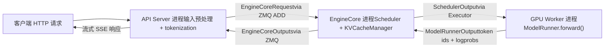
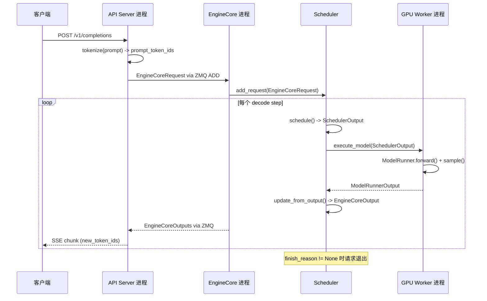

# 第 1 章：vLLM 设计哲学与宏观架构：高吞吐大模型推理引擎

假设你手头有一张 A100，想用 LLaMA-7B 对外提供在线推理服务。最朴素的做法是：来一个请求，跑一次 model.generate()，返回结果。这个方案在并发量上来后会立刻崩溃——不是因为 GPU 算力不够，而是因为两件事：第一，显存被碎片吃掉。自回归生成需要缓存每一层的 Key/Value 张量（KV Cache）。如果每个请求都按 max_model_len 预分配一整块连续显存，一个 4096 token 的请求就要占掉几十 MB，而实际生成的序列可能只有 200 token。更糟的是，不同长度的请求交替进出，连续显存块被切得七零八落，最终明明总量够用，却找不到一块足够大的连续空间——这就是经典的显存碎片问题。第二，批处理效率低下。传统静态批处理要求一个 batch 里的所有请求同时开始、同时结束。但生成任务的输出长度天然不可预测：一个请求可能 10 个 token 就停了，另一个要生成 2000 个。短请求结束后，它占的 batch 槽位只能空等长请求跑完，GPU 利用率断崖式下跌。vLLM 的两个设计基石正是针对这两个痛点：PagedAttention 用分页机制消除显存碎片，Continuous Batching 用迭代级调度消除批处理空转。本章不深入这两个机制的实现细节（那是第 2、4 章的主题），而是先建立一张全局地图：vLLM v1 的进程架构长什么样、各层职责如何划分、一次请求从进入系统到吐出 token 要穿过哪些组件。理解了这张地图，后续每一章的源码解读才有落脚点。

# 进程架构：为什么 vLLM 不是一个单进程程序

## 直觉模型

把 vLLM 想象成一家餐厅。前台（API Server）负责接待客人、记录点单；后厨核心（EngineCore）决定先做哪道菜、用哪个灶台；每个灶台（GPU Worker）由一位厨师独占操作。如果让一个人既接待又炒菜，高峰期必然手忙脚乱——这就是为什么 vLLM 要把这些角色拆成独立进程。

> **〔设计推断与架构权衡〕**
> 这种多进程拆分的核心动机是**关注点分离**：HTTP 解析、tokenization、多模态数据加载是 CPU 密集型且可能阻塞的操作，而模型前向是 GPU 密集型。如果放在同一进程，Python 的 GIL 会让两者互相拖累。拆成独立进程后，API Server 可以持续接收新请求，EngineCore 可以持续调度，GPU Worker 可以持续计算，三者通过 ZMQ 消息队列解耦。

## 进程拓扑与数量关系

vLLM v1 的进程架构可以用一个公式概括。对于 `N` 张 GPU、张量并行度 `TP`、流水线并行度 `PP`、数据并行度 `DP`、API Server 数量 `A` 的部署：

| 进程类型 | 数量 | 职责 |
| --- | --- | --- |
| API Server | `A`（默认等于 `DP`） | HTTP 请求处理、输入预处理、结果流式返回 |
| EngineCore | `DP`（默认 1） | 调度、KV Cache 管理、协调 GPU Worker |
| GPU Worker | `N`（= `DP × PP × TP`） | 加载权重、执行前向、管理显存 |
| DP Coordinator | `DP > 1` 时为 1，否则 0 | DP 秩间负载均衡与 MoE 波次协调 |

[FACT:docs/design/arch_overview.md:113-113](https://github.com/vllm-project/vllm/blob/7ba3df63cbe2e3e7aca19074bed2958311f46400/docs/design/arch_overview.md#L113-L113) 给出了这张表的权威定义。一个典型的单机 4 卡部署（`vllm serve -tp=4`）会产生 1 个 API Server + 1 个 EngineCore + 4 个 GPU Worker = 6 个进程 [FACT:docs/design/arch_overview.md:115-115](https://github.com/vllm-project/vllm/blob/7ba3df63cbe2e3e7aca19074bed2958311f46400/docs/design/arch_overview.md#L115-L115)。而 8 卡 TP=2/DP=4 的部署则膨胀到 4 + 4 + 8 + 1 = 17 个进程 [FACT:docs/design/arch_overview.md:123-123](https://github.com/vllm-project/vllm/blob/7ba3df63cbe2e3e7aca19074bed2958311f46400/docs/design/arch_overview.md#L123-L123)。

这里有一个容易被忽视的细节：**API Server 的数量默认跟随 DP 大小**。当 `--data-parallel-size 4` 时，会自动启动 4 个 API Server，每个都通过 ZMQ 以多对多拓扑连接到所有 EngineCore [FACT:docs/design/arch_overview.md:73-73](https://github.com/vllm-project/vllm/blob/7ba3df63cbe2e3e7aca19074bed2958311f46400/docs/design/arch_overview.md#L73-L73)。这意味着任何一个 API Server 都能把请求路由到任何一个 EngineCore，避免了单点瓶颈。

## 数据流向

下面这张图展示了一次请求在进程间的完整流转路径。注意每个节点标注的都是真实的类名和数据结构：



这张图的关键在于：**API Server 和 EngineCore 之间是异步消息传递**，而不是函数调用。请求被序列化为 `EngineCoreRequest` 结构体（一个 `msgspec.Struct`，见 [FACT:vllm/v1/engine/__init__.py:109-113](https://github.com/vllm-project/vllm/blob/7ba3df63cbe2e3e7aca19074bed2958311f46400/vllm/v1/engine/__init__.py#L109-L113)），通过 ZMQ 的 `ADD` 消息类型发送 [FACT:vllm/v1/engine/__init__.py:287-299](https://github.com/vllm-project/vllm/blob/7ba3df63cbe2e3e7aca19074bed2958311f46400/vllm/v1/engine/__init__.py#L287-L299)。EngineCore 处理完后，把结果打包成 `EngineCoreOutputs` 返回 [FACT:vllm/v1/engine/__init__.py:256-260](https://github.com/vllm-project/vllm/blob/7ba3df63cbe2e3e7aca19074bed2958311f46400/vllm/v1/engine/__init__.py#L256-L260)。

> **〔设计推断与架构权衡〕**
> 选择 ZMQ 而非 gRPC 或共享内存，是因为 ZMQ 在进程间通信场景下延迟极低（微秒级），且天然支持多对多拓扑和消息队列语义。对于推理服务这种对首 token 延迟敏感的场景，通信开销必须尽可能小。

## 设计思考：为什么 EngineCore 是独立进程而非线程

一个自然的问题是：既然 EngineCore 和 API Server 都在同一台机器上，为什么不放在同一进程里用线程通信？

答案藏在 EngineCore 的工作模式里。EngineCore 运行的是一个**忙循环**（busy loop），持续不断地调度请求、分发工作给 GPU Worker [FACT:docs/design/arch_overview.md:73-73](https://github.com/vllm-project/vllm/blob/7ba3df63cbe2e3e7aca19074bed2958311f46400/docs/design/arch_overview.md#L73-L73)。这个循环不能被打断——一旦被 HTTP 解析或 tokenization 阻塞，整个推理流水线就会出现气泡。独立进程保证了 EngineCore 的 CPU 时间片不会被前端逻辑抢占。

此外，独立进程还带来了**故障隔离**：如果 API Server 因为某个畸形请求崩溃，EngineCore 和 GPU Worker 不受影响，可以继续服务其他 API Server 转发过来的请求。

# 分层心智模型：从入口到 GPU 的职责边界

## 直觉模型

如果说进程架构是「谁在哪里干活」，那么分层模型就是「每层负责什么决策」。vLLM 的代码组织遵循一条清晰的分层原则：**上层决定做什么，下层决定怎么做**。入口层决定接收哪些请求，引擎核心层决定先处理谁，执行器层决定用哪种并行策略，Worker 层决定如何在具体硬件上跑出结果。

## 四层结构

**入口层（Entrypoints）** 提供两种交互方式：离线推理的 `LLM` 类和在线服务的 `vllm serve` 命令 [FACT:docs/design/arch_overview.md:16-16](https://github.com/vllm-project/vllm/blob/7ba3df63cbe2e3e7aca19074bed2958311f46400/docs/design/arch_overview.md#L16-L16)[FACT:docs/design/arch_overview.md:56-56](https://github.com/vllm-project/vllm/blob/7ba3df63cbe2e3e7aca19074bed2958311f46400/docs/design/arch_overview.md#L56-L56)。这一层的核心职责是输入预处理——tokenization、多模态数据加载、采样参数解析——以及输出的反 tokenization 和流式返回。它不关心调度策略，也不碰 GPU。

**引擎核心层（EngineCore）** 是整个系统的大脑。它持有 Scheduler（决定每个 decode step 处理哪些请求）和 KV Cache Manager（管理分页显存），通过 Executor 抽象与 GPU Worker 通信 [FACT:docs/design/arch_overview.md:79-85](https://github.com/vllm-project/vllm/blob/7ba3df63cbe2e3e7aca19074bed2958311f46400/docs/design/arch_overview.md#L79-L85)。这一层的关键设计是**调度与执行分离**：Scheduler 只产出「这一步要跑哪些 token」的决策（`SchedulerOutput`），具体怎么在 GPU 上跑是 Worker 的事。

**执行器层（Executor）** 是 EngineCore 和 Worker 之间的桥梁。它封装了分布式执行策略——单进程用 `UniProcExecutor`，多进程用 `MultiprocExecutor`，Ray 集群用 `RayDistributedExecutor`。Executor 的抽象接口让 EngineCore 不需要知道底层是单卡还是 8 卡 TP。

**Worker 层** 每个 GPU 一个 Worker 进程，内部持有 ModelRunner 和实际的 `torch.nn.Module` 模型对象 [FACT:docs/design/arch_overview.md:171-191](https://github.com/vllm-project/vllm/blob/7ba3df63cbe2e3e7aca19074bed2958311f46400/docs/design/arch_overview.md#L171-L191)。ModelRunner 负责准备输入张量、捕获 CUDA Graph、执行前向计算。这一层是唯一直接操作 GPU 显存和 CUDA 流的地方。

## 配置对象：贯穿所有层的全局状态

四层之间靠什么传递信息？答案是 `VllmConfig`——一个包含所有配置的巨型 dataclass [FACT:vllm/config/vllm.py:357-357](https://github.com/vllm-project/vllm/blob/7ba3df63cbe2e3e7aca19074bed2958311f46400/vllm/config/vllm.py#L357-L357)。

```python
@config(config=ConfigDict(arbitrary_types_allowed=True))
class VllmConfig:
    """Dataclass which contains all vllm-related configuration."""
    model_config: ModelConfig = None
    cache_config: CacheConfig = Field(default_factory=CacheConfig)
    parallel_config: ParallelConfig = Field(default_factory=ParallelConfig)
    scheduler_config: SchedulerConfig = Field(default_factory=SchedulerConfig.default_factory)
    # ... 还有 20+ 个子配置
```

[FACT:vllm/config/vllm.py:363-371](https://github.com/vllm-project/vllm/blob/7ba3df63cbe2e3e7aca19074bed2958311f46400/vllm/config/vllm.py#L363-L371) 展示了核心字段。这个设计选择背后的逻辑值得展开。

> **〔设计推断与架构权衡〕**
> 文档中明确解释了为什么用一个大配置对象而非分散的参数传递：**可扩展性**。假设要加一个只影响 ModelRunner 的新特性，只需要在 `VllmConfig` 里加一个字段，ModelRunner 直接读取即可，不需要修改 Engine、Worker、Model 的构造函数签名 [FACT:docs/design/arch_overview.md:203-203](https://github.com/vllm-project/vllm/blob/7ba3df63cbe2e3e7aca19074bed2958311f46400/docs/design/arch_overview.md#L203-L203)。在一个快速演进的推理框架里，这种「加字段不改接口」的能力极大降低了开发摩擦。

代价是 `VllmConfig` 变得极其庞大——从 [FACT:vllm/config/vllm.py:356-3509](https://github.com/vllm-project/vllm/blob/7ba3df63cbe2e3e7aca19074bed2958311f46400/vllm/config/vllm.py#L356-L3509) 可以看出，这个类跨越了超过 3000 行代码，包含数十个字段和验证方法。`__post_init__` 方法 [FACT:vllm/config/vllm.py:1405-2317](https://github.com/vllm-project/vllm/blob/7ba3df63cbe2e3e7aca19074bed2958311f46400/vllm/config/vllm.py#L1405-L2317) 更是长达 900 多行，承担了所有跨配置项的交叉验证和默认值推导。

## 配置的哈希与缓存

`VllmConfig` 还有一个容易被忽视但非常重要的能力：`compute_hash()` [FACT:vllm/config/vllm.py:464-580](https://github.com/vllm-project/vllm/blob/7ba3df63cbe2e3e7aca19074bed2958311f46400/vllm/config/vllm.py#L464-L580)。它为所有影响计算图结构的配置项生成一个短哈希。

```python
def compute_hash(self, include_version: bool = True) -> str:
    factors: list[Any] = []
    vllm_factors: list[Any] = []
    if include_version:
        from vllm import __version__
        vllm_factors.append(__version__)
    if self.model_config:
        vllm_factors.append(self.model_config.compute_hash())
    # ... 逐个追加各子配置的哈希
    hash_str = safe_hash(str(factors).encode(), usedforsecurity=False).hexdigest()[:10]
    return hash_str
```

[FACT:vllm/config/vllm.py:479-580](https://github.com/vllm-project/vllm/blob/7ba3df63cbe2e3e7aca19074bed2958311f46400/vllm/config/vllm.py#L479-L580) 展示了完整的哈希计算流程。注意注释中的警告：「Whenever a new field is added to this config, ensure that it is included in the factors list if it affects the computation graph」[FACT:vllm/config/vllm.py:465-467](https://github.com/vllm-project/vllm/blob/7ba3df63cbe2e3e7aca19074bed2958311f46400/vllm/config/vllm.py#L465-L467)。

> **〔设计推断与架构权衡〕**
> 这个哈希的用途是 **torch.compile 缓存键**。vLLM 用 `torch.compile` 编译模型前向图，编译结果会缓存到磁盘。下次启动时，如果配置哈希相同，就可以直接复用编译缓存，跳过耗时的编译过程。如果某个影响计算图的配置项没被纳入哈希，就会导致缓存命中错误——用了旧配置编译的图来跑新配置，结果静默错误。这就是为什么注释里反复强调「影响计算图的字段必须加入哈希」。

# 请求生命周期 Walkthrough：从 HTTP 到 Token

## 场景设定

假设客户端向 `vllm serve` 启动的服务发送一个 OpenAI 兼容的 `/v1/completions` 请求，prompt 是 "The capital of France is"，要求生成 16 个 token。我们沿着源码追踪这个请求的完整旅程。

## Step 1：API Server 接收并预处理

API Server 进程收到 HTTP 请求后，进行 tokenization 和采样参数解析，然后构造 `EngineCoreRequest`：

```python
class EngineCoreRequest(
    msgspec.Struct,
    array_like=True,
    omit_defaults=True,
    gc=False,
):
    request_id: str
    prompt_token_ids: list[int] | None
    mm_features: list[MultiModalFeatureSpec] | None
    sampling_params: SamplingParams | None
    pooling_params: PoolingParams | None
    arrival_time: float
    lora_request: LoRARequest | None
    cache_salt: str | None
    data_parallel_rank: int | None
    prompt_embeds: torch.Tensor | None = None
    # ... 更多字段
```

[FACT:vllm/v1/engine/__init__.py:109-124](https://github.com/vllm-project/vllm/blob/7ba3df63cbe2e3e7aca19074bed2958311f46400/vllm/v1/engine/__init__.py#L109-L124) 定义了请求的核心结构。注意 `msgspec.Struct` 配合 `array_like=True` 和 `omit_defaults=True` 的组合 [FACT:vllm/v1/engine/__init__.py:109-113](https://github.com/vllm-project/vllm/blob/7ba3df63cbe2e3e7aca19074bed2958311f46400/vllm/v1/engine/__init__.py#L109-L113)——这是为了**序列化性能**。`array_like` 让 msgspec 用位置数组而非字典来编码，`omit_defaults` 跳过默认值字段，两者结合大幅减小了 ZMQ 消息的体积。

> **〔设计推断与架构权衡〕**
> `gc=False` 则告诉 msgspec 不要为这个结构体生成 GC 跟踪代码 [FACT:vllm/v1/engine/__init__.py:109-113](https://github.com/vllm-project/vllm/blob/7ba3df63cbe2e3e7aca19074bed2958311f46400/vllm/v1/engine/__init__.py#L109-L113)。 对于高频创建/销毁的消息对象，关闭 GC 跟踪可以减少 Python 垃圾回收器的压力，这在每秒处理数千请求的场景下是必要的优化。

## Step 2：EngineCore 调度

EngineCore 收到请求后，Scheduler 将其放入等待队列。在每个调度步中，Scheduler 决定是否将这个请求纳入当前批次。如果纳入，KV Cache Manager 会为它分配物理 block（PagedAttention 的核心操作，详见第 2 章）。

调度结果被封装为 `SchedulerOutput`，通过 Executor 发送给 GPU Worker。

## Step 3：GPU Worker 执行前向

Worker 的 ModelRunner 接收 `SchedulerOutput`，准备输入张量（包括 block table、slot mapping 等 attention metadata），执行模型前向，采样出下一个 token。

## Step 4：结果回传

Worker 产出的 token 被封装为 `EngineCoreOutput`：

```python
class EngineCoreOutput(
    msgspec.Struct,
    array_like=True,
    omit_defaults=True,
    gc=False,
):
    request_id: str
    new_token_ids: list[int]
    new_logprobs: LogprobsLists | None = None
    finish_reason: FinishReason | None = None
    stop_reason: int | str | None = None
    # ...
```

[FACT:vllm/v1/engine/__init__.py:199-217](https://github.com/vllm-project/vllm/blob/7ba3df63cbe2e3e7aca19074bed2958311f46400/vllm/v1/engine/__init__.py#L199-L217) 定义了输出结构。`finish_reason` 是一个 `IntEnum`，取值包括 `STOP`、`LENGTH`、`ABORT`、`ERROR`、`REPETITION` [FACT:vllm/v1/engine/__init__.py:68-69](https://github.com/vllm-project/vllm/blob/7ba3df63cbe2e3e7aca19074bed2958311f46400/vllm/v1/engine/__init__.py#L68-L69)。注释解释了为什么用 `Int` 而非 `Str`：「Int rather than Str for more compact serialization」[FACT:vllm/v1/engine/__init__.py:56-57](https://github.com/vllm-project/vllm/blob/7ba3df63cbe2e3e7aca19074bed2958311f46400/vllm/v1/engine/__init__.py#L56-L57)——又是一个序列化体积优化。

多个 `EngineCoreOutput` 被打包进 `EngineCoreOutputs`，通过 ZMQ 返回给 API Server [FACT:vllm/v1/engine/__init__.py:256-260](https://github.com/vllm-project/vllm/blob/7ba3df63cbe2e3e7aca19074bed2958311f46400/vllm/v1/engine/__init__.py#L256-L260)。

## Step 5：API Server 流式返回

API Server 收到 `EngineCoreOutputs` 后，对每个 `EngineCoreOutput` 进行反 tokenization，然后通过 SSE（Server-Sent Events）流式推送给客户端。

## 完整时序

下面这张时序图展示了跨进程的完整交互，标注了每一步的真实函数名和数据结构：



这张图的关键信息：**每个 decode step 都会产生一次 `EngineCoreOutputs` 回传**，而不是等整个序列生成完才返回。这正是 Continuous Batching 的体现——已完成序列立即退出，新请求立即加入，输出流式返回给客户端。

# 设计思考与生产踩坑

## 配置验证的「后置初始化」模式

`VllmConfig.__post_init__` 是整个配置系统的核心。它不是一个简单的字段赋值，而是一个**多阶段验证流水线**：

1. 首先解析多模态编码器模式 [FACT:vllm/config/vllm.py:1416-1416](https://github.com/vllm-project/vllm/blob/7ba3df63cbe2e3e7aca19074bed2958311f46400/vllm/config/vllm.py#L1416-L1416)

2. 然后调用 `try_verify_and_update_config()`，让模型特定的配置钩子有机会修改配置 [FACT:vllm/config/vllm.py:1434-1434](https://github.com/vllm-project/vllm/blob/7ba3df63cbe2e3e7aca19074bed2958311f46400/vllm/config/vllm.py#L1434-L1434)

3. 接着验证并行配置、量化配置、LoRA 配置之间的一致性 [FACT:vllm/config/vllm.py:1442-1444](https://github.com/vllm-project/vllm/blob/7ba3df63cbe2e3e7aca19074bed2958311f46400/vllm/config/vllm.py#L1442-L1444)

4. 最后处理异步调度、CUDA Graph、KV Transfer 等运行时特性的兼容性检查 [FACT:vllm/config/vllm.py:1544-1635](https://github.com/vllm-project/vllm/blob/7ba3df63cbe2e3e7aca19074bed2958311f46400/vllm/config/vllm.py#L1544-L1635)

> **〔设计推断与架构权衡〕**
> 这种「后置初始化」模式解决了一个根本矛盾：**配置项之间存在依赖关系，但用户可能以任意顺序设置它们**。例如，`async_scheduling` 是否启用取决于 speculative_config 的方法类型、executor 后端是否支持、是否使用了 pipeline parallelism 等多个条件 [FACT:vllm/config/vllm.py:1544-1575](https://github.com/vllm-project/vllm/blob/7ba3df63cbe2e3e7aca19074bed2958311f46400/vllm/config/vllm.py#L1544-L1575)。如果把这些逻辑放在字段的 `__set__` 里，会形成复杂的循环依赖。统一放在 `__post_init__` 里按顺序处理，逻辑清晰且易于调试。

## 踩坑点：KV Connector 与 expandable_segments 的冲突

[FACT:vllm/config/vllm.py:1219-1260](https://github.com/vllm-project/vllm/blob/7ba3df63cbe2e3e7aca19074bed2958311f46400/vllm/config/vllm.py#L1219-L1260) 中的 `_verify_kv_transfer_compat` 揭示了一个非常隐蔽的生产陷阱。

当使用 KV Connector（如 NIXL、Mooncake）做 PD 分离部署时，这些 connector 会通过 `ibv_reg_mr` 等机制**固定（pin）KV cache 的物理内存页**。但如果同时设置了 `PYTORCH_CUDA_ALLOC_CONF=expandable_segments:True`，PyTorch 的 CUDA VMM 分配器可能在运行时把同一个虚拟地址重映射到不同的物理页 [FACT:vllm/config/vllm.py:1227-1233](https://github.com/vllm-project/vllm/blob/7ba3df63cbe2e3e7aca19074bed2958311f46400/vllm/config/vllm.py#L1227-L1233)。

后果是什么？Connector 注册的 RDMA 内存区域指向了已经失效的物理页。第一次跨节点 KV 传输就会报 `IBV_WC_REM_ACCESS_ERR` 或 `NIXL_ERR_REMOTE_DISCONNECT` [FACT:vllm/config/vllm.py:1232-1233](https://github.com/vllm-project/vllm/blob/7ba3df63cbe2e3e7aca19074bed2958311f46400/vllm/config/vllm.py#L1232-L1233)。

vLLM 的应对策略是**保守拒绝**：只要检测到 `expandable_segments:True` 且配置了任何 KV connector，就直接抛异常 [FACT:vllm/config/vllm.py:1249-1260](https://github.com/vllm-project/vllm/blob/7ba3df63cbe2e3e7aca19074bed2958311f46400/vllm/config/vllm.py#L1249-L1260)。唯一的豁免是启用了 `enable_cumem_allocator`——因为 CuMem 分配器会在自己的内存池周围关闭 `expandable_segments` [FACT:vllm/config/vllm.py:1238-1241](https://github.com/vllm-project/vllm/blob/7ba3df63cbe2e3e7aca19074bed2958311f46400/vllm/config/vllm.py#L1238-L1241)。

> **〔设计推断与架构权衡〕**
> 这个案例的教训是：**RDMA 内存注册和虚拟内存重映射在语义上是不兼容的**。任何涉及 GPU 显存 pin 的功能（KV 传输、NCCL 注册缓冲区等）都必须确保底层物理页不会被分配器悄悄搬走。排查这类问题时，如果看到 RDMA 传输在第一次跨节点通信时失败，第一反应应该是检查 `PYTORCH_CUDA_ALLOC_CONF`。

## 踩坑点：异步调度的自动降级链

`__post_init__` 中关于 `async_scheduling` 的处理逻辑 [FACT:vllm/config/vllm.py:1544-1635](https://github.com/vllm-project/vllm/blob/7ba3df63cbe2e3e7aca19074bed2958311f46400/vllm/config/vllm.py#L1544-L1635) 展示了一个精心设计的**自动降级链**。

当用户没有显式设置 `async_scheduling`（值为 `None`）时，vLLM 会尝试自动启用它，但需要依次检查一系列不兼容条件：

- 如果是 pooling 模型，禁用 [FACT:vllm/config/vllm.py:1578-1587](https://github.com/vllm-project/vllm/blob/7ba3df63cbe2e3e7aca19074bed2958311f46400/vllm/config/vllm.py#L1578-L1587)
- 如果 speculative 方法不在支持列表中，禁用 [FACT:vllm/config/vllm.py:1588-1601](https://github.com/vllm-project/vllm/blob/7ba3df63cbe2e3e7aca19074bed2958311f46400/vllm/config/vllm.py#L1588-L1601)
- 如果 `disable_padded_drafter_batch=True`，禁用 [FACT:vllm/config/vllm.py:1602-1610](https://github.com/vllm-project/vllm/blob/7ba3df63cbe2e3e7aca19074bed2958311f46400/vllm/config/vllm.py#L1602-L1610)
- 如果 executor 后端不支持，禁用 [FACT:vllm/config/vllm.py:1611-1617](https://github.com/vllm-project/vllm/blob/7ba3df63cbe2e3e7aca19074bed2958311f46400/vllm/config/vllm.py#L1611-L1617)
- 如果是 ROCm DeepEP 高吞吐 DBO，禁用 [FACT:vllm/config/vllm.py:1618-1624](https://github.com/vllm-project/vllm/blob/7ba3df63cbe2e3e7aca19074bed2958311f46400/vllm/config/vllm.py#L1618-L1624)
- 如果是 PP > 1 且使用 V1 Model Runner，禁用 [FACT:vllm/config/vllm.py:1625-1633](https://github.com/vllm-project/vllm/blob/7ba3df63cbe2e3e7aca19074bed2958311f46400/vllm/config/vllm.py#L1625-L1633)

只有所有检查都通过，才最终启用 [FACT:vllm/config/vllm.py:1639-1640](https://github.com/vllm-project/vllm/blob/7ba3df63cbe2e3e7aca19074bed2958311f46400/vllm/config/vllm.py#L1639-L1640)。

> **〔设计推断与架构权衡〕**
> 这个降级链的设计哲学是：**默认开启最优配置，遇到不兼容时静默降级并记录警告**。这比要求用户手动配置每个兼容性开关要友好得多。但代价是——当性能不如预期时，用户需要翻日志才能发现异步调度被自动关闭了。生产环境中如果发现吞吐量异常，建议检查启动日志中是否有 "Async scheduling will be disabled" 的警告。

# 本章小结

本章建立了 vLLM v1 的全局心智模型，核心要点：

1. **vLLM 解决的两个根本问题**：显存碎片（PagedAttention 分页管理）和批处理空转（Continuous Batching 迭代级调度）。

2. **多进程架构**：API Server（入口）→ EngineCore（调度）→ GPU Worker（执行）三层进程，通过 ZMQ 异步通信。进程数量遵循 `A + DP + N` 公式。

3. **四层分层模型**：入口层负责预处理，引擎核心层负责调度决策，执行器层负责分布式策略，Worker 层负责 GPU 计算。

4. **VllmConfig 是贯穿所有层的全局状态**，通过 `compute_hash()` 支持编译缓存，通过 `__post_init__` 实现跨配置项的验证与默认值推导。

5. **请求生命周期**：HTTP → tokenize → `EngineCoreRequest` → Scheduler → Worker forward → `EngineCoreOutput` → SSE 流式返回。

# 本章思考与自测

Q1: 如果将 `EngineCoreRequest` 的 `msgspec.Struct` 参数从 `array_like=True, omit_defaults=True` 改为默认值（即 `array_like=False, omit_defaults=False`），在什么场景下会导致性能问题？请结合 [FACT:vllm/v1/engine/__init__.py:109-113](https://github.com/vllm-project/vllm/blob/7ba3df63cbe2e3e7aca19074bed2958311f46400/vllm/v1/engine/__init__.py#L109-L113) 和 [FACT:vllm/v1/engine/__init__.py:256-260](https://github.com/vllm-project/vllm/blob/7ba3df63cbe2e3e7aca19074bed2958311f46400/vllm/v1/engine/__init__.py#L256-L260) 分析。

**参考解析**：`array_like=True` 让 msgspec 用位置数组而非字典编码结构体，`omit_defaults=True` 跳过值为默认值的字段。在默认配置下，每个 `EngineCoreRequest` 会被编码为包含所有字段名的字典结构，体积可能膨胀 2-3 倍。在高并发场景下（每秒数千请求），API Server 和 EngineCore 之间的 ZMQ 消息量会显著增加，导致序列化/反序列化 CPU 开销上升和网络带宽浪费。`EngineCoreOutputs` 同样使用了这两个参数 [FACT:vllm/v1/engine/__init__.py:256-260](https://github.com/vllm-project/vllm/blob/7ba3df63cbe2e3e7aca19074bed2958311f46400/vllm/v1/engine/__init__.py#L256-L260)，而它每个 decode step 都会产生，影响更大。此外 `gc=False` 关闭 GC 跟踪，对于高频短生命周期对象能减轻 Python GC 压力。

Q2: 在 `VllmConfig.__post_init__` 中，`async_scheduling` 的自动启用逻辑（[FACT:vllm/config/vllm.py:1576-1635](https://github.com/vllm-project/vllm/blob/7ba3df63cbe2e3e7aca19074bed2958311f46400/vllm/config/vllm.py#L1576-L1635)）采用了「依次检查不兼容条件，全部通过才启用」的策略。如果新增一个与异步调度不兼容的特性，但开发者忘记在这个检查链中添加对应的分支，会导致什么问题？请从系统行为角度分析。

**参考解析**：如果忘记添加检查分支，异步调度会被错误地启用。异步调度的核心假设是「当前 step 的调度决策不依赖上一步的输出」，它允许 EngineCore 在上一步 GPU 计算尚未完成时就调度下一步。如果新特性违反了这一假设（例如某个需要读取上一步 logits 的后处理逻辑），异步调度会导致数据竞争或结果错误。更隐蔽的是，这类 bug 可能只在特定并发时序下触发，难以复现。这正是为什么 [FACT:vllm/config/vllm.py:1549-1552](https://github.com/vllm-project/vllm/blob/7ba3df63cbe2e3e7aca19074bed2958311f46400/vllm/config/vllm.py#L1549-L1552) 中显式启用路径采用「hard fail」策略——用户主动开启时直接报错而非静默降级，迫使开发者面对兼容性问题。

Q3: `VllmConfig.compute_hash()` 的注释警告「影响计算图的字段必须加入 factors 列表」（[FACT:vllm/config/vllm.py:465-467](https://github.com/vllm-project/vllm/blob/7ba3df63cbe2e3e7aca19074bed2958311f46400/vllm/config/vllm.py#L465-L467)）。假设某个新字段 `attention_sink_tokens` 会影响 attention 计算逻辑但被遗漏在哈希中，在生产环境中会触发什么类型的故障？为什么这类故障特别危险？

**参考解析**：`compute_hash()` 的输出被用作 torch.compile 编译缓存的键。如果 `attention_sink_tokens` 影响计算图结构但未纳入哈希，那么当用户从 `attention_sink_tokens=0` 改为 `attention_sink_tokens=4` 时，哈希值不变，vLLM 会复用之前编译的图（不含 sink token 逻辑）。结果是模型静默地产生错误输出——不报错、不崩溃，只是结果不对。这类故障特别危险的原因在于：(1) 它不会触发任何异常或日志警告；(2) 输出仍然是「看起来合理」的文本，只是质量下降或行为异常；(3) 排查时需要对比编译缓存命中情况和实际配置差异，定位成本极高。这就是为什么注释中反复强调新字段必须评估是否影响计算图。

本章从一次朴素推理请求的崩溃现场出发，揭示了 vLLM 必须解决的两个根本矛盾：显存碎片与批处理空转，并给出了 PagedAttention 与 Continuous Batching 这两把钥匙。我们随后鸟瞰了 vLLM v1 的整体架构，理清了进程模型、组件分层以及请求的完整生命周期。有了这张全局地图，下一章将深入 vLLM 最核心的数据结构——Request、Sequence 和 KV Cache 的 block 管理机制，揭示 PagedAttention 如何在代码层面实现「逻辑连续、物理离散」的显存映射。
