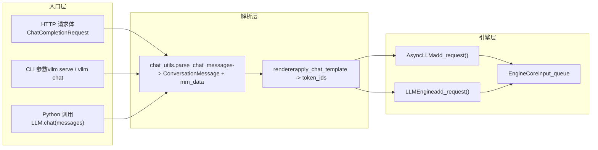

# 第 3 章：请求生命周期：从 HTTP/CLI 到 EngineCore 的端到端链路

上一章我们剖析了 Request 与 KVCacheSpec 这两个引擎内部的核心数据结构，理解了逻辑序列与物理显存块如何解耦。但一个 HTTP 请求体或一个 Python 字符串，究竟如何穿越 API Server、chat template 与多模态处理，最终变成 EngineCoreRequest？本章将完整追踪这条链路，并揭示同步 CLI、异步 API 与离线 LLM 类三条入口路径如何汇聚到同一引擎核心。

# 3.1 三条入口路径的收敛点：AsyncLLMEngine 与 LLMEngine

在深入请求解析之前，必须先看清三条入口路径的拓扑结构。vLLM 提供了三种使用方式：`vllm serve` 启动的 OpenAI 兼容 HTTP 服务、命令行 `vllm` 工具、以及 Python 中直接实例化 `LLM` 类做离线推理。它们看似独立，实则共享同一套引擎核心。

先看异步 API 路径的别名机制。

[FACT:vllm/engine/async_llm_engine.py:7-7]

这个文件短得几乎不像一个模块——它只做了一件事：把 `AsyncLLMEngine` 别名指向 `vllm.v1.engine.async_llm.AsyncLLM`。这是一个典型的架构迁移痕迹。vLLM v0 时代的 `AsyncLLMEngine` 是一个庞大而复杂的类，v1 架构重写后，新的 `AsyncLLM` 承担了相同职责。为了不破坏既有用户代码，vLLM 保留了旧模块路径作为兼容层。

> **〔设计推断与架构权衡〕**
> 这种「旧路径别名指向新实现」的模式在 vLLM 中反复出现（如 `api_server.py` 的 deprecation warning），说明项目在 v0 到 v1 的迁移中采取了渐进式策略：新代码用新路径，旧代码不报错但会收到警告，给用户足够的迁移窗口。

再看离线路径的入口。

[FACT:vllm/entrypoints/llm.py:344-346]

`LLM.__init__` 最终调用 `LLMEngine.from_engine_args`，传入 `UsageContext.LLM_CLASS`。这个 `UsageContext` 枚举是区分入口路径的关键——它让引擎知道自己是运行在离线批处理模式还是在线服务模式，从而调整日志、指标和资源管理策略。

[FACT:vllm/entrypoints/llm.py:357-359]

注意这里 `self.renderer = self.llm_engine.renderer` 和 `self.input_processor = self.llm_engine.input_processor` 的赋值。离线 `LLM` 类并不自己实现 chat template 渲染，而是复用引擎内部的 `renderer`。这意味着 chat template 的解析逻辑在离线与在线路径上是同一份代码，只是调用时机不同。

三条路径的收敛关系可以用下面的数据流图表示。

这张图揭示了一个关键设计：无论请求来自 HTTP、CLI 还是 Python，`chat_utils` 都是多模态与 chat template 处理的唯一入口。它把异构的输入格式统一为 `ConversationMessage` 列表加 `MultiModalDataDict`，再交给 renderer 生成 token 序列。

# 3.2 chat_utils：从异构消息到统一对话结构

`chat_utils.py` 是整个请求入口层最复杂的模块，2264 行代码处理了 OpenAI 兼容格式、自定义扩展、多模态嵌入、工具调用等所有输入形态。它的核心职责可以用一句话概括：把用户传来的任意消息列表，规范化为 chat template 能理解的 `ConversationMessage` 列表，同时把多模态数据抽取到独立的 `MultiModalDataDict` 中。

## 直觉模型：翻译官与行李分拣员

把 `chat_utils` 想象成机场的翻译官兼行李分拣员。旅客（用户）来自不同国家（OpenAI 格式、自定义格式、Harmony 格式），说着不同的语言。翻译官先把所有人的话翻译成统一的工作语言（`ConversationMessage`），同时把旅客托运的行李（图片、音频、视频）分拣到独立的传送带上（`MultiModalDataDict`），贴上标签（UUID），最后把人和行李分别送上同一架飞机（引擎）。

如果没有这一层，引擎就必须理解每一种输入格式的细节，多模态数据的提取逻辑会散落在各个入口中，任何新格式的加入都要改动引擎核心。

## 数据结构：追踪器与解析器的双类协作

`chat_utils` 的核心是两组类的协作：`BaseMultiModalItemTracker` 及其子类负责「追踪」多模态项，`BaseMultiModalContentParser` 及其子类负责「解析」内容部分。

先看追踪器的字段布局。

[FACT:vllm/entrypoints/chat_utils.py:598-601]

`_items_by_modality` 是一个 `defaultdict[str, list[_T]]`，按模态（image、audio、video 等）分组存储待处理的项。`_modality_order` 则专门为 `vision_chunk` 模态记录每个 chunk 的原始模态（image 还是 video），因为统一视觉 chunk 模型会把两者都映射到 `vision_chunk`，但后续处理需要知道原始类型。

[FACT:vllm/entrypoints/chat_utils.py:613-615]

`use_unified_vision_chunk_modality` 是一个 `cached_property`，从 HuggingFace 配置中读取 `use_unified_vision_chunk` 标志。使用 `cached_property` 而非普通属性，是因为这个检查在每次 `add` 调用时都会触发，缓存可以避免重复的 `getattr` 开销。

追踪器的 `add` 方法是核心入口。

[FACT:vllm/entrypoints/chat_utils.py:656-684]

`add` 方法先调用 `_validate_add` 做校验，然后根据是否使用统一视觉 chunk 模态，把项存入不同的键下。注意 `prompt_embeds` 的特殊处理：它直接追加到 `_items_by_modality["prompt_embeds"]` 并返回 `None`，因为预计算嵌入不经过 HF processor，没有占位符字符串。

`_validate_add` 中的校验逻辑值得细看。

[FACT:vllm/entrypoints/chat_utils.py:686-721]

这里有一个微妙的分支：当 `enable_mm_embeds=True` 且该模态的每 prompt 限制为 0 且原始模态以 `_embeds` 结尾时，跳过数量校验。这是为了允许嵌入输入绕过原始模态的数量限制——嵌入是预计算的，不占用原始模态的处理资源。

## 场景驱动：一次带图片的 chat 请求如何被解析

假设用户发送一个包含图片 URL 和文本的 chat 请求。`parse_chat_messages` 是同步路径的入口。

[FACT:vllm/entrypoints/chat_utils.py:2161-2197]

`parse_chat_messages` 创建 `MultiModalItemTracker`，遍历每条消息调用 `_parse_chat_message_content`，最后调用 `_postprocess_messages` 处理工具调用参数，再通过 `mm_tracker.resolve_items()` 物化多模态数据。

`_parse_chat_message_content` 负责单条消息的解析。

[FACT:vllm/entrypoints/chat_utils.py:2007-2029]

它先规范化 content：`None` 变成空列表，字符串变成单个文本 part。然后调用 `_parse_chat_message_content_parts`，其中 `wrap_dicts` 参数由 `content_format == "openai"` 决定——这决定了输出是结构化字典列表还是拼接后的字符串。

`_parse_chat_message_content_parts` 遍历每个 part。

[FACT:vllm/entrypoints/chat_utils.py:1814-1853]

每个 part 经过 `_parse_chat_message_content_part` 处理。如果 `wrap_dicts=False`，最终会把文本和占位符拼接成单个字符串；如果 `wrap_dicts=True`，则返回结构化字典列表。

`_parse_chat_message_content_part` 是分发的核心。

[FACT:vllm/entrypoints/chat_utils.py:1875-1884]

对于纯文本 part，先做保留占位符检查，再根据 `wrap_dicts` 决定返回格式。对于结构化 part，调用 `_parse_chat_message_content_mm_part` 提取类型和内容。

[FACT:vllm/entrypoints/chat_utils.py:1690-1723]

`_parse_chat_message_content_mm_part` 通过 `MM_PARSER_MAP` 查找对应的解析函数。注意 `uuid is None` 的条件——如果用户提供了 UUID，说明媒体数据可能不在请求体中（已通过其他方式上传），此时走下面的直接 URL 字段分支。

[FACT:vllm/entrypoints/chat_utils.py:1731-1733]

当 `part_type is None` 或 `uuid is not None` 时，代码尝试从 part 中直接提取 URL 字段。这种「宽松解析」是为了兼容那些不严格遵循 OpenAI 格式的客户端。

回到 `_parse_chat_message_content_part`，媒体类型的 part 会被分发到对应的 `mm_parser` 方法。

[FACT:vllm/entrypoints/chat_utils.py:1923-1968]

每个媒体类型调用对应的 `parse_*` 方法，这些方法内部会调用 `tracker.add` 把项加入追踪器，并返回占位符字符串。最后根据 `interleave_strings` 决定返回占位符还是 `None`。

[FACT:vllm/entrypoints/chat_utils.py:1984-1999]

`prompt_embeds` 的处理是特殊的：无论 `interleave_strings` 如何，都返回 `PROMPT_EMBEDS_PLACEHOLDER_TOKEN`。注释解释了原因——prompt_embeds 在 token 偏移处拼接，位置很重要，如果走 `missing_placeholders` 的前置填充逻辑会打乱顺序。

## 异步路径的差异

异步路径使用 `AsyncMultiModalItemTracker` 和 `AsyncMultiModalContentParser`。核心差异在 `resolve_items`。

[FACT:vllm/entrypoints/chat_utils.py:906-952]

异步版本用 `asyncio.gather` 并发等待所有模态项。注释明确指出：每个追踪项已经是独立的 awaitable，异步连接器会把阻塞的解码工作卸载到线程池，所以串行等待一个模态再等下一个会无谓地增加延迟。`return_exceptions=True` 让所有任务都完成或失败后再统一抛出，避免第一个失败就放弃仍在进行中的网络请求。

## 设计思考：为什么追踪器与解析器分离

> **〔设计推断与架构权衡〕**
> 追踪器与解析器的分离是一个值得玩味的设计。追踪器负责「状态管理」——记录每个模态有多少项、校验数量限制、维护 vision_chunk 的原始模态顺序。解析器负责「内容提取」——从 URL 获取图片、从 base64 解码嵌入、处理音频格式转换。这种分离使得同步和异步路径可以共享追踪逻辑（`BaseMultiModalItemTracker` 是抽象基类），只在解析器层面分叉。如果合并成一个类，同步和异步的差异会渗透到追踪逻辑中，导致代码重复和状态管理复杂化。

# 3.3 从消息到 token：renderer 与 EngineCore 的交接

`chat_utils` 产出的 `ConversationMessage` 列表和 `MultiModalDataDict` 还需要经过 chat template 渲染才能变成 token 序列。这一步由 renderer 完成，之后请求才真正进入引擎。

## 场景驱动：chat template 渲染与请求投递

`parse_chat_messages` 返回后，调用方（如 `OpenAIServingChat`）会把 `conversation` 和 `mm_data` 传给 renderer。renderer 应用 chat template，把 `ConversationMessage` 列表渲染成文本，再 tokenize 成 token ID 序列。多模态占位符（如 `<##IMAGE##>`）在 tokenize 后会被替换为模型特定的占位符 token。

渲染完成后，请求被封装为 `EngineCoreRequest`，通过 `AsyncLLM.add_request()` 或 `LLMEngine.add_request()` 投递到 EngineCore 的输入队列。

[FACT:vllm/entrypoints/llm.py:420-484]

离线 `LLM.generate` 方法展示了这条链路：它先校验 `runner_type`，获取默认采样参数，然后调用 `_run_completion`。`_run_completion` 内部会调用 renderer 渲染 prompt，再通过 `llm_engine` 投递请求。

[FACT:vllm/entrypoints/llm.py:615-708]

`LLM.chat` 方法则展示了 chat 路径：它接收 `messages` 列表，调用 `_run_chat`，后者内部会调用 `parse_chat_messages` 和 renderer。

## 设计思考：为什么 renderer 在引擎内部

> **〔设计推断与架构权衡〕**
> `LLM.__init__` 中 `self.renderer = self.llm_engine.renderer` 这一行揭示了一个重要设计决策：renderer 属于引擎而非入口层。这意味着 chat template 的加载、缓存和预热（`self.renderer.warmup(ChatParams(...))`）都在引擎初始化时完成，入口层只是调用者。这样做的好处是：离线 `LLM` 和在线 `AsyncLLM` 共享同一份 renderer 实现和缓存，避免重复加载 tokenizer 和 chat template。同时，renderer 的预热可以在引擎启动时完成，避免首个请求的冷启动延迟。

## 错误恢复与生产踩坑

`_postprocess_messages` 中的工具调用参数处理是一个典型的生产环境陷阱。

[FACT:vllm/entrypoints/chat_utils.py:2118-2158]

当 assistant 消息包含 `tool_calls` 时，`arguments` 字段可能是 JSON 字符串、字典或无效 JSON。代码尝试解析 JSON 字符串，如果失败则记录警告并强制转为空对象。注释解释了原因：格式错误的 `arguments` 存在于对话历史中，如果在这里让请求失败，后续每一轮都会失败，对话将无法恢复。这是一个深思熟虑的容错设计——宁可让模型看到空的工具参数，也不让整个对话卡死。

另一个陷阱是保留占位符的注入防护。

[FACT:vllm/entrypoints/chat_utils.py:1856-1872]

当 `enable_prompt_embeds` 开启时，`PROMPT_EMBEDS_PLACEHOLDER_TOKEN` 被注册为不可分割的特殊 token。如果用户文本中恰好包含这个字面序列，tokenizer 会把它编码为同一个 token ID，renderer 会误认为这是拼接点，允许调用者通过纯文本内容移动或注入拼接位置。`_reject_reserved_placeholder_in_text` 在文本 part 解析时拒绝这种输入，堵住了这个安全漏洞。

[FACT:vllm/entrypoints/chat_utils.py:1889-1892]

注意这个检查在 `isinstance(part, str)` 分支和结构化文本分支中都有调用，确保所有文本路径都经过防护。

# 本章小结

本章追踪了请求从外部进入系统的第一段链路。三条入口路径——HTTP API、CLI 和离线 `LLM` 类——最终都汇聚到 `chat_utils` 的多模态解析层。`BaseMultiModalItemTracker` 负责状态管理，`BaseMultiModalContentParser` 负责内容提取，两者分离使得同步和异步路径可以共享追踪逻辑。`parse_chat_messages` 把异构消息规范化为 `ConversationMessage` 列表和 `MultiModalDataDict`，再交给引擎内部的 renderer 完成 chat template 渲染和 tokenize。最终，请求被封装为 `EngineCoreRequest` 投递到 EngineCore 的输入队列。

# 本章思考与自测

Q1: 在 `_parse_chat_message_content_mm_part` 中，如果去掉 `uuid is None` 这个条件（即改为 `if isinstance(part_type, str) and part_type in MM_PARSER_MAP:`），在什么场景下会导致问题？

**参考解析**：`uuid is None` 条件的存在是为了处理「用户提供了 UUID 但媒体数据不在请求体中」的场景。当用户提供 UUID 时，媒体数据可能已经通过其他方式上传（如预先上传到媒体缓存），此时请求体中的 part 可能只包含 UUID 而不包含实际的 URL 或数据。如果去掉这个条件，代码会尝试通过 `MM_PARSER_MAP[part_type](part)` 解析，但 part 中可能没有对应的数据字段（如 `image_url` 为空），导致解析出 `None` 内容。更严重的是，后续的 `parse_image(None, uuid)` 会调用 `_connector.fetch_image(None)`，可能触发不必要的网络请求或异常。`uuid is not None` 分支则走直接字段提取路径，正确处理了「有 UUID 无数据」的情况。参见 [FACT:vllm/entrypoints/chat_utils.py:1713-1723] 和 [FACT:vllm/entrypoints/chat_utils.py:1731-1733]。

Q2: `AsyncMultiModalItemTracker.resolve_items` 使用 `asyncio.gather(..., return_exceptions=True)` 而非默认的 `return_exceptions=False`。如果改为 `False`，在什么并发场景下会导致资源泄漏？

**参考解析**：`return_exceptions=False` 时，`asyncio.gather` 会在第一个异常抛出时立即返回，但其他仍在进行中的任务不会被取消——它们会继续在后台运行。这些任务可能持有网络连接、线程池工作项或文件句柄。如果这些任务最终失败，异常会被静默丢弃（因为 gather 已经返回），导致资源泄漏和难以排查的错误。`return_exceptions=True` 让所有任务都完成或失败后再统一检查，确保没有任务被遗弃。注释明确说明了这一点：「Gathering with return_exceptions=True lets every task finish (or itself fail) before we raise, instead of abandoning still-in-flight fetches (real network/thread-pool work) the moment the first one fails.」参见 [FACT:vllm/entrypoints/chat_utils.py:924-931]。

Q3: `_postprocess_messages` 中，当 `arguments` 是无效 JSON 时，代码选择强制转为空对象而非抛出异常。如果改为抛出异常，在什么生产场景下会导致不可恢复的对话状态？

**参考解析**：`arguments` 字段存在于对话历史中（assistant 消息的 `tool_calls`）。如果某轮对话中模型生成了格式错误的 `arguments`，这个错误会被保存在对话历史中。如果 `_postprocess_messages` 在解析历史时抛出异常，那么后续每一轮请求都会因为历史中的这个错误而失败——即使当前轮次的输入完全正确。用户将无法继续这个对话，只能放弃整个会话重新开始。强制转为空对象让对话可以继续，模型看到空的工具参数后会重新生成正确的调用。注释解释了这一点：「A malformed arguments string lives in conversation history, so failing the request here would fail every subsequent turn too and leave the conversation unrecoverable.」参见 [FACT:vllm/entrypoints/chat_utils.py:2124-2139]。

下一章将进入调度器，看 EngineCore 如何用连续批处理与显存感知策略编排这些请求。

至此，请求已经完成从外部输入到 EngineCoreRequest 的规范化转换，并抵达引擎核心的入口。但请求进入之后并不会立即执行——引擎需要决定在每一步中处理哪些请求、如何分配有限的显存资源。下一章将深入 EngineCore 的调度循环，剖析 Scheduler 如何在连续批处理中权衡吞吐与延迟，以及 chunked prefill、prefix caching 与 KV block 分配如何协同工作。
