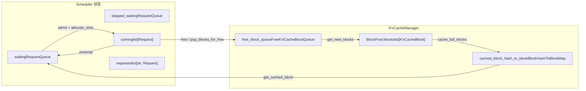
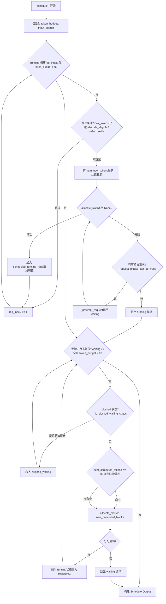

# 第 4 章：资源感知与内存管理：PagedAttention 与 KV Cache 显存虚拟化

请求进入 EngineCore 的输入队列后，并不会立即被执行。每一步处理哪些请求、为每个请求分配多少 token 预算、显存不足时优先牺牲谁，这些决策都集中在 `Scheduler.schedule()` 方法中。本章从调度器的数据结构入手，追踪一次 `schedule()` 调用如何将 waiting 队列、running 列表和 KV cache 池组织成一个可执行的批次。

# 4.1 调度器的数据结构：三个队列与一个显存池

调度器要回答的核心问题是：**在有限的 token 预算和 KV block 预算下，这一步该让哪些请求前进多少 token？** 要理解它，先要看清它手里握着哪些状态。

调度器维护三类请求容器。`self.requests` 是全局字典，`req_id -> Request`，所有活跃请求的唯一真相来源 [FACT:vllm/v1/core/sched/scheduler.py:208-209](https://github.com/vllm-project/vllm/blob/7ba3df63cbe2e3e7aca19074bed2958311f46400/vllm/v1/core/sched/scheduler.py#L208-L209)。`self.waiting` 和 `self.skipped_waiting` 是两个优先级队列，前者放正常等待调度的请求，后者放因异步依赖或约束暂时无法调度的请求（如等待远程 KV、等待结构化输出语法编译）[FACT:vllm/v1/core/sched/scheduler.py:208-209](https://github.com/vllm-project/vllm/blob/7ba3df63cbe2e3e7aca19074bed2958311f46400/vllm/v1/core/sched/scheduler.py#L208-L209)。`self.running` 是一个普通列表，存放已经进入运行态、持有 KV block 的请求 [FACT:vllm/v1/core/sched/scheduler.py:208-209](https://github.com/vllm-project/vllm/blob/7ba3df63cbe2e3e7aca19074bed2958311f46400/vllm/v1/core/sched/scheduler.py#L208-L209)。

这里有一个容易被忽略的设计：`max_num_running_reqs` 与 `max_num_active_reqs` 是两个不同的上限。前者来自 `max_num_seqs`，决定 model runner 的槽位数；后者来自 `max_num_active_seqs`，只限制能进入 RUNNING 的请求数，默认等于前者 [FACT:vllm/v1/core/sched/scheduler.py:123-131](https://github.com/vllm-project/vllm/blob/7ba3df63cbe2e3e7aca19074bed2958311f46400/vllm/v1/core/sched/scheduler.py#L123-L131)。这个分离允许在不缩小 CUDA graph 捕获容量的前提下，压低实际并发解码批大小。

显存侧由 `KVCacheManager` 统一管理，它内部持有 `BlockPool`。`BlockPool` 的核心是 `self.blocks`（全部 `KVCacheBlock` 的列表）和 `free_block_queue`（一个按驱逐顺序排列的空闲块双向链表）[FACT:vllm/v1/core/block_pool.py:171-177](https://github.com/vllm-project/vllm/blob/7ba3df63cbe2e3e7aca19074bed2958311f46400/vllm/v1/core/block_pool.py#L171-L177)。注意 `null_block` 的存在：它是从空闲队列头部弹出的第一个块，`is_null=True`，引用计数不参与常规维护，专门用作占位符 [FACT:vllm/v1/core/block_pool.py:183-187](https://github.com/vllm-project/vllm/blob/7ba3df63cbe2e3e7aca19074bed2958311f46400/vllm/v1/core/block_pool.py#L183-L187)。当请求的某个 token 位置不需要真实 KV block（例如被滑动窗口跳过的位置）时，block table 里就填这个 null block。

前缀缓存的索引结构是 `BlockHashToBlockMap`，它把 `BlockHashWithGroupId` 映射到一个 `KVCacheBlock` 或一个 `{block_id: KVCacheBlock}` 字典 [FACT:vllm/v1/core/block_pool.py:56-59](https://github.com/vllm-project/vllm/blob/7ba3df63cbe2e3e7aca19074bed2958311f46400/vllm/v1/core/block_pool.py#L56-L59)。为什么要用联合类型？注释给出了答案：大多数哈希只对应一个块，用字典会产生不必要的 GC 开销；只有当同一个哈希被多个块共享时才升级为字典 [FACT:vllm/v1/core/block_pool.py:56-59](https://github.com/vllm-project/vllm/blob/7ba3df63cbe2e3e7aca19074bed2958311f46400/vllm/v1/core/block_pool.py#L56-L59)。这是一个典型的用类型复杂度换运行时开销的取舍。

`KVCacheBlocks` 是调度器与 KV cache 管理器之间的接口对象，它把内部数据结构隐藏起来。它的 `blocks` 字段是 `tuple[Sequence[KVCacheBlock], ...]`，外层维度是 KV cache group，内层是块序列 [FACT:vllm/v1/core/kv_cache_manager.py:41-54](https://github.com/vllm-project/vllm/blob/7ba3df63cbe2e3e7aca19074bed2958311f46400/vllm/v1/core/kv_cache_manager.py#L41-L54)。注释明确解释了为什么不用块作为外层维度：那会假设所有 group 的块数相同，而未来可能给不同 group 配置不同的 block size [FACT:vllm/v1/core/kv_cache_manager.py:43-48](https://github.com/vllm-project/vllm/blob/7ba3df63cbe2e3e7aca19074bed2958311f46400/vllm/v1/core/kv_cache_manager.py#L43-L48)。



这张图锚定了调度器与显存池之间的数据流：waiting 队列的请求通过 `allocate_slots` 进入 running，running 的请求被抢占时回到 waiting，释放的块回到空闲队列，而前缀缓存哈希表是 waiting 请求命中缓存的入口。

# 4.2 schedule() 主流程：running 优先、waiting 补充、抢占兜底

`schedule()` 是整个调度器的核心方法，它返回一个 `SchedulerOutput`，描述这一步要执行什么。方法开头的注释点明了设计哲学：调度器里没有"解码阶段"和"预填充阶段"的区分，每个请求只有 `num_computed_tokens` 和 `num_tokens_with_spec`，调度器的任务就是让前者追上后者 [FACT:vllm/v1/core/sched/scheduler.py:559-568](https://github.com/vllm-project/vllm/blob/7ba3df63cbe2e3e7aca19074bed2958311f46400/vllm/v1/core/sched/scheduler.py#L559-L568)。这个统一视角是 chunked prefill、prefix caching、投机解码能共存的基础。

## 4.2.1 预算初始化与阈值计算

进入主循环前，调度器先设定两个预算：`token_budget` 初始化为 `max_num_scheduled_tokens`，`input_budget` 初始化为 `max_num_batched_tokens` [FACT:vllm/v1/core/sched/scheduler.py:577-580](https://github.com/vllm-project/vllm/blob/7ba3df63cbe2e3e7aca19074bed2958311f46400/vllm/v1/core/sched/scheduler.py#L577-L580)。两者通常相等，但当模型可能在批次中追加 token（如投机解码）时，`max_num_scheduled_tokens` 会小于 `max_num_batched_tokens`，差值就是留给 draft token 的空间。

`long_prefill_token_threshold` 的处理值得单独看。它的作用是防止一个长 prefill 饿死其他请求，但如果当前只有一个请求，就没有人会被饿死，所以阈值被置零 [FACT:vllm/v1/core/sched/scheduler.py:606-616](https://github.com/vllm-project/vllm/blob/7ba3df63cbe2e3e7aca19074bed2958311f46400/vllm/v1/core/sched/scheduler.py#L606-L616)。当 `adaptive_long_prefill_threshold` 开启时，阈值还会被抬高到 `input_budget // num_eligible_reqs`，保证不会把单个请求的预算压到公平份额以下 [FACT:vllm/v1/core/sched/scheduler.py:617-622](https://github.com/vllm-project/vllm/blob/7ba3df63cbe2e3e7aca19074bed2958311f46400/vllm/v1/core/sched/scheduler.py#L617-L622)。

## 4.2.2 running 请求的调度循环

主循环从 `self.running` 的头部开始遍历，`req_index` 是游标 [FACT:vllm/v1/core/sched/scheduler.py:624-627](https://github.com/vllm-project/vllm/blob/7ba3df63cbe2e3e7aca19074bed2958311f46400/vllm/v1/core/sched/scheduler.py#L624-L627)。对每个请求，先做一系列跳过判断：

- 异步调度下，如果请求的输出占位符表明它已经达到 `max_tokens`，跳过以避免多跑一步 [FACT:vllm/v1/core/sched/scheduler.py:631-645](https://github.com/vllm-project/vllm/blob/7ba3df63cbe2e3e7aca19074bed2958311f46400/vllm/v1/core/sched/scheduler.py#L631-L645)。
- V2 + PP + 异步场景下，如果当前步还没到 `next_decode_eligible_step`，跳过以匹配 worker 侧的采样 token 广播节奏 [FACT:vllm/v1/core/sched/scheduler.py:647-651](https://github.com/vllm-project/vllm/blob/7ba3df63cbe2e3e7aca19074bed2958311f46400/vllm/v1/core/sched/scheduler.py#L647-L651)。
- DP prefill 均衡开启时，非节奏对齐步上的 prefill chunk 被推迟 [FACT:vllm/v1/core/sched/scheduler.py:653-657](https://github.com/vllm-project/vllm/blob/7ba3df63cbe2e3e7aca19074bed2958311f46400/vllm/v1/core/sched/scheduler.py#L653-L657)。

通过跳过判断后，计算这个请求本步能前进多少 token：

```
num_new_tokens = request.num_tokens_with_spec
               + request.num_output_placeholders
               - request.num_computed_tokens
```

然后依次被 `long_prefill_token_threshold`、`token_budget`、`input_budget - draft_slots` 和 `max_model_len` 约束 [FACT:vllm/v1/core/sched/scheduler.py:670-688](https://github.com/vllm-project/vllm/blob/7ba3df63cbe2e3e7aca19074bed2958311f46400/vllm/v1/core/sched/scheduler.py#L670-L688)。如果请求带编码器输入，还要经过 `_try_schedule_encoder_inputs` 调整 [FACT:vllm/v1/core/sched/scheduler.py:700-712](https://github.com/vllm-project/vllm/blob/7ba3df63cbe2e3e7aca19074bed2958311f46400/vllm/v1/core/sched/scheduler.py#L700-L712)。

接下来是最关键的一步：分配 KV block。`allocate_slots` 被包在一个 `while True` 循环里 [FACT:vllm/v1/core/sched/scheduler.py:742-747](https://github.com/vllm-project/vllm/blob/7ba3df63cbe2e3e7aca19074bed2958311f46400/vllm/v1/core/sched/scheduler.py#L742-L747)。如果返回 `None`，说明显存不够，调度器开始抢占：按策略选出牺牲者（PRIORITY 策略选优先级最低的，FCFS 策略选 running 列表末尾的）[FACT:vllm/v1/core/sched/scheduler.py:761-767](https://github.com/vllm-project/vllm/blob/7ba3df63cbe2e3e7aca19074bed2958311f46400/vllm/v1/core/sched/scheduler.py#L761-L767)，调用 `_preempt_request` 把它踢回 waiting 队列，然后重试分配 [FACT:vllm/v1/core/sched/scheduler.py:801-806](https://github.com/vllm-project/vllm/blob/7ba3df63cbe2e3e7aca19074bed2958311f46400/vllm/v1/core/sched/scheduler.py#L801-L806)。如果牺牲者就是当前请求自己，说明已经没有可抢占的对象，跳出循环，当前请求也无法调度 [FACT:vllm/v1/core/sched/scheduler.py:807-813](https://github.com/vllm-project/vllm/blob/7ba3df63cbe2e3e7aca19074bed2958311f46400/vllm/v1/core/sched/scheduler.py#L807-L813)。

抢占逻辑里有一个精妙的细节：PRIORITY 策略下，如果被抢占的请求已经在 `scheduled_running_reqs` 里（即本步已经为它分配过资源），需要把它的 token 预算、block、投机 token、编码器预算全部归还 [FACT:vllm/v1/core/sched/scheduler.py:779-797](https://github.com/vllm-project/vllm/blob/7ba3df63cbe2e3e7aca19074bed2958311f46400/vllm/v1/core/sched/scheduler.py#L779-L797)。这保证了预算账本的一致性。

分配成功后，请求被加入 `scheduled_running_reqs`，记录 block 和 token 数，扣减预算 [FACT:vllm/v1/core/sched/scheduler.py:815-823](https://github.com/vllm-project/vllm/blob/7ba3df63cbe2e3e7aca19074bed2958311f46400/vllm/v1/core/sched/scheduler.py#L815-L823)。投机解码相关的 token 在这里被裁剪并记录 [FACT:vllm/v1/core/sched/scheduler.py:825-841](https://github.com/vllm-project/vllm/blob/7ba3df63cbe2e3e7aca19074bed2958311f46400/vllm/v1/core/sched/scheduler.py#L825-L841)。

## 4.2.3 waiting 请求的准入

running 循环结束后，如果本步没有发生抢占且调度器未暂停，开始处理 waiting 队列 [FACT:vllm/v1/core/sched/scheduler.py:868-872](https://github.com/vllm-project/vllm/blob/7ba3df63cbe2e3e7aca19074bed2958311f46400/vllm/v1/core/sched/scheduler.py#L868-L872)。准入前先检查两个上限：`max_num_active_reqs` 和 `input_budget` [FACT:vllm/v1/core/sched/scheduler.py:873-879](https://github.com/vllm-project/vllm/blob/7ba3df63cbe2e3e7aca19074bed2958311f46400/vllm/v1/core/sched/scheduler.py#L873-L879)。

waiting 请求的调度比 running 多了一个前缀缓存查找步骤。当 `request.num_computed_tokens == 0` 时，调用 `_get_local_prefix_cache_hit` 查找本地缓存命中 [FACT:vllm/v1/core/sched/scheduler.py:932-939](https://github.com/vllm-project/vllm/blob/7ba3df63cbe2e3e7aca19074bed2958311f46400/vllm/v1/core/sched/scheduler.py#L932-L939)。如果配置了 KV connector，还会查询远程缓存命中 [FACT:vllm/v1/core/sched/scheduler.py:942-954](https://github.com/vllm-project/vllm/blob/7ba3df63cbe2e3e7aca19074bed2958311f46400/vllm/v1/core/sched/scheduler.py#L942-L954)。

这里有一个处理本地与远程命中冲突的精细逻辑。本地命中可能不是块对齐的（`partial_tail`），而远程命中如果严格超过本地完整命中，就丢弃本地的子块尾部，让远程加载覆盖它，避免写时复制 [FACT:vllm/v1/core/sched/scheduler.py:977-988](https://github.com/vllm-project/vllm/blob/7ba3df63cbe2e3e7aca19074bed2958311f46400/vllm/v1/core/sched/scheduler.py#L977-L988)。反之则保留本地尾部，不加载外部 [FACT:vllm/v1/core/sched/scheduler.py:989-995](https://github.com/vllm-project/vllm/blob/7ba3df63cbe2e3e7aca19074bed2958311f46400/vllm/v1/core/sched/scheduler.py#L989-L995)。

准入成功后，请求从 waiting 队列弹出，状态设为 RUNNING，加入 running 列表 [FACT:vllm/v1/core/sched/scheduler.py:1263-1319](https://github.com/vllm-project/vllm/blob/7ba3df63cbe2e3e7aca19074bed2958311f46400/vllm/v1/core/sched/scheduler.py#L1263-L1319)。如果本步之后它仍在 prefill 中（`num_computed_tokens + num_new_tokens < request.num_tokens`），加入 `_inflight_prefills` 集合 [FACT:vllm/v1/core/sched/scheduler.py:1326-1328](https://github.com/vllm-project/vllm/blob/7ba3df63cbe2e3e7aca19074bed2958311f46400/vllm/v1/core/sched/scheduler.py#L1326-L1328)。



这张控制流图覆盖了 `schedule()` 的两大循环和抢占分支。注意 running 循环中 `allocate_slots` 失败后的抢占重试路径，以及 waiting 循环中 blocked 状态请求被移入 `skipped_waiting` 的旁路。

# 4.3 显存感知的核心：allocate_slots 与抢占

`allocate_slots` 是调度器与显存之间的闸门。它的参数列表本身就是一份显存账本：`num_new_tokens` 是要新计算的 token 数，`num_new_computed_tokens` 是前缀缓存新命中的 token 数，`num_external_computed_tokens` 是 connector 提供的外部命中数，`num_lookahead_tokens` 是投机解码预留的槽位 [FACT:vllm/v1/core/kv_cache_manager.py:371-383](https://github.com/vllm-project/vllm/blob/7ba3df63cbe2e3e7aca19074bed2958311f46400/vllm/v1/core/kv_cache_manager.py#L371-L383)。

方法开头的注释用一张 ASCII 图精确描述了块布局 [FACT:vllm/v1/core/kv_cache_manager.py:417-438](https://github.com/vllm-project/vllm/blob/7ba3df63cbe2e3e7aca19074bed2958311f46400/vllm/v1/core/kv_cache_manager.py#L417-L438)：

```
|  |  |   |   |  |
                                          |        |
                        |                       |
```

`comp` 是已计算 token，`new_comp` 是前缀缓存命中，`ext_comp` 是外部命中，`new` 是本步新计算，`lookahead` 是投机预留。分配分三个阶段：先释放不需要的块并检查是否有足够空闲块，再处理前缀 token，最后为新计算 token 分配块 [FACT:vllm/v1/core/kv_cache_manager.py:458-461](https://github.com/vllm-project/vllm/blob/7ba3df63cbe2e3e7aca19074bed2958311f46400/vllm/v1/core/kv_cache_manager.py#L458-L461)。

## 4.3.1 水位线与准入控制

`allocate_slots` 里有两个准入闸门。第一个是 `full_sequence_must_fit`：当开启时，先检查整个请求序列（而非仅第一个 chunk）能否装下，装不下直接返回 `None` [FACT:vllm/v1/core/kv_cache_manager.py:515-531](https://github.com/vllm-project/vllm/blob/7ba3df63cbe2e3e7aca19074bed2958311f46400/vllm/v1/core/kv_cache_manager.py#L515-L531)。这防止 chunked prefill 下过度准入导致 KV cache 抖动。

第二个是水位线。`watermark_blocks` 只在请求状态为 WAITING 或 PREEMPTED 且已有请求被调度时生效 [FACT:vllm/v1/core/kv_cache_manager.py:506-513](https://github.com/vllm-project/vllm/blob/7ba3df63cbe2e3e7aca19074bed2958311f46400/vllm/v1/core/kv_cache_manager.py#L506-L513)。它要求分配后至少保留一定比例的空闲块，避免频繁驱逐和抢占。`reserved_blocks` 则用于异步 KV 加载场景，确保在途 prefill 的预留块不被新请求吃掉 [FACT:vllm/v1/core/kv_cache_manager.py:564-570](https://github.com/vllm-project/vllm/blob/7ba3df63cbe2e3e7aca19074bed2958311f46400/vllm/v1/core/kv_cache_manager.py#L564-L570)。

## 4.3.2 抢占的代价与恢复

> **〔设计推断与架构权衡〕**
> `_preempt_request` 做了一件看似暴力但必要的事：把请求的 `num_computed_tokens` 重置为 0 [FACT:vllm/v1/core/sched/scheduler.py:1560-1561](https://github.com/vllm-project/vllm/blob/7ba3df63cbe2e3e7aca19074bed2958311f46400/vllm/v1/core/sched/scheduler.py#L1560-L1561)。这意味着被抢占的请求下次调度时要从头重新 prefill。为什么这么设计？ 因为 vLLM 的 KV block 是请求私有的，抢占时必须释放全部块，而释放后无法保证重新分配时能拿到相同的块，所以只能从头计算。前缀缓存的存在让这个代价部分被抵消：如果被抢占请求的前缀已经被缓存，重新调度时能命中缓存，不必真正重算。

抢占还处理了异步调度下的"陈旧输出"问题。`num_stale_output_tokens` 被设为 `num_in_flight_tokens`，标记所有在途输出为陈旧 [FACT:vllm/v1/core/sched/scheduler.py:1571-1574](https://github.com/vllm-project/vllm/blob/7ba3df63cbe2e3e7aca19074bed2958311f46400/vllm/v1/core/sched/scheduler.py#L1571-L1574)。这些 token 仍会被交付（丢弃会扰动投机解码接受率），但不会修改重置后的计数器。`drop_stale_output` 标志决定是丢弃还是交付 [FACT:vllm/v1/core/sched/scheduler.py:1539-1547](https://github.com/vllm-project/vllm/blob/7ba3df63cbe2e3e7aca19074bed2958311f46400/vllm/v1/core/sched/scheduler.py#L1539-L1547)。

## 4.3.3 延迟释放：异步连接器的写后读风险

当使用 KV connector 且存在多个在途批次时，`defer_block_free` 被设为 `True` [FACT:vllm/v1/core/sched/scheduler.py:175-181](https://github.com/vllm-project/vllm/blob/7ba3df63cbe2e3e7aca19074bed2958311f46400/vllm/v1/core/sched/scheduler.py#L175-L181)。原因是：一个步骤可能仍在写入已释放请求的 KV 块，而消费者 connector 可能通过一个未与该写入排序的加载重新分配并填充这些块。

延迟释放通过 `deferred_frees` 双端队列实现，每个条目是 `(fence_seq, blocks)` [FACT:vllm/v1/core/sched/scheduler.py:388-390](https://github.com/vllm-project/vllm/blob/7ba3df63cbe2e3e7aca19074bed2958311f46400/vllm/v1/core/sched/scheduler.py#L388-L390)。`_free_request_blocks` 检查 `_request_blocks_can_be_freed`，如果请求的最后调度步还没被处理完，就把块放入延迟队列 [FACT:vllm/v1/core/sched/scheduler.py:2679-2688](https://github.com/vllm-project/vllm/blob/7ba3df63cbe2e3e7aca19074bed2958311f46400/vllm/v1/core/sched/scheduler.py#L2679-L2688)。`_drain_deferred_frees` 在 `update_from_output` 中推进 `processed_step_seq` 后调用，释放 fence 已满足的块 [FACT:vllm/v1/core/sched/scheduler.py:2701-2706](https://github.com/vllm-project/vllm/blob/7ba3df63cbe2e3e7aca19074bed2958311f46400/vllm/v1/core/sched/scheduler.py#L2701-L2706)。

# 4.4 前缀缓存命中判定与块生命周期

前缀缓存的查找入口是 `KVCacheManager.get_computed_blocks`。它先检查是否启用缓存且请求未标记跳过读取 [FACT:vllm/v1/core/kv_cache_manager.py:286-287](https://github.com/vllm-project/vllm/blob/7ba3df63cbe2e3e7aca19074bed2958311f46400/vllm/v1/core/kv_cache_manager.py#L286-L287)。然后调用 `coordinator.find_longest_cache_hit`，传入 `request.block_hashes` 和 `max_cache_hit_length = request.num_tokens - 1` [FACT:vllm/v1/core/kv_cache_manager.py:295-300](https://github.com/vllm-project/vllm/blob/7ba3df63cbe2e3e7aca19074bed2958311f46400/vllm/v1/core/kv_cache_manager.py#L295-L300)。

为什么是 `num_tokens - 1`？注释解释了：当所有 token 都命中缓存时，必须重算最后一个 token 才能获得 logits [FACT:vllm/v1/core/kv_cache_manager.py:289-294](https://github.com/vllm-project/vllm/blob/7ba3df63cbe2e3e7aca19074bed2958311f46400/vllm/v1/core/kv_cache_manager.py#L289-L294)。这是一个容易被忽略的边界：即使前缀完全命中，也至少要计算一个 token。

块的生命周期由 `BlockPool` 管理。`get_new_blocks` 从空闲队列头部弹出块，如果启用缓存，先调用 `_maybe_evict_cached_block` 清除其哈希元数据，然后增加引用计数 [FACT:vllm/v1/core/block_pool.py:683-702](https://github.com/vllm-project/vllm/blob/7ba3df63cbe2e3e7aca19074bed2958311f46400/vllm/v1/core/block_pool.py#L683-L702)。`free_blocks` 则根据块是否有哈希决定放回队列头还是尾：无哈希的块 LIFO 复用（更好的 GPU 局部性），有哈希的块 FIFO 复用（LRU 驱逐行为）[FACT:vllm/v1/core/block_pool.py:785-805](https://github.com/vllm-project/vllm/blob/7ba3df63cbe2e3e7aca19074bed2958311f46400/vllm/v1/core/block_pool.py#L785-L805)。

`cache_full_blocks` 是块被写入前缀缓存哈希表的时刻。它遍历新满的块，跳过 null 块和被 mask 的块，为每个块计算哈希并插入 `cached_block_hash_to_block` [FACT:vllm/v1/core/block_pool.py:272-300](https://github.com/vllm-project/vllm/blob/7ba3df63cbe2e3e7aca19074bed2958311f46400/vllm/v1/core/block_pool.py#L272-L300)。如果块已经有哈希（部分块升级为满块的场景），先移除旧哈希再插入新哈希 [FACT:vllm/v1/core/block_pool.py:285-293](https://github.com/vllm-project/vllm/blob/7ba3df63cbe2e3e7aca19074bed2958311f46400/vllm/v1/core/block_pool.py#L285-L293)。

`touch` 方法处理缓存命中时的引用计数：如果块在空闲队列中（`ref_cnt == 0`），先把它从队列移除，再增加引用计数 [FACT:vllm/v1/core/block_pool.py:754-770](https://github.com/vllm-project/vllm/blob/7ba3df63cbe2e3e7aca19074bed2958311f46400/vllm/v1/core/block_pool.py#L754-L770)。这保证了被命中的块不会被驱逐。

# 设计思考

> **〔设计推断与架构权衡〕**
> **为什么抢占选择"从头重算"而非"部分保留"？**  部分保留需要记录每个请求的块在抢占时的物理位置，并在重新调度时尝试恢复映射。但块池是全局共享的，其他请求可能已经占用了那些块。维护这种映射的复杂度和内存开销超过了重算的代价，尤其在前缀缓存能命中大部分前缀的情况下。

> **〔设计推断与架构权衡〕**
> **水位线为什么默认是 0？**  水位线是防止频繁抢占的保险，但它以牺牲显存利用率为代价。默认关闭意味着 vLLM 优先追求吞吐而非稳定性，用户需要根据负载特征自行开启。

> **〔设计推断与架构权衡〕**
> **`skipped_waiting` 队列的存在意义。**  如果没有这个队列，被阻塞的请求会一直占据 waiting 队列头部，导致后面的请求无法被调度（FCFS 策略下）。把它分离出来，调度器可以跳过阻塞请求继续处理后面的，同时保留阻塞请求的状态以便后续提升。

# 本章小结

调度器的核心是 `schedule()` 方法中的两个循环：running 循环优先保证已运行请求前进，waiting 循环在预算允许时准入新请求。显存不足时通过抢占 running 列表中优先级最低的请求来腾出空间，被抢占请求的 `num_computed_tokens` 重置为 0，但前缀缓存能抵消部分重算代价。`allocate_slots` 是显存闸门，通过 `full_sequence_must_fit`、水位线和 `reserved_blocks` 三层准入控制防止过度分配。前缀缓存通过块哈希索引实现跨请求共享，命中判定以 `num_tokens - 1` 为上限以保证至少计算一个 token 获得 logits。

# 本章思考与自测

Q1: 在 `schedule()` 的 running 循环中，如果 `allocate_slots` 返回 `None` 且 `_request_blocks_can_be_freed` 对牺牲者返回 `False`，代码会 `break` 跳出循环。如果去掉这个检查，直接调用 `_preempt_request`，在什么场景下会导致状态不一致？

**参考解析**：`_request_blocks_can_be_freed` 检查 `request.last_sched_seq <= self.processed_step_seq` [FACT:vllm/v1/core/sched/scheduler.py:2672-2677](https://github.com/vllm-project/vllm/blob/7ba3df63cbe2e3e7aca19074bed2958311f46400/vllm/v1/core/sched/scheduler.py#L2672-L2677)。当 `defer_block_free` 开启时，如果牺牲者的最后调度步还没被处理完，它的块可能仍被在途 GPU 步骤写入。直接抢占会调用 `_free_request_blocks`，而后者在 `_request_blocks_can_be_freed` 为 `False` 时会把块放入 `deferred_frees` 而非立即释放 [FACT:vllm/v1/core/sched/scheduler.py:2679-2688](https://github.com/vllm-project/vllm/blob/7ba3df63cbe2e3e7aca19074bed2958311f46400/vllm/v1/core/sched/scheduler.py#L2679-L2688)。但抢占的语义是"立即腾出块给当前请求"，延迟释放无法满足这个需求，`allocate_slots` 会再次失败，形成死循环。更严重的是，如果牺牲者的块被延迟释放后又被当前请求分配，而 GPU 仍在写入牺牲者的块，就会产生数据竞争。

Q2: `get_computed_blocks` 中 `max_cache_hit_length = request.num_tokens - 1`。如果改为 `request.num_tokens`，在什么情况下会导致输出错误？

**参考解析**：当请求的所有 token 都命中缓存时，`num_computed_tokens` 会等于 `num_tokens`。此时调度器认为不需要计算任何新 token，但采样 logits 需要最后一个位置的隐藏状态，而隐藏状态来自前向传播。如果没有任何 token 被计算，就没有 logits 可采样，请求会卡住或产生错误输出。注释明确说明了这一点 [FACT:vllm/v1/core/kv_cache_manager.py:289-294](https://github.com/vllm-project/vllm/blob/7ba3df63cbe2e3e7aca19074bed2958311f46400/vllm/v1/core/kv_cache_manager.py#L289-L294)。此外，`allocate_slots` 要求 `num_computed_tokens` 是块大小对齐的，重算最后一个 token 可能触发整个块的重算，这是当前实现的已知限制。

Q3: `_preempt_request` 把 `num_computed_tokens` 重置为 0，但保留了 `request.num_tokens`（prompt + 已生成 token）。如果被抢占请求重新调度时前缀缓存未命中，它需要重算多少 token？如果命中，又能省下多少？

**参考解析**：`num_computed_tokens = 0` 意味着重新调度时从第一个 token 开始 [FACT:vllm/v1/core/sched/scheduler.py:1561](https://github.com/vllm-project/vllm/blob/7ba3df63cbe2e3e7aca19074bed2958311f46400/vllm/v1/core/sched/scheduler.py#L1561)。`request.num_tokens` 保持不变，包含原始 prompt 和已生成的输出 token。如果前缀缓存未命中，需要重算全部 `num_tokens` 个 token 的 prefill。如果命中，`get_computed_blocks` 会返回命中的块，`num_computed_tokens` 从命中位置开始 [FACT:vllm/v1/core/kv_cache_manager.py:296-300](https://github.com/vllm-project/vllm/blob/7ba3df63cbe2e3e7aca19074bed2958311f46400/vllm/v1/core/kv_cache_manager.py#L296-L300)。注意被抢占请求的输出 token 也在 `num_tokens` 中，它们的前缀哈希在生成时已被缓存（如果启用），所以重新调度时这些输出 token 的前缀也可能命中。但 `max_cache_hit_length = num_tokens - 1` 意味着最后一个 token 总要重算。

调度器输出的 `SchedulerOutput` 明确了这一步的执行内容：新请求的块 ID、缓存请求的 token 数、投机 token、编码器输入等。下一章将追踪这个输出如何被 ModelRunner 消费，从 `SchedulerOutput` 一路走到 GPU 前向传播。
