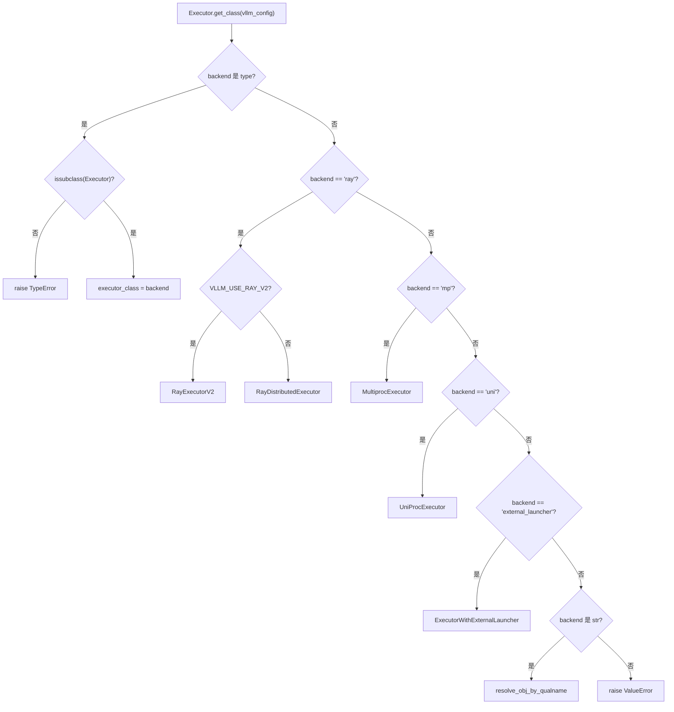
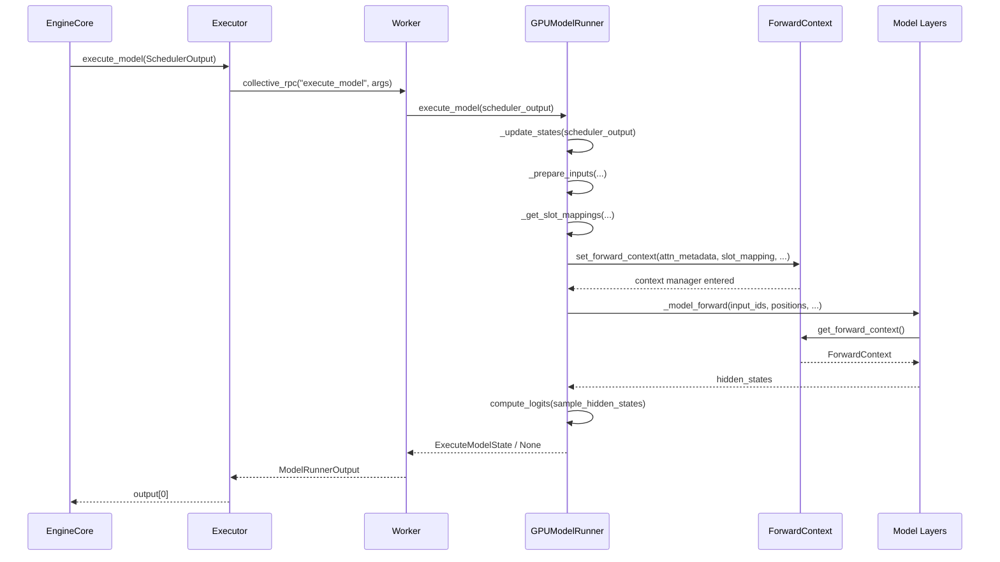

# 第 5 章：连续批处理引擎：Continuous Batching 与迭代级调度

上一章我们看到，Scheduler 在每一步的调度循环中决定了哪些请求进入 running 队列、哪些被抢占、哪些因显存不足而等待，并最终产出一份 SchedulerOutput——它描述了本步该算什么：哪些请求、各算多少 token、用哪些 KV block。但这份清单只是逻辑意图，GPU 需要的是物理张量。本章追踪 SchedulerOutput 如何被 Executor 分发到 Worker，再由 GPUModelRunner 翻译成 input_ids、positions、slot_mapping 和 block table 等 GPU 可执行的输入，最终通过 forward_context 把跨层共享的批描述注入模型每一层，完成从调度决策到前向传播的跨越。

# 5.1 Executor：把调度结果送到每一张卡

## 直觉模型

`Executor` 是 EngineCore 与 GPU Worker 之间的「传令官」。若没有它，EngineCore 就得自己知道集群里有几张卡、每张卡在哪个进程、如何把 `SchedulerOutput` 序列化过去——调度逻辑会和分布式拓扑纠缠在一起。`Executor` 把这个职责抽出来：EngineCore 只管调用 `execute_model(scheduler_output)`，剩下的「发给谁、怎么发、收几个结果」由 Executor 决定。

## 类层次与字段

`Executor` 是一个抽象基类，其类级字段直接编码了后端能力 [FACT:vllm/v1/executor/abstract.py:48-49](https://github.com/vllm-project/vllm/blob/7ba3df63cbe2e3e7aca19074bed2958311f46400/vllm/v1/executor/abstract.py#L48-L49)：

```python
uses_ray: bool = False  # whether the executor uses Ray for orchestration.
supports_pp: bool = False  # whether the executor supports PP
```

这两个标志不是装饰性的——上层代码会读取它们来决定是否启用某些优化路径。`__init__` 中初始化了 `sleeping_tags`、`kv_output_aggregator`、`ec_output_aggregator` 三个状态字段 [FACT:vllm/v1/executor/abstract.py:119-120](https://github.com/vllm-project/vllm/blob/7ba3df63cbe2e3e7aca19074bed2958311f46400/vllm/v1/executor/abstract.py#L119-L120)，分别用于睡眠模式标签追踪、KV 连接器输出聚合、编码器连接器输出聚合。

## 后端选择：`get_class` 的分支路由

`get_class` 是一个静态工厂，根据 `distributed_executor_backend` 配置返回具体 Executor 类 [FACT:vllm/v1/executor/abstract.py:51-96](https://github.com/vllm-project/vllm/blob/7ba3df63cbe2e3e7aca19074bed2958311f46400/vllm/v1/executor/abstract.py#L51-L96)。它的分支结构值得细看：

- 若配置本身是一个 `type`，校验其是否为 `Executor` 子类后直接使用 [FACT:vllm/v1/executor/abstract.py:52-61](https://github.com/vllm-project/vllm/blob/7ba3df63cbe2e3e7aca19074bed2958311f46400/vllm/v1/executor/abstract.py#L52-L61)；
- `"ray"` 分支下还有二级分支：`VLLM_USE_RAY_V2_EXECUTOR_BACKEND` 为真时用 `RayExecutorV2`，否则用 `RayDistributedExecutor` [FACT:vllm/v1/executor/abstract.py:64-72](https://github.com/vllm-project/vllm/blob/7ba3df63cbe2e3e7aca19074bed2958311f46400/vllm/v1/executor/abstract.py#L64-L72)；
- `"mp"` 映射到 `MultiprocExecutor`，`"uni"` 映射到 `UniProcExecutor` [FACT:vllm/v1/executor/abstract.py:73-80](https://github.com/vllm-project/vllm/blob/7ba3df63cbe2e3e7aca19074bed2958311f46400/vllm/v1/executor/abstract.py#L73-L80)；
- 字符串形式的自定义后端通过 `resolve_obj_by_qualname` 动态解析 [FACT:vllm/v1/executor/abstract.py:85-90](https://github.com/vllm-project/vllm/blob/7ba3df63cbe2e3e7aca19074bed2958311f46400/vllm/v1/executor/abstract.py#L85-L90)。



## Step-by-Step：一次 `execute_model` 的调用流

代入场景：EngineCore 完成一步调度，拿到 `SchedulerOutput`，调用 `executor.execute_model(scheduler_output)`。

`Executor.execute_model` 的实现极简 [FACT:vllm/v1/executor/abstract.py:237-238](https://github.com/vllm-project/vllm/blob/7ba3df63cbe2e3e7aca19074bed2958311f46400/vllm/v1/executor/abstract.py#L237-L238)：

```python
def execute_model(
    self, scheduler_output: SchedulerOutput, non_block: bool = False
) -> ModelRunnerOutput | None | Future[ModelRunnerOutput | None]:
    output = self.collective_rpc(
        "execute_model", args=(scheduler_output,), non_block=non_block
    )
    return output[0]
```

> **〔设计推断与架构权衡〕**
> 关键在 `collective_rpc`——它把方法名和参数广播到所有 Worker，收集每个 Worker 的返回值列表，然后 `output[0]` 只取第一个。为什么只取第一个？ 因为在张量并行下，所有 Worker 执行的是同一个逻辑前向，输出在语义上等价；采样结果由最后一个 PP stage 或 rank 0 决定，取 `output[0]` 避免了重复聚合。`collective_rpc` 的文档明确建议「只传控制消息，数据面通信另行建立」[FACT:vllm/v1/executor/abstract.py:220-221](https://github.com/vllm-project/vllm/blob/7ba3df63cbe2e3e7aca19074bed2958311f46400/vllm/v1/executor/abstract.py#L220-L221)，这正是 `SchedulerOutput` 的定位——它是控制消息，真正的 token 数据通过 GPU 张量在 Worker 内部流转。

`sample_tokens` 走同样的模式 [FACT:vllm/v1/executor/abstract.py:257-258](https://github.com/vllm-project/vllm/blob/7ba3df63cbe2e3e7aca19074bed2958311f46400/vllm/v1/executor/abstract.py#L257-L258)，但返回类型不含 `None`——采样必然产出结果。这两个方法的分工对应了 vLLM v1 的「执行-采样分离」设计：`execute_model` 可能返回 `None`（表示前向已提交但采样延后），此时状态被暂存在 `ExecuteModelState` 中。

## 设计思考

`collective_rpc` 被声明为 `@abstractmethod` [FACT:vllm/v1/executor/abstract.py:186-192](https://github.com/vllm-project/vllm/blob/7ba3df63cbe2e3e7aca19074bed2958311f46400/vllm/v1/executor/abstract.py#L186-L192)，意味着不同后端必须自己实现「如何把 RPC 发到 Worker」。`MultiprocExecutor` 用共享内存队列，`RayDistributedExecutor` 用 Ray actor 调用，`UniProcExecutor` 直接本地调用。这种抽象让上层代码完全不需要关心分布式细节。

一个容易忽略的细节：`supported_tasks` 被标记为 `@cached_property` [FACT:vllm/v1/executor/abstract.py:306-309](https://github.com/vllm-project/vllm/blob/7ba3df63cbe2e3e7aca19074bed2958311f46400/vllm/v1/executor/abstract.py#L306-L309)，注释直言「避免不必要的 RPC 调用」。因为 `get_supported_tasks` 需要跨进程通信，而任务列表在模型生命周期内不变，缓存是正确且必要的优化。

# 5.2 GPUModelRunner：从 SchedulerOutput 到输入张量

## 直觉模型

`GPUModelRunner` 是「翻译官」：它把 `SchedulerOutput` 里的逻辑描述（请求 ID、token 数、块 ID）翻译成 GPU 能直接消费的物理张量。若没有它，模型层就得自己处理「第 3 个请求的第 7 个 token 在哪个 KV 槽位」这种问题——这是灾难性的关注点泄漏。

## 核心状态与内存布局

`GPUModelRunner` 继承自三个 Mixin [FACT:vllm/v1/worker/gpu_model_runner.py:479-480](https://github.com/vllm-project/vllm/blob/7ba3df63cbe2e3e7aca19074bed2958311f46400/vllm/v1/worker/gpu_model_runner.py#L479-L480)：`LoRAModelRunnerMixin`、`KVConnectorModelRunnerMixin`、`ECConnectorModelRunnerMixin`，分别提供 LoRA 适配、KV 连接器、编码器连接器能力。

`__init__` 中缓存了全部配置对象 [FACT:vllm/v1/worker/gpu_model_runner.py:488-498](https://github.com/vllm-project/vllm/blob/7ba3df63cbe2e3e7aca19074bed2958311f46400/vllm/v1/worker/gpu_model_runner.py#L488-L498)，并初始化了几个关键标志：

- `check_ep_fault`：仅当数据并行 > 1 且是 MoE 模型时，查询 EP all2all 管理器是否支持容错 [FACT:vllm/v1/worker/gpu_model_runner.py:507-509](https://github.com/vllm-project/vllm/blob/7ba3df63cbe2e3e7aca19074bed2958311f46400/vllm/v1/worker/gpu_model_runner.py#L507-L509)；
- `is_pooling_model`：由 `runner_type == "pooling"` 决定 [FACT:vllm/v1/worker/gpu_model_runner.py:515](https://github.com/vllm-project/vllm/blob/7ba3df63cbe2e3e7aca19074bed2958311f46400/vllm/v1/worker/gpu_model_runner.py#L515)；
- `enable_prompt_embeds`：是否启用 prompt embedding 输入 [FACT:vllm/v1/worker/gpu_model_runner.py:516](https://github.com/vllm-project/vllm/blob/7ba3df63cbe2e3e7aca19074bed2958311f46400/vllm/v1/worker/gpu_model_runner.py#L516)。

`ExecuteModelState` 是一个 `NamedTuple`，承载 `execute_model()` 与 `sample_tokens()` 之间的临时状态 [FACT:vllm/v1/worker/gpu_model_runner.py:463-476](https://github.com/vllm-project/vllm/blob/7ba3df63cbe2e3e7aca19074bed2958311f46400/vllm/v1/worker/gpu_model_runner.py#L463-L476)。它的字段设计揭示了执行-采样分离的本质：`logits`、`hidden_states`、`sample_hidden_states` 是前向产物，`spec_decode_metadata`、`slot_mappings` 是采样阶段仍需的元数据。注释明确说这是「在 execute_model() 返回 None 后传递的临时缓存状态」[FACT:vllm/v1/worker/gpu_model_runner.py:464-464](https://github.com/vllm-project/vllm/blob/7ba3df63cbe2e3e7aca19074bed2958311f46400/vllm/v1/worker/gpu_model_runner.py#L464-L464)。

## Step-by-Step：`_update_states` 如何同步缓存状态

代入场景：调度器决定本步处理请求 A（新请求）、B（上一步的 decode 继续）、C（被抢占后恢复），同时请求 D 已完成。

**第一步：清理已完成请求。** 遍历 `finished_req_ids`，从 `self.requests` 字典弹出状态，从 `input_batch` 移除 [FACT:vllm/v1/worker/gpu_model_runner.py:1202-1217](https://github.com/vllm-project/vllm/blob/7ba3df63cbe2e3e7aca19074bed2958311f46400/vllm/v1/worker/gpu_model_runner.py#L1202-L1217)。注意注释指出的边界情况：`finished_req_ids` 和 `scheduled_req_ids` 可能重叠——当请求被中止后又以相同 ID 重新提交时，它们被视为两个不同请求 [FACT:vllm/v1/worker/gpu_model_runner.py:1211-1215](https://github.com/vllm-project/vllm/blob/7ba3df63cbe2e3e7aca19074bed2958311f46400/vllm/v1/worker/gpu_model_runner.py#L1211-L1215)。

**第二步：清零新分配的 KV 块。** 若 `new_block_ids_to_zero` 非空，调用 `_zero_block_ids` 清零显存，防止陈旧 NaN 污染注意力或 SSM 计算 [FACT:vllm/v1/worker/gpu_model_runner.py:1219-1222](https://github.com/vllm-project/vllm/blob/7ba3df63cbe2e3e7aca19074bed2958311f46400/vllm/v1/worker/gpu_model_runner.py#L1219-L1222)。这是 PagedAttention 块复用的安全前提。

**第三步：计算未调度请求集合。** 这是最容易出错的一步 [FACT:vllm/v1/worker/gpu_model_runner.py:1238-1247](https://github.com/vllm-project/vllm/blob/7ba3df63cbe2e3e7aca19074bed2958311f46400/vllm/v1/worker/gpu_model_runner.py#L1238-L1247)：

```python
scheduled_req_ids = scheduler_output.num_scheduled_tokens.keys()
cached_req_ids = self.input_batch.req_id_to_index.keys()
resumed_req_ids = scheduler_output.scheduled_cached_reqs.resumed_req_ids
unscheduled_req_ids = cached_req_ids - (scheduled_req_ids - resumed_req_ids)
```

注释解释了为什么是 `scheduled_req_ids - resumed_req_ids` 而非直接 `scheduled_req_ids`：通常 `cached_req_ids` 和 `resumed_req_ids` 不相交，但在 `reset_prefix_cache` 触发的强制抢占场景下，恢复的请求需要先从持久批中清除再重新加入 [FACT:vllm/v1/worker/gpu_model_runner.py:1241-1246](https://github.com/vllm-project/vllm/blob/7ba3df63cbe2e3e7aca19074bed2958311f46400/vllm/v1/worker/gpu_model_runner.py#L1241-L1246)。

**第四步：处理新请求。** 对每个 `scheduled_new_reqs`，构造 `CachedRequestState` [FACT:vllm/v1/worker/gpu_model_runner.py:1295-1308](https://github.com/vllm-project/vllm/blob/7ba3df63cbe2e3e7aca19074bed2958311f46400/vllm/v1/worker/gpu_model_runner.py#L1295-L1308)。若采样类型是 `RANDOM_SEED`，创建带种子的 `torch.Generator` [FACT:vllm/v1/worker/gpu_model_runner.py:1277-1284](https://github.com/vllm-project/vllm/blob/7ba3df63cbe2e3e7aca19074bed2958311f46400/vllm/v1/worker/gpu_model_runner.py#L1277-L1284)。若模型使用 M-RoPE，调用 `_init_mrope_positions` 预计算位置 [FACT:vllm/v1/worker/gpu_model_runner.py:1319-1321](https://github.com/vllm-project/vllm/blob/7ba3df63cbe2e3e7aca19074bed2958311f46400/vllm/v1/worker/gpu_model_runner.py#L1319-L1321)。

**第五步：更新运行中请求。** 对每个 `scheduled_cached_reqs`，更新 `num_computed_tokens` [FACT:vllm/v1/worker/gpu_model_runner.py:1402](https://github.com/vllm-project/vllm/blob/7ba3df63cbe2e3e7aca19074bed2958311f46400/vllm/v1/worker/gpu_model_runner.py#L1402)，处理块 ID 追加或替换 [FACT:vllm/v1/worker/gpu_model_runner.py:1437-1448](https://github.com/vllm-project/vllm/blob/7ba3df63cbe2e3e7aca19074bed2958311f46400/vllm/v1/worker/gpu_model_runner.py#L1437-L1448)。若请求不在持久批中（`req_index is None`），加入 `reqs_to_add` [FACT:vllm/v1/worker/gpu_model_runner.py:1450-1465](https://github.com/vllm-project/vllm/blob/7ba3df63cbe2e3e7aca19074bed2958311f46400/vllm/v1/worker/gpu_model_runner.py#L1450-L1465)。

**第六步：压缩与重排。** `condense()` 填补移除请求留下的空洞 [FACT:vllm/v1/worker/gpu_model_runner.py:1511-1512](https://github.com/vllm-project/vllm/blob/7ba3df63cbe2e3e7aca19074bed2958311f46400/vllm/v1/worker/gpu_model_runner.py#L1511-L1512)，`_may_reorder_batch` 让注意力后端按需重排 [FACT:vllm/v1/worker/gpu_model_runner.py:1513-1514](https://github.com/vllm-project/vllm/blob/7ba3df63cbe2e3e7aca19074bed2958311f46400/vllm/v1/worker/gpu_model_runner.py#L1513-L1514)，`refresh_metadata()` 刷新批元数据 [FACT:vllm/v1/worker/gpu_model_runner.py:1515-1516](https://github.com/vllm-project/vllm/blob/7ba3df63cbe2e3e7aca19074bed2958311f46400/vllm/v1/worker/gpu_model_runner.py#L1515-L1516)。

## 输入张量准备：`_prepare_input_ids` 的异步快路径

`_prepare_input_ids` 处理一个微妙问题：异步调度下，上一步的采样 token 还在 GPU 上，本步的 `input_ids` 需要把它们填进去 [FACT:vllm/v1/worker/gpu_model_runner.py:1767-1772](https://github.com/vllm-project/vllm/blob/7ba3df63cbe2e3e7aca19074bed2958311f46400/vllm/v1/worker/gpu_model_runner.py#L1767-L1772)。

正常路径（`prev_sampled_token_ids is None`）直接拷贝 CPU 张量到 GPU [FACT:vllm/v1/worker/gpu_model_runner.py:1788-1794](https://github.com/vllm-project/vllm/blob/7ba3df63cbe2e3e7aca19074bed2958311f46400/vllm/v1/worker/gpu_model_runner.py#L1788-L1794)。异步路径则遍历请求，计算每个请求最后一个 token 在扁平化 `input_ids` 中的索引 [FACT:vllm/v1/worker/gpu_model_runner.py:1809-1836](https://github.com/vllm-project/vllm/blob/7ba3df63cbe2e3e7aca19074bed2958311f46400/vllm/v1/worker/gpu_model_runner.py#L1809-L1836)。注释给出了具体例子：`cu_num_tokens = [2, 5, 8]`、`draft_tokens = [1, 2, 2]` 时，`sample_flattened_indices = [0, 2, 5]`，`spec_flattened_indices = [1, 3, 4, 6, 7]` [FACT:vllm/v1/worker/gpu_model_runner.py:1820-1822](https://github.com/vllm-project/vllm/blob/7ba3df63cbe2e3e7aca19074bed2958311f46400/vllm/v1/worker/gpu_model_runner.py#L1820-L1822)。

有一个关键优化 [FACT:vllm/v1/worker/gpu_model_runner.py:1859-1868](https://github.com/vllm-project/vllm/blob/7ba3df63cbe2e3e7aca19074bed2958311f46400/vllm/v1/worker/gpu_model_runner.py#L1859-L1868)：

```python
if common_indices_match and max_flattened_index == (num_common_tokens - 1):
    self.input_ids.gpu[:num_common_tokens].copy_(
        self.input_batch.prev_sampled_token_ids[:num_common_tokens, 0],
        non_blocking=True,
    )
    return
```

当批未变且无重排时，索引是 `0..N-1` 的同一排列，可直接用单次切片拷贝，避免 scatter 开销。这是持久批优化的直接体现。

## `slot_mapping` 与 block table

`_get_slot_mappings` 返回两种格式 [FACT:vllm/v1/worker/gpu_model_runner.py:4078-4078](https://github.com/vllm-project/vllm/blob/7ba3df63cbe2e3e7aca19074bed2958311f46400/vllm/v1/worker/gpu_model_runner.py#L4078-L4078)：按 KV cache group 索引的 `dict[int, torch.Tensor]` 供注意力元数据使用，按层名索引的 `dict[str, torch.Tensor]` 供 `ForwardContext` 使用。对 encoder-only 的 KV cache group，slot mapping 是全零张量 [FACT:vllm/v1/worker/gpu_model_runner.py:4096-4115](https://github.com/vllm-project/vllm/blob/7ba3df63cbe2e3e7aca19074bed2958311f46400/vllm/v1/worker/gpu_model_runner.py#L4096-L4115)；否则从 `block_table.slot_mapping.gpu` 切片 [FACT:vllm/v1/worker/gpu_model_runner.py:4107-4109](https://github.com/vllm-project/vllm/blob/7ba3df63cbe2e3e7aca19074bed2958311f46400/vllm/v1/worker/gpu_model_runner.py#L4107-L4109)。未使用的尾部填充 `-1`，注释说明这是 `reshape_and_cache` 在全 CUDA graph 模式下的需要 [FACT:vllm/v1/worker/gpu_model_runner.py:4118-4122](https://github.com/vllm-project/vllm/blob/7ba3df63cbe2e3e7aca19074bed2958311f46400/vllm/v1/worker/gpu_model_runner.py#L4118-L4122)。

`_get_block_table` 对每个 KV cache group 获取设备张量 [FACT:vllm/v1/worker/gpu_model_runner.py:2319-2335](https://github.com/vllm-project/vllm/blob/7ba3df63cbe2e3e7aca19074bed2958311f46400/vllm/v1/worker/gpu_model_runner.py#L2319-L2335)，并用 `NULL_BLOCK_ID` 填充 CUDAGraph padding 行——块 0 被保留作 padding [FACT:vllm/v1/worker/gpu_model_runner.py:2332-2334](https://github.com/vllm-project/vllm/blob/7ba3df63cbe2e3e7aca19074bed2958311f46400/vllm/v1/worker/gpu_model_runner.py#L2332-L2334)。

# 5.3 forward_context：跨层共享的批描述

## 直觉模型

`forward_context` 是贴在教室前方的「统一通知板」：每个模型层抬头就能看到本场考试的座位安排（attention metadata）和规则（slot mapping），不必各自去问。若没有它，每个注意力层都得从参数里接收这些信息——而模型层的 `forward` 签名是固定的，无法为每层单独传参。

## 数据结构

`ForwardContext` 是一个 `@dataclass` [FACT:vllm/forward_context.py:141-202](https://github.com/vllm-project/vllm/blob/7ba3df63cbe2e3e7aca19074bed2958311f46400/vllm/forward_context.py#L141-L202)，核心字段：

- `no_compile_layers`：从 `static_forward_context` 拷贝，标记不参与编译的层 [FACT:vllm/forward_context.py:132-137](https://github.com/vllm-project/vllm/blob/7ba3df63cbe2e3e7aca19074bed2958311f46400/vllm/forward_context.py#L132-L137)；
- `attn_metadata`：层名到注意力元数据的映射，DBO 模式下是长度为 2 的列表（每个 microbatch 一个）[FACT:vllm/forward_context.py:144-152](https://github.com/vllm-project/vllm/blob/7ba3df63cbe2e3e7aca19074bed2958311f46400/vllm/forward_context.py#L144-L152)；
- `slot_mapping`：层名到 slot mapping 张量的映射 [FACT:vllm/forward_context.py:145](https://github.com/vllm-project/vllm/blob/7ba3df63cbe2e3e7aca19074bed2958311f46400/vllm/forward_context.py#L145)；
- `cudagraph_runtime_mode`：运行时 CUDA graph 模式，默认 `NONE` [FACT:vllm/forward_context.py:155-157](https://github.com/vllm-project/vllm/blob/7ba3df63cbe2e3e7aca19074bed2958311f46400/vllm/forward_context.py#L155-L157)；
- `batch_descriptor`：批描述符，用于 CUDA graph 分发 [FACT:vllm/forward_context.py:158](https://github.com/vllm-project/vllm/blob/7ba3df63cbe2e3e7aca19074bed2958311f46400/vllm/forward_context.py#L158)；
- `is_padding`：token 轴上的布尔掩码，`True` 表示 padding 行 [FACT:vllm/forward_context.py:162-165](https://github.com/vllm-project/vllm/blob/7ba3df63cbe2e3e7aca19074bed2958311f46400/vllm/forward_context.py#L162-L165)。

`BatchDescriptor` 是另一个 `@dataclass(frozen=True)` [FACT:vllm/forward_context.py:30-57](https://github.com/vllm-project/vllm/blob/7ba3df63cbe2e3e7aca19074bed2958311f46400/vllm/forward_context.py#L30-L57)，字段设计遵循「最小化描述项」原则：`num_tokens`、`num_reqs`（PIECEWISE 模式下可为 None）、`uniform`（所有请求 token 数相同）、`has_lora`、`num_active_loras`。注释解释了 `num_active_loras` 的存在原因：当 `cudagraph_specialize_lora_count` 启用时，每个 LoRA 数量值捕获独立 CUDA graph，因为 `fused_moe_lora` 等内核的 grid size 依赖此值 [FACT:vllm/forward_context.py:60-64](https://github.com/vllm-project/vllm/blob/7ba3df63cbe2e3e7aca19074bed2958311f46400/vllm/forward_context.py#L60-L64)。

## 全局单例与上下文管理

`_forward_context` 是一个模块级全局变量 [FACT:vllm/forward_context.py:199-201](https://github.com/vllm-project/vllm/blob/7ba3df63cbe2e3e7aca19074bed2958311f46400/vllm/forward_context.py#L199-L201)，通过 `override_forward_context` 上下文管理器在进入时保存旧值、退出时恢复 [FACT:vllm/forward_context.py:263-274](https://github.com/vllm-project/vllm/blob/7ba3df63cbe2e3e7aca19074bed2958311f46400/vllm/forward_context.py#L263-L274)。`set_forward_context` 是更高层的封装 [FACT:vllm/forward_context.py:277-394](https://github.com/vllm-project/vllm/blob/7ba3df63cbe2e3e7aca19074bed2958311f46400/vllm/forward_context.py#L277-L394)，它额外处理 DP 元数据构造、batch descriptor 自动创建、平台特定 kwargs 注入。

## Step-by-Step：从 `execute_model` 到模型前向

代入场景：`GPUModelRunner.execute_model` 已准备好所有输入张量，即将调用模型。

在 `execute_model` 中，`set_forward_context` 被调用 [FACT:vllm/v1/worker/gpu_model_runner.py:4408-4420](https://github.com/vllm-project/vllm/blob/7ba3df63cbe2e3e7aca19074bed2958311f46400/vllm/v1/worker/gpu_model_runner.py#L4408-L4420)：

```python
with (
    set_forward_context(
        attn_metadata,
        self.vllm_config,
        num_tokens=num_tokens_padded,
        num_tokens_across_dp=num_tokens_across_dp,
        cudagraph_runtime_mode=cudagraph_mode,
        batch_descriptor=batch_desc,
        ubatch_slices=ubatch_slices_padded,
        slot_mapping=slot_mappings,
        skip_compiled=has_encoder_input,
        is_padding=is_padding,
    ),
    ...
):
    model_output = self._model_forward(...)
```

`set_forward_context` 内部先构造 `DPMetadata`（若启用 DP 或序列并行 MoE）[FACT:vllm/forward_context.py:299-328](https://github.com/vllm-project/vllm/blob/7ba3df63cbe2e3e7aca19074bed2958311f46400/vllm/forward_context.py#L299-L328)，再调用 `create_forward_context` 构造 `ForwardContext` 实例 [FACT:vllm/forward_context.py:347-358](https://github.com/vllm-project/vllm/blob/7ba3df63cbe2e3e7aca19074bed2958311f46400/vllm/forward_context.py#L347-L358)，最后通过 `override_forward_context` 设置全局变量 [FACT:vllm/forward_context.py:361-362](https://github.com/vllm-project/vllm/blob/7ba3df63cbe2e3e7aca19074bed2958311f46400/vllm/forward_context.py#L361-L362)。

模型层通过 `get_forward_context()` 读取 [FACT:vllm/forward_context.py:208-214](https://github.com/vllm-project/vllm/blob/7ba3df63cbe2e3e7aca19074bed2958311f46400/vllm/forward_context.py#L208-L214)。若未设置，断言失败并提示使用 `set_forward_context`。



## 设计思考

> **〔设计推断与架构权衡〕**
> 为什么用全局变量而非显式传参？ 因为模型层的 `forward` 签名由 HuggingFace 约定固定，无法为每层注入额外参数。全局变量 + 上下文管理器是唯一能在不修改模型代码的前提下实现跨层注入的方案。代价是隐式依赖——`get_forward_context()` 的调用者必须确保自己在 `set_forward_context` 的作用域内。

`is_padding` 字段的设计值得注意 [FACT:vllm/forward_context.py:162-165](https://github.com/vllm-project/vllm/blob/7ba3df63cbe2e3e7aca19074bed2958311f46400/vllm/forward_context.py#L162-L165)：注释说「消费者可用它跳过 padding token 的工作」。这是 CUDA graph 场景下的优化——padding 行参与了图捕获但不应产生实际计算。

`all_moe_layers` 与 `moe_layer_index` 是一对巧妙的 workaround [FACT:vllm/forward_context.py:170-195](https://github.com/vllm-project/vllm/blob/7ba3df63cbe2e3e7aca19074bed2958311f46400/vllm/forward_context.py#L170-L195)。注释详细解释了问题：`vllm.moe_forward` 自定义算子会把层名字符串硬编码进图，导致 torch.compile 冷启动时间过长。解决方案是把层名列表存在 `ForwardContext` 中，自定义算子按顺序弹出字符串并递增计数器。注释也坦承这依赖「自定义算子按顺序执行且 torch.compile 不会重排」的假设 [FACT:vllm/forward_context.py:182-184](https://github.com/vllm-project/vllm/blob/7ba3df63cbe2e3e7aca19074bed2958311f46400/vllm/forward_context.py#L182-L184)。

# 设计思考与生产踩坑

**异步调度的状态一致性。** `_update_states` 在异步投机解码下采用「乐观假设」策略：假设上一步所有 draft token 都被接受，先扩展 `output_token_ids`，然后注册一个延迟修正函数 [FACT:vllm/v1/worker/gpu_model_runner.py:1376-1384](https://github.com/vllm-project/vllm/blob/7ba3df63cbe2e3e7aca19074bed2958311f46400/vllm/v1/worker/gpu_model_runner.py#L1376-L1384)。修正函数在模型前向启动后调用 [FACT:vllm/v1/worker/gpu_model_runner.py:1509-1510](https://github.com/vllm-project/vllm/blob/7ba3df63cbe2e3e7aca19074bed2958311f46400/vllm/v1/worker/gpu_model_runner.py#L1509-L1510)，从 GPU 读取实际接受数并回退 `num_computed_tokens` [FACT:vllm/v1/worker/gpu_model_runner.py:1547-1558](https://github.com/vllm-project/vllm/blob/7ba3df63cbe2e3e7aca19074bed2958311f46400/vllm/v1/worker/gpu_model_runner.py#L1547-L1558)。这个设计的精妙之处在于：修正发生在「批已启动」之后，不阻塞前向，保持了异步流水线的连续性。

**`_may_reorder_batch` 的触发条件。** 该方法首先检查 `kv_cache_groups` 是否为空 [FACT:vllm/v1/worker/gpu_model_runner.py:1131-1132](https://github.com/vllm-project/vllm/blob/7ba3df63cbe2e3e7aca19074bed2958311f46400/vllm/v1/worker/gpu_model_runner.py#L1131-L1132)。注释解释了为什么不能简单检查 `is_attention_free`：Mamba 模型也是 attention-free 的，但它用 KV cache 保存内部状态 [FACT:vllm/v1/worker/gpu_model_runner.py:1116-1139](https://github.com/vllm-project/vllm/blob/7ba3df63cbe2e3e7aca19074bed2958311f46400/vllm/v1/worker/gpu_model_runner.py#L1116-L1139)。只有真正没有 KV cache group 的模型才跳过重排。

**`_prepare_input_ids` 的索引计算陷阱。** 当批中既有上一步的 decode 请求又有新请求时，`num_common_tokens < total_without_spec`，需要先拷贝 CPU 张量再 scatter [FACT:vllm/v1/worker/gpu_model_runner.py:1849-1854](https://github.com/vllm-project/vllm/blob/7ba3df63cbe2e3e7aca19074bed2958311f46400/vllm/v1/worker/gpu_model_runner.py#L1849-L1854)。若 `num_common_tokens == 0`，说明没有任何请求与上一步重叠，直接返回 [FACT:vllm/v1/worker/gpu_model_runner.py:1855-1858](https://github.com/vllm-project/vllm/blob/7ba3df63cbe2e3e7aca19074bed2958311f46400/vllm/v1/worker/gpu_model_runner.py#L1855-L1858)。这两个分支的区分至关重要——漏掉任何一个都会导致 `input_ids` 部分未初始化。

**`AsyncGPUModelRunnerOutput` 的流同步。** 输出拷贝在独立 CUDA stream 上进行 [FACT:vllm/v1/worker/gpu_model_runner.py:308-328](https://github.com/vllm-project/vllm/blob/7ba3df63cbe2e3e7aca19074bed2958311f46400/vllm/v1/worker/gpu_model_runner.py#L308-L328)，使用 `blocking=True` 的 Event 避免忙轮询 CUDA 驱动锁 [FACT:vllm/v1/worker/gpu_model_runner.py:296-298](https://github.com/vllm-project/vllm/blob/7ba3df63cbe2e3e7aca19074bed2958311f46400/vllm/v1/worker/gpu_model_runner.py#L296-L298)。`get_output()` 中先 synchronize 再释放设备张量引用 [FACT:vllm/v1/worker/gpu_model_runner.py:336-340](https://github.com/vllm-project/vllm/blob/7ba3df63cbe2e3e7aca19074bed2958311f46400/vllm/v1/worker/gpu_model_runner.py#L336-L340)，顺序不能颠倒——否则张量可能在拷贝完成前被回收。

# 本章小结

本章追踪了 `SchedulerOutput` 从 EngineCore 到 GPU 前向的完整路径。`Executor` 通过 `collective_rpc` 把调度结果广播到所有 Worker，`GPUModelRunner` 的 `_update_states` 同步缓存状态、`_prepare_inputs` 构造输入张量、`_get_slot_mappings` 生成 KV 槽位映射，最后 `set_forward_context` 把批描述注入全局上下文供模型各层消费。异步调度路径通过乐观假设 + 延迟修正保持了流水线连续性，而 `ForwardContext` 的全局单例设计解决了模型层签名固定与跨层元数据注入之间的矛盾。

# 本章思考与自测

Q1: `_update_states` 中 `unscheduled_req_ids = cached_req_ids - (scheduled_req_ids - resumed_req_ids)` 这个表达式，如果把 `resumed_req_ids` 从减法中去掉，变成 `cached_req_ids - scheduled_req_ids`，在什么场景下会导致状态不一致？

**参考解析**：注释明确指出 [FACT:vllm/v1/worker/gpu_model_runner.py:1241-1246](https://github.com/vllm-project/vllm/blob/7ba3df63cbe2e3e7aca19074bed2958311f46400/vllm/v1/worker/gpu_model_runner.py#L1241-L1246)，`cached_req_ids` 和 `resumed_req_ids` 通常不相交，但在 `reset_prefix_cache` 触发的强制抢占场景下，一个请求可能同时出现在 `cached_req_ids` 和 `resumed_req_ids` 中。此时 `scheduled_req_ids - resumed_req_ids` 会把这个请求从「已调度」集合中排除，使其落入 `unscheduled_req_ids`，从而先从持久批中清除，再通过正常的 resumed 路径重新加入。如果去掉 `resumed_req_ids`，该请求会被认为「已调度」而保留在批中，但它的块 ID 已被替换（`req_state.block_ids = new_block_ids` [FACT:vllm/v1/worker/gpu_model_runner.py:1448](https://github.com/vllm-project/vllm/blob/7ba3df63cbe2e3e7aca19074bed2958311f46400/vllm/v1/worker/gpu_model_runner.py#L1448)），导致 block table 中的旧行与新块 ID 不匹配，注意力计算会读取错误的 KV 位置。

Q2: `_prepare_input_ids` 的快速路径 [FACT:vllm/v1/worker/gpu_model_runner.py:1859-1868](https://github.com/vllm-project/vllm/blob/7ba3df63cbe2e3e7aca19074bed2958311f46400/vllm/v1/worker/gpu_model_runner.py#L1859-L1868) 用 `common_indices_match and max_flattened_index == (num_common_tokens - 1)` 作为条件。如果批中请求顺序发生了变化（例如注意力后端重排了批），但 `common_indices_match` 仍为 True，会发生什么？

**参考解析**：`common_indices_match` 在循环中通过 `prev_index == flattened_index` 累积 [FACT:vllm/v1/worker/gpu_model_runner.py:1835](https://github.com/vllm-project/vllm/blob/7ba3df63cbe2e3e7aca19074bed2958311f46400/vllm/v1/worker/gpu_model_runner.py#L1835)。`prev_index` 来自 `prev_positions`，映射当前批位置到上一步批位置；`flattened_index` 是当前批中该请求最后一个 token 的扁平索引。如果批被重排，`prev_index` 和 `flattened_index` 的对应关系会改变，`common_indices_match` 会变为 False，快速路径不会触发。但如果重排恰好使得 `prev_index == flattened_index` 对所有请求成立（例如交换了两个 token 数相同的请求），快速路径会错误地用 `prev_sampled_token_ids[:num_common_tokens, 0]` 直接切片拷贝——这会把请求 A 的采样 token 填到请求 B 的位置。`max_flattened_index == num_common_tokens - 1` 这个附加条件正是为了防止这种退化情况：它要求扁平索引恰好是 `0..N-1` 的排列，排除了任何非平凡重排。

Q3: `ForwardContext` 使用模块级全局变量 `_forward_context` 而非线程局部变量。在 `execute_model` 与 `sample_tokens` 分离的异步调度下，如果 `sample_tokens` 在前向完成前被调用，`get_forward_context()` 会返回什么？这会导致什么问题？

**参考解析**：`set_forward_context` 是一个上下文管理器 [FACT:vllm/forward_context.py:278-288](https://github.com/vllm-project/vllm/blob/7ba3df63cbe2e3e7aca19074bed2958311f46400/vllm/forward_context.py#L278-L288)，在 `with` 块退出时通过 `override_forward_context` 的 `finally` 恢复旧值 [FACT:vllm/forward_context.py:263-274](https://github.com/vllm-project/vllm/blob/7ba3df63cbe2e3e7aca19074bed2958311f46400/vllm/forward_context.py#L263-L274)。在 `execute_model` 中，`set_forward_context` 的 `with` 块只包裹 `_model_forward` 调用 [FACT:vllm/v1/worker/gpu_model_runner.py:4408-4433](https://github.com/vllm-project/vllm/blob/7ba3df63cbe2e3e7aca19074bed2958311f46400/vllm/v1/worker/gpu_model_runner.py#L4408-L4433)，前向返回后上下文即被恢复。如果 `sample_tokens` 在前向完成后调用，`get_forward_context()` 会断言失败 [FACT:vllm/forward_context.py:208-214](https://github.com/vllm-project/vllm/blob/7ba3df63cbe2e3e7aca19074bed2958311f46400/vllm/forward_context.py#L208-L214)，因为 `_forward_context` 已被重置为 `None`（或外层值）。这正是 `ExecuteModelState` 存在的原因 [FACT:vllm/v1/worker/gpu_model_runner.py:463-476](https://github.com/vllm-project/vllm/blob/7ba3df63cbe2e3e7aca19074bed2958311f46400/vllm/v1/worker/gpu_model_runner.py#L463-L476)：采样所需的状态（`logits`、`hidden_states`、`slot_mappings`）被显式保存在 NamedTuple 中，而非依赖 `ForwardContext` 的隐式传递。如果误以为 `ForwardContext` 在 `sample_tokens` 中仍可用，会触发断言错误或读取到错误的元数据。

至此，我们走完了从 SchedulerOutput 到 GPU 前向传播的完整路径：Executor 分发、Worker 执行、GPUModelRunner 将逻辑清单翻译为物理张量，并通过 forward_context 将批描述注入每一层。然而，模型前向传播中最耗时的部分——注意力计算——尚未展开。下一章将深入注意力后端，看 attn_metadata 中的 block table 和 slot mapping 如何被 PagedAttention 内核消费，以及 FlashAttention、FlashInfer、Triton 等不同后端如何通过统一接口被选择和调度。
