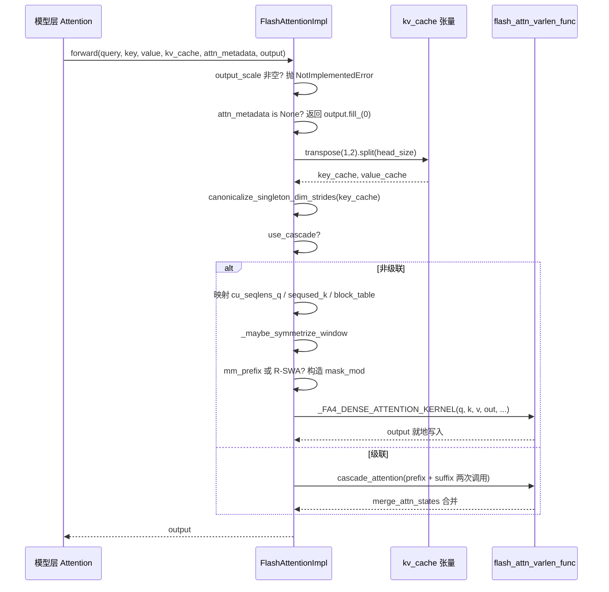

# 第 6 章：模型执行器与分布式并行：ModelRunner、Worker 与 Tensor/Pipeline Parallel

上一章我们看到 GPUModelRunner 如何把调度结果翻译成 input_ids、slot_mapping 和 block_table 等物理张量，并通过 forward_context 注入每一层。但真正消耗 GPU 时间的大头——注意力计算——还悬在半空。attn_metadata 里那些张量究竟被谁消费？FlashAttention、FlashInfer、Triton 这些实现凭什么能在同一套模型代码下互换？答案在 AttentionBackend 抽象层。它把“注意力怎么算”与“模型怎么调”解耦：模型层只持有 AttentionImpl 引用，调用统一的 forward(query, key, value, kv_cache, attn_metadata, output)；而具体后端负责把 block_table、slot_mapping、seq_lens 翻译成自家内核能吃的参数。本章以 FlashAttentionBackend 为主线，因为它同时覆盖了 PagedAttention 的 gather 语义、CUDA Graph 兼容、级联注意力、DCP 分布式上下文等最丰富的分支。读透它，其他后端只是参数映射的变体。这种“后端注册 + 统一接口”的设计动机很直接：注意力内核演进极快（FA2→FA3→FA4，FlashInfer 迭代，Triton 自研），如果模型层直接依赖某个具体内核，每次内核升级都要改模型代码。抽象层把变化隔离在 get_impl_cls() 一个工厂方法后面。

# 后端选择：能力声明与元数据构建

## 直觉模型

把 `AttentionBackend` 想成招聘启事：它不干活，只声明"我能处理哪些 dtype、哪些 head_size、哪些 KV cache 量化格式、哪些 attention 类型"。调度器拿着模型配置来匹配，匹配失败就换下一个候选人。若没有这层声明，系统会在运行时才发现"这个 head_size 内核不支持"，直接崩溃。

## 能力矩阵：字段即契约

`FlashAttentionBackend` 的类属性就是它的能力边界。`supported_dtypes` 限定 fp16/bf16 [FACT:vllm/v1/attention/backends/flash_attn.py:287-287](https://github.com/vllm-project/vllm/blob/7ba3df63cbe2e3e7aca19074bed2958311f46400/vllm/v1/attention/backends/flash_attn.py#L287-L287)；`supported_kv_cache_dtypes` 额外允许 fp8 系列 [FACT:vllm/v1/attention/backends/flash_attn.py:298-299](https://github.com/vllm-project/vllm/blob/7ba3df63cbe2e3e7aca19074bed2958311f46400/vllm/v1/attention/backends/flash_attn.py#L298-L299)。但"声明支持"不等于"无条件支持"——`supports_kv_cache_dtype` 对量化 KV 会进一步委托给 `flash_attn_supports_kv_cache_dtype` 做设备相关判断 [FACT:vllm/v1/attention/backends/flash_attn.py:431-438](https://github.com/vllm-project/vllm/blob/7ba3df63cbe2e3e7aca19074bed2958311f46400/vllm/v1/attention/backends/flash_attn.py#L431-L438)。

更精细的是 `supports_combination`：它接收 head_size、dtype、block_size、use_mla、has_sink 等一整套组合参数，返回 `None` 表示可用，返回字符串表示拒绝原因 [FACT:vllm/v1/attention/backends/flash_attn.py:454-507](https://github.com/vllm-project/vllm/blob/7ba3df63cbe2e3e7aca19074bed2958311f46400/vllm/v1/attention/backends/flash_attn.py#L454-L507)。例如 sink 在算力 < 9.0 上被拒 [FACT:vllm/v1/attention/backends/flash_attn.py:467-468](https://github.com/vllm-project/vllm/blob/7ba3df63cbe2e3e7aca19074bed2958311f46400/vllm/v1/attention/backends/flash_attn.py#L467-L468)，SM90 上 FP8 KV 配 mm_prefix 必须走 Triton [FACT:vllm/v1/attention/backends/flash_attn.py:472-472](https://github.com/vllm-project/vllm/blob/7ba3df63cbe2e3e7aca19074bed2958311f46400/vllm/v1/attention/backends/flash_attn.py#L472-L472)。这种"返回原因字符串"的设计让上层能给出可诊断的报错，而非静默回退。

block_size 的选择同样由能力驱动。默认返回 `MultipleOf(16)`，但 SM90 FP8-KV 强制 64 [FACT:vllm/v1/attention/backends/flash_attn.py:297-324](https://github.com/vllm-project/vllm/blob/7ba3df63cbe2e3e7aca19074bed2958311f46400/vllm/v1/attention/backends/flash_attn.py#L297-L324)，FA4 的 head_size=256 内核强制 `FA4_HD256_PAGE_SIZE` [FACT:vllm/v1/attention/backends/flash_attn.py:326-352](https://github.com/vllm-project/vllm/blob/7ba3df63cbe2e3e7aca19074bed2958311f46400/vllm/v1/attention/backends/flash_attn.py#L326-L352)。这解释了为什么 KV cache 的 block 大小不是随便定的——它被内核的 TMA tile 尺寸反向约束。

## 元数据结构：FlashAttentionMetadata 的字段布局

`FlashAttentionMetadata` 是 dataclass，字段分四组 [FACT:vllm/v1/attention/backends/flash_attn.py:511-566](https://github.com/vllm-project/vllm/blob/7ba3df63cbe2e3e7aca19074bed2958311f46400/vllm/v1/attention/backends/flash_attn.py#L511-L566)：

第一组是基础批描述：`num_actual_tokens`（去掉 padding 的真实 token 数）、`max_query_len`、`query_start_loc`（前缀和，用于 varlen 内核定位每条序列的起止）、`seq_lens`、`block_table`、`slot_mapping` [FACT:vllm/v1/attention/backends/flash_attn.py:520-526](https://github.com/vllm-project/vllm/blob/7ba3df63cbe2e3e7aca19074bed2958311f46400/vllm/v1/attention/backends/flash_attn.py#L520-L526)。注意源码注释里那张 ASCII 图 [FACT:vllm/v1/attention/backends/flash_attn.py:512-518](https://github.com/vllm-project/vllm/blob/7ba3df63cbe2e3e7aca19074bed2958311f46400/vllm/v1/attention/backends/flash_attn.py#L512-L518)，它精确区分了 `context_len`（历史 KV）、`query_len`（本次新增）、`seq_len`（两者之和）——这是理解 varlen 内核参数的关键。

第二组是级联注意力字段：`use_cascade`、`common_prefix_len`、`cu_prefix_query_lens` 等 [FACT:vllm/v1/attention/backends/flash_attn.py:528-533](https://github.com/vllm-project/vllm/blob/7ba3df63cbe2e3e7aca19074bed2958311f46400/vllm/v1/attention/backends/flash_attn.py#L528-L533)。

第三组是 DCP（Decode Context Parallel）字段：`max_dcp_context_kv_len`、`dcp_context_kv_lens`，以及区分 decode/prefill 请求数的计数器 [FACT:vllm/v1/attention/backends/flash_attn.py:535-544](https://github.com/vllm-project/vllm/blob/7ba3df63cbe2e3e7aca19074bed2958311f46400/vllm/v1/attention/backends/flash_attn.py#L535-L544)。

第四组是可选调度与特殊掩码：`scheduler_metadata`（FA3 AOT 调度用）、`causal`（可为 bool 或张量，支持逐序列因果）、`mm_prefix_query_range_tensor`（多模态双向范围）、R-SWA 相关字段 [FACT:vllm/v1/attention/backends/flash_attn.py:546-566](https://github.com/vllm-project/vllm/blob/7ba3df63cbe2e3e7aca19074bed2958311f46400/vllm/v1/attention/backends/flash_attn.py#L546-L566)。

> **〔设计推断与架构权衡〕**
> `causal` 字段类型是 `bool | torch.Tensor` 而非纯 bool，这是为了支持"同一批次里部分序列因果、部分非因果"的场景（如 PrefixLM）。当它是张量时，FA4 的 `dynamic_causal` 参数接管，FA2/FA3 会直接抛 NotImplementedError [FACT:vllm/v1/attention/backends/flash_attn.py:1429-1433](https://github.com/vllm-project/vllm/blob/7ba3df63cbe2e3e7aca19074bed2958311f46400/vllm/v1/attention/backends/flash_attn.py#L1429-L1433)。

## build() 的 Step-by-Step

代入场景：一个混合批次，3 条 decode 序列 + 2 条 prefill 序列，无级联、无 DCP。

第一步，从 `common_attn_metadata` 解包基础张量 [FACT:vllm/v1/attention/backends/flash_attn.py:824-832](https://github.com/vllm-project/vllm/blob/7ba3df63cbe2e3e7aca19074bed2958311f46400/vllm/v1/attention/backends/flash_attn.py#L824-L832)。第二步，决定是否启用 AOT 调度：`aot_schedule = self.aot_schedule and not fast_build and not envs.VLLM_BATCH_INVARIANT` [FACT:vllm/v1/attention/backends/flash_attn.py:836-838](https://github.com/vllm-project/vllm/blob/7ba3df63cbe2e3e7aca19074bed2958311f46400/vllm/v1/attention/backends/flash_attn.py#L836-L838)。`self.aot_schedule` 在 `__init__` 里由 `get_flash_attn_version() == 3` 决定 [FACT:vllm/v1/attention/backends/flash_attn.py:709-709](https://github.com/vllm-project/vllm/blob/7ba3df63cbe2e3e7aca19074bed2958311f46400/vllm/v1/attention/backends/flash_attn.py#L709-L709)——只有 FA3 支持预计算调度元数据。第三步，首次 build 时惰性填充 `aot_sliding_window`：遍历所有 `FlashAttentionImpl` 层收集滑窗配置，若配置唯一则采用，若多于一种则关闭 AOT [FACT:vllm/v1/attention/backends/flash_attn.py:848-851](https://github.com/vllm-project/vllm/blob/7ba3df63cbe2e3e7aca19074bed2958311f46400/vllm/v1/attention/backends/flash_attn.py#L848-L851)。

第四步，计算 `max_num_splits`。默认 0（让 FA3 用启发式），仅当启用 full CUDA graph 且 token 数在捕获范围内时才设为 `self.max_num_splits` [FACT:vllm/v1/attention/backends/flash_attn.py:856-866](https://github.com/vllm-project/vllm/blob/7ba3df63cbe2e3e7aca19074bed2958311f46400/vllm/v1/attention/backends/flash_attn.py#L856-L866)。注释解释了原因：`num_splits > 1` 会分配 `[num_splits, num_heads, num_tokens, head_size]` 的中间缓冲，显存代价高，只在 CUDA graph 场景值得 [FACT:vllm/v1/attention/backends/flash_attn.py:862-865](https://github.com/vllm-project/vllm/blob/7ba3df63cbe2e3e7aca19074bed2958311f46400/vllm/v1/attention/backends/flash_attn.py#L862-L865)。

第五步，走非级联非 DCP 分支，调用 `_get_scheduler_metadata` 生成 FA3 的调度元数据 [FACT:vllm/v1/attention/backends/flash_attn.py:976-986](https://github.com/vllm-project/vllm/blob/7ba3df63cbe2e3e7aca19074bed2958311f46400/vllm/v1/attention/backends/flash_attn.py#L976-L986)。第六步，`_store_scheduler_metadata` 处理 CUDA graph 场景：把新元数据拷进预分配缓冲，并把剩余部分清零 [FACT:vllm/v1/attention/backends/flash_attn.py:671-684](https://github.com/vllm-project/vllm/blob/7ba3df63cbe2e3e7aca19074bed2958311f46400/vllm/v1/attention/backends/flash_attn.py#L671-L684)。清零这一步至关重要——注释明确指出，否则某些 thread block 会读到无效元数据并覆写输出缓冲 [FACT:vllm/v1/attention/backends/flash_attn.py:671-672](https://github.com/vllm-project/vllm/blob/7ba3df63cbe2e3e7aca19074bed2958311f46400/vllm/v1/attention/backends/flash_attn.py#L671-L672)。

第七步，构造 `FlashAttentionMetadata` 并返回 [FACT:vllm/v1/attention/backends/flash_attn.py:992-1015](https://github.com/vllm-project/vllm/blob/7ba3df63cbe2e3e7aca19074bed2958311f46400/vllm/v1/attention/backends/flash_attn.py#L992-L1015)。

```mermaid
flowchart TD
    start["build(common_prefix_len, common_attn_metadata)"] --> unpack["解包 query_start_loc / seq_lens / block_table / slot_mapping"]
    unpack --> aot{"aot_schedule 且非 fast_build 且非 BATCH_INVARIANT?"}
    aot -->|是| sw_check{"aot_sliding_window 已初始化?"}
    aot -->|否| maxsplit
    sw_check -->|否, 首次| collect["_get_sliding_window_configs 收集层滑窗"]
    collect --> sw_unique{"配置数量 == 1?"}
    sw_unique -->|是| set_sw["设置 aot_sliding_window"]
    sw_unique -->|否, >1| disable_aot["self.aot_schedule = False"]
    set_sw --> maxsplit
    disable_aot --> maxsplit
    sw_check -->|是| maxsplit["计算 max_num_splits"]
    maxsplit --> cg_check{"use_full_cuda_graph 且 tokens |是| set_splits["max_num_splits = self.max_num_splits"]
    cg_check -->|否| zero_splits["max_num_splits = 0"]
    set_splits --> branch
    zero_splits --> branch
    branch{"dcp_world_size > 1?"}
    branch -->|是| dcp_path["计算 dcp_context_kv_lens, 可能 skip"]
    branch -->|否| cascade_check{"common_prefix_len > 0?"}
    cascade_check -->|是| cascade_path["构造 prefix/suffix 双份 scheduler_metadata"]
    cascade_check -->|否| normal_path["_get_scheduler_metadata 单份"]
    dcp_path --> store
    cascade_path --> store
    normal_path --> store
    store["_store_scheduler_metadata: CUDA graph 时拷入预分配缓冲并清零尾部"] --> build_meta["构造 FlashAttentionMetadata"]
    build_meta --> mm_check{"mm_req_doc_ranges 非空?"}
    mm_check -->|是| fill_mm["fill_mm_prefix_query_ranges + 拷贝到 GPU"]
    mm_check -->|否| rswa_check
    fill_mm --> rswa_check{"rswa_window 非空?"}
    rswa_check -->|是| copy_rswa["拷贝 prefix_lens 到持久缓冲"]
    rswa_check -->|否| done
    copy_rswa --> done["返回 attn_metadata"]
```

---

# forward()：从元数据到内核调用的完整链路

## 直觉模型

`forward()` 是后端的"总装车间"：它拿到模型层算好的 Q/K/V、KV cache 张量、以及上一步构建的元数据，把 KV cache 的物理布局调整成内核期望的形状，然后分派到具体内核。若没有这一步，内核会读到错误的内存布局，输出静默错误——比崩溃更难查。

## KV cache 的内存布局变换

vLLM 的 KV cache 物理形状是 `[num_blocks, num_kv_heads, block_size, 2 * head_size]`——K 和 V 拼在最后一维 [FACT:vllm/v1/attention/backends/flash_attn.py:1246-1247](https://github.com/vllm-project/vllm/blob/7ba3df63cbe2e3e7aca19074bed2958311f46400/vllm/v1/attention/backends/flash_attn.py#L1246-L1247)。但 FlashAttention 内核期望 K 和 V 分开，且布局为 `[num_blocks, block_size, num_kv_heads, head_size]`。

变换发生在 `forward()` 开头：`kv_cache.transpose(1, 2).split(self.head_size, dim=-1)` [FACT:vllm/v1/attention/backends/flash_attn.py:1310-1310](https://github.com/vllm-project/vllm/blob/7ba3df63cbe2e3e7aca19074bed2958311f46400/vllm/v1/attention/backends/flash_attn.py#L1310-L1310)。`transpose(1,2)` 把 `[blocks, heads, block_size, 2D]` 变成 `[blocks, block_size, heads, 2D]`，`split` 沿最后一维切成 K 和 V。注意 `transpose` 只改 stride 不搬数据，所以后续内核必须支持非连续访问。

紧接着是 `canonicalize_singleton_dim_strides` [FACT:vllm/v1/attention/backends/flash_attn.py:1310-1310](https://github.com/vllm-project/vllm/blob/7ba3df63cbe2e3e7aca19074bed2958311f46400/vllm/v1/attention/backends/flash_attn.py#L1310-L1310)。注释点明了动机：当 `num_kv_heads=1`（TP 场景常见）时，size-1 维度的 stride 是退化的，而 FA3/FA4 在 H100+ 上用 TMA，要求 stride 至少 16 字节对齐 [FACT:vllm/v1/attention/backends/flash_attn.py:1310-1310](https://github.com/vllm-project/vllm/blob/7ba3df63cbe2e3e7aca19074bed2958311f46400/vllm/v1/attention/backends/flash_attn.py#L1310-L1310)。这是一个典型的"逻辑上等价、物理上不合法"的陷阱。

## 非级联路径的参数流转

进入 `if not attn_metadata.use_cascade` 分支后，参数逐一映射 [FACT:vllm/v1/attention/backends/flash_attn.py:1326-1342](https://github.com/vllm-project/vllm/blob/7ba3df63cbe2e3e7aca19074bed2958311f46400/vllm/v1/attention/backends/flash_attn.py#L1326-L1342)：`cu_seqlens_q = query_start_loc`，`seqused_k = seq_lens`，`block_table = attn_metadata.block_table`。`descale_shape` 取 `(batch_size, num_kv_heads)`，用于 FP8 量化的 scale 广播——注释说明 flash-attn 期望 descale 形状是 `(num_sequences, num_kv_heads)`，用 `.expand()` 避免复制 [FACT:vllm/v1/attention/backends/flash_attn.py:1258-1258](https://github.com/vllm-project/vllm/blob/7ba3df63cbe2e3e7aca19074bed2958311f46400/vllm/v1/attention/backends/flash_attn.py#L1258-L1258)。

然后是滑窗的对称化处理。`_maybe_symmetrize_window` 的逻辑：因果滑窗 `(w, 0)` 在非因果场景下要变成 `(w, w)`，让双向 query 能往两个方向看 [FACT:vllm/v1/attention/backends/flash_attn.py:587-589](https://github.com/vllm-project/vllm/blob/7ba3df63cbe2e3e7aca19074bed2958311f46400/vllm/v1/attention/backends/flash_attn.py#L587-L589)。注释还强调"层自己的 window 优先于 group 的 window"，因为一个 KV cache group 可能同时容纳窗口层和全局层（如 Gemma-3 关闭 hybrid KV cache manager 时）[FACT:vllm/v1/attention/backends/flash_attn.py:1362-1365](https://github.com/vllm-project/vllm/blob/7ba3df63cbe2e3e7aca19074bed2958311f46400/vllm/v1/attention/backends/flash_attn.py#L1362-L1365)。

## 掩码分支：mm_prefix 与 R-SWA

当 `mm_prefix_query_ranges` 非空且满足 FA4 + 静态因果条件时，代码构造 CuTE-DSL 的 `mask_mod` [FACT:vllm/v1/attention/backends/flash_attn.py:1374-1407](https://github.com/vllm-project/vllm/blob/7ba3df63cbe2e3e7aca19074bed2958311f46400/vllm/v1/attention/backends/flash_attn.py#L1374-L1407)。关键动作是 `causal = False` 和 `sliding_window_size = None` [FACT:vllm/v1/attention/backends/flash_attn.py:1406-1407](https://github.com/vllm-project/vllm/blob/7ba3df63cbe2e3e7aca19074bed2958311f46400/vllm/v1/attention/backends/flash_attn.py#L1406-L1407)。注释解释了原因：mm_prefix 的语义是 `(causal ∧ window) ∨ bidirectional-range`，不是 causal 的子集；FA #155 之后设置 mask_mod 不再自动清除 causal/local，调用方必须显式关闭，否则内置 causal 路径会短路 mask_mod [FACT:vllm/v1/attention/backends/flash_attn.py:1402-1405](https://github.com/vllm-project/vllm/blob/7ba3df63cbe2e3e7aca19074bed2958311f46400/vllm/v1/attention/backends/flash_attn.py#L1402-L1405)。

`_make_mm_prefix_mask_mod` 用 `functools.cache` 缓存 [FACT:vllm/v1/attention/backends/flash_attn.py:1793-1802](https://github.com/vllm-project/vllm/blob/7ba3df63cbe2e3e7aca19074bed2958311f46400/vllm/v1/attention/backends/flash_attn.py#L1793-L1802)。注释给出硬核理由：FA4 的 `hash_callable` 会把闭包单元的 `repr()` 混入编译键，嵌套的 `_load_q_range` 每次调用地址不同，会导致每次 forward 都触发完整 JIT 重编译 [FACT:vllm/v1/attention/backends/flash_attn.py:1793-1802](https://github.com/vllm-project/vllm/blob/7ba3df63cbe2e3e7aca19074bed2958311f46400/vllm/v1/attention/backends/flash_attn.py#L1793-L1802)。这是生产环境性能陷阱的典型样本。

掩码内部有个坐标转换细节：FA4 传的是局部 `q_idx`（当前 prefill chunk 内 0-based），而 `kv_idx` 是绝对位置。代码用 `q_abs = q_idx + seqlen_k - seqlen_q` 恢复绝对位置 [FACT:vllm/v1/attention/backends/flash_attn.py:1859-1865](https://github.com/vllm-project/vllm/blob/7ba3df63cbe2e3e7aca19074bed2958311f46400/vllm/v1/attention/backends/flash_attn.py#L1859-L1865)。`__vec_size__ = 1` 的设定也有讲究：`_load_q_range` 读 lane 0，一次调用不能跨 query 行 [FACT:vllm/v1/attention/backends/flash_attn.py:1897-1897](https://github.com/vllm-project/vllm/blob/7ba3df63cbe2e3e7aca19074bed2958311f46400/vllm/v1/attention/backends/flash_attn.py#L1897-L1897)。

R-SWA 的 mask_mod 类似，但语义是 `causal & (in_prefix | in_window)` [FACT:vllm/v1/attention/backends/flash_attn.py:1945-1948](https://github.com/vllm-project/vllm/blob/7ba3df63cbe2e3e7aca19074bed2958311f46400/vllm/v1/attention/backends/flash_attn.py#L1945-L1948)，且 `use_fast_sampling = True` 让 FA4 跳过完全被掩码的 KV block，不加载其数据 [FACT:vllm/v1/attention/backends/flash_attn.py:1950-1950](https://github.com/vllm-project/vllm/blob/7ba3df63cbe2e3e7aca19074bed2958311f46400/vllm/v1/attention/backends/flash_attn.py#L1950-L1950)。

## FA4 hd256 的特殊处理

当 `self.fa4_hd256` 为真时，代码强制 page 对齐：`num_pages = cdiv(max_seqlen_k, FA4_HD256_PAGE_SIZE)`，`max_seqlen_k` 向上取整到页边界，`block_table` 截断到精确页数，`num_splits = 1` [FACT:vllm/v1/attention/backends/flash_attn.py:1442-1448](https://github.com/vllm-project/vllm/blob/7ba3df63cbe2e3e7aca19074bed2958311f46400/vllm/v1/attention/backends/flash_attn.py#L1442-L1448)。注释说明 hd256 内核要求页对齐长度、精确宽度 block table、且不支持 SplitKV。

最终调用 `_FA4_DENSE_ATTENTION_KERNEL(...)`，把 q、k、v、out、cu_seqlens_q、seqused_k、block_table、softcap、mask_mod、aux_tensors 等一并传入 [FACT:vllm/v1/attention/backends/flash_attn.py:1450-1475](https://github.com/vllm-project/vllm/blob/7ba3df63cbe2e3e7aca19074bed2958311f46400/vllm/v1/attention/backends/flash_attn.py#L1450-L1475)。

## KV cache 写入：do_kv_cache_update

`forward()` 只读 KV cache，写入由 `do_kv_cache_update` 完成。它调用 `reshape_and_cache_flash`，用 `slot_mapping` 把新算出的 K/V 散射写入 cache [FACT:vllm/v1/attention/backends/flash_attn.py:1532-1541](https://github.com/vllm-project/vllm/blob/7ba3df63cbe2e3e7aca19074bed2958311f46400/vllm/v1/attention/backends/flash_attn.py#L1532-L1541)。注释指出：`key`/`value` 是 padded 的而 `slot_mapping` 不是，但不需要手动切片，因为 op 用 `slot_mapping` 的 shape 决定实际 token 数 [FACT:vllm/v1/attention/backends/flash_attn.py:1527-1531](https://github.com/vllm-project/vllm/blob/7ba3df63cbe2e3e7aca19074bed2958311f46400/vllm/v1/attention/backends/flash_attn.py#L1527-L1531)。这里不做 stride 规范化，因为没有 TMA 内核参与 [FACT:vllm/v1/attention/backends/flash_attn.py:1520-1521](https://github.com/vllm-project/vllm/blob/7ba3df63cbe2e3e7aca19074bed2958311f46400/vllm/v1/attention/backends/flash_attn.py#L1520-L1521)。



---

# 设计思考：为什么这样写

> **〔设计推断与架构权衡〕**
> **能力声明与实现分离**。`supports_combination` 返回原因字符串而非 bool， 这是为了让上层在回退到其他后端时能记录"为什么没用 FA"，极大降低线上排查成本。相比静默回退，这种设计把决策依据显式化。

**CUDA Graph 兼容性是元数据设计的隐形约束**。`_store_scheduler_metadata` 的"拷入 + 清零尾部"模式 [FACT:vllm/v1/attention/backends/flash_attn.py:671-684](https://github.com/vllm-project/vllm/blob/7ba3df63cbe2e3e7aca19074bed2958311f46400/vllm/v1/attention/backends/flash_attn.py#L671-L684) 反复出现在 R-SWA 持久缓冲 [FACT:vllm/v1/attention/backends/flash_attn.py:787-798](https://github.com/vllm-project/vllm/blob/7ba3df63cbe2e3e7aca19074bed2958311f46400/vllm/v1/attention/backends/flash_attn.py#L787-L798) 和 mm_prefix 暂存区 [FACT:vllm/v1/attention/backends/flash_attn.py:800-813](https://github.com/vllm-project/vllm/blob/7ba3df63cbe2e3e7aca19074bed2958311f46400/vllm/v1/attention/backends/flash_attn.py#L800-L813) 中。共同模式是：在 `__init__` 里预分配最大尺寸的持久缓冲，`build()` 里只做拷贝不做分配。原因在注释里点明——CUDA graph 捕获期间不能有分配操作 [FACT:vllm/v1/attention/backends/flash_attn.py:1044-1046](https://github.com/vllm-project/vllm/blob/7ba3df63cbe2e3e7aca19074bed2958311f46400/vllm/v1/attention/backends/flash_attn.py#L1044-L1046)。

**DCP 与 fused draft decode 的互斥**。`supports_draft_decode_metadata_update = self.dcp_world_size == 1` [FACT:vllm/v1/attention/backends/flash_attn.py:742-742](https://github.com/vllm-project/vllm/blob/7ba3df63cbe2e3e7aca19074bed2958311f46400/vllm/v1/attention/backends/flash_attn.py#L742-L742)。注释解释：fused draft decode 跨 draft 步复用捕获的元数据对象，但 DCP 的 build-time 主机侧决策（如 `skip_dcp_context_attention()`）会改变元数据形状，这些 Python 字段在 graph replay 之间不会原地刷新 [FACT:vllm/v1/attention/backends/flash_attn.py:736-741](https://github.com/vllm-project/vllm/blob/7ba3df63cbe2e3e7aca19074bed2958311f46400/vllm/v1/attention/backends/flash_attn.py#L736-L741)。这是一个"性能优化与正确性冲突时选择正确性"的典型取舍。

**级联注意力的启发式门槛**。`use_cascade_attention` 用一串阈值过滤：common_prefix_len < 256 直接拒绝 [FACT:vllm/v1/attention/backends/flash_attn.py:1967-1967](https://github.com/vllm-project/vllm/blob/7ba3df63cbe2e3e7aca19074bed2958311f46400/vllm/v1/attention/backends/flash_attn.py#L1967-L1967)，alibi/sliding_window/local_attention 不支持 [FACT:vllm/v1/attention/backends/flash_attn.py:1978-1979](https://github.com/vllm-project/vllm/blob/7ba3df63cbe2e3e7aca19074bed2958311f46400/vllm/v1/attention/backends/flash_attn.py#L1978-L1979)，请求数 < 8 拒绝 [FACT:vllm/v1/attention/backends/flash_attn.py:1982-1984](https://github.com/vllm-project/vllm/blob/7ba3df63cbe2e3e7aca19074bed2958311f46400/vllm/v1/attention/backends/flash_attn.py#L1982-L1984)，DCP 场景禁用 [FACT:vllm/v1/attention/backends/flash_attn.py:1985-1987](https://github.com/vllm-project/vllm/blob/7ba3df63cbe2e3e7aca19074bed2958311f46400/vllm/v1/attention/backends/flash_attn.py#L1985-L1987)。通过后还要用粗略性能模型比较 cascade 与 FlashDecoding 的 CTA 数和 wave 数 [FACT:vllm/v1/attention/backends/flash_attn.py:2011-2029](https://github.com/vllm-project/vllm/blob/7ba3df63cbe2e3e7aca19074bed2958311f46400/vllm/v1/attention/backends/flash_attn.py#L2011-L2029)。注释坦承这个模型"very rough" [FACT:vllm/v1/attention/backends/flash_attn.py:2009-2010](https://github.com/vllm-project/vllm/blob/7ba3df63cbe2e3e7aca19074bed2958311f46400/vllm/v1/attention/backends/flash_attn.py#L2009-L2010)。

**生产踩坑点**：`forward()` 里有一段醒目注释，警告 piece-wise CUDA graph 下此方法在 eager 模式执行，`view`/`slice` 等看似无 GPU 操作的方法实际很慢，改动必须 benchmark [FACT:vllm/v1/attention/backends/flash_attn.py:1277-1284](https://github.com/vllm-project/vllm/blob/7ba3df63cbe2e3e7aca19074bed2958311f46400/vllm/v1/attention/backends/flash_attn.py#L1277-L1284)。这解释了为什么代码里大量使用 `[:num_actual_tokens]` 切片而非更"优雅"的写法——每一处都是性能权衡的结果。

---

# 本章小结

本章沿 `FlashAttentionBackend` 走完了注意力后端的完整生命周期：能力声明（`supports_*` 系列）→ 元数据构建（`build()` 把 `CommonAttentionMetadata` 翻译成 `FlashAttentionMetadata`）→ 内核调用（`forward()` 变换 KV cache 布局、构造掩码、分派到 FA 内核）。核心机制包括：KV cache 的 `transpose+split` 布局变换、退化 stride 的规范化、CUDA graph 下的持久缓冲模式、mm_prefix/R-SWA 的 CuTE-DSL 掩码构造、以及级联注意力的启发式决策。

关键设计原则：能力声明与实现分离、CUDA graph 兼容性驱动元数据预分配、性能优化与正确性冲突时优先正确性（DCP 禁用 fused draft decode）。

下一章将转向采样与输出：`logits` 如何经处理器链（温度、top-p、惩罚项）变成 token，结构化输出如何约束解码，以及流式返回如何与调度器协作。

# 本章思考与自测

Q1: 如果把 `_store_scheduler_metadata` 中的 `self.scheduler_metadata[n:] = 0` 清零操作删掉，在什么场景下会导致输出错误？为什么注释特别强调这一点？

**参考解析**：`_store_scheduler_metadata` 在 CUDA graph 场景下把新元数据拷入预分配缓冲的前 n 个位置 [FACT:vllm/v1/attention/backends/flash_attn.py:671-684](https://github.com/vllm-project/vllm/blob/7ba3df63cbe2e3e7aca19074bed2958311f46400/vllm/v1/attention/backends/flash_attn.py#L671-L684)。如果不清零尾部，上一次 build 残留的调度元数据会被本次内核读到。注释明确指出"some thread blocks may use the invalid scheduler metadata and overwrite the output buffer" [FACT:vllm/v1/attention/backends/flash_attn.py:671-672](https://github.com/vllm-project/vllm/blob/7ba3df63cbe2e3e7aca19074bed2958311f46400/vllm/v1/attention/backends/flash_attn.py#L671-L672)。触发场景：批次大小从大变小（如从 8 条序列降到 3 条），缓冲区前 3 个位置是新数据，但第 4-8 个位置还是旧批次的数据。FA3 的调度元数据包含 tile 分配信息，内核按 batch_size 读取时若 batch_size 计算有偏差或内核按固定 stride 扫描，就会读到脏数据并写坏输出。这是 CUDA graph 复用缓冲的经典陷阱：缓冲区生命周期跨越多次 replay，必须显式清理。

Q2: `_make_mm_prefix_mask_mod` 用 `functools.cache` 缓存，注释说否则会"force a full JIT recompile every forward"。如果去掉这个缓存装饰器，性能会退化多少？为什么 FA4 的编译键会受闭包地址影响？

**参考解析**：注释解释 FA4 的 `hash_callable` 会把闭包单元的 `repr()` 混入编译键 [FACT:vllm/v1/attention/backends/flash_attn.py:1793-1802](https://github.com/vllm-project/vllm/blob/7ba3df63cbe2e3e7aca19074bed2958311f46400/vllm/v1/attention/backends/flash_attn.py#L1793-L1802)。`_make_mm_prefix_mask_mod` 内部定义了嵌套函数 `_load_q_range`，每次调用工厂函数都会创建新的函数对象，其 `repr()` 包含内存地址，地址每次不同 → 编译键每次不同 → FA4 认为需要重新 JIT 编译。缓存后相同 `(sliding_window, sliding_window_left)` 参数复用同一函数对象，编译键稳定。性能退化程度取决于 FA4 编译耗时，但可以确定是"每次 forward 都触发完整编译"，在 decode 循环中每步都编译一次，延迟会从毫秒级退化到秒级。这是"看似无害的 Python 闭包"引发 JIT 缓存失效的典型案例。

Q3: `supports_draft_decode_metadata_update = self.dcp_world_size == 1` 这行代码在 DCP 场景下禁用了 fused draft decode。假设你强行把它改成 `True`，在投机解码 + DCP 的组合下会出现什么具体错误？

**参考解析**：注释说明 fused draft decode 跨 draft 步复用捕获的元数据对象，而 DCP 的 build-time 主机侧决策（如 `skip_dcp_context_attention()`）会改变元数据形状/控制路径，例如 `max_dcp_context_kv_len` [FACT:vllm/v1/attention/backends/flash_attn.py:736-741](https://github.com/vllm-project/vllm/blob/7ba3df63cbe2e3e7aca19074bed2958311f46400/vllm/v1/attention/backends/flash_attn.py#L736-L741)。这些 Python 字段在 CUDA graph replay 之间不会原地刷新。具体错误：draft 步之间序列长度增长，`skip_dcp_context_attention` 的判定可能从 True 变 False（或反之），但复用的元数据对象仍保留旧值。若旧值是 `max_dcp_context_kv_len = 0`，内核会走"无 DCP context"路径 [FACT:vllm/v1/attention/backends/flash_attn.py:1565-1589](https://github.com/vllm-project/vllm/blob/7ba3df63cbe2e3e7aca19074bed2958311f46400/vllm/v1/attention/backends/flash_attn.py#L1565-L1589)，跳过跨 rank 的 context 注意力，导致输出缺失上下文信息——静默错误，不崩溃。这正是"性能优化与正确性冲突时选择正确性"的体现。

至此，注意力后端从抽象接口到内核实现的完整链路已经打通：模型层通过 AttentionImpl 统一调用，后端负责将 block_table、slot_mapping 等元数据翻译为具体内核参数，而 FlashAttentionBackend 的 PagedAttention 实现则展示了分页 KV Cache 下的 gather 语义与 CUDA Graph 兼容策略。但注意力计算产出的只是隐藏状态，模型最终要输出的是下一个 token。这些隐藏状态如何变成 logits，logits 又如何经过采样与后处理，最终以流式文本返回给客户端？下一章将追踪这最后一公里。
