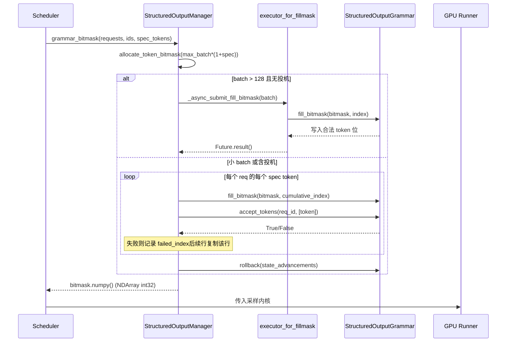

# 第 7 章：CUDA Graph 与执行加速：静态图捕获与低延迟调度

上一章我们追踪了注意力后端如何把 block table 翻译成内核参数，在非连续显存上完成 gather 式注意力计算。但注意力产出的只是隐藏状态——模型真正要交付给用户的是下一个 token 的文本。本章追踪这最后一公里：隐藏状态经 lm_head 投影为 logits 后，如何穿过一条精心排序的处理器链（温度、惩罚、top-k/top-p、结构化约束），被采样成 token id，再经 detokenizer 还原为文本并流式推送。这条链路上任何一步顺序错乱或状态泄漏，都会让输出质量静默劣化。

# Sampler：处理器链的顺序即正确性

**直觉模型**：Sampler 像一条装配流水线，logits 是待加工的毛坯。流水线上每个工位（processor）都会修改毛坯，而工位的先后顺序直接决定成品——先削再磨和先磨再削得到的是两种东西。若没有这条链，模型只能输出原始概率分布，用户拿到的就是无法控制温度、无法抑制重复、无法约束格式的"裸采样"。

## 数据结构与内存布局

Sampler 本身是 `nn.Module`，但它的核心状态极薄：只持有 `topk_topp_sampler` 子模块、`logprobs_mode` 与 `use_fp64_gumbel` 标志 [FACT:vllm/v1/sample/sampler.py:61-64]。真正的批级状态全部封装在 `SamplingMetadata` 中，由 forward 参数传入。这种"无状态 Sampler + 外部元数据"的设计是刻意的：Sampler 实例在引擎生命周期内只创建一次，而每个 decode step 的批组成都在变，把状态外置才能让 Sampler 被 CUDA Graph 捕获后安全重放。

关键常量是 `_SAMPLING_EPS = 1e-5` [FACT:vllm/v1/sample/sampler.py:18]。它同时充当两个语义：温度低于此值视为贪心，以及 `apply_temperature` 中防止除零的兜底。

## Step-by-Step Walkthrough

代入场景：一个 batch 中混合了贪心请求与随机采样请求，部分请求还开了 logprobs。

**第一步，快照原始 logprobs。** 在施加任何惩罚或温度之前，若请求需要 logprobs，先按 `logprobs_mode` 决定快照内容 [FACT:vllm/v1/sample/sampler.py:84-93]。注意注释明确点出与 V0 的差异：V1 用**原始 logits**（惩罚与温度之前）计算 top-k logprobs [FACT:vllm/v1/sample/sampler.py:72-77]。这是语义契约——用户看到的 logprob 应反映模型真实分布，而非被惩罚扭曲后的分布。

**第二步，统一到 float32。** [FACT:vllm/v1/sample/sampler.py:95-96] 无论输入是 bf16 还是 fp16，都上转 float32。原因是后续的 log_softmax、top-k、累积概率在低精度下会累积误差，尤其在 vocab 达 15 万时。

**第三步，非 argmax 不变处理器链。** `apply_logits_processors` 依次施加：allowed token 白名单掩码、bad words 排除、`non_argmax_invariant` 处理器、惩罚项 [FACT:vllm/v1/sample/sampler.py:391-404]。这里的分类是核心设计——`non_argmax_invariant` 指那些**会改变贪心结果**的处理器（如 min_tokens、logit_bias），它们必须在贪心采样之前生效；而 `argmax_invariant` 处理器（如 min_p）不改变 argmax，可以推迟到温度之后。

**第四步，采样。** `sample` 方法先判断是否全随机 [FACT:vllm/v1/sample/sampler.py:256-271]：若 `all_greedy`，直接 argmax 返回；否则先算贪心结果备用，再施加温度、argmax 不变处理器、top-k/top-p [FACT:vllm/v1/sample/sampler.py:275-291]。最后用 `torch.where` 按温度阈值在贪心与随机结果间选择 [FACT:vllm/v1/sample/sampler.py:305-306]，并复用 `greedy_sampled` 张量作为输出缓冲，避免额外分配。

**第五步，收集 logprobs 并封装输出。** 按 `num_logprobs` 分三种情况：None 只返回指定 token 的 logprobs；-1 返回全量未排序 logprobs；否则 top-k [FACT:vllm/v1/sample/sampler.py:120-131]。最终 token id 转 int32 压缩体积，扩展为 `[num_requests, 1]` 的二维张量 [FACT:vllm/v1/sample/sampler.py:138-148]。

```mermaid
flowchart TD
    in_logits["logits (bf16/fp16)"] --> snap{"需要 logprobs?"}
    snap -->|是| raw["compute_logprobs / cloneraw_logprobs 快照"]
    snap -->|否| f32
    raw --> f32["logits.to(float32)"]
    f32 --> proc["apply_logits_processors"]
    proc --> mask{"allowed_token_ids_mask?"}
    mask -->|是| fill["masked_fill_(-inf)"]
    mask -->|否| bad
    fill --> bad{"bad_words_token_ids?"}
    bad -->|是| apply_bad["apply_bad_words"]
    bad -->|否| noninv
    apply_bad --> noninv["non_argmax_invariant 处理器"]
    noninv --> pen["apply_penalties"]
    pen --> sample["sample()"]
    sample --> allg{"all_greedy?"}
    allg -->|是| greedy["greedy_sample (argmax)"]
    allg -->|否| temp["apply_temperature"]
    temp --> arginv["argmax_invariant 处理器"]
    arginv --> topp["topk_topp_sampler"]
    topp --> where["torch.where(temp  out
    where --> out["SamplerOutputsampled_token_ids"]
```

## 设计思考与踩坑

**为什么惩罚项必须在温度之前？** 温度是对分布的缩放，惩罚是对特定 token 的加减分。若先缩放再惩罚，惩罚的绝对幅度会被温度放大或缩小，导致同一组惩罚参数在不同温度下行为不一致。V1 把惩罚固定在温度前，保证了参数语义的稳定性。

**`mark_unbacked` 的编译陷阱。** 在 `gather_logprobs` 中，`batched_count_greater_than` 被编译，而 batch 维度从 1 变到 ≥2 时会触发 dynamo 的 0/1 特化重编译 [FACT:vllm/v1/sample/sampler.py:345-348]。`mark_unbacked` 把该维度标记为完全符号化，避免这次重编译。生产环境中若看到 decode 首个请求后突然卡顿一次，很可能就是这类重编译。

**`gpu_sync_allowed` 的同步边界。** `batched_count_greater_than` 内部可能触发 GPU 同步，vLLM 用 `gpu_sync_allowed(first_only=True)` 上下文显式声明"这里允许同步，但只允许第一次" [FACT:vllm/v1/sample/sampler.py:345-348]。若在 CUDA Graph 捕获区内意外同步，会导致捕获失败——这是排查图捕获问题的关键线索。

# 结构化输出：位掩码与语法的双轨状态机

**直觉模型**：结构化输出像给采样器戴上一副"语法眼镜"——每一步只能看见符合 JSON schema 或文法的 token。若没有它，模型可能生成语法错误的 JSON，下游解析器直接崩溃。vLLM 的实现精髓在于：语法状态机在 CPU 侧推进，而约束以位掩码形式传给 GPU 侧采样。

## 数据结构与内存布局

`StructuredOutputManager` 是引擎级单例，持有 `backend`（xgrammar/guidance/outlines/lm-format-enforcer 之一）、`reasoner_cls` 与两个线程池 [FACT:vllm/v1/structured_output/__init__.py:39-98]。

位掩码是核心数据结构：`_grammar_bitmask` 是形状为 `[max_batch_size * (1 + max_num_spec_tokens), vocab_size/32]` 的 int32 张量 [FACT:vllm/v1/structured_output/__init__.py:327-336]。每个 bit 对应一个 token 是否合法。`_full_mask = torch.tensor(-1, dtype=torch.int32)` 表示"全 1"——所有 token 合法 [FACT:vllm/v1/structured_output/__init__.py:59]。

两个线程池分工明确：`executor` 负责语法编译（CPU 密集，worker 数为 CPU 数一半）[FACT:vllm/v1/structured_output/__init__.py:71-78]；`executor_for_fillmask` 负责大 batch 位掩码并行填充，仅在 batch 超过 128 时启用 [FACT:vllm/v1/structured_output/__init__.py:62-69]。

## Step-by-Step Walkthrough

**语法初始化。** 请求首次进入时 `grammar_init` 被调用 [FACT:vllm/v1/structured_output/__init__.py:115-176]。若 backend 未初始化则按配置选择实现 [FACT:vllm/v1/structured_output/__init__.py:130-165]。随后提交编译任务：默认走异步 `executor.submit`，但在 `external_launcher` 模式下必须同步 [FACT:vllm/v1/structured_output/__init__.py:167-176]。

**位掩码生成。** 每个 decode step，`grammar_bitmask` 为批内所有结构化请求生成掩码 [FACT:vllm/v1/structured_output/__init__.py:314-442]。大 batch 走并行路径：按 16 个一批提交到线程池 [FACT:vllm/v1/structured_output/__init__.py:346-373]。小 batch 走串行路径，逐 token 推进语法状态 [FACT:vllm/v1/structured_output/__init__.py:374-433]。

**投机解码下的掩码对齐。** 这是最精妙的部分。当有 draft token 时，每个请求需要 `1 + max_num_spec_tokens` 行掩码。串行路径逐 token 处理：若某 draft token 被语法拒绝，记录 `failed_index`，后续行直接复制该行的掩码 [FACT:vllm/v1/structured_output/__init__.py:396-418]。这保证了"draft 被拒后，后续位置的约束状态回退到拒绝点"。

**状态回滚。** 位掩码填充过程中语法状态被推进了 `state_advancements` 步，但 draft token 尚未被真正接受，因此必须 `grammar.rollback(state_advancements)` 回退 [FACT:vllm/v1/structured_output/__init__.py:422-430]。真正接受发生在 `accept_tokens` [FACT:vllm/v1/structured_output/__init__.py:444-466]。



## 设计思考与踩坑

**为什么 external_launcher 必须同步编译？** 注释给出了精确原因：异步编译会让 `WAITING_FOR_STRUCTURED_OUTPUT_GRAMMAR → WAITING` 状态转换在不同 TP rank 上发生于不同时刻，破坏 external_launcher 依赖的确定性假设 [FACT:vllm/v1/structured_output/__init__.py:47-56]。这是分布式确定性与异步优化冲突的典型案例。

**推理模型下的约束起点。** `_get_constraint_start` 决定从第几个 token 开始施加语法约束 [FACT:vllm/v1/structured_output/__init__.py:220-292]。对于带思维链的模型，reasoning 阶段不应受 JSON 约束，只有 reasoning 结束后才启动。`enable_in_reasoning` 为 True 时直接返回 0（全程约束）[FACT:vllm/v1/structured_output/__init__.py:235-236]。若 reasoner 支持 `find_reasoning_end_offset`，用它精确定位 [FACT:vllm/v1/structured_output/__init__.py:261-267]；否则回退到逐 token 回退搜索 [FACT:vllm/v1/structured_output/__init__.py:287-291]。

**`validate_tokens` 的前缀语义。** 投机解码时 draft token 可能违反语法，`validate_tokens` 返回"最长合法前缀" [FACT:vllm/v1/structured_output/__init__.py:294-312]。注意它先剥离投机填充（-1），再计算约束起点，最后只对约束区间内的 token 做语法校验。

# Detokenizer：增量解码与 stop string 的边界博弈

**直觉模型**：detokenizer 像一位逐字誊抄的书记员，把 token id 翻译成人类可读文本。难点在于：token 与字符不是一一对应（一个 token 可能只对应半个 UTF-8 字符），且 stop string 可能横跨多个 token。若没有增量解码，每步都要从头解码整个序列，O(n²) 的开销会拖垮吞吐。

## 数据结构与内存布局

`IncrementalDetokenizer` 基类只持 `token_ids` 列表 [FACT:vllm/v1/engine/detokenizer.py:32-33]。`BaseIncrementalDetokenizer` 增加了 stop 相关字段：`stop` 列表、`min_tokens`、`include_stop_str_in_output`、`stop_buffer_length` 与 `_last_output_text_offset` [FACT:vllm/v1/engine/detokenizer.py:70-94]。

`stop_buffer_length` 是关键：当 stop string 不包含在输出中时，它等于最长 stop string 长度减一 [FACT:vllm/v1/engine/detokenizer.py:87-90]。这个"回退缓冲"确保流式输出不会提前吐出可能是 stop string 前缀的字符。

两条实现路径：`FastIncrementalDetokenizer` 用 tokenizers 库的 `DecodeStream` [FACT:vllm/v1/engine/detokenizer.py:166-246]；`SlowIncrementalDetokenizer` 用 Python 侧 `detokenize_incrementally` [FACT:vllm/v1/engine/detokenizer.py:249-305]。选择依据是 tokenizers 版本 ≥ 0.22.0 且 tokenizer 类型匹配 [FACT:vllm/v1/engine/detokenizer.py:32-33][FACT:vllm/v1/engine/detokenizer.py:61-63]。

## Step-by-Step Walkthrough

**增量解码。** `update` 接收新 token ids 与 `stop_terminated` 标志 [FACT:vllm/v1/engine/detokenizer.py:96-142]。若 stop 终止且不包含 stop string，则最后一个 token 被排除在解码外 [FACT:vllm/v1/engine/detokenizer.py:107-111]。随后逐 token 调用 `decode_next` 累积文本 [FACT:vllm/v1/engine/detokenizer.py:117-122]。

**stop string 检测。** `check_stop_strings` 只在新增字符范围内搜索 [FACT:vllm/v1/engine/detokenizer.py:308-360]。搜索起点是 `1 - new_char_count - stop_string_len` [FACT:vllm/v1/engine/detokenizer.py:338]，这个偏移确保跨 token 边界的 stop string 也能被捕获。多个 stop string 同时匹配时，选择**最早完成**的那个 [FACT:vllm/v1/engine/detokenizer.py:342-347]。

**流式输出切片。** `get_next_output_text` 按 `delta` 参数决定返回全量还是增量 [FACT:vllm/v1/engine/detokenizer.py:148-163]。未完成时保留 `stop_buffer_length` 个字符不吐 [FACT:vllm/v1/engine/detokenizer.py:145-146]，用 `_last_output_text_offset` 记录已发送位置 [FACT:vllm/v1/engine/detokenizer.py:148-163]。

**异常恢复。** `FastIncrementalDetokenizer._protected_step` 处理两类异常：OverflowError/TypeError 记录日志返回 None [FACT:vllm/v1/engine/detokenizer.py:225-229]；"Invalid prefix" 错误则**重建 DecodeStream** 并重试 [FACT:vllm/v1/engine/detokenizer.py:222-246]。后者应对 tokenizer 产生非单调 UTF-8 输出的边界情况。

## 设计思考与踩坑

**stop_buffer_length 的权衡。** 缓冲越长，流式延迟越大（用户看到文字的时间推后），但越不容易漏检跨 token 的 stop string。取"最长 stop string 长度减一"是精确下界：任何 stop string 的前缀最多这么长。

**min_tokens 与 stop_check_offset。** 当输出 token 数未达 `min_tokens` 时，`stop_check_offset` 被持续推到文本末尾 [FACT:vllm/v1/engine/detokenizer.py:120-122]，意味着这段文本不会被 stop 检测。这防止了模型在开头就撞上 stop string 导致空输出。

**Fast 路径的 added_token_ids 缓存。** 当 `spaces_between_special_tokens` 为 False 时，需要抑制特殊 token 间的空格 [FACT:vllm/v1/engine/detokenizer.py:192-207]。代码把 `added_token_ids` 缓存在 tokenizer 对象上 [FACT:vllm/v1/engine/detokenizer.py:195-200]，避免每次 decode 都重建字典。

# 设计思考

三个模块共享一条设计哲学：**把状态推进与约束检查分离，让 GPU 侧只做无状态的张量运算**。Sampler 无状态，状态在 `SamplingMetadata`；语法状态机在 CPU 侧推进，GPU 只消费位掩码；detokenizer 的 `_last_output_text_offset` 是唯一的流式游标。这种分离让每个 GPU 侧组件都能被 CUDA Graph 捕获。

另一条主线是**顺序即语义**。Sampler 的处理器链顺序、结构化输出的约束起点、detokenizer 的 stop 检测偏移，任何一处顺序错误都不会崩溃，只会静默产出错误结果——这正是这类代码最难调试之处。

# 本章小结

- Sampler 的处理器链严格排序：原始 logprobs 快照 → float32 → 白名单/bad words → non-argmax-invariant → 惩罚 → 温度 → argmax-invariant → top-k/top-p。
- 结构化输出用位掩码把 CPU 侧语法状态传给 GPU，投机解码下通过 `failed_index` 复制与 `rollback` 保证状态一致。
- Detokenizer 用 `stop_buffer_length` 回退缓冲平衡流式延迟与 stop string 跨 token 检测，Fast 路径依赖 tokenizers ≥ 0.22.0 的 `DecodeStream`。

# 本章思考与自测

Q1: 若把 `apply_logits_processors` 中惩罚项（`apply_penalties`）移到温度之后执行，在 temperature=2.0 的高温采样场景下会出现什么具体偏差？为什么？

**参考解析**：温度是对整个 logits 向量的缩放（`logits.div_(temp)`）[FACT:vllm/v1/sample/sampler.py:241-242]。惩罚项（如 repetition penalty）是对特定 token 的乘性/加性调整。若先缩放再惩罚，惩罚的绝对幅度会被温度放大 2 倍，导致同一组 `repetition_penalty` 参数在高温下抑制效果远强于低温，参数语义随温度漂移。V1 把惩罚固定在温度前 [FACT:vllm/v1/sample/sampler.py:403-404]，保证惩罚幅度与温度解耦。此外，惩罚属于 `non_argmax_invariant` 类别（会影响贪心结果），而贪心路径在温度之前就已返回 [FACT:vllm/v1/sample/sampler.py:261-271]，若移到温度后，贪心请求将完全绕过惩罚，行为不一致。

Q2: 在 `grammar_bitmask` 的串行路径中，若把 `grammar.rollback(state_advancements)` [FACT:vllm/v1/structured_output/__init__.py:422-430] 这行删除，在投机解码 + 结构化输出的组合下会发生什么？请结合 `accept_tokens` 的调用时机分析。

**参考解析**：位掩码填充时，代码对每个 draft token 调用 `grammar.accept_tokens` 推进语法状态以生成下一位置的掩码 [FACT:vllm/v1/structured_output/__init__.py:396-418]，但这只是"试探性推进"——draft token 尚未被目标模型验证接受。若删除 `rollback`，语法状态会永久停留在"所有 draft 都被接受"的位置。当目标模型实际拒绝了部分 draft token 时，真正接受的 token 序列与语法状态不匹配：`accept_tokens` [FACT:vllm/v1/structured_output/__init__.py:444-466] 会基于错误的语法状态校验，导致合法 token 被拒或非法 token 被放行。结果是 JSON 输出静默损坏，不崩溃但下游解析失败。

Q3: `check_stop_strings` 的搜索起点是 `1 - new_char_count - stop_string_len` [FACT:vllm/v1/engine/detokenizer.py:338]。若改成从 0 开始全量搜索，功能上是否正确？在长序列流式场景下会带来什么性能问题？

**参考解析**：功能上正确——从 0 搜索能找到所有匹配，包括跨 token 边界的。但性能上，每步都对整个 `output_text` 做 `find`，复杂度从 O(new_char_count) 退化为 O(total_length)，长序列下是 O(n²)。更严重的是，从 0 搜索可能匹配到**已经发送给用户的历史文本**中的 stop string 子串，导致重复触发 stop 或错误截断。原设计的偏移 `1 - new_char_count - stop_string_len` 精确覆盖"新增字符 + 可能跨界的 stop string 前缀"这一最小必要窗口，既保证不漏检又避免历史误匹配。

至此，单机上的推理全链路已经打通：从注意力计算到采样输出，每个环节都直接影响最终交付的文本质量。但当模型规模超出单卡容量时，这条链路必须跨越多个设备协同完成。下一章我们将离开单机，进入分布式并行：TP、PP、EP 如何切分模型，通信原语如何在 rank 间同步这些采样结果。
