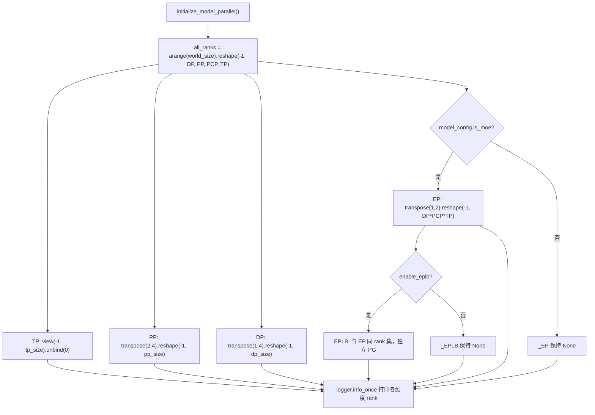
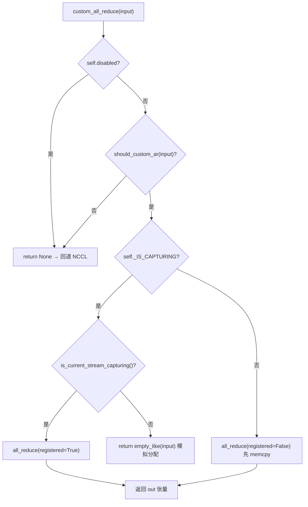

# 第 8 章：KV 传输与多节点缓存：Prefix Caching 与 Chunked Prefill

上一章我们走完了单次推理生命周期的最后一公里，从 logits 采样到流式输出。但当模型大到单卡放不下时，这条流水线就必须被切分到多个设备上协同执行。分布式推理的第一性问题不是“怎么切模型”，而是“切完之后，谁和谁说话、用什么方式说话”。vLLM 把这两个问题分别交给 parallel_state.py 的进程组拓扑和 custom_all_reduce.py 的通信器实现。本章沿着“建组 → 切分 → 通信 → 负载再平衡”这条链路，逐层拆开 TP、PP、EP 的并行策略与底层通信原语。

# 8.1 进程组拓扑：一张 rank 网格如何切出 TP/PP/DP/EP

## 直觉模型

把 8 张 GPU 想成一张 8 个座位的长桌。张量并行（Tensor Parallelism，TP）要求"同桌的人必须同时举杯"，流水线并行（Pipeline Parallelism，PP）要求"相邻座位接力传菜"，数据并行（Data Parallelism，DP）要求"不同桌各吃各的但最后对账"，专家并行（Expert Parallelism，EP）要求"token 按科室分诊"。若没有统一的座位编排，每个模块各自 `new_group`，就会出现"我以为你在 TP 组里，其实你在 DP 组里"的通信错位——集合通信一旦有 rank 缺席，NCCL 会直接挂死而非报错。

## 数据结构与内存布局

`GroupCoordinator` 是这一切的载体。它的字段设计直接对应"一个进程在多个并行维度上的多重身份"：

- `rank` 是全局 rank，`ranks` 是本组成员全局 rank 列表，`world_size` 是组大小 [FACT:vllm/distributed/parallel_state.py:434-436]。
- `local_rank` 用于绑定设备，`rank_in_group` 是组内序号——源码用一张表精确区分二者：跨两节点的 4 卡组里，rank 2 的 `local_rank` 是 0（它在节点 1 上是第一张卡），但 `rank_in_group` 是 2 [FACT:vllm/distributed/parallel_state.py:437-445]。
- `cpu_group` 与 `device_group` 成对存在：前者走 gloo 做元数据/对象通信，后者走 NCCL 做张量通信 [FACT:vllm/distributed/parallel_state.py:446-447]。

这里有个关键设计：**为什么每个组都要维护一个 CPU 组？** 因为 `broadcast_object`、`send_object` 这类操作传输的是 Python 对象（序列化后的字节），走 NCCL 既浪费显存又可能污染当前 CUDA 设备。`barrier()` 的注释把这一点说得很直白：NCCL 的 barrier 内部是一次 broadcast，会偷偷创建 GPU 张量，容易搞乱当前设备，所以必须用 CPU 组 [FACT:vllm/distributed/parallel_state.py:1355-1362]。

## Step-by-Step：`initialize_model_parallel` 如何切网格

代入一个具体场景：8 卡、TP=2、PP=4、DP=1。核心是把一维 rank 序列 reshape 成多维网格，再沿每个维度切分。

第一步，构造 rank 网格。布局顺序被明确定义为 `ExternalDP x DP x PP x PCP x TP` [FACT:vllm/distributed/parallel_state.py:2045-2060]：

```python
all_ranks = torch.arange(world_size).reshape(
    -1, data_parallel_size, pipeline_model_parallel_size,
    prefill_context_model_parallel_size, tensor_model_parallel_size,
)
```

第二步，切 TP 组：把网格 view 成 `(-1, tp_size)` 后 unbind，得到 `[g0,g1],[g2,g3],...` [FACT:vllm/distributed/parallel_state.py:2065-2077]。注意 TP 组额外传了 `use_message_queue_broadcaster=True`，因为 TP 组需要共享内存广播来分发元数据。

第三步，切 PP 组：`all_ranks.transpose(2, 4)` 把 PP 维换到最后一维再切，得到 `[g0,g2,g4,g6],[g1,g3,g5,g7]` [FACT:vllm/distributed/parallel_state.py:2175-2188]。这正是文档字符串里给出的例子 [FACT:vllm/distributed/parallel_state.py:1997-1997]。

第四步，切 DP 组：`transpose(1, 4)` 后切 [FACT:vllm/distributed/parallel_state.py:2195-2202]。

第五步，切 EP 组——这里有个容易忽略的细节：EP 组只在 MoE 模型下创建，dense 模型直接跳过 [FACT:vllm/distributed/parallel_state.py:2210-2241]。EP 组的 rank 集合是 `DP x PCP x TP` 的乘积，意味着 EP 复用了 DP 和 TP 的物理卡，而不是独立维度。



## 设计思考与踩坑

**EPLB 为什么要独立进程组？** 注释给出了答案：把 EPLB 通信与 MoE 前向的集合通信隔离，防止"执行期的 torch.distributed"与"EPLB 的 torch.distributed"互相死锁 [FACT:vllm/distributed/parallel_state.py:2243-2246]。这是一个典型的"用独立通信域换确定性"的权衡——多一个 PG 的显存开销，换来的是不会在权重搬运时卡死前向。

**DP 组的同步约束**是生产环境最常踩的坑：同一 DP 组内所有 rank 必须同时调用 `generate`，否则死锁 [FACT:vllm/distributed/parallel_state.py:2048-2051]。因为 DP 组内会做梯度/采样结果的 all-reduce，任何 rank 缺席都会让集合通信永久阻塞。

**销毁顺序**同样有讲究。`destroy()` 先销毁 device communicator，再销毁 device_group 和 cpu_group [FACT:vllm/distributed/parallel_state.py:1380-1393]。注释解释了原因：device communicator 可能持有依赖这些 PG 的集合通信工作区（如 FlashInfer PCIe IPC barrier），必须先释放 [FACT:vllm/distributed/parallel_state.py:1377-1377]。

# 8.2 通信原语：自定义 all-reduce 如何绕过 NCCL

## 直觉模型

NCCL 的 all-reduce 是"通用货车"，能拉任何货、走任何路，但启动开销和协议开销固定。当你要在 8 卡 NVLink 全互联的机器上反复做小张量 all-reduce（TP 的每个 attention/MLP 层都要做），通用货车的"过路费"就变得不可忽视。自定义 all-reduce 是"专用小推车"：只在同机、NVLink 全互联、张量大小合适的场景下启用，用一次 `cudaMemcpy` 换掉 NCCL 的握手与协议开销。

## 数据结构与内存布局

`CustomAllreduce` 的初始化是一场"能力探测 + 资源预分配"的组合。关键字段：

- `_SUPPORTED_WORLD_SIZES = [2, 4, 6, 8, 16]`：只支持这些组大小 [FACT:vllm/distributed/device_communicators/custom_all_reduce.py:113-129]。
- `meta_ptrs`：同步元数据 + 中间结果缓冲区，大小 `ops.meta_size() + max_size` [FACT:vllm/distributed/device_communicators/custom_all_reduce.py:291-294]。
- `buffer_ptrs`：预注册的 IPC 缓冲区，eager 模式下输入张量先拷进来再算 [FACT:vllm/distributed/device_communicators/custom_all_reduce.py:298-305]。
- `rank_data`：8MB 的 uint8 张量，存放所有 rank 的 IPC 缓冲区指针元组 [FACT:vllm/distributed/device_communicators/custom_all_reduce.py:309-315]。

**为什么缓冲区要预注册？** 因为 CUDA Graph 捕获要求所有地址在捕获时固定。`register_graph_buffers` 在捕获结束时把所有用到的缓冲区地址广播给所有 rank 并注册 [FACT:vllm/distributed/device_communicators/custom_all_reduce.py:474-491]。

## Step-by-Step：一次 all-reduce 的决策流

代入场景：TP 组内某层 MLP 输出需要 all-reduce，输入是 4MB 的 bf16 张量。

第一步，`custom_all_reduce` 检查是否禁用、是否满足 `should_custom_ar` [FACT:vllm/distributed/device_communicators/custom_all_reduce.py:529-533]。

第二步，`should_custom_ar` 逐条过滤：world_size > 8 拒绝；dtype 必须是 fp32/fp16/bf16；字节数必须是 16 的倍数；必须弱连续；world_size==2 或全互联才继续 [FACT:vllm/distributed/device_communicators/custom_all_reduce.py:493-508]。

第三步，根据是否在 CUDA Graph 捕获中分流：捕获中用 `registered=True`（地址已固定），否则 `registered=False`（需要先 memcpy 到预注册缓冲区）[FACT:vllm/distributed/device_communicators/custom_all_reduce.py:529-545]。

第四步，实际调用 `ops.all_reduce`，传入 `buffer_ptrs[rank]` 和 `max_size` [FACT:vllm/distributed/device_communicators/custom_all_reduce.py:519-527]。



## 设计思考与踩坑

**多机场景的降级路径**是这段代码最精妙的部分。`same_node` 为假时，`mnnvl_only` 置真 [FACT:vllm/distributed/device_communicators/custom_all_reduce.py:198-199]，随后检查 MNNVL（Multi-Node NVLink）能力。如果组内不是每张卡都支持 MNNVL，直接禁用自定义集合通信 [FACT:vllm/distributed/device_communicators/custom_all_reduce.py:228-233]。`_group_can_attempt_mnnvl` 用一次 CPU all-reduce（MIN 操作）确保所有 rank 走同一条控制流 [FACT:vllm/distributed/device_communicators/custom_all_reduce.py:59-73]——这是异构集群里避免"部分 rank 进 MNNVL 路径、部分走 NCCL"导致挂死的关键防护。

**P2P 检查的代价**：`_can_p2p` 会遍历所有 peer 做 `gpu_p2p_access_check`，注释说首次计算很贵但会缓存 [FACT:vllm/distributed/device_communicators/custom_all_reduce.py:278-278]。生产环境如果发现启动慢，可以设 `VLLM_SKIP_P2P_CHECK` 跳过，直接信任驱动的 P2P 报告 [FACT:vllm/distributed/device_communicators/custom_all_reduce.py:86-100]。

**reduce-scatter 的三级后端选择**值得单独看：`_select_reduce_scatter_backend` 按优先级返回 `mnnvl_multimem` > `mnnvl_lamport` > `legacy` [FACT:vllm/distributed/device_communicators/custom_all_reduce.py:601-636]。multimem 路径要求 world_size 在 `(2,4,8)` 且设备能力是 (10,0) 或 (10,3)（Blackwell 级）[FACT:vllm/distributed/device_communicators/custom_all_reduce.py:103-104]。注意 `VLLM_BATCH_INVARIANT` 会禁用 multimem 路径 [FACT:vllm/distributed/device_communicators/custom_all_reduce.py:628]——因为 multimem 的归约顺序不确定，会破坏批不变性。

# 8.3 EPLB：专家负载再平衡的调度逻辑

## 直觉模型

MoE 模型里，256 个逻辑专家分到 32 张卡上，每卡 8 个。但真实流量下，某些"热门专家"（比如处理常见语法结构的）会被大量 token 路由到，导致持有它的卡成为瓶颈，其他卡空转。EPLB（Expert Parallel Load Balancer）就是"给热门专家加副本"：把热门专家的权重复制到空闲卡上，让 token 分流过去。若没有它，MoE 的实际吞吐会被最慢的那张卡锁死。

## 数据结构与内存布局

`EplbModelState` 用三张映射表描述"逻辑专家 ↔ 物理专家"的关系：

- `physical_to_logical_map`：形状 `(num_moe_layers, num_physical_experts)`，每个物理槽位存它承载的逻辑专家 id [FACT:vllm/distributed/eplb/eplb_state.py:105-120]。
- `logical_to_physical_map`：形状 `(num_moe_layers, num_logical_experts, max_replicas+1)`，稀疏矩阵，-1 表示无映射 [FACT:vllm/distributed/eplb/eplb_state.py:123-146]。
- `logical_replica_count`：每个逻辑专家有几个副本 [FACT:vllm/distributed/eplb/eplb_state.py:147-161]。

`expert_load_window` 是滑动窗口，形状 `(window_size, num_moe_layers, num_physical_experts)` [FACT:vllm/distributed/eplb/eplb_state.py:180-187]。注释特别指出：现在记录所有物理专家的负载而非仅本地专家，以保证不同 dispatch 方法（naive all-to-all、DeepEP）统计一致；naive all-to-all 下每个 DP rank 贡献相同 token 集，负载会被乘以 dp_size [FACT:vllm/distributed/eplb/eplb_state.py:180-187]。

## Step-by-Step：一次重排的完整链路

代入场景：`expert_rearrangement_step` 达到阈值，触发 `rearrange()`。

第一步，把物理负载映射回逻辑专家。用 `scatter_add_` 按 `physical_to_logical_map` 聚合，无效槽位（<0）填到 `invalid_idx` 桶里最后丢弃 [FACT:vllm/distributed/eplb/eplb_state.py:794-816]。

第二步，跨 rank all-reduce 得到全局逻辑负载。`_allreduce_list` 对多个模型的负载做拼接后一次 all-reduce 再拆开，避免多次通信 [FACT:vllm/distributed/eplb/eplb_state.py:1045-1068]。

第三步，调用策略计算新映射。`policy.rebalance_experts` 在 host 上运行，所以负载窗口和当前映射都要拷回 CPU [FACT:vllm/distributed/eplb/eplb_state.py:859-867]。

第四步，ROCm 特化的"跳过重排"判断：如果新映射带来的 rank 负载不均衡改善小于 5%，就跳过这次重排 [FACT:vllm/distributed/eplb/eplb_state.py:869-923]。这是一个务实的优化——重排本身有通信成本，收益不够就不做。

第五步，执行权重搬运并提交新映射 [FACT:vllm/distributed/eplb/eplb_state.py:925-942]。

```mermaid
sequenceDiagram
    participant Main as 主线程 step()
    participant Policy as DefaultEplbPolicy
    participant Comm as EplbCommunicator
    participant Async as async_worker 线程
    Main->>Main: expert_rearrangement_step >= interval
    Main->>Main: scatter_add_ 物理负载→逻辑负载
    Main->>Main: _allreduce_list 跨 rank 聚合
    Main->>Policy: rebalance_experts(load, replicas, groups, nodes, gpus, map)
    Policy-->>Main: new_physical_to_logical_map
    alt 同步模式
        Main->>Comm: rearrange_expert_weights_inplace()
        Comm-->>Main: 权重搬运完成
        Main->>Main: _commit_eplb_maps()
    else 异步模式
        Main->>Main: eplb_stats = EplbStats(...); rebalanced = True
        Main->>Async: rearrange_event.record()
        Async->>Comm: 后台搬运权重到 expert_buffer
        Async-->>Main: pending_result 就绪
        Main->>Main: _move_to_workspace() 提交
    end
```

## 设计思考与踩坑

**异步模式的同步原语**是这段代码最微妙的地方。`rebalanced` 标志依赖 GIL 在主线程和 async worker 之间同步 [FACT:vllm/distributed/eplb/eplb_state.py:194-203]。但注释警告：`rebalanced` 必须在所有 rank 上保持一致，否则 `_all_ranks_result_ready` 里的 all-reduce 会挂死 [FACT:vllm/distributed/eplb/eplb_state.py:664-665]。`_all_ranks_result_ready` 优先用 CPU 组做 all-reduce，因为 CPU 组更可靠 [FACT:vllm/distributed/eplb/eplb_state.py:1024-1043]。

**滑动窗口的"提前录制"优化**：`_should_record_current_step` 只在距离下次重排不超过 `window_size` 步时才开启录制 [FACT:vllm/distributed/eplb/eplb_state.py:689-709]。注释解释：每个重排周期前 `step_interval - window_size` 步的数据会被滑动窗口覆盖，录了也白录，浪费 GPU 计算 [FACT:vllm/distributed/eplb/eplb_state.py:1196-1199]。`should_record_tensor` 是所有层共享的同一个标量张量，一次 `fill_` 更新所有层 [FACT:vllm/distributed/eplb/eplb_state.py:272-278]。

**弹性 EP 的容量预留**：`enable_elastic_ep` 时，`physical_expert_capacity` 按 `elastic_ep_max_dp_size` 预留，映射表用 -1 填充多余槽位 [FACT:vllm/distributed/eplb/eplb_state.py:375-386]。这样扩容时不需要重新分配显存，只需把 -1 槽位填上真实专家。`reconfigure_physical_expert_slots` 负责在扩容/缩容时刷新视图 [FACT:vllm/distributed/eplb/eplb_state.py:1135-1160]。

**`_commit_eplb_maps` 的 pin memory 处理**：当 `PIN_MEMORY` 开启且源在 CPU 时，先拷到 pinned 内存再 `non_blocking=True` 异步拷贝到 GPU [FACT:vllm/distributed/eplb/eplb_state.py:1392-1400]。这是为了避免 H2D 拷贝阻塞主线程——映射表每层每轮都要更新，同步拷贝会成为瓶颈。

# 设计思考

三块代码共享一个设计哲学：**用能力探测换确定性降级**。`GroupCoordinator` 在 `world_size == 1` 时直接 bypass 所有集合通信 [FACT:vllm/distributed/parallel_state.py:736-738]；`CustomAllreduce` 在任一条件不满足时返回 `None` 让调用方回退 NCCL [FACT:vllm/distributed/device_communicators/custom_all_reduce.py:532-533]；EPLB 在改善不足 5% 时跳过重排 [FACT:vllm/distributed/eplb/eplb_state.py:916]。这种"快速失败 + 优雅降级"的模式，让同一份代码能在从单卡到多机 MNNVL 的全谱系硬件上运行，而不需要为每种配置写分支。

另一个共性是**控制流一致性优先于性能**。`_group_can_attempt_mnnvl` 用 CPU all-reduce 强制所有 rank 走同一分支 [FACT:vllm/distributed/device_communicators/custom_all_reduce.py:59-73]，`_all_ranks_result_ready` 同理 [FACT:vllm/distributed/eplb/eplb_state.py:1024-1043]。在分布式系统里，"部分 rank 走了快路径、部分走了慢路径"比"所有 rank 都走慢路径"危险得多——前者会挂死，后者只是慢。

# 本章小结

- `GroupCoordinator` 把一维 rank 序列 reshape 成 `ExternalDP x DP x PP x PCP x TP` 网格，沿各维度切分出 TP/PP/DP/EP/EPLB 进程组；每个组同时维护 CPU（gloo）和 device（NCCL）两个 PG。
- `CustomAllreduce` 通过能力探测（同机、NVLink 全互联、张量大小、dtype、16 字节对齐）决定是否接管 all-reduce，多机场景降级到 MNNVL 或 NCCL。
- EPLB 用三张映射表描述逻辑/物理专家关系，通过滑动窗口统计负载、策略计算新映射、通信器搬运权重，支持同步与异步两种模式。
- 三者的共同设计原则：能力探测 + 确定性降级 + 控制流一致性优先。

# 本章思考与自测

Q1: `GroupCoordinator.destroy()` 先销毁 device communicator 再销毁 process group [FACT:vllm/distributed/parallel_state.py:1380-1393]。如果把顺序反过来，先销毁 PG 再销毁 communicator，在什么场景下会崩溃？

**参考解析**：注释明确指出 device communicator 可能持有依赖这些 PG 的集合通信工作区，例如 FlashInfer PCIe IPC barrier [FACT:vllm/distributed/parallel_state.py:1377-1377]。如果先销毁 PG，communicator 的 `destroy()` 内部若还要用这些 PG 做一次 barrier 或清理通信，就会访问已销毁的 ProcessGroup，触发 use-after-free 或 NCCL 内部断言失败。正确顺序是"依赖者先死"：communicator 依赖 PG，所以 communicator 先销毁。

Q2: `should_custom_ar` 要求 `inp_size % 16 == 0` [FACT:vllm/distributed/device_communicators/custom_all_reduce.py:493-508]。如果去掉这个检查，一个 15 字节的 bf16 张量（比如 7.5 个元素，实际不可能，但假设是 8 个元素 = 16 字节边界情况）会怎样？为什么自定义 kernel 需要这个对齐？

**参考解析**：自定义 all-reduce kernel 内部用向量化加载（如 128-bit load），要求地址和大小按 16 字节对齐才能用 `float4` 之类的宽加载指令。不对齐会导致 kernel 读取越界或触发 misaligned address 异常。更隐蔽的是，`buffer_ptrs` 预注册缓冲区按 `max_size` 分配，如果输入大小不是 16 的倍数，拷贝进缓冲区后尾部可能有残留数据被一起归约，产生静默错误。所以这个检查既是正确性防护也是性能前提。

Q3: EPLB 异步模式下，`rebalanced` 标志依赖 GIL 同步 [FACT:vllm/distributed/eplb/eplb_state.py:194-203]，且注释警告所有 rank 必须保持一致否则 all-reduce 挂死 [FACT:vllm/distributed/eplb/eplb_state.py:664-665]。假设某个 rank 因为网络抖动，async worker 提前把 `rebalanced` 置为 False，而其他 rank 还是 True，`_all_ranks_result_ready` 会发生什么？

**参考解析**：`_all_ranks_result_ready` 对 `has_result` 做 all-reduce 求和，然后判断是否等于组大小 [FACT:vllm/distributed/eplb/eplb_state.py:1030-1032]。如果某个 rank 的 `rebalanced` 提前变 False，它的 `pending_result` 可能已被消费，`has_result` 为 0，导致求和结果小于组大小，其他 rank 会一直等待。更糟的是，如果这个 rank 已经退出 `while ms.rebalanced` 循环，它不会再参与后续的 all-reduce，其他 rank 的 all-reduce 会永久阻塞——这就是注释所说的"hang at collective communication calls"。防护手段是 `_all_ranks_result_ready` 用 CPU 组而非 device 组，且 `drain_async` 在重排前显式排空所有 pending result [FACT:vllm/distributed/eplb/eplb_state.py:985-1022]。

至此，我们理清了卡间通信的建组、切分与负载再平衡机制。但分布式推理的通信挑战不止于单实例内部——当 prefill 与 decode 被拆到不同实例上时，KV Cache 需要跨节点传输。下一章我们将离开“卡间通信”，进入“实例间通信”：KV Cache 如何在分离式部署的 prefill 与 decode 实例之间传输，KV Connector 抽象如何统一 NIXL、Mooncake 等传输后端。
