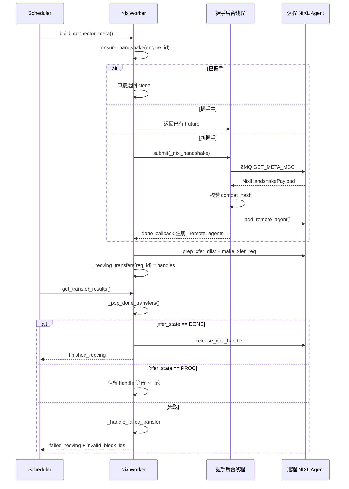

# 第 9 章：投机解码加速：Speculative Decoding 的实现与加速比评测

上一章我们把视角锁在单个推理实例内部：TP/PP/DP/EP 进程组如何建组，张量如何在卡间切分，EPLB 如何在 MoE 层做专家再平衡。但所有这些机制都建立在同一个前提上——prefill 和 decode 跑在同一个实例里，KV Cache 从头到尾待在本地显存。分离式部署（Prefill-Decode Disaggregation，简称 PD 分离）打破了这个前提。它把 prefill 和 decode 拆成两个独立的 vLLM 实例：prefill 实例只做 prompt 的前向计算，产出 KV Cache 后交给 decode 实例；decode 实例拿着这份 KV Cache 继续自回归生成。这样做的好处是资源可以按阶段特性独立配置——prefill 是计算密集型，适合大 TP、大 batch；decode 是访存密集型，适合小 batch、低延迟调度。两者不再互相拖累。代价是：KV Cache 必须跨实例传输。这就是本章的主角——KV Connector。vllm/distributed/kv_transfer/kv_connector/v1/base.py 的文件头注释已经把整个抽象的核心原语列了出来：Scheduler 侧负责绑定元数据、查询远程缓存命中、决定是否异步释放 block；Worker 侧负责实际的 KV 加载与保存。这套接口的设计目标，是让上层调度逻辑与底层传输后端（NIXL、Mooncake、MoRIIO）彻底解耦。从工程角度看，PD 分离最大的风险不是传输慢，而是状态不一致：prefill 实例认为 KV 已经发出去了，decode 实例却没收到；或者 decode 实例提前释放了 block，prefill 还在往里写。本章要探明的，正是这套连接器体系如何用握手协议、租约（lease）、心跳和失败恢复机制来兜住这些边界。

# 一、KVConnectorBase_V1：双角色抽象与元数据契约

## 直觉模型

KV Connector 就像两家分店之间的快递系统。Prefill 店算好了半成品（KV Cache），打包寄给 Decode 店继续加工。但快递系统不能只有"发货"这一个动作——它需要一张运单（metadata）说明寄什么、寄到哪；需要一个签收机制确认对方收到了；还需要一套超时规则，防止包裹永远卡在路上占着货架。

如果没有这套抽象，每个传输后端（NIXL、Mooncake）都要自己实现调度逻辑，vLLM 的 Scheduler 就得为每种后端写一套适配代码。KVConnectorBase_V1 的价值，就是把这套契约固定下来。

## 双角色：Scheduler 侧与 Worker 侧

[FACT:vllm/distributed/kv_transfer/kv_connector/v1/base.py:137-142](https://github.com/vllm-project/vllm/blob/7ba3df63cbe2e3e7aca19074bed2958311f46400/vllm/distributed/kv_transfer/kv_connector/v1/base.py#L137-L142) 定义了连接器的两种角色：

```python
class KVConnectorRole(enum.Enum):
    # Connector running in the scheduler process
    SCHEDULER = 0
    # Connector running in the worker process
    WORKER = 1
```

这个划分不是随意的。Scheduler 进程负责全局调度决策——哪些请求需要传输、什么时候可以释放 block；Worker 进程负责实际的数据搬运。两者通过 `KVConnectorMetadata` 通信。

[FACT:vllm/distributed/kv_transfer/kv_connector/v1/base.py:153-158](https://github.com/vllm-project/vllm/blob/7ba3df63cbe2e3e7aca19074bed2958311f46400/vllm/distributed/kv_transfer/kv_connector/v1/base.py#L153-L158) 定义了 Scheduler 到 Worker 方向的元数据基类：

```python
class KVConnectorMetadata(ABC):  # noqa: B024
    """Abstract Metadata used to communicate
    Scheduler KVConnector -> Worker KVConnector.
    """
    pass
```

反向的 Worker 到 Scheduler 方向，[FACT:vllm/distributed/kv_transfer/kv_connector/v1/base.py:161-176](https://github.com/vllm-project/vllm/blob/7ba3df63cbe2e3e7aca19074bed2958311f46400/vllm/distributed/kv_transfer/kv_connector/v1/base.py#L161-L176) 定义了 `KVConnectorWorkerMetadata`，它要求实现 `aggregate` 方法——因为一个 engine step 里可能有多个 worker 各自返回元数据，需要聚合后再交给 Scheduler。

## 核心数据结构：KVConnectorTransferResults

[FACT:vllm/distributed/kv_transfer/kv_connector/v1/base.py:87-96](https://github.com/vllm-project/vllm/blob/7ba3df63cbe2e3e7aca19074bed2958311f46400/vllm/distributed/kv_transfer/kv_connector/v1/base.py#L87-L96) 定义了传输结果的快照结构：

```python
@dataclass
class KVConnectorTransferResults:
    finished_sending: set[str] = field(default_factory=set)
    finished_recving: set[str] = field(default_factory=set)
    failed_recving: set[str] = field(default_factory=set)
```

注意注释里的关键设计：**失败的接收也会出现在 `finished_recving` 里**。这是为了让 Scheduler 能把请求从"等待传输"状态中释放出来——即使传输失败了，请求也不能永远卡着。失败信息通过 `failed_recving` 单独传递，Scheduler 据此决定是重试还是降级。

## 生命周期钩子：从请求到释放

整个连接器的生命周期围绕几个关键钩子展开。Scheduler 侧：

- `get_num_new_matched_tokens` [FACT:vllm/distributed/kv_transfer/kv_connector/v1/base.py:485-518](https://github.com/vllm-project/vllm/blob/7ba3df63cbe2e3e7aca19074bed2958311f46400/vllm/distributed/kv_transfer/kv_connector/v1/base.py#L485-L518)：查询远程缓存能命中多少 token。注释特别强调"应该只考虑实际可用的最大前缀"，如果某些 token 因为连接问题或驱逐拿不到，就不能算进去。
- `update_state_after_alloc` [FACT:vllm/distributed/kv_transfer/kv_connector/v1/base.py:520-544](https://github.com/vllm-project/vllm/blob/7ba3df63cbe2e3e7aca19074bed2958311f46400/vllm/distributed/kv_transfer/kv_connector/v1/base.py#L520-L544)：block 分配后更新状态。注释里有个容易踩的坑——判断是否加载要看 `num_external_tokens`，而不是 `blocks` 是否为空，因为 MultiConnector 的非选中子连接器也会收到真实 block。
- `request_finished` [FACT:vllm/distributed/kv_transfer/kv_connector/v1/base.py:579-598](https://github.com/vllm-project/vllm/blob/7ba3df63cbe2e3e7aca19074bed2958311f46400/vllm/distributed/kv_transfer/kv_connector/v1/base.py#L579-L598)：请求完成时调用，返回 `True` 表示连接器接管 block 的异步释放责任。

Worker 侧：

- `start_load_kv` / `wait_for_layer_load`：逐层加载，支持流水线。
- `save_kv_layer` / `wait_for_save`：逐层保存。
- `get_transfer_results` [FACT:vllm/distributed/kv_transfer/kv_connector/v1/base.py:396-397](https://github.com/vllm-project/vllm/blob/7ba3df63cbe2e3e7aca19074bed2958311f46400/vllm/distributed/kv_transfer/kv_connector/v1/base.py#L396-L397)：返回异步传输的完成情况。

[FACT:vllm/distributed/kv_transfer/kv_connector/v1/base.py:192-201](https://github.com/vllm-project/vllm/blob/7ba3df63cbe2e3e7aca19074bed2958311f46400/vllm/distributed/kv_transfer/kv_connector/v1/base.py#L192-L201) 还有一个容易被忽略但很关键的设计——`requires_kv_delivery` 属性：

```python
@property
def requires_kv_delivery(self) -> bool:
    """Whether this connector hands off KV that must be reliably delivered.
    ...
    """
    return self._kv_transfer_config.is_kv_producer
```

注释解释了动机：如果请求在 KV 交接还没完成时被抢占，应该重新计算而不是让它完成并交接已经被抢占释放的 block。只有 producer 角色才需要可靠交付，best-effort 缓存丢了只是未来的一次 cache miss。

## 握手元数据

[FACT:vllm/distributed/kv_transfer/kv_connector/v1/base.py:145-150](https://github.com/vllm-project/vllm/blob/7ba3df63cbe2e3e7aca19074bed2958311f46400/vllm/distributed/kv_transfer/kv_connector/v1/base.py#L145-L150) 定义了握手元数据的基类：

```python
class KVConnectorHandshakeMetadata(ABC):  # noqa: B024
    """Metadata used for out of band connector handshake between
    P/D workers. This needs to serializable.
    """
    pass
```

"out of band"意味着握手不走正常的请求路径，而是 P/D worker 之间直接通信。这为 NIXL 的 ZMQ 握手协议埋下了伏笔。

---

# 二、NIXL 连接器：握手、注册与描述符构建

## 直觉模型

NIXL（NVIDIA Inference Xfer Library）是 NVIDIA 提供的底层传输库，支持 UCX、GDS 等多种后端。NixlBaseConnectorWorker 的角色，就像快递公司的分拣中心——它需要先和对方分拣中心建立专线（握手），登记自己的货架布局（注册 KV Cache 内存区域），然后才能高效地按地址取货发货。

如果没有这套机制，每次传输都要重新协商地址、重新建立连接，延迟会高到无法接受。

## 内存布局：Region 与 Descriptor

NIXL 的核心概念是 **region**（内存区域）和 **descriptor**（描述符）。每个 KV Cache 层在 NIXL 中注册为一个或多个 region，每个 region 有基地址、块长度、块步长。

[FACT:vllm/distributed/kv_transfer/kv_connector/v1/nixl/base_worker.py:740-751](https://github.com/vllm-project/vllm/blob/7ba3df63cbe2e3e7aca19074bed2958311f46400/vllm/distributed/kv_transfer/kv_connector/v1/nixl/base_worker.py#L740-L751) 列出了 region 相关的核心字段：

```python
# Number of NIXL regions. Currently one region per cache
# (so 1 per layer for MLA, otherwise 2 per layer)
self.num_regions = 0
self.region_mem_types: list[str] = []
self.region_group_ids: list[int] = []
self._uses_region_group_mapping = False
self.region_names: list[str] = []
self.region_num_blocks: list[int] = []
self._mixed_mem_types = False
```

[FACT:vllm/distributed/kv_transfer/kv_connector/v1/nixl/base_worker.py:897-900](https://github.com/vllm-project/vllm/blob/7ba3df63cbe2e3e7aca19074bed2958311f46400/vllm/distributed/kv_transfer/kv_connector/v1/nixl/base_worker.py#L897-L900) 进一步说明了块步长的来源：

```python
# Per-region block stride in bytes. Taken from the registered tensor's
# stride(0) so it stays correct under layouts that interleave layers
# within a block (BLHNC/BHLNC), where stride > block_len.
self.block_stride_per_layer = list[int]()
```

这里的关键洞察是：**block_stride 不等于 block_len**。在 BLHNC/BHLNC 这类层间交错的布局下，一个 block 的实际跨度可能大于其有效数据长度。如果直接用 block_len 做步长，会读错地址。

## 握手协议：ZMQ + 兼容性哈希

握手是 NIXL 连接器最复杂的部分。[FACT:vllm/distributed/kv_transfer/kv_connector/v1/nixl/base_worker.py:974-1128](https://github.com/vllm-project/vllm/blob/7ba3df63cbe2e3e7aca19074bed2958311f46400/vllm/distributed/kv_transfer/kv_connector/v1/nixl/base_worker.py#L974-L1128) 的 `_nixl_handshake` 方法完整展示了这个过程。

第一步是设置 CUDA 设备上下文。[FACT:vllm/distributed/kv_transfer/kv_connector/v1/nixl/base_worker.py:988-998](https://github.com/vllm-project/vllm/blob/7ba3df63cbe2e3e7aca19074bed2958311f46400/vllm/distributed/kv_transfer/kv_connector/v1/nixl/base_worker.py#L988-L998) 的注释解释了原因：

```python
# the first time we connect to a remote agent.
# be careful, the handshake happens in a background thread.
# it does not have an active cuda context until any cuda runtime
# call is made. when UCX fails to find a valid cuda context, it will
# disable any cuda ipc communication, essentially disabling any NVLink
# communication.
if not self.use_host_buffer:
    current_platform.set_device(self.device_id)
```

这是一个非常隐蔽的坑：握手在后台线程执行，如果没有显式设置设备，UCX 找不到有效的 CUDA 上下文，会静默禁用 NVLink 通信，退化成慢速路径。

第二步是通过 ZMQ 发送元数据查询。[FACT:vllm/distributed/kv_transfer/kv_connector/v1/nixl/base_worker.py:1029-1036](https://github.com/vllm-project/vllm/blob/7ba3df63cbe2e3e7aca19074bed2958311f46400/vllm/distributed/kv_transfer/kv_connector/v1/nixl/base_worker.py#L1029-L1036)：

```python
msg = msgspec.msgpack.encode(
    (GET_META_MSG, remote_pp_rank, remote_rank)
)
# Set receive timeout to 5 seconds to avoid hanging on dead server
sock.setsockopt(zmq.RCVTIMEO, 5000)  # milliseconds
start_time = time.perf_counter()
sock.send(msg)
reply_parts = sock.recv_multipart()
```

5 秒超时是防止对端死掉后无限等待。同时，代码用 RTT 估算时钟偏移 [FACT:vllm/distributed/kv_transfer/kv_connector/v1/nixl/base_worker.py:1042-1045](https://github.com/vllm-project/vllm/blob/7ba3df63cbe2e3e7aca19074bed2958311f46400/vllm/distributed/kv_transfer/kv_connector/v1/nixl/base_worker.py#L1042-L1045)，保留最小 RTT 样本——因为高 RTT 只是噪声，会扭曲中点估计。

第三步是兼容性校验。[FACT:vllm/distributed/kv_transfer/kv_connector/v1/nixl/base_worker.py:1063-1080](https://github.com/vllm-project/vllm/blob/7ba3df63cbe2e3e7aca19074bed2958311f46400/vllm/distributed/kv_transfer/kv_connector/v1/nixl/base_worker.py#L1063-L1080)：

```python
assert self.compat_hash is not None
if (
    self.enforce_compat_hash
    and handshake_payload.compatibility_hash != self.compat_hash
):
    raise RuntimeError(
        f"NIXL compatibility hash mismatch. "
        ...
    )
```

兼容性哈希在 [FACT:vllm/distributed/kv_transfer/kv_connector/v1/nixl/base_worker.py:1372-1376](https://github.com/vllm-project/vllm/blob/7ba3df63cbe2e3e7aca19074bed2958311f46400/vllm/distributed/kv_transfer/kv_connector/v1/nixl/base_worker.py#L1372-L1376) 计算：

```python
self.compat_hash = compute_nixl_compatibility_hash(
    self.vllm_config,
    self.backend_name,
    transfer_mode=self._TRANSFER_MODE,
)
```

注意 `transfer_mode` 也参与哈希——[FACT:vllm/distributed/kv_transfer/kv_connector/v1/nixl/base_worker.py:163-166](https://github.com/vllm-project/vllm/blob/7ba3df63cbe2e3e7aca19074bed2958311f46400/vllm/distributed/kv_transfer/kv_connector/v1/nixl/base_worker.py#L163-L166) 的注释说明：push（WRITE）连接器和 pull（READ）连接器永远不应该握手成功。

## 异步握手调度

握手是异步的，通过线程池执行。[FACT:vllm/distributed/kv_transfer/kv_connector/v1/nixl/base_worker.py:824-835](https://github.com/vllm-project/vllm/blob/7ba3df63cbe2e3e7aca19074bed2958311f46400/vllm/distributed/kv_transfer/kv_connector/v1/nixl/base_worker.py#L824-L835)：

```python
self._handshake_initiation_executor = ThreadPoolExecutor(
    # NIXL is not guaranteed to be thread-safe, limit 1 worker.
    max_workers=1,
    thread_name_prefix="vllm-nixl-handshake-initiator",
)
self._ready_requests = queue.Queue[tuple[ReqId, ReqMeta]]()
self._handshake_futures: dict[
    EngineId, Future[tuple[dict[tuple[int, int], str], float]]
] = {}
# Protects _handshake_futures and _remote_agents.
self._handshake_lock = threading.RLock()
```

`max_workers=1` 是因为 NIXL 不保证线程安全。`_handshake_lock` 保护 `_handshake_futures` 和 `_remote_agents` 两个字典。

`_ensure_handshake` [FACT:vllm/distributed/kv_transfer/kv_connector/v1/nixl/base_worker.py:1257-1317](https://github.com/vllm-project/vllm/blob/7ba3df63cbe2e3e7aca19074bed2958311f46400/vllm/distributed/kv_transfer/kv_connector/v1/nixl/base_worker.py#L1257-L1317) 实现了幂等的握手发起：如果已经握手成功直接返回 None；如果正在握手中返回已有的 Future；否则提交新任务并注册回调。

## 描述符构建：从 block ID 到 NIXL descriptor

握手完成后，需要为每个请求构建描述符。[FACT:vllm/distributed/kv_transfer/kv_connector/v1/nixl/base_worker.py:172-310](https://github.com/vllm-project/vllm/blob/7ba3df63cbe2e3e7aca19074bed2958311f46400/vllm/distributed/kv_transfer/kv_connector/v1/nixl/base_worker.py#L172-L310) 的 `_compute_desc_ids` 是核心。

对于纯 attention 模型（无 SSM），走快速路径 [FACT:vllm/distributed/kv_transfer/kv_connector/v1/nixl/base_worker.py:226-262](https://github.com/vllm-project/vllm/blob/7ba3df63cbe2e3e7aca19074bed2958311f46400/vllm/distributed/kv_transfer/kv_connector/v1/nixl/base_worker.py#L226-L262)。注释解释了 HMA 场景下的处理：

```python
# NOTE (NickLucche) With HMA, every kv group has the same number of layers
# and layers from different groups share the same kv tensor.
# eg block_ids=[[1, 2], [3]]->blocks [1, 2] need to be
# read across all regions, same for [3], but group0-group1 blocks will
# always differ (different areas). Therefore we can just flatten the
# block_ids and compute the descs ids for all groups at once.
```

对于混合 SSM 模型，描述符布局更复杂 [FACT:vllm/distributed/kv_transfer/kv_connector/v1/nixl/base_worker.py:285-304](https://github.com/vllm-project/vllm/blob/7ba3df63cbe2e3e7aca19074bed2958311f46400/vllm/distributed/kv_transfer/kv_connector/v1/nixl/base_worker.py#L285-L304)：

```python
elif _is_ssm_spec(spec_type):
    # NOTE (NickLucche) SSM and Attention block regions can
    # be exchanged arbitrarily by manager.  Therefore, descs
    # are laid out as:
    #   [descs_fa (all regions) | descs_ssm (all regions)].
    # num_fa_descs offset must be computed per-engine since
    # P and D can have different num_blocks (and thus
    # different FA desc counts).
```

## 传输拓扑与 TP 映射

异构 TP 是 NIXL 连接器最复杂的场景。[FACT:vllm/distributed/kv_transfer/kv_connector/v1/nixl/base_worker.py:2130-2178](https://github.com/vllm-project/vllm/blob/7ba3df63cbe2e3e7aca19074bed2958311f46400/vllm/distributed/kv_transfer/kv_connector/v1/nixl/base_worker.py#L2130-L2178) 的 `add_remote_agent` 文档详细解释了各种情况：

当 D.world_size > P.world_size 时，多个 D worker 从同一个 P worker 读取不同的 KV head 分片。文档给出了具体例子：D TP=4，P TP=2，tp_ratio=2。D-Worker0 读取 P-Worker0 的前半部分 KV head，D-Worker1 读取后半部分。

对于 MLA 模型，KV Cache 在 TP worker 间是复制的，所以 rank_offset 永远是 0。

## 租约与心跳：防止 block 被过早释放

这是 NIXL 连接器最精妙的设计之一。Prefill 实例发送 KV 后，不能立即释放 block——因为 decode 实例可能还在读。但如果永远不释放，显存会泄漏。

解决方案是租约（lease）。[FACT:vllm/distributed/kv_transfer/kv_connector/v1/nixl/base_worker.py:528-528](https://github.com/vllm-project/vllm/blob/7ba3df63cbe2e3e7aca19074bed2958311f46400/vllm/distributed/kv_transfer/kv_connector/v1/nixl/base_worker.py#L528-L528)：

```python
kv_lease_duration: int = vllm_config.kv_transfer_config.get_from_extra_config(
    "kv_lease_duration", 30
)
# NOTE (NickLucche): For now we use a hardcoded value for a simpler interface.
self._lease_extension = kv_lease_duration * 2 // 3
```

默认租约 30 秒，每次心跳延长 20 秒（2/3）。

心跳处理在 [FACT:vllm/distributed/kv_transfer/kv_connector/v1/nixl/base_worker.py:3014-3034](https://github.com/vllm-project/vllm/blob/7ba3df63cbe2e3e7aca19074bed2958311f46400/vllm/distributed/kv_transfer/kv_connector/v1/nixl/base_worker.py#L3014-L3034)：

```python
def _handle_heartbeat(self, payload: str) -> None:
    new_expiry = time.perf_counter() + self._lease_extension
    for req_id in payload.split(","):
        if req_id in self._reqs_to_send:
            old = self._reqs_to_send[req_id]
            self._reqs_to_send[req_id] = max(old, new_expiry)
```

注意 `max(old, new_expiry)`——心跳只能延长租约，不能缩短。

租约过期后的回收在 [FACT:vllm/distributed/kv_transfer/kv_connector/v1/nixl/base_worker.py:2986-3012](https://github.com/vllm-project/vllm/blob/7ba3df63cbe2e3e7aca19074bed2958311f46400/vllm/distributed/kv_transfer/kv_connector/v1/nixl/base_worker.py#L2986-L3012)：

```python
def _reap_expired_send_leases(self, done_sending: set[str]) -> None:
    """Reclaim expired send-side KV leases into ``done_sending``.

    ``_reqs_to_send`` is not ordered by expiry: heartbeats update the
    deadline in place, and mixed TTLs share the map, so a live head
    entry can sit in front of already-expired ones. Scan every entry
    rather than stopping at the first still-live request.
    """
```

注释指出了一个容易犯的错误：不能因为遇到第一个未过期的请求就停止扫描，因为心跳会原地更新过期时间，导致 map 不是按过期时间排序的。

## 传输状态机与失败恢复

传输的生命周期通过 `_pop_done_transfers` [FACT:vllm/distributed/kv_transfer/kv_connector/v1/nixl/base_worker.py:3036-3086](https://github.com/vllm-project/vllm/blob/7ba3df63cbe2e3e7aca19074bed2958311f46400/vllm/distributed/kv_transfer/kv_connector/v1/nixl/base_worker.py#L3036-L3086) 管理：

```python
for handle in handles:
    try:
        xfer_state = self.nixl_wrapper.check_xfer_state(handle)
        if xfer_state == "DONE":
            res = self.nixl_wrapper.get_xfer_telemetry(handle)
            self.xfer_stats.record_transfer(res)
            self.nixl_wrapper.release_xfer_handle(handle)
        elif xfer_state == "PROC":
            in_progress.append(handle)
        else:
            self._log_failure(
                failure_type="transfer_failed",
                req_id=req_id,
                xfer_state=xfer_state,
            )
```

NIXL 传输有三种状态：`DONE`（完成）、`PROC`（进行中）、其他（失败）。

失败处理在 [FACT:vllm/distributed/kv_transfer/kv_connector/v1/nixl/base_worker.py:3103-3127](https://github.com/vllm-project/vllm/blob/7ba3df63cbe2e3e7aca19074bed2958311f46400/vllm/distributed/kv_transfer/kv_connector/v1/nixl/base_worker.py#L3103-L3127)：

```python
def _handle_failed_transfer(
    self,
    req_id: str,
    handle: int | None,
    failed_req_ids: set[str] | None = None,
    record_failed_transfer: bool = True,
) -> bool:
    if record_failed_transfer:
        self.xfer_stats.record_failed_transfer()
    if failed_req_ids is not None:
        failed_req_ids.add(req_id)
    return handle is None or self._try_release_xfer_handle(req_id, handle)
```

`_try_release_xfer_handle` [FACT:vllm/distributed/kv_transfer/kv_connector/v1/nixl/base_worker.py:3088-3101](https://github.com/vllm-project/vllm/blob/7ba3df63cbe2e3e7aca19074bed2958311f46400/vllm/distributed/kv_transfer/kv_connector/v1/nixl/base_worker.py#L3088-L3101) 的注释很关键：

```python
except Exception as e:
    # A status error does not guarantee that the backend stopped DMA.
    self._log_failure(
        failure_type="transfer_release_failed",
        msg="Retaining handle and blocks until release succeeds",
        ...
    )
    return False
```

**状态错误不保证后端停止了 DMA**。如果释放失败，必须保留 handle 和 block，直到释放成功。这是一个典型的"宁可泄漏也不要用错"的设计。

## 失败请求的 block 处理

当接收失败时，[FACT:vllm/distributed/kv_transfer/kv_connector/v1/nixl/base_worker.py:2876-2891](https://github.com/vllm-project/vllm/blob/7ba3df63cbe2e3e7aca19074bed2958311f46400/vllm/distributed/kv_transfer/kv_connector/v1/nixl/base_worker.py#L2876-L2891) 展示了处理逻辑：

```python
for req_id in done_recving:
    meta = self._recving_metadata.pop(req_id, None)
    assert meta is not None, f"{req_id} not found in recving_metadata list"

    # Skip KV sync and post-processing for failed requests
    if req_id in failed_recv_reqs:
        self._pending_recv_notifs.pop(req_id, None)
        # TODO (NickLucche) handle failed transfer for HMA.
        if not self._is_hma_required:
            self._invalid_block_ids.put(set(meta.local_block_ids[0]))
        logger.warning(
            "Skipping KV post-processing for failed request %s",
            req_id,
        )
        continue
```

失败的 block ID 被放入 `_invalid_block_ids` 队列，Scheduler 通过 `get_block_ids_with_load_errors` [FACT:vllm/distributed/kv_transfer/kv_connector/v1/nixl/base_worker.py:3491-3504](https://github.com/vllm-project/vllm/blob/7ba3df63cbe2e3e7aca19074bed2958311f46400/vllm/distributed/kv_transfer/kv_connector/v1/nixl/base_worker.py#L3491-L3504) 取出，决定是否重试。

## 远程引擎的 TTL 驱逐

长期运行的实例会不断遇到新的远程引擎，如果不清理，内存会无限增长。[FACT:vllm/distributed/kv_transfer/kv_connector/v1/nixl/base_worker.py:3506-3532](https://github.com/vllm-project/vllm/blob/7ba3df63cbe2e3e7aca19074bed2958311f46400/vllm/distributed/kv_transfer/kv_connector/v1/nixl/base_worker.py#L3506-L3532) 的 `_evict_stale_engines` 实现了 TTL 驱逐：

```python
def _evict_stale_engines(self) -> None:
    """Scan for and evict remote engines that have exceeded their TTL.

    Called from the main thread in when a new remote engine appears.
    We can only go OOM as we discover and register a new remote, therefore we make
    sure we clean up stale engine data structures before then.
    """
    if self._engine_ttl  self._engine_ttl and eid not in busy:
            self._cleanup_remote_engine(eid)
```

关键约束是 `busy` 集合——有进行中传输的引擎不能被驱逐。[FACT:vllm/distributed/kv_transfer/kv_connector/v1/nixl/base_worker.py:3534-3546](https://github.com/vllm-project/vllm/blob/7ba3df63cbe2e3e7aca19074bed2958311f46400/vllm/distributed/kv_transfer/kv_connector/v1/nixl/base_worker.py#L3534-L3546) 的注释解释了原因：

```python
"""Remote engines a transfer is still reading from.

The timestamp is stamped when a read is issued and not refreshed while
it runs, so a transfer that outlives the TTL leaves its engine looking
idle. A peer that has lost its NIC holds one indefinitely.
"""
```

如果对端网卡坏了，传输可能永远挂着，时间戳不会刷新，引擎看起来是空闲的。`busy` 集合显式保护了这种情况。

## 握手与传输的时序

下面这张时序图展示了从请求到传输完成的核心交互：



---

# 三、设计思考：为什么这样设计

## 为什么握手要异步？

握手涉及网络往返，可能耗时几十毫秒。如果同步执行，会阻塞 Scheduler 的主循环，影响所有请求的调度。异步握手让 Scheduler 可以先处理其他请求，握手完成后通过回调通知。

但异步也带来了复杂性：`_handshake_futures` 字典需要锁保护，回调里要处理成功和失败两种情况，还要防止重复握手。

## 为什么用租约而不是引用计数？

引用计数需要 decode 实例显式通知 prefill "我读完了"。但如果 decode 实例崩溃，通知永远不会到达，prefill 的 block 就永远泄漏了。

租约是更鲁棒的方案：即使 decode 崩溃，租约到期后 prefill 自动回收。心跳机制则保证正常情况下的租约续期。

## 为什么失败时保留 handle？

[FACT:vllm/distributed/kv_transfer/kv_connector/v1/nixl/base_worker.py:3088-3101](https://github.com/vllm-project/vllm/blob/7ba3df63cbe2e3e7aca19074bed2958311f46400/vllm/distributed/kv_transfer/kv_connector/v1/nixl/base_worker.py#L3088-L3101) 的注释说得很清楚：状态错误不保证 DMA 停止。如果此时释放 handle，DMA 可能还在往已释放的内存写数据，导致数据损坏或崩溃。宁可暂时泄漏，也不能冒这个风险。

## 为什么 TTL 驱逐要检查 busy？

[FACT:vllm/distributed/kv_transfer/kv_connector/v1/nixl/base_worker.py:3534-3546](https://github.com/vllm-project/vllm/blob/7ba3df63cbe2e3e7aca19074bed2958311f46400/vllm/distributed/kv_transfer/kv_connector/v1/nixl/base_worker.py#L3534-L3546) 的注释揭示了一个隐蔽的 bug 场景：时间戳在读取发起时打上，读取期间不刷新。如果传输时间超过 TTL，引擎看起来是空闲的，但实际上还在被读取。如果此时驱逐，正在进行的传输会失败。

## 生产环境踩坑点

1. **CUDA 上下文问题**：握手在后台线程执行，必须显式 `set_device`，否则 UCX 会静默禁用 NVLink。

2. **兼容性哈希不匹配**：P/D 实例的 vLLM 版本、模型、dtype、KV layout、attention backend 必须完全一致。不一致时握手会失败，错误信息会提示如何禁用检查（但不建议）。

3. **租约过期**：如果 decode 实例负载很高，心跳可能延迟，导致租约过期。日志里会出现 "Releasing expired KV blocks" 警告。可以调大 `kv_lease_duration`。

4. **TP 不匹配**：异构 TP 需要 block-contiguous 布局（如 LBHNC）。如果用了非连续布局，异构 TP 会失败。

5. **NIXL UAR 耗尽**：[FACT:vllm/distributed/kv_transfer/kv_connector/v1/nixl/base_worker.py:631-636](https://github.com/vllm-project/vllm/blob/7ba3df63cbe2e3e7aca19074bed2958311f46400/vllm/distributed/kv_transfer/kv_connector/v1/nixl/base_worker.py#L631-L636) 的注释警告：每个 UCX 线程通过 DevX 分配 UAR（doorbell pages），过多的 NIXL UAR 使用会耗尽 NIC UAR 空间，导致 NVSHMEM（DeepEP 内核使用）在 RDMA 初始化时失败。

---

# 本章小结

本章深入了 KV Connector 体系的核心机制：

1. **KVConnectorBase_V1** 定义了 Scheduler 侧和 Worker 侧的双角色抽象，通过 `KVConnectorMetadata` 和 `KVConnectorTransferResults` 实现元数据交换和传输结果反馈。

2. **NIXL 连接器** 是最成熟的实现，它通过 ZMQ 握手协议建立 P/D 实例间的连接，用兼容性哈希防止配置不匹配，用异步线程池避免阻塞主循环。

3. **租约与心跳** 机制解决了 block 释放的时序问题：prefill 发送 KV 后不立即释放，而是等待 decode 的心跳续期或租约过期。

4. **失败恢复** 遵循"宁可泄漏也不要用错"的原则：释放失败时保留 handle，失败的 block ID 上报给 Scheduler 决定重试。

5. **TTL 驱逐** 防止长期运行时远程引擎状态无限增长，但必须保护有进行中传输的引擎。

下一章我们将转向另一个消除开销的方向：编译加速与 CUDA Graph。当 PD 分离解决了资源利用率问题后，单次前向的启动开销成为新的瓶颈——如何用 CUDA Graph 把成百上千个内核启动压缩成一次重放。

# 本章思考与自测

Q1: 如果把 `_try_release_xfer_handle` 中的异常处理去掉，直接调用 `release_xfer_handle`，在什么场景下会导致数据损坏？为什么？

**参考解析**：`_try_release_xfer_handle` [FACT:vllm/distributed/kv_transfer/kv_connector/v1/nixl/base_worker.py:3088-3101](https://github.com/vllm-project/vllm/blob/7ba3df63cbe2e3e7aca19074bed2958311f46400/vllm/distributed/kv_transfer/kv_connector/v1/nixl/base_worker.py#L3088-L3101) 的注释明确指出："A status error does not guarantee that the backend stopped DMA." 如果去掉异常处理，当 `release_xfer_handle` 抛出异常时，调用方会认为释放成功，继续释放 block。但实际上 NIXL 后端的 DMA 可能还在进行中，正在往这块内存写数据。一旦 block 被重新分配给其他请求，DMA 写入会污染新请求的 KV Cache，导致输出乱码或 NaN。更糟的是，如果 block 被释放回显存池并被其他张量复用，DMA 可能写入非法地址导致崩溃。正确的做法是保留 handle 和 block，在下一轮 `_pop_done_transfers` 中重试释放。

Q2: `_reap_expired_send_leases` 的注释说"不能因为遇到第一个未过期的请求就停止扫描"。如果改成遇到未过期就 break，在什么场景下会触发 block 泄漏？

**参考解析**：`_reqs_to_send` 是一个普通 dict，不是按过期时间排序的优先队列。心跳处理 `_handle_heartbeat` [FACT:vllm/distributed/kv_transfer/kv_connector/v1/nixl/base_worker.py:3014-3034](https://github.com/vllm-project/vllm/blob/7ba3df63cbe2e3e7aca19074bed2958311f46400/vllm/distributed/kv_transfer/kv_connector/v1/nixl/base_worker.py#L3014-L3034) 会原地更新过期时间：`self._reqs_to_send[req_id] = max(old, new_expiry)`。这意味着一个先加入的请求可能因为持续收到心跳而拥有很晚的过期时间，排在它后面的请求可能已经过期。如果遇到第一个未过期就 break，后面已过期的请求永远不会被回收，它们的 block 会一直占用显存。在长时间运行、请求模式混合（有些请求被频繁心跳续期，有些请求的 decode 实例已经崩溃）的场景下，这会累积成严重的显存泄漏。

Q3: `_evict_stale_engines` 用 `_engines_with_inflight_transfers` 保护有进行中传输的引擎。如果去掉这个保护，在什么网络故障场景下会导致传输失败？

**参考解析**：`_engines_with_inflight_transfers` [FACT:vllm/distributed/kv_transfer/kv_connector/v1/nixl/base_worker.py:3534-3546](https://github.com/vllm-project/vllm/blob/7ba3df63cbe2e3e7aca19074bed2958311f46400/vllm/distributed/kv_transfer/kv_connector/v1/nixl/base_worker.py#L3534-L3546) 的注释解释了一个关键场景："The timestamp is stamped when a read is issued and not refreshed while it runs, so a transfer that outlives the TTL leaves its engine looking idle. A peer that has lost its NIC holds one indefinitely." 假设对端网卡故障，一个 NIXL 读操作挂起超过 TTL（默认 3600 秒）。`_engine_last_active` 时间戳在读取发起时打上，读取期间不刷新，所以引擎看起来已经空闲。如果此时 `_evict_stale_engines` 驱逐了这个引擎，会调用 `_cleanup_remote_engine` 释放 `dst_xfer_side_handles` 并移除 remote agent。但正在进行的 DMA 还在使用这些资源，释放后会导致传输失败甚至崩溃。`busy` 集合显式保护了这种情况，确保有进行中传输的引擎不会被驱逐。

至此，我们已经看清 KV Connector 如何在 prefill 与 decode 实例之间建立可靠的数据通道，以及它如何用租约、心跳和失败恢复机制守住状态一致性。但跨实例传输只是 PD 分离的一半故事——当 KV Cache 抵达 decode 实例后，推理引擎仍需在单实例内部高效执行每一步前向计算。而 Python 调度与内核启动开销，正是制约单步延迟的下一道瓶颈。下一章将转向编译加速与 CUDA Graph，看 vLLM 如何用 torch.compile 和 piecewise backend 消除这些开销，并让 CUDA Graph 与动态批处理形状协调共存。
