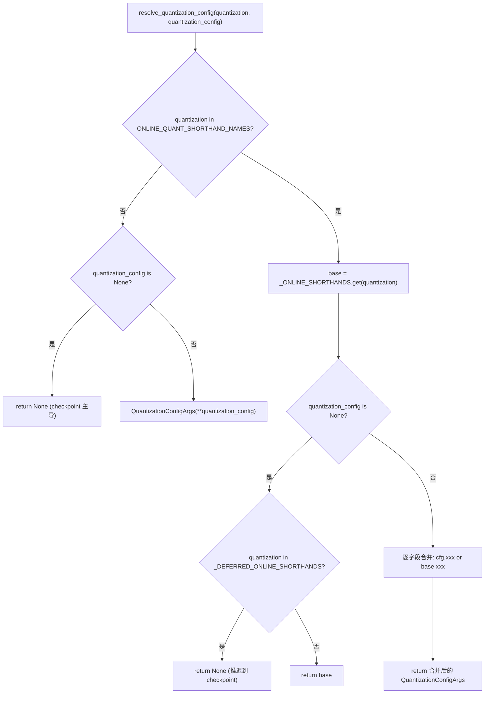
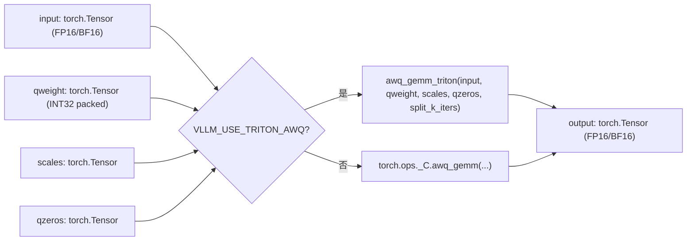
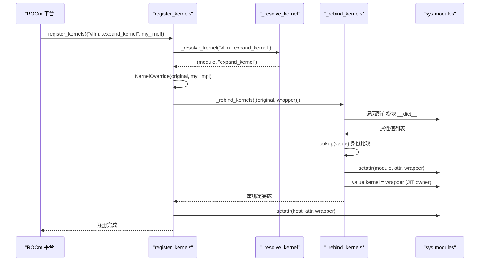

# 第 11 章：服务端并发与架构：AsyncLLMEngine 与 OpenAI 兼容 API 适配

上一章我们看到，torch.compile 与 CUDA Graph 把 Python 调度与内核启动开销压到了极致。但调度再快，如果权重本身是 FP16、矩阵乘法走的是通用 GEMM，硬件算力仍然被显存带宽和低效算子拖住。量化与自定义内核是另一条正交的优化主线：前者在权重加载阶段就把精度压下来，后者把量化收益真正兑现为吞吐。本章从量化配置的解析入口出发，一路走到 _custom_ops 的算子注册与 Triton 内核调度。

# 11.1 量化配置：从 CLI 字符串到 QuantKey

## 直觉模型

量化配置模块的角色，像一家餐厅的点菜单翻译器。用户在前台说“我要 fp8_per_tensor”（CLI 字符串），后厨需要的是精确的配方编号（`QuantKey`）。翻译器必须处理三种输入：纯 CLI 简写、checkpoint 自带的量化元数据、以及两者叠加的组合场景。若没有这层翻译，后厨会收到一堆含义模糊的字符串，无法决定该调用哪个 kernel。

## 数据结构与内存布局

核心数据结构是 `QuantSpec` 与 `QuantizationConfigArgs`。前者描述单类层（linear 或 MoE）的权重与激活量化键，后者是用户可见的顶层配置。

[FACT:vllm/config/quantization.py:73-99]

```python
@config
class QuantSpec:
    weight: QuantKeyField = None
    activation: QuantKeyField = None

    def __str__(self) -> str:
        def quant_key_str(quant_key: QuantKey | None) -> str:
            if quant_key is None:
                return "None"
            return next(
                (
                    name
                    for name, known_quant_key in QUANT_KEY_NAMES.items()
                    if known_quant_key == quant_key
                ),
                str(quant_key),
            )
        return quant_key_str(self.weight)
```

`weight` 与 `activation` 都是可选的 `QuantKey`。`None` 的语义是“回退到方法类自己的默认值”——通常继承自 checkpoint，在线量化场景下则意味着不量化 [FACT:vllm/config/quantization.py:74-74]。`QuantKey` 本身是一个包含 `NamedTuple` 与 `ClassVar[GroupShape]` 声明的复杂类型，pydantic 无法直接内省它，因此作者用 `GetPydanticSchema` 注入了一个自定义校验器 `_coerce_quant_key`，把字符串或 `QuantKey` 统一归一化 [FACT:vllm/config/quantization.py:60-69]。

`QuantizationConfigArgs` 的字段布局值得注意 [FACT:vllm/config/quantization.py:102-126]：

- `linear` / `moe`：分别作用于 `LinearBase` 与 `FusedMoEFactory` 层；
- `ignore`：跳过量化的层名列表，在线量化还支持 fnmatch 通配；
- `targets`：逐层在线量化覆盖，键可以是精确层名、`re:` 前缀的正则、或 fnmatch 模式，值与 `linear`/`moe` 互斥。

`targets` 与 `linear`/`moe` 的互斥由 `model_validator` 强制 [FACT:vllm/config/quantization.py:172-179]。这个约束不是形式主义：`targets` 走的是逐层覆盖路径，`linear`/`moe` 走的是全局默认路径，两者同时存在会让“某层到底用哪个 spec”变得不可判定。

## Step-by-Step：一次 `--quantization fp8_per_tensor` 的解析

代入场景：用户在命令行传入 `--quantization fp8_per_tensor`，同时通过 `--quantization-config` 指定了 MoE 层的激活量化。

第一步，`resolve_quantization_config` 被调用，参数是 CLI 字符串与配置字典 [FACT:vllm/config/quantization.py:233-235]。它先检查 `quantization` 是否在 `ONLINE_QUANT_SHORTHAND_NAMES` 中——这个元组包含所有简写名加一个 `"online"` [FACT:vllm/config/quantization.py:216-222]。

第二步，`fp8_per_tensor` 命中简写表，`base` 被解析为 `_ONLINE_SHORTHANDS["fp8_per_tensor"]`，即 linear 与 moe 都用 `kFp8StaticTensorSym` [FACT:vllm/config/quantization.py:188-190]。

第三步，`quantization_config` 非空，被构造为 `QuantizationConfigArgs` 对象。随后进入合并逻辑 [FACT:vllm/config/quantization.py:267-268]：每个字段用 `quantization_config.xxx or base.xxx` 决定——用户显式设置的字段优先，未设置的继承简写默认值。这里用 `or` 而非 `if is not None` 是有意的：`QuantSpec` 和空列表都是 falsy，语义上“未设置”与“空”等价。

第四步，如果 `quantization` 不在简写表中（比如是 checkpoint 自带的 `awq`），且 `quantization_config` 为 `None`，函数直接返回 `None` [FACT:vllm/config/quantization.py:256-257]。这表示“不叠加在线量化”，checkpoint 的量化方法保持主导。

有一个容易忽略的分支：`_DEFERRED_ONLINE_SHORTHANDS` 包含 `mxfp4` 与 `mxfp8` [FACT:vllm/config/quantization.py:233-235]。这两个名字既是 CLI 简写，又是 checkpoint 量化方法名。当用户只传 `--quantization mxfp4` 而没有 `quantization_config` 时，函数返回 `None` 而非 `base` [FACT:vllm/config/quantization.py:267-268]，把决定权推迟给 checkpoint 元数据——只有当 checkpoint 没有量化信息时，才回退到在线简写。



## 设计思考与踩坑

`_coerce_spec` 校验器处理了一个微妙场景：当 `linear` 或 `moe` 收到字符串时，先查 `_ONLINE_SHORTHANDS`，命中则取出对应字段的 spec；未命中则当作单个 `QuantKey` 名处理 [FACT:vllm/config/quantization.py:130-139]。这意味着 `linear="fp8_per_tensor"` 和 `linear="fp8_per_tensor_static"` 走的是两条不同路径——前者是完整配置简写，后者是单个量化键。如果简写中该字段为 `None`（比如 `int8_per_channel_weight_only` 没有 `linear` 字段），会抛出明确的 `ValueError` 而非静默返回 `None` [FACT:vllm/config/quantization.py:130-139]。

生产环境的一个常见陷阱：`targets` 的正则键在 `_validate_targets` 中被预编译验证 [FACT:vllm/config/quantization.py:166-167]，但 fnmatch 模式的键不做验证。如果用户写了一个永远匹配不到任何层的 fnmatch 模式，不会报错，只是该层保持未量化——排查时需要检查层名是否真的匹配。

# 11.2 `_custom_ops`：算子注册与 fake 实现

## 直觉模型

`_custom_ops.py` 是 vLLM 与底层 CUDA/C++ 算子之间的适配层，像一座海关。PyTorch 的 `torch.ops._C` 命名空间里注册着编译好的 C++ 算子，但直接调用它们有三个问题：不同平台（CUDA/ROCm/CPU/XPU）的算子集不同、`torch.compile` 需要 fake 实现来推导输出形状、部分算子需要 Python 侧的参数预处理。`_custom_ops` 把这些问题统一封装。

## 数据结构与注册机制

模块加载时首先调用 `current_platform.import_kernels()` [FACT:vllm/_custom_ops.py:25-26]，让平台层有机会导入自己的算子库。随后定义 `register_fake`——在 `TYPE_CHECKING` 下是空装饰器，运行时从 `torch.library` 导入 [FACT:vllm/_custom_ops.py:25-26]。

fake 实现的核心作用是让 `torch.compile` 在追踪阶段知道算子的输出形状与 dtype，而不实际执行。以 `scaled_fp4_quant` 为例：

[FACT:vllm/_custom_ops.py:90-100]

```python
if hasattr(torch.ops, "_C") and hasattr(torch.ops._C, "scaled_fp4_quant"):

    @register_fake("_C::scaled_fp4_quant")
    def _scaled_fp4_quant_fake(
        input: torch.Tensor,
        input_scale: torch.Tensor,
        is_sf_swizzled_layout: bool,
    ) -> tuple[torch.Tensor, torch.Tensor]:
        n = input.shape[-1]
        m = input.numel() // n
        return create_fp4_output_tensors(m, n, input.device, is_sf_swizzled_layout)
```

注意 `hasattr` 守卫：只有当平台真的注册了 `_C::scaled_fp4_quant` 时，fake 实现才被定义。这保证了在 CPU 或旧 GPU 上导入模块不会因为缺少算子而崩溃。

`create_fp4_output_tensors` 展示了 FP4 量化输出的内存布局细节 [FACT:vllm/_custom_ops.py:69-87]。当 `is_sf_swizzled_layout=True` 时，scale 张量需要按 Tensor Core 要求的 128x4 tile 排布：行数向上取整到 128 的倍数，列数（`n // 16`）向上取整到 4 的倍数，每 4 个 float8_e4m3 打包进一个 int32 [FACT:vllm/_custom_ops.py:55-64]。注释明确指出 NVFP4 量化内核会显式清零所有 padding 的 scale 条目，因此不需要单独的零初始化 kernel [FACT:vllm/_custom_ops.py:60-61]。

## Step-by-Step：一次 AWQ GEMM 的调用流

代入场景：模型加载了一个 AWQ 量化的权重，前向传播时需要对激活与量化权重做矩阵乘法。

第一步，调用 `awq_gemm` [FACT:vllm/_custom_ops.py:587-592]。函数首先检查环境变量 `VLLM_USE_TRITON_AWQ`。如果为真，延迟导入 `awq_gemm_triton` 并调用——这是一条纯 Triton 实现路径，用于不支持 CUDA 算子的平台或调试场景。

第二步，默认路径调用 `torch.ops._C.awq_gemm`，传入 input、qweight、scales、qzeros 和 `split_k_iters` [FACT:vllm/_custom_ops.py:598-598]。

第三步，如果 `torch.ops._C.awq_gemm` 存在，fake 实现被注册 [FACT:vllm/_custom_ops.py:601-616]。fake 返回的形状是 `(split_k_iters, num_in_feats, qweight.size(1) * 8)` 然后 `.sum(0)`——这精确模拟了 split-K 的中间结果形状与归约后的最终形状。`qweight.size(1) * 8` 来自 AWQ 的打包方式：每个 int32 存 8 个 4-bit 权重。

第四步，`awq_dequantize` 走类似路径 [FACT:vllm/_custom_ops.py:553-559]，但 fake 实现的形状推导不同：`out_c = qout_c * 8`，因为反量化后列数扩展 8 倍 [FACT:vllm/_custom_ops.py:587-592]。

Marlin 系列的 repack 函数展示了另一种模式。`gptq_marlin_repack` 的 fake 实现计算 `pack_factor = 32 // num_bits`，输出形状是 `(size_k // 16, size_n * 16 // pack_factor)` [FACT:vllm/_custom_ops.py:1103-1119]。这里的 `16` 是 Marlin tile size，`size_k // 16` 表示 K 维度按 tile 切分。MoE 版本的 `gptq_marlin_moe_repack` 在 Python 层循环每个 expert 调用单 expert 的 repack [FACT:vllm/_custom_ops.py:1154-1172]，并断言 `size_k % 16 == 0`——这是 Marlin 格式的硬约束。



## 设计思考与踩坑

fake 实现必须与真实算子的输出形状完全一致，否则 `torch.compile` 追踪出的图会在运行时形状不匹配。`create_fp4_output_tensors` 的注释特别强调“Must match the C++ scaled_fp4_quant_func allocation exactly when padded_n is None” [FACT:vllm/_custom_ops.py:69-74]。这是一个容易出错的点：如果 C++ 侧改了分配逻辑而 fake 没同步，编译后的图会在 CUDA Graph 重放时崩溃。

另一个陷阱是 `torch.library.custom_op` 的别名规则。`safeFusedQuantizeNv` 的注释指出，torch 2.12+ 不允许自定义算子的输出别名任何输入，因此作者把返回张量改为 in-place 参数 [FACT:vllm/_custom_ops.py:4650-4655]。这种“为了绕过框架限制而改变 API 形态”的做法在算子适配层很常见，排查时需要留意 `mutates_args` 声明是否与实际行为一致。

`CPUDNNLGEMMHandler` 展示了另一种资源管理模式：handler 指针存在一个 int64 tensor 里，`__del__` 时调用 `release_dnnl_matmul_handler` 释放 [FACT:vllm/_custom_ops.py:3708-3717]。把指针存进 tensor 是为了防止被 Python 的整数内联优化掉——这是一个底层绑定的经典技巧。

# 11.3 Triton 内核调度：`KernelOverride` 与跨模块重绑定

## 直觉模型

Triton 内核调度器的角色，像一家公司的岗位替身系统。当某个平台（比如 ROCm）需要用自己的实现替换 vLLM 核心里的 Triton 内核时，不能直接改核心代码——那会污染上游。`dispatcher` 允许平台注册一个替身，然后把所有指向原内核的引用悄悄换成替身。若没有这层机制，每个平台都得维护一份 fork，合并上游变更时冲突不断。

## 数据结构与内存布局

核心数据结构是 `_registry` 字典与 `KernelOverride` 类 [FACT:vllm/triton_utils/dispatcher.py:29-36]。

`KernelOverride` 的关键字段 [FACT:vllm/triton_utils/dispatcher.py:50-61]：

- `_impl`：平台实现函数；
- `arg_names`：镜像原内核的参数名元组，用于 launch 时的关键字绑定；
- `constexprs`：从原内核继承的 constexpr 声明；
- `func`：指向实现函数，供 warmup 内省；
- `_forward_by_name`：布尔标志，决定 launch 时按关键字还是按位置转发参数。

`_forward_by_name` 的计算逻辑是：比较 `inspect.signature(impl).parameters` 与原内核的 `arg_names` 是否完全相等 [FACT:vllm/triton_utils/dispatcher.py:50-61]。如果相等，说明实现的参数名与内核一致，可以安全地按关键字转发；否则必须按原内核的参数顺序位置转发。

## Step-by-Step：一次 `register_kernels` 的重绑定

代入场景：ROCm 平台在初始化时调用 `register_kernels({"vllm.v1.sample.rejection_sampler.expand_kernel": my_expand_impl})`。

第一步，`register_kernels` 遍历 overrides，对每个名字调用 `_resolve_kernel` [FACT:vllm/triton_utils/dispatcher.py:162-166]。`_resolve_kernel` 把名字按最后一个 `.` 拆成模块名与属性名 [FACT:vllm/triton_utils/dispatcher.py:83-94]。如果模块名的最后一段首字母大写，说明内核属于某个类（JIT warmup owner），需要先导入父模块再 `getattr` 拿到类，返回 `(类, 属性名)`；否则导入模块本身，返回 `(模块, 属性名)`。

第二步，拿到原内核对象后，构造 `KernelOverride` 包装器，并记录到 `_registry` [FACT:vllm/triton_utils/dispatcher.py:167-169]。

第三步，`_rebind_kernels` 执行全模块扫描 [FACT:vllm/triton_utils/dispatcher.py:97-144]。它遍历 `sys.modules` 中所有模块的 `__dict__`，对每个属性值做身份比较——注意是 `is` 而非 `==`，因为某些属性值（如 `PlaceholderModule` 哨兵）在 hash/eq 时会触发导入或异常 [FACT:vllm/triton_utils/dispatcher.py:116-123]。

第四步，对于匹配到原内核的属性，直接 `setattr` 替换为 wrapper [FACT:vllm/triton_utils/dispatcher.py:125-135]。对于 JIT warmup owner（实例属性 `kernel` 指向原内核的对象），替换 `value.kernel` 并清除缓存的 `_kernel_arg_names`，让 launch 绑定重新从 wrapper 推导 [FACT:vllm/triton_utils/dispatcher.py:138-139]。

第五步，`_rebind_kernels` 完成后，才把定义处的属性也替换为 wrapper [FACT:vllm/triton_utils/dispatcher.py:170-174]。注释解释了顺序的重要性：如果先替换定义处，扫描时就找不到原内核了 [FACT:vllm/triton_utils/dispatcher.py:170-171]。



## 设计思考与踩坑

`KernelOverride.__getitem__` 返回 `self._launch`，使得 `kernel[grid](**kwargs)` 这种 Triton 标准 launch 语法对 wrapper 透明 [FACT:vllm/triton_utils/dispatcher.py:63-74]。`_launch` 的转发逻辑分三种情况 [FACT:vllm/triton_utils/dispatcher.py:63-74]：有位置参数时直接透传；`_forward_by_name` 为真时按关键字转发；否则检查 kwargs 中是否有原内核不认识的参数名，有则抛 `RuntimeError`，无则按原内核参数顺序提取值位置转发。

这个 `RuntimeError` 是一个重要的防御：如果平台实现的参数名与内核不一致，且调用方传了实现不认识的参数，静默忽略会导致难以排查的错误结果。显式报错让问题在注册阶段就暴露。

一个生产环境的陷阱：`_rebind_kernels` 的扫描是 O(模块数 × 属性数 × 内核数) 的。对于大型模型，`sys.modules` 可能有数千个模块，每个模块数百个属性。虽然只在初始化时执行一次，但如果注册的内核很多，启动时间会明显增加。`lookup` 函数用线性扫描而非哈希查找，注释解释了原因——某些属性值不可哈希 [FACT:vllm/triton_utils/dispatcher.py:116-123]。这是一个典型的“正确性优先于性能”的权衡。

另一个陷阱：`_resolve_kernel` 通过“模块名最后一段首字母大写”来判断是否是类属性 [FACT:vllm/triton_utils/dispatcher.py:83-94]。如果某个模块名恰好以大写字母开头（不符合 Python 命名惯例但语法合法），会被误判为类。这是一个约定优于配置的设计，依赖 vLLM 内部的命名规范。

# 设计思考

量化配置与算子注册这两层机制，共同构成了 vLLM 的“精度-性能”调节面。`QuantizationConfigArgs` 的设计体现了“用户意图”与“方法默认值”的分离：`None` 不是“不量化”，而是“让方法类自己决定”。这种延迟决策让同一份配置可以适配 checkpoint 量化和在线量化两种场景。

`_custom_ops` 的 fake 实现模式是 `torch.compile` 生态的标配，但 vLLM 的独特之处在于 `hasattr` 守卫的普遍使用。这让同一个模块可以在 CUDA、ROCm、CPU、XPU 上导入而不崩溃，代价是每个算子都需要三处代码：Python 包装、fake 实现、以及平台守卫。

Triton dispatcher 的跨模块重绑定是一个激进的方案。它不依赖 Python 的导入钩子或 `__getattr__`，而是直接扫描并替换所有引用。这种做法的优点是彻底——无论内核被 `from mod import kernel` 复制到多少地方，都能被替换；缺点是脆弱——任何持有内核引用的新方式（比如闭包捕获）都可能逃过扫描。

# 本章小结

# 本章思考与自测

Q1: 在 `resolve_quantization_config` 中，如果去掉 `_DEFERRED_ONLINE_SHORTHANDS` 分支（即 `quantization in _DEFERRED_ONLINE_SHORTHANDS` 时返回 `base` 而非 `None`），在加载一个 checkpoint 自带 `quant_method: "mxfp4"` 的模型且用户只传 `--quantization mxfp4` 时会发生什么？

**参考解析**：`_DEFERRED_ONLINE_SHORTHANDS` 的设计意图是让 checkpoint 量化方法优先 [FACT:vllm/config/quantization.py:233-235]。如果去掉这个分支，`mxfp4` 会命中 `_ONLINE_SHORTHANDS` 并返回 `base`（即 `QuantSpec(weight=kMxfp4Static)`）[FACT:vllm/config/quantization.py:198-210]。此时在线量化配置会覆盖 checkpoint 的量化方法，而 checkpoint 的权重是按 `mxfp4` 格式存储的——如果在线配置的 `kMxfp4Static` 与 checkpoint 的实际格式不完全一致（比如 scale 布局不同），权重加载会失败或产生错误结果。更隐蔽的情况是：checkpoint 的 `mxfp4` 可能使用了不同的 group size 或 scale dtype，在线配置的默认值与之不匹配，导致推理精度下降但不报错。

Q2: `KernelOverride._launch` 中，如果 `_forward_by_name` 为 `False` 且调用方传入的 kwargs 包含一个原内核不认识的参数名，代码会抛出 `RuntimeError`。如果把这个检查去掉，改为静默忽略未知参数，在什么场景下会导致难以排查的问题？

**参考解析**：`_forward_by_name` 为 `False` 意味着平台实现的参数名与原内核不一致，必须按位置转发 [FACT:vllm/triton_utils/dispatcher.py:50-61]。如果调用方传入了一个原内核不认识的参数（比如上游新增了一个可选参数），静默忽略会导致该参数的值丢失。在 Triton 内核场景下，这通常意味着某个 constexpr 或 grid 维度没有被传递，内核可能用默认值启动——结果可能是错误的计算结果而非崩溃。由于 Triton 内核的错误结果往往表现为数值偏差而非异常，排查难度极高。显式 `RuntimeError` 让问题在第一次 launch 时就暴露 [FACT:vllm/triton_utils/dispatcher.py:63-74]。

Q3: `_rebind_kernels` 在替换 JIT warmup owner 的 `kernel` 属性后，会执行 `value.__dict__.pop("_kernel_arg_names", None)`。如果去掉这行，在什么情况下会导致 launch 绑定错误？

**参考解析**：JIT warmup owner 缓存了 `_kernel_arg_names`，用于 launch 时把 kwargs 绑定到内核参数 [FACT:vllm/triton_utils/dispatcher.py:138-139]。替换 `kernel` 为 wrapper 后，wrapper 的 `arg_names` 可能与原内核不同（如果平台实现的参数名不同，wrapper 的 `arg_names` 仍然镜像原内核，但 `_forward_by_name` 可能为 `False`）。如果不清除缓存，warmup 机制会继续用旧的参数名列表做绑定，而 wrapper 的 launch 逻辑可能期望不同的绑定方式。具体来说，`KernelOverride._launch` 在 `_forward_by_name` 为 `False` 时按 `self.arg_names` 的顺序提取值 [FACT:vllm/triton_utils/dispatcher.py:79-80]，如果缓存的 `_kernel_arg_names` 与 wrapper 的 `arg_names` 不一致，提取出的参数顺序会错乱，导致内核收到错误的参数值。

下一章将转向高级推理特性，看前缀缓存如何复用 KV block、投机解码如何用小模型加速大模型、以及 LoRA 如何在不改基座权重的前提下动态切换适配器。

本章剖析了 vLLM 量化与自定义内核的两层基础设施。第一层是量化配置解析：QuantSpec 与 QuantizationConfigArgs 把 CLI 字符串、checkpoint 元数据、逐层覆盖统一归一化为 QuantKey，resolve_quantization_config 处理简写展开与字段合并，_DEFERRED_ONLINE_SHORTHANDS 解决了名字冲突场景。第二层是算子适配：_custom_ops 通过 hasattr 守卫与 register_fake 实现跨平台算子注册，fake 实现精确镜像真实算子的输出形状以支持 torch.compile；dispatcher 通过 KernelOverride 与全模块扫描实现 Triton 内核的平台替换。两者共同支撑了从权重加载到前向计算的量化收益兑现。接下来，我们将转向提升吞吐与降低延迟的高级推理特性：自动前缀缓存如何复用跨请求的 KV，投机解码如何用草稿模型加速生成，以及 LoRA 如何动态切换适配器。
