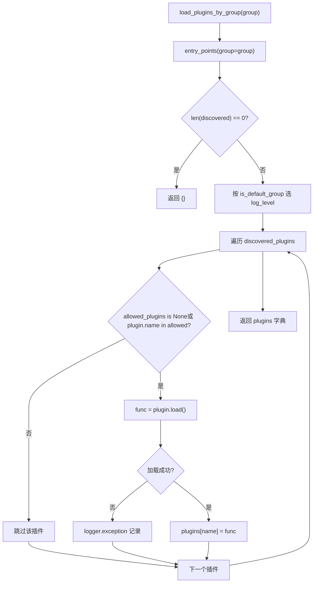
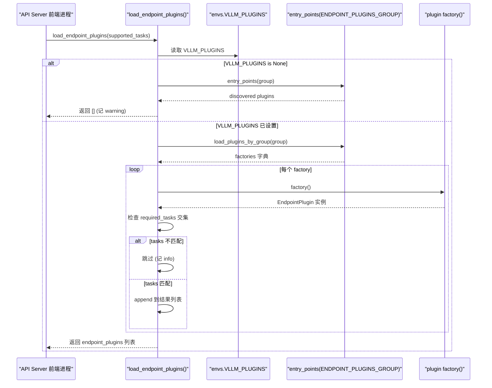

# 第 13 章：生产部署与稳定性：GPU 显存泄漏排查、死锁预防与高可用

上一章我们看到，前缀缓存、投机解码与 LoRA 这些高级特性都深度耦合在调度器、KV 管理与模型执行的核心路径中。但一个推理引擎要真正走向生产，光有性能还不够——它必须回答一个更棘手的问题：当社区想接入一块新硬件、一种新的多模态输入格式、或一条自定义 HTTP 路由时，如何在不 fork 核心代码的前提下完成？这正是插件系统存在的意义。vLLM 的架构天然是多进程的：API Server 前端进程、EngineCore 进程、以及每个 TP/PP rank 对应的 Worker 进程。如果插件机制只是简单地“在 import 时执行一段代码”，那么它要么在每个进程里重复执行导致副作用叠加，要么只在主进程执行导致 Worker 拿不到扩展。本章要拆解的，就是 vLLM 如何用 Python 标准的 entry_points 机制，配合分组（group）+ 进程边界 + 加载时机三重约束，构建出一套既能覆盖所有进程、又能精确控制暴露面的插件体系。我们聚焦三条主线：平台插件（适配新硬件）、IO processor 插件（介入多模态输入处理）、端点插件（注入自定义 API 路由）。三者的加载策略截然不同，理解这种差异，就理解了 vLLM 对“扩展能力”与“安全边界”的权衡哲学。

# 一、插件发现与加载：entry_points 的分组契约

## 直觉模型：插件的"广播频道"

把 vLLM 的插件系统想象成一组广播频道。每个插件包在安装时，通过 `setup.py` 的 `entry_points` 向某个频道"注册"自己的呼号（plugin name）和响应函数（plugin value）。vLLM 在启动时扫描这些频道，决定哪些频道在哪些进程里被"收听"。

若没有这套机制，扩展 vLLM 只能靠改源码——社区每加一块硬件就要维护一个 fork，最终版本分裂。分组机制的价值在于：**同一个插件包可以只注册到某个特定频道，从而被限定在特定进程加载**。

## 数据结构：五个分组常量与全局标志位

vLLM 在 `vllm/plugins/__init__.py` 顶部定义了五个 entry point group 常量，每个常量对应一个加载策略：

[FACT:vllm/plugins/__init__.py:16-30](https://github.com/vllm-project/vllm/blob/7ba3df63cbe2e3e7aca19074bed2958311f46400/vllm/plugins/__init__.py#L16-L30)

```python
DEFAULT_PLUGINS_GROUP = "vllm.general_plugins"
IO_PROCESSOR_PLUGINS_GROUP = "vllm.io_processor_plugins"
PLATFORM_PLUGINS_GROUP = "vllm.platform_plugins"
STAT_LOGGER_PLUGINS_GROUP = "vllm.stat_logger_plugins"
ENDPOINT_PLUGINS_GROUP = "vllm.endpoint_plugins"
```

注释里藏着关键信息：`DEFAULT_PLUGINS_GROUP` 在**所有进程**加载（process0、engine core、worker）；`IO_PROCESSOR_PLUGINS_GROUP` **只在 process0**；`PLATFORM_PLUGINS_GROUP` 在所有进程加载，但触发时机是 `current_platform` 首次被访问时；`STAT_LOGGER_PLUGINS_GROUP` 只在 process0 且异步模式下；`ENDPOINT_PLUGINS_GROUP` 只在 API Server 前端进程。

紧接着是一个模块级全局变量 `plugins_loaded = False` [FACT:vllm/plugins/__init__.py:32-33](https://github.com/vllm-project/vllm/blob/7ba3df63cbe2e3e7aca19074bed2958311f46400/vllm/plugins/__init__.py#L32-L33)，它是幂等加载的守卫——注释明确写着"make sure one process only loads plugins once"。

## Step-by-Step：一次 `load_plugins_by_group` 的完整调用流

代入场景：用户在 `setup.py` 里注册了 `vllm.general_plugins` 下的 `register_dummy_model`，现在 vLLM 启动，某个进程调用 `load_general_plugins()`。

**第一步：幂等守卫。** `load_general_plugins` 先检查 `plugins_loaded`，若已为 `True` 直接返回 [FACT:vllm/plugins/__init__.py:77-90](https://github.com/vllm-project/vllm/blob/7ba3df63cbe2e3e7aca19074bed2958311f46400/vllm/plugins/__init__.py#L77-L90)。注意这里有个微妙之处：守卫在加载**之前**就置位，意味着即使后续加载抛异常，也不会重试。这是刻意的——插件加载失败不应导致进程反复尝试。

**第二步：发现。** 进入 `load_plugins_by_group`，通过 `importlib.metadata.entry_points(group=group)` 拿到该分组下所有已安装的 entry points [FACT:vllm/plugins/__init__.py:36-45](https://github.com/vllm-project/vllm/blob/7ba3df63cbe2e3e7aca19074bed2958311f46400/vllm/plugins/__init__.py#L36-L45)。若为空，记 debug 日志后返回空字典。

**第三步：日志分级。** 源码区分了默认分组与非默认分组的日志级别：`is_default_group` 为真时用 `logger.debug`，否则用 `logger.info` [FACT:vllm/plugins/__init__.py:47-54](https://github.com/vllm-project/vllm/blob/7ba3df63cbe2e3e7aca19074bed2958311f46400/vllm/plugins/__init__.py#L47-L54)。动机很实际——`vllm.general_plugins` 下通常挂着大量模型注册插件，用 INFO 会刷屏；而平台/端点插件数量少且重要，值得 INFO 可见。

**第四步：白名单过滤。** 读取 `envs.VLLM_PLUGINS`，若为 `None` 则加载全部，否则只加载名字在列表中的插件 [FACT:vllm/plugins/__init__.py:62-70](https://github.com/vllm-project/vllm/blob/7ba3df63cbe2e3e7aca19074bed2958311f46400/vllm/plugins/__init__.py#L62-L70)。注意 `plugin.load()` 被包在 try/except 里，单个插件加载失败只记 exception 日志，不影响其他插件 [FACT:vllm/plugins/__init__.py:68-72](https://github.com/vllm-project/vllm/blob/7ba3df63cbe2e3e7aca19074bed2958311f46400/vllm/plugins/__init__.py#L68-L72)。

**第五步：执行。** 回到 `load_general_plugins`，对每个加载到的函数直接调用 `func()` [FACT:vllm/plugins/__init__.py:77-90](https://github.com/vllm-project/vllm/blob/7ba3df63cbe2e3e7aca19074bed2958311f46400/vllm/plugins/__init__.py#L77-L90)。这就是为什么文档强调插件函数必须**可重入（re-entrant）**——它可能在多个进程中被多次调用。

下面这张流程图刻画了 `load_plugins_by_group` 的完整决策路径：



## 设计思考：为什么用 entry_points 而非配置文件

> **〔设计推断与架构权衡〕**
> 选择 `entry_points` 而非自定义配置文件，核心动机是**让插件随 Python 包一起分发**。用户 `pip install vllm-add-dummy-platform` 后，插件自动出现在对应分组中，无需手动编辑 vLLM 的配置。这与 pytest、flake8 等工具的插件生态一脉相承。代价是插件发现依赖包的元数据，若插件包安装不完整（如只复制了源码目录而没走 pip），entry_points 就扫不到。

---

# 二、平台插件：硬件适配的抽象层

## 直觉模型：平台是"硬件方言翻译官"

`Platform` 类是整个 vLLM 与硬件对话的**唯一翻译官**。模型代码只调用 `current_platform.get_attn_backend_cls()`、`current_platform.is_cuda_alike()` 这类抽象方法，从不直接 `import torch.cuda`。若没有这层抽象，每支持一块新硬件就要在模型代码里加 `if device == "xpu"` 的分支，最终变成意大利面条。

## 数据结构：Platform 基类的字段布局

`Platform` 是一个纯类（非实例化使用），关键类属性定义在 `vllm/platforms/interface.py` 开头 [FACT:vllm/platforms/interface.py:135-179](https://github.com/vllm-project/vllm/blob/7ba3df63cbe2e3e7aca19074bed2958311f46400/vllm/platforms/interface.py#L135-L179)：

```python
class Platform:
    _enum: PlatformEnum
    device_name: str
    device_type: str
    dispatch_key: str = "CPU"
    ray_device_key: str = ""
    device_control_env_var: str = "VLLM_DEVICE_CONTROL_ENV_VAR_PLACEHOLDER"
    ray_noset_device_env_vars: list[str] = []
    simple_compile_backend: str = "inductor"
    dist_backend: str = ""
    supported_quantization: list[str] = []
    additional_env_vars: list[str] = []
    _global_graph_pool: Any | None = None
```

`_enum` 是 `PlatformEnum` 枚举值，决定 `is_cuda()`、`is_rocm()` 等判定 [FACT:vllm/platforms/interface.py:69-78](https://github.com/vllm-project/vllm/blob/7ba3df63cbe2e3e7aca19074bed2958311f46400/vllm/platforms/interface.py#L69-L78)。`device_control_env_var` 是平台无关的"设备可见性环境变量"抽象——CUDA 是 `CUDA_VISIBLE_DEVICES`，其他平台各自定义 [FACT:vllm/platforms/interface.py:151-152](https://github.com/vllm-project/vllm/blob/7ba3df63cbe2e3e7aca19074bed2958311f46400/vllm/platforms/interface.py#L151-L152)。`_global_graph_pool` 是类级别的 CUDA graph 内存池缓存，通过 `get_global_graph_pool` 惰性初始化 [FACT:vllm/platforms/interface.py:1210-1215](https://github.com/vllm-project/vllm/blob/7ba3df63cbe2e3e7aca19074bed2958311f46400/vllm/platforms/interface.py#L1210-L1215)。

值得注意的是 `__getattr__` 的兜底逻辑 [FACT:vllm/platforms/interface.py:1189-1208](https://github.com/vllm-project/vllm/blob/7ba3df63cbe2e3e7aca19074bed2958311f46400/vllm/platforms/interface.py#L1189-L1208)：当访问 Platform 上不存在的属性时，它会尝试从 `torch.<device_type>` 命名空间转发。这允许平台代码写 `current_platform.memory_allocated()` 而实际调用 `torch.cuda.memory_allocated()`。但源码特意排除了 dunder 方法——否则 pickle 检查 `__getstate__` 时会拿到 `None` 并试图调用它 [FACT:vllm/platforms/interface.py:1182-1185](https://github.com/vllm-project/vllm/blob/7ba3df63cbe2e3e7aca19074bed2958311f46400/vllm/platforms/interface.py#L1182-L1185)。

## Step-by-Step：设备 ID 的三命名空间转换

平台抽象中最容易踩坑的是**设备 ID 命名空间**。源码注释明确列出三种 [FACT:vllm/platforms/interface.py:275-283](https://github.com/vllm-project/vllm/blob/7ba3df63cbe2e3e7aca19074bed2958311f46400/vllm/platforms/interface.py#L275-L283)：

- **logical**：vLLM 内部的 local rank，索引 `_assigned_physical_gpu_ids`
- **visible**：当前进程经 `CUDA_VISIBLE_DEVICES` 重映射后的 torch/CUDA 序号
- **physical**：NVML 等拓扑 API 使用的全局 GPU ID，不受环境变量影响

代入场景：一个 Worker 进程被分配了物理 GPU `[4, 5]`，环境变量 `CUDA_VISIBLE_DEVICES=4,5`，现在需要把 local rank 0 转成 `torch.device("cuda:0")`。

**第一步：logical → physical。** `device_id_to_physical_device_id(0)` 先查 `_assigned_physical_gpu_ids`，若已设置则直接索引返回 `4` [FACT:vllm/platforms/interface.py:296-297](https://github.com/vllm-project/vllm/blob/7ba3df63cbe2e3e7aca19074bed2958311f46400/vllm/platforms/interface.py#L296-L297)。若未设置，则从 `device_control_env_var` 拆分逗号列表取第 0 项 [FACT:vllm/platforms/interface.py:305-311](https://github.com/vllm-project/vllm/blob/7ba3df63cbe2e3e7aca19074bed2958311f46400/vllm/platforms/interface.py#L305-L311)。注意源码特意把**空字符串**当作未设置处理——这是 Ray 在纯 CPU placement group 上启动引擎时的合法配置 [FACT:vllm/platforms/interface.py:296-297](https://github.com/vllm-project/vllm/blob/7ba3df63cbe2e3e7aca19074bed2958311f46400/vllm/platforms/interface.py#L296-L297)。

**第二步：physical → visible。** `logical_device_id_to_visible_device_id(0)` 拿到 physical `4` 后，再把环境变量拆成 `[4, 5]`，找到 `4` 的索引 `0` 返回 [FACT:vllm/platforms/interface.py:316-339](https://github.com/vllm-project/vllm/blob/7ba3df63cbe2e3e7aca19074bed2958311f46400/vllm/platforms/interface.py#L316-L339)。若 physical ID 不在可见列表中，抛 `RuntimeError`——这是防止跨进程误用不可见设备的硬防护。

`set_assigned_physical_gpu_ids` 的幂等设计也值得注意：重复设置相同值是无操作，设置不同值则抛 `RuntimeError` [FACT:vllm/platforms/interface.py:38-56](https://github.com/vllm-project/vllm/blob/7ba3df63cbe2e3e7aca19074bed2958311f46400/vllm/platforms/interface.py#L38-L56)。这防止了多线程环境下设备映射被意外覆盖。

## 平台插件的注册与配置注入

平台插件通过 `vllm.platform_plugins` 分组注册，插件函数返回平台类的全限定名（或 `None` 表示当前环境不支持）[FACT:docs/design/plugin_system.md:50-50](https://github.com/vllm-project/vllm/blob/7ba3df63cbe2e3e7aca19074bed2958311f46400/docs/design/plugin_system.md#L50-L50)。文档给出的最小实现要求 [FACT:docs/design/plugin_system.md:100-100](https://github.com/vllm-project/vllm/blob/7ba3df63cbe2e3e7aca19074bed2958311f46400/docs/design/plugin_system.md#L100-L100)：

- `_enum` 通常设为 `PlatformEnum.OOT`（out-of-tree）
- `device_type` 返回 PyTorch 认识的设备类型字符串
- `check_and_update_config` 在 vLLM 初始化早期被调用，**必须在此设置 `worker_cls`**
- `get_attn_backend_cls` 返回注意力后端类名
- `get_device_communicator_cls` 返回通信器类名

`check_and_update_config` 是平台插件最关键的钩子 [FACT:vllm/platforms/interface.py:583-592](https://github.com/vllm-project/vllm/blob/7ba3df63cbe2e3e7aca19074bed2958311f46400/vllm/platforms/interface.py#L583-L592)。它接收 `VllmConfig` 引用并原地修改，可以调整 block size、graph mode 等。文档强调"最重要的是 worker_cls 必须在此设置" [FACT:docs/design/plugin_system.md:105-105](https://github.com/vllm-project/vllm/blob/7ba3df63cbe2e3e7aca19074bed2958311f46400/docs/design/plugin_system.md#L105-L105)——因为 vLLM 需要知道用哪个 Worker 类来实例化工作进程。

## 设计思考：block size 对齐的三阶段策略

平台接口中最复杂的逻辑是 `update_block_size_for_backend` [FACT:vllm/platforms/interface.py:666-708](https://github.com/vllm-project/vllm/blob/7ba3df63cbe2e3e7aca19074bed2958311f46400/vllm/platforms/interface.py#L666-L708)。它分三阶段确保 block size 与注意力后端兼容：

**Phase 1**：若用户未显式指定 `--block-size`，调用 `_preferred_block_size_for_backends` 选出所有后端都支持的最小 block size [FACT:vllm/platforms/interface.py:687-697](https://github.com/vllm-project/vllm/blob/7ba3df63cbe2e3e7aca19074bed2958311f46400/vllm/platforms/interface.py#L687-L697)。这个函数用 LCM（最小公倍数）枚举候选值，因为某些后端（如 CPU_MLA）只接受精确尺寸而非倍数 [FACT:vllm/platforms/interface.py:622-663](https://github.com/vllm-project/vllm/blob/7ba3df63cbe2e3e7aca19074bed2958311f46400/vllm/platforms/interface.py#L622-L663)。

**Phase 2**：混合模型（attention + mamba）需对齐 block 与 mamba page size [FACT:vllm/platforms/interface.py:699-702](https://github.com/vllm-project/vllm/blob/7ba3df63cbe2e3e7aca19074bed2958311f46400/vllm/platforms/interface.py#L699-L702)。

**Phase 3**：多种 KV dtype 共享 block pool 时（如 nvfp4 主 + 未量化 skip 层），需把主 block 撑大到能覆盖最大的 padded spec page [FACT:vllm/platforms/interface.py:704-708](https://github.com/vllm-project/vllm/blob/7ba3df63cbe2e3e7aca19074bed2958311f46400/vllm/platforms/interface.py#L704-L708)。

> **〔设计推断与架构权衡〕**
> 这种分阶段设计反映了 vLLM 面对的现实：不同硬件、不同量化方案、不同模型架构对 block size 的约束互相冲突，无法用单一公式解决。分阶段让每个约束独立处理，最后取满足所有约束的解。

---

# 三、IO Processor 与端点插件：输入处理与 API 扩展

## 直觉模型：IO Processor 是"多模态翻译层"

多模态模型（如 LLaVA）的输入不是纯文本，而是文本 + 图像的混合体。IO Processor 插件负责把原始多模态数据转换成模型能吃的张量，再把模型输出转回人类可读格式。它像海关的翻译官：进来的外语（图像/音频）翻译成模型母语，出去的模型母语翻译回外语。

## Step-by-Step：IO Processor 的发现与实例化

代入场景：加载一个带 `io_processor_plugin` 字段的 HF config 的模型。

**第一步：确定插件名。** `get_io_processor` 优先用显式传入的 `plugin_from_init`，否则从 `hf_config` 的 `io_processor_plugin` 字段读取 [FACT:vllm/plugins/io_processors/__init__.py:42-50](https://github.com/vllm-project/vllm/blob/7ba3df63cbe2e3e7aca19074bed2958311f46400/vllm/plugins/io_processors/__init__.py#L42-L50)。若两者都为空，返回 `None`——表示该模型不需要 IO processor [FACT:vllm/plugins/io_processors/__init__.py:52-54](https://github.com/vllm-project/vllm/blob/7ba3df63cbe2e3e7aca19074bed2958311f46400/vllm/plugins/io_processors/__init__.py#L52-L54)。

**第二步：加载所有已安装插件。** 调用 `load_plugins_by_group(IO_PROCESSOR_PLUGINS_GROUP)` 拿到该分组下所有插件 [FACT:vllm/plugins/io_processors/__init__.py:59-61](https://github.com/vllm-project/vllm/blob/7ba3df63cbe2e3e7aca19074bed2958311f46400/vllm/plugins/io_processors/__init__.py#L59-L61)。

**第三步：构建可加载映射。** 遍历每个插件，调用其函数拿到 `processor_cls_qualname`，若非 `None` 则记入 `loadable_plugins` [FACT:vllm/plugins/io_processors/__init__.py:66-76](https://github.com/vllm-project/vllm/blob/7ba3df63cbe2e3e7aca19074bed2958311f46400/vllm/plugins/io_processors/__init__.py#L66-L76)。注意这里每个插件的函数调用也被 try/except 包裹，单个失败不影响其他。

**第四步：校验与实例化。** 若可加载插件数为 0，抛 `ValueError` 提示"需要 IOProcessor 插件但一个都没装" [FACT:vllm/plugins/io_processors/__init__.py:66-76](https://github.com/vllm-project/vllm/blob/7ba3df63cbe2e3e7aca19074bed2958311f46400/vllm/plugins/io_processors/__init__.py#L66-L76)。若模型要求的插件名不在可加载列表中，抛 `ValueError` 并列出所有可用插件名 [FACT:vllm/plugins/io_processors/__init__.py:80-81](https://github.com/vllm-project/vllm/blob/7ba3df63cbe2e3e7aca19074bed2958311f46400/vllm/plugins/io_processors/__init__.py#L80-L81)。最后通过 `resolve_obj_by_qualname` 解析类名并实例化 [FACT:vllm/plugins/io_processors/__init__.py:80-81](https://github.com/vllm-project/vllm/blob/7ba3df63cbe2e3e7aca19074bed2958311f46400/vllm/plugins/io_processors/__init__.py#L80-L81)。

## 端点插件：默认拒绝的安全姿态

端点插件是本章最特殊的一类，因为它**默认不加载**。`load_endpoint_plugins` 的文档字符串明确解释了原因：端点插件会向 API Server 添加 HTTP 路由，扩大了网络暴露面，因此采取比 `load_plugins_by_group` 更严格的"默认拒绝"姿态 [FACT:vllm/plugins/__init__.py:93-94](https://github.com/vllm-project/vllm/blob/7ba3df63cbe2e3e7aca19074bed2958311f46400/vllm/plugins/__init__.py#L93-L94)。

具体规则是：只有当插件名**显式出现在 `VLLM_PLUGINS` 中**，且其 `required_tasks` 为 `None` 或与服务器支持的 tasks 有交集时，才被加载 [FACT:vllm/plugins/__init__.py:108-108](https://github.com/vllm-project/vllm/blob/7ba3df63cbe2e3e7aca19074bed2958311f46400/vllm/plugins/__init__.py#L108-L108)。

代入场景：用户安装了端点插件但忘了设 `VLLM_PLUGINS`。

**第一步：检查 VLLM_PLUGINS 是否未设。** 若 `envs.VLLM_PLUGINS is None`，先发现该分组下的插件，若有则记 warning 提示"必须显式 allowlist" [FACT:vllm/plugins/__init__.py:126-126](https://github.com/vllm-project/vllm/blob/7ba3df63cbe2e3e7aca19074bed2958311f46400/vllm/plugins/__init__.py#L126-L126)。注意源码注释特别指出：`VLLM_PLUGINS=""` 解析为 `[""]` 而非 `None`，因此被视为"匹配不到任何插件的 allowlist"，而非"未设置" [FACT:vllm/plugins/__init__.py:108-108](https://github.com/vllm-project/vllm/blob/7ba3df63cbe2e3e7aca19074bed2958311f46400/vllm/plugins/__init__.py#L108-L108)。这个边界区分很重要——空字符串是显式的"什么都不加载"，而 `None` 是"未配置"。

**第二步：加载并实例化。** 通过 `load_plugins_by_group` 拿到工厂函数后，逐个调用 `factory()` 实例化 [FACT:vllm/plugins/__init__.py:133-141](https://github.com/vllm-project/vllm/blob/7ba3df63cbe2e3e7aca19074bed2958311f46400/vllm/plugins/__init__.py#L133-L141)。实例化失败记 exception 并 continue。

**第三步：task 门控。** 检查 `plugin.required_tasks`，若不为 `None` 且与 `supported_tasks` 无交集，跳过该插件 [FACT:vllm/plugins/__init__.py:144-145](https://github.com/vllm-project/vllm/blob/7ba3df63cbe2e3e7aca19074bed2958311f46400/vllm/plugins/__init__.py#L144-L145)。这允许同一个插件包针对不同任务（如 embedding vs generation）注册不同端点。

下面这张时序图刻画了端点插件从发现到加载的完整交互：



## 设计思考：进程边界决定加载策略

三类插件的加载策略差异，本质是**进程边界**的映射：

| 插件类型 | 加载进程 | 默认行为 | 动机 |
| --- | --- | --- | --- |
| general | 所有进程 | 全部加载 | 模型注册需在每个 Worker 可见 |
| platform | 所有进程 | 全部加载 | 硬件抽象被所有进程依赖 |
| io_processor | 仅 process0 | 全部加载 | 输入处理只在前端发生 |
| stat_logger | 仅 process0（异步） | 全部加载 | 日志只在主进程收集 |
| endpoint | 仅 API Server | **默认拒绝** | 扩大网络暴露面，需显式授权 |

> **〔设计推断与架构权衡〕**
> 端点插件的"默认拒绝"是安全工程的标准做法：任何扩大攻击面的扩展都应 opt-in。而其他插件默认加载，是因为它们不直接暴露网络接口，且社区生态需要低摩擦的接入体验。

## 生产踩坑：插件加载失败的静默降级

`load_plugins_by_group` 对每个插件的 `plugin.load()` 用 try/except 包裹，失败只记 exception [FACT:vllm/plugins/__init__.py:68-72](https://github.com/vllm-project/vllm/blob/7ba3df63cbe2e3e7aca19074bed2958311f46400/vllm/plugins/__init__.py#L68-L72)。这意味着**一个损坏的插件不会阻止 vLLM 启动**，但也不会给出显式错误——用户可能困惑于"为什么我的插件没生效"。

排查建议：把日志级别调到 DEBUG，搜索 `"Failed to load plugin"`。若插件在 `vllm.general_plugins` 分组下，默认日志级别是 DEBUG，需要显式开启才能看到加载详情 [FACT:vllm/plugins/__init__.py:49-50](https://github.com/vllm-project/vllm/blob/7ba3df63cbe2e3e7aca19074bed2958311f46400/vllm/plugins/__init__.py#L49-L50)。

另一个坑是 `plugins_loaded` 守卫的置位时机 [FACT:vllm/plugins/__init__.py:77-90](https://github.com/vllm-project/vllm/blob/7ba3df63cbe2e3e7aca19074bed2958311f46400/vllm/plugins/__init__.py#L77-L90)：它在加载前就置 `True`。若首次加载因某种原因失败（如 entry_points 扫描异常），后续调用会直接返回而不重试。这在测试环境中可能导致"插件时好时坏"的诡异现象。

---

# 本章小结

vLLM 的插件系统建立在 Python `entry_points` 之上，通过**五个分组常量**划分扩展类型，通过**进程边界**决定加载范围，通过**`VLLM_PLUGINS` 白名单**控制加载集合。平台插件用 `Platform` 基类抽象硬件差异，其设备 ID 三命名空间转换（logical/visible/physical）是跨进程设备管理的核心；IO processor 插件通过 HF config 的 `io_processor_plugin` 字段触发，负责多模态输入的翻译；端点插件采取"默认拒绝"姿态，只有显式 allowlist 且 task 匹配时才加载，以控制网络暴露面。

三条主线共享同一套发现机制，但加载策略的差异体现了 vLLM 对"扩展便利性"与"安全边界"的权衡：不暴露网络的插件默认加载，暴露网络的插件必须 opt-in。

# 本章思考与自测

Q1: 若把 `load_plugins_by_group` 中 `plugin.load()` 的 try/except 去掉，让加载失败直接抛出，会对 vLLM 的多进程启动产生什么影响？在什么场景下这反而是更好的设计？

> **〔设计推断与架构权衡〕**
> **参考解析**：当前实现 [FACT:vllm/plugins/__init__.py:68-72](https://github.com/vllm-project/vllm/blob/7ba3df63cbe2e3e7aca19074bed2958311f46400/vllm/plugins/__init__.py#L68-L72) 让单个插件加载失败被静默吞掉，只记 exception 日志。若去掉 try/except，加载失败会向上传播到 `load_general_plugins`，进而中断进程启动。在多进程场景下，这会导致：若某个 Worker 进程的插件加载失败，整个引擎无法启动——这可能是好事（快速失败，避免部分进程带病运行导致状态不一致），也可能是坏事（一个可选插件的 bug 拖垮整个服务）。 更好的设计可能是引入 `VLLM_PLUGINS_STRICT` 环境变量：默认宽松（当前行为），严格模式下加载失败即抛异常。这样生产环境可以要求"所有声明的插件必须成功加载"，而开发环境保持容错。

Q2: `load_endpoint_plugins` 中，`VLLM_PLUGINS=""` 与 `VLLM_PLUGINS` 未设置（`None`）的行为差异是什么？源码为什么要特意区分这两种情况？

> **〔设计推断与架构权衡〕**
> **参考解析**：源码注释明确指出 `VLLM_PLUGINS=""` 解析为 `[""]` 而非 `None`，因此被视为"匹配不到任何插件的 allowlist" [FACT:vllm/plugins/__init__.py:108-108](https://github.com/vllm-project/vllm/blob/7ba3df63cbe2e3e7aca19074bed2958311f46400/vllm/plugins/__init__.py#L108-L108)。当 `VLLM_PLUGINS is None` 时，`load_endpoint_plugins` 直接返回 `[]` 并记 warning [FACT:vllm/plugins/__init__.py:126-126](https://github.com/vllm-project/vllm/blob/7ba3df63cbe2e3e7aca19074bed2958311f46400/vllm/plugins/__init__.py#L126-L126)；而当 `VLLM_PLUGINS=""` 时，代码会继续走到 `load_plugins_by_group`，但由于空字符串不匹配任何插件名，最终也返回空列表。两者的**结果相同**（都不加载端点插件），但**语义不同**：`None` 表示"用户未配置，我们主动拒绝并警告"，`""` 表示"用户显式配置了空 allowlist，我们尊重其意图不警告"。 这种区分让运维可以通过设置空字符串来"静默禁用所有端点插件"，而不必忍受每次启动的 warning 噪音。

Q3: `device_id_to_physical_device_id` 中，为什么源码把空的 `device_control_env_var` 当作未设置处理 [FACT:vllm/platforms/interface.py:302-308](https://github.com/vllm-project/vllm/blob/7ba3df63cbe2e3e7aca19074bed2958311f46400/vllm/platforms/interface.py#L302-L308)？若去掉这个空字符串检查，在 Ray 的 CPU-only placement group 场景下会发生什么？

**参考解析**：源码注释解释，空的环境变量是 Ray 在 GPU 节点上启动 CPU-only placement group 时的合法配置 [FACT:vllm/platforms/interface.py:296-297](https://github.com/vllm-project/vllm/blob/7ba3df63cbe2e3e7aca19074bed2958311f46400/vllm/platforms/interface.py#L296-L297)。若去掉 `!= ""` 检查，代码会进入 `device_ids = "".split(",")` 分支，得到 `[""]`，然后 `device_ids[device_id]` 返回空字符串，最终 `int("")` 抛 `ValueError`。这会导致引擎在合法的 Ray 配置下启动失败。保留检查后，空环境变量走 `else` 分支直接返回 `device_id`，即假设 logical ID 等于 physical ID——这在 CPU-only 场景下是安全的，因为没有 GPU 需要映射。这个案例说明：环境变量的"未设置"与"设置为空"在分布式编排系统中语义不同，代码必须显式处理。

---

下一章将转向架构权衡、生产踩坑与未来演进，我们会把前十三章拆解过的机制放在一起，审视 vLLM 在性能、可维护性与扩展性之间的取舍，并展望推理引擎的演进方向。

至此，我们已经看清 vLLM 如何通过 entry_points 的分组机制、进程边界感知的加载时机，以及平台、IO processor、端点三类插件的差异化策略，在保持核心代码稳定的同时打开扩展面。这套插件体系让新硬件、新输入格式和新 API 路由都能以非侵入方式接入，但扩展性本身也意味着更多需要权衡的维度。下一章将收束全书，系统梳理 vLLM 关键设计决策中的张力——连续批处理与显存碎片、CUDA Graph 与动态形状、分离式部署与网络开销——并给出一份生产环境踩坑清单与诊断路径，同时展望 Rust 前端、IR 层与异构硬件方向的演进趋势。
