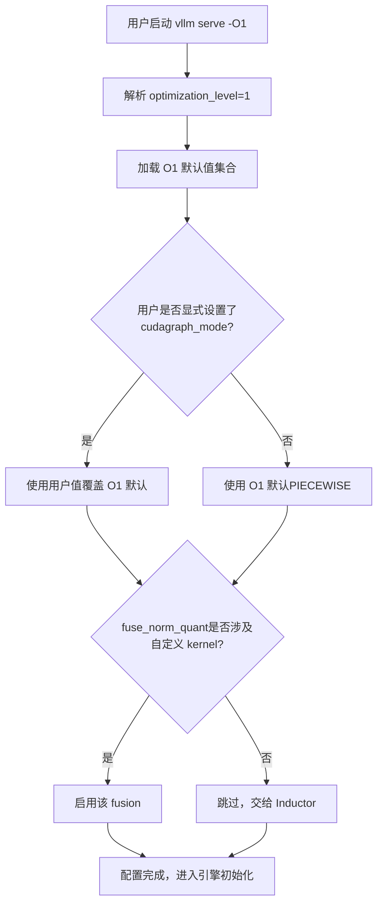
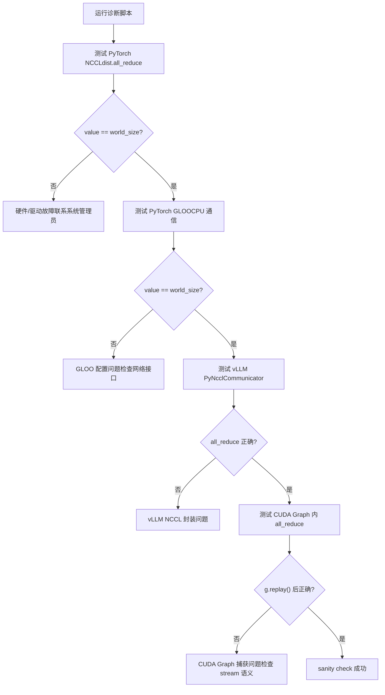
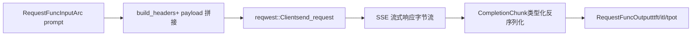

# 第 14 章：演进历程与架构前瞻：vLLM v1 到未来推理系统的演化路径

上一章我们拆解了 vLLM 的插件化扩展机制，看到平台插件、IO processor 插件和端点插件如何在不修改核心代码的前提下，让引擎适配新硬件、新模态和新 API。这种可扩展性让 vLLM 能够快速拥抱变化，但扩展点越多，生产环境中的交互路径就越复杂。当显存碎片化、NCCL 握手失败、编译缓存失效、网络抖动这些真实问题同时出现时，前十三章介绍的机制会彼此拉扯，暴露出理想环境下不曾显现的张力。本章不再引入新的核心机制，而是把这些机制放在一起，以官方 troubleshooting 文档为锚点，结合 Rust 前端 bench 工具的设计，审视性能与可运维性之间的取舍，并给出一份可操作的诊断路径。

# 一、优化等级：启动时间与运行性能的显式契约

## 直觉模型

优化等级就像相机的“场景模式”：自动档（`-O2`）适合大多数场景，但当你需要快速抓拍（调试）时，切到手动档（`-O0`）能立刻响应，代价是画质（性能）下降。vLLM 把这种取舍做成了显式的四档契约，而不是藏在几十个布尔 flag 里让用户自己拼。

## 四档的字段布局

vLLM 提供 `-O0` 到 `-O3` 四个等级 [FACT:docs/design/optimization_levels.md:5-5](https://github.com/vllm-project/vllm/blob/7ba3df63cbe2e3e7aca19074bed2958311f46400/docs/design/optimization_levels.md#L5-L5)。核心设计原则是：**用户显式设置的 flag 优先于优化等级的默认值** [FACT:docs/design/optimization_levels.md:5-5](https://github.com/vllm-project/vllm/blob/7ba3df63cbe2e3e7aca19074bed2958311f46400/docs/design/optimization_levels.md#L5-L5)。这意味着优化等级只是一组默认值的集合，不是硬性约束。

`-O0` 关闭一切：无 autotuning、无编译、无 cudagraph [FACT:docs/design/optimization_levels.md:32-33](https://github.com/vllm-project/vllm/blob/7ba3df63cbe2e3e7aca19074bed2958311f46400/docs/design/optimization_levels.md#L32-L33)。具体落到四个开关：`cudagraph_mode=NONE`、`mode=NONE`、所有 fusion 关闭、`enable_flashinfer_autotune=False` [FACT:docs/design/optimization_levels.md:37-40](https://github.com/vllm-project/vllm/blob/7ba3df63cbe2e3e7aca19074bed2958311f46400/docs/design/optimization_levels.md#L37-L40)。

`-O1` 是开发场景的平衡点：启用 `PIECEWISE` cudagraph 和 `VLLM_COMPILE` 模式 [FACT:docs/design/optimization_levels.md:50-51](https://github.com/vllm-project/vllm/blob/7ba3df63cbe2e3e7aca19074bed2958311f46400/docs/design/optimization_levels.md#L50-L51)。注意这里有个精妙的细节：`fuse_norm_quant` 和 `fuse_act_quant` 只在其中一个算子使用自定义 kernel 时才启用，否则 Inductor 的自动融合效果更好 [FACT:docs/design/optimization_levels.md:61](https://github.com/vllm-project/vllm/blob/7ba3df63cbe2e3e7aca19074bed2958311f46400/docs/design/optimization_levels.md#L61)。这是一个典型的“不要和编译器抢活干”的设计判断。

`-O2` 是默认值，面向生产 [FACT:docs/design/optimization_levels.md:66-67](https://github.com/vllm-project/vllm/blob/7ba3df63cbe2e3e7aca19074bed2958311f46400/docs/design/optimization_levels.md#L66-L67)。它在 `-O1` 基础上追加 `FULL_AND_PIECEWISE` cudagraph 和 `fuse_allreduce_rms` [FACT:docs/design/optimization_levels.md:72-73](https://github.com/vllm-project/vllm/blob/7ba3df63cbe2e3e7aca19074bed2958311f46400/docs/design/optimization_levels.md#L72-L73)。`-O3` 当前等同于 `-O2`，为未来更激进的实验性优化预留 [FACT:docs/design/optimization_levels.md:80-81](https://github.com/vllm-project/vllm/blob/7ba3df63cbe2e3e7aca19074bed2958311f46400/docs/design/optimization_levels.md#L80-L81)。

## 场景驱动的选择流程

当一个用户执行 `vllm serve model -O1` 时，内部发生了什么？下面的流程图展示了优化等级如何与用户 flag 交互：

这个流程的关键在于 `check_user` 分支：用户显式设置永远优先 [FACT:docs/design/optimization_levels.md:5-5](https://github.com/vllm-project/vllm/blob/7ba3df63cbe2e3e7aca19074bed2958311f46400/docs/design/optimization_levels.md#L5-L5)。这避免了“优化等级悄悄覆盖了我的调试 flag”这类难以排查的问题。

## 设计思考与踩坑

优化等级最常见的生产陷阱是**启动时间过长**。文档明确建议：启动时间过长时用 `-O0` 或 `-O1` [FACT:docs/design/optimization_levels.md:87](https://github.com/vllm-project/vllm/blob/7ba3df63cbe2e3e7aca19074bed2958311f46400/docs/design/optimization_levels.md#L87)。但这里有个隐性代价——`-O0` 下没有 cudagraph，每个 kernel 的 CPU 发射开销会暴露出来，在高并发场景下吞吐可能下降数倍。

另一个陷阱是**编译错误**。`-O2` 的 `FULL_AND_PIECEWISE` cudagraph 对模型结构有更强的假设，某些自定义模型在 `-O2` 下编译失败但在 `-O1` 下正常。文档建议用 `debug_dump_path` 获取更多调试信息 [FACT:docs/design/optimization_levels.md:88](https://github.com/vllm-project/vllm/blob/7ba3df63cbe2e3e7aca19074bed2958311f46400/docs/design/optimization_levels.md#L88)。排查路径应该是：先用 `-O0` 确认功能正确，再逐步升到 `-O1`、`-O2`，定位是哪一档引入的问题。

> **〔设计推断与架构权衡〕**
> 这种“分级降级”的排查思路，本质上和 CUDA Graph 的 `--enforce-eager` 是同一套方法论：先用最保守的配置确认正确性，再逐步启用优化，把问题隔离到最小的配置差异上。

---

# 二、生产踩坑清单：从症状到根因的诊断路径

## 直觉模型

生产环境的故障排查就像急诊分诊：你不能对所有病人做全套检查，必须先根据症状（OOM、hang、崩溃）快速缩小范围，再针对性深挖。vLLM 的 troubleshooting 文档本质上就是一份分诊手册。

## 症状分类与诊断工具

文档把常见问题分成几大类，我们按诊断难度递进梳理。

**第一类：模型下载/加载挂起。** 症状是启动后长时间无响应。根因通常是网络慢或共享文件系统慢 [FACT:docs/usage/troubleshooting.md:11-11](https://github.com/vllm-project/vllm/blob/7ba3df63cbe2e3e7aca19074bed2958311f46400/docs/usage/troubleshooting.md#L11-L11)。诊断手段是 `--load-format dummy` 跳过权重加载，隔离出到底是下载慢还是加载慢 [FACT:docs/usage/troubleshooting.md:23-23](https://github.com/vllm-project/vllm/blob/7ba3df63cbe2e3e7aca19074bed2958311f46400/docs/usage/troubleshooting.md#L23-L23)。这是一个典型的“二分法隔离”技巧。

**第二类：显存 OOM。** 文档直接指向 conserving_memory 配置文档 [FACT:docs/usage/troubleshooting.md:23](https://github.com/vllm-project/vllm/blob/7ba3df63cbe2e3e7aca19074bed2958311f46400/docs/usage/troubleshooting.md#L23)。但生产中的 OOM 往往不是模型太大，而是 KV cache 碎片或并发请求数超预期。

**第三类：生成质量变化。** 这是一个容易被忽视的坑。v0.8.0 改变了默认采样参数的来源：从 vLLM 的中性默认值改为模型作者的 `generation_config.json` [FACT:docs/usage/troubleshooting.md:23-23](https://github.com/vllm-project/vllm/blob/7ba3df63cbe2e3e7aca19074bed2958311f46400/docs/usage/troubleshooting.md#L23-L23)。大多数情况下这提升了质量，但某些模型的配置反而更差 [FACT:docs/usage/troubleshooting.md:23-23](https://github.com/vllm-project/vllm/blob/7ba3df63cbe2e3e7aca19074bed2958311f46400/docs/usage/troubleshooting.md#L23-L23)。诊断方法是回退到 `--generation-config vllm` 对比 [FACT:docs/usage/troubleshooting.md:23-23](https://github.com/vllm-project/vllm/blob/7ba3df63cbe2e3e7aca19074bed2958311f46400/docs/usage/troubleshooting.md#L23-L23)。

**第四类：卡死（hang）。** 这是最难诊断的一类。文档给出了一组递进的调试环境变量 [FACT:docs/usage/troubleshooting.md:41-41](https://github.com/vllm-project/vllm/blob/7ba3df63cbe2e3e7aca19074bed2958311f46400/docs/usage/troubleshooting.md#L41-L41)：

- `VLLM_LOGGING_LEVEL=DEBUG`：打开详细日志
- `VLLM_LOG_STATS_INTERVAL=1.`：高频输出队列和缓存命中状态
- `CUDA_LAUNCH_BLOCKING=1`：定位是哪个 CUDA kernel 出问题
- `NCCL_DEBUG=TRACE`：打开 NCCL 详细日志
- `VLLM_TRACE_FUNCTION=1`：记录所有函数调用，但会拖慢 100 倍以上 [FACT:docs/usage/troubleshooting.md:41](https://github.com/vllm-project/vllm/blob/7ba3df63cbe2e3e7aca19074bed2958311f46400/docs/usage/troubleshooting.md#L41)

这里有个重要的运维纪律：调试完必须关闭这些环境变量，或直接开新 shell，否则残留的调试配置会持续拖慢系统 [FACT:docs/usage/troubleshooting.md:11-11](https://github.com/vllm-project/vllm/blob/7ba3df63cbe2e3e7aca19074bed2958311f46400/docs/usage/troubleshooting.md#L11-L11)。

## 断点调试的进程边界陷阱

vLLM 的多进程架构让常规 `pdb` 断点失效——断点如果在子进程中执行，会抛出 `BdbQuit` [FACT:docs/usage/troubleshooting.md:45-54](https://github.com/vllm-project/vllm/blob/7ba3df63cbe2e3e7aca19074bed2958311f46400/docs/usage/troubleshooting.md#L45-L54)。两种解法：用 `forked-pdb` [FACT:docs/usage/troubleshooting.md:57-61](https://github.com/vllm-project/vllm/blob/7ba3df63cbe2e3e7aca19074bed2958311f46400/docs/usage/troubleshooting.md#L57-L61)，或设置 `VLLM_ENABLE_V1_MULTIPROCESSING=0` 把调度器留在同进程 [FACT:docs/usage/troubleshooting.md:63-68](https://github.com/vllm-project/vllm/blob/7ba3df63cbe2e3e7aca19074bed2958311f46400/docs/usage/troubleshooting.md#L63-L68)。

> **〔设计推断与架构权衡〕**
> 第二种方法虽然方便，但会改变执行模型——单进程模式下 EngineCore 和 API Server 不再通过队列通信，某些并发 bug 可能无法复现。所以它适合定位逻辑错误，不适合复现并发问题。

## 分布式通信的诊断

分布式部署有专门的诊断文档。核心建议是：**在集群创建时设置环境变量**，因为变量会传播到所有节点；而在 shell 中设置只影响本地节点 [FACT:docs/serving/distributed_troubleshooting.md:16-16](https://github.com/vllm-project/vllm/blob/7ba3df63cbe2e3e7aca19074bed2958311f46400/docs/serving/distributed_troubleshooting.md#L16-L16)。

一个高频问题是 `No available node types can fulfill resource request`，即使集群有足够 GPU 也会出现 [FACT:docs/serving/distributed_troubleshooting.md:16-16](https://github.com/vllm-project/vllm/blob/7ba3df63cbe2e3e7aca19074bed2958311f46400/docs/serving/distributed_troubleshooting.md#L16-L16)。根因通常是节点有多个 IP，vLLM 选错了。解法是用 `VLLM_HOST_IP` 显式指定，并用 `ray status` 验证 [FACT:docs/serving/distributed_troubleshooting.md:16-16](https://github.com/vllm-project/vllm/blob/7ba3df63cbe2e3e7aca19074bed2958311f46400/docs/serving/distributed_troubleshooting.md#L16-L16)。

## NCCL 初始化失败的诊断脚本

文档提供了一个完整的诊断脚本，逐层验证通信栈 [FACT:docs/usage/troubleshooting.md:89-150](https://github.com/vllm-project/vllm/blob/7ba3df63cbe2e3e7aca19074bed2958311f46400/docs/usage/troubleshooting.md#L89-L150)。它的设计很有层次：

这个脚本的精妙之处在于它逐层隔离：先验证最底层的 PyTorch NCCL，再验证 CPU 侧的 GLOO，再验证 vLLM 自己的 PyNcclCommunicator 封装，最后验证 CUDA Graph 内的通信 [FACT:docs/usage/troubleshooting.md:90-146](https://github.com/vllm-project/vllm/blob/7ba3df63cbe2e3e7aca19074bed2958311f46400/docs/usage/troubleshooting.md#L90-L146)。每一层失败都指向不同的根因。

脚本中一个值得注意的细节：`pynccl.disabled = False` 是为了向后兼容 0.6.4 及以下版本 [FACT:docs/usage/troubleshooting.md:121-125](https://github.com/vllm-project/vllm/blob/7ba3df63cbe2e3e7aca19074bed2958311f46400/docs/usage/troubleshooting.md#L121-L125)。0.6.5+ 默认启用，但保留这行代码让读最新文档的用户不会困惑。

多节点测试时，文档特意用 `--rdzv_backend=static` 而非 `c10d`，因为 `c10d` 在多节点下会因 DNS 解析失败 [FACT:docs/usage/troubleshooting.md:168-168](https://github.com/vllm-project/vllm/blob/7ba3df63cbe2e3e7aca19074bed2958311f46400/docs/usage/troubleshooting.md#L168-L168)。这是一个典型的“踩过坑才知道”的配置。

## 设计思考与踩坑

**NCCL 初始化失败**（`ncclCommInitRank` 报 unhandled system error）通常指向两个根因：缺少 `IPC_LOCK` capability 或 `/dev/shm` 未挂载 [FACT:docs/usage/troubleshooting.md:311-311](https://github.com/vllm-project/vllm/blob/7ba3df63cbe2e3e7aca19074bed2958311f46400/docs/usage/troubleshooting.md#L311-L311)。这两个都是容器化部署的经典陷阱。

**CUDA PTX 工具链不匹配**（`the provided PTX was compiled with an unsupported toolchain`）说明 wheel 里的 PTX 是用更高版本的 CUDA toolkit 编译的 [FACT:docs/usage/troubleshooting.md:325-327](https://github.com/vllm-project/vllm/blob/7ba3df63cbe2e3e7aca19074bed2958311f46400/docs/usage/troubleshooting.md#L325-L327)。解法是启用 CUDA forward compatibility：Docker 下加 `-e VLLM_ENABLE_CUDA_COMPATIBILITY=1` [FACT:docs/usage/troubleshooting.md:325-327](https://github.com/vllm-project/vllm/blob/7ba3df63cbe2e3e7aca19074bed2958311f46400/docs/usage/troubleshooting.md#L325-L327)，裸机下装 `cuda-compat` 包并设置 `VLLM_CUDA_COMPATIBILITY_PATH` [FACT:docs/usage/troubleshooting.md:325-327](https://github.com/vllm-project/vllm/blob/7ba3df63cbe2e3e7aca19074bed2958311f46400/docs/usage/troubleshooting.md#L325-L327)。

**已知的 NCCL 内存开销问题**：vLLM `>= 0.4.3, <= 0.10.1.1` 会设置 `NCCL_CUMEM_ENABLE=0` 来规避 NCCL bug，外部进程连接 vLLM 时也必须设置这个变量，否则会 hang 或崩溃 [FACT:docs/usage/troubleshooting.md:375](https://github.com/vllm-project/vllm/blob/7ba3df63cbe2e3e7aca19074bed2958311f46400/docs/usage/troubleshooting.md#L375)。NCCL 2.22.3 修复后，新版本移除了这个覆盖以允许性能优化 [FACT:docs/usage/troubleshooting.md:375](https://github.com/vllm-project/vllm/blob/7ba3df63cbe2e3e7aca19074bed2958311f46400/docs/usage/troubleshooting.md#L375)。这个案例说明：**跨进程的环境变量契约是分布式系统的隐性依赖**，升级时必须同步。

---

# 三、Rust 前端：bench 工具的零拷贝设计哲学

## 直觉模型

如果说 Python 前端是“功能完备但笨重”的瑞士军刀，Rust bench 工具就是“只为压测而生”的手术刀。它的设计目标不是功能覆盖，而是在高并发下把客户端自身的开销压到最低，让测出来的数字真实反映服务端性能。

## 数据结构与内存布局

bench 工具的核心数据结构是 `RequestFuncInput` [FACT:rust/src/bench/src/backends/mod.rs:59-89](https://github.com/vllm-project/vllm/blob/7ba3df63cbe2e3e7aca19074bed2958311f46400/rust/src/bench/src/backends/mod.rs#L59-L89)。它大量使用 `Arc<str>` 和 `Arc<[u32]>` 而非 `String`/`Vec`，这是零拷贝设计的核心。

看几个关键字段：`prompt: Arc<str>` [FACT:rust/src/bench/src/backends/mod.rs:50-52](https://github.com/vllm-project/vllm/blob/7ba3df63cbe2e3e7aca19074bed2958311f46400/rust/src/bench/src/backends/mod.rs#L50-L52)——多个并发请求可以共享同一个 prompt 字符串，避免每个请求都克隆一份。`prompt_token_ids: Option<Arc<[u32]>>` [FACT:rust/src/bench/src/backends/mod.rs:77](https://github.com/vllm-project/vllm/blob/7ba3df63cbe2e3e7aca19074bed2958311f46400/rust/src/bench/src/backends/mod.rs#L77)——预计算的 token ID 直接发给服务端，跳过服务端 tokenization [FACT:rust/src/bench/src/backends/mod.rs:74-76](https://github.com/vllm-project/vllm/blob/7ba3df63cbe2e3e7aca19074bed2958311f46400/rust/src/bench/src/backends/mod.rs#L74-L76)。

最精妙的是 `multi_modal_content: Option<Arc<[Arc<str>]>>` [FACT:rust/src/bench/src/backends/mod.rs:81](https://github.com/vllm-project/vllm/blob/7ba3df63cbe2e3e7aca19074bed2958311f46400/rust/src/bench/src/backends/mod.rs#L81)。注释解释：多模态内容作为预序列化的 JSON 片段，chat backend 直接拼接进 payload 字节流，避免任何解析或深拷贝 base64 图像数据 [FACT:rust/src/bench/src/backends/mod.rs:78-80](https://github.com/vllm-project/vllm/blob/7ba3df63cbe2e3e7aca19074bed2958311f46400/rust/src/bench/src/backends/mod.rs#L78-L80)。这是一个双层 `Arc` 结构：外层 `Arc<[...]>` 共享整个数组，内层 `Arc<str>` 共享单个片段。

`chat_messages_json: Option<Arc<str>>` 优先级最高，直接原样拼进 payload [FACT:rust/src/bench/src/backends/mod.rs:82-85](https://github.com/vllm-project/vllm/blob/7ba3df63cbe2e3e7aca19074bed2958311f46400/rust/src/bench/src/backends/mod.rs#L82-L85)。

## 零分配反序列化

SSE 流式响应的解析是另一个性能关键点。注释明确指出：使用类型化反序列化避免构建完整的 `serde_json::Value` 树，只提取需要的字段 [FACT:rust/src/bench/src/backends/mod.rs:20-24](https://github.com/vllm-project/vllm/blob/7ba3df63cbe2e3e7aca19074bed2958311f46400/rust/src/bench/src/backends/mod.rs#L20-L24)。

`CompletionChunk` 只保留 `choices` 和 `usage` 两个字段 [FACT:rust/src/bench/src/backends/mod.rs:20-24](https://github.com/vllm-project/vllm/blob/7ba3df63cbe2e3e7aca19074bed2958311f46400/rust/src/bench/src/backends/mod.rs#L20-L24)，`ChatChunk` 同理 [FACT:rust/src/bench/src/backends/mod.rs:33-37](https://github.com/vllm-project/vllm/blob/7ba3df63cbe2e3e7aca19074bed2958311f46400/rust/src/bench/src/backends/mod.rs#L33-L37)。`#[serde(default)]` 让缺失的 `choices` 字段默认为空数组 [FACT:rust/src/bench/src/backends/mod.rs:20-24](https://github.com/vllm-project/vllm/blob/7ba3df63cbe2e3e7aca19074bed2958311f46400/rust/src/bench/src/backends/mod.rs#L20-L24)，这是流式响应的常见情况。

## 场景驱动的请求流程

当一个压测请求发出时，数据如何流转？下面的数据流图展示了从输入到输出的转换：

`Backend` 枚举用静态分发避免 async trait object 的问题 [FACT:rust/src/bench/src/backends/mod.rs:150-154](https://github.com/vllm-project/vllm/blob/7ba3df63cbe2e3e7aca19074bed2958311f46400/rust/src/bench/src/backends/mod.rs#L150-L154)。`send_request` 通过 `match` 分发到具体实现 [FACT:rust/src/bench/src/backends/mod.rs:158-168](https://github.com/vllm-project/vllm/blob/7ba3df63cbe2e3e7aca19074bed2958311f46400/rust/src/bench/src/backends/mod.rs#L158-L168)。`get_backend` 根据 `BackendKind` 返回对应后端 [FACT:rust/src/bench/src/backends/mod.rs:172-181](https://github.com/vllm-project/vllm/blob/7ba3df63cbe2e3e7aca19074bed2958311f46400/rust/src/bench/src/backends/mod.rs#L172-L181)。

一个细节：`API_KEY` 用 `OnceLock` 缓存，避免每个请求都做一次环境变量 syscall [FACT:rust/src/bench/src/backends/mod.rs:186-188](https://github.com/vllm-project/vllm/blob/7ba3df63cbe2e3e7aca19074bed2958311f46400/rust/src/bench/src/backends/mod.rs#L186-L188)。`build_headers` 依次插入 Content-Type、Authorization、extra headers、request-id [FACT:rust/src/bench/src/backends/mod.rs:191-215](https://github.com/vllm-project/vllm/blob/7ba3df63cbe2e3e7aca19074bed2958311f46400/rust/src/bench/src/backends/mod.rs#L191-L215)。

## 设计思考与踩坑

> **〔设计推断与架构权衡〕**
> Rust bench 工具的零拷贝设计反映了一个重要判断：**压测工具的客户端开销会成为测量误差的来源**。如果每个请求都克隆 prompt、解析完整 JSON、深拷贝 base64 图像，那么测出来的延迟里就混入了客户端开销，无法真实反映服务端性能。用 `Arc` 共享不可变数据、用类型化反序列化跳过无关字段，本质上是把客户端开销压到接近零。

`RequestFuncOutput` 的字段设计也值得注意：`ttft`（time to first token）、`itl`（inter-token latency 数组）、`tpot`（time per output token）[FACT:rust/src/bench/src/backends/mod.rs:93-105](https://github.com/vllm-project/vllm/blob/7ba3df63cbe2e3e7aca19074bed2958311f46400/rust/src/bench/src/backends/mod.rs#L93-L105)。这三个指标分别对应不同的性能维度：TTFT 反映 prefill 和排队延迟，ITL 反映 decode 的稳定性，TPOT 反映整体吞吐。压测时如果只看平均延迟，会掩盖 ITL 的抖动。

---

# 设计思考：架构权衡的底层逻辑

把本章和前面十三章的机制放在一起，能看到 vLLM 的几条核心权衡线。

> **〔设计推断与架构权衡〕**
> **连续批处理 vs 显存碎片。** 连续批处理让批次每步重组，吞吐大幅提升，但代价是 KV cache 的分配和释放极其频繁。PagedAttention 的块表机制正是为了应对这种高频分配——固定大小的 block 消除了外部碎片，但引入了块表的间接寻址开销和内部碎片（最后一个 block 可能未填满）。 这是一个典型的“用间接层换碎片率”的权衡，和操作系统的虚拟内存分页是同一思路。

**CUDA Graph vs 动态形状。** CUDA Graph 要求静态形状，但连续批处理的批次大小每步都在变。vLLM 的解法是 `PIECEWISE` 和 `FULL_AND_PIECEWISE` 模式 [FACT:docs/design/optimization_levels.md:50,72](https://github.com/vllm-project/vllm/blob/7ba3df63cbe2e3e7aca19074bed2958311f46400/docs/design/optimization_levels.md#L50,72)——把可静态化的部分捕获成图，动态部分保持 eager。`-O0` 完全关闭 cudagraph 是为了调试，`-O2` 全开是为了生产，中间的 `-O1` 是折中。

**分离式部署 vs 网络开销。** KV Connector 让 prefill 和 decode 可以分离到不同实例，但 KV cache 的跨实例传输引入了网络延迟。文档中 GPUDirect RDMA 的配置要求（`IPC_LOCK`、`/dev/shm`）[FACT:docs/usage/troubleshooting.md:311-311](https://github.com/vllm-project/vllm/blob/7ba3df63cbe2e3e7aca19074bed2958311f46400/docs/usage/troubleshooting.md#L311-L311) 说明这条路径对基础设施有硬性要求。网络抖动会导致 KV 传输超时，进而触发重试或降级。

**可运维性 vs 性能。** 优化等级、调试环境变量、诊断脚本，这些都是为可运维性付出的成本。`VLLM_TRACE_FUNCTION=1` 会拖慢 100 倍 [FACT:docs/usage/troubleshooting.md:41](https://github.com/vllm-project/vllm/blob/7ba3df63cbe2e3e7aca19074bed2958311f46400/docs/usage/troubleshooting.md#L41)，但它是定位 hang 问题的最后手段。一个成熟的引擎必须提供这些“慢但能看清”的工具。

---

# 本章小结

本章收束全书，把前十三章的机制放在生产视角下重新审视。

优化等级（`-O0` 到 `-O3`）是启动时间与运行性能的显式契约，用户 flag 永远优先于等级默认值 [FACT:docs/design/optimization_levels.md:5-5](https://github.com/vllm-project/vllm/blob/7ba3df63cbe2e3e7aca19074bed2958311f46400/docs/design/optimization_levels.md#L5-L5)。生产踩坑清单覆盖了从模型加载、显存 OOM、生成质量变化到分布式通信失败的完整诊断路径，核心方法论是“二分法隔离”和“逐层验证”。Rust bench 工具用 `Arc` 共享和类型化反序列化把客户端开销压到接近零，确保压测数字真实反映服务端性能。

三条核心权衡线贯穿全书：连续批处理与显存碎片、CUDA Graph 与动态形状、分离式部署与网络开销。理解这些张力，比记住任何单个机制都重要——因为生产环境的每一次调优，本质上都是在这些张力之间找平衡点。

# 本章思考与自测

Q1: 若把 `-O2` 的 `FULL_AND_PIECEWISE` cudagraph 改为 `-O1` 的 `PIECEWISE`，在什么场景下会触发性能回退？为什么？

**参考解析**：`-O2` 在 `-O1` 基础上追加 `FULL_AND_PIECEWISE` cudagraph 模式 [FACT:docs/design/optimization_levels.md:72](https://github.com/vllm-project/vllm/blob/7ba3df63cbe2e3e7aca19074bed2958311f46400/docs/design/optimization_levels.md#L72)。`FULL` 模式会把整个前向传播捕获成一张图，而 `PIECEWISE` 只捕获可静态化的片段。在批次形状稳定的生产场景下，`FULL` 模式能消除更多 kernel 发射开销，吞吐更高。但如果模型包含动态控制流（如 MoE 的 token 路由），`FULL` 模式可能无法捕获或捕获后行为异常，此时 `PIECEWISE` 反而更稳。性能回退会出现在：批次大小频繁变化导致 `FULL` 图无法命中、或模型结构触发了 `FULL` 模式的 fallback 路径。排查方法是先用 `-O1` 确认基线，再升到 `-O2` 对比，用 `VLLM_LOG_STATS_INTERVAL=1.` 观察队列状态 [FACT:docs/usage/troubleshooting.md:41-41](https://github.com/vllm-project/vllm/blob/7ba3df63cbe2e3e7aca19074bed2958311f46400/docs/usage/troubleshooting.md#L41-L41)。

Q2: 诊断脚本中，为什么在测试 vLLM PyNcclCommunicator 之前要先测 PyTorch GLOO？如果跳过 GLOO 测试直接测 PyNccl 会漏掉什么？

**参考解析**：脚本的执行顺序是 PyTorch NCCL → PyTorch GLOO → vLLM PyNccl → CUDA Graph [FACT:docs/usage/troubleshooting.md:90-146](https://github.com/vllm-project/vllm/blob/7ba3df63cbe2e3e7aca19074bed2958311f46400/docs/usage/troubleshooting.md#L90-L146)。GLOO 测试的是 CPU 侧通信 [FACT:docs/usage/troubleshooting.md:106-112](https://github.com/vllm-project/vllm/blob/7ba3df63cbe2e3e7aca19074bed2958311f46400/docs/usage/troubleshooting.md#L106-L112)，而 vLLM 的 `PyNcclCommunicator` 需要一个 GLOO group 作为 bootstrap [FACT:docs/usage/troubleshooting.md:120](https://github.com/vllm-project/vllm/blob/7ba3df63cbe2e3e7aca19074bed2958311f46400/docs/usage/troubleshooting.md#L120)。如果跳过 GLOO 测试，当 PyNccl 初始化失败时，你无法区分是 NCCL 本身的问题还是 GLOO bootstrap 的问题。GLOO 依赖网络接口配置（`GLOO_SOCKET_IFNAME`）[FACT:docs/usage/troubleshooting.md:81-81](https://github.com/vllm-project/vllm/blob/7ba3df63cbe2e3e7aca19074bed2958311f46400/docs/usage/troubleshooting.md#L81-L81)，在复杂网络环境下这是高频故障点。逐层测试的价值在于把故障隔离到最小的配置差异上。

Q3: Rust bench 工具用 `Arc<str>` 共享 prompt，如果压测场景需要每个请求发送不同的 prompt，这个设计是否失效？为什么？

**参考解析**：`Arc<str>` 的设计目标是让多个并发请求共享同一个不可变字符串 [FACT:rust/src/bench/src/backends/mod.rs:50-52](https://github.com/vllm-project/vllm/blob/7ba3df63cbe2e3e7aca19074bed2958311f46400/rust/src/bench/src/backends/mod.rs#L50-L52)。如果每个请求的 prompt 都不同，`Arc` 的共享优势确实消失——每个请求需要构造自己的 `Arc<str>`。但设计并未失效：`Arc<str>` 相比 `String` 仍然避免了在请求流转过程中的多次克隆（如从输入队列传到 backend 再传到 payload 构建）。真正的零拷贝优化在于 `prompt_token_ids: Option<Arc<[u32]>>` [FACT:rust/src/bench/src/backends/mod.rs:77](https://github.com/vllm-project/vllm/blob/7ba3df63cbe2e3e7aca19074bed2958311f46400/rust/src/bench/src/backends/mod.rs#L77)——即使 prompt 文本不同，预计算的 token ID 数组仍可通过 `Arc` 在请求生命周期内共享，避免重复分配。压测工具的设计假设是“同一 prompt 高并发”或“预计算 token ID”，前者用 `Arc<str>` 共享文本，后者用 `Arc<[u32]>` 共享 token 序列。

---

至此，全书十四章的源码解读告一段落。我们从一次 API 调用出发，穿过调度器、KV cache 管理器、注意力后端、分布式通信层，最终抵达 GPU kernel 的发射点，又回到生产运维的诊断台。vLLM 的每一个设计决策背后都有明确的权衡，理解这些权衡，才能在面对新的硬件、新的模型、新的负载时，做出正确的工程判断。推理引擎的演进不会停止——Rust 前端、IR 层、异构硬件支持都在快速推进——但底层的权衡逻辑是稳定的，这正是本书希望传递的核心能力。

至此，我们走完了从请求入口到 GPU Kernel 的完整旅程，也看清了生产环境中那些让系统从“能跑”变成“跑得稳”的权衡与踩坑。vLLM 的演进不会止步于当前架构，更高效的注意力实现、更智能的调度策略、更无缝的异构支持都在路上。但无论未来如何变化，理解这些机制之间的张力与取舍，始终是驾驭推理引擎的关键。
