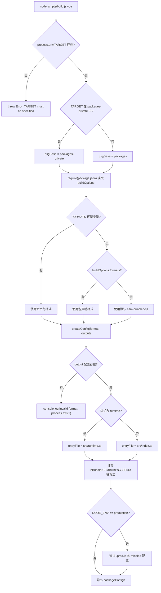

# Kapitel 1: Makroskopische Erkenntnis: Die Engineering-Designphilosophie des core-Repositories

Bevor wir mit der Verfolgung irgendeiner Zeile der Implementierung von Reaktivität oder virtuellem DOM beginnen, müssen wir zunächst die Engineering-Matrix verstehen, in der dieser Code lebt. Wenn man das Vue core-Repository öffnet, springen einem zuerst nicht die Framework-Kernlogik, sondern`package.json`und`pnpm-workspace.yaml`solche Engineering-Konfigurationsdateien ins Auge – sie enthalten keinerlei Laufzeitfunktionalität, bestimmen jedoch, ob das gesamte Framework korrekt gebaut, getestet und veröffentlicht werden kann. Dieses Kapitel beantwortet genau diese vorgelagerte Frage: Was ist das core-Repository eigentlich. Es ist nicht`@vue/runtime-core`jenes npm-Paket, sondern die Engineering-Matrix, die`runtime-core`、`reactivity`、`compiler-sfc`und über zehn weitere öffentlich veröffentlichte Pakete sowie`sfc-playground`、`template-explorer`und andere private experimentelle Pakete trägt. Das Verständnis der Organisationsweise dieser Matrix ist die Voraussetzung für alle nachfolgenden Kapitel (Build, Typen, Release, Größenbudget). Dieses Kapitel entfaltet sich entlang dreier Hauptlinien: die Doppelverzeichnisstruktur des Workspace, die einheitlichen Einschränkungen durch TypeScript und Rollup auf Root-Ebene sowie die Entkopplungsphilosophie von „Quellcode-Repository" und „Release-Artefakten".

# I. Doppelverzeichnisstruktur: Die physische Isolation von packages und packages-private

## Intuitives Modell

Stellen Sie sich das core-Repository als ein Forschungs- und Entwicklungsgebäude vor.`packages/`ist die offizielle Produktlinie, die produzierten Dinge werden mit Markenzeichen versehen und auf dem Markt verkauft;`packages-private/`ist das interne Testlabor, die darin befindlichen Muster dienen nur zum Debuggen und Demonstrieren und werden niemals ausgeliefert. Beide teilen sich dieselbe Infrastruktur (Abhängigkeiten, Build-Tools), aber das Zugangskontrollsystem (Release-Prozess) behandelt sie unterschiedlich.

Ohne diese physische Isolation könnte ein internes Debug-playground-Paket leicht versehentlich auf npm veröffentlicht werden – das ist keine Hypothese, sondern ein klassischer Unfall in monorepos.

## Datenstruktur und Speicherlayout

Die Grenze des Workspace wird durch`pnpm-workspace.yaml`definiert. Es enthält nur drei wirksame Deklarationen:

[FACT:pnpm-workspace.yaml:1-3]

```yaml
packages:
  - 'packages/*'
  - 'packages-private/*'
```

Diese beiden globs teilen pnpm mit:`packages/`und`packages-private/`jedes Unterverzeichnis unter`@vue/runtime-core`ist ein eigenständiges Paket. pnpm erstellt für sie symbolische Links, sodass`@vue/reactivity`bei Referenzierung von

direkt auf das lokale Quellcodeverzeichnis zeigt, anstatt vom registry herunterzuladen.`catalog:`Der unmittelbar folgende**-Abschnitt ist pnpms**Abhängigkeitsversions-Katalog

[FACT:pnpm-workspace.yaml:5-13]

```yaml
catalog:
  '@babel/parser': ^7.29.8
  '@babel/types': ^7.29.8
  'entities': '^7.0.1'
  'estree-walker': ^2.0.2
  'magic-string': ^0.30.21
  'source-map-js': ^1.2.1
  'vite': ^8.3.0
  '@vitejs/plugin-vue': ^6.0.9
```

Kopieren`package.json`Im Root-`"@babel/parser": "catalog:"` [FACT:package.json:65-65]。`catalog:`steht entsprechend`@babel/parser`ist ein Platzhalter, den pnpm bei der Installation durch die im catalog-Abschnitt deklarierte Version ersetzt. Der Nutzen davon ist:`pnpm-workspace.yaml`Die Version von

## wird nur an einer Stelle in`pnpm install`gepflegt, alle Pakete, die es referenzieren, werden automatisch ausgerichtet, wodurch Versionsdrift wie „Paket A verwendet 7.28, Paket B verwendet 7.29" eliminiert wird.

Szenario-getriebener Walkthrough: Was nach einem`pnpm install`passiert

**Angenommen, Sie führen im Repository-Root**aus. Versetzen Sie sich in dieses Szenario und verfolgen Sie schrittweise:`package.json`Erster Schritt: preinstall-Zugangskontrolle.`preinstall`pnpm löst vor der Installation das

[FACT:package.json:45-45]

```json
"preinstall": "npx only-allow pnpm"
```

> **[Design Inference & Architectural Trade-offs]**
> `only-allow pnpm`Kopieren`catalog:`〔Design-Inferenz und Architektur-Abwägung〕`createRequire`prüft, ob der aktuelle Paketmanager pnpm ist, andernfalls wird direkt ein Fehler ausgegeben und beendet. Die Existenz dieses Skripts bedeutet: Die Installation des core-Repositories mit npm oder yarn wird fehlschlagen. Warum muss pnpm zwingend festgelegt werden? Weil das core-Repository auf pnpms Workspace-Symlinks und den catalog-Mechanismus angewiesen ist, npm's workspaces die

**Syntax nicht unterstützt, und yarns PnP-Modus die Modulauflösungspfade ändert, was zu inkonsistentem**Verhalten in Build-Skripten führt.`pnpm-workspace.yaml`Zweiter Schritt: Workspace auflösen.`packages/*`pnpm liest`packages-private/*`, scannt`package.json`und

**, erstellt für jedes Verzeichnis mit**einen Paketeintrag.`package.json`Dritter Schritt: catalog-Ersetzung anwenden.`catalog:`Platzhalter werden durch die tatsächliche Version des catalog-Abschnitts ersetzt und anschließend einheitlich installiert.

**Vierter Schritt: postinstall-Hook.**Nach Abschluss der Installation wird ausgelöst:

[FACT:package.json:46-46]

```json
"postinstall": "simple-git-hooks"
```

`simple-git-hooks`Liest das Root-`package.json`in der`simple-git-hooks`-Feld, schreibt Git-Hooks nach`.git/hooks/`：

[FACT:package.json:48-51]

```json
"simple-git-hooks": {
  "pre-commit": "pnpm lint-staged && pnpm check",
  "commit-msg": "node scripts/verify-commit.js"
}
```

`pre-commit`Der Hook führt vor jedem Commit lint-staged und Typprüfung aus,`commit-msg`Der Hook validiert das Format der Commit-Nachricht (Vue verwendet conventional commits). Beachte`preinstall`und`postinstall`Symmetrie: Ersteres bewacht (erlaubt nur pnpm), Letzteres sichert ab (installiert Git-Hooks).

## Designüberlegungen und Stolperfallen

> **[Design Inference & Architectural Trade-offs]**
> **Warum zwei globs statt einer`packages*/`？**Die explizite Auflistung zweier Verzeichnisse macht die Semantik von „öffentlich" und „privat" bereits auf Konfigurationsebene sichtbar. Jeder neu hinzukommende Entwickler, der`pnpm-workspace.yaml`liest, weiß sofort, dass das Repository zwei Arten von Paketen enthält. Würde man`packages*/`schreiben, wäre diese Semantik verborgen.

**`allowBuilds`und Supply-Chain-Sicherheit.**Beachte diesen Konfigurationsabschnitt:

[FACT:pnpm-workspace.yaml:15-21]

```yaml
allowBuilds:
  '@parcel/watcher': true
  '@swc/core': true
  'esbuild': true
  'puppeteer': true
  'simple-git-hooks': true
  'unrs-resolver': true
```

pnpm verbietet standardmäßig die Ausführung von Installationsskripten (postinstall) durch Abhängigkeitspakete, da dies ein häufiger Einstiegspunkt für Supply-Chain-Angriffe ist.`allowBuilds`ist eine Whitelist: Nur die aufgeführten Pakete dürfen Build-Skripte ausführen.`@swc/core`、`esbuild`muss plattformspezifische native Binärdateien herunterladen,`puppeteer`muss Chromium herunterladen,`simple-git-hooks`muss Git-Hooks schreiben – all dies sind legitime Build-Zeit-Aktionen und werden daher explizit zugelassen.

**`minimumReleaseAge: 1440`Die tiefere Bedeutung.**Diese Konfigurationszeile verlangt, dass neu veröffentlichte Abhängigkeitsversionen „volle 24 Stunden" (1440 Minuten) alt sein müssen, bevor sie installiert werden dürfen:

[FACT:pnpm-workspace.yaml:33-33]

```yaml
minimumReleaseAge: 1440
```

> **[Design Inference & Architectural Trade-offs]**
> Dies ist ein Cooldown-Mechanismus zur Abwehr von npm-Supply-Chain-Vergiftungen. Wenn ein Angreifer ein Paket übernimmt und eine bösartige Version veröffentlicht, wird dies normalerweise innerhalb weniger Stunden entdeckt und zurückgezogen. Eine 24-stündige Abklingzeit ermöglicht es dem core-Repository, dieses Zeitfenster zu umgehen. Und`minimumReleaseAgeExclude`erlaubt Ausnahmen für bestimmte Sicherheitspatches:

[FACT:pnpm-workspace.yaml:36-38]

```yaml
minimumReleaseAgeExclude:
  # Renovate security update: vitest@4.1.11
  - vitest@4.1.11
```

Der Kommentar stellt klar, dass dies ein von Renovate ausgelöstes Sicherheitsupdate ist, das sofort wirksam werden muss, und daher von der Abklingzeit ausgenommen wird.

---

# Zwei, Root-Level tsconfig: Einheitliche Typgrenzen für alle Unterpakete

## Intuitives Modell

Wenn jedes Unterpaket seine eigene tsconfig pflegt, entstehen Risse wie „Paket A verwendet`strict: false`, Paket B verwendet`strict: true`". Die Root-Level tsconfig ist die**Verfassung**: Sie legt die Typregeln fest, die alle Unterpakete gemeinsam befolgen müssen; Unterpakete können nur darauf aufbauen, dürfen sie aber nicht verletzen.

## Datenstruktur und Speicherlayout

Root-`tsconfig.json`Die`compilerOptions`ist das Fundament des gesamten Repository-Typsystems. Einige Schlüsselfelder herausgegriffen:

[FACT:tsconfig.json:5-29]

```json
"target": "es2016",
"module": "esnext",
"moduleResolution": "bundler",
"strict": true,
"noUnusedLocals": true,
"isolatedModules": true,
"isolatedDeclarations": true,
"composite": true,
"paths": {
  "@vue/compat": ["./packages/vue-compat/src"],
  "@vue/*": ["./packages/*/src"],
  "vue": ["./packages/vue/src"]
}
```

Zeile für Zeile erklärt:

- `target: es2016`: Ausgabesyntax auf ES2016 heruntergestuft. Dies korrespondiert mit esbuild's`target`in der Rollup-Konfiguration (`isServerRenderer || isCJSBuild ? 'es2019' : 'es2016'` [FACT:rollup.config.js:337-337]）。
- `moduleResolution: bundler`: Verwendet bundler-artige Modulauflösung, erlaubt das Weglassen von Erweiterungen, unterstützt`exports`Feld.
- `strict: true`: Aktiviert alle strikten Prüfungen, einschließlich`strictNullChecks`、`noImplicitAny`usw.
- `noUnusedLocals: true`: Unbenutzte lokale Variablen führen direkt zu einem Fehler. Diese Regel hat in Verbindung mit Tree-shaking praktische Bedeutung – unbenutzte Variablen sind oft ein Signal für toten Code.
- `isolatedModules: true`: Erfordert, dass jede Datei unabhängig transpiliert werden kann. Dies ist die Voraussetzung für Tools wie esbuild/swc, die „dateiweise transpilieren, ohne dateiübergreifende Typanalyse".
- `isolatedDeclarations: true`: Erfordert, dass alle Exporte explizit typisiert werden. Diese Regel dient direkt der`.d.ts`Generierungspipeline – nur explizite Annotationen ermöglichen es`tsc`, Deklarationsdateien schnell zu generieren, ohne vollständige Typinferenz durchzuführen.
- `composite: true`: Aktiviert die für Projektverweise (project references) erforderlichen inkrementellen Build-Metadaten.

`paths`Das Feld ist das**Typ-Ebenen-Spiegelbild**：`@vue/*`des Workspace, abgebildet auf`./packages/*/src`, sodass TypeScript zur Kompilierzeit direkt den Quellcode auflöst, anstatt`node_modules`Symlinks. Dies ergänzt die Laufzeit-Symlinks von pnpm – Laufzeit verlässt sich auf pnpm, Kompilierzeit auf paths.

## Szenario-getriebener Walkthrough: Eine`pnpm check`Typprüfung

`check`Das Skript ist`tsc --incremental --noEmit` [FACT:package.json:15-15]. In dieses Szenario eintauchen:

**Erster Schritt: include-Bereich lesen.**tsconfig's`include`bestimmt, welche Dateien an der Prüfung teilnehmen:

[FACT:tsconfig.json:31-39]

```json
"include": [
  "packages/global.d.ts",
  "packages/*/src",
  "packages/*/__tests__",
  "packages/vue/jsx-runtime",
  "packages/runtime-dom/types/jsx.d.ts",
  "scripts/*",
  "rollup.*.js"
]
```

Beachte`scripts/*`und`rollup.*.js`sind ebenfalls im Prüfbereich. Das bedeutet, dass auch Build-Skripte selbst Typbeschränkungen unterliegen –`rollup.config.js`Das`// @ts-check` [FACT:rollup.config.js:1-1]am Anfang in Verbindung mit JSDoc-Typannotationen ermöglicht es, dass diese reine JS-Datei von`tsc`geprüft wird.

**Zweiter Schritt: exclude-Ausschluss anwenden.**

[FACT:tsconfig.json:40-40]

```json
"exclude": ["packages-private/sfc-playground/src/vue-dev-proxy*"]
```

> **[Design Inference & Architectural Trade-offs]**
> `sfc-playground`In`vue-dev-proxy`Dateien werden ausgeschlossen. Warum? Solche Dateien sind normalerweise zur Laufzeit dynamisch generierter Proxy-Code, dessen Typform instabil ist und dessen Einbeziehung in die Prüfung Rauschen erzeugt.

**Dritter Schritt: Inkrementelle Prüfung.** `--incremental`Lässt`tsc`das letzte Prüfergebnis in`.tsbuildinfo`zwischenspeichern und nur geänderte Dateien erneut prüfen.`--noEmit`bedeutet nur prüfen, nicht ausgeben – Typprüfung und Artefaktgenerierung sind zwei unabhängige Pipelines.

## Designüberlegungen und Stolperfallen

**`isolatedDeclarations`Kosten und Nutzen.**Nach Aktivierung dieser Regel muss jeder Export explizit einen Rückgabetyp annotieren, z. B.`export function foo(): number`statt`export function foo() { return 1 }`. Dies erhöht den Schreibaufwand, bringt aber eine deutliche Beschleunigung der`.d.ts`Generierung –`tsc`Deklarationsdateien können ohne dateiübergreifende Inferenz erzeugt werden. Dies korrespondiert mit`build-dts`Skript`tsc -p tsconfig.build.json --noCheck`Das`--noCheck`Flag: Da Typen bereits explizit annotiert sind, kann beim Generieren von Deklarationsdateien sogar die Prüfung übersprungen werden.

**`types`Globale Injektion des Feldes.**

[FACT:tsconfig.json:21-21]

```json
"types": ["vitest/globals", "puppeteer", "node"]
```

Diese drei Typ-Pakete werden global injiziert, was bedeutet, dass Testdateien`describe`、`it`、`expect`direkt verwenden können, ohne import, und e2e-Tests direkt`puppeteer`Typen verwenden können. Dies ist eine Abwägung zwischen Bequemlichkeit und Verschmutzung – je mehr globale Typen, desto größer das Risiko von Namenskonflikten, aber desto besser die Schreiberfahrung für Testcode.

---

# Drei. Rollup-Konfiguration: Von buildOptions zu einer einheitlichen Fabrik für Multi-Format-Artefakte

## Intuitives Modell

Die Rollup-Konfiguration ist das**Montagewerk**des core-Repositories. Es kümmert sich nicht darum, was ein bestimmtes Paket tut, sondern nur darum, „welche Formate dieses Paket produzieren soll, wo die Einstiegsdatei für jedes Format liegt und welche Abhängigkeiten externalisiert werden sollen". Das Feld`package.json`in der`buildOptions`jedes Unterpakets ist der Lieferschein, der auf dem Paket klebt, und das Montagewerk arbeitet nach diesem Schein.

## Datenstruktur und Speicherlayout

Am Einstiegspunkt der Konfigurationsdatei wird das Modell „Build pro Paket" etabliert:

[FACT:rollup.config.js:32-44]

```js
if (!process.env.TARGET) {
  throw new Error('TARGET package must be specified via --environment flag.')
}
...
const privatePackages = fs.readdirSync('packages-private')
const pkgBase = privatePackages.includes(process.env.TARGET)
  ? `packages-private`
  : `packages`
const packagesDir = path.resolve(__dirname, pkgBase)
const packageDir = path.resolve(packagesDir, process.env.TARGET)
...
const pkg = require(resolve(`package.json`))
const packageOptions = pkg.buildOptions || {}
const name = packageOptions.filename || path.basename(packageDir)
```

Wichtige Designentscheidungen:`TARGET`Die Umgebungsvariable gibt an, welches Paket gebaut werden soll. Die Konfiguration prüft über`fs.readdirSync('packages-private')`, ob das Paket zum öffentlichen oder privaten Verzeichnis gehört, und entscheidet dadurch über`pkgBase`. Dies ist eine**Laufzeit-Verzeichniserkennung**– es ist keine Liste „welche Pakete privat sind" zu pflegen, die Verzeichnisstruktur selbst ist die Wahrheit.

`buildOptions`ist ein benutzerdefiniertes Feld in der`package.json`des Unterpakets,`packageOptions.filename`bestimmt das Präfix des Artefaktdateinamens,`packageOptions.formats`bestimmt das Standard-Build-Format.

Die Zuordnung von Format zu Artefakt wird durch`outputConfigs`definiert:

[FACT:rollup.config.js:58-88]

```js
const outputConfigs = {
  'esm-bundler': { file: resolve(`dist/${name}.esm-bundler.js`), format: 'es' },
  'esm-browser': { file: resolve(`dist/${name}.esm-browser.js`), format: 'es' },
  cjs:           { file: resolve(`dist/${name}.cjs.js`),         format: 'cjs' },
  global:        { file: resolve(`dist/${name}.global.js`),      format: 'iife' },
  'esm-bundler-runtime': { file: resolve(`dist/${name}.runtime.esm-bundler.js`), format: 'es' },
  'esm-browser-runtime': { file: resolve(`dist/${name}.runtime.esm-browser.js`), format: 'es' },
  'global-runtime':      { file: resolve(`dist/${name}.runtime.global.js`),      format: 'iife' },
}
```

Sieben Formate, die drei Konsumszenarien abdecken:`esm-bundler`für Bundler wie Vite/webpack,`esm-browser`für natives Browser-ESM,`global`für das`<script>`-Tag. Die mit`-runtime`-Suffix sind „nur-Laufzeit"-Builds, die nur für das Haupt-`vue`-Paket verfügbar sind.

## Szenario-getriebener Walkthrough: Der vollständige Entscheidungsfluss eines`pnpm build vue`

Versetzen wir uns in die Ausführung von`node scripts/build.js vue`und verfolgen die Entscheidungen innerhalb von`TARGET=vue`:`createConfig`

**Erster Schritt: Formatliste bestimmen.**

[FACT:rollup.config.js:91-92]

```js
const defaultFormats = ['esm-bundler', 'cjs']
const inlineFormats = process.env.FORMATS && process.env.FORMATS.split(',')
const packageFormats = inlineFormats || packageOptions.formats || defaultFormats
const packageConfigs = process.env.PROD_ONLY
  ? []
  : packageFormats.map(format => createConfig(format, outputConfigs[format]))
```

Priorität: Kommandozeilen-`FORMATS`> Unterpaket-`buildOptions.formats`> Standard-`['esm-bundler', 'cjs']`。`PROD_ONLY`Wenn die Umgebungsvariable wahr ist, werden Nicht-Produktions-Builds übersprungen und nur die später angehängten`.prod.js`-Konfigurationen beibehalten.

**Zweiter Schritt: Build-Flags berechnen.** `createConfig`Intern wird aus dem Format-String eine Gruppe boolescher Flags abgeleitet:

[FACT:rollup.config.js:131-142]

```js
const isProductionBuild = process.env.__DEV__ === 'false' || /\.prod\.js$/.test(output.file)
const isBundlerESMBuild = /esm-bundler/.test(format)
const isBrowserESMBuild = /esm-browser/.test(format)
const isServerRenderer = name === 'server-renderer'
const isCJSBuild = format === 'cjs'
const isGlobalBuild = /global/.test(format)
const isCompatPackage = pkg.name === '@vue/compat'
const isCompatBuild = !!packageOptions.compat
const isBrowserBuild =
  (isGlobalBuild || isBrowserESMBuild || isBundlerESMBuild) &&
  !packageOptions.enableNonBrowserBranches
```

Diese Flags sind die**einzige Wahrheitsquelle**für alle nachfolgenden Entscheidungen: Einstiegsdateiauswahl, define-Ersetzung, external-Bestimmung, Plugin-Zusammenstellung – alles hängt von ihnen ab.

**Dritter Schritt: Einstiegsdatei auswählen.**

[FACT:rollup.config.js:159-168]

```js
let entryFile = /runtime$/.test(format) ? `src/runtime.ts` : `src/index.ts`

if (isCompatPackage && (isBrowserESMBuild || isBundlerESMBuild)) {
  entryFile = /runtime$/.test(format)
    ? `src/esm-runtime.ts`
    : `src/esm-index.ts`
}
```

Der Standard-Einstieg ist`src/index.ts`, Nur-Laufzeit-Builds verwenden`src/runtime.ts`. Das compat-Paket (`@vue/compat`, also der Vue-2-Kompatibilitäts-Build) muss sowohl default- als auch named-Exporte bereitstellen, was Rollup bei Nicht-ESM-Zielen zu Fehlern veranlasst, daher wird für den ESM-Build separat der`esm-index.ts` / `esm-runtime.ts`-Einstieg verwendet.

**Vierter Schritt: define-Ersetzungstabelle generieren.** `resolveDefine`Ersetzt Kompilierzeit-Konstanten wie`__DEV__`、`__BROWSER__`im Quellcode durch Literale:

[FACT:rollup.config.js:170-201]

```js
const replacements = {
  __COMMIT__: `"${process.env.COMMIT}"`,
  __VERSION__: `"${masterVersion}"`,
  __TEST__: `false`,
  __BROWSER__: String(isBrowserBuild),
  __GLOBAL__: String(isGlobalBuild),
  __ESM_BUNDLER__: String(isBundlerESMBuild),
  __ESM_BROWSER__: String(isBrowserESMBuild),
  __CJS__: String(isCJSBuild),
  __SSR__: String(!isGlobalBuild),
  __COMPAT__: String(isCompatBuild),
  __FEATURE_SUSPENSE__: `true`,
  __FEATURE_OPTIONS_API__: isBundlerESMBuild ? `__VUE_OPTIONS_API__` : `true`,
  __FEATURE_PROD_DEVTOOLS__: isBundlerESMBuild ? `__VUE_PROD_DEVTOOLS__` : `false`,
  __FEATURE_PROD_HYDRATION_MISMATCH_DETAILS__: isBundlerESMBuild ? `__VUE_PROD_HYDRATION_MISMATCH_DETAILS__` : `false`,
}
```

Hier gibt es eine raffinierte Schichtung:**Feature-Flags werden im esm-bundler-Build nicht hartkodiert, sondern als Bezeichner wie`__VUE_OPTIONS_API__`beibehalten**und dem Bundler des Endnutzers zur Ersetzung überlassen. So kann der Nutzer über`define: { __VUE_OPTIONS_API__: false }`die Options-API-Unterstützung deaktivieren und den zugehörigen Code tree-shaken. In global/esm-browser-Builds hingegen werden diese Flags auf`true`/`false`hartkodiert, da die direkt vom Browser konsumierten Artefakte keinen Bundler dazwischen haben.

**Fünfter Schritt: Umgebungsvariablen-Überschreibung erlauben.**

[FACT:rollup.config.js:208-216]

```js
// allow inline overrides like
//__RUNTIME_COMPILE__=true pnpm build runtime-core
Object.keys(replacements).forEach(key => {
  if (key in process.env) {
    const value = process.env[key]
    assert(typeof value === 'string')
    replacements[key] = value
  }
})
```

Jeder define-Schlüssel kann durch eine gleichnamige Umgebungsvariable überschrieben werden. Das im Kommentar gegebene Beispiel ist`__RUNTIME_COMPILE__=true pnpm build runtime-core`– zum Debuggen bestimmter Kompilierungszweige.

**Sechster Schritt: Plugin-Kette zusammenstellen.**

[FACT:rollup.config.js:324-342]

```js
plugins: [
  json({ namedExports: false }),
  alias({ entries }),
  enumPlugin,
  ...resolveReplace(),
  esbuild({
    tsconfig: path.resolve(__dirname, 'tsconfig.json'),
    sourceMap: output.sourcemap,
    minify: false,
    target: isServerRenderer || isCJSBuild ? 'es2019' : 'es2016',
    define: resolveDefine(),
  }),
  ...resolveNodePlugins(),
  ...plugins,
],
```

Die Plugin-Reihenfolge ist wohlüberlegt:`json`verarbeitet zuerst JSON-Importe,`alias`mappt`@vue/*`auf Quellcodepfade,`enumPlugin`macht Enum-Inlining,`replace`macht String-Ersetzung,`esbuild`macht TS-Transpilierung. Beachten Sie, dass`esbuild`von`tsconfig`auf das Root-tsconfig zeigt –**alle Unterpakete teilen dieselbe Typkonfiguration**, was die im zweiten Abschnitt diskutierte „Verfassung" zur Build-Zeit widerspiegelt.

**Siebter Schritt: Produktions-Build-Anhängsel.**Wenn`NODE_ENV=production`：

[FACT:rollup.config.js:97-114]

```js
if (process.env.NODE_ENV === 'production') {
  packageFormats.forEach(format => {
    if (packageOptions.prod === false) {
      return
    }
    if (format === 'cjs') {
      packageConfigs.push(createProductionConfig(format))
    }
    if (/^(global|esm-browser)(-runtime)?/.test(format)) {
      packageConfigs.push(createMinifiedConfig(format))
    }
  })
}
```

wird beim CJS-Format eine`.prod.js`-Version angehängt (ersetzt durch`__DEV__=false`), und beim global- und esm-browser-Format wird eine minifizierte Version angehängt (Minifizierung mit swc).`packageOptions.prod === false`Pakete mit

können sich diesem Mechanismus entziehen.



## Kopieren

**`external`Designüberlegungen und Stolperfallen** `resolveExternal`Die Drei-Zweig-Strategie von

[FACT:rollup.config.js:257-283]

```js
function resolveExternal() {
  const treeShakenDeps = ['source-map-js', '@babel/parser', 'estree-walker', 'entities/decode']

  if (isGlobalBuild || isBrowserESMBuild || isCompatPackage) {
    if (!packageOptions.enableNonBrowserBranches) {
      return treeShakenDeps
    }
  } else {
    return [
      ...Object.keys(pkg.dependencies || {}),
      ...Object.keys(pkg.peerDependencies || {}),
      ...['path', 'url', 'stream'],
      ...treeShakenDeps,
    ]
  }
}
```

Kopieren`treeShakenDeps`Browser-Builds (global/esm-browser) inlinen alle Abhängigkeiten und listen nur`dependencies`als external auf, um Warnungen zu unterdrücken – diese Abhängigkeiten werden im Browser-Zweig nicht tatsächlich referenziert und durch Tree-Shaking entfernt. Node/esm-bundler-Builds externalisieren alle`peerDependencies`und

**`onwarn`, sodass der Konsument die Abhängigkeitsversionen selbst verwaltet.**

[FACT:rollup.config.js:344-348]

```js
onwarn: (msg, warn) => {
  if (msg.code !== 'CIRCULAR_DEPENDENCY') {
    warn(msg)
  }
},
```

Kopieren`runtime-core`Warnungen über zirkuläre Abhängigkeiten werden stillschweigend unterdrückt. Zwischen`reactivity`und

**`treeshake.moduleSideEffects: false`von Vue existieren legitime zirkuläre Referenzen (das Reaktivitätssystem muss auf den Komponenteninstanztyp verweisen), diese Zyklen sind zur Laufzeit sicher und werden daher gefiltert.**

[FACT:rollup.config.js:355-355]

```js
treeshake: {
  moduleSideEffects: false,
},
```

Kopieren**Dies teilt Rollup mit: Alle Module haben keine Seiteneffekte, ungenutzte Importe können bedenkenlos entfernt werden. Dies ist eine**aggressive Annahme

**– wenn ein Modul auf oberster Ebene Seiteneffekt-Code ausführt (z. B. globale Variablen registriert), könnte es fälschlicherweise entfernt werden. Der Vue-Quellcode garantiert durch Konvention, dass alle Module rein sind, daher kann diese Optimierung aktiviert werden.`pure_getters`Die**

[FACT:rollup.config.js:373-388]

```js
async renderChunk(contents, _, { format }) {
  const { code } = await minifySwc(contents, {
    module: format === 'es',
    format: { comments: false },
    compress: { ecma: 2016, pure_getters: true },
    safari10: true,
    mangle: true,
  })
  return { code: banner + code, map: null }
}
```

`pure_getters: true`Kopieren`obj.foo`teilt dem Minifier mit, dass „Property-Zugriffe keine Seiteneffekte haben", ungenutzte Getter-Aufrufe sicher entfernt werden können. Dies ist gefährlich für Vues Reaktivitätscode –`track()`) statt durch implizite Getter-Seiteneffekte abgeschlossen wird und daher sicher ist.`map: null`bedeutet, dass nach der Komprimierung keine Sourcemap generiert wird – Produktionsartefakte benötigen keine Debug-Mappings.

---

# Designüberlegung: Warum Quellcode-Repository und Veröffentlichungsartefakte entkoppelt sein müssen

Zurück zum Kernanliegen dieses Kapitels. Das Engineering-Design des core-Repositories hat eine durchgängige Leitlinie:**Die Aufgabe des Quellcode-Repositories ist die „Produktion", die Aufgabe der Veröffentlichungsartefakte ist die „Konsumption", beide werden durch die Build-Pipeline entkoppelt**。

Konkret zeigt sich dies auf drei Ebenen:

**Erstens: Quellcode wird nicht direkt veröffentlicht.** `package.json`von`private: true` [FACT:package.json:2-2]zeigt an, dass das Root-Paket niemals veröffentlicht wird. Das`package.json`jedes Unterpakets`main`/`module`/`exports`Feld verweist auf`dist/`unter den Artefakten, nicht auf`src/`. Wenn Benutzer`vue`installieren, erhalten sie das gebaute`.js`und`.d.ts`, der Quellcode bleibt im Repository.

**Zweitens: Das Artefaktformat wird durch das Konsumszenario bestimmt.**Die sieben Formate sind nicht willkürlich aufgelistet, sondern entsprechen sieben realen Konsumpfaden: Vite-Benutzer erhalten`esm-bundler`, CDN-Benutzer erhalten`global`, Node-SSR-Benutzer erhalten`cjs`. Die Format-Auswahllogik ist zentral in`rollup.config.js`an einer Stelle konzentriert, Unterpakete müssen nur in`buildOptions.formats`deklarieren, welche benötigt werden.

**Drittens: Typen und Implementierung sind getrennt.** `build-dts`Skript`tsc -p tsconfig.build.json --noCheck && rollup -c rollup.dts.config.js` [FACT:package.json:9-9]zeigt an, dass`.d.ts`-Generierung eine unabhängige Pipeline ist.`isolatedDeclarations: true`ermöglicht es der Deklarationsdatei-Generierung, die Typprüfung zu überspringen (`--noCheck`), da die Typen bereits explizit annotiert sind.

> **[Design Inference & Architectural Trade-offs]**
> Die tiefere Motivation dieser Entkopplung ist:**Die Organisationsweise des Quellcodes dient dem Entwickler, die Organisationsweise der Artefakte dient dem Konsumenten, die optimalen Lösungen beider unterscheiden sich**. Quellcode benötigt klare Verzeichnisstruktur, vollständige Typinformationen, debugbare Sourcemaps; Artefakte benötigen minimale Größe, korrektes Modulformat, stabile API-Oberfläche. Eine erzwungene Vereinheitlichung beider (z. B. direktes Veröffentlichen von TS-Quellcode) würde die Erfahrung auf beiden Seiten gleichzeitig beeinträchtigen.

---

# Kapitelzusammenfassung

Dieses Kapitel hat aus drei Dimensionen ein makroskopisches Verständnis des core-Repositories aufgebaut:

1. **Doppelverzeichnisstruktur**：`packages/`und`packages-private/`die physische Trennung, kombiniert mit den Symlinks des pnpm-Workspace und dem catalog-Versionsverzeichnis, realisiert eine klare Grenze zwischen „öffentlichen Paketen" und „privaten Paketen".`preinstall`-Gate,`allowBuilds`Whitelist,`minimumReleaseAge`Abklingzeit bilden gemeinsam die Lieferketten-Sicherheitslinie.

2. **Root-Level tsconfig**: Als Typenverfassung aller Unterpakete, durch`paths`-Mapping wird die Workspace-Auflösung zur Kompilierzeit realisiert, durch`isolatedDeclarations`und`composite`werden inkrementelle Builds und schnelle Deklarationsdatei-Generierung unterstützt.

3. **Rollup-einheitliche Fabrik**: Mit`TARGET`Umgebungsvariable als Einstieg, durch`buildOptions`werden Unterpaket-Metainformationen gelesen, durch eine Gruppe von Boolean-Flags werden Einstiegsauswahl, define-Ersetzung, external-Bestimmung und Plugin-Zusammenstellung gesteuert, schließlich werden Artefakte in sieben Formaten produziert.

Die Kernphilosophie ist**die Entkopplung von Quellcode-Repository und Veröffentlichungsartefakten**: Das Repository ist für die Produktion verantwortlich, die Artefakte für die Konsumption, die Build-Pipeline ist die einzige Brücke zwischen beiden.

---

# Kapitelübergang

Dieses Kapitel hat beantwortet, „was das core-Repository ist". Aber die statische Struktur des Repositories ist nur die Bühne, das eigentliche Drama findet während der Ausführung einer Build-Anfrage statt:`scripts/build.js`Wie Kommandozeilenargumente geparst werden, wie die Rollup-API aufgerufen wird, wie Build-Fehler und Nebenläufigkeit behandelt werden. Das nächste Kapitel wird die End-to-End-Reise einer Build-Anfrage von der Eingabe bis zum Artefakt verfolgen und das in diesem Kapitel aufgebaute statische Verständnis in eine dynamische Ausführungsansicht verwandeln.

# Kapitel-Reflexion und Selbsttest

Q1: Wenn man in`pnpm-workspace.yaml`das`minimumReleaseAge: 1440`zu`0`ändern würde, welches Risiko würde im Szenario eines Dependency-Upgrades entstehen? Warum ist`minimumReleaseAgeExclude`notwendig?

**Referenzanalyse**：

`minimumReleaseAge: 1440` [FACT:pnpm-workspace.yaml:33-33]verlangt, dass neu veröffentlichte Dependency-Versionen mindestens 24 Stunden alt sein müssen, bevor sie installiert werden dürfen. Wenn man es zu`0`ändern würde, könnte jede gerade veröffentlichte Version sofort hereingezogen werden.

Risikoszenario: Ein Angreifer kapert eine transitive Dependency (z. B.`@babel/parser`eine bestimmte Patch-Version), veröffentlicht eine Version mit bösartigem postinstall-Skript. Innerhalb der 24-stündigen Abklingzeit entdeckt die Community normalerweise das Problem und zieht die Version zurück; wäre die Abklingzeit 0, könnte die CI des core-Repositories innerhalb des Angriffsfensters automatisch upgraden und das bösartige Skript ausführen.

`minimumReleaseAgeExclude` [FACT:pnpm-workspace.yaml:36-38]existiert, weil der Abklingzeit-Mechanismus mit der Dringlichkeit von Sicherheitspatches kollidiert. Das`vitest@4.1.11`im Kommentar ist ein von Renovate erkanntes Sicherheitsupdate – solche Updates müssen sofort wirksam werden, 24 Stunden zu warten würde das Expositionsfenster verlängern. Daher braucht es eine explizite Ausnahmeliste, damit Sicherheitsupdates die Abklingzeit umgehen. Dies verkörpert das Sicherheitsdesignprinzip „standardmäßig konservativ, Ausnahmen explizit".

Q2: `rollup.config.js`In`resolveDefine`ist die Behandlung von`__FEATURE_OPTIONS_API__`durch`isBundlerESMBuild ? '__VUE_OPTIONS_API__' : 'true'`. Wenn man fälschlicherweise ändern würde, dass für alle Formate`'true'`zurückgegeben wird, welche Auswirkung hätte das auf Endbenutzer?

**Referenzanalyse**：

[FACT:rollup.config.js:192-194]

```js
__FEATURE_OPTIONS_API__: isBundlerESMBuild
  ? `__VUE_OPTIONS_API__`
  : `true`,
```

Im esm-bundler-Build wird`__FEATURE_OPTIONS_API__`als Identifier`__VUE_OPTIONS_API__`beibehalten und dem Bundler des Endbenutzers zur Ersetzung überlassen. Benutzer können in ihrer eigenen Build-Konfiguration`define: { __VUE_OPTIONS_API__: false }`setzen, wodurch Tree-shaking den gesamten Options-API-bezogenen Code entfernt (die Verarbeitungslogik von`data`、`methods`、`computed`und anderen Optionen), was die Artefaktgröße erheblich reduziert.

Wenn man ändern würde, dass für alle Formate`'true'`zurückgegeben wird, wäre der Options-API-Code im esm-bundler-Artefakt hartkodiert beibehalten, die`define`-Konfiguration des Benutzers würde wirkungslos, Tree-shaking unmöglich. Für ein Projekt, das nur die Composition API verwendet, würde dies unnötig mehrere KB Artefaktgröße hinzufügen.

Die Schlüsseleinsicht dieses Designs ist:**Die endgültige Form des esm-bundler-Artefakts wird vom Bundler des Benutzers bestimmt, daher muss das Feature-Flag bis zur Build-Zeit des Benutzers aufgeschoben werden**. Die global/esm-browser-Artefakte hingegen laufen direkt im Browser, ohne dass ein Bundler eingreift, daher müssen sie hartkodiert sein.

Q3: `rollup.config.js`von`resolveExternal`gibt der Browser-Build nur`treeShakenDeps`als external zurück, während der Node-Build alle`dependencies`zurückgibt. Angenommen, jemand fügt eines Tages`runtime-core`eine neue Laufzeitabhängigkeit`foo-lib`hinzu, vergisst aber, die Logik von`resolveExternal`zu aktualisieren. Was passiert im Browser-Build?

**Referenzanalyse**：

[FACT:rollup.config.js:257-283]

Der Browser-Build (`isGlobalBuild || isBrowserESMBuild`) gibt bei`!packageOptions.enableNonBrowserBranches`nur`treeShakenDeps`（`source-map-js`、`@babel/parser`、`estree-walker`、`entities/decode`zurück). Das bedeutet,`foo-lib`ist nicht in der external-Liste,

Bis hierhin haben wir auf makroskopischer Ebene die gesamte Designphilosophie des core-Repositories als engineeringtechnische Mutterbasis deutlich gesehen: Die Workspace-Struktur mit zwei Verzeichnissen zieht die Grenze zwischen öffentlichen Paketen und privaten experimentellen Paketen, die TypeScript- und Rollup-Konfiguration auf Root-Ebene bietet einheitliche Vorgaben, und die Entkopplung von Quellcode-Repository und Veröffentlichungsartefakten ermöglicht Multi-Format-Ausgaben. Diese Erkenntnisse ebnen den Weg für die spätere Vertiefung in konkrete Engineering-Ketten. Im nächsten Kapitel richten wir unseren Blick von der statischen Struktur auf den dynamischen Ablauf und verfolgen, ausgehend von`node scripts/build.js vue`, die End-to-End-Reise einer vollständigen Build-Anfrage von der Kommandozeilen-Argumentanalyse über die Zielpaket-Lokalisierung und die Rollup-Konfigurationsgenerierung bis zur Ablage der Artefakte, und sehen, wie build.js über parseArgs die Flags formats/devOnly/release parst, wie es dynamisch die package.json des Zielpakets per require lädt und buildOptions liest und schließlich rollup.config.js dazu antreibt, Multi-Format-Artefakte wie esm-bundler, cjs, global usw. zu erzeugen.
