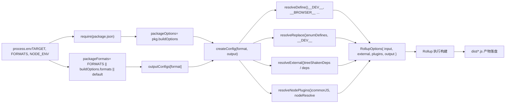

# Kapitel 2: Lebenszyklus des Hauptzweigs: Die End-to-End-Reise einer Build-Anfrage

Im vorherigen Kapitel haben wir die Positionierung des core-Repositories als engineeringtechnische Mutterbasis geklärt und wie der pnpm-Workspace und die Root-Konfiguration alle Unterpakete einheitlich einschränken. Jetzt tauchen wir in den Kern des Build-Systems ein und verfolgen, wie ein Befehl den gesamten Build-Prozess antreibt.`node scripts/build.js vue`erscheint einfach, ist aber der einzige Einstiegspunkt für alle Artefakte – esm-bundler, cjs, global. Zu verstehen, wie es Benutzerabsichten in ausführbare Build-Aufgaben übersetzt, ist ein entscheidender Schritt zum Verständnis des Vue-Build-Mechanismus.

# Rollup-Konfigurationsgenerierung: Von Umgebungsvariablen zu Multi-Format-Artefakten

`build.js`Nach dem Start von Rollup über`exec`geht die Kontrolle an`rollup.config.js`über. Diese Datei ist das „Gehirn“ des Build-Systems – sie liest Umgebungsvariablen und generiert dynamisch ein Array von Rollup-Konfigurationsobjekten.

## Validierung von Umgebungsvariablen und Paketlokalisierung

[FACT:rollup.config.js:27-29]

Wenn`TARGET`nicht gesetzt ist, wird direkt ein Fehler geworfen. Das ist defensives Programmieren: Die Rollup-Konfiguration könnte direkt aufgerufen werden (z. B.`rollup -c`), wobei keine`build.js`Umgebungsvariablen injiziert werden, und muss schnell fehlschlagen.

[FACT:rollup.config.js:32-44]

Hier wird die Logik zur Bestimmung privater Pakete aus`build.js`dupliziert – weil`rollup.config.js`ein unabhängiger Prozess ist und den Speicherzustand von`build.js`nicht teilen kann.`resolve`Die Funktion`pkg`löst relative Pfade in absolute Pfade im Paketverzeichnis auf,`package.json`ist der Inhalt der`packageOptions`des Zielpakets,`buildOptions`ist das darin enthaltene`name`-Feld,`buildOptions.filename`ist das Präfix des Artefaktdateinamens (vorzugsweise

## , andernfalls der Verzeichnisname).`outputConfigs`

[FACT:rollup.config.js:58-88]

Format-Zuordnungstabelle:

- `esm-bundler`、`esm-browser`、`esm-bundler-runtime`、`esm-browser-runtime`Diese Tabelle definiert die Zuordnung von 7 Formaten zu Ausgabekonfigurationen. Wichtige Beobachtungen:`format: 'es'`sind alle
- `cjs`, der Unterschied liegt nur im Dateinamen.`format: 'cjs'`。
- `global`ist`global-runtime`und`format: 'iife'`ist`<script>`(Immediately Invoked Function Expression), geeignet für die direkte Einbindung über
- `runtime`-Tags.`vue`Formate mit dem Suffix

## sind nur für das Haupt-

[FACT:rollup.config.js:91-92]

-Paket sinnvoll – sie enthalten keinen Compiler und sind kleiner.`FORMATS`Format-Auswahl: Drei Prioritätsebenen`buildOptions.formats`Die Format-Auswahl folgt drei Prioritätsebenen: Kommandozeilen-`['esm-bundler', 'cjs']`。`PROD_ONLY`Umgebungsvariable > Paket-

## > Standard-

[FACT:rollup.config.js:97-114]

Die Umgebungsvariable steuert, ob die Basiskonfiguration übersprungen wird – wenn nur die Produktionsversion gebaut wird, ist das Basiskonfigurations-Array leer und es werden anschließend nur Produktionskonfigurationen eingefügt.`NODE_ENV === 'production'`Anhänge-Logik der Produktionskonfiguration

- Wenn`packageOptions.prod === false`, dann für jedes Format:
- Wenn`cjs`, überspringen (das Paket benötigt keine Produktionsversion).`createProductionConfig`Wenn es`.prod.js`ist, wird
- angehängt – erzeugt die`/^(global|esm-browser)(-runtime)?/`-Datei.`createMinifiedConfig`Wenn

> **[Design Inference & Architectural Trade-offs]**
> angehängt – erzeugt die komprimierte Version.`cjs`〔Design-Inferenz und Architektur-Abwägung〕`createProductionConfig`Warum verwendet`global`/`esm-browser``createMinifiedConfig`, während

## `createConfig`

`createConfig`verwendet? Weil CJS für Node gedacht ist, die Node-Umgebung keine Komprimierung benötigt (der Benutzer kümmert sich selbst darum), aber zwischen dev/prod-Zweigen unterscheiden muss; während direkt im Browser eingebundene Artefakte komprimiert werden müssen, um die Größe zu reduzieren. Dieser Unterschied zeigt sich in der Implementierung der beiden Factory-Funktionen.

[FACT:rollup.config.js:125-142]

: Der Kern der Konfigurationsgenerierung

- `isProductionBuild`ist die größte Funktion; sie empfängt Format und Ausgabekonfiguration und gibt ein vollständiges Rollup-Konfigurationsobjekt zurück.`__DEV__`Am Anfang steht die Berechnung einer Reihe boolescher Flags:`.prod.js`: Bestimmt durch die
- `isBundlerESMBuild`、`isBrowserESMBuild`、`isCJSBuild`、`isGlobalBuild`Umgebungsvariable oder ob der Dateiname
- `isServerRenderer`enthält.`server-renderer`。
- `isCompatPackage`、`isCompatBuild`: Bestimmt durch regulären Ausdruck auf den Formatnamen.
- `isBrowserBuild`: Ob der Paketname

ist: im Zusammenhang mit Vue-2-kompatiblen Builds.`resolveDefine`、`resolveReplace`、`resolveExternal`: Global-Build oder Browser-ESM-Build, und der Nicht-Browser-Zweig ist nicht aktiviert.

[FACT:rollup.config.js:144-157]

Diese Flags werden später in`exports`wiederholt verwendet und sind die zentrale Grundlage für die Konfigurationsdifferenzierung.`auto`Grundeinstellungen der Ausgabekonfiguration: Banner-Copyright-Header,`named`-Modus (compat-Pakete verwenden`esModule`, die übrigen`externalLiveBindings: false`), CJS-Build aktiviert`reexportProtoFromExternal: false`-Interoperabilität, Sourcemap wird durch Umgebungsvariablen gesteuert,`output.name`und`window`sind Kompatibilitätseinstellungen von Rollup 4. Der Global-Build setzt zusätzlich

## , also den Variablennamen, der an

[FACT:rollup.config.js:159-168]

gehängt wird.`src/index.ts`Auswahl der Einstiegsdatei`runtime`Der Standard-Einstieg ist`src/runtime.ts`.compat-Paket-ESM-Build muss sowohl default als auch named exportieren, daher wird ein separater`esm-index.ts` / `esm-runtime.ts`Einstiegspunkt verwendet.

## Makrodefinition:`resolveDefine`

[FACT:rollup.config.js:170-218]

`resolveDefine`Gibt eine Ersetzungstabelle zurück, die im Quellcode`__COMMIT__`、`__VERSION__`、`__BROWSER__`Makros durch Literale ersetzt. Diese Makros werden im Quellcode für bedingte Kompilierung verwendet – zum Beispiel`if (__DEV__) { ... }`wird im Produktions-Build durch`if (false) { ... }`ersetzt und dann durch Tree-Shaking entfernt.

Schlüssendesign:`__FEATURE_OPTIONS_API__`、`__FEATURE_PROD_DEVTOOLS__`Feature-Flags wie diese bleiben im`esm-bundler`Build als`__VUE_OPTIONS_API__`solche Bezeichner erhalten, damit Endbenutzer sie über die Bundler-Konfiguration überschreiben können; in anderen Builds werden sie direkt hartcodiert als`true`oder`false`。

[FACT:rollup.config.js:203-206]

Nicht-`esm-bundler`Build hartcodiert`__DEV__`, da ihre dev/prod-Verzweigungen zur Build-Zeit bereits feststehen.

[FACT:rollup.config.js:210-216]

Der letzte Schritt erlaubt Umgebungsvariablen, jede Makrodefinition zu überschreiben, und unterstützt`__RUNTIME_COMPILE__=true pnpm build runtime-core`solche Inline-Überschreibungen.

## Ersetzungs-Plugin:`resolveReplace`

[FACT:rollup.config.js:222-255]

`resolveReplace`Verarbeitet außerhalb von`resolveDefine`Ersetzungen, die esbuild nicht verarbeiten kann:

- Führt`enumDefines`zusammen (aus`inlineEnums`die Inline-Enum-Definitionen).
- Im Produktions-Browser-Build wird der Fehlererstellungsfunktion eine`/*@__PURE__*/`Annotation hinzugefügt, um Tree-Shaking zu unterstützen.
- `esm-bundler`Im`__DEV__`Build wird`!!(process.env.NODE_ENV !== 'production')`durch
- ersetzt, damit der Bundler entscheidet.`process.env`Im Browser-ESM-Build wird

## durch ein leeres Objekt ersetzt, um Browserfehler zu vermeiden.`resolveExternal`

[FACT:rollup.config.js:257-283]

Externe Abhängigkeiten:`treeShakenDeps`Dies ist der Kern der Denkaufgabe am Ende des vorherigen Kapitels. Der Browser-Build gibt nur`dependencies`als external zurück – diese Abhängigkeiten werden zwar importiert, aber im Browser-Zweig nicht tatsächlich ausgeführt; sie werden hier nur aufgeführt, um Rollup-Warnungen zu unterdrücken. Node/ESM-Bundler-Builds externalisieren alle`peerDependencies`und`path`、`url`、`stream`sowie Node-Built-in-Module wie

## .

[FACT:rollup.config.js:319-352]

Finales Konfigurationsobjekt

- `input`Das zurückgegebene Konfigurationsobjekt enthält:
- `external`: Absoluter Pfad zur Einstiegsdatei.
- `plugins`: Liste externer Abhängigkeiten.
- `output`: Plugin-Array in der Reihenfolge json → alias → enumPlugin → replace → esbuild → nodePlugins.
- `onwarn`: Ausgabekonfiguration.`CIRCULAR_DEPENDENCY`: Filtert
- `treeshake.moduleSideEffects: false`Warnungen heraus (im Vue-Quellcode existieren zirkuläre Abhängigkeiten, die zur Laufzeit harmlos sind).

: Teilt Rollup mit, dass alle Module keine Seiteneffekte haben, aggressives Tree-Shaking.

# Kopieren

## `exec`Artefakt-Persistenz und Größenprüfung

`build.js`Prozessverwaltung von`exec`Startet den Rollup-Unterprozess über

[FACT:scripts/utils.js:64-114]

`exec`: Kapselt`spawn`, gibt ein Promise zurück. Schlüssendesign:

- `stdio`Standardmäßig ist`['ignore', 'pipe', 'pipe']`– stdin ignoriert, stdout/stderr als Pipe erfasst.
- `shell: process.platform === 'win32'`– unter Windows wird eine Shell benötigt, um Befehle korrekt aufzulösen.
- Sammelt Ausgaben über`stderrChunks`und`stdoutChunks`Arrays, die im`exit`-Event zusammengefügt werden.
- Bei Exit-Code 0 wird resolved, andernfalls rejected mit stderr-Inhalt.

> **[Design Inference & Architectural Trade-offs]**
> Beachten Sie, dass`build.js`beim Aufruf von`exec`das Argument`{ stdio: 'inherit' }`übergibt, was die Standard-Pipe-Konfiguration überschreibt und Rollups Ausgabe direkt an das Terminal weiterleitet. Dies ist das korrekte Verhalten für Build-Tools – Benutzer müssen den Build-Fortschritt in Echtzeit sehen.

## Größenprüfung:`checkAllSizes`

[FACT:scripts/build.js:206-215]

Die Größenprüfung hat zwei Überspringbedingungen:`devOnly`ist wahr, oder es wurde ein Format angegeben, das`global`nicht enthält. Denn die Größenprüfung gilt nur für globale Build-Artefakte – das sind Dateien, die Endbenutzer direkt einbinden, und die größenempfindlichsten.

[FACT:scripts/build.js:222-228]

`checkSize`Prüft zwei Dateien:`${target}.global.prod.js`und`${target}.runtime.global.prod.js`(letztere wird nur geprüft, wenn kein Format angegeben wurde oder`global-runtime`angegeben wurde).

[FACT:scripts/build.js:235-264]

`checkFileSize`Liest die Datei, berechnet die komprimierte Größe mit`gzipSync`und`brotliCompressSync`, formatiert die Ausgabe mit`prettyBytes`. Wenn`writeSize`wahr ist, werden die Ergebnisse in`temp/size/${fileName}.json`geschrieben – dies ist die Datenquelle für die Größenbudget-Prüfung in CI.

## Typdeklarations-Build

[FACT:scripts/build.js:94-108]

Wenn`buildTypes`wahr ist, wird`pnpm run build-dts`aufgerufen und die Zielliste über`--environment TARGETS:...`übergeben. Dies stellt sicher, dass Typdeklarationen nur für tatsächlich gebaute Pakete generiert werden.

# Design-Überlegungen und Produktions-Fallstricke

**Warum`--environment`statt direkter Parameterübergabe verwenden?**Rollups`--environment`ist die einzige Möglichkeit, in der Konfigurationsdatei über`process.env`Parameter zu lesen. Direkte Übergabe von`--config`-Parametern erfordert Parsen von`process.argv`, während`--environment`strukturierte Schlüssel-Wert-Paar-Analyse bietet.

**`fuzzyMatchTarget`Die Regex-Falle von** `target.match(partialTarget)`.`partialTarget`In`runtime-core`，`-`ist`runtime.core`，`.`Benutzereingabe. Wenn der Benutzer

**eingibt, ist es ein Literal in der Regex, kein Problem; aber wenn** `runParallel`eingegeben wird, matcht es beliebige Zeichen und könnte unerwartete Ziele treffen. Dies ist das inhärente Risiko von Fuzzy-Matching, aber Vues Paketnamen enthalten keine Regex-Sonderzeichen, sodass es praktisch nicht ausgelöst wird.`cpus().length`Ressourcenkonkurrenz bei parallelen Builds.`--max-old-space-size`verwendet

**`scanEnums`als Parallelitätsobergrenze, aber jeder Rollup-Prozess startet selbst Worker. In CI-Containern mit wenigen Kernen kann dies zu Speicherüberlauf führen. Wenn in der Produktion OOM auftritt, kann dies durch** `removeCache`oder Reduzierung der Parallelität gemildert werden.`finally`Der Cache-Lebenszyklus von`scanEnums`.`removeCache`wird in`finally`aufgerufen, aber wenn`scanEnums`selbst einen Fehler wirft, wird`try`nicht zugewiesen und der Aufruf in

**`resolveExternal`schlägt fehl. Tatsächlich ist die von**zurückgegebene Funktion bereits vor`runtime-core`bestimmt, sodass dieses Risiko nicht besteht – aber dies ist ein Timing-Detail, das beim Lesen bestätigt werden muss.`resolveExternal`Das Auslassungsrisiko von

# .

Die Denkaufgabe des vorherigen Kapitels hat bereits gezeigt: Wenn`node scripts/build.js vue`eine neue Abhängigkeit hinzugefügt wird, aber vergessen wird,

1. `parseArgs`zu aktualisieren, packt der Browser-Build diese Abhängigkeit ein (da sie nicht in der external-Liste steht), was zu Größenaufblähung führt. Dies sind die inhärenten Kosten der „Whitelist-external"-Strategie.`commit`Kapitelzusammenfassung

2. `run()`Eine vollständige Reise von`scanEnums`:`fuzzyMatchTarget`parst die Kommandozeile,`allTargets`）。

3. `buildAll`wird synchron abgerufen.`runParallel`Ruft`build`。

4. `build`auf, generiert den Enum-Cache, parst das Ziel (`package.json`oder`dist`über`--environment`parallel geplant`exec`Rollup starten.

5. `rollup.config.js`Umgebungsvariablen lesen, über`createConfig`Konfigurationsarray generieren,`resolveDefine`/`resolveReplace`/`resolveExternal`Makros, Ersetzungen und externe Abhängigkeiten separat verarbeiten.

6. Rollup führt den Build aus, die Artefakte werden auf die Festplatte geschrieben nach`dist/`。

7. `checkAllSizes`gzip/brotli-Größe berechnen, optional schreiben nach`temp/size/`。

8. Wenn`--withTypes`, aufrufen`build-dts`Typdeklarationen generieren.

# Gedanken und Selbsttest dieses Kapitels

Q1: In`build.js`der`build`Funktion,`if (!formats && fs.existsSync(...))`Diese Bedingung entscheidet, ob`dist`Verzeichnis gelöscht wird. Wenn`!formats`diese Bedingung entfernt wird (d. h. unabhängig davon, ob ein Format angegeben ist,`dist`wird immer gelöscht), was passiert in`pnpm build-all-cjs`einem solchen Skript?

**Referenzanalyse**：

[FACT:scripts/build.js:172-175]

`pnpm build-all-cjs`entspricht`node scripts/build.js vue runtime compiler reactivity shared -af cjs`(siehe[FACT:package.json:40]). Es gibt an`-f cjs`, daher ist`formats`für`'cjs'`，`!formats`falsch, die aktuelle Logik löscht`dist`。

nicht. Wenn`!formats`entfernt wird, wird bei jedem Build`dist`gelöscht. Aber`build-all-cjs`baut nur`cjs`Format, nach dem Löschen bleibt in`dist`nur noch`cjs`Artefakt übrig, die zuvor gebauten`esm-bundler`、`global`und andere Formate gehen alle verloren. Noch schwerwiegender ist, dass`build-runtime-esm`、`build-browser-esm`und andere Skripte nacheinander ausgeführt werden (siehe[FACT:package.json:39]der`build-sfc-playground`Skripte), jedes Skript löscht die Artefakte des vorherigen Skripts, sodass schließlich in`dist`nur noch das Format des letzten Skripts übrig bleibt. Dies zerstört den Build des SFC Playground – er benötigt Artefakte in mehreren Formaten gleichzeitig.

Q2: `runParallel`In`if (maxConcurrency <= source.length)`Welche Rolle spielt diese Bedingung? Wenn sie entfernt wird, was passiert beim Bauen eines einzelnen Pakets (`targets.length === 1`)?

**Referenzanalyse**：

[FACT:scripts/build.js:131-151]

Diese Bedingung steuert, ob die Nebenläufigkeitsbegrenzung aktiviert wird. Wenn`maxConcurrency > source.length`, ist keine Begrenzung nötig – alle Aufgaben können gleichzeitig gestartet werden. Wenn diese Bedingung entfernt wird, wird selbst bei nur einer Aufgabe`executing`Array erstellt und`await Promise.race(executing)`。

ausgeführt. Für eine einzelne Aufgabe`executing`gibt es nur ein Promise in`e`，`Promise.race`, das auf dessen Abschluss wartet. Dies führt nicht zu Fehlern, aber zu unnötigem Promise-Chaining und Microtask-Scheduling-Overhead. Wichtiger ist, dass`executing.splice(executing.indexOf(e), 1)`im Single-Task-Szenario immer noch korrekt funktioniert, also funktional kein Unterschied besteht, nur ein geringer Performanceverlust.

Das eigentliche Risiko besteht darin: Wenn`maxConcurrency`0 ist (theoretisch unmöglich, da`cpus().length`mindestens 1 ist),`executing.length >= 0`immer wahr ist,`Promise.race([])`ewig hängen würde. Aber`cpus().length`garantiert, dass diese Grenze nicht ausgelöst wird.

Q3: `resolveExternal`In`treeShakenDeps`gibt der Browser-Build

**als external zurück, aber diese Abhängigkeiten werden im Browser-Zweig nicht tatsächlich ausgeführt. Was passiert, wenn man sie aus der external-Liste entfernt (d. h. Rollup versuchen lässt, sie zu bündeln)?**：

[FACT:rollup.config.js:257-283]

`treeShakenDeps`Referenzanalyse`source-map-js`、`@babel/parser`、`estree-walker`、`entities/decode`enthält`compiler-sfc`. Dies sind Abhängigkeiten von`__BROWSER__`und anderen Paketen, die im Browser-Build durch

Makros bedingt kompiliert und ausgeschlossen werden.`treeshake.moduleSideEffects: false`（[FACT:rollup.config.js:355-355]Wenn sie aus external entfernt werden, versucht Rollup, diese Abhängigkeiten aufzulösen und zu bündeln. Da`if (!__BROWSER__)`), und die Import-Anweisungen dieser Abhängigkeiten im`__BROWSER__`Zweig liegen, ersetzt esbuilds define`true`durch

, wodurch der Zweig als toter Code markiert wird. Rollups Tree-Shaking entfernt diese Importe, sodass der endgültige Output den Code dieser Abhängigkeiten nicht enthält.`onwarn`Das Problem ist jedoch: Rollup muss Module auflösen, bevor Tree-Shaking stattfindet. Wenn diese Abhängigkeiten nicht installiert sind (z. B. in einer minimalen CI-Umgebung), meldet Rollup einen „Modul kann nicht aufgelöst werden"-Fehler. Sie als external aufzulisten ist eine defensive Maßnahme – selbst wenn die Abhängigkeit nicht existiert, versucht Rollup nicht, sie aufzulösen, sondern gibt nur eine Warnung aus (und

filtert Warnungen für nicht-zyklische Abhängigkeiten heraus).`scripts/dev.js`Damit haben wir die vollständige Build-Reise von der Befehlsanalyse bis zum Rollup-Aufruf durchlaufen und Kernmechanismen wie nebenläufige Planung und Filterung privater Pakete aufgedeckt. Der Produktions-Build ist jedoch nur die Hälfte der Geschichte. Im nächsten Kapitel wenden wir uns der Entwicklungszeit-Pipeline zu und sehen, wie
