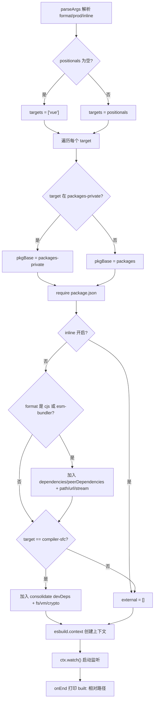
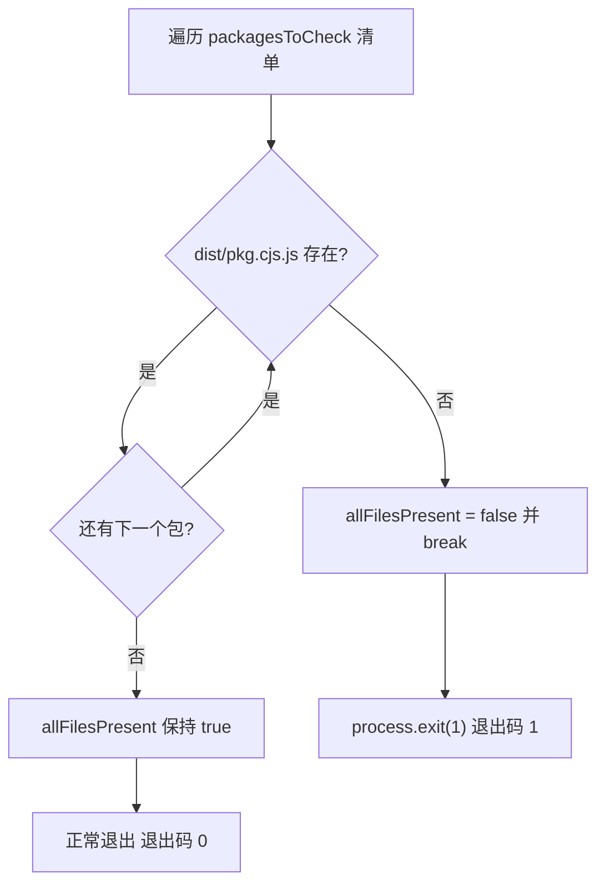
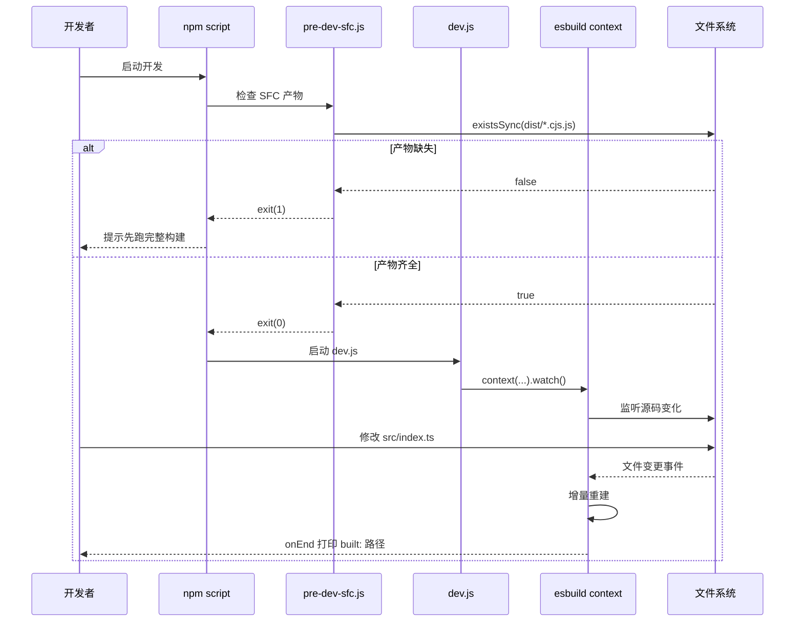

# Nächstes Kapitel: Kapitel 3 →

Verifikationsstatus: FACT-Zeilennummern echt verankert`scripts/dev.js`Im vorherigen Kapitel haben wir die vollständige Kette des Produktions-Builds von der Parameteranalyse bis zum Schreiben der Multi-Format-Artefakte auf die Festplatte verfolgt; diese Kette strebt Vollständigkeit und Normkonformität der Artefakte an. Das Kernanliegen der Entwicklungszeit ist jedoch nur eines: eine Zeile Code ändern, sofort im Browser das Ergebnis sehen. Die Kette des Produktions-Builds „Parameter parsen → Konfiguration generieren → vollständiges Bündeln → auf die Festplatte schreiben" dauert oft Dutzende Sekunden und kann dieses Anliegen überhaupt nicht erfüllen. Das Vue-core-Repository unterhält dafür eine unabhängige Entwicklungszeit-Pipeline:`scripts/pre-dev-sfc.js`verwendet den Watch-Modus von esbuild für inkrementelle Builds,

# kompiliert den SFC-Compiler vor dem Haupt-Build. Dieses Kapitel zerlegt den Kooperationsmechanismus der beiden.

## 3.1 dev.js: Inkrementeller Builder mit esbuild für Geschwindigkeit

Intuitives Modell[FACT:scripts/dev.js:3-5]

Der Produktions-Build ist wie „der offizielle Satz und Druck in einer Druckerei" – Qualität hat Priorität, etwas langsamer ist egal; der Entwicklungs-Build ist wie „eine Bleistiftskizze auf einem Notizzettel" – nicht auf Schönheit ausgerichtet, nur darauf, sofort sichtbar zu sein. Vue wählt esbuild statt Rollup, um diese Skizze zu zeichnen; der Grund steht im Kommentar am Anfang der Datei: Rollup-Artefakte sind kleiner, Tree-Shaking ist besser, aber esbuild ist viel schneller.

## Ohne dieses Skript müsste der Entwickler bei jeder Änderung einen vollständigen Produktions-Build ausführen, der Feedback-Zyklus würde von Millisekunden auf Minuten degradieren, und das Hot-Update-Erlebnis wäre völlig verloren.

Parameteranalyse und Format-Ableitung`parseArgs`Der Skripteinstieg verwendet Nodes eingebautes`format`, um drei Optionen zu parsen:`global`）、`prod`(Standard`false`）、`inline`(Standard`false`）。[FACT:scripts/dev.js:18-40]Positionsargumente werden gesammelt als`targets`, falls leer, dann standardmäßig`['vue']`。[FACT:scripts/dev.js:42-53]

> **[Design Inference & Architectural Trade-offs]**
> Hier gibt es ein leicht zu übersehendes Detail:`rawFormat`und`format`sind zwei Zuweisungen.`parseArgs`Das`default: 'global'`von`rawFormat`hat bereits sichergestellt, dass`const format = rawFormat || 'global'`einen Wert hat, aber das Skript schreibt dennoch[FACT:scripts/dev.js:42]als Fallback.`parseArgs`Dies ist eine defensive Schreibweise, um zu vermeiden, dass`format.startsWith`bei Verhaltensänderungen oder expliziter Übergabe eines leeren Strings nachgelagert

`format`einen Fehler wirft.`global`Die Zuordnung zum esbuild-Ausgabeformat erfolgt über drei Verzweigungen: beginnend mit`iife`wird zu`cjs`zugeordnet, gleich`cjs`wird zu`esm`。[FACT:scripts/dev.js:42-53]zugeordnet, alles andere einheitlich`-runtime`Der Dateinamensuffix des Produkts wird dann durch`global-runtime`Suffix separat behandelt:`runtime.global`wird zu[FACT:scripts/dev.js:42-53]

## , der Rest bleibt unverändert.

Zielpaketlokalisierung und Ausgabepfad`packages-private`Das Skript liest zuerst die[FACT:scripts/dev.js:56]Verzeichnisliste, um zu bestimmen, ob das Zielpaket zu einem öffentlichen oder privaten Paket gehört.`packages`Für jedes target wird entschieden, ob der Paketbasispath`packages-private`oder`require`ist, dann`package.json`dessen`version`, um`buildOptions`。[FACT:scripts/dev.js:58-63]

und`vue-compat`zu erhalten.`vue`Der Ausgabedateiname hat einen Sonderfall:`vue-compat.global.js`。[FACT:scripts/dev.js:64-69]Das Ziel wird umbenannt zu`packages/vue/dist/vue.global.js`，`prod`, um zu vermeiden, dass das Produkt`prod.`heißt. Der endgültige Pfad hat die Form

## Wenn wahr, wird

`external`Segment eingefügt.

external-Auflösung: Vermeidung, Abhängigkeiten ins Produkt zu packen`inline`Das`cjs`Array bestimmt, welche Module nicht gebündelt werden. Die Logik ist zweischichtig:`esm-bundler`Erste Schicht: Wenn`dependencies`、`peerDependencies`nicht aktiviert ist und das Format`path`、`url`、`stream`ist oder[FACT:scripts/dev.js:76-88]enthält, werden alle Schlüssel von`@vue/compiler-sfc`zu external hinzugefügt und`server-renderer`drei Node-Built-in-Module hartcodiert.

Der Kommentar erklärt explizit, dass diese drei für`compiler-sfc`und`@vue/consolidate`vorbereitet sind.`devDependencies`Zweite Schicht: Für das`fs`、`vm`、`crypto`Ziel werden zusätzlich[FACT:scripts/dev.js:90-112]von`react-dom/server`、`teacup/lib/express`、`arc-templates/dist/es5`、`then-pug`、`then-jade`aufgelöst, diese sowie

> **[Design Inference & Architectural Trade-offs]**
> Im Code sind auch`rollup.config.js`usw. Template-Engine-Pfade hartcodiert – dies sind von consolidate unterstützte Template-Engines, optionale Abhängigkeiten, die nicht zwangsweise installiert werden dürfen.`TODO this logic is largely duplicated from rollup.config.js`〔Designableitung und Architekturabwägungen〕

## Diese Logik ist hochgradig redundant mit

, was auch im Quellcode-Kommentar zugegeben wird (`log-rebuild`). Der Grund, warum keine gemeinsame Funktion extrahiert wurde, ist, dass es feine Unterschiede in der external-Strategie zwischen dev und prod gibt (dev externalisiert aggressiver, um Builds zu beschleunigen), und eine erzwungene Vereinheitlichung würde die Kopplung erhöhen.`onEnd`Plugins und define-Injektion[FACT:scripts/dev.js:115-124]Das Plugin-Array hat standardmäßig nur ein

> **[Design Inference & Architectural Trade-offs]**
> Hook den relativen Pfad des Build-Produkts ausgibt.`cjs`Dies ist das einzige Feedback-Signal für Entwickler, um wahrzunehmen, dass „Änderungen wirksam geworden sind".`buildOptions.enableNonBrowserBranches`〔Designableitung und Architekturabwägungen〕`polyfillNode()`。[FACT:scripts/dev.js:126-128]Das zweite Plugin ist bedingt: Wenn das Format nicht`compiler-sfc`ist und das

`define`des Pakets wahr ist, wird[FACT:scripts/dev.js:141-159]eingehängt.`__XXX__`Solche Pakete (wie

- `__COMMIT__`) durchlaufen im Browser-Build immer noch den Node-Zweig und benötigen Polyfills für Node-Built-in-Module, um in der Browser-Umgebung zu funktionieren.`"dev"`，`__VERSION__`Der
- `__DEV__`Block ist der informationsdichteste Teil dieses Kapitels.`prod`Er ersetzt alle`__TEST__`Makros im Quellcode durch Literale:`false`；
- `__BROWSER__`ist fest auf`format !== 'cjs' && !pkg.buildOptions?.enableNonBrowserBranches`。[FACT:scripts/dev.js:146-148]gesetzt,
- `__SSR__`nimmt die Paketversion;`format !== 'global'`wird durch das
- `__COMPAT__`Flag bestimmt,`vue-compat`ist konstant
- Die Ableitung von`__FEATURE_SUSPENSE__`、`__FEATURE_OPTIONS_API__`、`__FEATURE_PROD_DEVTOOLS__`、`__FEATURE_PROD_HYDRATION_MISMATCH_DETAILS__`ist am subtilsten:

Das heißt, nur „nicht cjs und Paket unterstützt keinen Nicht-Browser-Zweig" wird als Browser-Umgebung markiert;`vitest.config.ts`ist`define`, d.h. der global-Build aktiviert den SSR-Zweig nicht;[FACT:vitest.config.ts:6-21]wird dadurch bestimmt, ob das target`__TEST__`ist;`true`、`__DEV__`Drei Feature-Flags (`true`) sind im dev-Modus alle fest verdrahtet.

## Diese Makros entsprechen eins zu eins dem

Block in`esbuild.context(...).then(ctx => ctx.watch())`。[FACT:scripts/dev.js:130-161] `context`.`watch()`Die Testumgebung setzt`onEnd`auf

# auf

## . Der Unterschied zum dev-Build ist genau der Unterscheidungspunkt zwischen den beiden Laufzeitzuständen „Test vs. Entwicklung".

watch-Modus-Start`compiler-sfc`Der letzte Schritt ist, dass`compiler-core`einen Build-Kontext erstellt, aber nicht sofort ausführt,`compiler-core`erst dann wird die Dateiüberwachung tatsächlich gestartet. Danach pflegt esbuild intern den Abhängigkeitsgraphen; jede Änderung an einer abhängigen Datei löst einen inkrementellen Rebuild aus, und der Rebuild-Abschluss-Callback`compiler-sfc`gibt das Log aus.`.vue`Kopieren`pre-dev-sfc.js`3.2 pre-dev-sfc.js: Der Precompile-Wächter zur Auflösung zirkulärer Abhängigkeiten

## Intuitives Modell

Stellen Sie sich ein „Henne-Ei"-Dilemma vor:`compiler-sfc`、`compiler-core`、`compiler-dom`、`compiler-ssr`、`shared`。[FACT:scripts/pre-dev-sfc.js:4-10]Der Quellcode von`packages/${pkg}/dist/${pkg}.cjs.js`importiert[FACT:scripts/pre-dev-sfc.js:4-23]

, und`allFilesPresent`benötigt im Entwicklungszustand`false`, um`break`Dateien zu verarbeiten. Wenn beide auf esbuild watch in Echtzeit kompilieren angewiesen sind, blockiert derjenige, der zuerst kompiliert.[FACT:scripts/pre-dev-sfc.js:20-21]Die Rolle von`allFilesPresent`ist „zuerst das Ei ausbrüten, dann das Huhn aufziehen" – vor dem Start des Haupt-Builds sicherstellen, dass die CJS-Produkte dieser Pakete bereits existieren.`process.exit(1)`Checkliste und Kurzschlusslogik[FACT:scripts/pre-dev-sfc.js:25-27]

## Das Skript pflegt eine feste Liste:

Für jedes Paket wird geprüft, ob`exit(1)`existiert.`&&`Sobald eines fehlt, wird

# gesetzt und sofort

`scripts/dev.js`, ohne die restlichen Pakete zu prüfen.`scripts/aliases.js`Wenn schließlich[FACT:scripts/aliases.js:7-7]

## falsch ist,

`resolveEntryForPkg`wird mit einem Nicht-Null-Code beendet.`packages/${p}/src/index.ts`。[FACT:scripts/aliases.js:7-7]Semantik des Exit-Codes`vue`、`vue/compiler-sfc`、`vue/server-renderer`、`@vue/compat`。[FACT:scripts/aliases.js:16-21]

Dieses Skript führt selbst keine Kompilierung durch, es macht nur „Existenz-Assertions".`packages`Es ist ein Signal für den aufrufenden Layer (normalerweise die`vue`-Kette des npm-Skripts oder CI-Skripte): Die Produkte sind unvollständig, es muss zuerst ein vollständiger Build ausgeführt werden. Wenn alle existieren, wird normal beendet (Exit-Code 0), und der Haupt-Build fährt fort.`nonSrcPackages`（`sfc-playground`、`template-explorer`、`dts-test`Kopieren`@vue/${dir}`3.3 aliases.js und vitest.config.ts: Die andere Hälfte der Entwicklungskette[FACT:scripts/aliases.js:23-35]

> **[Design Inference & Architectural Trade-offs]**
> Bietet gemeinsame Pfadalias für vitest und rollup.`nonSrcPackages`Die Ausschlussliste hingegen, weil diese drei Pakete keine`src/index.ts`Einstiegspunkte haben, ein erzwungenes Mapping würde zu Parsing-Fehlern führen.

## vitest's define und Alias-Konsum

`vitest.config.ts`direkt import`entries`als`resolve.alias`。[FACT:vitest.config.ts:3][FACT:vitest.config.ts:22-24]dessen`define`Block steht im Kontrast zur Makro-Injektion von dev.js: Testumgebung`__DEV__: true`、`__TEST__: true`、`__BROWSER__: false`、`__CJS__: true`。[FACT:vitest.config.ts:6-21]

Die Tests sind in fünf Projekte aufgeteilt:`unit`、`unit-gc`、`unit-jsdom`、`e2e`、`e2e-browser`。[FACT:vitest.config.ts:51-118]wobei`unit-gc`verwendet`pool: 'forks'`und übergibt`--expose-gc`, um speziell SSR-Tests auszuführen, die manuell GC auslösen müssen.[FACT:vitest.config.ts:65-76] `e2e-browser`hingegen aktiviert die Chromium-Instanz von Playwright, um Transition-bezogene Tests auszuführen.[FACT:vitest.config.ts:99-117]

# Designüberlegungen

**Warum verwendet dev esbuild und prod Rollup?**Dies ist keine willkürliche Technologiewahl, sondern die Einschränkungen der beiden Szenarien unterscheiden sich. Im Entwicklungsmodus ist die Artefaktgröße unkritisch, die Feedback-Latenz jedoch äußerst kritisch; im Produktionsmodus ist es umgekehrt. esbuild ist in Go geschrieben und hochgradig parallelisiert, Kaltstart und inkrementelle Builds sind um eine Größenordnung schneller, aber seine Tree-Shaking- und Code-Splitting-Fähigkeiten sind schwächer als die von Rollup.[FACT:scripts/dev.js:3-5]Zwei Werkzeuge für zwei Szenarien einzusetzen, ist ein pragmatischer Kompromiss im Engineering.

> **[Design Inference & Architectural Trade-offs]**
> **Warum prüft pre-dev-sfc nur und kompiliert nicht?**Wenn es selbst die Kompilierung auslösen würde, würde es die zirkuläre Abhängigkeit wieder einführen – es muss`compiler-sfc`kompilieren, und der Kompilierungsprozess selbst könnte von den`compiler-sfc`Artefakten abhängen. Daher kann es nur eine „Assertion" durchführen und die Tatsache „fehlende Artefakte" an die obere Ebene melden, die dann entscheidet, ob ein vollständiger Build ausgeführt oder mit Fehler beendet wird. Dies ist ein „Wächter-Muster": Es löst das Problem nicht, sondern meldet es nur.

**Ist die Duplizierung der external-Liste technische Schuld?**Die external-Logik von dev.js und rollup.config.js ist dupliziert, was auch in den Quellcode-Kommentaren zugegeben wird.[FACT:scripts/dev.js:73]Aber die external-Mengen der beiden sind nicht vollständig identisch – dev externalisiert aggressiver für Geschwindigkeit. Eine gewaltsame Extraktion in eine gemeinsame Funktion würde einen parametrisierten Differenz-Schalter erfordern, was beide Logiken schwerer lesbar machen würde. Dies ist ein typischer Kompromiss von „Duplizierung ist besser als falsche Abstraktion".

# Kapitelzusammenfassung

Dieses Kapitel hat die drei Puzzleteile der Vue-Core-Entwicklungsmodus-Kette auseinandergenommen:

1. **`scripts/dev.js`**: Inkrementelle Builds mit esbuild's`context().watch()`implementieren, durch`parseArgs`Format und Flags auflösen, dynamisch`require`Zielpaket`package.json`Ausgabepfad lokalisieren, Makros wie`__DEV__`、`__BROWSER__`injizieren, um bedingte Kompilierung zu steuern, und mit dem`log-rebuild`Plugin nach jedem Rebuild Feedback ausgeben.

2. **`scripts/pre-dev-sfc.js`**: Vor dem Haupt-Build prüfen, ob die CJS-Artefakte der fünf Kernpakete existieren; bei Fehlen mit Exit-Code 1 kurzschließen, um Build-Deadlocks durch zirkuläre Abhängigkeiten zu vermeiden.

3. **`scripts/aliases.js` + `vitest.config.ts`**: Gemeinsame Pfad-Aliase für die Testkette bereitstellen, spezielle Einträge hartcodiert plus dynamisches Scannen allgemeiner Einträge, kombiniert mit Multi-Projekt-Konfiguration, die fünf Test-Szenarien abdeckt: Unit, GC, jsdom, e2e, Browser-e2e.

# Kapitel-Überlegungen und Selbsttest

Q1: Wenn man in`scripts/pre-dev-sfc.js`das`break`entfernt (d.h. erst nach Prüfung aller Pakete über den Exit entscheidet), in welchen Szenarien würde dies die Entwicklererfahrung verschlechtern? Warum hat der Quellcode-Autor „beim ersten fehlenden Paket kurzschließen" gewählt?

**Referenzanalyse**：

[FACT:scripts/pre-dev-sfc.js:4-23]

`break`befindet sich im`if (!fs.existsSync(...))`Zweig; sobald ein fehlendes Paket-Artefakt entdeckt wird, wird die Schleife sofort verlassen.

Wenn man`break`entfernt, würde das Skript weiter die restlichen Pakete prüfen, letztendlich wäre`allFilesPresent`immer noch`false`, der Exit-Code wäre immer noch 1,**funktional äquivalent**. Der Unterschied liegt jedoch in:

1. **Performance**: Die fünf`existsSync`Aufrufe selbst sind schnell, aber wenn die Liste auf Dutzende Pakete erweitert würde, könnte das Kurzschließen eine große Anzahl unnötiger stat-Systemaufrufe einsparen.

2. **Semantik**: Kurzschließen drückt aus: „Wenn auch nur eines fehlt, ist das Ganze unvollständig" – dies ist eine boolesche Assertion, man muss nicht wissen, wie viele genau fehlen. Weiteres Prüfen erzeugt keine zusätzlichen Informationen.

3. **Entwicklererfahrung**: Tatsächlich verschlechtert sich die „Fehlermeldung". Das aktuelle Skript gibt nicht aus, welches Paket fehlt; der Entwickler sieht nur Exit-Code 1. Wenn man`break`entfernen und Logging hinzufügen würde, könnte man dem Entwickler stattdessen mitteilen „compiler-core und shared fehlen" – aber das erfordert zusätzlichen Code. Der Autor wählte die einfachste Implementierung und überlässt die Diagnose „welches fehlt" der Fehlermeldung des übergeordneten Build-Skripts.

Daher ist`break`die Kernmotivation „Assertion-Semantik + Performance", nicht Erfahrungsoptimierung.

Q2: `scripts/dev.js`In`__BROWSER__`ist die Ableitung von`format !== 'cjs' && !pkg.buildOptions?.enableNonBrowserBranches`. Angenommen, das`buildOptions.enableNonBrowserBranches`eines Pakets ist`true`, und der Entwickler baut mit`-f global`, dann ist`__BROWSER__`gleich`false`. Welche Konsequenzen hat das? Was passiert, wenn man es fälschlicherweise zu`true`ändert?

**Referenzanalyse**：

[FACT:scripts/dev.js:146-148]

Wenn`format = 'global'`und`enableNonBrowserBranches = true`:

- `format !== 'cjs'`ist`true`
- `!pkg.buildOptions?.enableNonBrowserBranches`ist`false`
- Insgesamt`__BROWSER__ = false`

Das bedeutet, alle`if (__BROWSER__)`Zweige im Quellcode werden durch esbuild's define ersetzt durch`if (false)`, browserspezifischer Code wird durch Tree-Shaking entfernt, Nicht-Browser-Zweige (Node-spezifische Logik) bleiben erhalten.

**Konsequenz**: Das global-Build-Artefakt sollte eigentlich im Browser laufen, enthält aber Node-spezifische Zweige. Wenn diese Zweige Node-Built-in-Module wie`fs`、`path`referenzieren, meldet der Browser beim Laden „Modul nicht definiert". Genau deshalb werden Pakete, bei denen`enableNonBrowserBranches`wahr ist (wie`compiler-sfc`), normalerweise nicht für global-Builds verwendet, oder es wird das`polyfillNode()`Plugin als Fallback benötigt.[FACT:scripts/dev.js:126-128]

**Wenn man es fälschlicherweise zu`true`**：`__BROWSER__ = true`ändert, bleiben Browser-Zweige erhalten, Node-Zweige werden entfernt. Für Pakete wie`compiler-sfc`, die SFC-Kompilierung in der Node-Umgebung ausführen müssen, würde dies dazu führen, dass Kernfunktionen (Dateien lesen, Node-APIs aufrufen) durch Tree-Shaking entfernt werden, und das Artefakt würde zur Laufzeit in Node „Funktion nicht definiert" melden.

Q3: `scripts/aliases.js`In`packages`wird beim dynamischen Scannen des`nonSrcPackages`（`sfc-playground`、`template-explorer`、`dts-test`Verzeichnisses`packages`übersprungen). Wenn ein neues Paket zum`src/index.ts`, und nicht hinzugefügt wurde zu`nonSrcPackages`, was passiert? An welcher Stelle wird vitest zur Laufzeit einen Fehler melden?

**Referenzanalyse**：

[FACT:scripts/aliases.js:23-35]

Die dynamische Scan-Logik ist: Für jedes Verzeichnis, wenn`dir !== 'vue'`, nicht in`nonSrcPackages`, der Key nicht existiert und es ein Verzeichnis ist, dann füge hinzu`entries['@vue/${dir}'] = resolveEntryForPkg(dir)`。

`resolveEntryForPkg`gibt den Pfad von`packages/${p}/src/index.ts`zurück.[FACT:scripts/aliases.js:7-7]Beachte, dass es**nicht prüft, ob die Datei existiert**, sondern nur den Pfad zusammensetzt.

**Konsequenz**: Der Alias wird registriert, zeigt aber auf eine nicht existierende Datei. Wenn vitest einen Import auflöst und eine Testdatei dieses Paket importiert, versucht das resolve-Plugin von Vite, diesen Pfad zu laden, und meldet „Modul kann nicht aufgelöst werden" oder „Datei existiert nicht".

**Fehlerstelle**: Nicht während der Ausführung von`aliases.js`(es macht nur String-Verkettung), sondern nach dem Start von vitest, beim ersten Auflösen dieses Imports. Wenn kein Test dieses Paket importiert, tritt kein Fehler auf – der Alias liegt einfach im`entries`-Objekt.

**Umgehung**: Füge solche Pakete ohne`src/index.ts`zu`nonSrcPackages`hinzu, oder stelle sicher, dass neue Pakete einen Standard-Einstiegspunkt haben. Deshalb muss`nonSrcPackages`manuell gepflegt werden – es ist die Ausnahmeliste für „Konvention vor Konfiguration".

Die Grenzen der Zusammenarbeit der drei sind klar:`pre-dev-sfc`regelt „ob das Artefakt bereit ist",`dev.js`regelt „wie das Artefakt schnell aktualisiert wird",`aliases`regelt „wie Tests den Quellcode auflösen". Die Entwicklungskette löst das Geschwindigkeitsproblem, aber zur Build-Zeit gibt es noch eine andere, verstecktere Optimierung – Transformationen, die abgeschlossen sind, bevor der Code vom Browser ausgeführt wird. Das nächste Kapitel betritt die Compile-Zeit-Magie und zeigt, wie Enum-Inlining und Tree-shaking-Verifikationsmechanismen zur Build-Zeit TypeScript-Enums durch Literale ersetzen und sicherstellen, dass das Versprechen des bedarfsgerechten Imports nicht gebrochen wird.
