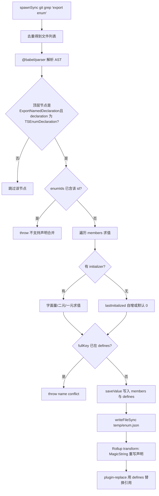
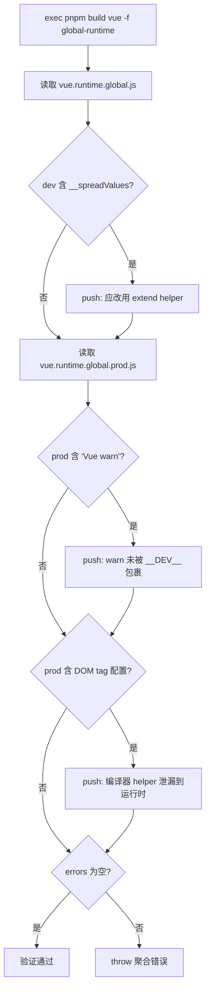

# Kapitel 4: Compile-Zeit-Magie: Enum-Inlining und Tree-shaking-Verifikationsmechanismen

Im vorherigen Kapitel haben wir gesehen, wie die Entwicklungskette durch Dateiüberwachung und inkrementelle Builds die Geschwindigkeit von „eine Zeile ändern, sofort wirksam" erreicht. Aber jenseits der Geschwindigkeit gibt es bei Vue eine verstecktere Einschränkung: Die Größe des veröffentlichten Artefakts muss kontrollierbar sein. Einer der Feinde dieser Einschränkung ist das TypeScript-Enum – es ist zur Laufzeit ein real existierendes Objekt und zerstört Tree-shaking. Dieses Kapitel betritt die Compile-Zeit und zeigt, wie scripts/inline-enums.js Enums in Literale „auflöst", bevor der Code vom Browser ausgeführt wird; und wie scripts/verify-treeshaking.js nach dem Build mithilfe von Artefakt-Strings rückwärts verifiziert, dass das Versprechen des bedarfsgerechten Imports nicht stillschweigend gebrochen wurde.

# 4.1 Enum-Inlining: Laufzeitobjekte in Literale auflösen

## Intuitives Modell

Stell dir vor, du schreibst ein Rezept, in dem wiederholt „eine Prise Salz" vorkommt. Wenn du bei jedem Kochen zum Anhang blättern müsstest, um „eine Prise = 3 Gramm" nachzuschlagen, wäre das langsam und platzraubend. Enum-Inlining ersetzt vor dem Drucken im gesamten Buch „eine Prise Salz" direkt durch „3 Gramm Salz" und reißt dann die Anhangsseite heraus. Für den Leser (die Laufzeit) ist das Ergebnis völlig identisch, aber das Buch ist dünner.

Welche Katastrophe droht dem System ohne es? Ein normales TypeScript-`enum`generiert nach der Kompilierung ein echtes Objektliteral mit bidirektionalem Mapping (`Enum[Enum.A] === 'A'`). Dieses Objekt ist eine**modulweite Deklaration mit Seiteneffekten**, Rollup kann nicht beweisen, dass es ungenutzt ist, und muss es daher behalten – selbst wenn du nur ein Mitglied importierst, werden das gesamte Enum-Objekt samt Rückwärts-Mapping ins Artefakt eingefügt.[FACT:scripts/inline-enums.js:3-9]Der Kommentar in`const enum`sagt es deutlich: Sie verwendeten einst

## , wechselten aber wegen Issue #1228 zu normalen Enums und nutzen dieses Skript, um „den Nullkosten-Vorteil von const enum manuell zurückzugewinnen".

Datenstruktur und Speicherlayout[FACT:scripts/inline-enums.js:33-36]

- `EnumMember`：`{ name, value }`Der Kern des Skripts sind drei Typdefinitionen; wer sie versteht, versteht den gesamten Datenfluss.
- `EnumDeclaration`：`{ id, range: [start, end], members }`。`range`, der Name eines einzelnen Enum-Mitglieds und das ausgewertete Literal.**ist der**Quellcode-Byte-Offset`export enum X { ... }`, der auf die Start- und Endposition der gesamten Deklaration von
- `EnumData`：`{ declarations, defines }`。`declarations`in der Datei zeigt – dies ist der Anker für die spätere präzise Ersetzung durch MagicString.`defines`wird nach Dateipfad indexiert und zeichnet die Ersetzungsbereiche aller Enum-Deklarationen in dieser Datei auf;` `ist ein flaches Mapping, dessen Schlüssel `` `` 形式的字符串，值是 `${Enum-Name}.${Mitgliedsname}

JSON.stringify` ist das Literal danach.`defines`Hier gibt es ein entscheidendes Design:**Der Schlüssel von**。[FACT:scripts/inline-enums.js:98-103]enthält keinen Dateipfad`ErrorCodes`Der Kommentar erklärt den Grund –`@vue/compiler-core`kann gleichzeitig in`@vue/runtime-core`und`ErrorCodes.__EXTEND_POINT__`existieren, daher sind gleichnamige Enums über Dateien hinweg erlaubt; aber derselbe`fullKey in defines`darf nicht in zwei gleichnamigen Enums wiederholt werden, sonst greift`name conflict`und wirft direkt

. Dies ist eine Einschränkung „global eindeutig pro Mitgliedsname", nicht „global eindeutig pro Enum-Name".`temp/enum.json`。[FACT:scripts/inline-enums.js:33-36]Der Cache liegt in`scanEnums()`Warum muss er auf die Festplatte geschrieben werden? Weil**am Build-Eingang nur einmal aufgerufen wird, während Rollup für jedes Paket und jedes Format**。[FACT:scripts/inline-enums.js:39-41]unabhängige Prozesse`inlineEnums()`startet. Der Kommentar weist darauf hin: Die Daten müssen über gleichzeitige Rollup-Prozesse hinweg geteilt werden, daher müssen sie auf die Festplatte serialisiert und von den

## der einzelnen Prozesse zurückgelesen werden.

**Schritt für Schritt: Von grep zur Literal-Ersetzung`export enum`Erster Schritt: Alle Dateien mit**[FACT:scripts/inline-enums.js:51-61]per grep finden.`spawnSync('git', ['grep', 'export enum'])`verwendet`path:line:content`, die Ausgabe hat die Form`:`, dann wird nach`Set`das erste Segment (Dateipfad) abgetrennt und mit`git grep`anstatt das Dateisystem zu durchlaufen – es scannt natürlicherweise nur die von Git verfolgten Dateien und schließt automatisch`node_modules`und Build-Artefakte aus.

**Zweiter Schritt: Babel parst und sammelt Enum-Informationen.**[FACT:scripts/inline-enums.js:64-70]Für jede Datei wird`@babel/parser`mit`typescript`Plugin,`sourceType: 'module'`zu einem AST geparst und dann nur die`ast.program.body`Top-Level-Knoten durchlaufen.[FACT:scripts/inline-enums.js:74-79]Es werden nur`ExportNamedDeclaration`und deren`declaration.type === 'TSEnumDeclaration'`Knoten erkannt – das heißt,**nicht-exportierte enums werden nicht verarbeitet.**。

Für jede Enum-Deklaration wertet das Skript jedes Mitglied einzeln aus. Die Mitgliedsauswertung hat drei Pfade:

1. **Literal-Initialisierung**：`StringLiteral`oder`NumericLiteral`direkt`init.value`。[FACT:scripts/inline-enums.js:114-119]

2. **Binärer Ausdruck**: wie`1 << 2`. Rekursiv`resolveValue`werden linke und rechte Operanden verarbeitet; Operanden können Literale sein oder`MemberExpression`(d. h. Verweise auf zuvor definierte Enum-Mitglieder).[FACT:scripts/inline-enums.js:121-151]Der Schlüssel liegt im`MemberExpression`Zweig: Er verwendet`content.slice(node.start, node.end)`aus**dem ursprünglichen Quelltext**, um den Ausdrucksstring herauszuschneiden (wie`ErrorCodes.FOO`), und schlägt dann`defines`nach. Wenn nichts gefunden wird, wird`unhandled enum initialization expression`。[FACT:scripts/inline-enums.js:132-141]geworfen. Das erklärt, warum`defines`eine globale flache Zuordnung sein muss – bei enum-übergreifenden Verweisen kann das referenzierte Element aus einer anderen Datei stammen, aber der Schlüssel erkennt nur`枚举名.成员名`。

3. **Unärer Ausdruck**: wie`-1`, zusammengesetzt zum`-1`String und dann mit`evaluate`ausgewertet.[FACT:scripts/inline-enums.js:152-163]

Die Auswertung selbst verwendet`new Function('return ' + exp)()`。[FACT:scripts/inline-enums.js:39-41]Dies ist ein**kontrolliertes eval**: Die Eingabe stammt aus bereits geparsten AST-Fragmenten im Quelltext, nicht aus beliebiger Benutzereingabe, daher ist die Sicherheitsgrenze kontrollierbar.

**Dritter Schritt: Verarbeitung von Mitgliedern ohne Initialisierer (Auto-Inkrement-Semantik).**[FACT:scripts/inline-enums.js:171-183]Wenn ein Mitglied kein`initializer`hat: Das erste Mitglied ist standardmäßig`0`; wenn bei nachfolgenden Mitgliedern`lastInitialized`eine Zahl ist, dann`++`; wenn es ein String ist, wird`wrong enum initialization sequence`geworfen – denn String-Enum-Mitglieder erlauben kein implizites Auto-Inkrement. Genau das ist die Semantik von TypeScript enums.

**Vierter Schritt: Cache schreiben und eine Cleanup-Funktion zurückgeben.**[FACT:scripts/inline-enums.js:200-213] `scanEnums()`Es wird eine Closure zurückgegeben; beim Aufruf wird`rmSync`die Cache-Datei gelöscht.`build.js`Sie wird in`try/finally`verwendet.[FACT:scripts/build.js:81-112]Dies stellt sicher, dass der Cache auch dann bereinigt wird, wenn während des Builds ein Fehler geworfen wird, und den nächsten Build nicht verunreinigt.

**Fünfter Schritt: Ersetzung in der Rollup-transform-Phase.** `inlineEnums()`Der Cache wird zurückgelesen und ein Rollup-Plugin konstruiert.[FACT:scripts/inline-enums.js:219-234]In`transform(code, id)`, wenn`id`auf`enumData.declarations`trifft, wird MagicString verwendet, um`[start, end]`diese Deklaration durch ein Objektliteral zu ersetzen.[FACT:scripts/inline-enums.js:242-274]

Die ersetzte Form ist`export const X = { ... }`. Beachten Sie, dass es**nicht einfach das enum löscht**, sondern es in ein Objektliteral umschreibt und für numerische Mitglieder zusätzlich Reverse-Mappings erzeugt:`JSON.stringify(value.toString()) + ': ' + JSON.stringify(name)`。[FACT:scripts/inline-enums.js:257-270]Der Kommentar verweist auf die reverse-mappings-Regel der offiziellen TypeScript-Dokumentation: String-Enum-Mitglieder erzeugen keine Reverse-Mappings, numerische Mitglieder schon. Dies stellt sicher, dass das Laufzeitverhalten nach der Ersetzung vollständig mit dem ursprünglichen enum übereinstimmt.

Und was den Laufzeit-Overhead wirklich beseitigt, ist`defines`wird an`@rollup/plugin-replace`。[FACT:rollup.config.js:222-223]übergeben. Alle`X.Member`Referenzen**auf**werden im Ersetzungs-Plugin direkt durch Literale ersetzt, sodass das umgeschriebene Objektliteral, wenn es niemand verwendet, durch Tree-shaking entfernt werden kann.

Das folgende Flussdiagramm zeigt den vollständigen Entscheidungspfad von grep bis zur Ersetzung:

## Designüberlegungen und Stolperfallen

**Warum MagicString statt die gesamte Datei neu zu generieren?**Weil`s.update(start, end, ...)`nur den Abschnitt der Enum-Deklaration ersetzt und die übrigen Quelltextbytes vollständig unverändert bleiben,`s.generateMap()`und außerdem präzise Sourcemaps erzeugen kann.[FACT:scripts/inline-enums.js:277-281]Wenn Babel den gesamten AST neu ausgeben würde, gingen ursprüngliche Formatierung und Kommentare verloren, und die Sourcemap-Qualität würde sinken.

**`range`Warum`node.start/node.end`statt`declaration.start`？**[FACT:scripts/inline-enums.js:189-193]behauptet wird`node.start`(d. h.`ExportNamedDeclaration`Knoten), deckt der Ersetzungsbereich`export enum X {...}`den gesamten Abschnitt ab, einschließlich`export`Schlüsselwort. Der Ersetzungstext beginnt mit`export const`und schließt direkt an.

**Stolperfallen:`defines`Die globale Eindeutigkeitsbeschränkung von**Wenn es in zwei verschiedenen Dateien jeweils ein`ErrorCodes`gibt und beide`__EXTEND_POINT__`definieren, schlägt der Build direkt fehl.[FACT:scripts/inline-enums.js:101-103]Das ist kein Bug, sondern bewusstes Design – weil`defines`eine globale Ersetzungstabelle ist und nicht zwischen Dateiquellen unterscheiden kann. Wenn in der Produktionsumgebung neue Enum-Mitglieder hinzugefügt werden und der Name mit einem vorhandenen Enum-Mitglied kollidiert, fliegt es hier auf.

**Stolperfalle:`new Function`Der Auswertungszeitpunkt von**Die Auswertung binärer Ausdrücke erfolgt in der`scanEnums`Phase; zu diesem Zeitpunkt ist das referenzierte Mitglied möglicherweise noch nicht in`defines`(wenn die Referenzreihenfolge vertauscht ist).[FACT:scripts/inline-enums.js:136-140]wird`unhandled enum initialization expression`geworfen. Dies erfordert, dass Verweise auf Enum-Mitglieder der Quelltextreihenfolge „erst definieren, dann referenzieren“ folgen müssen.

# 4.2 Tree-shaking-Verifikation: Das Versprechen anhand von Artefakt-Strings rückwirkend beweisen

## Intuitives Modell

Enum-Inlining ist eine „Vorab-Optimierung“, aber greift die Optimierung wirklich? Wenn ein Helper aufgrund unsachgemäßer Schreibweise versehentlich beibehalten wird, wächst die Größe still und heimlich, ohne dass der Entwickler es bemerkt.`verify-treeshaking.js`ist genau dieser „nachträgliche Qualitätsprüfer“: Es baut das Artefakt und prüft dann wie bei einer Autopsie, ob im Artefakt**Dinge auftauchen, die nicht auftauchen sollten**. Ohne es könnte das On-Demand-Import-Versprechen von Vue nach einem Refactoring stillschweigend brechen, bis Benutzer sich über größere Pakete beschweren.

## Datenstruktur und Prüfelemente

Dieses Skript hat keine komplexe Datenstruktur; der Kern ist ein`errors`Array und drei`includes`Prüfungen.[FACT:scripts/verify-treeshaking.js:6-6]Es baut zuerst`global-runtime`Format und liest dann jeweils die dev- und prod-Artefakte.

Die drei Prüfelemente entsprechen drei Arten von „Tree-shaking-Fehlern“:

1. **dev-Artefakt enthält`__spreadValues`**。[FACT:scripts/verify-treeshaking.js:13-19]Dies ist der von esbuild für`{ ...obj }`Objekt-Spread-Syntax generierte Helper. Wenn er auftaucht, bedeutet das, dass im Laufzeitcode Objekt-Spread verwendet wurde, während Vue vereinbarungsgemäß`extend`Helper verwenden sollte, um zusätzlichen Code zu vermeiden.

2. **prod-Artefakt enthält`Vue warn`**。[FACT:scripts/verify-treeshaking.js:26-31]bedeutet, dass es`warn()`Aufrufe gibt, die nicht durch`__DEV__`Bedingungen umschlossen sind, sodass Warncode in das Produktionspaket gelangt.

3. **prod-Artefakt enthält DOM-Tag-Konfigurationslisten**。[FACT:scripts/verify-treeshaking.js:33-42]wie`html,body,base`、`svg,animate,animateMotion`、`annotation,annotation-xml,maction`. Diese sind`isHTMLTag()`Daten innerhalb von Helfern wie `helper`, die eigentlich nur im Compiler existieren sollten und von der Runtime wegoptimiert werden. Wenn sie im Runtime-Artefakt auftauchen, bedeutet das, dass der Runtime-Pfad fälschlicherweise compiler-exklusive Helper verwendet.

## Step-by-Step: Validierungsablauf

[FACT:scripts/verify-treeshaking.js:5-5]Zuerst`exec('pnpm', ['build', 'vue', '-f', 'global-runtime'])`, nur bauen`vue`des Pakets`global-runtime`Format – dies ist das minimalste Runtime-Artefakt und am besten geeignet, um Leaks aufzudecken. Nach dem Build werden beide Dateien synchron gelesen, einzeln`includes`geprüft, bei Treffer wird in`errors`eine Nachricht mit Erklärung gepusht. Wenn schließlich`errors.length`ungleich null ist, wird ein aggregierter Fehler geworfen.[FACT:scripts/verify-treeshaking.js:44-48]

## Designüberlegungen und Stolperfallen

> **[Design Inference & Architectural Trade-offs]**
> **Warum String-`includes`statt AST-Analyse?**Weil dies eine „Sentinel-Prüfung" und keine „präzise Analyse" ist. Sie strebt keine Vollständigkeit an, sondern setzt kostengünstige Alarme für drei Regressionsarten, die historisch tatsächlich aufgetreten sind. String-Matching hat null Abhängigkeiten, null Parsing-Overhead und ist auch bei minifizierten Artefakten wirksam – AST-Analyse ist nach dem Minify sogar schwieriger durchzuführen.

> **[Design Inference & Architectural Trade-offs]**
> **Warum nur validieren`global-runtime`？**Dieses Format inlined alle Abhängigkeiten (`external`ist leer), ist das volumenempfindlichste und am leichtesten versehentlich eingeführte Artefakt. Wenn es sauber ist, sind andere Formate normalerweise auch sauber. Gleichzeitig ist sein Build schnell und eignet sich für häufige CI-Läufe.

> **[Design Inference & Architectural Trade-offs]**
> **Stolperfalle: Die Prüfelemente sind eine „Blacklist", die mit der Code-Evolution ungültig werden kann.**Wenn eines Tages`isHTMLTag`die Datenstruktur geändert wird,`html,body,base`dieser String nicht mehr auftaucht, ist die Prüfung wirkungslos. Dies erfordert, dass Maintainer beim Ändern relevanter Helper die Sentinel-Strings hier synchron aktualisieren. Dies ist der inhärente Preis der Blacklist-Validierung.

# 4.3 Zusammenarbeit mit Rollup: Plugin-Reihenfolge und define-Injektion

Enum-Inlining läuft nicht isoliert, sondern ist in die Rollup-Plugin-Pipeline eingebettet. Um zu verstehen, warum`defines`an`replace`übergeben werden muss und nicht`esbuild`。

[FACT:rollup.config.js:47-50]im Konfigurationsmodul auf oberster Ebene aufgerufen wird`inlineEnums()`, muss man den Kontext verstehen: Es wird`[enumPlugin, enumDefines]`bei jedem Rollup-Prozessstart**ausgeführt und liest den von**geschriebenen Cache.`scanEnums`Die Reihenfolge des Plugin-Arrays ist:

steht vor`json` → `alias` → `enumPlugin` → `...resolveReplace()` → `esbuild`。[FACT:rollup.config.js:324-339] `enumPlugin`, was bedeutet, dass das Umschreiben der Enum-Deklarationen zuerst erfolgt, dann`replace`erst mit`replace`die Referenzen ersetzt. Und`defines`steht am Ende und ist für die TS-Transpilierung zuständig.`esbuild`Warum

über`defines`und nicht über`replace`läuft`esbuild`, gibt der`define`？[FACT:rollup.config.js:220-221]-Kommentar die Antwort: esbuilds define „ist etwas streng, erlaubt nur literales JSON oder Bezeichner". Enum-Member-Namen wie`ErrorCodes.__EXTEND_POINT__`sind Member-Ausdrücke mit Punkt, und esbuilds define kann solche Schlüssel nicht direkt verarbeiten. Daher muss`@rollup/plugin-replace`verwendet werden, das die Ersetzung beliebiger String-Schlüssel unterstützt.[FACT:rollup.config.js:250-251]und setzt`preventAssignment: true`, um zu vermeiden, dass auch die linke Seite von Zuweisungsanweisungen ersetzt wird.

`resolveReplace()`In`const replacements = { ...enumDefines }`ist[FACT:rollup.config.js:222-223]der erste Schritt.`/*@__PURE__*/`Danach werden erst die Produktions-`__DEV__`-Annotationen,

# usw. ersetzt. Diese Reihenfolge stellt sicher, dass die Enum-Literal-Ersetzung immer wirksam ist.

**Designüberlegungen**Das Wesen des Enum-Inlinings ist „Build-Zeit-Komplexität gegen Runtime-Volumen tauschen".`scanEnums`Es reproduziert die TypeScript-Typsystem-Semantik (Enum-Auswertung, Auto-Inkrement, Reverse-Mapping) vollständig zur Build-Zeit –[FACT:scripts/inline-enums.js:110-183]die Auswertungslogik in`unhandled`ist fast eine Teilmenge der Enum-Auswertung des TS-Compilers.

> **[Design Inference & Architectural Trade-offs]**
> **ein Fehler geworfen. Aber der Nutzen ist klar: null Enum-Objekte zur Runtime, Tree-Shaking wird vollständig möglich.**〔Design-Inferenz und Architektur-Abwägung〕

**Validierungsskript und Inline-Skript sind ein Paar aus „Versprechen und Einlösung".** `scanEnums`Das Inline-Skript verspricht „Enums belegen kein Runtime-Volumen", das Validierungsskript prüft „anderer Code belegt auch nicht heimlich Volumen". Beide zusammen schützen das Volumenbudget von Vue. Dieses paarweise Design aus „Optimierung + Validierung" ist ein typisches Muster der Engineering-Praxis großer Frontend-Bibliotheken: Jede Optimierung benötigt eine automatisierte Prüfung, um Regressionen zu verhindern.`inlineEnums`Prozessübergreifender Cache ist ein Muss für parallele Builds.[FACT:scripts/inline-enums.js:39-41]Das Muster „einmal ausführen,

# mehrfach lesen" löst das Problem „einmal scannen, N Prozesse konsumieren". Ohne Cache müsste jeder Rollup-Prozess erneut grep + parsen, was massiv IO und CPU verschwendet.

# Kapitelzusammenfassung

Kapitel-Reflexion und Selbsttest`scanEnums`Q1: Wenn man in`saveValue`in`if (fullKey in defines)`die

**Konfliktprüfung entfernt, in welchen Szenarien führt das zu Fehlern im Build-Artefakt?**：

`defines`Referenzanalyse`枚举名.成员名`ist eine globale flache Map, Schlüssel ist[FACT:scripts/inline-enums.js:98-103], enthält keinen Dateipfad.`@vue/compiler-core`Nach Entfernen der Konfliktprüfung: Wenn zwei verschiedene Dateien jeweils ein gleichnamiges Enum haben und gleichnamige Member definieren (z. B.`@vue/runtime-core`und`ErrorCodes.__EXTEND_POINT__`beide

haben), überschreibt der später Schreibende den früher Schreibenden.`defines['ErrorCodes.__EXTEND_POINT__']`Konsequenzen:`plugin-replace`Es bleibt nur ein Wert übrig, und**kann beim Ersetzen die Dateiquelle nicht unterscheiden und ersetzt**alle`ErrorCodes.__EXTEND_POINT__`Dateien[FACT:rollup.config.js:222-223]durch denselben Wert.

Dadurch wird der Enum-Member-Wert eines der Pakete stillschweigend verfälscht, das Runtime-Verhalten ist fehlerhaft und extrem schwer zu diagnostizieren – weil der Quellcode völlig korrekt aussieht.[FACT:scripts/inline-enums.js:98-100]Genau das ist der Grund, warum der Kommentar betont: „Gleichnamige Enums über Dateien hinweg erlaubt, aber gleichnamige Member nicht".

Die Konfliktprüfung ist der Torwächter, der verhindert, dass die globale Ersetzungstabelle verunreinigt wird.`rollup.config.js`Q2: Wenn man in`enumPlugin`im Plugin-Array`...resolveReplace()`und

**die Reihenfolge vertauscht, was passiert?**：

Referenzanalyse`enumPlugin`Die aktuelle Reihenfolge ist`replace`zuerst,[FACT:rollup.config.js:331-332]danach.`transform`Rollups

-Hook wird in der Reihenfolge des Plugin-Arrays ausgeführt.`replace`Bei Vertauschung`export enum X { ... }`würde zuerst laufen, zu diesem Zeitpunkt sind die Enum-Deklarationen noch in ihrer ursprünglichen`replace`Form.`defines`verwendet`X.Member`, um`enumPlugin`-Referenzen zu ersetzen – aber zu diesem Zeitpunkt sind die Referenzen noch vorhanden, die Ersetzung kann wirksam werden. Das Problem tritt auf, wenn`s.update(start, end, ...)`danach läuft: Es verwendet[FACT:scripts/inline-enums.js:250-273], um den Deklarationsabschnitt umzuschreiben.`replace`Aber`code`hat bereits`enumPlugin`modifiziert, und`code`erhält`replace`Die Ausgabe von`scanEnums`, deren Byte-Offsets bereits mit den in`range`(basierend auf dem ursprünglichen Quellcode) aufgezeichneten**nicht mehr übereinstimmen**。

Konsequenz: MagicString schneidet an falschen Offsets, die Syntax des Artefakts wird fehlerhaft. Dies offenbart einen impliziten Vertrag der Plugin-Pipeline:**Transformationen, die auf Quellcode-Offsets basieren, müssen zuerst ausgeführt werden**, damit nachfolgende Transformationen sicher auf deren Ausgabe fortfahren können.

Q3: `verify-treeshaking.js`prüft nur drei String-Sentinels. Wenn ein Refactoring die`isHTMLTag`internen Daten von`'html,body,base'`in die Array-Form`['html','body','base']`ändert, was würde das Verifikationsskript tun? Welchen Designfehler offenbart dies?

**Referenzauflösung**：

Das Verifikationsskript prüft mit`prodBuild.includes('html,body,base')`.[FACT:scripts/verify-treeshaking.js:33-37]Wenn die Daten in ein Array geändert werden, erscheint im minifizierten Artefakt kein kommaverbundener String mehr,`includes`gibt`false`zurück, die Prüfung**besteht stillschweigend**——selbst wenn`isHTMLTag`tatsächlich in das Laufzeitartefakt gelangt ist.

Dies offenbart den inhärenten Mangel der Blacklist-basierten String-Verifikation:**Sentinel-Strings sind an die Quellcode-Implementierung gekoppelt; ändert sich die Implementierung, wird die Verifikation ungültig**. Sie kann keine „unbekannten Leaks" erkennen, sondern nur „bekannte Leaks, deren String-Form unverändert ist".

> **[Design Inference & Architectural Trade-offs]**
> Verbesserungsrichtung: Man könnte stattdessen stabilere Identifikatoren prüfen (z. B. Funktionsnamen`isHTMLTag`), oder auf Quellcode-Ebene per Lint-Regel den Laufzeit-Import von Compiler-Helfern verbieten, statt sich auf Artefakt-Strings zu verlassen. Unter den aktuellen Kostenbeschränkungen sind String-Sentinels jedoch ein „ausreichender und kostengünstiger" Kompromiss.

Enum-Inlining löst „wie man Laufzeit-Overhead zur Build-Zeit eliminiert", das Verifikationsskript löst „wie man bestätigt, dass die Optimierung nicht beschädigt wurde". Aber Build-Artefakte umfassen neben JS noch eine weitere Art von Artefakten, die ebenfalls Pipeline-Verarbeitung benötigen——Typdeklarationsdateien. Das nächste Kapitel betritt die Typartefakt-Pipeline und schaut, wie Vue aus dem Quellcode`.d.ts`ein release-taugliches Typ-Paket generiert und wie`dts-test`mit Typ-Contract-Tests die Typform der öffentlichen API absichert.

Dieses Kapitel hat zwei Schlüsselskripte der Kompilierungsphase zerlegt. inline-enums.js lokalisiert Enums mit git grep, parst den AST mit Babel, wertet Member mit new Function aus, schreibt Deklarationen präzise mit MagicString um und verwandelt schließlich Enum-Referenzen über die defines-Globalersetzungstabelle in Literale, sodass das Enum-Objekt von Tree-shaking entfernt werden kann. verify-treeshaking.js prüft hingegen nach dem Build das Artefakt mit String-Sentinels, um sicherzustellen, dass drei bekannte Arten von Tree-shaking-Leaks nicht zurückkehren. Beide——einer für „Optimierung", einer für „Verifikation, dass die Optimierung nicht beschädigt wurde"——schützen gemeinsam das Größenversprechen von Vue. Als Nächstes wenden wir uns von der Kompilierungsphase dem Generierungsweg der Typartefakte zu und schauen, wie Vue sicherstellt, dass Quellcode-Typen und Release-Typen strikt übereinstimmen.
