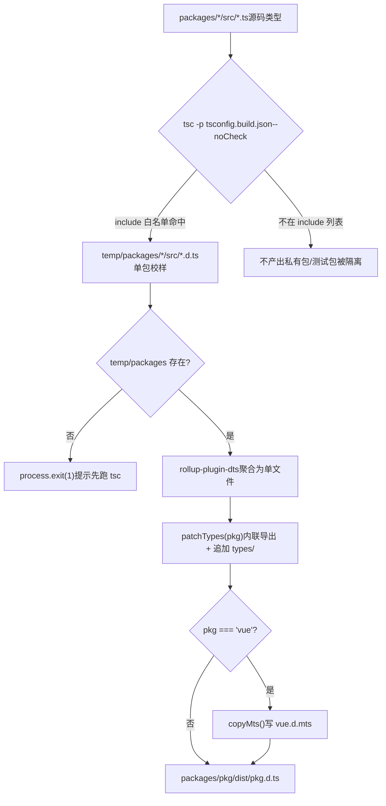
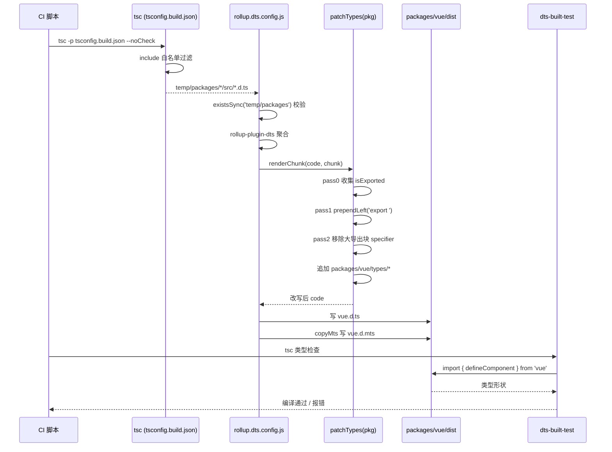

# Kapitel 5: Typartefakt-Pipeline: Von Quellcode-.d.ts zum release-tauglichen Typ-Paket

Im vorherigen Kapitel haben wir`inline-enums.js`und`verify-treeshaking.js`zerlegt: Eines ersetzt Enum-Referenzen durch Literale, damit das Enum-Objekt entfernt werden kann, das andere bestätigt nach dem Build mit String-Sentinels, dass drei bekannte Leaks nicht zurückkehren. Beide schützen gemeinsam das Laufzeit-Größenversprechen von Vue. Aber Build-Artefakte sind nicht nur JS. Wenn der Nutzer`import { ref } from 'vue'`, hängen die vom Editor angezeigten Typ-Hinweise und`tsc`die Typprüfung des Nutzercodes alle von einer anderen Art von Artefakten ab——`.d.ts`Deklarationsdateien. Ist das JS-Artefakt falsch, gibt es Laufzeitfehler; ist das Typartefakt falsch, gibt es auf Nutzerseite bereits zur Kompilierungszeit Fehler, oder schlimmer: Typen driften stillschweigend, Nutzercode kompiliert durch, aber die Typform stimmt nicht mit dem tatsächlichen Laufzeitverhalten überein. Dieses Kapitel verfolgt, wie Vue die in den einzelnen Unterpaketen`src`verstreuten Quellcode-Typen zu einem release-tauglichen Typ-Paket aggregiert und mit`dts-built-test`Typ-Smoke-Tests auf echten Build-Artefakten durchführt.

# 5.1 Zweistufige Typ-Pipeline: tsc liefert, rollup aggregiert

## Intuitives Modell

Stellen Sie sich eine Druckpipeline vor: In der ersten Phase setzt jedes Unterpaket sein eigenes Manuskript (`.ts`Quellcode) in einseitige Korrekturabzüge (`.d.ts`); in der zweiten Phase werden Dutzende Korrekturabzüge in Verzeichnisreihenfolge zu einem Buch gebunden (release-taugliche`.d.ts`) und Kopf- und Fußzeilen vereinheitlicht (Export-Deklarationen).

Ohne diese Pipeline müsste Vue manuell eine Release-Typdatei pflegen; bei jeder Quellcode-Änderung müsste man synchron manuell nachziehen——ein Nährboden für Typ-Drift. Vues Ansatz ist:**Typartefakte werden vollständig aus dem Quellcode generiert, niemals handgeschrieben**。

## Erste Phase: tsconfig.build.json legt den Ausgabebereich fest

`tsconfig.build.json`ist die Konfiguration der ersten Phase dieser Pipeline. Sie erbt vom Root-`tsconfig.json`und überschreibt nur build-relevante Optionen.

[FACT:tsconfig.build.json:3-9]

Schlüsseloptionen einzeln zerlegt:

- `declaration: true`: Lässt tsc für jede Quelldatei eine entsprechende`.d.ts`。
- `emitDeclarationOnly: true`：**generieren, nur Typen, kein JS**. JS wird von Rollup verantwortet; tsc ist hier reiner Typ-Extraktor.
- `stripInternal: true`: Alle Deklarationen, die mit`@internal`markiert sind, werden aus`.d.ts`entfernt. Dies ist Vues erste Schleuse zur Kontrolle der öffentlichen API-Oberfläche——interne Implementierungsdetails werden selbst dann nicht in die Release-Typen gelangen, wenn sie`export`sind, solange sie mit`@internal`markiert sind.
- `composite: false`: Deaktiviert den inkrementellen Build-Modus von project references. Vue braucht hier keine paketübergreifende Inkrementalität; das Abschalten vermeidet zusätzlichen Zustand durch`.tsbuildinfo`.

`include`Die

[FACT:tsconfig.build.json:10-23]

-Liste legt präzise fest, welche Verzeichnisse an der Ausgabe teilnehmen:**Beachten Sie, dass hier**nur 12 Verzeichnisse aufgelistet sind`packages/`。`packages-private/`、`packages/dts-test/`、`packages/sfc-playground/`, nicht das gesamte**usw. sind nicht darunter. Das bedeutet: Die Typen privater Pakete und Testpakete**Eintritt in die Release-Artefakte. Dies ist eine physische Isolation – nicht durch Konvention, sondern durch Konfiguration.

> **[Design Inference & Architectural Trade-offs]**
> Warum eine Whitelist statt einer Blacklist? Weil das Hinzufügen neuer Unterpakete im Monorepo der Normalfall ist. Bei einer`exclude`Blacklist würde ein neues privates Paket, das vergessen wurde in exclude aufzunehmen, seine Typen stillschweigend in die Release-Artefakte einschleusen. Die Whitelist ist das Gegenteil: Neue Pakete nehmen standardmäßig nicht am Build teil und müssen explizit hinzugefügt werden – das entspricht dem Prinzip der „sicheren Standardwerte".

Nach Ausführung von`tsc -p tsconfig.build.json --noCheck`landen die Artefakte in`temp/packages/<pkg>/src/*.d.ts`. Beachten Sie`--noCheck`: Typprüfung wird übersprungen, nur emit wird ausgeführt. Die Typprüfung übernimmt ein separates`tsc --noEmit`, die Build-Phase wiederholt die Prüfung nicht, um Zeit zu sparen.

## Zweite Phase: rollup.dts.config.js-Aggregation

Die zweite Phase wird von`rollup.dts.config.js`gesteuert. Ihr Einstieg führt zunächst eine Vorabvalidierung durch:

[FACT:rollup.dts.config.js:15-22]

Falls`temp/packages`nicht existiert, bedeutet das, dass die erste Phase nicht ausgeführt wurde; das Skript beendet sich direkt mit`process.exit(1)`und weist darauf hin, zuerst`tsc`auszuführen. Dies ist der**Reihenfolgevertrag**der Pipeline: Die rollup-Phase ist stark abhängig von den Artefakten der tsc-Phase, beide sind unverzichtbar.

Anschließend werden alle Unterpaketverzeichnisse gelesen und die`TARGETS`Umgebungsvariable für Subset-Builds unterstützt:

[FACT:rollup.dts.config.js:15-22]

`TARGETS`Der Mechanismus erlaubt es, nur die Typen einiger weniger Pakete neu zu bauen, was den Feedback-Zyklus bei der Entwicklungs-Debugging erheblich verkürzt.

Der Kern ist`targetPackages.map(...)`, das für jedes Paket eine Rollup-Konfiguration generiert:

[FACT:rollup.dts.config.js:23-42]

Feldweise Erläuterung:

- `input: ./temp/packages/${pkg}/src/index.d.ts`: Der Einstieg ist die in der ersten Phase erzeugte Typdatei, nicht der Quellcode`.ts`。
- `output.file: packages/${pkg}/dist/${pkg}.d.ts`: Die Artefakte landen im jeweiligen`dist`-Verzeichnis jedes Pakets, der Dateiname entspricht dem Paketnamen (z. B.`vue.d.ts`）。
- `format: 'es'`: Typdateien einheitlich im ES-Module-Format.
- `plugins: [dts(), patchTypes(pkg), ...(pkg === 'vue' ? [copyMts()] : [])]`: Drei Plugins, die ersten beiden gelten für alle Pakete,`copyMts`gilt nur für das`vue`-Paket.

`onwarn`Der

[FACT:rollup.dts.config.js:23-42]

-Hook verdient eine gesonderte Erwähnung:`UNRESOLVED_IMPORT`Während des dts-Rollups werden alle nicht-relativen Imports standardmäßig externalisiert. Dies führt dazu, dass Rollup**-Warnungen ausgibt. Aber das ist**erwartetes Verhalten`import { X } from 'some-pkg'`– die`return`in Typdateien sollten ohnehin als externe Referenzen erhalten bleiben und nicht mit eingebunden werden. Daher schluckt das Skript für „nicht aufgelöste Imports mit nicht-relativem Pfad" direkt`warn`。

> **[Design Inference & Architectural Trade-offs]**
> 〔Design-Inferenz und Architektur-Abwägung〕`!warning.exporter?.startsWith('.')`Hier gibt es eine Feinheit:`.`prüft, ob der Exporter mit

## beginnt. Wenn ein relativer Pfad-Import nicht aufgelöst wird, bedeutet das, dass die Artefakte der ersten Phase unvollständig sind – ein echtes Problem, das gemeldet werden muss. Diese Unterscheidung minimiert das Warnrauschen, ohne echte Fehler zu übersehen.

Kopieren`tsc`Dieses Diagramm verankert den Kontrollfluss der beiden Phasen:`rollup`Die Whitelist von`check`entscheidet, wer in die Pipeline gelangt,`patchTypes`Das`copyMts`von`vue`entscheidet, ob fortgefahren werden kann,

# ist ein obligatorischer Schritt,

## ist der

`rollup-plugin-dts`-paketspezifische Zweig.`.d.ts`5.2 patchTypes: Die aggregierten Artefakte in eine release-taugliche Form umschreiben`export { A, B, C, ... }`Intuitives Modell`defineComponent`Nachdem

`patchTypes`Dutzende von**in eine Datei zusammengeführt hat, hat das Ergebnis die Form „zuerst eine Reihe von Typen deklarieren, am Ende mit einem riesigen**einheitlich exportieren". Das ist für Menschen schwer lesbar und löst bei manchen Toolchains (z. B. dem

## -Aufruf von VitePress) den Fehler aus, dass „abgeleitete Typen nicht ohne Referenz benannt werden können".

`patchTypes`ist dieser`renderChunk`Nachbearbeitungs-Formungsschritt

[FACT:rollup.dts.config.js:87-88]

- `isExported`: „zentraler Export" wird in „Inline-Export vor Ort" umgewandelt, dann werden paketspezifische Typ-Erweiterungen angehängt.**Datenstruktur: Zwei Sets und drei Durchläufe**gibt ein Rollup-Plugin zurück, die Kernlogik liegt im`export { ... }`-Hook. Es verwaltet zwei Mengen:
- `shouldRemoveExport`: Zeichnet alle**ursprünglich exportierten**Typnamen auf (aus

-Deklarationen).

## Step-by-Step Walkthrough

**: Zeichnet alle**

[FACT:rollup.dts.config.js:90-100]

Typnamen auf, die aus dem großen Export-Block entfernt werden müssen`ExportNamedDeclaration`(weil sie bereits inline exportiert wurden).**Der Verarbeitungsablauf teilt sich in drei Durchläufe (pass 0 / pass 1 / pass 2), ein typisches „erst sammeln, dann umschreiben, zuletzt bereinigen"-Muster.**Pass 0: Alle bereits exportierten Typnamen sammeln.`export ... from '...'`Über die AST-Top-Level-Knoten iterieren; für alle`isExported`。

**, die`export`kein source haben**

[FACT:rollup.dts.config.js:102-125]

(also keine`VariableDeclaration`、`TSTypeAliasDeclaration`、`TSInterfaceDeclaration`、`TSDeclareFunction`、`TSEnumDeclaration`、`ClassDeclaration`-Re-Exports sind), wird der local name des Specifiers zu`processDeclaration`。

`processDeclaration`hinzugefügt.

[FACT:rollup.dts.config.js:70-85]

Pass 1: Deklarationsknoten direkt mit

-Präfix versehen.`id`Über Top-Level-Knoten iterieren, für

sechs Deklarationsarten wird`_`aufgerufen. Die Logik:**Drei Schritte:**1. Kein

→ direkt zurückgeben (z. B. anonyme Deklaration).`shouldRemoveExport`2. Name beginnt mit`isExported`→ überspringen. Dies ist die`prependLeft`Konvention`export `: Typen mit Unterstrich-Präfix sind interne Hilfstypen und werden nicht exportiert.

3. Den Namen zu`VariableDeclaration`hinzufügen; falls der Name in

[FACT:rollup.dts.config.js:104-115]

ist (also ursprünglich exportiert wurde), an der Startposition der Deklaration`declare const`einen`declare const a, b`-String einfügen.`processDeclaration`Beachten Sie, dass der`declarations[0]`-Zweig eine zusätzliche Assertion hat:**Wenn eine**mehrere declarators deklariert (z. B.

**), wird direkt ein Fehler geworfen. Weil**

[FACT:rollup.dts.config.js:127-171]

nur`ExportNamedDeclaration`verarbeitet, würde ein Multi-declarator zu einer übersehenen Verarbeitung führen. Hier wird

- schnelles Scheitern`shouldRemoveExport`statt stiller Fehler gewählt – Ausdruck defensiver Programmierung.`exported === local`Pass 2: Bereits inline exportierte Typen aus dem großen Export-Block entfernen.`export { Foo as Bar }`Über
- iterieren, für jeden Specifier:
- Falls sein local name in`ExportNamedDeclaration`ist und

**(ausgenommen**

[FACT:rollup.dts.config.js:172-183]

`code = s.toString()`-Umbenennungsfälle), wird der Specifier entfernt.`packages/${pkg}/types`Beim Entfernen wird MagicString präzise eingesetzt: Falls danach noch ein Specifier folgt, bis zum start des nächsten Specifiers löschen; falls es der letzte ist, bis zum end des vorherigen oder zum eigenen start löschen.

> **[Design Inference & Architectural Trade-offs]**
> Dieses`types/`Verzeichnis ist**manuell gepflegte Typ-Erweiterung**Einstiegspunkt für Typen, die nicht automatisch aus dem Quellcode generiert werden können (z. B. JSX-Global-Erweiterungen, Makro-Typdeklarationen). Es wird in derselben Datei wie die automatisch generierten Typen zusammengeführt, aber die Quellen sind klar getrennt – automatisch generierte oben, manuell erweiterte unten.

## Warum muss inline exportiert werden?

Der Kommentar gibt den direkten Grund an:

[FACT:rollup.dts.config.js:45-51]

Im Original heißt es: Alle Typen auf Inline-Export umstellen und aus dem großen Export-Block entfernen, sonst meldet der Aufruf in VitePress`defineComponent`den Fehler „the inferred type cannot be named without a reference".

> **[Design Inference & Architectural Trade-offs]**
> Der Kern dieses Fehlers ist: Wenn TypeScript Typen generiert und ein Typ nur durch „Verweis auf den Export eines anderen Moduls" benannt werden kann, dieser Verweis aber auf der Konsumentenseite nicht sichtbar ist, wird ein Fehler gemeldet. Ein zentraler Export-Block trennt Typnamen von der Deklarationsstelle und verschärft dieses Problem. Inline-Exporte machen jeden Typ an seiner Deklarationsstelle sichtbar und beseitigen diese Indirektionsschicht.

## copyMts: Typen für Node ESM/CJS-Dualmodus bereitstellen

`copyMts`Das Plugin wirkt nur auf das`vue`Paket:

[FACT:rollup.dts.config.js:196-204]

Es schreibt im`writeBundle`Hook den Inhalt von`vue.d.ts`unverändert nach`vue.d.mts`。

Der Kommentar erklärt den Grund:

[FACT:rollup.dts.config.js:188-192]

Gemäß der`package.json`exports-Spezifikation von TypeScript 4.7 müssen, um Typen für Node ESM und CJS gleichzeitig korrekt bereitzustellen,**zwei unabhängige Deklarationsdateien existieren**. Daher wird beim Build`vue.d.ts`einmal als`vue.d.mts`。

> **[Design Inference & Architectural Trade-offs]**
> 〔Design-Inferenz und Architektur-Abwägung〕`package.json`Warum kopieren statt neu generieren? Weil die Typformen von ESM und CJS vollständig identisch sind; der Unterschied liegt nur in der Dateiendung und im`exports`-Mapping von

# . Kopieren ist die günstigste Lösung und vermeidet einen erneuten Rollup-Durchlauf.

## 5.3 dts-built-test: Typ-Smoke-Test auf echten Artefakten

Intuitives Modell`patchTypes`Die vorherigen beiden Abschnitte stellen sicher, dass Typ-Artefakte generiert werden können und die Form korrekt ist. Aber „generierbar" bedeutet nicht „korrekt generiert". Wenn`import`bei einem Durchlauf einen Bug hat und einen Export versehentlich löscht, kann das Artefakt immer noch generiert werden, aber der Nutzer stellt beim

`dts-built-test`fest, dass Typen fehlen.**ist**ein Typ-Smoke-Test, der auf echten Build-Artefakten läuft`import`: Er testet nicht die Quelltypen, sondern`vue`das veröffentlichte

## Paket und verifiziert, dass wichtige Typformen nicht regressiert sind.

Datenstruktur: eine minimalisierte Typ-Assertion

[FACT:packages-private/dts-built-test/src/index.ts:3-6]

Der Kern des gesamten Testpakets ist nur eine Datei:

- Zeilenweise Erläuterung:`vue`L1: Aus`defineComponent`wird**importiert. Beachten Sie, dass hier der**Paketname`packages/vue/dist/vue.d.ts`importiert wird, kein relativer Pfad – es konsumiert das echte Artefakt
- .`_CustomPropsNotErased`L3-6: Definiert eine Komponente
- mit leeren Props und leerem Setup.`// #8376`L8: Kommentar
- , verweist auf ein konkretes Issue.`CustomPropsNotErased`L9-12: Exportiert`_CustomPropsNotErased`, Typ ist`{ foo: string }`der Schnitttyp von

und**`defineComponent`.`{ foo: string }`Dieser Test verifiziert:`foo`Der Rückgabetyp von**。

> **[Design Inference & Architectural Trade-offs]**
> , dass die`defineComponent`-Eigenschaft nicht gelöscht wird

## 〔Design-Inferenz und Architektur-Abwägung〕

[FACT:packages-private/dts-built-test/package.json:1-11]

Hintergrundvermutung zu Issue #8376:

- `private: true`Der Rückgabetyp von
- `types: dist/index.d.ts`wird möglicherweise durch einen Conditional Type oder Mapped Type verarbeitet, wodurch zusätzliche Eigenschaften im Schnitttyp „gelöscht" werden. Dieser Test fixiert dieses Verhalten mit einer minimalen Reproduktion; bei einer Regression wird in der Typprüfungsphase ein Fehler gemeldet.
- `dependencies`Paketkonfiguration: Workspace-Abhängigkeit zeigt auf echte Artefakte`workspace:*`Schlüsselfelder:`@vue/shared`、`@vue/reactivity`、`vue`。

> **[Design Inference & Architectural Trade-offs]**
> : Typ-Einstiegspunkt zeigt auf das Build-Artefakt.`@vue/shared`In`@vue/reactivity`drei`vue`-Abhängigkeiten:`types`〔Design-Inferenz und Architektur-Abwägung〕`dist`Warum von**und**abhängen? Weil die Typen von

## möglicherweise auf die Typen dieser beiden Pakete verweisen. Im Workspace-Modus verlinkt pnpm diese Abhängigkeiten symbolisch auf lokale Pakete, und die

`dts-built-test`-Felder der lokalen Pakete zeigen auf die Artefakte unter ihren jeweiligen`src/index.ts`. So konsumiert die gesamte Testkette`tsc`Build-Artefakte`tsc`, nicht Quellcode.

> **[Design Inference & Architectural Trade-offs]**
> hat selbst kein Testskript; seine**sind die Testfälle. Der Ausführungsweg ist: In CI**ausführen, um eine Typprüfung dieses Pakets durchzuführen. Bei einer Typform-Regression meldet`tsc`einen Fehler und CI schlägt fehl.

## 〔Design-Inferenz und Architektur-Abwägung〕

Das Clevere an diesem Design ist: Es kodiert den „Typvertrag" als`dts-built-test`kompilierbaren Code`dts-test`. Keine zusätzliche Assertion-Bibliothek nötig, keine Laufzeit,

- `dts-built-test`selbst ist der Test-Runner. Wenn die Typen stimmen, kompiliert es; wenn die Typen falsch sind, schlägt die Kompilierung fehl.**Arbeitsteilung mit dts-test**Beachten Sie, dass
- `dts-test`in diesem Kapitel und**im nächsten Kapitel zwei verschiedene Dinge sind:**(dieses Kapitel): konsumiert

> **[Design Inference & Architectural Trade-offs]**
> , verifiziert Typformen auf Veröffentlichungsebene.`patchTypes`(nächstes Kapitel): konsumiert`stripInternal`Quelltyp`types/`, verifiziert den API-Oberflächenvertrag.`dts-built-test`〔Design-Inferenz und Architektur-Abwägung〕

## Warum braucht es zwei Ebenen? Weil Quelltypen und Artefakttypen inkonsistent sein können.

, das Entfernen von`patchTypes`, das Anhängen des`dts-built-test`-Verzeichnisses können alle unter der Voraussetzung korrekter Quelltypen Artefakt-Bugs einführen.

# bewacht speziell diese letzte Meile.

## Die vollständige Zeitsequenz der Typ-Pipeline

`patchTypes`Kopieren`code.replace(...)`Dieses Sequenzdiagramm verankert die modulübergreifende Zusammenarbeit: CI treibt die beiden Phasen tsc und Rollup an,

1. **die drei Durchläufe von**sind die Kernverarbeitung,`start`/`end`konsumiert am Ende die Artefakte zur Verifikation.

2. **Designüberlegungen, Fehlerbehebung und Produktions-Fallstricke**MagicString kann Mappings erzeugen, sodass umgeschriebene Typdateien weiterhin auf den Quellcode zurückverfolgt werden können. Obwohl der Nutzen von Sourcemaps für Typdateien begrenzt ist, ist Konsistenz eine gute Praxis.

## Schnelles Scheitern vs. stilles Fehlertolerieren

`patchTypes`An mehreren Stellen verwendet`assert`：

[FACT:rollup.dts.config.js:74-74]

[FACT:rollup.dts.config.js:107-108]

[FACT:rollup.dts.config.js:147-148]

Diese Assertions werfen sofort einen Fehler, wenn sie auf unerwartete AST-Formen stoßen. Im Vergleich dazu`onwarn`das stille Verschlucken von`UNRESOLVED_IMPORT`in**Erwartetes Rauschen wird verschluckt, unerwartete Formen führen zu schnellem Scheitern**. Das ist die richtige Haltung für Build-Skripte: Lieber den Build fehlschlagen lassen, als Typdateien mit falscher Form zu erzeugen.

## Produktions-Fallstricke:`_`Präfix-Konvention

`processDeclaration`Überspringen von Typen, die mit`_`beginnen:

[FACT:rollup.dts.config.js:76-78]

Das bedeutet, dass jeder exportierte Typ im Quellcode, der mit`_`beginnt, nicht inline exportiert wird. Wenn ein Typ eigentlich öffentlich sein sollte, aber aufgrund eines Namens, der mit`_`beginnt, übersprungen wird, stößt der Nutzer auf den Fehler „Typ existiert nicht“.

> **[Design Inference & Architectural Trade-offs]**
> Der Ansatz zur Fehlersuche bei solchen Problemen: Prüfen Sie zuerst, ob der Typ im Artefakt`vue.d.ts`noch im großen Exportblock vorhanden ist, und prüfen Sie dann, ob der Typname im Quellcode mit`_`beginnt. Dies ist eine implizite Kopplung zwischen Namenskonvention und Tool-Verhalten, die leicht zu Fallstricken führt.

## Produktions-Fallstrick: Multi-Declarator-Assertion

[FACT:rollup.dts.config.js:106-115]

Wenn in einem`.d.ts`ein`declare const a, b`auftritt, wirft der Build direkt einen Fehler. Dies ist bei handgeschriebenen Typen selten, aber wenn eine von einem Tool generierte Typdatei diese Form verwendet, wird es ausgelöst. Die Fehlermeldung gibt den problematischen Codeausschnitt aus, was die Lokalisierung erleichtert.

# Zusammenfassung dieses Kapitels

Dieses Kapitel hat die vollständige Pipeline der Vue-Typartefakte nachverfolgt:

1. **Erste Phase (tsc)**：`tsconfig.build.json`verwendet`include`eine Whitelist, um den Ausgabebereich präzise abzugrenzen,`emitDeclarationOnly`gibt nur Typen aus,`stripInternal`entfernt interne Deklarationen. Die Artefakte landen in`temp/packages/`。

2. **Zweite Phase (rollup)**：`rollup.dts.config.js`verwendet`rollup-plugin-dts`, um die Typen der einzelnen Pakete zu aggregieren,`patchTypes`schreibt durch drei AST-Durchläufe zentrale Exporte in Inline-Exporte um und hängt manuelle Erweiterungen aus dem`types/`-Verzeichnis an.`copyMts`Für das`vue`-Paket werden zusätzlich`.d.mts`。

3. **generiert. Validierungsphase (dts-built-test)**: Typ-Smoke-Tests auf den echten Build-Artefakten durchführen, um mit kompilierbarem Code die entscheidenden Typformen festzuschreiben und Typdrift zu verhindern.

# Gedanken und Selbsttests zu diesem Kapitel

Q1: Was passiert, wenn man die`tsconfig.build.json`-Whitelist von`include`in`["packages"]`ändert (d. h. das gesamte packages-Verzeichnis einschließt)? In welchen Szenarien führt dies zu einer Verschmutzung der veröffentlichten Typen?

**Referenzanalyse**：

`include`Nach der Änderung von 12 präzisen Verzeichnissen zu`["packages"]`nehmen alle Unterpakete (einschließlich aller`packages-private`außerhalb von`packages/*`) an der tsc-Ausgabe teil.[FACT:tsconfig.build.json:10-23]

Folgenkette:

1. `temp/packages/`Unter`.d.ts`。

2. `rollup.dts.config.js`erscheinen viele zusätzliche Pakete. Das`readdirSync('temp/packages')`von[FACT:rollup.dts.config.js:15-22]

3. `targetPackages`liest diese zusätzlichen Pakete. Standardmäßig entspricht`packages/<pkg>/dist/<pkg>.d.ts`。[FACT:rollup.dts.config.js:15-22]

allen Paketen, daher wird für jedes Paket`dist`generiert. Verschmutzungsszenario: Wenn ein Paket eigentlich nicht veröffentlicht werden sollte (z. B. ein internes Tool-Paket), erscheint sein Typartefakt unter`package.json`. Wenn das`private: true`dieses Pakets kein

hat, könnte das Veröffentlichungsskript es mit zu npm veröffentlichen, was zu einem Leck interner Typen führt.

Q2: `patchTypes`Genau das ist der Wert des Whitelist-Designs: Neue Pakete sind standardmäßig nicht enthalten und müssen explizit hinzugefügt werden, was einem sicheren Standardwert entspricht.`processDeclaration`In Pass 1 von`_`werden Typen, die mit`return`beginnen, direkt`_`. Wenn der Typ einer öffentlichen API zufällig mit`_InternalType`beginnt (z. B.

**versehentlich exportiert wird), was sieht der Nutzer dann? Wie kann man das untersuchen?**：

`processDeclaration`Referenzanalyse`_`Bei`shouldRemoveExport`wird bei einem Präfix`export `。[FACT:rollup.dts.config.js:76-78]

direkt zurückgegeben, weder

hinzugefügt noch`export`。

vorangestellt. Folgen:`shouldRemoveExport`1. Dieser Typ erhält kein Inline-

2. Er wird auch nicht aus dem großen Exportblock entfernt (da er nicht in**ist).**3. Daher

ist er weiterhin im großen Exportblock`export { _InternalType }`und kann theoretisch weiterhin importiert werden.`stripInternal`Das Problem ist jedoch: Das`tsc`im großen Exportblock referenziert die Deklarationsposition. Wenn diese Deklaration aus irgendeinem Grund (z. B.

) entfernt wird, referenziert der Exportblock einen nicht existierenden Namen, was zu einem

-Fehler führt.`vue.d.ts`Fehlersuche-Ansatz:`export`1. Prüfen Sie im Artefakt

, ob der Typ weder an der Deklarationsstelle ein`_`hat noch im großen Exportblock referenziert wird.

2. Prüfen Sie im Quellcode, ob der Typname mit

beginnt.`_`3. Wenn es sich um ein Namensproblem handelt, reicht eine Umbenennung ohne Unterstrich-Präfix.

Q3: `dts-built-test`Dies legt die implizite Kopplung zwischen Namenskonvention und Tool-Verhalten offen:`src/index.ts`Das Präfix`typeof _CustomPropsNotErased & { foo: string }`bedeutet eigentlich „intern“, aber das Tool behandelt es als „nicht exportieren“ – die beiden Semantiken sind nicht vollständig deckungsgleich.`foo`Das`Omit<typeof _CustomPropsNotErased, never> & { foo: string }`von

**verwendet den Kreuztyp**：

`Omit<T, never>`, um zu verifizieren, dass**nicht gelöscht wird. Wenn man den Kreuztyp in**ändert, kann der Test dann noch die Regression von #8376 erfassen? Warum?

- Referenzanalyse`T & { foo: string }`erstellt einen neuen Mapping-Typ, der`foo`alle Eigenschaften von T neu berechnet`defineComponent`. Wenn der Bug von #8376 darin besteht, dass „zusätzliche Eigenschaften im Kreuztyp gelöscht werden“, dann:`foo`Ursprüngliche Schreibweise
- `Omit`: direkte Kreuzung,`Omit`ist Teil des Kreuztyps. Wenn die Rückgabetyp-Verarbeitungslogik von`T`zusätzliche Eigenschaften in der Kreuzung löscht,`{ foo: string }`geht`Omit`verloren.

[FACT:packages-private/dts-built-test/src/index.ts:9-12]

Schreibweise**: Zuerst wird**gemappt und dann mit`Omit`、`Pick`gekreuzt. Der Mapping-Prozess von

> **[Design Inference & Architectural Trade-offs]**
> Daher ist die

Minimalität`dts-built-test`des Testfalls entscheidend: Er muss den Auslösepfad des Bugs präzise reproduzieren. Jede zusätzliche Typumwandlung (wie`dts-test`, sieh, wie Vue mit Typvertragstests die öffentliche API-Oberfläche absichert.

Die drei bilden einen geschlossenen Kreislauf aus „Generieren → Formen → Validieren“, der sicherstellt, dass Quelltyp und veröffentlichter Typ strikt übereinstimmen. Dass das Typ-Paket selbst korrekt ist, bedeutet jedoch nicht, dass die Typform der öffentlichen API fixiert ist. Im nächsten Kapitel gehen wir tiefer in`packages-private/dts-test`, um zu sehen, wie über 20`.test-d.ts`-Dateien mit`expectType`und anderen Werkzeugen „Typen als API-Vertrag“ in regressionsfähige automatisierte Tests verwandeln.
