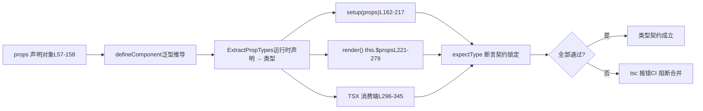

# Kapitel 6: Typvertragstests: Wie dts-test die API-Oberfläche absichert

Im vorherigen Kapitel haben wir die Generierungskette der Typdeklarationen verfolgt und gesehen, wie Vue durch Build-Konfiguration und Smoke-Tests sicherstellt, dass „Quelltyp“ und „veröffentlichter Typ“ strikt übereinstimmen. Doch der Typvertrag beschränkt sich nicht auf „ob die Form stimmt“, sondern entscheidender ist, „ob die API-Oberfläche den Erwartungen entspricht“ – welche Typen exportiert werden sollen, welche nicht, und ob generische Constraints präzise sind. Dieses Kapitel geht in`packages-private/dts-test`, um zu sehen, wie Vue mit über 20`.test-d.ts`-Dateien „Typen als API-Vertrag“ in regressionsfähige automatisierte Tests umsetzt.

# Das kognitive Modell von Typvertragstests: Die „Spezifikation“ in einen „ausführbaren Vertrag“ verwandeln

`dts-test`Die Dateien im**-Verzeichnis haben ein kontraintuitives Merkmal: Sie**erzeugen nahezu kein Laufzeitverhalten`defineComponent.test-d.tsx`. Öffnet man`defineComponent({...})`, sieht man zahlreiche`tsc`/`vue-tsc`-Aufrufe, aber sie werden zur Testlaufzeit nie tatsächlich ausgeführt – diese Dateien werden nur von`noEmit: true`typgeprüft,

[FACT:packages-private/dts-test/tsconfig.test.json:1-11]

um sicherzustellen, dass kein JS erzeugt wird.`noEmit`Diese Konfiguration ist die „Laufzeitumgebung“ des gesamten Vertragssystems:`jsx: preserve`deaktiviert die Ausgabe von Artefakten,`strict`lässt TSX-Syntax für den TypeScript-Compiler zur Analyse bestehen,`moduleResolution: bundler`aktiviert alle strikten Prüfungen,`lib`entspricht moderner Bundling-Semantik,`esnext`und führt gleichzeitig`dom`。**ein.`.test-d.tsx`Ohne diese Konfiguration würde JSX in**。

> **[Design Inference & Architectural Trade-offs]**
> 〔Design-Inferenz und Architekturabwägung〕`packages-private`Typentests in ein eigenes`packages/vue`-Unterpaket auszulagern, statt sie in`__tests__`von`vue`zu stopfen, hat drei Motive: Erstens sind die Abhängigkeiten der Typentests die**veröffentlichungsreifen Typen von**（`vue/jsx`、`vue`, die`.d.ts`), nicht interne Quellmodule, und die physische Trennung erzwingt den öffentlichen Einstiegspunkt; zweitens ist der`tsc`-Check von Typentests deutlich zeitaufwändiger als Laufzeit-Unit-Tests, und ein separates Verzeichnis erleichtert die separate CI-Planung; drittens werden`.test-d.tsx`-Dateien nicht vom Laufzeit-Sammler von Vitest fälschlich ausgeführt.

Alltagsanalogie: Normale Unit-Tests sind wie „die Maschine einschalten und sehen, ob sie raucht“, während Typvertragstests wie „vor Vertragsunterzeichnung Klausel für Klausel prüfen“ sind – es wird nicht tatsächlich gehandelt, sondern nur bestätigt, dass bei „vom Auftraggeber zu zahlender Betrag“ „Renminbi“ statt „US-Dollar“ steht. Wenn die Vertragsklauseln falsch sind, nützt es nichts, dass die Maschine noch so reibungslos läuft.

`utils.d.ts`stellt das gesamte Werkzeugset für diese „Vertragsprüfung“ bereit:

[FACT:packages-private/dts-test/utils.d.ts:7-21]

Es gibt nur vier Schlüsselwerkzeuge:`expectType<T>(value: T)`behauptet, dass`value`genau vom Typ`T`；`expectAssignable<T, T2 extends T>`ist; behauptet, dass`T2`zuweisbar an`T`；`IsUnion<T>`ist; prüft, ob`T`ein Union-Typ ist;`IsAny<T>`prüft, ob`T`vom Typ`any`ist. Beachte`import 'vue/jsx'`in L5 – es registriert den globalen JSX-Namensraum, sodass`<MyComponent />`in TSX vom Typsystem als`JSX.Element`。

[FACT:packages-private/dts-test/utils.d.ts:7-21]

`IsUnion`erkannt werden kann. Die Implementierung von`T extends any ? (U extends T ? false : true) : never`verdient eine genauere Betrachtung:`T`nutzt distributive bedingte Typen; wenn`extends false`ein Union-Typ ist, wird jedes Mitglied unabhängig ausgewertet, und am Ende`false`prüft, ob alle Zweige**zurückgeben. Dies ist ein**Existenzbeweis auf Typebene`props.jjj`– er dient dazu, Verträge wie „

# muss ein Union-Typ sein und darf nicht zu einer einzigen Signatur zusammengeführt werden“ zu fixieren.`defineComponent`Szenariogetriebener Walkthrough:

`defineComponent.test-d.tsx`Die vollständige Kette der Props-Typinferenz in**hat 2260 Zeilen und ist der Kern des Vertragssystems. Wir versetzen uns in ein konkretes Szenario:`defineComponent({ props: {...}, setup(props) {...} })`Der Nutzer schreibt`props`, und das Typsystem von Vue muss aus der`setup`Laufzeitdeklaration den präzisen Typ des`props`-Parameters in**ableiten. Diese Kette ist der komplexeste Teil des Vue-Typsystems.

## Schritt 1: Den „erwarteten Typ“ als Vertragsgrundlage konstruieren

Die Testdatei definiert zuerst das`ExpectedProps`-Interface und schreibt den Typ, der für jede Props-Deklarationsart abgeleitet werden sollte,**explizit fest**：

[FACT:packages-private/dts-test/defineComponent.test-d.tsx:21-53]

. Dieses Interface ist die schriftliche Version der „Vertragsklauseln“. Beachte einige subtile Typen:`a?: number | undefined`(optionale Props mit`undefined`）、`aa: number`(hat default, daher nicht optional),`aaa: number | null`（`PropType<number | null>`explizit deklariert),`aaaa: number | undefined`（`required: true as const`aber der Typ enthält`undefined`). Diese Unterschiede sind nicht willkürlich geschrieben; jede entspricht einem bestimmten Zweig in der`props`-Deklaration.

## Schritt 2: Mit verschiedenen Deklarationsarten`defineComponent`

[FACT:packages-private/dts-test/defineComponent.test-d.tsx:57-158]

„füttern“`props`Dieses**-Objekt ist die**erschöpfende Matrix der Deklarationsarten

- `a: Number`und deckt alle Schreibweisen von Vue props ab:`number | undefined`
- `aa: { type: Number as PropType<number | undefined>, default: 1 }`– Konstruktor-Kurzform, abgeleitet als`number`
- `aaaa: { type: Number, required: true as const }` —— `as const`– hat default, abgeleitet als nicht optional`true`verhindert, dass`boolean`zu
- `b: { type: String, required: true as true }` —— `required: true`erweitert wird, und bewahrt den Literaltyp
- `bb: { default: 'hello' }`macht die Eigenschaft non-void`type`– kein
- `cc: Array as PropType<string[]>`, Typ wird nur über default abgeleitet
- `l: [Date]`– explizite Typkonvertierung`Date | undefined`
- `ll: [Date, Number]`– Array-Syntax, abgeleitet als`Date | number | undefined`
- `lll: [String, Number]`– Multi-Typ-Array, abgeleitet als

> **[Design Inference & Architectural Trade-offs]**
> `required: true as const`〔Design-Inferenz und Architekturabwägung〕`required: true as true`(L70) und`as true`(L75) existieren nebeneinander als Spuren historischer Entwicklung: Früher verwendete man`as const`, später stellte man fest, dass**allgemeiner ist (es kann gleichzeitig andere Literale im Objekt fixieren), aber die alte Schreibweise blieb erhalten, um Rückwärtskompatibilität zu verifizieren. Das ist der typische Wert von Vertragstests –**。

## er fixiert gleichzeitig „neue Schreibweise nutzbar“ und „alte Schreibweise ohne Regression“.`setup` / `render` / `this`Schritt 3: An den drei Positionen

assertieren**Dies ist das raffinierteste Design des Vertragstests:**。

[FACT:packages-private/dts-test/defineComponent.test-d.tsx:160-217]

`setup(props)`Derselbe Props-Typ muss an drei verschiedenen Konsumpositionen korrekt abgeleitet werden`expectType<ExpectedProps['x']>(props.x)`. In

[FACT:packages-private/dts-test/defineComponent.test-d.tsx:168-170]

`// @ts-expect-error should included 'undefined'`In Kombination mit`expectType<number>(props.aaaa)`——**wird absichtlich eine fehlschlagende Assertion geschrieben, um mit`@ts-expect-error`den Fehler zu schlucken**. Dies verifiziert, dass`props.aaaa`den Typ**nicht** `number`hat (andernfalls würde diese Zeile keinen Fehler werfen,`@ts-expect-error`sondern stattdessen fehlschlagen, weil „kein Fehler zum Schlucken“ vorhanden ist). Dies ist die „Reverse-Assertion“-Technik des Typtests.

[FACT:packages-private/dts-test/defineComponent.test-d.tsx:204-205]

`// @ts-expect-error props should be readonly`In Kombination mit`props.a = 1`— verifiziert, dass props in`setup`schreibgeschützt sind. Wenn ein Refactoring versehentlich props veränderbar macht, wirft diese Zeile keinen Fehler mehr,`@ts-expect-error`und

`render()`schlägt fehl.`this.$props`In`this.x`wird hingegen über die beiden Pfade

[FACT:packages-private/dts-test/defineComponent.test-d.tsx:221-279]

und`this`assertiert:`this.a = 1`L252-276 verifiziert, dass „deklarierte props auch auf`this`exponiert werden müssen“, L278-279 verifiziert, dass`this.c`einen Fehler wirft (`number`（`ref(1)`props auf`this.d.e.value`sind ebenfalls schreibgeschützt). L281-287 verifiziert das Entpacken des setup-Rückgabewerts:`string`ist`.value`）、`this.f.g`wird entpackt),`GT`（`reactive`ist

## (verschachtelte refs bleiben erhalten,

ist`<MyComponent />`branded Typen in

[FACT:packages-private/dts-test/defineComponent.test-d.tsx:296-322]

werden nicht entpackt).`<MyComponent>`Vierter Schritt: Typvalidierung auf der TSX-Konsumentenseite`class`/`style`/`key`/`ref`/`ref_for`Der letzte Baustein des Typvertrags ist „wie der Nutzer diese Komponente verwendet“. Die props-Validierung von**in TSX ist ein unabhängiger Typpfad:**：

[FACT:packages-private/dts-test/defineComponent.test-d.tsx:337-345]

`// @ts-expect-error missing required props`Hier wird verifiziert, dass`wrong prop types`alle deklarierten props akzeptiert, sowie`ggg="baz"`diese eingebauten Attribute. Danach folgt`ggg`Reverse-Validierung`'foo' | 'bar'`）。

verifiziert, dass fehlende erforderliche props einen Fehler werfen;



einen Fehler wirft (**akzeptiert nur`props`Die gesamte Kette lässt sich mit einem Datenflussdiagramm zusammenfassen:**Kopieren`tsc`Der Schlüssel dieses Diagramms ist:

# Dieselbe`__typeProps`、`__typeEmits`Deklaration muss gleichzeitig die Typerwartungen von drei Konsumstellen erfüllen

`defineComponent`. Jede Abweichung in der Inferenz führt dazu, dass**einen Fehler wirft.**Grenzen und Hintertüren:`color='white'`und bedingte Typverträge`appearance`Die Typinferenz von`'outline'`hat eine grundlegende Einschränkung:`__typeProps`Laufzeit-props-Deklarationen können „bedingte Typen“ nicht ausdrücken

## `__typeProps`. Zum Beispiel die Einschränkung „wenn

[FACT:packages-private/dts-test/defineComponent.test-d.tsx:1803-1836]

`ConditionalProps`, dann muss`color``appearance`sein“ lässt sich mit Laufzeit-Objektsyntax nicht schreiben. Vue bietet dafür`color: 'white'`und andere „Typ-Hintertüren“.`appearance: 'outline'`: Notausstieg für bedingte props

- L1823-1824：`<Comp color="white" />`ist ein Union-Typ: entweder sind`color: 'white'`und
- L1825-1826：`<Comp color="white" appearance="normal" />`beide optional, oder`appearance`und`'outline'`
- L1827：`<Comp color="white" appearance="outline" />`. Der Test verifiziert:

> **[Design Inference & Architectural Trade-offs]**
> `__typeProps`erfüllt keinen der beiden Zweige

## `__typeEmits`wirft einen Fehler —

`__typeEmits`muss**sein**：

[FACT:packages-private/dts-test/defineComponent.test-d.tsx:1838-1885]

besteht`{ change: [id: number], update: [value: string] }`〔Designinferenz und Architekturabwägung〕`this.$props.onChange?.(123)`Die Designmotivation von`onChange?.('123')`ist „das Typsystem Einschränkungen ausdrücken zu lassen, die zur Laufzeit nicht ausdrückbar sind“. Es nimmt nicht an der Laufzeit-props-Auflösung teil, sondern ist eine reine Typ-Ebene-Überlagerung. Der Preis ist, dass Nutzer die Konsistenz zwischen Typ und Laufzeitdeklaration manuell wahren müssen — deshalb heißt es „backdoor“ und nicht offizielle API.

[FACT:packages-private/dts-test/defineComponent.test-d.tsx:1887-1934]

: Äquivalenz der beiden emits-Syntaxen`{ (e: 'change', id: number): void; (e: 'update', value: string): void }`unterstützt zwei Syntaxen, der Test**sperrt beide gleichzeitig**Objektsyntax**drückt Parameter mit benannten Tupeln aus. Der Test verifiziert, dass**besteht,

> **[Design Inference & Architectural Trade-offs]**
> Call-Signature-Syntax`defineEmits`drückt dies mit Überladungen aus.

## `__typeRefs`Die Testkörper der beiden Syntaxen sind nahezu zeilenweise identisch`__typeEl`— das ist beabsichtigt: Der Vertrag verlangt, dass beide Schreibweisen

[FACT:packages-private/dts-test/defineComponent.test-d.tsx:1936-1952]

`__typeRefs`vollständig äquivalentes`Parent`Typverhalten erzeugen.`__typeRefs: { child: ComponentInstance<typeof Child> }`〔Designinferenz und Architekturabwägung〕`refs.child.$refs.foo`Warum zwei Syntaxen beibehalten? Die Objektsyntax ähnelt stärker der Schreibweise von`number`。

[FACT:packages-private/dts-test/defineComponent.test-d.tsx:1963-1977]

`__typeEl`, die Call-Signature-Syntax ähnelt stärker traditionellen TS-Ereignistypen. Vue muss beide unterstützen und konsistentes Verhalten garantieren. Die „zeilenweise gespiegelte“ Struktur des Tests ist der stärkste Äquivalenzbeweis.**und`Element`**: komponentenübergreifende Referenzen und Host-Knotentypen`TypeEl`ermöglicht der Elternkomponente, den Typ der Kindkomponenten-ref präzise zu kennen.`Element`deklariert`CustomElement`, sodass`$el`zu

> **[Design Inference & Architectural Trade-offs]**
> ist subtiler. Der Testkommentar in L1963-1977 benennt die Designabsicht:`TypeEl`Host-Knoten benutzerdefinierter Renderer (TUI, canvas, native) sind kein DOM`Element`，`@vue/runtime-test`, daher darf`$el`nicht auf

## eingeschränkt werden. Der Test verwendet das

`function syntax w/ runtime props`Interface, um zu verifizieren, dass**beliebige Host-Typen akzeptieren kann.**。

[FACT:packages-private/dts-test/defineComponent.test-d.tsx:1501-1545]

〔Designinferenz und Architekturabwägung〕`generics aren't supported with object runtime props`Dies ist die Typ-Ebene-Garantie dafür, dass Vue 3 benutzerdefinierte Renderer unterstützt. Wäre`<Comp3<string>>`hart auf

> **[Design Inference & Architectural Trade-offs]**
> den Typ`ExtractPropTypes`nicht korrekt inferieren. Der Vertragstest schützt hier die „Renderer-Unabhängigkeit“.

# Gegenseitige Ausschlussbedingungen von generischen Komponenten und Laufzeit-props

## `@ts-expect-error`Der Abschnitt

`@ts-expect-error`sperrt eine wichtige Regel:**Generische Komponenten können nicht mit Objekt-Laufzeit-props koexistieren`@ts-expect-error`Der Kommentar**in L1501 ist eine Vertragsdeklaration. L1525-1535 verifiziert, dass generisches setup + Objekt-props einen Fehler werfen; L1538-1539 verifiziert, dass

[FACT:packages-private/dts-test/defineComponent.test-d.tsx:1354-1362]

einen Fehler wirft. Array-props hingegen erlauben Generics (L1464-1499).`// @ts-expect-error missing prop`〔Designinferenz und Architekturabwägung〕`<Comp msg={123} />`Die Ursache dieser Einschränkung ist die Reihenfolge der Typinferenz: Objekt-props benötigen**, um zuerst den Typ zu bestimmen, während Generics erst bei der Instanziierung bestimmt werden können — beide kollidieren. Array-props nehmen nicht an der Typextraktion teil, daher kollidieren sie nicht. Der Vertragstest fixiert diese „Typsystem-Einschränkung“ als regressionsfähige Assertion.**Designüberlegungen, Fehlererholung und Produktions-Fallstricke`expectType<JSX.Element>(...)`Das zweischneidige Schwert von`@ts-expect-error`ist das Kernwerkzeug des Typvertragstests, hat aber eine tödliche Falle:`expectType`Wenn der Code darunter keinen Fehler mehr wirft,

> **[Design Inference & Architectural Trade-offs]**
> selbst einen Fehler`@ts-expect-error`. Das scheint Schutz zu sein, verlangt aber vom Testautor, die „Position des Fehlers“ präzise zu kontrollieren.**Betrachten wir diesen Abschnitt:`@ts-expect-error`wird in**auf die

## `IsAny`und`IsUnion`: Existenzbeweis auf Typebene

[FACT:packages-private/dts-test/defineComponent.test-d.tsx:1991-1993]

`expectType<IsAny<typeof props.foo>>(false)`validiert`props.foo`nicht`any`. Dies ist**umgekehrter Vertrag**: Es wird nicht nur gefordert, dass der Typ korrekt ist, sondern auch, dass der Typ nicht zu`any`」。`any`degenerieren darf.  ist ein schwarzes Loch des Typsystems; jedes`any`lässt nachfolgende Assertions bedeutungslos werden.

[FACT:packages-private/dts-test/defineComponent.test-d.tsx:195-196]

`expectType<IsUnion<typeof props.jjj>>(true)`validiert`jjj`ist ein Union-Typ.`jjj`deklariert als`((arg1: string) => string) | ((arg1: string, arg2: string) => string)`, wenn das Typsystem es zu einer einzigen Signatur zusammenführt,`IsUnion`gibt`false`zurück, Test schlägt fehl.

> **[Design Inference & Architectural Trade-offs]**
> Diese beiden Werkzeuge schützen die „Präzision des Typs“ und nicht die „Korrektheit des Typs“. Ein zu`any`degenerierter oder eine zusammengeführte Union – in den meisten Anwendungsszenarien „scheint es zu funktionieren“, aber IDE-Hinweise und Compile-Time-Prüfungen gehen verloren. Vertragstests müssen diese Präzision fixieren.

## Impliziter Vertrag der Deklarationsreihenfolge

[FACT:packages-private/dts-test/defineComponent.test-d.tsx:1784-1801]

Dieser Kommentar ist äußerst wichtig:`code generated by tsc / vue-tsc, make sure this continues to work so we don't accidentally change the args order of DefineComponent`。`DefineComponent`hat 13 generische Parameter, die Reihenfolge ist**Öffentlicher Vertrag**——`vue-tsc`Der generierte Komponententyp hängt von dieser Reihenfolge ab. Der Test verwendet`declare const MyButton: DefineComponent<...>`und schreibt alle 13 Parameter explizit aus, um die Reihenfolge zu fixieren.

> **[Design Inference & Architectural Trade-offs]**
> Dies ist der am leichtesten übersehene Vertrag: Die Reihenfolge der generischen Parameter ist kein „Implementierungsdetail“, sondern die „ABI des generierten Codes“. Jeder PR, der die Reihenfolge ändert, führt dazu, dass`vue-tsc`generierte`.d.ts`mit dem Laufzeittyp inkompatibel ist. Vertragstests spielen hier die Rolle des „ABI-Kompatibilitätswächters“.

## Dateiübergreifender Vertrag:`componentInstance.test-d.tsx`Ergänzung zu

`componentInstance.test-d.tsx`hat nur 154 Zeilen, deckt aber alle Eingabeformen des`ComponentInstance`Utility-Typs ab:

[FACT:packages-private/dts-test/componentInstance.test-d.tsx:10-40]

`ComponentInstance<typeof CompSetup>`Extrahiert den Instanztyp aus dem`defineComponent`Ergebnis;`ComponentInstance<typeof CompFunctional>`Extrahiert aus funktionalen Komponenten;`ComponentInstance<typeof CompFunction>`Extrahiert aus nackten Funktionen. Alle drei müssen die`ComponentPublicInstance`Basisklasse ableiten.

[FACT:packages-private/dts-test/componentInstance.test-d.tsx:71-116]

Noch extremer ist das „nackte Objekt ohne`defineComponent`Wrapper“:`CompObjectSetup`、`CompObjectData`、`CompObjectNoProps`Alle drei Formen müssen von`ComponentInstance`korrekt extrahiert werden können. Besonders L113-114 ist kontraintuitiv:`CompObjectNoProps`hat keine`props`-Deklaration, aber`compObjectNoProps.test`wird dennoch als`string | undefined`abgeleitet – dies ist der von der`ComponentPublicInstance`Basisklasse bereitgestellte Fallback.

[FACT:packages-private/dts-test/componentInstance.test-d.tsx:143-147]

Der`#12751`-Test in L141 fixiert eine Grenze:`__typeEmits`deklarierte`'update:visible'`-Ereignis sollte auf der Instanz als`comp['onUpdate:visible']`(String-Schlüssel mit Doppelpunkt) exponiert werden, und`$props`hat den Typ`{ 'onUpdate:visible'?: (value?: boolean) => any }`. L152-153 validiert`comp['$props']['$props']`Fehler – verhindert rekursive Selbstreferenz des Typs.

# Zusammenfassung dieses Kapitels

`dts-test`Das Verzeichnis verwendet über 20`.test-d.ts`-Dateien, um „Typ als API-Vertrag“ in regressionsfähige automatisierte Tests umzusetzen. Der Kernmechanismus hat drei Ebenen:

1. **Werkzeug-Ebene**：`expectType`、`expectAssignable`、`IsUnion`、`IsAny`Bietet Typ-Assertion-Primitive,`@ts-expect-error`Bietet umgekehrte Assertion-Fähigkeit.

2. **Vertrags-Ebene**：`ExpectedProps`Die Schnittstelle schreibt explizit fest, „welcher Typ abgeleitet werden soll“,`props`Die Deklarationsmatrix zählt alle Schreibweisen erschöpfend auf, drei Konsumstellen (`setup`/`render`/TSX) werden kreuzvalidiert.

3. **Hintertür-Ebene**：`__typeProps`、`__typeEmits`、`__typeRefs`、`__typeEl`Bietet eine Escape-Luke für Typbeschränkungen, die zur Laufzeit nicht ausgedrückt werden können, und fixiert gleichzeitig die Äquivalenz der beiden emits-Syntaxen.

# Denkanstöße und Selbsttests dieses Kapitels

F1: Wenn man`defineComponent.test-d.tsx`L168-170`@ts-expect-error`löscht und nur`expectType<number>(props.aaaa)`behält, was passiert? Warum würde dieser Test „still fehlschlagen“?

**Referenzanalyse**：

`props.aaaa`deklariert als`{ type: Number as PropType<number | undefined>, required: true as const }`, sein abgeleiteter Typ ist`number | undefined`(weil`PropType<number | undefined>`explizit`undefined`）。

`expectType<number>(props.aaaa)`enthält und`props.aaaa`erfordert, dass`number`genau`number | undefined`ist). Da der tatsächliche Typ**ist, würde diese Zeile**。`@ts-expect-error`selbst einen Fehler melden

Die Aufgabe von`@ts-expect-error`ist: „Erwartet, dass hier ein Fehler gemeldet wird, und schluckt ihn“.**Wenn man`props.aaaa`löscht, würde diese Zeile direkt einen Fehler melden, der Test schlägt fehl – es sieht so aus, als wäre er „strenger“. Aber das Problem ist:`number`Wenn eine Refaktorierung`@ts-expect-error`tatsächlich zu**macht (Bugfix oder Verhaltensänderung), meldet diese Zeile keinen Fehler mehr, und nach dem Löschen von

würde der Test bestehen`@ts-expect-error`– zu diesem Zeitpunkt kann der Test nicht zwischen „Typ korrekt“ und „Typ falsch, aber zufällig kein Fehler“ unterscheiden.**Die Schreibweise mit beibehaltenem**ist`number | undefined`bidirektionale Fixierung`@ts-expect-error`: Es wird sowohl gefordert, dass „der aktuelle Typ`expectType<number>`ist“ (durch`number`wird der`number`，`@ts-expect-error`-Fehler geschluckt), als auch, dass „der Typ nicht**sein darf“ (wenn er zu**。

[FACT:packages-private/dts-test/defineComponent.test-d.tsx:168-170]

Q2: `__typeProps`wird, schlägt es fehl, weil kein Fehler zum Schlucken vorhanden ist). Dies ist die Kerntechnik von Typvertragstests –`ConditionalProps`„Erwarteter Fehler“ wird verwendet, um zu fixieren, „dass der Typ eine bestimmte Komponente enthalten muss“`{ color?: 'normal' | 'primary' | 'secondary' | 'white'; appearance?: 'normal' | 'outline' | 'text' }`Der Hintertür-Test (L1803-1836) validiert die Beschränkung des bedingten Union-Typs. Wenn man`__typeProps`von einem Union-Typ zu

**ändert (d. h. alle Optionen flach klopft), wie würde der Test fehlschlagen? Welche Design-Beschränkung von**：

zeigt dies?`color`Referenzanalyse`appearance`Der flach geklopfte Typ erlaubt jede Kombination von`color: 'white'` + `appearance: 'normal'`und**, einschließlich**：

```
// @ts-expect-error
;
```

einen Fehler meldet`@ts-expect-error`Kopieren`<Comp color="white" />`Wenn der Typ flach geklopft wird, meldet diese Zeile keinen Fehler mehr,`@ts-expect-error`schlägt fehl, weil „kein Fehler zum Schlucken vorhanden ist“. Gleichzeitig würde

in L1823-1824 von „Fehler melden“ zu „Bestehen“ wechseln, was ebenfalls`__typeProps`fehlschlagen lässt.**Dies zeigt, dass die Design-Beschränkung von**。`__typeProps`ist:`Props`Es muss die „Branch-Mutual-Exclusion“-Semantik des Union-Typs bewahren`Prettify`Es ist nicht einfach „Typabdeckung“, sondern „Verwendung des Typsystems, um bedingte Beschränkungen auszudrücken, die Laufzeit-props nicht ausdrücken können“. Wenn bei der Implementierung`Omit`eine Mapping-Transformation wie

> **[Design Inference & Architectural Trade-offs]**
> durchführt, kann dies die Diskriminierbarkeit der Union-Branches zerstören und die Beschränkung unwirksam machen.`__typeProps`〔Design-Inferenz und Architektur-Abwägung〕`CommonProps & ConditionalProps`Deshalb verwendet der Testfall von

Q3: `DefineComponent`die einfachste`VNodeProps & AllowedComponentProps & ComponentCustomProps`-Kreuzung und nicht den „eleganteren“ Mapping-Typ – jede zusätzliche Typ-Transformation kann Bugs verschleiern.`Readonly<ExtractPropTypes<{}>>`Die Reihenfolge der 13 generischen Parameter von

**wird durch L1784-1801 explizit fixiert. Wenn eine Refaktorierung den 9. Parameter (**：

`DefineComponent`) mit dem 10. Parameter (`vue-tsc`) vertauscht, welche Downstream-Bereiche wären betroffen? Warum muss der Vertragstest diese Reihenfolge fixieren?`<script setup>`Referenzanalyse`defineProps` / `defineEmits`，`vue-tsc`Die Reihenfolge der generischen Parameter von`CreateComponentPublicInstance<...>`ist die „ABI“ bei der Generierung des Komponententyps. Wenn der Benutzer in**schreibt, generiert**einen

-Typ ähnlich L1999-2116, wobei die

1. `vue-tsc`Position`.d.ts`der generischen Parameter die Bedeutung jedes Typparameters bestimmt.`DefineComponent`Wenn der 9. und 10. Parameter vertauscht werden:`VNodeProps & AllowedComponentProps & ComponentCustomProps`Das generierte`Readonly<ExtractPropTypes<{}>>`füllt die Parameter in der alten Reihenfolge, aber**Die Props-Typen der Benutzerkomponente sind alle falsch ausgerichtet**。

2. L1786-1800 der`declare const MyButton: DefineComponent<...>`führt direkt zu einem Fehler – weil`{}`und`VNodeProps & ...`nicht kompatibel sind.

3. L1999-2116 der`ErrorMessage`Typ (simuliert`vue-tsc`generierte Ergebnisse) führt ebenfalls zu einem Fehler.

Der Wert von Vertragstests, die die Reihenfolge fixieren, liegt darin:**Sie heben die „Reihenfolge der generischen Parameter" von einem „Implementierungsdetail" zu einem „öffentlichen Vertrag" an**. Jeder PR, der die Reihenfolge ändert, lässt L1786-1800 sofort fehlschlagen und verhindert, dass inkompatible Änderungen in ein Release gelangen.

[FACT:packages-private/dts-test/defineComponent.test-d.tsx:1784-1801]

> **[Design Inference & Architectural Trade-offs]**
> Dies ist der am meisten unterschätzte Wert von Typvertragstests: Sie schützen nicht „ob die Typen korrekt sind", sondern „die Interface-Stabilität des Typsystems". Die Reihenfolge generischer Parameter,`@ts-expect-error`die Position von`IsAny`der Rückgabewert von

sind Bestandteile der „Typ-ABI".

Typvertragstests lösen „ob die API-Oberfläche den Erwartungen entspricht". Aber Typen sind nur die Hälfte der Vue-Engineering – die andere Hälfte ist „wie Benutzer das Verhalten dieser APIs in Echtzeit im Browser verifizieren können". Das nächste Kapitel führt in den SFC Playground ein und zeigt, wie Vue Compiler, Runtime und Typsystem in eine browserinterne Echtzeit-Debugging-Umgebung verpackt, sodass Benutzer im Moment der Codeänderung die Kompilierungsartefakte und Laufzeitergebnisse sehen.`IsAny`/`IsUnion`), „ob die Reihenfolge generischer Parameter stabil ist" (`DefineComponent`13 Parameter), „Renderer-Unabhängigkeit" (`__typeEl`nicht auf`Element`beschränkt). Sobald diese Einschränkungen durchbrochen werden, driften die IDE-Hinweise auf Benutzerseite,`vue-tsc`die generierten Typen. Und die Stabilität von Typverträgen muss letztlich der täglichen Debugging-Erfahrung von Entwicklern dienen – im nächsten Kapitel betreten wir`packages-private/sfc-playground`und sehen, wie ein reiner Frontend-Playground den geschlossenen Kreislauf von SFC-Kompilierung und Echtzeit-Vorschau im Browser vollendet.
