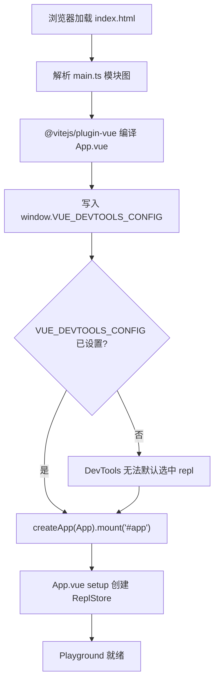
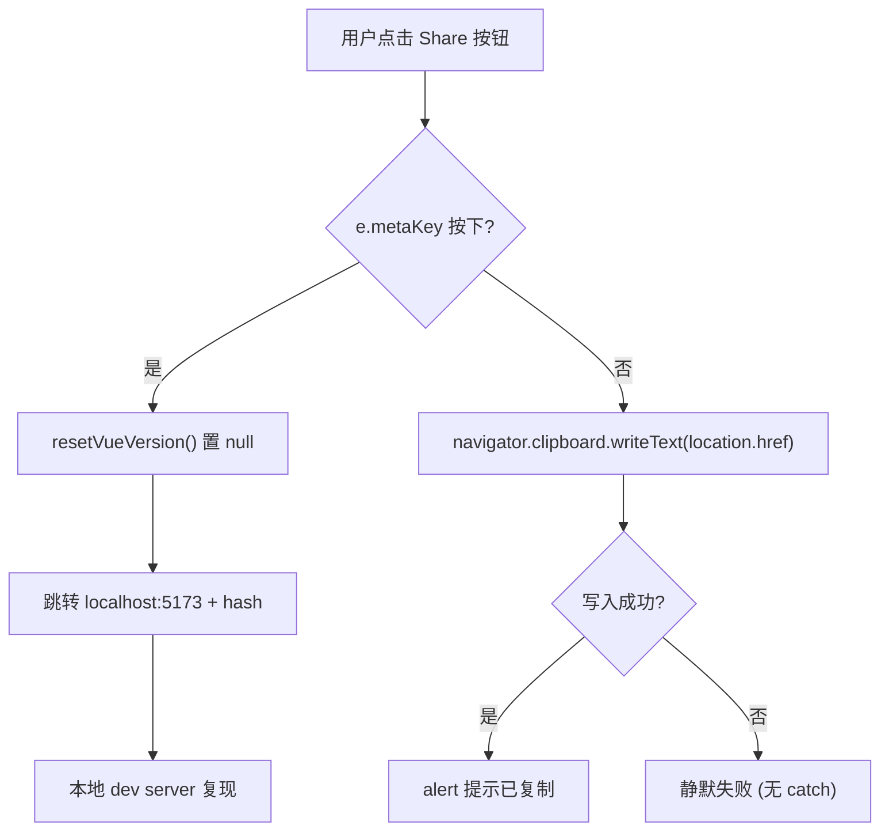
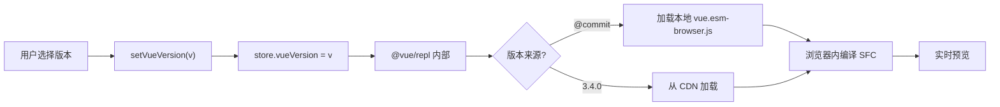

# Kapitel 7: SFC Playground: Echtzeit-Kompilierung und Debugging-Subsystem im Browser

Im vorherigen Kapitel haben wir mit über 20`.test-d.ts`Dateien „Typen als API-Vertrag" in der CI festgenagelt. Aber Typverträge beantworten nur „wie die API-Oberfläche aussieht", sie können nicht beantworten „wie diese SFC tatsächlich kompiliert aussieht" oder „ob die Renderergebnisse im SSR-Modus konsistent sind". Um die letzten beiden Fragen zu beantworten, brauchte das Vue-Team eine Sandbox, die die vollständige Kompilierungspipeline im Browser ausführen kann – das ist`packages-private/sfc-playground`. Es unterscheidet sich grundlegend von den öffentlichen Paketen unter`packages/`:`package.json`in`"private": true`und`"version": "0.0.0"` [FACT:packages-private/sfc-playground/package.json:2-4], was bedeutet, dass es niemals auf npm veröffentlicht wird, sondern nur ein offizielles Debugging-Tool ist. In seinen Abhängigkeiten zeigt`vue`auf`workspace:*` [FACT:packages-private/sfc-playground/package.json:19], also auf lokale Quellcode-Build-Artefakte statt auf die stabile Version auf npm – was den Playground natürlicherweise zu einer „lebenden Demonstration des aktuellen Commits" macht. Dieses Kapitel konzentriert sich auf drei Fragen: Wie initialisiert der Einstiegspunkt, wie steuert der Header Zustandswechsel, und wie werden Build-Zeit-Konstanten injiziert.

# I. Minimalismus des Einstiegspunkts: main.ts und der Initialisierungsvertrag des ReplStore

## Intuitives Modell

`main.ts`hat nur 9 Zeilen, wie ein „Selbsttest-Skript beim Start": Bevor die Vue-Anwendung gemountet wird, wird zuerst in`window`eine globale Konfiguration eingefügt, die Vue DevTools mitteilt, „welche App standardmäßig ausgewählt ist". Ohne diesen Schritt würde DevTools beim Öffnen mit mehreren App-Instanzen konfrontiert (der Playground selbst + der im Benutzer-REPL ausgeführte Code) und könnte nicht automatisch fokussieren, was die Debugging-Erfahrung auf manuelles Umschalten degradieren würde.

## Datenstruktur und globale Seiteneffekte

`main.ts`Der Kern von`createApp`ist nicht`window`sondern das verschmutzende Schreiben in

[FACT:packages-private/sfc-playground/src/main.ts:4-7]

```ts
// @ts-expect-error Custom window property
window.VUE_DEVTOOLS_CONFIG = {
  defaultSelectedAppId: 'repl',
}
```

Hier gibt es zwei bemerkenswerte Engineering-Details:

> **[Design Inference & Architectural Trade-offs]**
> 1. **`@ts-expect-error`statt`@ts-ignore`**：`window`Der Standardtyp`Window & typeof globalThis`hat kein`VUE_DEVTOOLS_CONFIG`Feld. Die Verwendung von`@ts-expect-error`bedeutet „Ich weiß, dass hier ein Fehler auftritt, und ich verlange, dass er auftritt" – falls ein zukünftiges`@types/*`dieses Feld ergänzt,`@ts-expect-error`wird wegen „kein Fehler erzeugt" umgekehrt einen Fehler melden und den Autor daran erinnern, den Kommentar zu entfernen. Dies steht in einer Linie mit dem Ansatz der Typvertragstests aus dem vorherigen Kapitel:**Absichten mit dem Typsystem schützen, statt Probleme zu verbergen**。

> **[Design Inference & Architectural Trade-offs]**
> 2. **`defaultSelectedAppId: 'repl'`Die String-Konvention von**: Diese`'repl'`muss vollständig mit der ID übereinstimmen, die bei der internen App-Erstellung in`@vue/repl`verwendet wird. Es ist ein paketübergreifender Literal-Vertrag, der durch keine Typbeschränkung geschützt wird – sobald`@vue/repl`die ID ändert, wird die Standardauswahl der Playground-DevTools stillschweigend ungültig.

## Step-by-Step: Von HTML zum Mounten

Der Ausführungsfluss ist extrem kurz, aber jeder Schritt hat implizite Einschränkungen:

1. Der Browser lädt`index.html`, das`<div id="app">`enthält (in diesem Material nicht bereitgestellt, aber`mount('#app')`lässt sich rückerschließen).

2. Modulgraph-Auflösung:`main.ts`Das`import App from './App.vue'` [FACT:packages-private/sfc-playground/src/main.ts:2]am Anfang von`@vitejs/plugin-vue`löst die SFC-Kompilierung von

> **[Design Inference & Architectural Trade-offs]**
> 3. **〔Design-Inferenz und Architektur-Abwägung〕**：`window.VUE_DEVTOOLS_CONFIG`Kritische Reihenfolge`createApp(App).mount('#app')` [FACT:packages-private/sfc-playground/src/main.ts:9]muss vor`createApp`geschrieben werden. Denn der DevTools-Hook wird innerhalb von

4. `mount('#app')`registriert, und ein Schreiben der Konfiguration nach dem Mount kann die erste Auswahl nicht mehr beeinflussen.`App.vue`löst das Setup von`ReplStore`aus und erstellt dann`App.vue`(in



## Kopieren

`main.ts`Design-Überlegungen und Fallstricke**Der Minimalismus von`App.vue`ist absichtlich:`ReplStore`**Der Einstiegspunkt übernimmt nur zwei Aufgaben: „globale Seiteneffekt-Injektion + Mounting". Jegliche Geschäftslogik sollte hier nicht auftauchen. Dies ist die Abwägung des Playgrounds als „Debugging-Tool" statt als „Produkt" – es benötigt keine SSR-Kompatibilität, keine mehrfachen Einstiegspunkte, kein Lazy Loading.

> **[Design Inference & Architectural Trade-offs]**
> Produktions-Fallstricke:`window.VUE_DEVTOOLS_CONFIG`ist**Globales Singleton**. Wenn der Playground in eine andere Seite eingebettet wird, die ebenfalls DevTools verwendet (z. B. iframe-Szenario), überschreibt der später Schreibende den früheren. Da der Playground normalerweise eigenständig deployed wird, wird dieses Risiko akzeptiert.

---

# Zwei, Header.vue: computed abgeleiteter Zustand und emit unidirektionaler Datenfluss

## Intuitives Modell

`Header.vue`ist das „Kontrollpanel" des Playgrounds – Versionsauswahl, PROD/DEV-Umschaltung, SSR-Schalter, Theme-Umschaltung, Teilen, Herunterladen. Es selbst**hält keinen Geschäftszustand**, alle Zustände stammen aus`props.store`und booleschen Props, alle Änderungen werden über`emit`an die Elternkomponente gemeldet. Ohne diese Einschränkung „dumme Komponente + Event-Bubbling" würde der Header zu einem Hotspot verstreuter Zustände werden, und die Seiteneffekte von Versionswechsel und SSR-Umschaltung könnten nicht zentral verwaltet werden.

## Datenstruktur- und Feldanalyse

Die Props-Definition des Headers ist der Schlüssel zum Verständnis seiner Verantwortlichkeiten:

[FACT:packages-private/sfc-playground/src/Header.vue:13-19]

```ts
const props = defineProps()
```

Die fünf Props teilen sich in zwei Kategorien auf:

- **`store: ReplStore`**: die einzige Zustandscontainer-Referenz, stammt aus`@vue/repl`. Der Header liest darüber`store.loading`、`store.vueVersion`、`store.typescriptVersion`, und schreibt direkt in`store.vueVersion`。
- **vier boolesche/Literal-Props**：`prod`、`ssr`、`autoSave`、`theme`. Sie sind**kontrollierter Zustand**, der Header liest nur und schreibt nicht, Änderungen müssen`emit`。

die entsprechende emit-Liste[FACT:packages-private/sfc-playground/src/Header.vue:20-28]：

```ts
const emit = defineEmits([
  'toggle-theme',
  'toggle-ssr',
  'toggle-prod',
  'toggle-autosave',
  'reload-page',
])
```

Beachten Sie`toggle-theme`obwohl von`toggleDark()`intern`emit`, aber`toggle-ssr`/`toggle-prod`/`toggle-autosave`ist im Template direkt`$emit`das[FACT:packages-private/sfc-playground/src/Header.vue:102-118]. Diese Mischung ist ein häufiger Vue 3`<script setup>`-Stil:**Bei Bedarf an Seiteneffekten Funktion emit verwenden, bei reiner Weiterleitung Template`$emit`**。

## Step-by-Step: Versionsanzeige und -wechsel

Szenario: Benutzer öffnet den Playground, der Header muss die aktuelle Vue-Version anzeigen.

**Schritt 1: computed abgeleiteter Anzeigetext**

[FACT:packages-private/sfc-playground/src/Header.vue:30-37]

```ts
const vueVersion = computed(() => {
  if (store.loading) {
    return 'loading...'
  }
  return store.vueVersion || `@${__COMMIT__}`
})
```

Hier gibt es drei Prioritätsebenen:`loading`-Zustand →`'loading...'`; Benutzer hat explizit Version gewählt →`store.vueVersion`; andernfalls →`@${__COMMIT__}`(aktueller Commit-Kurzhash).`__COMMIT__`ist eine zur Build-Zeit injizierte Konstante, wird im nächsten Abschnitt detailliert beschrieben.

**Schritt 2: VersionSelect Zwei-Wege-Bindung**

[FACT:packages-private/sfc-playground/src/Header.vue:88-88]

```html

```

Beachten Sie hier**wurde nicht`v-model`**verwendet, sondern explizit aufgeteilt in`:model-value` + `@update:model-value`. Der Grund ist, dass`vueVersion`ein computed ist (schreibgeschützt), nicht direkt zwei-Wege-gebunden werden kann; muss über`setVueVersion`diese Setter-Funktion geschrieben werden`store.vueVersion`：

[FACT:packages-private/sfc-playground/src/Header.vue:39-41]

```ts
async function setVueVersion(v: string) {
  store.vueVersion = v
}

function resetVueVersion() {
  store.vueVersion = null
}
```

> **[Design Inference & Architectural Trade-offs]**
> `setVueVersion`als`async`deklariert, aber intern ohne`await`– ist das historisches Erbe oder Absicht? Vermutlich zur Angleichung an die asynchrone Ladesemantik von`VersionSelect`(Versionswechsel löst Remote-Laden aus), um die Schnittstelle konsistent zu halten.

**Schritt 3: TypeScript-Version im Vergleich**

[FACT:packages-private/sfc-playground/src/Header.vue:76-80]

```html

```

Die TypeScript-Version verwendet`v-model`, weil`store.typescriptVersion`eine beschreibbare normale Eigenschaft ist, kein computed-Wrapping benötigt.**Dieselbe Komponente verwendet zwei Bindungsarten im selben Template**, was genau die intuitive Verkörperung von „kontrolliert vs. unkontrolliert" ist.

## Theme-Umschaltung: Kombination von Seiteneffekt und emit

[FACT:packages-private/sfc-playground/src/Header.vue:58-66]

```ts
function toggleDark() {
  const cls = document.documentElement.classList
  cls.toggle('dark')
  localStorage.setItem(
    'vue-sfc-playground-prefer-dark',
    String(cls.contains('dark')),
  )
  emit('toggle-theme', cls.contains('dark'))
}
```

Diese Funktion macht drei Dinge: DOM-Klasse manipulieren, in localStorage persistieren, emit zur Benachrichtigung der Elternkomponente.**Beachten Sie, dass sie nicht direkt`props.theme`**ändert – weil Props schreibgeschützt sind, die Elternkomponente erst nach Erhalt von`toggle-theme`aktualisiert`theme`, was wiederum den`:title`-Text im Template steuert[FACT:packages-private/sfc-playground/src/Header.vue:123]。

> **[Design Inference & Architectural Trade-offs]**
> Hier gibt es ein subtiles Design:**DOM-Klassen-Manipulation und Vue-reaktiver Zustand sind zwei unabhängige Pfade**。`document.documentElement.classList.toggle('dark')`ändert direkt das DOM, während`theme`prop über Vue aktualisiert wird. Wenn beide nicht synchron sind (z. B. Elternkomponente lehnt Aktualisierung ab), zeigt die UI eine Inkonsistenz „Klasse bereits umgeschaltet, aber title-Text unverändert". In der Praxis akzeptiert die Elternkomponente immer das emit, daher tritt das Problem nicht auf.

## Versteckte Logik: metaKey-Zweig von copyLink

[FACT:packages-private/sfc-playground/src/Header.vue:47-56]

```ts
async function copyLink(e: MouseEvent) {
  if (e.metaKey) {
    resetVueVersion()
    // hidden logic for going to local debug from play.vuejs.org
    window.location.href = 'http://localhost:5173/' + window.location.hash
    return
  }
  await navigator.clipboard.writeText(location.href)
  alert('Sharable URL has been copied to clipboard.')
}
```

Dies ist eine**Entwickler-Hintertür**: Auf`play.vuejs.org`Cmd gedrückt halten und auf den Teilen-Button klicken, springt zu`localhost:5173`(lokaler Dev-Server) und nimmt den aktuellen URL-Hash mit. Der Hash kodiert den vollständigen REPL-Zustand (Quellcode, Version, Optionen), sodass lokales Debugging Online-Probleme reproduzieren kann. Der Kommentar`// hidden logic for going to local debug from play.vuejs.org` [FACT:packages-private/sfc-playground/src/Header.vue:47-56]kennzeichnet explizit, dass dies eine absichtlich versteckte Funktion ist.

> **[Design Inference & Architectural Trade-offs]**
> `resetVueVersion()`wird vor dem Sprung aufgerufen, setzt`store.vueVersion`auf`null`, um sicherzustellen, dass lokales Debugging den aktuellen Commit verwendet statt der online ausgewählten Version.



## Design-Überlegungen und Fallstricke

> **[Design Inference & Architectural Trade-offs]**
> **Fallstrick 1:`navigator.clipboard`Berechtigungen und Sicherheitskontext**。`copyLink`hat kein try/catch[FACT:packages-private/sfc-playground/src/Header.vue:47-56]. Bei Nicht-HTTPS oder wenn der Benutzer die Zwischenablage-Berechtigung verweigert,`writeText`wird rejecten, was zu einer unbehandelten Promise-Rejection führt. Der Playground wird über HTTPS deployed, das Risiko wird akzeptiert, aber dies ist eine typische „Produktionsumgebungs-Falle".

> **[Design Inference & Architectural Trade-offs]**
> **Fallstrick 2:`toggleDark`hartkodierter localStorage-Key**。`'vue-sfc-playground-prefer-dark'`ist ein String-Literal, keine Konstantenextraktion. Wenn der Key in Zukunft geändert werden soll, ist eine globale Suche erforderlich.

**Fallstrick 3:`currentCommit`und`vueVersion`Vergleich**. Im Template`:class="{ active: vueVersion === \`@${currentCommit}\` }"` [FACT:packages-private/sfc-playground/src/Header.vue:88-88]Durch String-Verkettung vergleichen. Wenn`__COMMIT__`die Injektion fehlschlägt (wird zu`undefined`), wird hier daraus`'@undefined'`, was niemals übereinstimmt. Die Zuverlässigkeit der Build-Zeit-Konstanten-Injektion bestimmt direkt die UI-Korrektheit – genau das ist das Thema des nächsten Abschnitts.

---

# Drei, Build-Zeit-Konstanten-Injektion: Die doppelte Verantwortung von __COMMIT__ und copyVuePlugin

## Intuitives Modell

`vite.config.ts`ist die „Montagehalle“ des Playgrounds: Es führt zur Build-Zeit`git rev-parse`aus, um den Commit-Hash zu erhalten, und macht ihn über`define`zu einer globalen Konstante`__COMMIT__`; gleichzeitig kopiert es über ein benutzerdefiniertes Plugin die ESM-Browser-Artefakte unter`packages/vue/dist/`in das Ausgabeverzeichnis des Playgrounds. Ohne diesen Schritt könnte der Playground die „Vue-Laufzeit des aktuellen Commits“ nicht im Browser laden – er wäre auf die stabile Version von npm angewiesen und würde die Bedeutung einer „Live-Demo“ verlieren.

## Datenstruktur und Build-Zeit-Konstanten

[FACT:packages-private/sfc-playground/vite.config.ts:7-9]

```ts
const commit = spawnSync('git', ['rev-parse', '--short=7', 'HEAD'])
  .stdout.toString()
  .trim()
```

`spawnSync`führt den git-Befehl synchron aus,`--short=7`nimmt den 7-stelligen Kurz-Hash. Die synchrone Ausführung ist absichtlich so gewählt:**Die Konfigurationsdatei benötigt den Wert von`commit`bereits während des Modulladens**, asynchron würde die Reihenfolge der Vite-Konfigurationsauflösung durcheinanderbringen.

[FACT:packages-private/sfc-playground/vite.config.ts:23-26]

```ts
define: {
  __COMMIT__: JSON.stringify(commit),
  __VUE_PROD_DEVTOOLS__: JSON.stringify(true),
},
```

`define`ist Vites**Textersetzungs**mechanismus: Alle`__COMMIT__`im Quellcode werden durch das Ergebnis von`JSON.stringify(commit)`ersetzt (also durch ein Zeichenkettenliteral mit Anführungszeichen).`JSON.stringify`ist erforderlich – wenn man direkt`commit`schreiben würde, würde es nach der Ersetzung zu einem nackten Bezeichner`abc1234`werden und als Variablenname statt als Zeichenkette behandelt.

> **[Design Inference & Architectural Trade-offs]**
> `__VUE_PROD_DEVTOOLS__: true`ist eine weitere Schlüsselkonstante: Sie lässt Vues**Produktions-Build**ebenfalls DevTools-Unterstützung behalten. Standardmäßig entfernt der Produktions-Build den DevTools-Hook, um die Größe zu reduzieren, aber der Playground muss Benutzercode debuggen können, daher wird er zwangsweise aktiviert.

## Step-by-Step: Das Artefakt-Verschieben von copyVuePlugin

[FACT:packages-private/sfc-playground/vite.config.ts:32-63]

```ts
function copyVuePlugin(): Plugin {
  return {
    name: 'copy-vue',
    generateBundle() {
      const copyFile = (file: string) => {
        const filePath = path.resolve(
          import.meta.dirname,
          '../../packages',
          file,
        )
        const basename = path.basename(file)
        if (!fs.existsSync(filePath)) {
          throw new Error(
            `${basename} not built. ` +
              `Run "nr build vue -f esm-browser" first.`,
          )
        }
        this.emitFile({
          type: 'asset',
          fileName: basename,
          source: fs.readFileSync(filePath, 'utf-8'),
        })
      }

      copyFile(`vue/dist/vue.esm-browser.js`)
      copyFile(`vue/dist/vue.esm-browser.prod.js`)
      copyFile(`vue/dist/vue.runtime.esm-browser.js`)
      copyFile(`vue/dist/vue.runtime.esm-browser.prod.js`)
      copyFile(`server-renderer/dist/server-renderer.esm-browser.js`)
    },
  }
}
```

Die Kernpunkte einzeln analysiert:

1. **`generateBundle`Hook**: Wird ausgeführt, nachdem Rollup das Bundle erzeugt hat, aber bevor es auf die Festplatte geschrieben wird. Zu diesem Zeitpunkt kann man`emitFile`zusätzliche Dateien in die Artefakte einfügen.

2. **`import.meta.dirname`**: Die von Node 20.11+ bereitgestellte ESM-Version von`__dirname`. Der Pfad`../../packages`geht von`packages-private/sfc-playground/`zum Repository-Stamm hinauf und dann in`packages/`。

3. **Existenzprüfung + explizite Fehlermeldung**: Wenn`vue.esm-browser.js`nicht existiert, wird ein Fehler mit Reparaturanweisung geworfen`Run "nr build vue -f esm-browser" first.`. Dies ist**ein Musterbeispiel für Developer Experience**– die Fehlermeldung sagt einem direkt, wie man es repariert.

4. **Fünf Artefakte**：`vue`in Vollversion/Runtime-Version × dev/prod, plus`server-renderer`. Diese fünf Dateien sind genau die Kandidatenmenge, die der Playground im Browser dynamisch importiert, entsprechend dem Versionswechsel und dem SSR-Schalter im Header.

> **[Design Inference & Architectural Trade-offs]**
> **Warum genau diese fünf?**Die Vollversion (mit Compiler) wird für das „Runtime-Compile“-Szenario verwendet; die Runtime-Version für das „Precompile“-Szenario; dev/prod entspricht dem PROD/DEV-Schalter im Header; server-renderer entspricht dem SSR-Schalter. Diese fünf Dateien bilden die „Vue-Laufzeitmatrix“ des Playgrounds.

## Der vollständige Datenfluss des Versionswechsels

Betrachtet man den`setVueVersion`im Header zusammen mit den Artefakten von copyVuePlugin:



Beachtet den speziellen Wert`@${__COMMIT__}`: Er entspricht den lokalen Artefakten, die copyVuePlugin kopiert hat, nicht dem CDN. Deshalb muss der Playground die Browser-Build-Artefakte von Vue hineinkopieren –**die Option „This Commit“ benötigt lokale Dateien**。

## Design-Überlegungen und Stolperfallen

> **[Design Inference & Architectural Trade-offs]**
> **Stolperfalle 1:`spawnSync`Fehlerbehandlung**. Wenn das aktuelle Verzeichnis kein git-Repository ist (z. B. entpackt aus einem Tarball), gibt`spawnSync`einen Exit-Code ungleich null zurück,`stdout`ist leer,`commit`wird zu einer leeren Zeichenkette. Dann wird`__COMMIT__`durch`""`ersetzt, und im Header wird`@${currentCommit}`zu`'@'`. Es gibt keine explizite Fehlerbehandlung.

> **[Design Inference & Architectural Trade-offs]**
> **Stolperfalle 2:`optimizeDeps.exclude: ['@vue/repl']`** [FACT:packages-private/sfc-playground/vite.config.ts:27-29]. Vite bündelt Abhängigkeiten standardmäßig vor, um den Kaltstart zu beschleunigen, aber`@vue/repl`wird ausgeschlossen. Der Grund ist, dass`@vue/repl`intern dynamische Imports und Worker verwendet, und das Vorab-Bündeln diese Mechanismen zerstören würde. Dies ist ein häufiges Problem im Vite-Ökosystem: „Konflikt zwischen Vorab-Bündelung und dynamischem Laden“.

> **[Design Inference & Architectural Trade-offs]**
> **Stolperfalle 3:`script.fs`Konfiguration** [FACT:packages-private/sfc-playground/vite.config.ts:13-19]。`@vitejs/plugin-vue`Die Option`script.fs`erlaubt es dem`<script>`-Block einer SFC, Dateien über`fs`zu lesen. Hier werden`fs.existsSync`und`fs.readFileSync`übergeben, um die Auflösung von`import`-Anweisungen in SFCs zu unterstützen (zum Beispiel muss`import x from './foo'`prüfen, ob eine Datei existiert).**Dies ist der Schlüssel dafür, dass der Playground im Browser eine vollständige Modulauflösung simulieren kann**– er injiziert die fs-Fähigkeiten von Node in die Auflösungsphase des Compilers.

---

# Design-Überlegung: Die Architektur-Abwägungen des Playgrounds

Betrachtet man die drei Unterabschnitte zusammen, folgt die Architektur des Playgrounds einem klaren Prinzip:**Trennung von „Zustand“ und „Nebenwirkungen“, Trennung von „Build-Zeit“ und „Laufzeit“**。

- `main.ts`führt nur globale Nebenwirkungs-Injektion durch und berührt keinen Business-Zustand.
- `Header.vue`ist eine reine Präsentationskomponente, der Zustand fließt über Props hinein und über emit hinaus.
- `vite.config.ts`verfestigt die Build-Zeit-Information „aktueller Commit“ zu einer Konstante, die zur Laufzeit nur gelesen wird.

> **[Design Inference & Architectural Trade-offs]**
> Diese Trennung bringt einen direkten Vorteil:**Der Playground kann in jede Vue-Anwendung eingebettet werden**(zum Beispiel als eingebettetes Beispiel in einer Dokumentationsseite), solange man`store`und die vier booleschen Props bereitstellt.

Der Preis ist**Zustandsverteilung**：`store`In`@vue/repl`ist der boolesche Zustand in der Elternkomponente, die DOM-Klasse auf`document.documentElement`, und in localStorage liegt noch eine weitere Kopie. Vier Zustandsorte müssen manuell synchronisiert werden; jede Nichtsynchronisation führt zu UI-Inkonsistenz.

> **[Design Inference & Architectural Trade-offs]**
> Eine weitere Abwägung ist**Verzicht auf SSR-Kompatibilität**。`main.ts`direkter Zugriff auf`window`，`Header.vue`die`toggleDark`direkter Zugriff auf`document`. Playground ist eine reine CSR-Anwendung, serverseitiges Rendering muss nicht berücksichtigt werden.

---

# Kapitelzusammenfassung

Dieses Kapitel analysiert`packages-private/sfc-playground`die drei Kerndateien:

1. **`main.ts`**: 9-zeiliger Einstiegspunkt, der Kern ist`window.VUE_DEVTOOLS_CONFIG`die Injektionsreihenfolge – muss vor`mount`erfolgen.

2. **`Header.vue`**: durch`computed`ableiten`vueVersion`, durch`emit`alle Zustandsänderungen melden.`copyLink`die`metaKey`Der Zweig ist eine versteckte lokale Debug-Hintertür.

3. **`vite.config.ts`**：`spawnSync`Commit-Hash holen,`define`injizieren`__COMMIT__`，`copyVuePlugin`die fünf Vue-Browser-Artefakte in das Playground-Artefaktverzeichnis kopieren.

Der rote Faden durch alle drei ist**die Grenze zwischen Build-Zeit-Konstanten und Laufzeit-Zustand**：`__COMMIT__`ist eine schreibgeschützte Build-Zeit-Tatsache,`store.vueVersion`ist eine veränderbare Laufzeit-Auswahl, das`vueVersion`computed im Header vereinheitlicht beides zu einem Anzeige-String.

# Kapitelreflexion und Selbsttest

Q1: Wenn man`main.ts`in`window.VUE_DEVTOOLS_CONFIG`die Zuweisung von`createApp(App).mount('#app')`nach

**verschiebt, was passiert? Warum?**：`window.VUE_DEVTOOLS_CONFIG`Referenzanalyse`createApp`ist die Konfiguration, die Vue DevTools beim Registrieren des Hooks in[FACT:packages-private/sfc-playground/src/main.ts:4-9]。`createApp`liest.`__VUE_DEVTOOLS_GLOBAL_HOOK__`registriert sofort`defaultSelectedAppId`, zu diesem Zeitpunkt liest DevTools`mount`um zu entscheiden, welche App standardmäßig ausgewählt wird. Wenn die Zuweisung später als`repl`erfolgt, hat DevTools die erste App-Auswahl bereits abgeschlossen, die Konfiguration wird nicht wirksam, und der Benutzer muss in DevTools manuell zur`@vue/repl`App wechseln. Noch subtiler: Da

Q2: `Header.vue`intern ebenfalls eine App erstellt, kann eine späte Zuweisung dazu führen, dass DevTools standardmäßig Playground selbst statt der Benutzer-REPL auswählt; beim Debuggen von Benutzercode ist manuelles Umschalten erforderlich. Dies zeigt die Bedeutung der „Reihenfolge globaler Seiteneffekt-Injektion" in Debug-Tools.`toggleDark()`Das`props.theme`in`toggle-theme`bearbeitet gleichzeitig DOM-Klasse, localStorage und emit, ändert aber nicht direkt`theme`. Wenn die Elternkomponente nach Erhalt des

**Ereignisses die Aktualisierung der**：`toggleDark()`Prop ablehnt, welche UI-Inkonsistenz tritt auf? Wie lässt sich dies auf Quellcodeebene lokalisieren?[FACT:packages-private/sfc-playground/src/Header.vue:58-66]Referenzanalyse`document.documentElement.classList.toggle('dark')`ruft in`dark`direkt[FACT:packages-private/sfc-playground/src/Header.vue:186-186]auf, was sofort die`.dark nav`Klasse im DOM ändert und den CSS-Variablenwechsel auslöst (siehe`:title`die[FACT:packages-private/sfc-playground/src/Header.vue:123]Regel). Aber der`props.theme`Text`<html>`im Template hängt von

Q3: `copyVuePlugin`ab; wenn die Elternkomponente nicht aktualisiert, bleibt der title beim alten Wert. Lokalisierungsmethode: In den Browser-DevTools prüfen, ob die Klasse von`generateBundle`und das title-Attribut des Buttons im Widerspruch stehen. Die Grundursache ist, dass „DOM-Seiteneffekt" und „Vue-reaktiver Zustand" zwei unabhängige Pfade nehmen, ohne eine einzige Datenquelle.`fs.existsSync`In`fs.readFileSync`wird für jede Datei eine

**Prüfung durchgeführt, bei Fehlen wird ein Fehler mit Reparaturanweisung geworfen. Wenn man diese Prüfung entfernt und direkt**aufruft, was passiert in einer CI-Umgebung (ohne vorherigen vue-Build)? Wie würde die Fehlermeldung Entwickler irreführen?`fs.readFileSync`Referenzanalyse`ENOENT: no such file or directory, open '.../packages/vue/dist/vue.esm-browser.js'` [FACT:packages-private/sfc-playground/vite.config.ts:32-63]: Nach Entfernen der Prüfung wirft`nr build vue -f esm-browser`einen`throw new Error(\`${basename} not built. Run "nr build vue -f esm-browser" first.\`)`. Dieser Fehler teilt dem Entwickler nur mit, dass „die Datei nicht existiert", aber nicht, dass „zuerst

---

ausgeführt werden muss". In einer CI-Umgebung könnte der Entwickler fälschlicherweise auf einen Pfadkonfigurationsfehler, Berechtigungsproblem oder nicht initialisiertes Git-Submodul schließen und viel Zeit mit der Fehlersuche verschwenden. Das`packages-private/template-explorer`im Originalcode bindet „Symptom" und „Reparaturaktion" aneinander, ein entscheidendes Detail im Developer-Experience-Design. Dies erklärt auch, warum das Build-Skript von Playground eine klare Abhängigkeitsreihenfolge zum Vue-Kern-Build-Skript haben muss.

Das nächste Kapitel geht in`@vue/compiler-dom`und zeigt, wie Vue die Zwischenprodukte des Compilers (AST, Transformationsergebnisse, Codegenerierung) visualisiert, sodass Entwickler jeden Schritt der Transformation vom Template zur Renderfunktion schrittweise beobachten können. Anders als die „End-to-End-Blackbox" von Playground ist Template Explorer eine „Whitebox-Sonde".`@vue/compiler-ssr`Damit haben wir gesehen, wie SFC Playground die Kompilierungspipeline in den Browser bringt: Einstiegsinitialisierung, Header-Zustandswechsel und Build-Zeit-Konstanten-Injektion bilden gemeinsam eine in Echtzeit debugbare Sandbox. Doch die Perspektive von Playground ist stets „Kompilierung und Ausführung eines ganzen SFC", sie beantwortet nicht direkt „was der Compiler mit einem bestimmten Template-Ausdruck tatsächlich macht". Das nächste Kapitel betritt Template Explorer und zeigt, wie er
