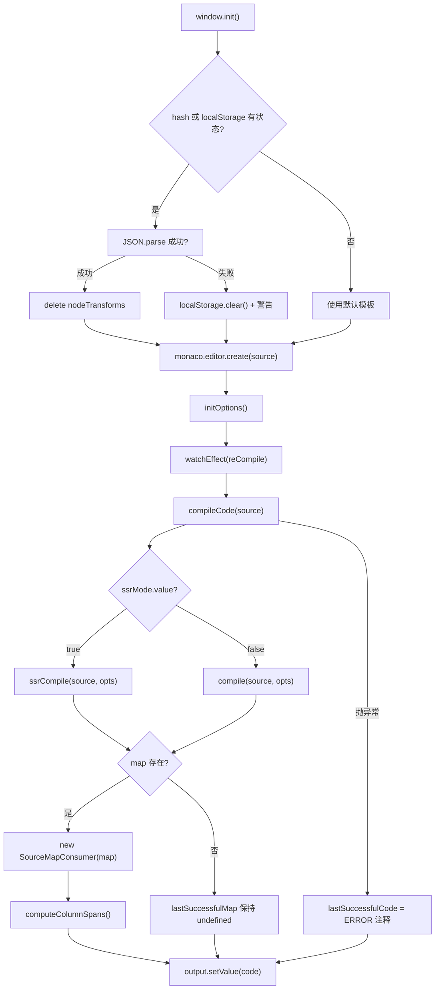
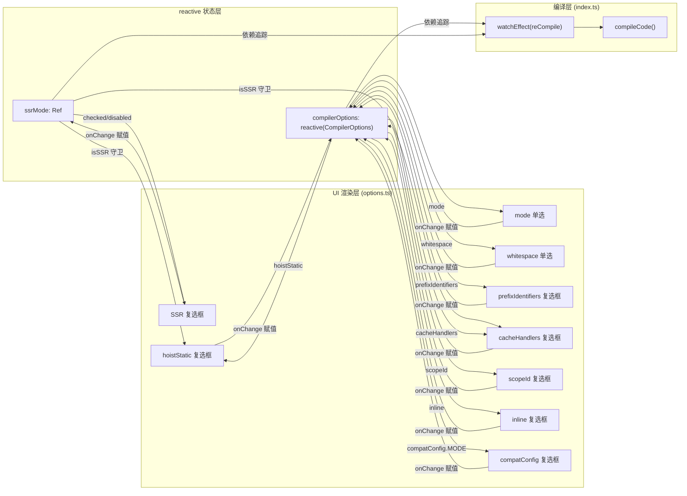

# Zurück nach oben ↑

Im vorherigen Kapitel haben wir gesehen, wie der SFC Playground die gesamte Kette von „SFC-Eingabe → Kompilierung im Browser → Echtzeit-Vorschau“ als Blackbox kapselt: Entwickler sehen das endgültige Rendering-Ergebnis, aber nicht, was der Compiler dazwischen tut. Wenn im Template eine benutzerdefinierte Direktive steht oder nach dem Aktivieren von hoistStatic plötzlich eine Reihe von _hoisted_1-Variablen im Output auftaucht, kann der Playground nicht beantworten, „warum der Compiler das so generiert“. Der Template Explorer ist genau gegensätzlich positioniert: Er legt die Kompilierungsartefakte von @vue/compiler-dom und @vue/compiler-ssr, den AST, Fehlermarkierungen sowie die Positionszuordnung von Quellcode zu Artefakt vollständig offen. Sein Kern ist nicht „Ausführen“, sondern „Beobachten“. Dieses Kapitel dreht sich um drei Dateien: index.ts übernimmt den Compiler-Aufruf und die bidirektionale SourceMap-Zuordnung, options.ts verwaltet mit reactive Dutzende von CompilerOptions und treibt die UI an, theme.ts passt das Monaco-Editor-Theme an.

# 一、Compiler-Aufruf und bidirektionale SourceMap-Zuordnung: index.ts

## Intuitives Modell

Der Template Explorer ist`index.ts`wie eine „bidirektionale Übersetzungsmaschine“: Links wird das Template eingegeben, rechts wird die Render-Funktion ausgegeben. Aber sie kann mehr als eine Übersetzungsmaschine – wenn du den Cursor auf eine Zeile links setzt, wird rechts das entsprechende Artefakt hervorgehoben; umgekehrt wird, wenn du den Cursor rechts platzierst, links das entsprechende Template hervorgehoben. Ohne SourceMap-Zuordnung würde dieses Tool zu zwei nebeneinanderliegenden Textfeldern degenerieren, und Entwickler könnten nur mit bloßem Auge vergleichen und keine Kausalkette von „Template-Zeile X → Artefakt-Zeile Y“ herstellen.

## Datenstruktur und Speicherlayout

`index.ts`Enthält keine komplexen Structs, aber einige entscheidende Zustandsvariablen auf Modulebene, die das Verhalten des gesamten Tools bestimmen:

`lastSuccessfulCode`und`lastSuccessfulMap`sind der Cache des Kompilierungsergebnisses[FACT:packages-private/template-explorer/src/index.ts:74-75]. Ersteres ist ein String, letzteres ist`SourceMapConsumer | undefined`. Beachte:`lastSuccessfulMap`ist initial`undefined`, und wird nur zugewiesen, wenn die Kompilierung erfolgreich war und`map`existiert[FACT:packages-private/template-explorer/src/index.ts:99-100]. Dieser`undefined`-Zustand ist die Guard-Bedingung für die gesamte spätere Cursor-Zuordnungslogik – wenn die Kompilierung fehlschlägt, wird die Zuordnungsfunktion automatisch still deaktiviert, statt eine Exception zu werfen.

`PersistedState`Das Interface definiert die Form des in localStorage und URL-Hash persistierten Zustands[FACT:packages-private/template-explorer/src/index.ts:26-30]：`src`(Template-Quellcode),`ssr`(ob SSR-Modus),`options`(Compiler-Optionen). Hier gibt es ein entscheidendes Design:`options`hat den Typ des vollständigen`CompilerOptions`, aber bei der tatsächlichen Persistierung werden nur „von den Standardwerten abweichende Einträge“ gespeichert; diese Trim-Logik wird in`reCompile`erledigt.

`sharedEditorOptions`Sind die von beiden Editoren gemeinsam genutzten Konstruktionsoptionen[FACT:packages-private/template-explorer/src/index.ts:26-30]：`fontSize: 14`、`scrollBeyondLastLine: false`、`renderWhitespace: 'selection'`、`minimap.enabled: false`. Die Minimap ist deaktiviert, weil Template und Artefakt normalerweise nur ein paar Dutzend Zeilen haben und die Minimap eher horizontalen Platz belegt.

## Step-by-Step Walkthrough

**Szenario: Der Benutzer öffnet die Seite, gibt`
{{ msg }}
`ein und bewegt dann den Cursor.**

**Erster Schritt: Initialisierung und Zustandswiederherstellung.** `window.init`Ist der globale Einstiegspunkt[FACT:packages-private/template-explorer/src/index.ts:41]. Er registriert und aktiviert zuerst das benutzerdefinierte Theme[FACT:packages-private/template-explorer/src/index.ts:44-45], und versucht dann, den Zustand aus dem URL-Hash oder localStorage wiederherzustellen[FACT:packages-private/template-explorer/src/index.ts:49-56]. Beachte hier die Dekodierungsreihenfolge: zuerst`atob`, dann`escape`, dann`decodeURIComponent`. Wenn das Hash-Parsing fehlschlägt, wird auf`localStorage.getItem('state')`zurückgefallen, dann auf`{}`. Wenn das gesamte JSON.parse fehlschlägt, wird localStorage geleert und eine Warnung ausgegeben[FACT:packages-private/template-explorer/src/index.ts:57-64]。

Nach der Zustandswiederherstellung gibt es ein leicht zu übersehendes Detail:`delete persistedState.options?.nodeTransforms` [FACT:packages-private/template-explorer/src/index.ts:69]. Der Kommentar erklärt den Grund – Funktionen können nicht serialisiert werden, daher geht beim Persistieren`nodeTransforms`verloren; wenn bei der Wiederherstellung ein leeres Objekt zurückbleibt, führt das zu anormalem Compiler-Verhalten. Dies ist die klassische Falle beim „Persistieren nicht serialisierbarer Felder“.

**Zweiter Schritt: Kompilierungskern`compileCode`。**Dies ist das Herz des gesamten Tools[FACT:packages-private/template-explorer/src/index.ts:76-106]. Er macht zuerst`console.clear()`, wählt dann abhängig von`ssrMode.value``ssrCompile`oder`compile` [FACT:packages-private/template-explorer/src/index.ts:80]. Beachte die Aufrufparameter von`compileFn`: Spread von`compilerOptions`, erzwungen`filename: 'ExampleTemplate.vue'`、`sourceMap: true`, und Injektion des`onError`-Callbacks zum Sammeln von Fehlern[FACT:packages-private/template-explorer/src/index.ts:82-89]。

Hier gibt es eine Designentscheidung:`filename`ist hartcodiert auf`'ExampleTemplate.vue'`. Dieser Wert muss in den späteren`generatedPositionFor`-Aufrufen exakt übereinstimmen mit[FACT:packages-private/template-explorer/src/index.ts:189], sonst liefert die SourceMap-Abfrage ein leeres Ergebnis. Dies ist ein impliziter Vertrag – die beiden Strings müssen übereinstimmen, aber kein Typsystem garantiert das.

Nach Abschluss der Kompilierung werden Fehler in das Marker-Format von Monaco umgewandelt und im Editor gesetzt[FACT:packages-private/template-explorer/src/index.ts:91-95]。`formatError`wandelt`CompilerError`von`loc`in Monacos`startLineNumber/startColumn/endLineNumber/endColumn` [FACT:packages-private/template-explorer/src/index.ts:108-119]um. Beachte`errors.filter(e => e.loc)`– nur Fehler mit Positionsinformationen werden markiert; Fehler ohne`loc`(wie globale Konfigurationsfehler) werden nur in der Konsole ausgegeben.

**Dritter Schritt: Aufbau der SourceMap.**Nach erfolgreicher Kompilierung,`lastSuccessfulMap = new SourceMapConsumer(map!)` [FACT:packages-private/template-explorer/src/index.ts:99], und unmittelbar danach wird`computeColumnSpans()` [FACT:packages-private/template-explorer/src/index.ts:100]。`computeColumnSpans`aufgerufen. Ist eine entscheidende API von`source-map-js`: Sie berechnet die Spaltenbreite jedes Mapping-Segments vorab, sodass`generatedPositionFor`das`lastColumn`-Feld zurückgibt, das verwendbar ist. Ohne diesen Schritt kann die Rückwärtszuordnung nur die Startspalte lokalisieren und nicht den gesamten Token-Bereich hervorheben.

**Vierter Schritt: Bidirektionale Cursor-Zuordnung.**Wenn der Benutzer im**Quellcode-Editor**den Cursor bewegt, wird`editor.onDidChangeCursorPosition` [FACT:packages-private/template-explorer/src/index.ts:184]ausgelöst. Der Callback ruft nach 100 ms Debounce`lastSuccessfulMap.generatedPositionFor({ source: 'ExampleTemplate.vue', line, column: column - 1 })` [FACT:packages-private/template-explorer/src/index.ts:188-192]auf. Beachte`column - 1`: Monacos Spaltennummern beginnen bei 1, während die Spaltennummern der SourceMap bei 0 beginnen. Das zurückgegebene`pos`, falls es`line`und`column`hat, erzeugt im Ausgabe-Editor einen Decorator, der den entsprechenden Bereich hervorhebt[FACT:packages-private/template-explorer/src/index.ts:194-206], und scrollt zu dieser Position[FACT:packages-private/template-explorer/src/index.ts:207-210]。

Die Rückwärtszuordnung erfolgt in`output.onDidChangeCursorPosition`[FACT:packages-private/template-explorer/src/index.ts:223]. Sie ruft`originalPositionFor` [FACT:packages-private/template-explorer/src/index.ts:227-230]auf, hat aber eine zusätzliche Guard: Ignoriert`pos.line === 1 && pos.column === 0`„mock location“[FACT:packages-private/template-explorer/src/index.ts:231-237]. Dieser Guard ist entscheidend – bestimmter vom Compiler generierter Code (wie`import`Anweisungen oder Helper-Funktionen) hat keine entsprechende Template-Position, und SourceMap gibt`{ line: 1, column: 0 }`als Platzhalter zurück. Wenn dies nicht ignoriert wird, führt ein Cursor auf diesen Zeilen fälschlicherweise dazu, dass die erste Zeile des Templates hervorgehoben wird.

**Fünfter Schritt: Zustandspersistenz.** `reCompile`löst nicht nur die Kompilierung aus, sondern ist auch dafür verantwortlich, den aktuellen Zustand in localStorage und URL-Hash zu schreiben[FACT:packages-private/template-explorer/src/index.ts:121-146]. Bei der Persistenz gibt es eine Trim-Logik: Durchlaufen von`compilerOptions`, wobei nur Einträge gespeichert werden, die „kein Objekt sind und nicht dem Standardwert entsprechen“[FACT:packages-private/template-explorer/src/index.ts:125-133]. Das erklärt, warum`bindingMetadata`Optionen dieses Objekttyps nicht persistiert werden – es ist zu komplex, und der Standardwert reicht bereits zur Demonstration aus.

## Designüberlegungen und Stolperfallen im Produktivbetrieb

**Warum`source-map-js`statt`source-map`？** `source-map`ist die Originalbibliothek von Mozilla, groß und abhängig von WASM (in der neuen Version).`source-map-js`ist eine reine JS-Implementierung, klein und für Browser-Umgebungen geeignet. Da Template Explorer ein reines Frontend-Tool ist, ist die Wahl von`source-map-js`sinnvoll[FACT:packages-private/template-explorer/package.json:15]。

**Wahl der debounce-Verzögerung.**Der Standard-debounce des Quellcode-Editors beträgt 300 ms[FACT:packages-private/template-explorer/src/index.ts:271], während der debounce für Cursorbewegungen 100 ms beträgt[FACT:packages-private/template-explorer/src/index.ts:215]. Dieser Unterschied ist beabsichtigt: Kompilierung ist eine schwere Operation, 300 ms vermeiden häufige Auslösungen; Cursorbewegung ist eine leichte Operation, 100 ms gewährleisten Reaktionsfähigkeit. Aber 100 ms können bei schneller Cursorbewegung immer noch zu Flackern der Hervorhebung führen – ein akzeptabler Kompromiss.

**`window.init`Globales Mounting von**Beachten Sie, dass`window.init`und`window.monaco`beide global an[FACT:packages-private/template-explorer/src/index.ts:19-23]gehängt werden. Der Grund ist, dass der Monaco-Editor über das CDN`loader.js`asynchron geladen wird und nach Abschluss des Ladens`window.init`aufruft. Dieses „globale Callback“-Muster ist die Standardverwendung von Monaco in einer nicht-modularen Umgebung, passt aber schlecht zu modernen ESM-Build-Ansätzen.

---

# Zwei: reactive-gesteuertes Optionspanel: options.ts

## Intuitives Modell

`options.ts`Es ist wie ein „Konsolenpanel“: Oben gibt es ein Dutzend Schalter und Radiobuttons, von denen jeder einem Verhalten des Compilers entspricht. Wird ein beliebiger Schalter umgelegt, ändert sich das Kompilierungsergebnis rechts sofort. Ohne dieses Modul könnten Entwickler nur die`compile`Aufrufparameter im Quellcode ändern und neu kompilieren, ohne die Wirkung verschiedener Optionen in Echtzeit vergleichen zu können.

## Datenstruktur und Speicherlayout

`options.ts`Der Kern von

`ssrMode`sind drei Exporte:`ref(false)` [FACT:packages-private/template-explorer/src/options.ts:5]ist ein`compilerOptions`. Es ist unabhängig von`compile` vs `ssrCompile`, weil der SSR-Modus die Kompilierungsfunktion selbst umschaltet (

`defaultOptions`), nicht die Kompilierungsoptionen.`CompilerOptions`ist ein vollständiges[FACT:packages-private/template-explorer/src/options.ts:5-27]Objekt`mode: 'module'`、`prefixIdentifiers: false`、`hoistStatic: false`、`cacheHandlers: false`、`scopeId: null`、`inline: false`、`ssrCssVars: '{ color }'`、`compatConfig: { MODE: 3 }`、`whitespace: 'condense'`. Es definiert die Standardwerte aller Optionen, einschließlich`bindingMetadata` [FACT:packages-private/template-explorer/src/options.ts:18-26]。

`compilerOptions`, sowie eines`reactive(Object.assign({}, defaultOptions))` [FACT:packages-private/template-explorer/src/options.ts:29-31]mit 7 Bindungstypen.`Object.assign({}, ...)`ist`reactive(defaultOptions)`. Beachten Sie, dass hier`compilerOptions`für eine flache Kopie verwendet wird – bei direktem`defaultOptions`würde eine Änderung von`reCompile`den Wert von

## Step-by-Step Walkthrough

**verunreinigen und die Logik „Vergleich mit Standardwert“ in**

**ungültig machen.** `App`Szenario: Der Benutzer klickt auf das Kontrollkästchen „hoistStatic“.`setup`Erster Schritt: UI-Rendering.[FACT:packages-private/template-explorer/src/options.ts:33-35]Die`ssrMode.value`、`compilerOptions.mode`、`compilerOptions.prefixIdentifiers`-Methode der[FACT:packages-private/template-explorer/src/options.ts:36-39]-Komponente gibt eine Renderfunktion

**zurück. Diese Renderfunktion liest reaktive Zustände wie** `hoistStatic`, daher wird die gesamte UI neu gerendert, wenn sich diese Zustände ändern.`checked`Zweiter Schritt: checked-Bindung des Kontrollkästchens.`compilerOptions.hoistStatic && !isSSR` [FACT:packages-private/template-explorer/src/options.ts:150]Das`hoistStatic`-Attribut des Kontrollkästchens ist`disabled: isSSR` [FACT:packages-private/template-explorer/src/options.ts:151]. Hier gibt es eine Logik: Im SSR-Modus wird

**zwangsweise als nicht ausgewählt angezeigt, da die SSR-Kompilierung statisches Hoisting nicht unterstützt. Gleichzeitig stellt**sicher, dass der Benutzer es im SSR-Modus nicht umschalten kann.`onChange`Dritter Schritt: onChange-Behandlung.[FACT:packages-private/template-explorer/src/options.ts:152-156]Wenn der Benutzer auf das Kontrollkästchen klickt, löst`e.target.checked``compilerOptions.hoistStatic`aus und weist`compilerOptions`direkt`reactive`zu. Da`watchEffect(reCompile)` [FACT:packages-private/template-explorer/src/index.ts:266]

**ist, löst diese Zuweisung Dependency-Tracking aus, was wiederum**auslöst und schließlich neu kompiliert.`cacheHandlers`Vierter Schritt: Verknüpfung zwischen Optionen.`checked`Beachten Sie, dass`usePrefix && compilerOptions.cacheHandlers && !isSSR` [FACT:packages-private/template-explorer/src/options.ts:166]，`disabled`von`!usePrefix || isSSR` [FACT:packages-private/template-explorer/src/options.ts:167]`cacheHandlers`ist`prefixIdentifiers`ist`mode === 'module'`. Das bedeutet, dass`prefixIdentifiers`von`function`oder`cacheHandlers`abhängt. Diese Verknüpfung zeigt sich in der UI so: Wenn

`scopeId`nicht aktiviert ist und der Modus`disabled: !isModule` [FACT:packages-private/template-explorer/src/options.ts:182]，`checked: isModule && compilerOptions.scopeId` [FACT:packages-private/template-explorer/src/options.ts:183]ist, ist das Kontrollkästchen`isModule`deaktiviert.`null` [FACT:packages-private/template-explorer/src/options.ts:184-189]。

**Die Verknüpfung von** `initOptions`ist komplexer:`createApp(App).mount(document.getElementById('header')!)` [FACT:packages-private/template-explorer/src/options.ts:232-234]. Nur im module-Modus kann scopeId gesetzt werden, und bei onChange wird, wenn`vue`false ist, zwangsweise`createApp`gesetzt. Fünfter Schritt: Mounting.`@vue/runtime-dom`ruft`options.ts`auf. Beachten Sie, dass hier`vue`aus dem

## – weil

**Anwendungscode ist und direkt vom vollständigen`reactive`-Paket abhängen kann.`ref`？** `compilerOptions`Kopieren`reactive`Designüberlegungen und Stolperfallen im Produktivbetrieb`compilerOptions.hoistStatic = true`Warum`compilerOptions.value.hoistStatic = true`statt`reactive`verwendet wird:`compilerOptions.xxx`ist ein Objekt mit einem Dutzend Feldern; mit

**`bindingMetadata`kann direkt**verwendet werden, ohne[FACT:packages-private/template-explorer/src/options.ts:18-26]. Das ist im UI-Code prägnanter. Aber der Preis von`SETUP_CONST`、`SETUP_REF`、`SETUP_LET`、`SETUP_MAYBE_REF`、`PROPS`ist, dass Destrukturierung die Reaktivität verliert – im Quellcode gibt es keine Destrukturierung, alles wird über`prefixIdentifiers`zugegriffen, was die korrekte Verwendung ist.`$setup`Design der Standardwerte von`prefixIdentifiers`. Die Standardwerte von

**`compatConfig`enthalten 7 Bindungen** `compilerOptions.compatConfig!.MODE = 2` [FACT:packages-private/template-explorer/src/options.ts:216-220]und decken die fünf Typen`reactive`ab. Dies soll Entwicklern ermöglichen, nach dem Öffnen von`reactive`sofort die Auswirkungen verschiedener Bindungstypen auf die`compatConfig`Zugriffsmethoden im Ergebnis zu sehen. Ohne diesen Standardwert wäre der Effekt von`CompatConfig | undefined`sehr monoton.`!`Verschachtelte Reaktivität von`compatConfig`. Eine solche verschachtelte Zuweisung ist unter

**`ssrMode`reaktiv, weil`compilerOptions`verschachtelte Objekte rekursiv proxyt. Beachten Sie jedoch, dass der Typ von** `ssrMode``ref`，`compilerOptions`ist, daher wird eine`reactive`Assertion verwendet. Wenn`ssr`nicht in den Standardwerten enthalten wäre, würde dies hier zur Laufzeit abstürzen.`compilerOptions`Trennung der Zuständigkeiten von`ssr`und`CompilerOptions`.

---

# ist

## ist

`theme.ts`Wie ein „Skin-Wechsel" für den Editor: Es definiert Farbe und Schriftstil für jeden Syntax-Token. Ohne dieses Modul verwendet Monaco das Standard-`vs-dark`Theme. Es funktioniert zwar, aber HTML-Tags, Ausdrücke und Direktiven in Vue-Templates sind visuell nicht unterscheidbar, sodass Entwickler wichtige Teile nicht schnell finden können.

## Datenstruktur und Speicherlayout

`theme.ts`Exportiert ein Objekt, das der Monaco-`IStandaloneThemeData`Schnittstelle entspricht[FACT:packages-private/template-explorer/src/theme.ts:1-244]. Es hat drei Top-Level-Felder:

`base: 'vs-dark'`Gibt das Basistheme an[FACT:packages-private/template-explorer/src/theme.ts:2]，`inherit: true`Stellt Regeln dar, die vom Basistheme erben[FACT:packages-private/template-explorer/src/theme.ts:3]. Das bedeutet, dass nur die Unterschiede definiert werden müssen; nicht definierte Tokens fallen zurück auf`vs-dark`。

`rules`Ist ein Array, jedes Element enthält`token`(Monacos Token-Name) und`foreground`/`background`/`fontStyle` [FACT:packages-private/template-explorer/src/theme.ts:4-235]. Dieses Array hat über 50 Einträge und deckt Token-Typen wie number, comment, keyword, string, variable, entity.name.tag usw. ab.

`colors`Definiert die Farben der Editor-UI[FACT:packages-private/template-explorer/src/theme.ts:236-243]：`editor.foreground`、`editor.background`、`editor.selectionBackground`、`editor.lineHighlightBackground`、`editorCursor.foreground`、`editorWhitespace.foreground`。

## Step-by-Step Walkthrough

**Szenario: Theme beim Laden der Seite registrieren.**

**Schritt 1: Theme definieren.** `monaco.editor.defineTheme('my-theme', theme)` [FACT:packages-private/template-explorer/src/index.ts:44]. Dieser Aufruf registriert`theme.ts`das exportierte Objekt im Theme-Register von Monaco unter dem Schlüsselnamen`'my-theme'`。

**Schritt 2: Theme aktivieren.** `monaco.editor.setTheme('my-theme')` [FACT:packages-private/template-explorer/src/index.ts:45]. Diese Codezeile muss nach`defineTheme`aufgerufen werden, sonst wird der Fehler „Theme nicht definiert" ausgelöst.

**Schritt 3: Token-Matching.**Wenn Monaco Template-Code rendert, tokenisiert es den Code mit dem HTML Language Service und sucht dann anhand des Token-Namens nach Regeln in`rules`. Zum Beispiel`
`in`div`wird markiert als`entity.name.tag`, passt zu`foreground: 'cc6666'` [FACT:packages-private/template-explorer/src/theme.ts:41-44], wird rot angezeigt.

## Designüberlegungen und Stolperfallen im Produktivbetrieb

**Warum`inherit: true`？**verwenden? Ohne Vererbung müssten die Farben aller Tokens definiert werden, einschließlich derer, die im Template nicht vorkommen (wie`markup.heading`、`meta.diff`). Vererbung ermöglicht es, in der Theme-Datei nur die Tokens zu berücksichtigen, die tatsächlich im Template und im JS-Ergebnis vorkommen.

**Hierarchisches Matching von Token-Namen.**Monacos Token-Matching erfolgt per Präfix-Matching:`entity.name.tag`passt zu`entity.name.tag.html`、`entity.name.tag.css`usw. Im Quellcode werden sowohl`entity.name.tag` [FACT:packages-private/template-explorer/src/theme.ts:41-44]als auch`entity.name.tag.css` [FACT:packages-private/template-explorer/src/theme.ts:169-172]definiert; Letzteres überschreibt Ersteres im CSS-spezifischen Szenario.

**`colors`Arbeitsteilung zwischen`rules`und** `rules`.`colors`steuert die Farbe des Code-Textes,`editor.background: '#1D1F21'`steuert die Farben der Editor-UI (Hintergrund, Cursor, ausgewählte Zeile). Beide sind unabhängig, müssen aber visuell aufeinander abgestimmt sein. Im Quellcode sind`base: 'vs-dark'`und

---

# die Standardhintergründe ähnlich, um visuelle Konsistenz zu wahren.

Designüberlegung: Engineering-Abwägungen bei visuellen Sonden

**Der Kernunterschied zwischen Template Explorer und SFC Playground liegt in der „Beobachtungsgranularität". Der Playground beobachtet, „ob ein gesamtes SFC nach der Kompilierung ausgeführt werden kann"; der Template Explorer beobachtet, „zu was ein einzelner Template-Ausdruck kompiliert wird". Dieser Unterschied bestimmt die technische Auswahl der beiden Tools:**Die Einführung von SourceMapConsumer ist unvermeidlich.`source-map-js`Ohne es könnten Entwickler Quellcode und Ergebnis nur mit bloßem Auge vergleichen und keine präzise Zuordnung „Zeile X → Zeile Y" herstellen. Die API von SourceMapConsumer ist jedoch asynchron (neuere Versionen geben ein Promise zurück); im Quellcode wird die synchrone Version verwendet

**`reactive`, um die Aufruflogik zu vereinfachen.**Verwaltungsoptionen sind die natürliche Wahl im Vue-Ökosystem.`reactive`Wenn der Status von über einem Dutzend Optionen mit nativen DOM-Events manuell synchronisiert würde, würde sich die Codemenge verdoppeln.`watchEffect(reCompile)`Die Abhängigkeitsverfolgung von

**automatisiert die Kette „Optionsänderung → Neukompilierung";** `window.monaco`eine Codezeile erledigt das Abonnieren.`window.init`Monacos globales Lademodell ist historischer Ballast.

---

# Die globale Einbindung von

und`index.ts`stammt aus dem AMD-Loader-Design von Monaco. In modernen ESM-Builds wirkt das fehl am Platz, aber Monacos Größe (ca. 5 MB) macht bedarfsgerechtes Laden weiterhin erforderlich.`compileCode`Zusammenfassung dieses Kapitels`@vue/compiler-dom`Template Explorer ist eine „White-Box-Sonde": Er führt das Kompilierungsergebnis nicht aus, sondern zeigt nur den Kompilierungsprozess.`@vue/compiler-ssr`Durch`SourceMapConsumer`wird`options.ts`oder`reactive`aufgerufen, mit`CompilerOptions`eine bidirektionale Zuordnung zwischen Quellcode und Ergebnis hergestellt und über Monacos Decorator-API eine synchronisierte Cursor-Hervorhebung umgesetzt.`watchEffect`Mit`hoistStatic`wird`theme.ts`verwaltet, über

die Neukompilierung angesteuert, und die Verknüpfungen zwischen Optionen (z. B. SSR deaktiviert`hoistStatic`) werden explizit in der UI-Schicht codiert.

# Ein benutzerdefiniertes Monaco-Theme sorgt für eine klare visuelle Unterscheidung der Syntax-Tokens von Template und Ergebnis.

Der Kernwert dieses Tools liegt darin, „mit Werkzeugen das Compiler-Verhalten zurückzuverfolgen": Wenn Sie unsicher sind, was`index.ts`mit einem bestimmten Template macht, öffnen Sie den Template Explorer, wechseln Sie Optionen und beobachten Sie Änderungen im Ergebnis. Das ist intuitiver als das Lesen des Compiler-Quellcodes und zuverlässiger als Raten.`originalPositionFor`Denkanstöße und Selbsttest zu diesem Kapitel`pos.line === 1 && pos.column === 0`Q1: Wenn in`{ line: 1, column: 0 }`der Mock-Location-Guard (

**) von**entfernt würde, in welchem Szenario würde dies zu fehlerhafter Hervorhebung führen? Warum generiert der Compiler eine Zuordnung wie[FACT:packages-private/template-explorer/src/index.ts:231-237]?`import { createElementVNode as _createElementVNode } from 'vue'`Referenzanalyse`export function render(_ctx, _cache) { ... }`: Der Guard befindet sich in`source-map-js`. Der Compiler fügt bei der Generierung des Ergebnisses Code ein, der keine entsprechende Position im Template hat, z. B. Helper-Import-Anweisungen wie`{ line: 1, column: 0 }`oder Funktionssignaturen wie`originalPositionFor`. Diese Codeabschnitte haben keine Originalposition in der SourceMap;`{ line: 1, column: 0 }`, der Code dies als gültige Position betrachtet und dann in der ersten Zeile und ersten Spalte des Quellcode-Editors einen Hervorhebungsdekorator erstellt. Das Ergebnis ist: Der Benutzer klickt auf die`import`Zeile des Artefakts, und die erste Zeile des Quellcode-Editors wird fälschlicherweise hervorgehoben, was irreführend ist. Der Kern dieser Wache ist „zwischen echter Zuordnung und Platzhalter-Zuordnung zu unterscheiden“, und`{ line: 1, column: 0 }`ist der`source-map-js`vereinbarte Sentinel-Wert für „keine Zuordnung“.

Q2: `reCompile`Persistenzoptionen, wird die Bedingung`typeof val !== 'object' && val !== defaultOptions[key]`alle Optionen vom Objekttyp überspringen. Wenn`bindingMetadata`vom Benutzer geändert wird (z. B. über die Konsole), geht diese Änderung nach dem Aktualisieren der Seite verloren. Ist das ein Bug oder beabsichtigtes Design? Wenn`bindingMetadata`in der Persistenz unterstützt werden soll, welche Probleme müssen gelöst werden?

**Referenzanalyse**: Die Bedingung befindet sich in[FACT:packages-private/template-explorer/src/index.ts:129]. Dies ist beabsichtigtes Design, aus drei Gründen: Erstens,`bindingMetadata`Der Wert von ist`BindingTypes`Enum, nach der Serialisierung eine Zahl, und bei der Deserialisierung kann nicht unterschieden werden zwischen „vom Benutzer explizit auf 0 gesetzt“ und „Standardwert“; zweitens,`compatConfig`ist ein verschachteltes Objekt,`val !== defaultOptions[key]`vergleicht Referenzen, ist immer true, was dazu führt, dass alle Objektoptionen persistiert werden; drittens,`nodeTransforms`enthält Funktionen, kann nicht serialisiert werden, im Quellcode wird bereits durch`delete persistedState.options?.nodeTransforms`behandelt[FACT:packages-private/template-explorer/src/index.ts:69]. Wenn`bindingMetadata`unterstützt werden soll, muss ein tiefer Vergleich implementiert werden (statt Referenzvergleich), und die Serialisierung/Deserialisierung von Enum-Werten muss behandelt werden. Das grundlegendere Problem ist:`bindingMetadata`hat keinen Bearbeitungseingang in der UI, der Benutzer kann nur über die Konsole ändern, und diese Änderung selbst sollte nicht persistiert werden.

Q3: `options.ts`in`compilerOptions`wird mit`reactive(Object.assign({}, defaultOptions))`erstellt. Wenn`Object.assign({}, defaultOptions)`direkt in`reactive(defaultOptions)`geändert wird, was passiert, wenn der Benutzer die Option umschaltet und dann die Seite aktualisiert? Warum?

**Referenzanalyse**：`Object.assign({}, defaultOptions)`ist eine flache Kopie, befindet sich in[FACT:packages-private/template-explorer/src/options.ts:29-31]. Wenn es in`reactive(defaultOptions)`，`compilerOptions`geändert wird, werden`defaultOptions`und`hoistStatic`auf dasselbe Objekt zeigen. Wenn der Benutzer`compilerOptions.hoistStatic`auf true umschaltet,`defaultOptions.hoistStatic`wird true, und gleichzeitig wird`reCompile`ebenfalls true. Dann vergleicht die Persistenzlogik[FACT:packages-private/template-explorer/src/index.ts:129]in`val !== defaultOptions[key]`, zu diesem Zeitpunkt sind`val`und`defaultOptions[key]`beide true, die Bedingung ist false, diese Option wird nicht in localStorage gespeichert. Nach dem Aktualisieren der Seite wird`defaultOptions`neu initialisiert als`hoistStatic: false`, die Änderung des Benutzers geht verloren. Noch schwerwiegender ist, dass nach der Kontamination von`defaultOptions`alle nachfolgenden Logiken vom Typ „mit Standardwert vergleichen“ ungültig werden, was dazu führt, dass die Persistenzfunktion vollständig zusammenbricht. Die Verborgenheit dieses Bugs liegt darin: Innerhalb einer einzelnen Sitzung ist alles normal, erst nach dem Aktualisieren kann er entdeckt werden.

---

Das nächste Kapitel führt in`scripts/release.js`ein und zeigt, wie Vue mit einem interaktiven Zustandsautomaten den gesamten Ablauf von Versionsnummernaktualisierung, Build, Test, Git-Commit, Tagging und npm publish orchestriert. Anders als das „Beobachten“ des Template Explorers ist release.js „Ausführen“ – es muss den Zustand über mehrere Schritte hinweg pflegen, Fehler-Rollbacks behandeln und ein Gleichgewicht zwischen interaktiver Bestätigung und Automatisierung finden.

Durch den Template Explorer haben wir gelernt, wie der interne Compiler-Zustand – AST, Kompilierungsartefakte, SourceMap – in interaktive visuelle Sonden umgewandelt werden kann, wodurch „warum der Compiler dies so generiert“ von Vermutung zu Beobachtung wird. Diese präzise Kontrolle und Orchestrierung des internen Zustands zeigt sich ebenso im Vue-Release-Prozess: Das nächste Kapitel taucht tief in scripts/release.js ein und zeigt, wie ein über 500 Zeilen langer Zustandsautomat mit parseArgs über ein Dutzend Flags parst, über enquirer interaktiv die Versionsnummer bestätigt und der Reihe nach Build, Test, Git-Commit, Tagging und npm publish auslöst, und enthüllt den vollständigen Zustandsfluss und die Fehler-Rollback-Strategie hinter einem offiziellen Release.
