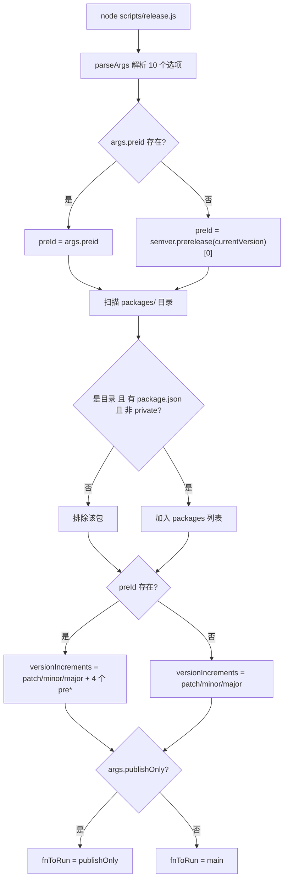
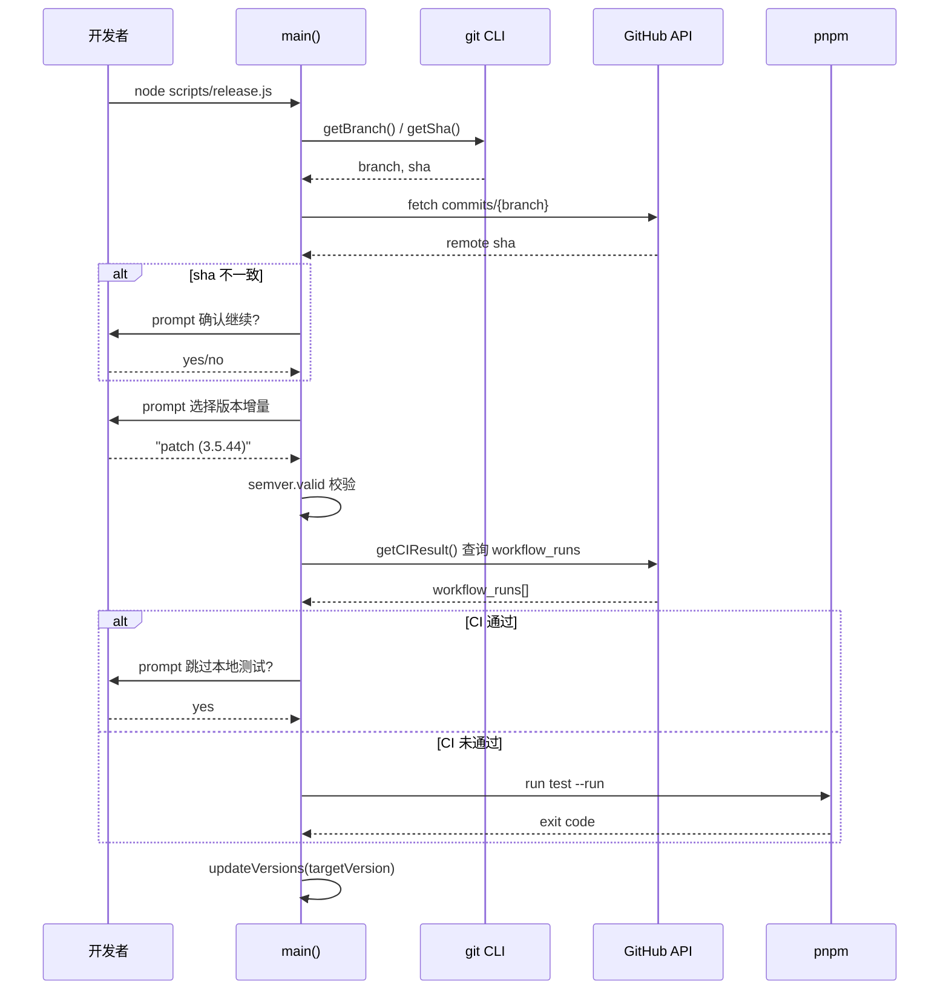
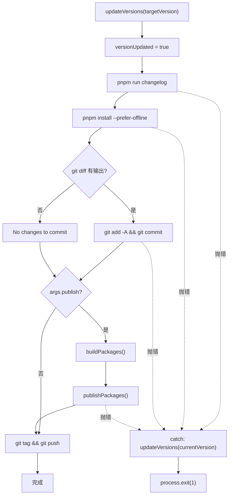

# Kapitel 9: Release-Automatisierung: Zustandsautomat und interaktive Orchestrierung von release.js

Im vorherigen Kapitel haben wir mithilfe des template-explorers das Compiler-Verhalten zurückverfolgt und die Methodik erlernt, interne Mechanismen mit Werkzeugen zu beobachten. Jetzt richten wir unseren Blick von der Kompilierungszeit auf die Release-Zeit – dies ist der gefährlichste Moment jedes Open-Source-Projekts: Er berührt gleichzeitig vier irreversible externe Systeme: Versionsnummer, Build-Artefakte, Git-Historie und npm registry. Ein fehlerhaftes npm publish kann nicht zurückgenommen werden, ein fehlerhaft gepushter Tag verunreinigt die Abhängigkeitsauflösung aller nachgelagerten Benutzer. Vue core verwendet ein 537 Zeilen langes scripts/release.js, um diese Gefahr zu bändigen – es ist weder ein reines Automatisierungsskript noch eine reine manuelle Checkliste, sondern ein interaktiver Zustandsautomat: An kritischen Knoten wird angehalten und gefragt, an vorhersehbaren Knoten vollautomatisch ausgeführt, und bei einem Fehler in irgendeinem Schritt wird die Versionsnummer auf den Ausgangspunkt zurückgerollt. Dieses Kapitel zerlegt die drei Kernmechanismen dieses Orchestrators: Argumentanalyse und Zustandsinitialisierung, interaktive Versionsentscheidung und CI-Gate, sowie Release-Reihenfolge und Fehler-Rollback.

# Argumentanalyse und globale Zustandsinitialisierung

## Intuitives Modell

Stellen Sie sich`release.js`als Bedienfeld einer alten Waschmaschine vor: Der Drehknopf (`parseArgs`Speicherlayout von Flags und globalem Zustand

## 标志位与全局状态的内存布局

> **[Design Inference & Architectural Trade-offs]**
> Das Erste, was das Skript nach dem Start tut, ist, die Kommandozeilenargumente in ein strukturiertes Objekt zu parsen. Hier wird das in Node integrierte`parseArgs`verwendet, nicht`yargs`oder`commander`– dies dient dazu, Drittanbieter-Abhängigkeiten zu eliminieren, da das Release-Skript selbst in jeder Umgebung lauffähig sein muss, selbst wenn`node_modules`nur halb installiert ist.

[FACT:scripts/release.js:27-62]definiert 10 Optionen, die in vier Kategorien unterteilt werden können:

- **Versionssemantik-Kategorie**：`preid`(Pre-Release-Identifikator, wie`alpha`/`beta`/`rc`）、`tag`（npm dist-tag）
- **Überspringen-Kategorie**：`skipBuild`、`skipTests`、`skipGit`、`skipPrompts`– diese vier booleschen Schalter bilden den „Automatisierungsgrad“-Regler
- **Ausführungsmodus-Kategorie**：`dry`(Leerlauf),`publish`(ob lokal direkt veröffentlicht wird),`publishOnly`(nur veröffentlichen, Version nicht aktualisieren)
- **Ziel-Kategorie**：`registry`(benutzerdefinierte Registry-Adresse)

Beachten Sie, dass der Standardwert von`publish``false` [FACT:scripts/release.js:51-54]ist, während andere boolesche Elemente keinen Standardwert haben (d. h.`undefined`). Diese Asymmetrie ist beabsichtigt:`publish`Die Semantik von`skipXxx`ist „ob npm publish lokal ausgeführt wird“, standardmäßig nicht veröffentlichen, die Veröffentlichungsaktion wird an GitHub Actions übergeben; während`undefined`standardmäßig`--skipTests`bedeutet „nicht angegeben“, die nachfolgende Logik wird unterscheiden zwischen „Benutzer hat explizit

übergeben“ und „Benutzer hat nicht übergeben“.[FACT:scripts/release.js:64-66]：

```js
const preId = args.preid || semver.prerelease(currentVersion)?.[0]
const isDryRun = args.dry
let skipTests = args.skipTests
const skipBuild = args.skipBuild
const skipPrompts = args.skipPrompts
const skipGit = args.skipGit
```

Kopieren`preId`Hier gibt es zwei bemerkenswerte Designentscheidungen. Erstens, die Wertepriorität von[FACT:scripts/release.js:64-66]ist „explizite Angabe auf der Kommandozeile > Ableitung aus der aktuellen Versionsnummer“`package.json`. Wenn die aktuelle Version von`3.5.0-beta.1``semver.prerelease`ist, dann gibt`['beta', 1]``[0]`zurück, nimmt`'beta'`und erhält`--preid beta`. Das bedeutet, dass beim kontinuierlichen Veröffentlichen auf dem Beta-Branch nicht jedes Mal`skipTests`eingegeben werden muss. Zweitens,`let`wird mit`const` [FACT:scripts/release.js:64-66]deklariert, während andere`runTestsIfNeeded`verwenden, weil es in

dynamisch durch CI-Ergebnisse überschrieben wird – dies ist ein „verzögerte Entscheidung“-Statusbit.[FACT:scripts/release.js:68-83]Als Nächstes folgt die Paket-Erkennungslogik`packages/`: Lesen des`package.json`Verzeichnisses, Herausfiltern von Nicht-Verzeichnis-Einträgen, Einträgen ohne`private: true`und Paketen mit`packages/`. Beachten Sie, dass hier`packages-private/`gelesen wird, nicht

## – letzteres ist ein internes Debug-Paket, das niemals veröffentlicht wird.

[FACT:scripts/release.js:85-85]Der Sortieralgorithmus für die Veröffentlichungsreihenfolge

```js
const sortPackagesForPublishing = (packageNames) => [
  ...packageNames.filter(p => p !== 'vue'),
  ...packageNames.filter(p => p === 'vue'),
]
```

Kopieren`vue`Es platziert das Einstiegspaket[FACT:scripts/release.js:85-85]an das Ende. Der Kommentar`vue`erklärt den Grund: Wenn zuerst`@vue/runtime-core`veröffentlicht wird, können Benutzer eine neue Version von`vue`installieren, bevor interne Pakete wie

## online sind, und npm wird einen Fehler melden, weil keine passende interne Abhängigkeit gefunden wird. Dies ist ein Kompromiss für „Veröffentlichungsatomizität“ im npm-Ökosystem – npm hat keine paketübergreifenden Transaktionen und kann Atomizität nur durch Reihenfolge annähern.

[FACT:scripts/release.js:111-116]Dynamische Konstruktion der Versionsinkrement-Kandidatenmenge

```js
const versionIncrements = [
  'patch', 'minor', 'major',
  ...(preId ? ['prepatch', 'preminor', 'premajor', 'prerelease'] : []),
]
```

Kopieren`preId`Dies ist eine bedingte Erweiterung: Nur wenn`--preid`existiert (d. h. derzeit im Pre-Release-Kanal oder der Benutzer hat explizit`3.5.43`angegeben), werden die Pre-Release-bezogenen Inkrementtypen zum Menü hinzugefügt. Wenn derzeit eine stabile Version`preid`und kein`patch/minor/major`angegeben ist, hat das Menü nur die drei Einträge`3.5.44-0`– um zu vermeiden, dass der Benutzer durch Fehlbedienung die stabile Version in eine halbherzige Pre-Release-Version wie

`inc`verwandelt.[FACT:scripts/release.js:120-120]Die Funktion`semver.inc`kapselt`preId`und übergibt`typeof preId === 'string' ? preId : undefined`als dritten Parameter. Hier gibt es eine Typverteidigung:`preId`– weil`string | undefined`möglicherweise`semver.inc`ist, während`string | undefined`

## erwartet, dient dieser Ternärausdruck der Erfüllung der TS-Typverengung.

[FACT:scripts/release.js:122-123]Ausführungsprimitive: Das Dual-Track-System von run und dryRun

```js
const run = async (bin, args, opts = {}) =>
  exec(bin, args, { stdio: 'inherit', ...opts })
const dryRun = async (bin, args, opts = {}) =>
  console.log(pico.blue(`[dryrun] ${bin} ${args.join(' ')}`), opts)
const runIfNotDry = isDryRun ? dryRun : run
```

`run`Kopieren`inherit`setzt das stdio des Unterprozesses auf`dryRun`, sodass die Ausgabe von Build/Tests direkt an das Terminal weitergeleitet wird – dies ist entscheidend für lang laufende Builds, der Benutzer kann den Fortschritt in Echtzeit sehen.`runIfNotDry`gibt nur den Befehl aus, ohne ihn auszuführen.`dryRun`ist eine „Strategieauswahl“: Beim Laden des Moduls wird der Funktionszeiger an`run`oder`isDryRun`。

> **[Design Inference & Architectural Trade-offs]**
> prüfen 〔Design-Inferenz und Architektur-Abwägungen〕`isDryRun`Dieses Muster „Strategie bei der Initialisierung entscheiden“ ist weniger fehleranfällig als „an jedem Aufrufpunkt entscheiden“: Wenn ein Aufrufpunkt vergisst,`runIfNotDry`zu prüfen, werden im Dry-Run-Modus tatsächlich Seiteneffekte ausgeführt. Während



---

# Kopieren

## Interaktive Versionsentscheidung und CI-Gate

Intuitives Modell

## Diese Phase ist wie eine Flughafensicherheitskontrolle: Zuerst wird Ihr Boarding-Pass überprüft (ob der lokale Commit mit dem Remote synchronisiert ist), dann wird bestätigt, wohin Sie wollen (Versionsnummer), und schließlich wird geprüft, ob Sie die Sicherheitskontrolle bestanden haben (ob CI bestanden wurde). Wenn eine dieser Prüfungen fehlschlägt, wird der gesamte Prozess abgebrochen. Ohne dieses Gate könnte ein nicht gepushter lokaler Commit getaggt und veröffentlicht werden, sodass der Quellcode, der der Version auf npm entspricht, auf GitHub überhaupt nicht existiert – dies ist der am schwersten zu diagnostizierende Veröffentlichungsunfall.

`main`Synchronisationsprüfung und Versionsauswahl`isInSyncWithRemote()` [FACT:scripts/release.js:141-141]Das Erste, was die Funktion[FACT:scripts/release.js:337-363]tut, ist`git rev-parse HEAD`. Die Logik dieser Funktion[FACT:scripts/release.js:348-355]ist: den aktuellen Branch-Namen abrufen, die GitHub-API anfordern, um den neuesten Commit-SHA dieses Branches zu erhalten, und mit dem lokalen`false`vergleichen. Wenn sie nicht übereinstimmen, wird ein Bestätigungsdialog[FACT:scripts/release.js:365-367]。

> **[Design Inference & Architectural Trade-offs]**
> zurückgegeben und

beendet 〔Design-Inferenz und Architektur-Abwägungen〕`node scripts/release.js 3.6.0`），`targetVersion`Die Designphilosophie hier ist „Fehler bedeutet Abbruch“: Bei Netzwerkausnahmen wird lieber nicht veröffentlicht, als das Risiko einzugehen, mit unbekanntem Status fortzufahren. Denn die Veröffentlichung ist irreversibel, während die Kosten für ein erneutes Ausführen des Skripts sehr gering sind.[FACT:scripts/release.js:141-141]Die Bestimmung der Versionsnummer erfolgt über zwei Pfade. Wenn der Benutzer ein Positionsargument auf der Kommandozeile übergeben hat (wie[FACT:scripts/release.js:152-176]wird direkt dieser Wert genommen`custom`. Andernfalls wird das interaktive Menü

aufgerufen: Zuerst wählt der Benutzer den Inkrementtyp, bei Auswahl von[FACT:scripts/release.js:174]wird ein weiteres Eingabefeld angezeigt, in dem der Benutzer die Versionsnummer manuell eingeben kann.

```js
targetVersion = release.match(/\((.*)\)/)?.[1] ?? ''
```

:`patch (3.5.44)`Kopieren`custom`Das Format des Menüeintrags ist[FACT:scripts/release.js:164-172]。

, diese Regex extrahiert die tatsächliche Versionsnummer aus den Klammern. Wenn der Benutzer[FACT:scripts/release.js:178-182]gewählt hat, wird ein anderer Zweig`targetVersion`durchlaufen. Danach folgt eine „zweite Parsing“-Logik`patch`/`minor`Solche inkrementellen Schlüsselwörter (der Benutzer könnte direkt übergeben`node release.js minor`), dann wird`inc`aufgerufen, um es in eine konkrete Versionsnummer umzuwandeln. Schließlich wird mit`semver.valid`validiert[FACT:scripts/release.js:184-186], ungültige Versionsnummern werfen direkt einen Fehler.

## CI-Gate: Die dreistufige Logik von runTestsIfNeeded

Dies ist der komplexeste Kontrollfluss im gesamten Kapitel.[FACT:scripts/release.js:281-317]Das`runTestsIfNeeded`ist tatsächlich eine dreistufige Entscheidungsmaschine:

**Zustand eins: Der Benutzer hat explizit`--skipTests`**。`skipTests`übergeben, initial auf`true`gesetzt, der gesamte Funktionskörper wird direkt übersprungen, "Tests skipped." wird ausgegeben[FACT:scripts/release.js:314-316]。

**Zustand zwei: Nicht übersprungen, und CI ist bereits bestanden**. Das Skript ruft`getCIResult()` [FACT:scripts/release.js:319-335]auf, es fragt die GitHub Actions API ab und prüft, ob ein Workflow-Run namens`ci`mit`conclusion === 'success'`existiert[FACT:scripts/release.js:319-335]. Falls bestanden, wird der Benutzer gefragt: „CI ist bestanden, lokale Tests überspringen?"[FACT:scripts/release.js:288-295]. Falls der Benutzer`--skipPrompts`aktiviert hat, werden lokale Tests automatisch übersprungen[FACT:scripts/release.js:296-298]。

**Zustand drei: Nicht übersprungen, und CI ist nicht bestanden**. Falls`--skipPrompts`aktiviert ist, wird direkt ein Fehler geworfen[FACT:scripts/release.js:299-304]：

```js
throw new Error(
  'CI for the latest commit has not passed yet. ' +
    'Only run the release workflow after the CI has passed.',
)
```

Falls nicht aktiviert`--skipPrompts`, dann bleibt`skipTests`auf`undefined`, fällt in den letzten lokalen Test-Zweig[FACT:scripts/release.js:307-313], führt`pnpm run test --run`。

aus. Hier gibt es ein subtiles Detail[FACT:scripts/release.js:285]：

```js
skipTests ||= isCIPassed
```

`||=`ist eine logische Oder-Zuweisung: Nur wenn`skipTests`falsy ist (`undefined`oder`false`), wird`isCIPassed`zugewiesen. Das bedeutet, wenn der Benutzer explizit`--skipTests`（`true`übergeben hat), ändert diese Zeile nichts daran; wenn der Benutzer nichts übergeben hat (`undefined`), wird es auf das CI-Ergebnis gesetzt. Aber direkt danach wird[FACT:scripts/release.js:287-298]bei bestandener CI erneut zugewiesen – also ist die tatsächliche Wirkung dieser Zeile`||=`nur „falls CI nicht bestanden, setze`skipTests`auf`false`", wodurch der nachfolgende`if (!skipTests)`-Zweig lokale Tests ausführt.

> **[Design Inference & Architectural Trade-offs]**
> Diese Logik macht einen Umweg, im Wesentlichen soll sie ausdrücken: „CI bestanden → lokale Tests können übersprungen werden (aber den Benutzer fragen); CI nicht bestanden → lokale Tests müssen ausgeführt werden (es sei denn, der Benutzer fordert explizit das Überspringen)". Die Schreibweise mit`||=`plus nachfolgender Überschreibung ist zwar kompakt, aber wenig lesbar, ein typischer Code-Geruch von „Statusbits werden an mehreren Stellen modifiziert".



## Versionsnummer schreiben: Die Iteration von updateVersions

[FACT:scripts/release.js:377-384]Das`updateVersions`macht zwei Dinge: die Root-`package.json`aktualisieren, dann alle Unterpakete durchlaufen und`updatePackage`。`updatePackage` [FACT:scripts/release.js:391-398]aufrufen, um JSON zu lesen, die`name`und`version`umzuschreiben, mit`JSON.stringify(pkg, null, 2) + '\n'`zurückzuschreiben – beachten Sie das abschließende`\n`, dies dient dazu, die Datei mit einem Zeilenumbruch am Ende beizubehalten, um zu vermeiden, dass git diff „No newline at end of file" anzeigt.

`getNewPackageName`Der Parameter`keepThePackageName` [FACT:scripts/release.js:105]ist standardmäßig

---

# , d.h. der Paketname wird nicht geändert. Dieser Parameter existiert, um das Szenario „Umbenennung des Pakets bei Veröffentlichung in einer benutzerdefinierten Registry" zu unterstützen – obwohl alle aktuellen Aufrufstellen den Standardwert übergeben, bietet die Schnittstelle Erweiterbarkeit.

## Veröffentlichungsreihenfolge, Idempotenz und Fehler-Rollback

Intuitives Modell`updateVersions`Diese Phase ist wie Dominosteine:

## Der erste Stein wird angestoßen (Versionsnummer ändern), die nachfolgenden changelog, lockfile, commit, tag, publish fallen nacheinander um. Wenn mittendrin ein Stein hängen bleibt, muss es einen Mechanismus geben, um die bereits umgefallenen Steine wieder aufzurichten – sonst bleibt das Repository im halbfertigen Zustand „Versionsnummer geändert, aber nicht veröffentlicht" stecken.

> **[Design Inference & Architectural Trade-offs]**
> `publishPackage` [FACT:scripts/release.js:439-489]〔Design-Inferenz und Architektur-Abwägung〕[FACT:scripts/release.js:442-451]Das`--tag`ist der Kern der Veröffentlichung. Es bestimmt zuerst den dist-tag`alpha`/`beta`/`rc`: bevorzugt wird der`version.includes('alpha')`-Parameter verwendet, andernfalls wird aus dem`semver.prerelease`-Schlüsselwort in der Versionsnummer abgeleitet. Beachten Sie, dass hier`3.5.0-alpha.1`，`includes`statt

verwendet wird – weil die Versionsnummer die Form[FACT:scripts/release.js:453-458]：

```js
if (!isDryRun && (await isPackagePublished(packageName, version))) {
  console.log(pico.yellow(`Skipping already published: ${pkgVersion}`))
  alreadyPublishedPackages.push(pkgVersion)
  return
}
```

`isPackagePublished` [FACT:scripts/release.js:491-513]Vor der Veröffentlichung gibt es eine Idempotenzprüfung`npm view <pkg>@<version> version`Kopieren`true`führt`false`aus, bei Erfolg wird

zurückgegeben, bei einem E404-ähnlichen Fehler wird`npm view`zurückgegeben. Der Sinn dieser Prüfung: Der Veröffentlichungsprozess könnte aufgrund von Netzwerkunterbrechungen erneut ausgeführt werden, bereits veröffentlichte Pakete sollten bei erneuter Ausführung nicht noch einmal veröffentlicht werden (npm lehnt doppelte Versionen ab).`isPackagePublished`Aber die Prüfung selbst kann auch fehlschlagen – zum Beispiel wirft[FACT:scripts/release.js:507-510]aufgrund einer Netzwerk-Zeitüberschreitung einen Nicht-E404-Fehler. In diesem Fall wirft

den Fehler nach oben`pnpm publish`, was zum Abbruch der gesamten Veröffentlichung führt. Dies ist eine weitere Manifestation von „lieber abbrechen als Risiko eingehen".`publishPackage`Selbst wenn die Prüfung bestanden wird, kann[FACT:scripts/release.js:480-488]：

```js
} catch (e) {
  if (e.message?.match(/previously published/)) {
    console.log(pico.red(`Skipping already published: ${pkgVersion}`))
    alreadyPublishedPackages.push(pkgVersion)
  } else {
    throw e
  }
}
```

im catch-Block einen zweiten Fallback eingebaut`previously published`Kopieren

## Nur wenn

[FACT:scripts/release.js:412-432]übereinstimmt, wird der Fehler geschluckt, alle anderen Fehler werden erneut geworfen. Dies ist „präzise Fehlertoleranz": Nur bei bekannten, sicher ignorierbaren Fehlern wird eine Degradierung durchgeführt.`pnpm publish`Dynamische Zusammensetzung der Veröffentlichungsflags

```js
const additionalPublishFlags = []
if (isDryRun) additionalPublishFlags.push('--dry-run')
if (isDryRun || skipGit || process.env.CI)
  additionalPublishFlags.push('--no-git-checks')
if (process.env.CI && !args.registry)
  additionalPublishFlags.push('--provenance')
```

`--no-git-checks`setzt je nach Laufzeitumgebung die zusätzlichen Flags für`pnpm publish`zusammen:

`--provenance`Kopieren[FACT:scripts/release.js:425-427]wird in drei Fällen aktiviert: dry run, git überspringen, oder in CI. Der Grund ist, dass`!args.registry`standardmäßig prüft, ob der Arbeitsbereich sauber ist, ob der aktuelle Branch der Release-Branch ist usw., und in CI diese Prüfungen Fehlalarme auslösen.

## wird nur in CI und wenn keine benutzerdefinierte Registry angegeben ist aktiviert

. Provenance ist eine Supply-Chain-Sicherheitsfunktion von npm, die die Herkunftsinformationen des Build-Artefakts (welcher Commit, welcher Workflow) signiert und an das Paket anhängt. Aber benutzerdefinierte Registries (wie interne private Registries) unterstützen Provenance normalerweise nicht, daher wurde die Bedingung`main`hinzugefügt.[FACT:scripts/release.js:528-537]：

```js
fnToRun().catch(err => {
  if (versionUpdated) {
    updateVersions(currentVersion)
  }
  console.error(err)
  process.exit(1)
})
```

`versionUpdated`Zurück zum Ende von`false` [FACT:scripts/release.js:24-27]Kopieren`updateVersions`ist eine boolesche Variable auf Modulebene, initial`true` [FACT:scripts/release.js:208], wird sofort nach erfolgreichem Aufruf von`true`auf`currentVersion`。

> **[Design Inference & Architectural Trade-offs]**
> Dieser Rollback ist „Best-Effort": Er rollt nur`package.json`die Versionsnummer in  zurück, nicht die Changelog-Datei, nicht die Lockfile, nicht den bereits ausgeführten Git-Commit. Wenn der Fehler nach dem Git-Commit auftritt, bleibt im Repository ein Zwischenzustand zurück, in dem „die Versionsnummer zurückgerollt wurde, aber der Commit bereits existiert". Dies ist eine Design-Abwägung – ein vollständiger Rollback würde`git reset`erfordern, und das würde andere Änderungen zerstören, die der Benutzer möglicherweise bereits vorgenommen hat. Daher entscheidet sich das Skript dafür, nur die kritischste Versionsnummer zurückzurollen und den Rest dem Benutzer zur manuellen Behandlung zu überlassen.

Beachten Sie`publishOnly`den Pfad[FACT:scripts/release.js:519-526]wird`versionUpdated`nicht gesetzt, da seine Semantik „nur veröffentlichen, keine Version ändern" lautet – selbst bei einem Fehler ist kein Rollback erforderlich. Wenn jedoch`targetVersion`existiert, ruft es`updateVersions` [FACT:scripts/release.js:519-526]auf; schlägt dies fehl, wird die Versionsnummer nicht zurückgerollt. Dies ist ein potenzielles Randproblem, siehe die Denkaufgabe am Ende des Kapitels.



## Veröffentlichungsreihenfolge und spezielle Behandlung des vue-Pakets

`publishPackages` [FACT:scripts/release.js:412-432]durchläuft die Ergebnisse von`sortPackagesForPublishing(packages)`und ruft nacheinander`publishPackage`auf. Da die Sortierung`vue`ans Ende setzt[FACT:scripts/release.js:85-85], stellt die gesamte Veröffentlichungssequenz sicher, dass interne Pakete zuerst online gehen.

`publishPackage`verwendet intern`cwd: getPkgRoot(pkgName)` [FACT:scripts/release.js:475], um das Arbeitsverzeichnis in das Unterpaketverzeichnis zu wechseln, sodass`pnpm publish`das Unterpaket statt des Root-Pakets veröffentlicht. Der Kommentar[FACT:scripts/release.js:462-463]warnt ausdrücklich: „Nicht zu npm publish ändern" – denn`pnpm publish`kann das`workspace:*`-Abhängigkeitsprotokoll korrekt verarbeiten und in eine tatsächliche Versionsnummer umwandeln, während`npm publish`das`workspace:*`unverändert beibehalten würde, was zu Installationsfehlern führt.

---

# Designüberlegungen

**Warum`parseArgs`statt`yargs`？**verwenden? Das Veröffentlichungsskript ist die „letzte Verteidigungslinie" und muss in jeder Umgebung ausführbar sein. Wenn eine CLI-Bibliothek eines Drittanbieters aufgrund eines beschädigten Abhängigkeitsbaums nicht geladen werden kann, ist der gesamte Veröffentlichungsprozess lahmgelegt. Das in Node integrierte`parseArgs`ist zwar funktional spartanisch (keine Subbefehle, keine automatische Hilfe), aber null Abhängigkeiten, null Risiko.

**Warum`publish`standardmäßig auf`false`？**setzen? Weil die offizielle Veröffentlichung von Vue über GitHub Actions läuft (siehe Hinweis in[FACT:scripts/release.js:256-263]), und das lokale Skript nur für Versionsänderung, Changelog-Generierung, Tag-Erstellung und Push zuständig ist. Das eigentliche`npm publish`wird in der CI ausgeführt, um die Provenance-Signierung und kontrollierte Umgebung der CI zu nutzen.`--publish`Das

**-Flag ist ein Notausgang für Maintainer, um im Notfall lokal zu veröffentlichen.**Warum wird beim Rollback nur die Versionsnummer zurückgerollt?`package.json`Weil ein vollständiger Rollback verstehen müsste, „welche Änderungen vom Skript und welche vom Benutzer vorgenommen wurden", und dies auf Git-Ebene nicht unterschieden werden kann. Das Skript entscheidet sich, nur das zurückzurollen, bei dem es am sichersten weiß, dass es es geändert hat –

---

# die Versionsnummer – und den Rest dem Benutzer zur Beurteilung zu überlassen.

`scripts/release.js`Kapitelzusammenfassung

1. **implementiert mit 537 Zeilen Code eine „interaktive Zustandsmaschine", deren Kerndesign sich in drei Punkten zusammenfassen lässt:**Parameter als Strategie`runIfNotDry`: 10 Flags werden beim Modulladen geparst und in globale Variablen abgeflacht,

2. **bindet die Strategie bei der Initialisierung, um fehlende Prüfungen an Aufrufstellen zu vermeiden.**Gatekeeping vorgelagert

3. **: Synchronisationsprüfung, Versionsvalidierung und CI-Gate werden vor jeglichen Seiteneffekten abgeschlossen, um „alles oder nichts" sicherzustellen.**：`isPackagePublished`Präzise Fehlertoleranz`previously published`Vorabprüfung +`versionUpdated`Fehler-Fallback bilden einen doppelten Idempotenzschutz;

Das Flag ermöglicht einen minimalen Rollback.**Dieser Mechanismus bildet einen interessanten Kontrast zum Template Explorer aus dem vorherigen Kapitel: Template Explorer ist „Beobachten" – Visualisierung des internen Compiler-Zustands; release.js ist „Ausführen" – Explizierung jedes Schritts des Veröffentlichungsprozesses. Beide verkörpern dieselbe Ingenieursphilosophie:**。

# Impliziten Zustand in expliziten Zustand verwandeln, unkontrollierbare Seiteneffekte in kontrollierbare Schritte

Denkaufgaben und Selbsttests dieses Kapitels[FACT:scripts/release.js:285]F1: Wenn man`skipTests ||= isCIPassed`das`skipTests = isCIPassed`zu`--skipTests`ändert, was passiert, wenn der Benutzer explizit

**übergibt und die CI nicht bestanden hat? Warum?**Referenzanalyse`--skipTests`: In der ursprünglichen Logik, wenn der Benutzer`skipTests`übergibt, ist`true` [FACT:scripts/release.js:64-66]，`||=`initial`runTestsIfNeeded`und ändert es nicht, daher wird[FACT:scripts/release.js:282]in`if (!skipTests)`die[FACT:scripts/release.js:314-316]-Prüfung als falsch ausgewertet und springt direkt zu`skipTests = isCIPassed`, um „Tests skipped." auszugeben. Wenn man es zu`skipTests`ändert, wird`false`zwangsweise auf[FACT:scripts/release.js:287]gesetzt (CI nicht bestanden), anschließend ist`if (isCIPassed)`in[FACT:scripts/release.js:299]falsch und fällt auf`else if (skipPrompts)`in`--skipPrompts`– wenn`skipTests`nicht aktiviert ist, bleibt`false`auf[FACT:scripts/release.js:307-313], und schließlich wird in`--skipPrompts`der lokale Test ausgeführt. Dies widerspricht der Absicht des Benutzers, „Tests explizit zu überspringen", und wirft in der CI-Umgebung ([FACT:scripts/release.js:300-303]) direkt einen Fehler`||=`, was die Veröffentlichung abbricht.

Q2: `publishOnly`Die Existenz von[FACT:scripts/release.js:519-526]dient genau dazu, die explizite Wahl des Benutzers zu respektieren.`targetVersion`Der Pfad`updateVersions`ruft`versionUpdated`auf, wenn`buildPackages`existiert, setzt aber nicht`publishPackages`. Was passiert, wenn zu diesem Zeitpunkt

**oder**：`publishOnly`einen Fehler wirft? Ist dieses Design sinnvoll?`updateVersions(targetVersion)` [FACT:scripts/release.js:519-526]Referenzanalyse`package.json`ruft`versionUpdated = true`auf und ändert die Versionsnummern aller`buildPackages` [FACT:scripts/release.js:519-526], setzt aber nicht`publishPackages` [FACT:scripts/release.js:519-526]. Wenn anschließend`fnToRun().catch` [FACT:scripts/release.js:528-537]oder`versionUpdated`einen Fehler wirft, prüft`false`, ob`publishOnly`gleich`targetVersion`ist, und rollt die Versionsnummer nicht zurück. Das Ergebnis ist, dass das Repository im Zustand „Versionsnummer geändert, aber Veröffentlichung fehlgeschlagen" verbleibt. Dieses Design ist unter der ursprünglichen Semantik von`updateVersions`(nur veröffentlichen, keine Version ändern) sinnvoll – denn`targetVersion`wird normalerweise nicht übergeben und[FACT:scripts/release.js:519-526]wird nicht ausgeführt. Wenn der Benutzer jedoch`versionUpdated = true`übergibt, weist dieser Pfad eine Rollback-Lücke auf. Die Lösung besteht darin, nach`publishOnly`ein`main`hinzuzufügen oder

Q3: `isPackagePublished` [FACT:scripts/release.js:491-513]die Rollback-Logik von`npm view`wiederverwenden zu lassen.`npm view`verwendet

**, um zu prüfen, ob das Paket bereits veröffentlicht wurde. Was passiert, wenn ein Netzwerk-Timeout dazu führt, dass**：`isPackagePublished`einen Nicht-E404-Fehler wirft? Ist dieses Verhalten im CI-Wiederholungsszenario sicher?[FACT:scripts/release.js:507-510]Referenzanalyse`isPackageNotFoundError`ruft im catch-Block[FACT:scripts/release.js:515-515]auf, um den Fehlertyp zu bestimmen. Diese Funktion`/E404|No match found|No matching version|notarget/i`gleicht nur`isPackageNotFoundError`ab. Die Nachricht eines Netzwerk-Timeout-Fehlers enthält diese Schlüsselwörter nicht, daher gibt`false`，`isPackagePublished`den Fehler erneut aus[FACT:scripts/release.js:507-510]. Dieser Fehler breitet sich nach oben aus bis`publishPackage` [FACT:scripts/release.js:453], was den gesamten Release abbricht. Im Szenario eines CI-Neustarts führt dies dazu, dass „das Paket bereits veröffentlicht wurde, aber aufgrund von Netzwerkfluktuationen abgebrochen wird“ – aber dies ist eine sichere Fehlerrichtung: Ein Abbruch ist besser als eine Fehlentscheidung „nicht veröffentlicht“ und eine erneute Veröffentlichung. Eine erneute Veröffentlichung löst den npm-`previously published`Fehler aus, wird von[FACT:scripts/release.js:491-492]abgefangen, verschwendet aber einen Netzwerk-Roundtrip. Daher ist „Netzwerkfehler = Abbruch“ eine konservative, aber korrekte Wahl.

---

Das nächste Kapitel führt in`.github/workflows/`ein und zeigt, wie GitHub Actions nach dem Push des Tags durch release.js die nachfolgende Build- und Release-Pipeline übernimmt sowie die vollständige Implementierung der CI-Gates.

Damit haben wir gesehen, wie release.js mit einer Zustandsmaschine und interaktiver Orchestrierung das irreversible Release-Risiko minimiert. Aber das Release-Skript selbst ist nur der Ausführende; wer wirklich entscheidet, wann ausgelöst wird und unter welchen Bedingungen freigegeben wird, ist der übergeordnete automatisierte Torwächter. Das nächste Kapitel analysiert das CI/CD-System im Verzeichnis .github/workflows: Wie ci.yml in der PR-Phase die dreifachen Gates lint/typecheck/test ausführt, wie release.yml beim Tag-Push das Release auslöst, wie size-report.yml und size-data.yml Paketgrößen-Regressionen verfolgen und wie autofix.yml Formatprobleme automatisch behebt. Du wirst verstehen, wie Vue mit GitHub Actions Engineering-Standards in eine nicht umgehbare Pipeline gießt.
