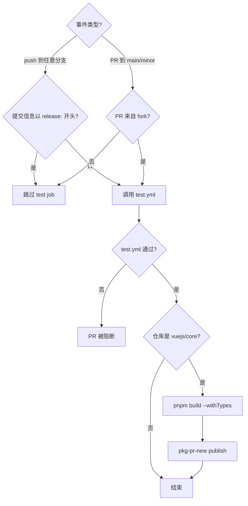
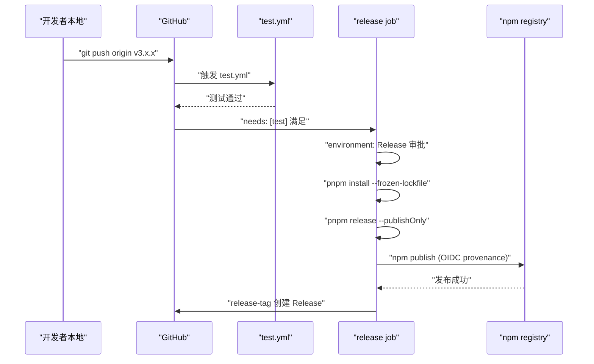
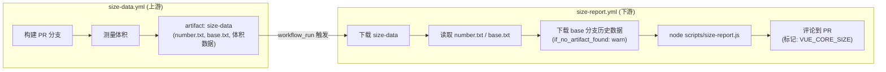

# Kapitel 10: CI/CD-Workflows: Automatisierte Torwächter von PR bis Release

Im vorherigen Kapitel haben wir gesehen, wie`scripts/release.js`mit einer interaktiven Zustandsmaschine jeden Schritt eines Releases verkettet. Aber dieses Skript hat eine Voraussetzung: Es muss von einer Person oder einem System aktiv aufgerufen werden. Im Vue-core-Repository ist dieser aktive Aufrufer nicht das lokale Terminal eines Maintainers, sondern GitHub Actions. release.js ist der Ausführende, workflows sind der Entscheider – sie bestimmen, welches Ereignis welche Aufgabe auslöst, unter welchen Bedingungen freigegeben und unter welchen Bedingungen blockiert wird. Dieses Kapitel konzentriert sich auf`.github/workflows/`die vier Dateien im Verzeichnis:`ci.yml`(PR-Gate und kontinuierliche Vorabveröffentlichung),`release.yml`(tag-ausgelöste offizielle Veröffentlichung),`size-report.yml`(Bericht zu Größenregressionen),`autofix.yml`(automatische Formatkorrektur). Ihr Kern besteht nicht darin, YAML-Syntax auswendig zu lernen, sondern zu erkennen, wie das Vue-Team Engineering-Standards in nicht umgehbare Pipeline-Einschränkungen übersetzt.

# I. ci.yml: Dreifache Gates und kontinuierliche Vorabveröffentlichung

## Intuitives Modell

Stell dir`ci.yml`wie eine Flughafensicherheitskontrolle vor. Jeder PR muss durch dieses Gate: lint prüft, ob dein Gepäck verbotene Gegenstände enthält, typecheck bestätigt, dass dein Ausweis echt und gültig ist, test verifiziert, dass du keine Gefahrgüter mitführst. Aber es gibt nicht nur ein Sicherheitsgate – Vue hat hier auch einen „kontinuierlichen Vorabveröffentlichungs“-Kanal eingerichtet, der die Build-Artefakte jedes PR direkt auf pkg-pr-new veröffentlicht, damit Mitwirkende ihre Änderungen in einem echten npm-Installationsszenario validieren können.

Ohne dieses Gate könnte jede Zusammenführung Formatfehler, Typ-Lücken oder Verhaltensregressionen in den main-Branch bringen, und der main-Branch ist die Quelle aller nachfolgenden Releases.

## Auslösebedingungen und Nebenläufigkeitskontrolle

`ci.yml`Die Auslösekonfiguration von

[FACT:.github/workflows/ci.yml:2-11]

```yaml
on:
  push:
    branches:
      - '**'
    tags:
      - '!**'
  pull_request:
    branches:
      - main
      - minor
```

Hier gibt es zwei entscheidende Designs. Erstens:`push`Das Ereignis überwacht alle Branches (`'**'`), schließt aber mit`tags: ['!**']`explizit alle Tag-Pushes aus. Warum Tags ausschließen? Weil Tag-Pushes von`release.yml`separat behandelt werden. Wenn`ci.yml`ebenfalls auf Tags reagieren würde, würden Release-Pipeline und CI-Pipeline doppelt ausgelöst, was Runner-Ressourcen verschwendet und sogar Race Conditions erzeugen kann. Zweitens:`pull_request`überwacht nur`main`und`minor`zwei Branches – das ist Vues Zwei-Branch-Strategie:`main`trägt die stabile Version,`minor`trägt die Vorabveröffentlichungsversion.

[FACT:.github/workflows/ci.yml:22-22]

```yaml
concurrency:
  group: ${{ github.workflow }}-${{ github.event.pull_request.number || github.ref }}
  cancel-in-progress: ${{ github.event_name == 'pull_request' }}
```

Der Ausdruck von`group`verwendet`github.event.pull_request.number || github.ref`als Fallback: PR-Ereignisse verwenden die PR-Nummer als Gruppierungsschlüssel, Push-Ereignisse verwenden ref (Branch-Name) als Gruppierungsschlüssel. Das bedeutet, dass mehrere Pushes desselben PR in dieselbe Nebenläufigkeitsgruppe fallen. Und`cancel-in-progress`ist nur bei PR-Ereignissen`true`– wenn du drei Commits hintereinander pushst, werden die CI-Läufe der ersten beiden automatisch abgebrochen, und nur der neueste bleibt erhalten.

> **[Design Inference & Architectural Trade-offs]**
> Die Motivation dieses Designs ist klar: In der PR-Phase pushen Entwickler häufig, die CI-Ergebnisse alter Commits sind bereits bedeutungslos, und deren Abbruch spart viel Runner-Zeit. Aber bei einem Push in den main-Branch darf nicht abgebrochen werden – denn jeder Push auf main könnte die letzte Validierung vor einem Release sein, und ein Abbruch würde eine Validierungslücke erzeugen.

## Der Einstieg in die dreifachen Gates: Bedingungsprüfung des test-Jobs

[FACT:.github/workflows/ci.yml:22-22]

```yaml
jobs:
  test:
    if: ${{ ! startsWith(github.event.head_commit.message, 'release:') && (github.event_name == 'push' || github.event.pull_request.head.repo.full_name != github.repository) }}
    uses: ./.github/workflows/test.yml
```

Bedingung enthält zwei logische Und-Zweige (`if`), und jeder verdient eine Erläuterung.`&&`Die erste Bedingung

: Wenn die Commit-Nachricht mit`! startsWith(github.event.head_commit.message, 'release:')`：如果提交信息以 `release:`Am Anfang, Tests überspringen. Genau das ist das Format der Commit-Nachricht, die release.js im vorherigen Kapitel gepusht hat – release.js hat die vollständigen Tests bereits lokal ausgeführt, CI muss nicht erneut validieren. Dies ist eine Optimierung des „Vertrauens in die vorgelagerte Instanz".

> **[Design Inference & Architectural Trade-offs]**
> Die zweite Bedingung`(github.event_name == 'push' || github.event.pull_request.head.repo.full_name != github.repository)`: push-Ereignisse führen immer Tests aus; PR-Ereignisse erfordern, dass der PR von einem Fork stammt (`head.repo.full_name != github.repository`). Warum werden nur PRs von Forks getestet? Weil PRs von Branches im selben Repository normalerweise von Kernmitgliedern erstellt werden und deren Branch-Pushes bereits CI durch push-Ereignisse ausgelöst haben. PRs von Forks lösen jedoch keine push-Ereignisse aus (ein Push in einem Fork benachrichtigt nicht das Upstream-Repository), daher muss dies im PR-Ereignis nachgeholt werden.

Beachten Sie`uses: ./.github/workflows/test.yml`– dies ist ein Aufruf eines reusable workflow.`test.yml`ist eine eigenständige Workflow-Datei, die von`ci.yml`und`release.yml`gemeinsam genutzt wird. Diese Wiederverwendung vermeidet die mehrfache Definition von lint/typecheck/test-Schritten in mehreren Workflows.

## Kontinuierliche Vorabveröffentlichung: Die Rolle von pkg-pr-new

[FACT:.github/workflows/ci.yml:25-51]

```yaml
continuous-release:
  if: github.repository == 'vuejs/core'
  runs-on: ubuntu-latest
  steps:
    - name: Checkout
      uses: actions/checkout@3d3c42e5aac5ba805825da76410c181273ba90b1 # v7.0.1
      with:
        persist-credentials: false
    # ... 安装 pnpm、Node.js、依赖 ...
    - name: Build
      run: pnpm build --withTypes
    - name: Release
      run: pnpx pkg-pr-new publish --compact --pnpm './packages/*' --packageManager=pnpm,npm,yarn
```

`continuous-release`Der Job läuft nur im`vuejs/core`Haupt-Repository (`if: github.repository == 'vuejs/core'`), wird auf Forks nicht ausgeführt. Er erledigt drei Dinge: Build (`pnpm build --withTypes`, mit Typdeklarationen), dann mit`pkg-pr-new`alle Pakete unter`./packages/*`in eine temporäre npm-Registry veröffentlichen.

> **[Design Inference & Architectural Trade-offs]**
> Der Wert dieses Mechanismus liegt darin: Mitwirkende können in ihrem eigenen Projekt direkt`npm install`die Build-Artefakte dieses PRs installieren, um zu verifizieren, ob die Änderung das Problem tatsächlich löst. Dies ist überzeugender als „CI ist grün", weil es das reale Paketkonsumszenario validiert.

Beachten Sie, dass alle Actions auf Commit-SHA festgeschrieben sind (wie`actions/checkout@3d3c42e5...`), anstatt flüchtige Tags wie`@v4`zu verwenden. Dies ist eine harte Anforderung der Supply-Chain-Sicherheit – um zu verhindern, dass nach einer Kompromittierung des Action-Repositorys bösartiger Code automatisch eindringt.

## ci.yml Kontrollflussdiagramm



---

# Zwei, release.yml: Release-Orchestrierung nach Tag-Push

## Intuitives Modell

Wenn man`ci.yml`als Sicherheitskontrolle bezeichnet,`release.yml`ist es die Startrampe. Wenn release.js lokal die Versionsnummer aktualisiert, committet, taggt und pusht, zündet das Tag-Push-Ereignis den Motor von`release.yml`. Es führt zuerst einen vollständigen Testlauf aus (erneute Bestätigung), dann führt es im geschützten`Release`Environment`pnpm release --publishOnly`aus und erstellt schließlich ein GitHub Release.

Ohne es wäre das von release.js gepushte Tag nur eine Git-Referenz, es gäbe keine neue Version auf npm und keine Release-Seite auf GitHub.

## Auslösebedingung: Nur Tags werden akzeptiert

[FACT:.github/workflows/release.yml:3-6]

```yaml
on:
  push:
    tags:
      - 'v*' # Push events to matching v*, i.e. v1.0, v20.15.10
```

Es überwacht nur Tag-Pushes im Format`v*`. Dies ergänzt sich mit`ci.yml`von`tags: ['!**']`– beide sind strikt gegenseitig ausschließend und werden nicht gleichzeitig ausgelöst.

## Guard-Bedingungen des Release-Jobs

[FACT:.github/workflows/release.yml:8-21]

```yaml
jobs:
  test:
    uses: ./.github/workflows/test.yml

  release:
    if: github.repository == 'vuejs/core'
    needs: [test]
    runs-on: ubuntu-latest
    permissions:
      contents: write
      id-token: write
    environment: Release
```

Hier gibt es drei Guard-Ebenen, keine davon ist verzichtbar.

Erste Ebene`if: github.repository == 'vuejs/core'`: Verhindert versehentliche Release-Auslösung auf Forks. Wenn jemand das Repository forkt und ein`v1.0.0`-Tag pusht, verhindert diese Bedingung die Ausführung des Release-Prozesses.

Zweite Ebene`needs: [test]`: Der Release-Job hängt vom Test-Job ab. Der Test-Job ruft`test.yml`auf; wenn die Tests fehlschlagen, startet der Release-Job gar nicht. Dies ist die harte Einschränkung „Tests müssen vor dem Release bestanden werden".

> **[Design Inference & Architectural Trade-offs]**
> Dritte Ebene`environment: Release`: Dies ist eine GitHub Environment, für die Deployment-Schutzregeln konfiguriert werden können (z. B. Genehmigung durch bestimmte Personen erforderlich). Das bedeutet, dass selbst wenn ein Tag-Push den Workflow auslöst, der Release-Schritt möglicherweise eine manuelle Genehmigung erfordert – dies ist die letzte Verteidigungslinie gegen irreversible Operationen.

Bezüglich Berechtigungen:`contents: write`wird zum Erstellen des GitHub Release verwendet,`id-token: write`für die npm-Provenance-Authentifizierung (OIDC-Token). Beachten Sie, dass hier kein`packages: write`vorhanden ist, da Vue auf npm und nicht auf GitHub Packages veröffentlicht.

## Die vollständige Kette der Release-Schritte

[FACT:.github/workflows/release.yml:37-46]

```yaml
- name: Install deps
  run: pnpm install --frozen-lockfile

- name: Update npm
  run: npm i -g npm@latest

- name: Build and publish
  id: publish
  run: |
    pnpm release --publishOnly
```

> **[Design Inference & Architectural Trade-offs]**
> Die drei Schritte haben jeweils ihre Besonderheiten.`--frozen-lockfile`stellt sicher, dass die CI-Umgebung strikt gemäß lockfile installiert, sodass Build-Artefakte nicht durch Dependency-Versionsdrift von der lokalen Umgebung abweichen.`npm i -g npm@latest`dient dem Abrufen der neuesten npm CLI – da Provenance und OIDC-Authentifizierung neuere npm-Versionen erfordern und ältere Versionen diese Funktionen möglicherweise nicht unterstützen.

`pnpm release --publishOnly`ist der Einstiegspunkt von release.js aus dem vorherigen Kapitel.`--publishOnly`Das Flag teilt release.js mit: Interaktive Versionsnummernauswahl überspringen, Git-Commit und Tagging überspringen (da das Tag bereits existiert), nur Build und npm publish ausführen.

## GitHub Release erstellen

[FACT:.github/workflows/release.yml:48-57]

```yaml
- name: Create GitHub release
  id: release_tag
  uses: yyx990803/release-tag@8cccf7c5aa332d71d222df46677f70f77a8d2dc0 # v1.0.0
  env:
    GITHUB_TOKEN: ${{ secrets.GITHUB_TOKEN }}
  with:
    tag_name: ${{ github.ref }}
    body: |
      For stable releases, please refer to [CHANGELOG.md](...) for details.
      For pre-releases, please refer to [CHANGELOG.md](...) of the `minor` branch.
```

> **[Design Inference & Architectural Trade-offs]**
> Hier wird`release-tag` action。`tag_name: ${{ github.ref }}`verwendet, das vom Vue-Autor Evan You selbst gepflegt wird, und direkt die Ref des auslösenden Ereignisses verwendet (d. h.`refs/tags/v3.x.x`). Der Release-Body enthält keine konkreten Änderungen, sondern verweist auf CHANGELOG.md – weil Vues Changelog von conventional-changelog automatisch generiert wird und eine manuelle Pflege des Release-Bodys zu Inkonsistenzen mit dem Changelog führen würde.

## release.yml Sequenzdiagramm



---

# Drei, size-report.yml und autofix.yml: Größenverfolgung und Format-Selbstheilung

## size-report.yml: Workflow-übergreifender Größenregressionsbericht

`size-report.yml`Die Auslösung ist sehr speziell – sie wird nicht direkt durch push oder PR ausgelöst, sondern durch das Abschlussereignis eines anderen Workflows.

[FACT:.github/workflows/size-report.yml:3-7]

```yaml
on:
  workflow_run:
    workflows: ['size data']
    types:
      - completed
```

`workflow_run`Das Event lauscht auf den Namen`size data`des Workflows, der abgeschlossen wurde. Dies ist ein zweistufiges Design:`size-data.yml`(In diesem Kapitel kein Quellcode bereitgestellt) ist dafür verantwortlich, im PR zu bauen und die Größe zu messen und die Ergebnisse als Artefakt hochzuladen;`size-report.yml`nach`size data`Abschluss wird das Artefakt heruntergeladen, ein Bericht generiert und als Kommentar zum PR hinzugefügt.

[FACT:.github/workflows/size-report.yml:20-23]

```yaml
if: >
  github.repository == 'vuejs/core' &&
  github.event.workflow_run.event == 'pull_request' &&
  github.event.workflow_run.conclusion == 'success'
```

Dreifache Absicherung: Hauptrepository, PR-Event, Upstream-Workflow erfolgreich. Wenn`size data`fehlschlägt, wird der Report-Job nicht ausgeführt – weil keine Daten zum Berichten vorhanden sind.

Der Datenfluss gestaltet sich wie folgt:

[FACT:.github/workflows/size-report.yml:41-46]

```yaml
- name: Download Size Data
  uses: dawidd6/action-download-artifact@d63b86af1b34672e53c440b1b83979861906bad7 # v24
  with:
    name: size-data
    run_id: ${{ github.event.workflow_run.id }}
    path: temp/size
```

Vom Upstream-Workflow-Run wird`size-data`das Artefakt nach`temp/size`heruntergeladen. Dann werden parallel die PR-Nummer und der Base-Branch gelesen:

[FACT:.github/workflows/size-report.yml:48-59]

```yaml
- parallel:
    - name: Read PR Number
      id: pr-number
      uses: juliangruber/read-file-action@271ff311a4947af354c6abcd696a306553b9ec18 # v1.1.8
      with:
        path: temp/size/number.txt
    - name: Read base branch
      id: pr-base
      uses: juliangruber/read-file-action@271ff311a4947af354c6abcd696a306553b9ec18 # v1.1.8
      with:
        path: temp/size/base.txt
```

`parallel`ist syntaktischer Zucker von GitHub Actions, der zwei unabhängige Schritte gleichzeitig ausführt.`number.txt`und`base.txt`sind`size-data.yml`Metadatendateien, die beim Messen geschrieben werden.

Anschließend werden die historischen Größendaten des Base-Branches zum Vergleich heruntergeladen:

[FACT:.github/workflows/size-report.yml:61-69]

```yaml
- name: Download Previous Size Data
  uses: dawidd6/action-download-artifact@d63b86af1b34672e53c440b1b83979861906bad7 # v24
  with:
    branch: ${{ steps.pr-base.outputs.content }}
    workflow: size-data.yml
    event: push
    name: size-data
    path: temp/size-prev
    if_no_artifact_found: warn
```

Beachten Sie`if_no_artifact_found: warn`– wenn der Base-Branch noch keine historischen Daten hat (z. B. ein neuer Branch), schlägt es nicht fehl, sondern warnt nur. Dies stellt sicher, dass der Bericht beim ersten Lauf dennoch generiert wird, nur ohne Vergleichsbasis.

Schließlich wird der Bericht generiert und kommentiert:

[FACT:.github/workflows/size-report.yml:71-89]

```yaml
- name: Prepare report
  run: node scripts/size-report.js > size-report.md

- name: Read Size Report
  id: size-report
  uses: juliangruber/read-file-action@271ff311a4947af354c6abcd696a306553b9ec18 # v1.1.8
  with:
    path: ./size-report.md

- name: Create Comment
  uses: actions-cool/maintain-one-comment-backup@fbbc22ad1809c1bcf46f19b58397b6254773588c # backup for v3.0.0
  with:
    token: ${{ secrets.GITHUB_TOKEN }}
    number: ${{ steps.pr-number.outputs.content }}
    body: |
      ${{ steps.size-report.outputs.content }}
      
    body-include: ''
```

`scripts/size-report.js`liest`temp/size`und`temp/size-prev`die Daten unter und generiert einen Markdown-Bericht.`maintain-one-comment-backup`Die Action verwendet`body-include: '<!-- VUE_CORE_SIZE -->'`als Marker, um sicherzustellen, dass pro PR nur ein Größenbericht-Kommentar erhalten bleibt (Aktualisierung statt Anhängen). Beachten Sie den Kommentar in L81, der erklärt, dass das ursprüngliche Action-Repository von GitHub blockiert wurde, daher wurde ein Backup-Repository verwendet und der Commit festgeschrieben.

## autofix.yml: Automatische Behebung von Formatproblemen

`autofix.yml`löst ein sehr praktisches Problem: Der von Mitwirkenden eingereichte Code entspricht nicht den prettier/eslint-Regeln, CI meldet einen Fehler, und die Mitwirkenden müssen manuell`pnpm lint --fix`ausführen und erneut committen. Dieser Workflow automatisiert diesen Schritt.

[FACT:.github/workflows/autofix.yml:3-8]

```yaml
on:
  pull_request:

concurrency:
  group: ${{ github.workflow }}-${{ github.event.pull_request.number }}
  cancel-in-progress: ${{ github.event_name == 'pull_request' }}
```

Löst bei allen PRs aus, die Nebenläufigkeitssteuerung ist ähnlich wie bei`ci.yml`– ein neuer Push im selben PR bricht den alten autofix-Lauf ab.

[FACT:.github/workflows/autofix.yml:35-41]

```yaml
- name: Run eslint
  run: pnpm run lint --fix

- name: Run prettier
  run: pnpm run format

- uses: autofix-ci/action@7a166d7532b277f34e16238930461bf77f9d7ed8
```

Zuerst wird eslint`--fix`ausgeführt, dann prettier formatiert, und schließlich`autofix-ci/action`werden die geänderten Dateien direkt zurück in den PR-Branch committet. Beachten Sie, dass`pnpm run format`selbst ein Formatierungsbefehl ist (kein`--fix`Flag erforderlich, da das format-Skript intern`prettier --write`）。

> **[Design Inference & Architectural Trade-offs]**
> Der Schlüssel dieses Mechanismus liegt darin, dass`autofix-ci/action`Fixes als PR-Autor committet werden, nicht als Bot. So müssen Mitwirkende nichts weiter tun, und die Formatkorrekturen erscheinen automatisch in ihrem PR. Das bedeutet aber auch, dass autofix fehlschlägt, wenn der Branch des Mitwirkenden Schutzregeln hat (die Bot-Pushes nicht erlauben) – dies ist ein Grenzfall, den Mitwirkende manuell behandeln müssen.

## size-report Datenflussdiagramm



---

# Design-Überlegung: Normen in die Pipeline gießen

Bei der Betrachtung dieser vier Workflows lassen sich mehrere durchgängige Designprinzipien erkennen.

**Erstens, Minimierung der Berechtigungen.** `ci.yml`und`autofix.yml`deklarieren beide`permissions: contents: read`, nur`release.yml`benötigt`contents: write`und`id-token: write`。`size-report.yml`benötigt`pull-requests: write`und`issues: write`zum Kommentieren. Jeder Workflow erhält nur die Berechtigungen, die er wirklich benötigt.

**Zweitens, Supply-Chain-Sicherheit.**Alle Drittanbieter-Actions sind auf Commit-SHA festgeschrieben, nicht auf floatende Tags.`size-report.yml`Der Kommentar in L81 erklärt sogar direkt, dass nach der Blockierung des ursprünglichen Action-Repositories auf ein Backup-Repository umgestellt und der Commit festgeschrieben wurde – dies ist eine praktische Verteidigung gegen Supply-Chain-Angriffe.

**Drittens, Trennung der Zuständigkeiten und Wiederverwendung.** `test.yml`wird von`ci.yml`und`release.yml`gemeinsam genutzt, um Duplizierung der Testlogik zu vermeiden.`size-data.yml`und`size-report.yml`sind getrennt, sodass Messung und Berichterstattung unabhängig voneinander weiterentwickelt werden können.

**Viertens, die Wahl der Fehlerrichtung.** `size-report.yml`Die`if_no_artifact_found: warn`wählt „Warnen statt Fehlschlagen“, da fehlende historische Daten den PR nicht blockieren sollten. Die`release.yml`von`needs: [test]`wählt „Testfehler blockiert Release“, da ein Release eine irreversible Operation ist.

**Fünftens, Differenzierung der Nebenläufigkeitssteuerung.**PR-Events brechen alte Läufe ab (`cancel-in-progress: true`), push-Events brechen nicht ab (`cancel-in-progress: false`). Diese Differenz spiegelt die Semantik der beiden Events wider: Alte Commits eines PRs sind bedeutungslos, jeder Commit eines push kann der endgültige Zustand sein.

---

# Zusammenfassung dieses Kapitels

Dieses Kapitel analysiert die vier Kern-Workflows des Vue-core-Repositories:

- **`ci.yml`**: PR-Gate + kontinuierliche Vorabveröffentlichung. Durch`if`Bedingungen werden push/PR und fork/gleiches Repository unterschieden, mit`concurrency`werden veraltete PR-Läufe abgebrochen, mit`pkg-pr-new`werden installierbare Vorabveröffentlichungspakete veröffentlicht.
- **`release.yml`**: Tag-ausgelöste offizielle Veröffentlichung. Drei Schutzebenen (Repository-Prüfung, needs test, environment-Genehmigung) stellen sicher, dass nur Tags, die Tests bestanden haben und genehmigt wurden, in npm veröffentlicht werden können.
- **`size-report.yml`**: Workflow-übergreifender Größenregressionsbericht. Durch`workflow_run`-Event wird das Upstream-`size data`-Event überwacht, das Artifact heruntergeladen und mit den Daten des Base-Branches verglichen, um als Kommentar zum PR zurückgemeldet zu werden.
- **`autofix.yml`**: Automatische Formatkorrektur. Auf dem PR werden eslint --fix und prettier ausgeführt, und durch`autofix-ci/action`werden die Korrekturen direkt in den PR-Branch zurückcommittet.

Diese vier Workflows bilden gemeinsam eine „nicht umgehbare Pipeline": Code-Standards werden durch autofix automatisch korrigiert, Typen und Tests werden durch ci.yml erzwungen geprüft, Größenregressionen werden durch size-report verfolgt, und die Veröffentlichung wird durch release.yml unter mehrfachen Schutzebenen ausgeführt.

# Gedanken und Selbsttest dieses Kapitels

Q1: Wenn in`ci.yml`der Wert von`cancel-in-progress`auf konstant`true`geändert wird (d. h. die Bedingung`github.event_name == 'pull_request'`entfernt wird), in welchen Szenarien würde dies zu Problemen führen?

**Referenzanalyse**：`cancel-in-progress`Konstantes`true`bedeutet, dass beim Push auf den main-Branch ein neuer Push die laufende alte CI abbricht. Betrachten wir dieses Szenario: Auf dem main-Branch werden nacheinander zwei PRs gemergt, die CI des ersten PR läuft gerade (mit vollständigem lint/typecheck/test), und der Merge des zweiten PR löst einen neuen CI-Lauf aus. Wenn`cancel-in-progress`auf`true`gesetzt ist, wird die CI des ersten PR abgebrochen – aber der Code des ersten PR ist bereits auf main, und sein CI-Ergebnis ist entscheidend für die Beurteilung des Gesundheitszustands des main-Branches. Ihn abzubrechen bedeutet, dass ein Teil des Codes auf dem main-Branch nie vollständig validiert wurde. Die Bedingung[FACT:.github/workflows/ci.yml:22-22]von`github.event_name == 'pull_request'`dient genau dazu, dieses Problem zu vermeiden: Nur PR-Events brechen alte Läufe ab, Push-Events brechen niemals ab.

Q2: `release.yml`Wovor schützen die`release`und`if: github.repository == 'vuejs/core'`des`environment: Release`-Jobs in

**jeweils? Was passiert, wenn eine davon entfernt wird?**：`if: github.repository == 'vuejs/core'` [FACT:.github/workflows/release.yml:14]Referenzanalyse`v3.99.0`schützt vor dem Fork-Szenario. Wenn jemand vuejs/core forkt und einen`pnpm release --publishOnly`-Tag pusht, würde der Workflow ohne diese Bedingung im Fork-Repository`environment: Release` [FACT:.github/workflows/release.yml:21]ausführen. Obwohl das Fork-Repository ohne npm-Token nicht wirklich veröffentlichen kann, würden Runner-Ressourcen verschwendet und möglicherweise irreführende Fehlerbenachrichtigungen erzeugt.`if`schützt vor dem Risiko der „automatischen Veröffentlichung nach Tag-Push" – es ermöglicht die Konfiguration einer manuellen Genehmigung, um sicherzustellen, dass selbst wenn ein Tag gepusht wird, die Veröffentlichung eine Bestätigung durch den Maintainer erfordert. Wenn die Bedingung`environment`entfernt wird, verschwendet der Fork Ressourcen; wenn

Q3: `size-report.yml`entfernt wird, kann jeder mit Tag-Push-Berechtigung eine Veröffentlichung auslösen, ohne einen letzten manuellen Bestätigungsschritt. Beide sind Schutzebenen auf unterschiedlichen Ebenen und können einander nicht ersetzen.`if_no_artifact_found: warn`Welche Designphilosophie der Fehlerrichtung spiegeln die Wahl von`release.yml`in`needs: [test]`bzw. die Wahl von

**in**：`if_no_artifact_found: warn` [FACT:.github/workflows/size-report.yml:69]wider? Was würde passieren, wenn diese beiden Strategien vertauscht würden?`fail`Referenzanalyse`needs: [test]` [FACT:.github/workflows/release.yml:15]wählt „bei fehlenden historischen Daten warnen statt fehlschlagen", weil der Größenbericht eine unterstützende Information ist und keine blockierende Bedingung. Wenn es auf

---

geändert würde, würden neue Branches oder PRs beim ersten Lauf fehlschlagen, weil keine Base-Daten gefunden werden – was offensichtlich unvernünftig ist.`scripts/size-report.js`wählt „bei Testfehler die Veröffentlichung blockieren", weil die Veröffentlichung eine irreversible Operation ist und die Codequalität sichergestellt werden muss. Wenn vertauscht – size-report schlägt bei fehlenden Daten fehl, release veröffentlicht trotz Testfehler – würde Ersteres zu zahlreichen Fehlalarmen führen, die normale PRs blockieren, und Letzteres würde ungetesteten Code in npm gelangen lassen. Dies spiegelt das Designprinzip der Fehlerrichtung wider: „locker bei unterstützenden Informationen, streng bei irreversiblen Operationen".`usage-size`Das nächste Kapitel wird sich mit dem Kern des Größenbudget-Mechanismus befassen:

wie Größendaten geparst werden, wie Inkremente berechnet werden, wie die Ausgabe formatiert wird, und die Messphilosophie von`scripts/size-report.js`– warum Vue sich dafür entscheidet, die „tatsächlich genutzte Größe" statt der „vollständigen Paketgröße" zu messen.`scripts/usage-size.js`Vom PR-Gate bis zur Tag-Veröffentlichung bilden vier Workflow-Dateien gemeinsam eine nicht umgehbare automatisierte Wächterkette. Aber die Pipeline kann Merges nur blockieren, wenn sie quantifizierbare Beurteilungsgrundlagen besitzt. Das nächste Kapitel wird sich auf Vues engineeringmäßige Governance der Paketgröße als Kernmetrik konzentrieren:
