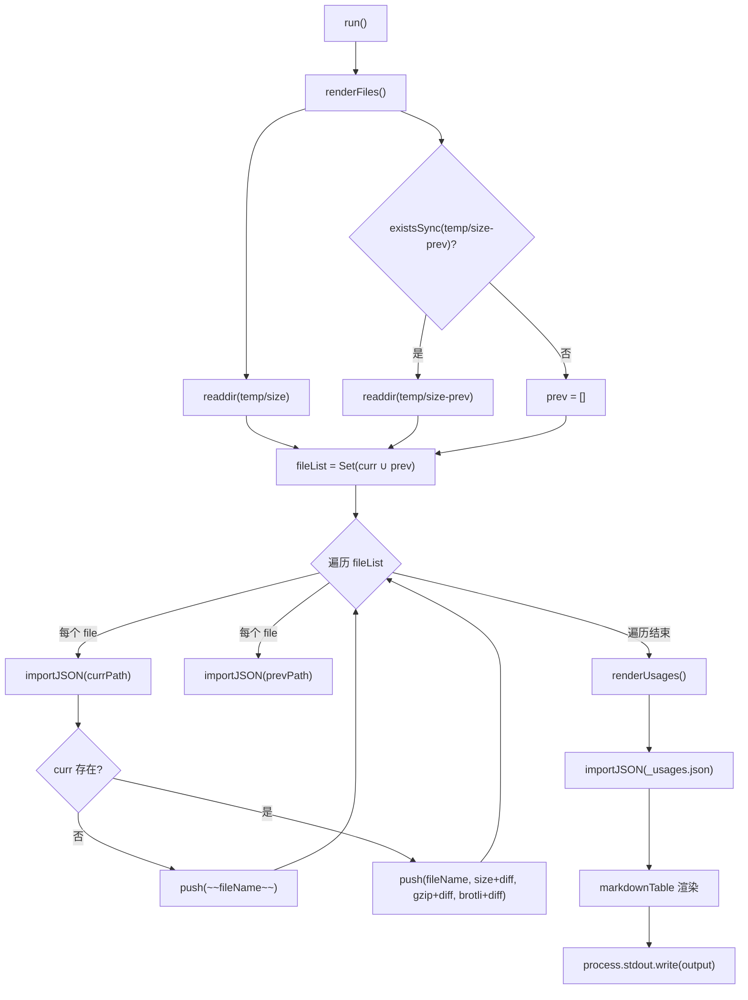
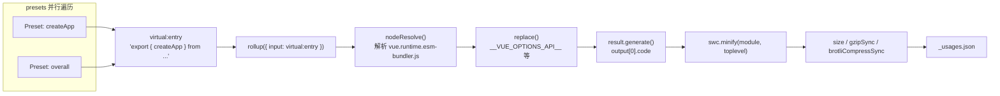

# Zurück nach oben ↑

Im vorherigen Kapitel haben wir gesehen, wie Vue mit GitHub Actions Linting, Typprüfung, Tests und Größenverfolgung in eine nicht umgehbare Pipeline integriert, wobei size-report.yml und size-data.yml dafür verantwortlich sind, nach jeder Änderung Größen-Daten zu hinterlassen. Aber die Pipeline führt nur aus; was tatsächlich beantwortet, „um wie viel größer und wo größer", sind die beiden Skripte, die in diesem Kapitel analysiert werden. Der Kernkonflikt des Größenbudgets liegt darin: Die Paketgröße ist eine Metrik, die nur wahrgenommen, aber schwer präzise zugeordnet werden kann. Wenn Benutzer sich beschweren, dass „Vue zu groß ist", müssen die Maintainer drei Fragen beantworten – um wie viel größer? Wo größer? Hat diese Änderung es noch größer gemacht? scripts/size-report.js ist für den Vergleich zuständig, scripts/usage-size.js für die Zuordnung; beide bilden gemeinsam die Messphilosophie des Größenbudgets.

# 11.1 size-report: Größenunterschiede in eine lesbare Markdown-Tabelle verwandeln

## Intuitives Modell

Stellen Sie sich vor, Sie sind Qualitätsprüfer bei einem Logistikunternehmen. Jedes Paket (Build-Artefakt) muss vor dem Versand gewogen werden, und Ihre Aufgabe ist nicht das Wiegen selbst, sondern „das heutige Gewicht" und „das gestrige Gewicht" nebeneinander in eine Tabelle zu setzen und mit fettgedrucktem`+2.3 kB`zu markieren, welche Pakete schwerer geworden sind. Ohne diese Vergleichstabelle sehen Maintainer nur eine Ansammlung isolierter Zahlen und können nicht beurteilen, ob ein PR eine Größenregression eingeführt hat.

`size-report.js`ist genau dieser Qualitätsprüfer. Es erzeugt keine Größen-Daten (das ist Aufgabe von`usage-size.js`und den Build-Skripten), es konsumiert nur JSON-Dateien aus zwei Verzeichnissen und generiert einen Markdown-Bericht.

## Datenstruktur und Verzeichniskonventionen

Die Kernkonventionen des Skripts verbergen sich in zwei Konstanten. Das aktuelle Datenverzeichnis ist`temp/size`, das historische Basisverzeichnis ist`temp/size-prev`。

[FACT:scripts/size-report.js:23-24]

Die Benennung dieser beiden Verzeichnisse ist nicht willkürlich:`temp/size`wird vom`size-data.yml`-Workflow bei jedem Lauf generiert und als Artefakt hochgeladen[FACT:.github/workflows/size-data.yml:53-57], während`temp/size-prev`von`size-report.yml`nach dem Herunterladen des Basis-Artefakts entpackt wird. Der Verzeichnisname selbst ist der Vertrag des Datenflusses.

Das Skript definiert drei Typ-Aliase, die die Struktur der JSON-Dateien präzise beschreiben:

[FACT:scripts/size-report.js:8-21]

`SizeResult`hat drei numerische Felder:`size`(unkomprimiert),`gzip`、`brotli`。`BundleResult`fügt darauf basierend das`file`-Feld hinzu, um den Dateinamen anzuzeigen.`UsageResult`ist ein`Record`, der Schlüssel ist der Preset-Name, der Wert ist`SizeResult & { name: string }`– beachten Sie, dass hier ein zusätzliches`name`-Feld vorhanden ist, da die Schlüssel des JSON-Objekts nach`Object.values`verloren gehen und der Name redundant im Wert gespeichert werden muss.

## Step-by-Step Walkthrough

Der Hauptablauf ist minimalistisch, nur zwei Schritte plus eine Ausgabe:

[FACT:scripts/size-report.js:23-38]

`run()`Zuerst wird`renderFiles()`aufgerufen, um die Tabelle der Artefaktdateien zu rendern, dann`renderUsages()`, um die Tabelle der Nutzungsszenarien zu rendern, und schließlich wird der in der Modulvariablen`output`akkumulierte String auf einmal nach stdout geschrieben[FACT:scripts/size-report.js:25]. Dieses Muster „Strings akkumulieren und auf einmal ausgeben" vermeidet den Konkatenierungsaufwand mehrfacher`process.stdout.write`und macht die Ausgabereihenfolge vollständig kontrollierbar.

**Erster Schritt: Dateiliste sammeln und Vereinigung bilden.**

[FACT:scripts/size-report.js:44-49]

`filterFiles`filtert zwei Arten von Dateien heraus: solche, die mit`_`beginnen (wie`_usages.json`), und solche, die mit`.txt`enden (wie`number.txt`、`base.txt`). Diese beiden Dateitypen sind Metadaten, keine Größen-Daten. Dann wird die Vereinigung`fileList`der Dateinamen des aktuellen und des historischen Verzeichnisses gebildet – mit`Set`zur Deduplizierung. Warum die Vereinigung? Weil eine Datei nur im historischen Verzeichnis existieren kann (dieser Build hat das Artefakt gelöscht) oder nur im aktuellen Verzeichnis (dieser Build hat ein Artefakt hinzugefügt). Beide Fälle müssen im Bericht erscheinen.

**Zweiter Schritt: Dateiweiser Vergleich.**

[FACT:scripts/size-report.js:43-75]

Für jede Datei in der Vereinigung wird versucht, JSON aus beiden Verzeichnissen zu importieren.`importJSON`Die Implementierung ist „gibt undefined zurück, wenn die Datei nicht existiert":

[FACT:scripts/size-report.js:112-115]

Hier wird dynamisches`import()`in Kombination mit`with: { type: 'json' }`Import-Assertions verwendet, nicht`fs.readFileSync` + `JSON.parse`. Ersteres wird vom Modul-Loader von Node verarbeitet, letzteres erfordert manuelle Behandlung von Kodierungs- und Parsing-Fehlern. Der Preis für die Wahl von`import()`ist, dass es ein Promise zurückgibt, daher ist das gesamte`renderFiles`async.

Der entscheidende Zweig liegt in`if (!curr)`: Wenn das aktuelle Verzeichnis diese Datei nicht enthält, bedeutet das, dass das Artefakt gelöscht wurde; dann wird die Markdown-Durchstreichungs-Syntax`~~fileName~~`verwendet, um[FACT:scripts/size-report.js:60-61]zu markieren. Andernfalls wird normal eine Zeile gerendert, wobei an jeden numerischen Wert das Ergebnis von`getDiff`angehängt wird.

**Dritter Schritt: Differenz berechnen.**

[FACT:scripts/size-report.js:124-130]

`getDiff`hat drei vorzeitige Rückkehrpunkte:`prev === undefined`gibt einen leeren String zurück (keine Basislinie, kein Vergleich möglich);`diff === 0`gibt einen leeren String zurück (keine Änderung, kein Rauschen anzeigen); andernfalls wird die fettgedruckte vorzeichenbehaftete Differenz zurückgegeben. Beachten Sie, dass`prettyBytes(diff)`auch negative Zahlen korrekt behandelt und`-1.2 kB`ausgibt, während die Variable`sign`nur bei positiven Zahlen ein`+`。

**ergänzt.**

[FACT:scripts/size-report.js:80-103]

`renderUsages`Vierter Schritt: usage-Tabelle rendern.`renderFiles`Der strukturelle Unterschied zu`_usages.json`ist beachtenswert: Es importiert direkt`Object.values(curr)`, da die usage-Daten fest in dieser einen Datei liegen.`prev?.[usage.name]`wandelt das Record in ein Array um und sucht dann über`name`die historischen Daten anhand des Namens – genau deshalb wird das`.filter(usage => !!usage)`-Feld redundant gespeichert.`map`Diese Zeile ist tatsächlich redundant, da

immer ein Array-Element zurückgibt und keinen falsy-Wert erzeugen kann.`markdown-table`Schließlich wird die Bibliothek[FACT:scripts/size-report.js:72-74]。

## Kopieren

> **[Design Inference & Architectural Trade-offs]**
> **〔Design-Schlussfolgerungen und Architektur-Abwägungen〕`import()`Warum`readFileSync`？**statt`import()`verwenden? Dynamische

**`filterFiles`Import-Assertions für JSON sind die Standardpraxis ab Node 20+ und behandeln nativ das Laden von JSON in ESM-Umgebungen. Der Preis ist, dass sie nicht im synchronen Kontext verwendet werden können und jeder Import vom Modul-Cache erfasst wird – aber in diesem Einmal-Skript ist Caching kein Problem.`file[0] !== '_'`Die**-Prüfung von`readdir`Diese Prüfung geht davon aus, dass der Dateiname nicht leer ist. Wenn`file[0]`einen leeren String zurückgibt (theoretisch unmöglich), ist`undefined`，`undefined !== '_'`gleich

**Behandlung gelöschter Artefakte.**Wenn ein Artefakt gelöscht wird, markiert der Bericht es mit Durchstreichung, anstatt es direkt zu entfernen. Das ist beabsichtigtes Design: Maintainer müssen sehen können, „diese Datei ist verschwunden", statt dass sie stillschweigend aus der Tabelle verschwindet. Würde man sie einfach herausfiltern, könnten Leser fälschlich annehmen, das Artefakt habe nie existiert.

# 11.2 usage-size: Simulation des Import-Szenarios eines echten Nutzers

## Intuitives Modell

`size-report`sagt dir „wie groß das vollständige Paket ist", aber das beantwortet nicht die Frage, die Nutzer wirklich interessiert: „Wenn ich nur`createApp`verwende, wie viel Code muss ich tatsächlich herunterladen?" Die Größe des vollständigen Pakets enthält viel Code, den du wahrscheinlich nie brauchst (z. B.`defineCustomElement`、`Transition`、`KeepAlive`）。`usage-size.js`besteht darin, einen „typischen Nutzer" zu spielen: eine virtuelle Einstiegsdatei schreiben, die nur bestimmte APIs importiert, mit Rollup bündeln und sehen, wie groß das endgültige Artefakt ist.

Das ist so, als würde ein Restaurant dir nicht sagen „alle Zutaten in der Küche wiegen insgesamt 50 Kilogramm", sondern „wenn du eine Portion Kung Pao Huhn bestellst, sind die tatsächlich verwendeten Zutaten 300 Gramm".

## Datenstruktur: Preset-Array

Die zentrale Datenstruktur des Skripts ist`presets`Array, wobei jedes Element ein Nutzungsszenario beschreibt:

[FACT:scripts/usage-size.js:27-55]

`Preset`Der Typ hat drei Felder:`name`(Anzeigename),`imports`(Liste der aus Vue importierten APIs), optional`replace`(zusätzliche Compile-Zeit-Ersetzungen). Fünf Presets decken Nutzungsszenarien vom kleinsten bis zum größten ab:

- `createApp (CAPI only)`: nur importieren`createApp`, und`__VUE_OPTIONS_API__`ersetzen durch`'false'`, Simulation eines reinen Composition-API-Nutzers[FACT:scripts/usage-size.js:35-40]
- `createApp`: nur importieren`createApp`, Options API beibehalten[FACT:scripts/usage-size.js:35-40]
- `createSSRApp`: SSR-Szenario[FACT:scripts/usage-size.js:35-40]
- `defineCustomElement`: Web-Components-Szenario[FACT:scripts/usage-size.js:35-40]
- `overall`: sechs Kern-APIs importieren, Simulation eines „voll ausgestatteten" Nutzers[FACT:scripts/usage-size.js:44-54]

Die Einstiegsdatei ist fest auf das runtime-only esm-bundler-Artefakt gesetzt:

[FACT:scripts/usage-size.js:24-28]

Auswahl`vue.runtime.esm-bundler.js`statt der vollständigen Version`vue.esm-bundler.js`, weil die Runtime-Version keinen Template-Compiler enthält und damit näher an der tatsächlichen Situation moderner Build-Tool-Nutzer liegt – sie verwenden SFCs zum Vorkompilieren von Templates und benötigen keinen Runtime-Compiler.

## Step-by-Step Walkthrough

**Erster Schritt: Alle Preset-Bundles parallel erzeugen.**

[FACT:scripts/usage-size.js:62-69]

`main()`Für jedes Preset`generateBundle`Promise erstellen, mit`Promise.all`parallel ausführen. Parallelität ist hier sicher, weil jeder`generateBundle`Aufruf unabhängig ist`rollup()`, keinen gemeinsamen Zustand teilt.

**Zweiter Schritt: Virtuellen Einstieg konstruieren.**

[FACT:scripts/usage-size.js:94-96]

Dies ist der raffinierteste Teil des gesamten Skripts. Es schreibt keine temporäre Datei auf die Festplatte, sondern konstruiert eine virtuelle Modul-ID`virtual:entry`, deren Inhalt eine re-export-Anweisung ist:`export { createApp } from '/absolute/path/to/vue.runtime.esm-bundler.js'`. Beachte`entry`ist ein absoluter Pfad, weil Rollup ihn auflösen können muss.

**Dritter Schritt: Rollup-Plugin-Kette konfigurieren.**

[FACT:scripts/usage-size.js:98-121]

Die Reihenfolge des Plugin-Arrays ist entscheidend:

1. **Benutzerdefiniert`usage-size-plugin`**：`resolveId`abfangen`virtual:entry`gibt sich selbst zurück,`load`gibt virtuellen Inhalt zurück[FACT:scripts/usage-size.js:101-110]. Dies ist das Standardmuster für virtuelle Module in Rollup.

2. **`nodeResolve()`**: auflösen`vue.runtime.esm-bundler.js`interne import[FACT:scripts/usage-size.js:111]。

3. **`replace`**: Compile-Zeit-Konstanten injizieren[FACT:scripts/usage-size.js:112-119]。

`replace`Die Plugin-Konfiguration offenbart den Kernmechanismus des esm-bundler-Artefakts: Es behält`__VUE_OPTIONS_API__`、`__VUE_PROD_DEVTOOLS__`und andere Runtime-Flags bei, die vom Build-Tool des Nutzers ersetzt werden. Hier übernimmt das Skript die Ersetzung für den Nutzer:

- `process.env.NODE_ENV` → `"production"`: Produktionszweig verwenden
- `__VUE_PROD_DEVTOOLS__` → `'false'`: devtools-Unterstützung deaktivieren
- `__VUE_PROD_HYDRATION_MISMATCH_DETAILS__` → `'false'`: ausführliche Hydration-Fehlermeldungen deaktivieren
- `__VUE_OPTIONS_API__` → `'true'`: Options API standardmäßig beibehalten

Dann`...preset.replace`erweitern, damit Presets die Standardwerte überschreiben können.`createApp (CAPI only)`Das Preset nutzt genau diesen Mechanismus, um`__VUE_OPTIONS_API__`zu ändern in`'false'` [FACT:scripts/usage-size.js:35-40]。

`preventAssignment: true`Ersetzung verhindern`obj.process.env.NODE_ENV = x`solcher Zuweisungsanweisungen[FACT:scripts/usage-size.js:117]。

**Vierter Schritt: Generieren, Komprimieren, Messen.**

[FACT:scripts/usage-size.js:123-134]

`result.generate({})`Code erzeugen,`output[0].code`abrufen. Dann mit SWC komprimieren:

[FACT:scripts/usage-size.js:125-130]

`module: true`bedeutet, die Eingabe ist ESM,`toplevel: true`erlaubt das Komprimieren von Variablennamen im Top-Level-Scope. Nach der Komprimierung werden drei Metriken berechnet:`minified.length`(Byte-Länge),`gzipSync(minified).length`、`brotliCompressSync(minified).length`。

Beachte, dass hier`node:zlib`synchrone API verwendet wird, nicht die asynchrone Version. In einem Einmal-Skript ist die synchrone API prägnanter, und die Komprimierung selbst ist eine CPU-intensive Operation, sodass Asynchronität keinen Parallelitätsgewinn bringt.

**Fünfter Schritt: Ausgabe und Persistenz.**

[FACT:scripts/usage-size.js:62-86]

Die Ergebnisse werden zunächst in menschenlesbarem Format auf der Konsole ausgegeben, mit`pico`eingefärbt[FACT:scripts/usage-size.js:62-86]. Dann in`temp/size/_usages.json`schreiben, mit`Object.fromEntries`das Array zurück in ein Record umwandeln, Schlüssel ist der Preset-Name[FACT:scripts/usage-size.js:81-85]。

`--write`Das Flag steuert, ob zusätzlich das unkomprimierte Bundle jedes Presets auf die Festplatte geschrieben wird[FACT:scripts/usage-size.js:136-138], zum Debuggen.

## Designüberlegungen und Stolperfallen

> **[Design Inference & Architectural Trade-offs]**
> **Warum virtuelle Module statt temporärer Dateien?**Temporäre Dateien erfordern die Behandlung von Pfaden, Bereinigung und Konflikten bei gleichzeitigen Schreibvorgängen. Virtuelle Module behalten den Einstiegsinhalt im Speicher, und Rollups`resolveId`/`load`Hook unterstützt dieses Muster von Natur aus. Der Preis ist, dass die ID exakt übereinstimmen muss; jeder Tippfehler führt dazu, dass Rollup „Einstieg kann nicht aufgelöst werden" meldet.

**`replace`Die`preventAssignment`Falle.**Wenn`preventAssignment: true`，`replace`nicht gesetzt wird, ersetzt das Plugin auch`process.env.NODE_ENV = 'x'`solche Zuweisungsanweisungen und erzeugt`"production" = 'x'`Syntaxfehler. Im Vue-Quellcode existieren tatsächlich Zuweisungen an`process.env.NODE_ENV`(in Testwerkzeugen), daher ist diese Option erforderlich.

**`__VUE_OPTIONS_API__`Wahl des Standardwerts.**Das Skript setzt den Standardwert auf`'true'` [FACT:scripts/usage-size.js:116], nicht auf`'false'`. Dies ist eine konservative Wahl: Wenn der Nutzer nichts konfiguriert, behält Vue die Options-API-Unterstützung bei.`createApp (CAPI only)`Das Preset überschreibt explizit auf`'false'`, um den Größenvorteil nach dem Deaktivieren zu zeigen. Dieser Vergleich ist selbst Dokumentation für den Nutzer: Er zeigt, „wie viel man spart, wenn man die Options API abschaltet".

**Parallel`Promise.all`Fehlersemantik.**Wenn das Bündeln eines Presets fehlschlägt,`Promise.all`wird sofort abgelehnt, andere laufende Bundling-Vorgänge werden nicht abgebrochen (Rollup bietet keinen Abbruchmechanismus). In CI bedeutet dies, dass ein Fehler die Berechnung anderer Presets verschwendet, aber das Skript selbst mit einem Nicht-Null-Exit-Code endet, den CI korrekt erfassen kann.

# 11.3 Von Daten zur Zugangskontrolle: Wie CI diese Berichte konsumiert

## Datenfluss-Panorama

Um diese beiden Skripte zu verstehen, muss man sie in die CI-Pipeline einordnen.`size-data.yml`läuft bei Push auf main/minor oder bei PR`pnpm run size` [FACT:.github/workflows/size-data.yml:45], erzeugt`temp/size`Verzeichnis, lädt es dann als Artifact hoch[FACT:.github/workflows/size-data.yml:53-57]。

Für PRs schreibt es zusätzlich zwei Metadatendateien:

[FACT:.github/workflows/size-data.yml:47-51]

`number.txt`speichert die PR-Nummer,`base.txt`speichert den Namen des Zielbranches. Diese beiden Dateien sind genau die`size-report.js`in`filterFiles`herauszufilternden`.txt`Dateien[FACT:scripts/size-report.js:44-45]. Sie existieren, damit der nachgelagerte`size-report.yml`weiß, „mit welcher Baseline verglichen werden soll".

## Abruf und Vergleich der Baseline

`size-report.yml`(im vorherigen Kapitel ausführlich beschrieben) ist: das`size-data`Artifact des aktuellen PR herunterladen, das Baseline-Artifact des Zielbranches herunterladen, die Baseline nach`temp/size-prev`entpacken und dann`size-report.js`ausführen, um einen Markdown-Bericht zu erzeugen und als Kommentar zum PR hinzuzufügen.

Hier gibt es eine entscheidende Design-Einschränkung:`size-report.js`selbst ist nicht für den Abruf der Baseline verantwortlich, es setzt voraus, dass`temp/size-prev`bereits existiert. Falls nicht,`existsSync(prevDir)`gibt false zurück,`prev`ist ein leeres Array[FACT:scripts/size-report.js:48], alle Diffs sind leere Strings. Dies ist eine elegante Degradierung: Ohne Baseline wird der Bericht trotzdem erzeugt, nur ohne Unterschiede anzuzeigen.

## Die Entscheidungslogik der Größen-Zugangskontrolle

> **[Design Inference & Architectural Trade-offs]**
> Ein häufiges Missverständnis muss geklärt werden:`size-report.js`selbst trifft keine Zugangsentscheidung. Es erzeugt nur Berichte, gibt keinen Exit-Code zurück, setzt keine Schwellenwerte. Die eigentliche Zugangskontrolle findet auf der Ebene des`size-report.yml`Workflows statt – dieser kann einen Schritt enthalten, der die Diff-Werte im Bericht parst und den Job fehlschlagen lässt, wenn ein Schwellenwert überschritten wird.

Dieses Design der „Trennung von Messung und Entscheidung" hat einen tiefen Grund: Das Messskript sollte rein bleiben und nur Fakten produzieren; die Entscheidungslogik sollte auf Workflow-Ebene liegen, da Schwellenwerte je nach Version, Branch und Release-Phase variieren können. Schwellenwerte fest in`size-report.js`zu kodieren würde seine Wiederverwendbarkeit erschweren.

# Design-Überlegungen

**Warum braucht das Größenbudget zwei Messgrößen?**Die vollständige Paketgröße und die Usage-Größe beantworten unterschiedliche Fragen. Die vollständige Paketgröße ist die „Obergrenze" – sie sagt, wie viel der Nutzer im schlimmsten Fall herunterladen muss. Die Usage-Größe ist der „typische Wert" – sie sagt, wie viel die meisten Nutzer tatsächlich herunterladen. Erst beide zusammen ergeben ein vollständiges Größenbild. Gäbe es nur die vollständige Paketgröße, würden Maintainer dazu neigen, seltene APIs übermäßig zu optimieren; gäbe es nur die Usage-Größe, könnten Größencxplosionen in bestimmten Randfällen übersehen werden.

**Die Bedeutung der Doppelmetrik gzip und brotli.**Moderne CDNs unterstützen brotli weitgehend, aber nicht in allen Szenarien ist es aktiviert. Beide gleichzeitig zu berichten ermöglicht Maintainern einzuschätzen, „wie die Größe in Umgebungen aussieht, die nur gzip unterstützen". brotli ist typischerweise 15-20% kleiner als gzip, und dieser Unterschied selbst ist wertvolle Information.

**Der Stabilitätsvertrag des Datenformats.** `size-report.js`und`usage-size.js`sind über JSON-Dateien entkoppelt.`usage-size.js`schreibt`_usages.json`，`size-report.js`liest es. Die Feldnamen dieses Vertrags (`name`、`size`、`gzip`、`brotli`) sind implizit, es gibt keine Schema-Validierung. Wenn`usage-size.js`Feldnamen ändert und vergisst,`size-report.js`zu synchronisieren, zeigt der Bericht stillschweigend falsche Daten an. Dies ist die Schwachstelle des aktuellen Designs.

# Zusammenfassung dieses Kapitels

# Überlegungen und Selbsttests zu diesem Kapitel

Q1: `size-report.js`von`filterFiles`filtert Dateien heraus, die mit`_`beginnen. Wenn`usage-size.js`die Ausgabedatei von`_usages.json`in`usages.json`umbenennt, was passiert?

**Referenzauflösung**：`filterFiles`Die Filterbedingung von`file[0] !== '_' && !file.endsWith('.txt')` [FACT:scripts/size-report.js:44-45]ist`usages.json`. Wenn die Datei in`_`umbenannt wird, beginnt sie nicht mehr mit`filterFiles`, wird von`fileList`behalten, geht in die`renderFiles`-Vereinigung ein. Dann wird`importJSON`versuchen, sie als Bundle-Datei zu behandeln:`Record<string, UsageResult>`kann erfolgreich importiert werden (es ist gültiges JSON), aber ihre Struktur ist`BundleResult`statt`curr?.file`, daher ist`undefined`，`fileName`ein leerer String,`curr.size`ist ebenfalls`undefined`，`prettyBytes(undefined)`wird einen Fehler werfen oder abnormale Ausgabe erzeugen. Dies führt zum Scheitern der Berichtserzeugung. Die Ursache dieses Problems ist, dass`filterFiles`das Dateinamen-Präfix als Unterscheidungskriterium für „Metadaten vs. Daten" verwendet, statt Verzeichnisstruktur oder explizite Manifeste zu nutzen. Robuster wäre, Usage-Daten in einem Unterverzeichnis abzulegen oder eine explizite Liste von Metadatendateien zu pflegen.

Q2: `usage-size.js`In`Promise.all(tasks)`werden alle Presets parallel gebündelt. Wenn die`replace`-Konfiguration eines Presets`__VUE_OPTIONS_API__`auslässt, was passiert? Warum ist der Standardwert`'true'`statt`'false'`？

**Referenzauflösung**：`replace`In der Plugin-Konfiguration ist`__VUE_OPTIONS_API__: 'true'`der Standardwert, dann wird`...preset.replace`expandiert, um[FACT:scripts/usage-size.js:116-118]zu überschreiben. Wenn ein Preset die Konfiguration auslässt, verwendet es den Standardwert`'true'`, d.h. Options-API-Unterstützung bleibt erhalten, die Größe wird größer. Der Standardwert`'true'`ist eine konservative Wahl: Er spiegelt „das tatsächliche Verhalten, wenn der Nutzer nichts konfiguriert" wider. In Vue's esm-bundler-Artefakten ist`__VUE_OPTIONS_API__`das Standardverhalten, die Options-API beizubehalten (es sei denn, der Nutzer deaktiviert sie explizit). Würde man den Standardwert auf`'false'`setzen, würden alle nicht explizit konfigurierten Presets eine zu kleine Größe anzeigen und Nutzer irreführen zu glauben, „ohne Konfiguration lässt sich Größe sparen".`createApp (CAPI only)`Das Preset setzt explizit`'false'` [FACT:scripts/usage-size.js:35-40], genau um „den Gewinn nach explizitem Deaktivieren" zu zeigen und einen Kontrast zum Standardwert zu bilden.

Q3: `size-report.js`Das`importJSON`von`import()`verwendet dynamisches`fs.readFileSync`statt`temp/size-prev`. Wenn eine JSON-Datei im

**-Verzeichnis beschädigt ist (ungültiges JSON), wie unterscheiden sich die beiden Implementierungen?**Referenzauflösung`import()`: Dynamisches`SyntaxError`wirft beim Parsen ungültigen JSONs einen`importJSON`, und dieser Fehler kann nicht von der`existsSync`-internen`existsSync`Es wird nur geprüft, ob die Datei existiert, nicht ob der Inhalt gültig ist[FACT:scripts/size-report.js:112-115]. Fehler werden nach oben propagiert an`renderFiles`, was dazu führt, dass die gesamte Berichterstellung fehlschlägt. Wenn man`fs.readFileSync` + `JSON.parse`verwendet, wird ebenfalls ein Fehler geworfen, aber man kann innerhalb von`importJSON`einen try-catch-Block verwenden und`undefined`zurückgeben, um eine elegante Degradierung zu erreichen. Die aktuelle Implementierung lässt Fehler propagieren, mit der impliziten Annahme, dass „das JSON im Artefakt immer gültig ist“ – diese Annahme gilt in CI-Umgebungen normalerweise, da die Dateien von`usage-size.js`und Build-Skripten generiert werden. Beim lokalen Debuggen jedoch, wenn die JSON-Datei manuell geändert und beschädigt wird, stürzt der Bericht direkt ab, anstatt die Datei zu überspringen. Dies ist eine Designentscheidung, die „der Datenquelle vertraut“.

---

Der Größenbudget-Mechanismus löst die Fragen „was messen“ und „wie vergleichen“, aber er setzt eine Prämisse voraus: Das Build-Artefakt selbst ist reproduzierbar. Das nächste Kapitel führt in die minimale Debug-Sandbox ein:`vite-debug`Wie man mit minimaler Konfiguration eine interaktive Vue-Entwicklungsumgebung startet und wie sie mit lokalen Build-Artefakten interagiert, um einen geschlossenen Kreislauf von Quellcode-Änderungen bis zur Laufzeitvalidierung zu bilden.

Damit ist der Messkreislauf des Größenbudgets klar: size-report.js beantwortet mit dem Verzeichnisvergleich „um wie viel größer“, usage-size.js simuliert mit virtuellen Modulen reale Importszenarien und beantwortet „wo größer“, während die Gate-Entscheidung der Workflow-Ebene überlassen bleibt. Dieser Mechanismus verwandelt Größenregressionen von vagen Beschwerden in nachverfolgbare Daten. Aber Daten können nur sagen, dass ein Problem existiert; um es wirklich zu lokalisieren und zu beheben, braucht man eine minimale Umgebung, die das Problem schnell reproduziert. Das nächste Kapitel führt in packages-private/vite-debug ein und zeigt, wie Vue mit Vite + SFC eine minimalistische Debug-Sandbox aufbaut und „minimale Reproduktion auf echtem Quellcode“ zu einer praktikablen Alltagspraxis macht.
