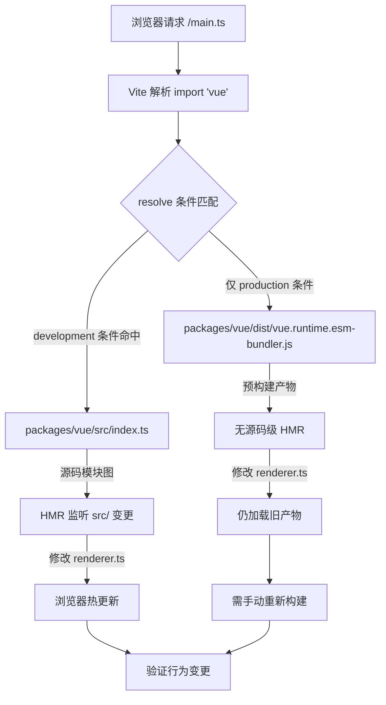

# Kapitel 12: Minimale Debug-Sandbox: vite-debug und lokaler Entwicklungskreislauf

Im vorherigen Kapitel haben wir den Messkreislauf des Größenbudgets abgeschlossen: size-report.js beantwortet „um wie viel größer“, usage-size.js beantwortet „wo größer“, und die Workflow-Ebene ist für die Gate-Entscheidung verantwortlich. Dieser Mechanismus hat jedoch eine implizite Voraussetzung – das Build-Artefakt selbst ist reproduzierbar. Wenn man feststellt, dass ein Paket ungewöhnlich stark an Größe zunimmt oder ein Laufzeitverhalten nicht den Erwartungen entspricht, braucht man eine minimale Umgebung, die lokalen Quellcode schnell lädt und Änderungen sofort sichtbar macht. packages-private/vite-debug ist diese Umgebung. Sie hat nur vier Dateien und insgesamt weniger als 40 Zeilen Code, bildet aber den Einstieg in die Alltagspraxis „minimale Reproduktion auf echtem Quellcode“ im Vue-core-Repository. Dieses Kapitel zerlegt die Konstruktionslogik dieser Sandbox Datei für Datei und erklärt, warum sie unter packages-private und nicht unter packages liegt.

# I. Das Skelett der Sandbox:`main.ts`und`App.vue`minimale Mount-Kette

## Intuitives Modell

Wenn man die gesamte Vue-Laufzeit mit einem Motor vergleicht, dann ist`vite-debug`ein „nackter Prüfstand“ – ohne Gehäuse, ohne Armaturenbrett, nur mit der minimalen Verkabelung, damit der Motor läuft. Sein Wert liegt nicht in funktionaler Vollständigkeit, sondern darin,**alle störenden Variablen auszuschließen**: Wenn man vermutet, dass ein Bug im Reaktivitätssystem oder im Renderer liegt, möchte man nicht, dass die Komplexität der Debug-Umgebung selbst zur Rauschquelle wird.

## Datenstruktur und Dateilayout

Zuerst der gesamte Inhalt von`main.ts`:

[FACT:packages-private/vite-debug/main.ts:4-4]

```ts
import { createApp } from 'vue'
import App from './App.vue'

const app = createApp(App)

app.mount('#app')
```

Diese sechs Zeilen Code sind das Standardparadigma zum Starten einer Vue-Anwendung, aber jede Zeile hat im Debug-Szenario eine präzise technische Bedeutung:

- **L1**In`import { createApp } from 'vue'`von`'vue'`hängt davon ab, wohin der Modulbezeichner`vite.config.ts`letztlich aufgelöst wird, vollständig von den Abhängigkeitsdeklarationen in`package.json`und
- **L2**ab. Dies ist der entscheidende Punkt der gesamten Sandbox – wir werden später sehen, wie er auf lokalen Quellcode zeigt.`import App from './App.vue'`Das`@vitejs/plugin-vue`von`App.vue`löst die SFC-Kompilierungspipeline von`<script>`、`<template>`、`<style>`aus: Vite registriert dieses Plugin beim Start des Dev-Servers; wenn der Browser
- **L4**anfordert, zerlegt das Plugin es in`createApp(App)`drei virtuelle Module, die separat kompiliert werden.`app._context`、`app._instance`Das
- **L6**von`app.mount('#app')`erstellt die Anwendungsinstanz; zu diesem Zeitpunkt initialisiert Vue intern`app`und andere Kernfelder, löst aber noch kein Rendering aus.

Das`index.html`von`index.html`ist der eigentliche Startschalter: Es sucht im DOM das Containerelement mit der ID`<div id="app"></div>`, erstellt die Root-Komponenteninstanz und löst das erste Rendering aus.`<script type="module" src="/main.ts"></script>`Beachten Sie, dass hier kein Verweis auf`app.mount('#app')`vorhanden ist – Vites Konvention ist, dass

## im Projektstammverzeichnis als Einstiegs-HTML dient, das

und`App.vue`enthält. Obwohl diese Datei nicht in den keyFiles dieses Kapitels steht, ist sie die Voraussetzung dafür, dass

[FACT:packages-private/vite-debug/App.vue:4-8]

```vue

import { ref } from 'vue'

const count = ref(0)

  {{ count }}

button {
  color: red;
}

```

Szenariogesteuerter Walkthrough: Die vollständige Kette eines Klicks**Nun betrachten wir**

**, den „Versuchsträger“ dieser Sandbox:**

`@vitejs/plugin-vue`Kopieren`App.vue`In ein konkretes Szenario übertragen:

- `<script setup>`Was passiert, wenn der Benutzer im Browser auf die Schaltfläche klickt?`setup()`Erster Schritt: SFC-Kompilierungsphase (beim Start des Dev-Servers)`ref(0)`kompiliert`RefImpl`in drei Teile:`.value`Der`0`。
- `<template>`-Block wird in die`{{ count }}`-Funktion der Komponente kompiliert,`_toDisplayString(count.value)`，`@click="count++"`der Aufruf gibt ein`onClick: $event => (count.value++)`。
- `<style>`-Objekt zurück, dessen`<style>`anfangs

**ist. Der`app.mount`-Block wird in eine Renderfunktion kompiliert,**

`createApp(App)`wird umgewandelt in`mount('#app')`wird die Root-Komponente erstellt`ComponentInternalInstance`, ausgeführt`setup()`ergibt`count`die RefImpl, und dann wird die Render-Funktion aufgerufen, um den VNode-Baum zu erzeugen. In der Render-Funktion wird`count.value`gelesen, was`track`auslöst, Abhängigkeiten zu sammeln – der aktuell aktive Render-Effekt (`ReactiveEffect`) wird in`count`in`dep`aufgezeichnet.

**Dritter Schritt: Klick-Ereignis (bei Benutzerinteraktion)**

Der Browser löst das`click`-Ereignis aus, und der Event-Handler von Vue führt`count.value++`aus. Dies ist eine Setter-Operation, die`trigger`auslöst: Durchlaufen der in`count.dep`gesammelten Effekte und Planen des erneuten Renderns. Da es sich um eine synchrone Aktualisierung handelt und sie sich nicht in der Batch-Warteschlange befindet, wird der Render-Effekt sofort ausgeführt, die Render-Funktion erneut aufgerufen, ein neuer VNode erzeugt, ein Diff mit dem alten VNode durchgeführt, festgestellt, dass sich der Textinhalt von`0`zu`1`geändert hat, und das echte DOM aktualisiert`textContent`。

Die gesamte Kette kann mit dem folgenden Datenflussdiagramm dargestellt werden:

```mermaid
flowchart LR
    subgraph compile["编译期 (Vite Dev Server)"]
        sfc["App.vue"] -->|"@vitejs/plugin-vue"| script["setup() 函数"]
        sfc -->|"@vitejs/plugin-vue"| render["渲染函数"]
        sfc -->|"@vitejs/plugin-vue"| style["CSS 模块"]
    end
    subgraph runtime["运行时 (浏览器)"]
        script -->|"ref(0)"| refimpl["RefImpl { value: 0 }"]
        render -->|"读取 count.value"| track["track() 收集依赖"]
        click["用户点击"] -->|"count.value++"| trigger["trigger() 触发更新"]
        trigger -->|"调度渲染副作用"| rerender["重新执行渲染函数"]
        rerender -->|"diff + patch"| dom["更新真实 DOM"]
    end
    track -.->|"dep 记录 ReactiveEffect"| trigger
```

Der Schlüssel an diesem Diagramm ist:**Es gibt nur zwei Kopplungspunkte zwischen den Compile-Zeit-Artefakten und dem Laufzeitverhalten**——`ref(0)`das zurückgegebene RefImpl-Objekt sowie das Lesen und Schreiben von`count.value`in der Render-Funktion. Das bedeutet, wenn du einen bestimmten Zweig des Reaktivitätssystems debuggen möchtest (zum Beispiel`trigger`die Scheduling-Logik in), musst du nur in diesem`App.vue`das entsprechende Lese-/Schreibmuster konstruieren.

## Designüberlegung: Warum`ref`statt`reactive`？

> **[Design Inference & Architectural Trade-offs]**
> Die Wahl von`ref(0)`statt`reactive({ count: 0 })`als Standardbeispiel impliziert eine Debug-Prioritätsüberlegung:`ref`der`.value`-Zugriffspfad ist kürzer, beim Aufklappen im Debugger`RefImpl`können interne Felder wie`_value`、`dep`、`__v_isRef`direkt gesehen werden, während`reactive`das von einem Proxy-Objekt zurückgegebene Proxy beim Aufklappen in der Konsole Getter auslöst, was die Beobachtung des ursprünglichen Zustands stören kann. Für das Szenario „minimale Reproduktion“ bedeutet eine weniger Proxy-Indirektionsschicht weniger Variablen.

---

# Zwei, Alias-Auflösung:`vite.config.ts`und`package.json`wie man`'vue'`auf den lokalen Quellcode zeigt

## Intuitives Modell

`vite.config.ts`hat nur sechs Zeilen, aber es ist das „Routing-Zentrum“ der gesamten Sandbox – es entscheidet, ob`import { createApp } from 'vue'`in`'vue'`letztendlich die veröffentlichte Version von npm lädt oder den Quellcode, der sich im Repository in Entwicklung befindet. Ohne die richtige Alias-Konfiguration könnte der Code, den du in`App.vue`änderst, möglicherweise überhaupt nicht den Vue-Quellcode auslösen, den du gerade debuggst, und das Debugging wird zu „auf das falsche Ziel schießen“.

## Datenstruktur und Auflösungskette

Schauen wir zuerst auf`vite.config.ts`：

[FACT:packages-private/vite-debug/vite.config.ts:4-6]

```ts
import { defineConfig } from 'vite'
import vue from '@vitejs/plugin-vue'

export default defineConfig({
  plugins: [vue()],
})
```

Hier**gibt es keine explizite`resolve.alias`-Konfiguration**. Wie wird also`'vue'`zum lokalen Quellcode aufgelöst? Die Antwort liegt in`package.json`:

[FACT:packages-private/vite-debug/package.json:1-15]

```json
{
  "name": "vite-debug",
  "private": true,
  "type": "module",
  "scripts": {
    "dev": "vite",
    "build": "vite build",
    "serve": "vite preview"
  },
  "devDependencies": {
    "@vitejs/plugin-vue": "catalog:",
    "vite": "catalog:",
    "vue": "workspace:*"
  }
}
```

Der Schlüssel liegt in**L13**：`"vue": "workspace:*"`. Dies ist die Deklaration des pnpm-Workspace-Protokolls und bedeutet, dass`vite-debug`von dem lokalen Paket namens`vue`im Monorepo abhängt und nicht von der Version in der npm-Registry. pnpm erstellt in`node_modules/vue`einen symbolischen Link, der auf`packages/vue`zeigt (das Hauptpaketverzeichnis von Vue).

Aber das reicht noch nicht –`packages/vue`in`package.json`das`main`/`module`/`exports`-Feld zeigt normalerweise auf**Build-Artefakte**(wie`dist/vue.runtime.esm-bundler.js`) und nicht auf den Quellcode unter`src/`. Wenn du`packages/runtime-core/src/renderer.ts`änderst, aber nicht neu baust, lädt Vite weiterhin die alte`dist`-Datei.

> **[Design Inference & Architectural Trade-offs]**
> Deshalb wird im`packages/vue/package.json`des Vue-Core-Repositories normalerweise`"development"`eine bedingte Export-Konfiguration oder ein ähnliches Quellcode-Einstiegsmapping konfiguriert – im Dev-Modus bevorzugt Vites`resolve.conditions`die`development`-Bedingung und lädt dadurch`src/index.ts`statt`dist`. Dieser Mechanismus ermöglicht es`vite-debug`, ohne explizite Alias-Konfiguration nach Änderungen am Quellcode sofort per HMR die Wirkung zu sehen.

## Szenariogesteuerter Walkthrough: Ein`import 'vue'`Auflösungsprozess

In das Szenario eintauchen:**Wenn der Vite-Dev-Server die Anfrage des Browsers nach`main.ts`erhält und auf`import { createApp } from 'vue'`trifft, wie sieht dann die Auflösungskette aus?**



Dieses Flussdiagramm offenbart einen entscheidenden Zweig:**Wenn die`development`-Bedingung nicht korrekt konfiguriert ist, wird der Browser nach Änderungen am Quellcode nicht hot-updaten**, und du gerätst in die Verwirrung „Code geändert, aber Verhalten unverändert“. Die Fehlersuche besteht darin, im Network-Panel der Browser-DevTools den tatsächlichen Ladepfad des`vue`-Moduls zu prüfen – wenn du den`dist/`-Pfad siehst, bedeutet das, dass das Quellcode-Einstiegsmapping nicht wirksam ist.

## Designüberlegung: Warum nicht in`vite.config.ts`explizit einen Alias schreiben?

> **[Design Inference & Architectural Trade-offs]**
> Eine natürliche Frage ist: Warum nicht direkt in`vite.config.ts`schreiben`resolve: { alias: { vue: '../../packages/vue/src/index.ts' } }`? Das ist zwar intuitiv, hat aber zwei Probleme:

1. **Es zerstört Subpfad-Importe**: Die öffentliche API von Vue enthält`vue/server-renderer`、`vue/compiler-sfc`und andere Subpfade. Wenn nur`'vue'`selbst aliast wird, laufen Subpfad-Importe weiterhin über`dist`, was dazu führt, dass einige Module aus dem Quellcode und andere aus den Build-Artefakten stammen, mit inkonsistentem Verhalten.

2. **Es umgeht den bedingten Exportmechanismus**: In Vues`package.json`hat das`exports`-Feld bereits ein vollständiges bedingtes Export-Mapping definiert (`development`/`production`/`browser`/`node`usw.), und der Alias würde diesen Mechanismus überschreiben, sodass die Auflösung im Debugging-Umfeld von der im echten Benutzerumfeld abweicht.

Daher`vite-debug`wählt`package.json`die Kombination „Workspace-Protokoll vertrauen + bedingte Exporte“, um die Auflösungskette so nah wie möglich am realen Nutzungsszenario zu halten. Das erklärt auch, warum`"vue": "workspace:*"`in`node_modules/vue`erforderlich ist – es ist die Voraussetzung dafür, den pnpm-Symlink auszulösen und Vite dadurch`packages/vue`finden zu lassen.

## Produktions-Fallstricke:`catalog:`Protokoll- und Versionsdrift

Beachte`package.json`in**L11-L12**verwendet das`"catalog:"`-Protokoll:

```json
"@vitejs/plugin-vue": "catalog:",
"vite": "catalog:",
```

Dies ist eine pnpm-Catalog-Funktion und bedeutet, dass die Versionsnummer zentral über das`pnpm-workspace.yaml`-Feld in`catalog`verwaltet wird. Ihre Aufgabe ist es,**Versionsdrift zu vermeiden, wenn im Monorepo mehrere Pakete dieselbe Abhängigkeit referenzieren**。

> **[Design Inference & Architectural Trade-offs]**
> Im Debugging-Szenario bringt dies eine versteckte Falle mit sich: Wenn du in`vite-debug`Bei einem vermuteten Bug in Vite oder plugin-vue möchte man temporär die Version aktualisieren, um dies zu verifizieren. Direktes Ändern von`package.json`in`catalog:`ist wirkungslos – man muss die catalog-Definition in`pnpm-workspace.yaml`ändern, was alle Pakete betrifft, die diesen catalog verwenden. Die korrekte Vorgehensweise ist, temporär eine explizite Versionsnummer zu verwenden (z. B.`"vite": "5.0.0"`), und nach der Verifizierung wieder auf`catalog:`。

---

# Drei,`packages-private`Isolationsdesign: Warum die Debug-Sandbox nicht veröffentlicht wird

## Intuitives Modell

`packages-private`Das Verzeichnis ist wie ein „internes Labor" eines Unternehmens – die darin enthaltenen Muster werden nicht extern verkauft, sondern nur für Tests und Demonstrationen verwendet. Es ist physisch vom`packages`Verzeichnis isoliert, um zu verhindern, dass Debug-Code versehentlich auf npm veröffentlicht wird.

## Drei Schutzschichten des Isolationsmechanismus

**Erste Schicht: Verzeichnisisolation**

`packages-private/vite-debug`befindet sich nicht unter`packages/`, während`pnpm-workspace.yaml`normalerweise sowohl`packages/*`als auch`packages-private/*`als Workspace-Mitglieder deklariert, aber das Veröffentlichungsskript (z. B.`scripts/release.js`) nur die Pakete unter`packages/`durchläuft.

**Zweite Schicht:`private: true`**

[FACT:packages-private/vite-debug/package.json:3]

```json
"private": true,
```

Diese Zeile ist eine harte Einschränkung von npm/pnpm: Pakete, die als`private`markiert sind,**können niemals durch`npm publish`veröffentlicht werden**, selbst bei manueller Ausführung wird dies abgelehnt. Dies ist die letzte Verteidigungslinie gegen versehentliche Veröffentlichung.

**Dritte Schicht: Kein`version`-Feld**

Beachten Sie, dass`package.json`kein`version`-Feld enthält. Die npm-Spezifikation verlangt, dass veröffentlichbare Pakete`version`haben müssen; Pakete ohne dieses Feld führen bei`npm publish`zu einem Fehler. Dies ist eine „doppelte Absicherung" – selbst wenn`private`versehentlich gelöscht wird, verhindert das fehlende`version`weiterhin die Veröffentlichung.

## Designüberlegung: Arbeitsteilung zwischen Debug-Sandbox und Playground

Im Vue-Core-Repository gibt es bereits einen voll funktionsfähigen`SFC Playground`(in Kapitel 7 diskutiert). Warum wird dann noch`vite-debug`？

> **[Design Inference & Architectural Trade-offs]**
> Die Positionierungen der beiden sind grundlegend verschieden:

| Dimension | SFC Playground | vite-debug |
| --- | --- | --- |
| Laufzeitumgebung | Im Browser (Kompilierung ebenfalls im Browser) | Node.js + Browser |
| Quellcode-Laden | Über CDN oder vorgefertigte Artefakte | Direktes Laden des lokalen Quellcodes |
| Debug-Fähigkeit | Beschränkt durch Browser-Sandbox | Node.js-Debugger, Breakpoints verfügbar |
| Quellcode-Änderung | Nicht unterstützt | HMR unterstützt |
| Anwendungsszenarien | Kompilierungsausgabe verifizieren, Reproduktionen teilen | Internes Laufzeitverhalten debuggen |

`vite-debug`Der Kernwert von**liegt darin, dass es in einer echten Node.js-Umgebung läuft**, man kann mit`node --inspect`einen Debugger anhängen, in`packages/reactivity/src/effect.ts`Breakpoints setzen und den Erstellungs- und Scheduling-Prozess von`ReactiveEffect`beobachten. Dies kann der Playground nicht bieten.

## Produktions-Fallstricke: HMR-Grenzen und Zustandsverlust

> **[Design Inference & Architectural Trade-offs]**
> Bei der Verwendung von`vite-debug`zum Debuggen gibt es eine häufige Verwirrung: Nach Änderung des`App.vue`-Anfangswerts in`count`wird der Zähler im Browser nicht zurückgesetzt. Dies liegt daran, dass Vites HMR`<script setup>`-Blöcke so behandelt, dass**der Komponentenzustand beibehalten und nur die Render-Funktion ersetzt wird**. Wenn Sie den Zustand vollständig zurücksetzen müssen, müssen Sie die Seite manuell aktualisieren oder`App.vue`in`import.meta.hot?.invalidate()`hinzufügen, um ein vollständiges Seiten-Refresh zu erzwingen.

Eine weitere Falle: Wenn Sie den Quellcode unter`packages/runtime-core/src/`ändern, wird die HMR-Propagierungskette möglicherweise nicht automatisch ausgelöst – weil`vite-debug`die HMR-Grenze auf der Ebene von`App.vue`definiert ist, während Quellcode-Änderungen unter`packages/`durch Vites Modulgraph propagiert werden müssen. Wenn der Browser nach einer Quellcode-Änderung nicht reagiert, prüfen Sie die Vite-Terminalausgabe auf`hmr update`-Logs; falls keine vorhanden sind, muss möglicherweise der Dev-Server neu gestartet werden.

---

# Kapitelzusammenfassung

`packages-private/vite-debug`Mit vier Dateien und weniger als 40 Zeilen Code wird ein vollständiger Debug-Kreislauf aufgebaut:

1. **`main.ts`**Bietet eine minimale Mount-Kette:`createApp(App).mount('#app')`, unter Ausschluss jeglicher nicht notwendiger Initialisierungslogik.

2. **`App.vue`**Als Experimentträger:`ref`+ Template-Interpolation + Event-Handling, deckt den Hauptpfad des Reaktivitätssystems ab.

3. **`vite.config.ts` + `package.json`**Durch das`workspace:*`-Protokoll und bedingte Exporte wird`'vue'`auf den lokalen Quellcode aufgelöst, wodurch „Quellcode-Änderung sofort wirksam" erreicht wird.

4. **`packages-private` + `private: true`+ kein`version`**Dreischichtige Isolation, um sicherzustellen, dass Debug-Code nicht versehentlich veröffentlicht wird.

Die Ingenieursphilosophie dieser Sandbox ist:**Die Komplexität der Debug-Umgebung selbst sollte gegen null gehen, die gesamte Komplexität dem zu debuggenden Quellcode überlassen**. Wenn Sie in`packages/reactivity`auf einen schwer reproduzierbaren Bug stoßen,`vite-debug`bietet

# eine Experimentierplattform, die beliebig geändert und sofort verifiziert werden kann.

Kapitel-Überlegungen und Selbsttest`package.json`Q1: Wenn man`"vue": "workspace:*"`in`"vue": "^3.4.0"`zu`vite-debug`ändert, was ändert sich im Browser-Verhalten, nachdem man`packages/reactivity/src/ref.ts`in

**geändert hat? Warum?**Referenzanalyse`"^3.4.0"`: Nach der Änderung zu`packages/vue` [FACT:packages-private/vite-debug/package.json:13]lädt pnpm die veröffentlichte Version von Vue 3.4.x vom npm registry herunter, anstatt auf das lokale`import { createApp } from 'vue'`zu verlinken. Zu diesem Zeitpunkt wird`node_modules/.pnpm/vue@3.4.x/node_modules/vue/dist/vue.runtime.esm-bundler.js`auf`packages/reactivity/src/ref.ts`aufgelöst, also das vorgefertigte Artefakt. Änderungen an`ref`lösen kein HMR aus, da Vites Modulgraph diese Datei überhaupt nicht enthält. Im Browser läuft weiterhin die npm-Version der`workspace:*`-Implementierung. Dieses Experiment verifiziert umgekehrt, dass

Q2: `App.vue`eine notwendige Bedingung für Quellcode-Level-Debugging ist.`<style>`Der`scoped`-Block in`vite-debug`hat kein

**hinzugefügt. Wenn in dieser Sandbox zwei Komponenteninstanzen gleichzeitig gemountet werden, was passiert mit den Styles? In welcher Beziehung steht dies zum Debug-Ziel von**?`scoped`Referenzanalyse`button { color: red }`: Ohne[FACT:packages-private/vite-debug/App.vue:4-8]ist`<button>`ein globales Style`vite-debug`, das auf alle`scoped`-Elemente der Seite wirkt. Wenn zwei Komponenteninstanzen gemountet werden, werden die Buttons beider Instanzen rot. Die Beziehung zum Debug-Ziel besteht darin:`data-v-xxx`ist als „minimale Reproduktion" positioniert, nicht als „Style-Isolationsverifikation". Das Weglassen von`scoped`reduziert die zur Kompilierungszeit injizierte`scoped`-Attributvariable, wodurch die DOM-Struktur im Debugger sauberer wird. Wenn Sie die Kompilierungslogik von`@vitejs/plugin-vue`-Styles debuggen müssen, sollten Sie explizit

hinzufügen und den generierten Attribut-Injektionscode von`packages/runtime-core/src/renderer.ts`beobachten.`patch`Q3: Angenommen, Sie haben in der`console.log`-Funktion von

**eine Zeile**：

hinzugefügt, aber die Browser-Konsole gibt nichts aus. Bitte listen Sie mindestens drei mögliche Ursachen auf und erklären Sie, wie Sie diese einzeln untersuchen würden.**Referenzanalyse**。`'vue'`Ursache eins:`dist`Quellcode-Einstiegspunkt nicht wirksam`src`. Fehlersuche: Im DevTools Network-Panel prüfen`vue`Modul-Ladepfad, wenn er mit`dist/`beginnt, bedeutet dies, dass der bedingte Export nicht übereinstimmt`development`Bedingung[FACT:packages-private/vite-debug/package.json:13]。

Ursache 2:**HMR wurde nicht propagiert**. Vite's Modulgraph hat die Änderungen von`packages/runtime-core/src/renderer.ts`nicht an`vite-debug`propagiert. Fehlersuche: Prüfen, ob das Vite-Terminal`hmr update`Logs anzeigt; falls nicht, den Dev-Server neu starten.

Ursache 3:**`patch`Funktion wurde nicht aufgerufen**. Wenn die aktuelle Seite keine DOM-Aktualisierung auslöst (z. B. kein Button-Klick),`patch`wird möglicherweise nur beim ersten Mounten einmal ausgeführt, und das erste Mounten fand statt, bevor du`console.log`hinzugefügt hast. Fehlersuche: Seite neu laden oder in`App.vue`eine Aktion hinzufügen, die eine Aktualisierung auslöst.

Ursache 4 (Ergänzung):**Build-Cache**. Vite's Dependency-Prebuild-Cache (`node_modules/.vite`) verwendet möglicherweise noch die alte Version. Fehlersuche:`node_modules/.vite`löschen und neu starten.

---

Das Größenbudget sagt dir „Das Problem existiert“,`vite-debug`lässt dich „das Problem selbst reproduzieren“. Aber wenn du versuchst, dieses Sandbox-Muster auf das gesamte Monorepo zu übertragen, stößt du auf eine Reihe von Randbedingungen: Unterschiede bei der Auflösung des Workspace-Protokolls in CI-Umgebungen,`catalog:`das Upgrade-Dilemma der Versionssperrung,`packages-private`und`packages`die Richtungsbeschränkung der Abhängigkeiten zwischen... Das nächste Kapitel behandelt Architektur-Abwägungen und Fallstrick-Vermeidung und systematisiert die Randbedingungen, die die Monorepo-Engineering in realen Projekten offenlegt.

Damit haben wir den Engineering-Kreislauf von der Größenmessung bis zur minimalen Reproduktion abgeschlossen: vite-debug macht mit minimalistischen vier Dateien „schnelle Validierung am echten Quellcode“ zu einer alltäglich nutzbaren Praxis. Doch wenn du beginnst, dieses System wirklich nachzubauen, wirst du weitere verborgene Abwägungen entdecken – warum muss packages-private physisch von packages getrennt sein? Warum muss das Enum-Inlining vor Rollup abgeschlossen sein? Das nächste Kapitel fasst die entscheidenden Entscheidungspunkte und Produktions-Fallstricke aus den ersten zwölf Kapiteln zusammen und bietet dir eine vollständige Checkliste zur Fallstrick-Vermeidung und Entscheidungsgrundlage.
