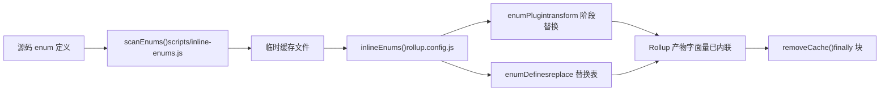
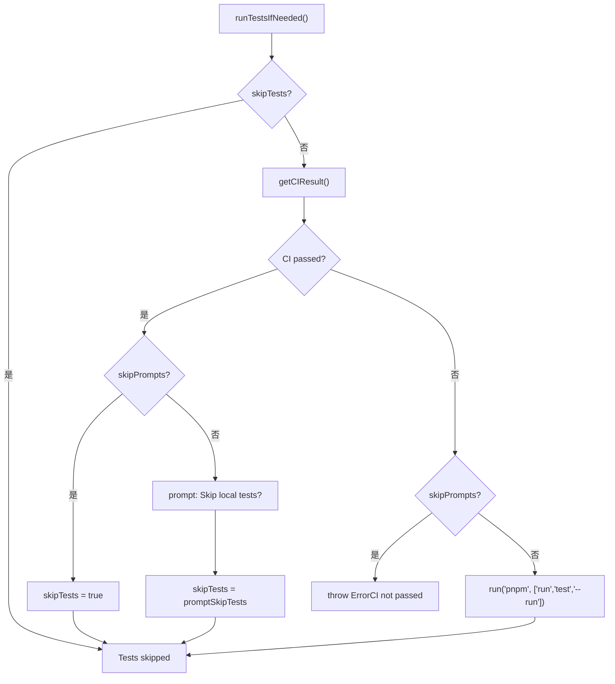

# Kapitel 13: Architektur-Abwägungen und Fallstrick-Vermeidung: Randbedingungen der Monorepo-Engineering

Im vorherigen Kapitel haben wir mit`packages-private/vite-debug`als Einstieg das Debugging-Paradigma der minimalen Reproduktion am echten Quellcode gemeistert. Wenn solche internen Debug-Pakete immer mehr werden, taucht ein reales Problem auf: Sie teilen sich denselben Workspace mit den offiziell veröffentlichten Paketen – wie stellt man sicher, dass der Release-Prozess sie nicht versehentlich beeinträchtigt? Dieses Kapitel geht tief in die Randbedingungen der Monorepo-Engineering ein, ausgehend vom Doppelverzeichnis-Vertrag von`packages`und`packages-private`, analysiert die defensiven Designentscheidungen hinter den Architektur-Abwägungen und gibt umsetzbare Hinweise zur Fallstrick-Vermeidung.

# 13.2 Zeitliche eiserne Regel: Enum-Inlining muss vor Rollup ausgeführt werden

## Intuitives Modell

Enum-Inlining ist wie „vor dem Verpacken die Etiketten auf den Teilen durch Zahlen ersetzen“. Wenn der Verpackungsarbeiter (Rollup) bereits mit dem Packen begonnen hat und du dann die Etiketten änderst, passen die Teile in der Kiste und die Etiketten nicht mehr zusammen.`build.js`verwendet`scanEnums()` / `removeCache()`dieses Funktionspaar, um das Inlining strikt vor Rollup einzuklemmen.

## Datenstruktur und Lebenszyklus

`inline-enums.js`exportiert`scanEnums()`gibt eine`removeCache`Closure zurück, die Enum-Definitionen im Quellcode scannt und temporäre Dateien für Rollup zur Konsumption generiert[FACT:scripts/build.js:30-34]。`build.js`von`run()`verwendet`try/finally`um die Cache-Bereinigung sicherzustellen[FACT:scripts/build.js:81-112]：

```js
const removeCache = scanEnums()
try {
  // ... buildAll / checkAllSizes / build-dts
} finally {
  removeCache()
}
```

`rollup.config.js`ruft auf Modulebene`inlineEnums()`auf, um`[enumPlugin, enumDefines]` [FACT:rollup.config.js:47-50]zu erhalten, wobei`enumPlugin`in das plugins-Array eingefügt wird[FACT:rollup.config.js:331-331]，`enumDefines`und in die Ersetzungstabelle des replace-Plugins aufgenommen wird[FACT:rollup.config.js:222-223]。

## Step-by-Step: Der vollständige Lebenszyklus eines Enums in einem Build

1. `build.js`von`run()`ruft zuerst`scanEnums()`auf, scannt die Enum-Definitionen aller Pakete und schreibt sie in den temporären Cache, gibt zurück`removeCache` [FACT:scripts/build.js:87-87]。

2. `buildAll`startet mehrere Rollup-Prozesse parallel[FACT:scripts/build.js:119-121]。

3. Jeder Rollup-Prozess führt in der Konfigurationsladephase`inlineEnums()`aus, liest den im vorherigen Schritt generierten Cache und erhält`enumPlugin`und`enumDefines` [FACT:rollup.config.js:47-50]。

4. `enumPlugin`ersetzt in der Transform-Phase Enum-Referenzen im Quellcode durch Literale;`enumDefines`ergänzt replace und behandelt modulübergreifende Konstantenersetzung[FACT:rollup.config.js:222-223]。

5. Build endet,`finally`Block ruft`removeCache()`auf, um temporäre Dateien zu bereinigen[FACT:scripts/build.js:119-121]。



## Designüberlegungen und Fallstricke

> **[Design Inference & Architectural Trade-offs]**
> Warum nicht ein Rollup-Plugin verwenden, das in der Transform-Phase direkt scannt und verwendet? Weil Enum-Inlining eine**paketübergreifende globale Sicht**：`runtime-core`benötigt – referenzierte Enums können in`shared`definiert sein, ein einzelner Rollup-Prozess sieht nur seinen eigenen Paket-Quellcodebaum und kann keine paketübergreifende Ersetzung durchführen.`scanEnums()`Vor dem Build einen globalen Cache anzulegen, löst genau dieses Sichtbarkeitsproblem.

Produktions-Fallstrick:`removeCache()`in`finally`zu platzieren bedeutet, dass auch bei einem Fehler mitten im Build bereinigt wird. Aber wenn du beim Debuggen den Prozess manuell unterbrichst (Ctrl+C),`finally`möglicherweise nicht ausgeführt wird, und zurückbleibende Cache-Dateien dazu führen, dass der nächste Build veraltete Enums liest. Fehlersuche: Prüfen, ob im`temp/`-Verzeichnis zurückbleibende Enum-Cache-Dateien vorhanden sind, manuell löschen und erneut versuchen.

---

# 13.3 Release-Orchestrator:`release.js`die Skip-Flag-Matrix von

## Intuitives Modell

`release.js`ist wie der Hochzeitsregisseur,`skipBuild` / `skipTests` / `skipGit` / `skipPrompts`die vier Schalter sind die Buttons für „Probe überspringen“, „Eid überspringen“, „Fotos überspringen“, „Bestätigung überspringen“. Jeder Button entspricht einem realen Szenario: CI-Umgebungen benötigen`skipPrompts`, lokales Debugging benötigt`skipGit`, dringende Hotfixes benötigen`skipTests`。

## Datenstruktur und Standardwerte der Flags

Die vier Skip-Flags werden in`parseArgs`deklariert[FACT:scripts/release.js:39-50]und anschließend in lokale Variablen destrukturiert[FACT:scripts/release.js:64-66]：

```js
let skipTests = args.skipTests
const skipBuild = args.skipBuild
const skipPrompts = args.skipPrompts
const skipGit = args.skipGit
```

Beachte`skipTests`verwendet`let`Deklaration, da sie in`runTestsIfNeeded()`dynamisch umgeschrieben wird[FACT:scripts/release.js:281-317]。

## Step-by-Step: Der vollständige Entscheidungsfluss eines Releases

`main()`die Ausführungsreihenfolge[FACT:scripts/release.js:143-279]：

1. **Remote-Synchronisationsprüfung**：`isInSyncWithRemote()`Vergleicht lokalen HEAD mit dem Remote-Branch-SHA und zeigt bei Abweichung einen Bestätigungsdialog an[FACT:scripts/release.js:337-363]。

2. **Versionsauswahl**: Ohne Positionsargument wird`versionIncrements`Auswahlmenü angezeigt[FACT:scripts/release.js:152-176]。

3. **Testentscheidung**：`runTestsIfNeeded()`ist der Bereich mit der dichtesten skip-Logik[FACT:scripts/release.js:281-317]。

4. **Versionsaktualisierung**：`updateVersions()`Durchläuft alle Pakete und schreibt`package.json` [FACT:scripts/release.js:377-398]。

5. **Changelog-Generierung**: Ruft auf`pnpm run changelog` [FACT:scripts/release.js:211-212]。

6. **Git-Commit**：`skipGit`Wird bei Wahrheit vollständig übersprungen[FACT:scripts/release.js:231-240]。

7. **Veröffentlichung**: Nur wenn`args.publish`wahr ist, wird ausgeführt`buildPackages()` + `publishPackages()` [FACT:scripts/release.js:243-246]。

`runTestsIfNeeded()`Die Branch-Logik verdient eine separate Betrachtung:



## Designüberlegungen und Fallstricke

> **[Design Inference & Architectural Trade-offs]**
> `skipTests`Verwendet`let`statt`const`Das Design dient dazu, den Optimierungspfad „CI bestanden, lokale Tests automatisch überspringen" zu unterstützen. Dies spart im CI-Release-Szenario erheblich Zeit – GitHub Actions'`release.yml`hat bereits vollständige Tests durchlaufen, ein erneuter lokaler Durchlauf wäre reine Verschwendung.

**Der versteckte Vertrag der Veröffentlichungsreihenfolge**：`sortPackagesForPublishing`Platziert`vue`an letzter Stelle[FACT:scripts/release.js:85-85], und der Kommentar stellt ausdrücklich klar: „Benutzer dürfen das neue Einstiegspaket nicht installieren, bevor die internen Pakete verfügbar sind." Wenn Sie diese Reihenfolge ändern, könnte der Benutzer bei`npm install vue@next`eine Version beziehen, deren Abhängigkeiten noch nicht veröffentlicht sind, was zu`ERR_MODULE_NOT_FOUND`。

**Idempotenzschutz**：`publishPackage`Ruft vor der Veröffentlichung`isPackagePublished`auf, um die Registry zu prüfen[FACT:scripts/release.js:453-458], fängt bei Veröffentlichungsfehlern`previously published`Fehler ab und degradiert zum Überspringen von[FACT:scripts/release.js:480-488]. Dadurch kann das Release-Skript sicher wiederholt werden – nach einer Netzwerkunterbrechung schlägt die erneute Ausführung nicht wegen „Paket existiert bereits" vollständig fehl.

**Fehler-Rollback**：`fnToRun().catch()`Ruft auf, wenn`versionUpdated`wahr ist`updateVersions(currentVersion)`Rollt die Versionsnummer zurück[FACT:scripts/release.js:528-537]. Beachten Sie jedoch: Dies rollt nur`package.json`das Versionsfeld in**zurück,`git commit`setzt bereits**Commits nicht zurück`skipGit`. Wenn Sie bei`git reset`。

---

# als falsch die Veröffentlichung fehlschlägt, müssen Sie manuell

Designüberlegung: Das gemeinsame Muster der drei Abwägungen**Betrachtet man die drei Kernabwägungen dieses Kapitels, teilen sie dieselbe Designphilosophie:**。

- `packages-private`„Leicht vergessliche Laufzeitprüfungen" in „unmöglich zu umgehende strukturelle Constraints" umwandeln`private`Physische Isolation: Es wird nicht darauf vertraut, dass der Skriptautor daran denkt,
- das Feld zu prüfen, sondern der Scan-Bereich schließt es von Natur aus aus.
- `release.js`Enum-Inlining-Vorverlagerung: Es wird nicht darauf vertraut, dass das Rollup-Plugin beim Transform „zufällig" paketübergreifende Enums sieht, sondern vor dem Build ein globaler Cache aufgebaut.`skipTests`。

> **[Design Inference & Architectural Trade-offs]**
> 〔Designinferenz und Architekturabwägung〕**Der Preis dieses Musters ist**：`build.js`steigende Skriptkomplexität`privatePackages`Es müssen`rollup.config.js`Listen gepflegt werden,`release.js`die Verzeichniserkennungslogik muss dupliziert werden,

---

# die Kreuzkombinationen der vier skip-Flags müssen behandelt werden. Doch für ein Repository wie Vue, das mehrmals wöchentlich veröffentlicht, überwiegt der Zuverlässigkeitsgewinn durch strukturelle Constraints bei Weitem die Komplexitätskosten.

Kapitelzusammenfassung

1. **`packages-private`Dieses Kapitel hat ausgehend vom Quellcode drei entscheidende Randbedingungen des Vue-Core-Engineering-Systems herausgearbeitet:`packages`Die physische Isolation von**und`build.js`wird durch drei Stellen gemeinsam gewährleistet: Workspace-Glob,`release.js`Verzeichniserkennung,[FACT:pnpm-workspace.yaml:1-3][FACT:scripts/build.js:153-170][FACT:scripts/release.js:68-83]。

2. **Filterung**Die Zeitliche Constraint des Enum-Inlinings`scanEnums()` / `removeCache()`wird durch`try/finally`die[FACT:scripts/build.js:81-112][FACT:rollup.config.js:47-50]。

3. **`release.js`Struktur von**erzwungen, die Rollup-Konfiguration konsumiert den Cache auf Modulebene`skipTests`Die skip-Flag-Matrix von[FACT:scripts/release.js:281-317][FACT:scripts/release.js:85-85]。

# dient drei Szenarien: CI-Release, lokales Debugging und Notfall-Hotfix,

die dynamische Umschreibung und die Sortierung der Veröffentlichungsreihenfolge sind die beiden am leichtesten übersehenen versteckten Verträge`build.js`Kapitelüberlegungen und Selbsttest`build(target)`Q1: Wenn man in`privatePackages.includes(target)`in der`packages`Funktion die`pkgBase`Prüfung entfernt und einheitlich

**als**：`build.js:160-164`verwendet, in welchen Szenarien würde es Probleme geben?`nr build vite-debug`Referenzanalyse`packages/vite-debug`Die Verzeichniserkennung von`package.json`ist der einzige Einstiegspunkt, über den private Pakete gebaut werden können. Nach dem Entfernen`fs.readFileSync`wird`ENOENT`unter`packages/`nach`buildOptions`gesucht, aber dieses Verzeichnis existiert nicht,`rollup.config.js:37-42`wirft direkt`build.js`. Das verstecktere Problem ist: Wenn in Zukunft jemand unter

Q2: `release.js`ein gleichnamiges Verzeichnis erstellt, verwendet der Build stillschweigend die Konfiguration des falschen Verzeichnisses, und die Ausgabepfade sowie`runTestsIfNeeded()`sind alle verschoben. Darüber hinaus`skipTests ||= isCIPassed`hat`release.js:285`eine unabhängige Verzeichniserkennungslogik, beide Stellen müssen synchron geändert werden, sonst entsteht der inkonsistente Zustand „`skipPrompts`hat das Paket gefunden, aber Rollup nicht".`else if (skipPrompts)`In`throw`von

**,**welche Zeile Code (`skipPrompts`) in`skipTests ||= isCIPassed`wenn`isCIPassed`wahr ist und CI nicht bestanden hat, welchen Branch würde sie nehmen? Wenn man`false`，`skipTests`den`false`des`else if (skipPrompts)`Branches entfernt, welche Konsequenzen hätte das?`Error`（`release.js:299-304`Referenzanalyse`throw`: Wenn`if (!skipTests)`wahr ist und CI nicht bestanden hat,`pnpm run test --run`in

Q3: `rollup.config.js:55`ist`inlineEnums()`auf`build.js:87`bleibt der ursprüngliche Wert (normalerweise`scanEnums()`). Danach wird der`run()`Branch betreten, und`inlineEnums()`wird geworfen). Wenn man dieses`buildStart`entfernt, läuft der Code weiter zum

**Branch und führt in einer nicht-interaktiven Umgebung**：`scanEnums()`aus. Dies kann in CI dazu führen, dass Tests aufgrund von Umgebungsunterschieden fehlschlagen, oder schlimmer – die Tests bestehen, aber CI hat tatsächlich nicht bestanden (z. B. lief CI eine andere Test-Teilmenge), und es wird eine nicht vollständig validierte Version veröffentlicht.**Das**von`inlineEnums()`wird auf Modulebene aufgerufen, während`rollup.config.js`das`buildStart`von`buildAll`innerhalb der`build.js:119-121`Funktion aufgerufen wird. Wenn man die Ausführungszeitpunkte dieser beiden vertauscht (d. h.`scanEnums()`im`removeCache`Hook von Rollup aufrufen lässt), was würde zerstört?

Doppelverzeichnis-Vertrag, Zuordnungsentscheidung von Build-Skripten, Sekundärfilterung von Release-Skripten – diese Mechanismen zusammen definieren die Sicherheitsgrenzen der Monorepo-Industrialisierung. Doch Grenzen sind nicht statisch: Mit der Migration der Build-Tools von Rollup zu Rolldown und der Verschmelzung von Typtests und Laufzeittests werden die bestehenden Abwägungsstrategien vor neuen Herausforderungen stehen. Im nächsten Kapitel werden wir basierend auf dem Änderungsverlauf von 3.0 bis 3.4 die Entwicklungsrichtung der nächsten Generation des Industrialisierungssystems skizzieren.
