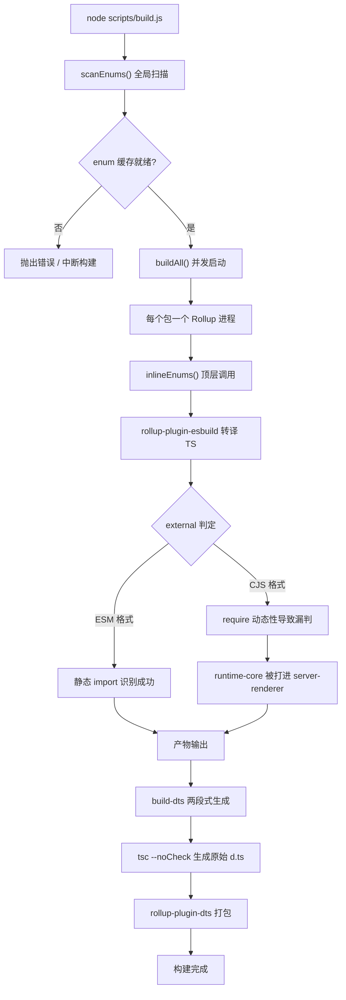
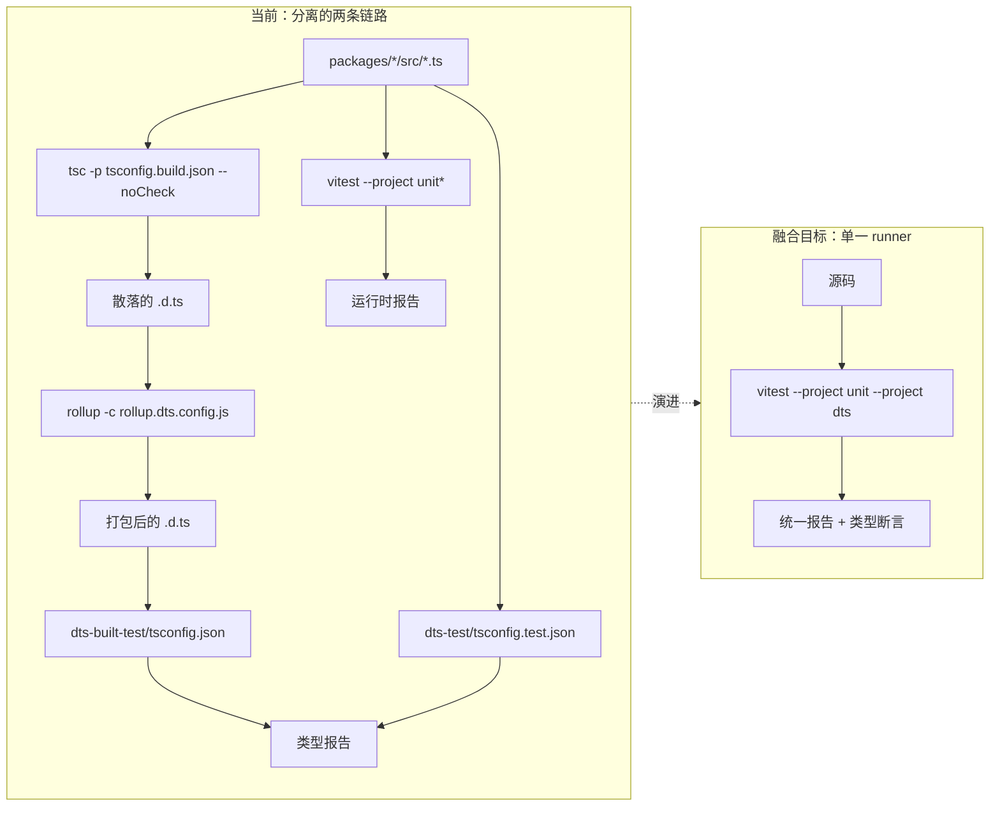
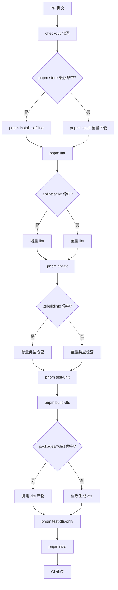

# Kapitel 14: Zukünftige Entwicklung: Von 3.x zur nächsten Generation des Industrialisierungssystems

Im vorherigen Kapitel haben wir die „Sicherheitsgrenzen" des Vue-Core-Industrialisierungssystems herausgearbeitet – Doppelverzeichnis-Vertrag, Zuordnungsentscheidung von Build-Skripten, Sekundärfilterung von Release-Skripten. Diese Mechanismen wurden nicht in einem Zug entworfen, sondern in den Iterationen von 3.0 bis 3.4 wiederholt geschliffen. Dieses Kapitel wechselt die Perspektive: Wir schauen nicht mehr darauf, „wie es jetzt aussieht", sondern darauf, „wie es zu dem geworden ist, was es jetzt ist", und leiten daraus ab, wohin die nächste Generation des Industrialisierungssystems steuern wird. Das Quellmaterial dieses Kapitels sind changelogs/CHANGELOG-3.3.md, changelogs/CHANGELOG-3.4.md sowie die package.json im Repository-Stammverzeichnis. Änderungsprotokolle scheinen nur eine Aufzählung von „welcher Bug wurde behoben" zu sein, aber sie sind der ehrlichste Gesundheitsbericht des Industrialisierungssystems: Jeder Commit mit dem Präfix build:, jede Änderung mit dem Präfix types:, jeder Rückzug einer Abhängigkeitsversion legt die Spannungspunkte der aktuellen Architektur offen. Unsere Aufgabe ist es, aus diesen Spannungspunkten die Entwicklungsrichtung herauszulesen. Das Änderungsprotokoll als „Beobachtungsfenster des Industrialisierungssystems" statt als „Funktionsliste" zu betrachten, ist die Kernmethodik dieses Kapitels. Funktionsänderungen sagen uns, was Vue leisten kann, während Änderungen an Build, Typen und CI uns sagen, „wo es weh tut" im Industrialisierungssystem von Vue.

# I. Spannungspunkte der Build-Toolchain: Das Migrationspotenzial von Rollup zu Rolldown

## Intuitives Modell

Stellen Sie sich die Build-Toolchain als eine Montagelinie vor: Rollup ist der Hauptmontagetisch, esbuild übernimmt das schnelle Schneiden (Transpilieren von TS), terser übernimmt das abschließende Bündeln und Komprimieren. Wenn das Produkt (die Vue-Laufzeit) immer komplexer wird und die Arbeitsschritte am Montagetisch zunehmen, wird der Hauptmontagetisch selbst zum Engpass. Die Positionierung von Rolldown ist der in Rust neu geschriebene Hauptmontagetisch – er soll nicht esbuild ersetzen, sondern Rollup selbst.

Ohne diesen Evolutionsdruck wäre die „Katastrophe", der das System gegenübersteht, nicht ein Absturz, sondern**die lineare Aufblähung der Build-Zeit mit der Anzahl der Pakete**: Für jedes zusätzliche Unterpaket muss ein weiterer Rollup-Prozess gestartet, der Enum-Cache erneut durchsucht und eine weitere Runde der dts-Generierung durchlaufen werden.

## Datenstrukturen und Abhängigkeitslayout

Betrachten wir zunächst einen statischen Schnappschuss der aktuellen Toolchain.`package.json`Die`devDependencies`von ist eine präzise „Montagetisch-Liste":

[FACT:package.json:103-106]

```
    "rollup": "^4.63.3",
    "rollup-plugin-dts": "^6.5.1",
    "rollup-plugin-esbuild": "^6.2.1",
    "rollup-plugin-polyfill-node": "^0.13.0",
```

Hier lassen sich drei Schlüsselfakten ablesen. Erstens ist die Rollup-Hauptversion`^4.63.3`, was sich in der Reifephase von Rollup 4.x befindet. Zweitens übernimmt`rollup-plugin-esbuild`die TS-Transpilierung, was bedeutet, dass Rollup selbst kein TS parst, sondern nur das von esbuild ausgegebene JS verarbeitet. Drittens ist`rollup-plugin-dts`unabhängig verantwortlich für das`.d.ts`Bundling, was genau die materielle Grundlage für die`dts-built-test`Unabhängigkeit ist, die im vorherigen Kapitel diskutiert wurde.

Betrachten wir nun die Einstiegsorchestrierung des Build-Skripts:

[FACT:package.json:8-9]

```
    "build": "node scripts/build.js",
    "build-dts": "tsc -p tsconfig.build.json --noCheck && rollup -c rollup.dts.config.js",
```

`build-dts`ist „zweistufig": Zuerst`tsc --noCheck`werden rohe Deklarationsdateien generiert (`--noCheck`überspringt die Typprüfung und führt nur emit aus), dann werden mit`rollup -c rollup.dts.config.js`die verstreuten`.d.ts`zu einer einzigen Datei gebündelt. Dieses Design selbst ist eine Abhängigkeit von den Fähigkeiten von Rollup –`rollup-plugin-dts`benötigt den Modulgraphen von Rollup, um Typabhängigkeiten zu verfolgen.

## Szenariogetrieben: Was ein`build:`-Commit offengelegt hat

Die Einträge mit dem Präfix`build:`im Änderungsprotokoll sind direkte Belege für die Spannungspunkte der Build-Toolchain. Wir greifen drei heraus.

Der erste, die minify-Konfigurationsangleichung in 3.4.32:

[FACT:changelogs/CHANGELOG-3.4.md:84]

```
* **build:** use consistent minify options from previous terser config ([789675f](https://github.com/vuejs/core/commit/789675f65d2b72cf979ba6a29bd323f716154a4b))
```

Die Motivation dieses Commits war „inkonsistente Komprimierungsoptionen nach der Migration von terser zu esbuild minify". Er offenbart einen Zwischenzustand während der Migration: Vue verwendete einst terser zur Komprimierung, wechselte später zu esbuild (was durch`devDependencies`in`esbuild: ^0.28.2`bestätigt wird), aber die Komprimierungsoptionen wurden nicht vollständig angeglichen, was zu Abweichungen bei der Produktgröße oder im Verhalten führte. Genau das sind die typischen Kosten beim „Austausch von Montagetisch-Komponenten".

Der zweite, der entities-Versionsrückzug in 3.4.38:

[FACT:changelogs/CHANGELOG-3.4.md:6]

```
* **build:** revert entities to 4.5 to avoid runtime resolution errors ([f349af7](https://github.com/vuejs/core/commit/f349af7b65b9f8605d8b7bafcc06c25ab1f2daf0)), closes [#11603](https://github.com/vuejs/core/issues/11603)
```

`entities`ist eine HTML-Entity-Dekodierungsbibliothek, die von`compiler-dom`abhängt. Der Rückzug auf 4.5 erfolgte, weil die neue Version Probleme bei der Laufzeitanalyse verursachte. Dieser Commit zeigt:**Die Abhängigkeitsaktualisierung der Build-Toolchain ist nicht isoliert; ein Versionssprung einer indirekten Abhängigkeit kann bis in das Laufzeitverhalten durchschlagen**。

Der dritte, die cjs-Build-Kontamination des server-renderer in 3.4.29:

[FACT:changelogs/CHANGELOG-3.4.md:155]

```
* **build:** fix accidental inclusion of runtime-core in server-renderer cjs build ([11cc12b](https://github.com/vuejs/core/commit/11cc12b915edfe0e4d3175e57464f73bc2c1cb04)), closes [#11137](https://github.com/vuejs/core/issues/11137)
```

Dies ist die typischste Art von Build-Bug: Im CJS-Format hat`server-renderer`versehentlich`runtime-core`in sein eigenes Produkt eingebunden. Die Ursache ist normalerweise, dass die`external`-Bestimmung von Rollup im CJS-Format versagt – ESM kann externe Abhängigkeiten statisch durch`import`-Anweisungen erkennen, während CJS`require`Dynamik ist stärker, leicht zu übersehen. Dieser Commit zeigt direkt auf die Anfälligkeit der Logik in der Rollup-Konfiguration.`external`Logik.

## Mermaid-Darstellung des Migrationspotenzials

Das folgende Diagramm stellt den Kontrollfluss der aktuellen Build-Pipeline dar und markiert die Knoten, die von der Rolldown-Migration betroffen sein werden:



> **[Design Inference & Architectural Trade-offs]**
> Der Migrationswert von Rolldown liegt darin: Es ersetzt das Nebenläufigkeitsmodell „ein Prozess pro Paket" durch das Modell „Parallelität innerhalb eines einzelnen Prozesses",`scanEnums()`Der globale Scan und`inlineEnums()`Die Ersetzung kann innerhalb derselben Rust-Laufzeit koordiniert werden, und das im vorherigen Kapitel diskutierte Problem der „Nebenläufigkeits-Scan-Race-Condition" wird von Grund auf verschwinden. Aber genau hier liegt der Widerstand gegen die Migration –`rollup-plugin-esbuild`、`rollup-plugin-dts`Diese Plugin-Ökosysteme benötigen eine Kompatibilitätsschicht von Rolldown, und`external`Die Entscheidungslogik muss neu geschrieben werden.

## Design-Überlegungen und Fallstricke

**Warum wird die Migration nicht auf einen Schlag erfolgen?**Betrachten Sie`package.json`Das`engines`Feld:

[FACT:package.json:61-63]

```
  "engines": {
    "node": ">=20.0.0"
  },
```

Node 20 ist die harte Untergrenze. Rolldown als Rust-natives Modul benötigt entsprechende N-API-Bindings und vorkompilierte Binärverteilung. Sobald es eingeführt wird,`pnpm install`Die Zeitaufwände, die plattformübergreifende (Windows/macOS/Linux) Binärkompatibilität und die CI-Cache-Strategie müssen neu gestaltet werden. Das ist nicht einfach „eine Abhängigkeit austauschen", sondern**Eine Neukalibrierung der gesamten Installations-Build-Cache-Kette**。

**Produktions-Fallstricke**：`build-dts`Das`tsc --noCheck`Ist ein zweischneidiges Schwert. Das Überspringen der Typprüfung beschleunigt das Emit, bedeutet aber, dass`.d.ts`In der Generierungsphase keine Typfehler entdeckt werden – Typfehler können nur durch`pnpm check`（`tsc --incremental --noEmit`) und`test-dts`Aufgefangen werden. Wenn nach der Rolldown-Migration diese beiden Schritte zusammengeführt werden sollen, muss sichergestellt werden, dass die Typprüfung den Build nicht verlangsamt, sonst widerspricht dies der ursprünglichen Absicht von`--noCheck`.

---

# Zwei, der Fusionstrend von Typtests und Laufzeittests

## Intuitives Modell

Stellen Sie sich Typtests und Laufzeittests als zwei unabhängige Qualitätskontrollpunkte vor: Einer prüft, ob „die Bedienungsanleitung (`.d.ts`) korrekt geschrieben ist", der andere prüft, ob „die Maschine (Laufzeit) korrekt läuft". Beide Kontrollpunkte haben eigene Arbeitsplätze, eigene Werkzeuge und eigene Berichte. Der Fusionstrend bedeutet:**Können dieselben Testfälle gleichzeitig die Bedienungsanleitung und die Maschine validieren?**

Ohne Fusion steht das System vor der Katastrophe**Drift zwischen Typ und Laufzeitverhalten**：`.d.ts`Sagt`ref()`Gibt zurück`Ref<T>`, aber die tatsächlich zurückgegebene Objektform zur Laufzeit hat sich geändert, der Typtest besteht, der Laufzeittest besteht ebenfalls, aber die Kombination beider ist falsch.

## Datenstruktur: Das Orchestrierungslayout der Testskripte

`package.json`In`scripts`Sind die testbezogenen Einträge klar in zwei Gruppen unterteilt:

[FACT:package.json:19-24]

```
    "test": "vitest",
    "test-unit": "vitest --project unit*",
    "test-e2e": "node scripts/build.js vue -f global -d && vitest --project e2e --project e2e-browser",
    "test-dts": "run-s build-dts test-dts-only",
    "test-dts-only": "tsc -p packages-private/dts-built-test/tsconfig.json && tsc -p ./packages-private/dts-test/tsconfig.test.json",
    "test-coverage": "vitest run --project unit* --coverage",
```

Die Schlüsselstruktur hier ist`test-dts`Das`run-s build-dts test-dts-only`– es ist**Seriell**: Zuerst wird`.d.ts`Gebaut, dann werden die Typtests ausgeführt. Und`test-dts-only`Ist intern wiederum**Zwei unabhängige`tsc`Prozesse**: Einer führt`dts-built-test`Aus (validiert die Build-Artefakte), einer führt`dts-test`Aus (validiert die Quellcode-Typen).

Beachten Sie`test-unit`Verwendet`vitest --project unit*`，`test-e2e`Verwendet`vitest --project e2e --project e2e-browser`. Dies zeigt, dass der`--project`-Mechanismus von Vitest die Tests bereits nach „Unit/E2E/Browser" in verschiedene Projekte aufgeteilt hat.**Die physische Grundlage für die Fusion existiert bereits**: Der Projekt-Mechanismus von Vitest erlaubt es, verschiedene Testtypen im selben Runner auszuführen.

## Szenario-getrieben: Der vollständige Pfad eines`types:`Commits

Im Änderungsprotokoll ist die Dichte der Einträge mit dem Präfix`types:`Extrem hoch, was die Komplexität des Typsystems direkt widerspiegelt. Wir verfolgen einen typischen Typ-Fix.

Der ref-Typ-Rückfall in 3.4.37:

[FACT:changelogs/CHANGELOG-3.4.md:23-24]

```
* Revert "fix(types/ref): allow getter and setter types to be unrelated ([#11442](https://github.com/vuejs/core/issues/11442))" ([b1abac0](https://github.com/vuejs/core/commit/b1abac06cdb198bd72f8e614b1f68b92e1c78339))
* Revert "fix(types/ref): correct type inference for nested refs ([#11536](https://github.com/vuejs/core/issues/11536))" ([3a56315](https://github.com/vuejs/core/commit/3a56315f94bc0e11cfbb288b65482ea8fc3a39b4))
```

Zwei aufeinanderfolgende Reverts, die zwei Typ-Fixes zurückgerollt haben. Beachten Sie, dass diese beiden Fixes in 3.4.35 gerade erst gemergt wurden:

[FACT:changelogs/CHANGELOG-3.4.md:55]

```
* **types/ref:** allow getter and setter types to be unrelated ([#11442](https://github.com/vuejs/core/issues/11442)) ([e0b2975](https://github.com/vuejs/core/commit/e0b2975ef65ae6a0be0aa0a0df43fb887c665251))
```

[FACT:changelogs/CHANGELOG-3.4.md:30]

```
* **types/ref:** correct type inference for nested refs ([#11536](https://github.com/vuejs/core/issues/11536)) ([536f623](https://github.com/vuejs/core/commit/536f62332c455ba82ef2979ba634b831f91928ba)), closes [#11532](https://github.com/vuejs/core/issues/11532) [#11537](https://github.com/vuejs/core/issues/11537)
```

Vom Merge in 3.4.35 bis zum Revert in 3.4.37 liegt nur eine Patch-Version dazwischen. Dieser schnelle „Merge-Revert"-Zyklus offenbart ein grundlegendes Dilemma von Typtests:**Typtests können validieren, dass „die Typsignatur den Erwartungen entspricht", aber sie können nicht validieren, ob „diese Typsignatur im echten Code gut nutzbar ist".**。`allow getter and setter types to be unrelated`In Typtests kann es vollständig bestehen, aber in der tatsächlichen Verwendung wird die Typinferenz von`ref`Zu locker, was die Typsicherheit des nachgelagerten Codes beeinträchtigt.

## Mermaid-Darstellung der Typtest-Fusion

Das folgende Diagramm stellt die aktuelle Trennstruktur von Typtests und Laufzeittests sowie die Zielform nach der Fusion dar:



> **[Design Inference & Architectural Trade-offs]**
> Der technische Pfad der Fusion ist höchstwahrscheinlich: Die`dts-built-test`Und`dts-test`Die`tsc`Aufrufe in ein benutzerdefiniertes Vitest-Projekt zu verpacken, sodass Typassertionen in Form von`expectTypeOf`Inline in Testdateien eingebettet werden. So kann ein einziger`vitest`Aufruf gleichzeitig Laufzeitassertionen und Typassertionen ausführen, mit einheitlichem Reporting. Aber der Widerstand liegt darin:`tsc`Die Typprüfung von

## Ist „vollständig", während die Tests von Vitest „dateiweise" sind – die inkrementellen Strategien beider sind inkompatibel.

**Design-Überlegungen und Fallstricke`dts-built-test`Warum`dts-test`？**Unabhängig von`dts-built-test`Sein muss – wurde im vorherigen Kapitel bereits diskutiert, hier ergänzt aus evolutionärer Perspektive:**Validiert**（`rollup-plugin-dts`Build-Artefakte`.d.ts`），`dts-test`Das gepackte**Validiert**Quellcode-Typen

[FACT:changelogs/CHANGELOG-3.4.md:9]

```
* **types:** add fallback stub for DOM types when DOM lib is absent ([#11598](https://github.com/vuejs/core/issues/11598)) ([4db0085](https://github.com/vuejs/core/commit/4db0085de316e1b773f474597915f9071d6ae6c6))
```

Kopieren`dts-built-test`„Fallback-Stub bereitstellen, wenn DOM lib fehlt" – dies ist eine Typkompatibilitätskorrektur auf der Ebene der Build-Artefakte, die nur im Szenario von`.d.ts`, bei dem gepackte

**Konsumiert werden, entdeckt werden kann.**Produktions-Fallstricke**: Der „Merge-Revert"-Zyklus von Typtests zeigt, dass Änderungen an Typsignaturen**Echte nachgelagerte Projekte`packages-private/dts-test`wird ein repositoryinterner Testfall verwendet, der nicht alle nachgelagerten Nutzungsweisen abdeckt. Wenn der Fusionstrend nur darauf achtet, „zwei Runner zusammenzuführen“, ohne zu lösen, „wie echtes nachgelagertes Feedback eingebracht wird“, ist das nur eine formale Fusion.

---

# Drei. Richtungen für feingranulare Optimierung des CI-Caches

## Intuitives Modell

Stellen Sie sich den CI-Cache als „Materialbereich“ eines Repositorys vor: Jeder Build muss Rohmaterialien (Abhängigkeiten, Build-Artefakte, Typcache) aus dem Materialbereich entnehmen. Wenn der Materialbereich nur eine große Kiste hat und für jeden Gegenstand die gesamte Kiste durchsucht werden muss, kann selbst eine hohe Cache-Trefferrate nicht schnell sein. Feingranulare Optimierung bedeutet:**Die große Kiste in kleine, nach Verwendungszweck kategorisierte Fächer aufteilen**。

Ohne feingranularen Cache steht das System vor folgender Katastrophe:**Kaskadierende Verstärkung von Cache-Invalidierung**: Eine Zeile Quellcode ändern führt dazu, dass der gesamte`node_modules`-Cache ungültig wird, CI alle Abhängigkeiten neu installiert und die Build-Zeit von 2 Minuten auf 10 Minuten steigt.

## Datenstruktur: Klassifizierung cachefähiger Objekte

Aus`package.json`lassen sich mehrere Arten cachefähiger „Materialien“ erkennen:

Erste Kategorie: Installationsartefakte von Abhängigkeiten.`packageManager`Das Feld legt die pnpm-Version fest:

[FACT:package.json:4]

```
  "packageManager": "pnpm@12.4.2",
```

pnpm's`node_modules`ist eine Symlink-Struktur; gecacht wird der content-addressable Store von pnpm, nicht ein flaches`node_modules`. Das bedeutet, der Cache-Schlüssel sollte auf dem Hash von`pnpm-lock.yaml`basieren, nicht auf`package.json`。

Zweite Kategorie: Build-Artefakte.`clean`Das Skript offenbart die physischen Speicherorte der Artefakte:

[FACT:package.json:10]

```
    "clean": "rimraf --glob packages/*/dist temp .eslintcache",
```

`packages/*/dist`、`temp`、`.eslintcache`— diese drei Arten von Artefakten können unabhängig gecacht werden.`dist`ist die Build-Ausgabe,`temp`sind temporäre Dateien (wie`bench.json`），`.eslintcache`ist der Lint-Cache.

Dritte Kategorie: Typprüfungs-Cache.`check`Das Skript verwendet`--incremental`：

[FACT:package.json:15]

```
    "check": "tsc --incremental --noEmit",
```

`--incremental`erzeugt`.tsbuildinfo`Dateien; dies ist der inkrementelle Cache der Typprüfung. Wenn diese Datei in CI gecacht wird,`tsc`wird der zweite Lauf von

## viel schneller sein.

Szenariogetrieben: CI-Ausführungsfluss eines PRs`packages/reactivity/src/ref.ts`In ein typisches Szenario eintauchen: Ein Entwickler ändert

und reicht einen PR ein. Welche Schritte muss CI ausführen, und welche können den Cache treffen?`scripts`Aus`simple-git-hooks`lässt sich die CI-Ausführungssequenz ableiten (`pre-commit`'s

[FACT:package.json:48-51]

```
  "simple-git-hooks": {
    "pre-commit": "pnpm lint-staged && pnpm check",
    "commit-msg": "node scripts/verify-commit.js"
  },
```

Kopieren`pre-commit`Lokal läuft`lint-staged`mit`check`und`lint`、`check`、`test-unit`、`test-dts`、`size`. In CI werden dann

- `lint`usw. ausgeführt. Die Cache-Strategie ist für jeden Schritt unterschiedlich:`.eslintcache`: cache
- `check`, Schlüssel basiert auf dem Hash der Quelldateien.`.tsbuildinfo`: cache`tsconfig`, Schlüssel basiert auf
- `test-unit`und dem Quellcode-Hash.
- `test-dts`: Vitest hat einen eigenen Cache, aber üblicherweise werden in CI keine Testergebnisse gecacht, sondern nur Abhängigkeiten.`build-dts`: hängt von den Artefakten von`packages/*/dist`ab, Cache-Schlüssel basiert auf dem Hash von
- `size`: hängt von Build-Artefakten ab, Cache-Schlüssel wie oben.

## Mermaid-Darstellung der CI-Cache-Optimierung



> **[Design Inference & Architectural Trade-offs]**
> Der Kernwiderspruch feingranularer Caches ist**die Granularität des Cache-Schlüssels**: Ist der Schlüssel zu grob (z. B. nur auf Basis des Commit-Hashs), ist die Trefferrate niedrig; ist der Schlüssel zu fein (z. B. auf Basis des Hashs jeder Datei), heben die Kosten für die Schlüsselberechnung den Cache-Nutzen auf. Eine sinnvolle Strategie für Monorepos wie Vue ist „Sharding nach Paket“: Jedes`packages/*`Unterpaket wird unabhängig gecacht; Änderungen an`dist`，`reactivity`machen den`compiler-core`-Cache von`dist`nicht ungültig.

## Designüberlegungen und Stolperfallen

**Warum muss das`size`-Skript in mehrere Unterbefehle aufgeteilt werden?**Betrachten Sie diese drei:

[FACT:package.json:11-14]

```
    "size": "run-s \"size-*\" && node scripts/usage-size.js",
    "size-global": "node scripts/build.js vue runtime-dom -f global -p --size",
    "size-esm-runtime": "node scripts/build.js vue -f esm-bundler-runtime",
    "size-esm": "node scripts/build.js runtime-dom runtime-core reactivity shared -f esm-bundler",
```

`size`verwendet`run-s "size-*"`, um alle Unterbefehle mit dem Präfix`size-`seriell auszuführen. Dieses „Präfix-Aggregations“-Muster ermöglicht es, jede Größen-Dimension (global, esm-runtime, esm) unabhängig zu cachen und unabhängig fehlschlagen zu lassen. Wenn man sie zu einem großen Befehl zusammenführt, lässt jede Dimensionsüberschreitung das gesamte`size`fehlschlagen, und es lässt sich nicht lokalisieren, welches Problem welche Dimension betrifft.

**Produktions-Stolperfallen**: Die häufigste Falle bei CI-Caches ist**Cache-Verschmutzung**—falsche Artefakte werden gecacht, sodass spätere Builds auf schmutzigen Daten basieren.`clean`Das

[FACT:package.json:10]

```
    "clean": "rimraf --glob packages/*/dist temp .eslintcache",
```

Kopieren`packages/*/dist`Beachten Sie, dass es`packages-private/*/dist`bereinigt, nicht`packages-private`. Das bedeutet, die Artefakte von`packages-private`liegen nicht im regulären Bereinigungsbereich—wenn CI die Artefakte von`clean`cacht und`packages-private`sie nicht bereinigt, kann das Problem entstehen, dass „alte Playground-Artefakte gecacht wurden“. Beim Design feingranularer Caches muss

---

# separat behandelt werden.

Designüberlegung: Das Engineering-System als Produktlebenszyklus**Wenn man die Hinweise der drei Abschnitte verbindet, erkennt man eine klare Hauptlinie:**。

Das Engineering-System von Vue bewegt sich von „funktionsfähig“ zu „gut nutzbar“, von „manueller Orchestrierung“ zu „deklarativer Konfiguration“

Die Migration der Build-Toolchain (Rollup → Rolldown) ist eine „leistungsgetriebene“ Entwicklung: Wenn die Anzahl der Pakete bis zu einem gewissen Grad wächst, übersteigen die Kosten prozessbasierter Nebenläufigkeit den Nutzen, und es muss auf ein leichteres Nebenläufigkeitsmodell umgestellt werden.

Die Fusion von Typtests ist eine „konsistenzgetriebene“ Entwicklung: Wenn sich Typ-Signaturen häufiger ändern als das Laufzeitverhalten, werden zwei getrennte Testsätze zur Last, und sie müssen dieselben Testfälle gemeinsam nutzen.

> **[Design Inference & Architectural Trade-offs]**
> 〔Design-Inferenz und Architektur-Abwägungen〕**Die gemeinsame Einschränkung dieser drei Entwicklungslinien ist**Rückwärtskompatibilität`BREAKING CHANGES`. Die Release-Strategie von Vue (sichtbar am

---

# -Abschnitt des Changelogs) erlaubt in Minor-Versionen „type-only breaking changes“, aber keine Laufzeit-Breaking-Changes. Das bedeutet, die Entwicklung des Engineering-Systems muss sicherstellen: Egal wie die interne Toolchain ausgetauscht wird, die öffentliche API und das Laufzeitverhalten der Artefakte dürfen sich nicht ändern. Dies ist die harte Grenze aller Entwicklungsentscheidungen.

Zusammenfassung dieses Kapitels`package.json`Dieses Kapitel geht vom Changelog und

1. **aus und ordnet die drei Entwicklungslinien des Engineering-Systems von Vue core:**: Die aktuelle Kombination aus Rollup 4.x + esbuild + rollup-plugin-dts zeigt ihre Belastungspunkte in`build:`Commits mit dem Präfix (Minify-Konfigurationsabgleich, Entities-Versionsrücknahme, übersehene CJS-External-Erkennung). Das Potenzial der Rolldown-Migration liegt in der Ablösung von „Multi-Prozess-Konkurrenz" durch „Single-Prozess-Parallelität", der Widerstand kommt vom Plugin-Ökosystem und der plattformübergreifenden Binärverteilung.

2. **Typentest-Fusion**：`test-dts`der`run-s build-dts test-dts-only`serielle Struktur sowie`dts-built-test`und`dts-test`die duale`tsc`Prozesse sind der physische Beweis für die aktuelle getrennte Form. Der technische Pfad zur Fusion nutzt Vitests`--project`Mechanismus, der Widerstand ist die Inkompatibilität zwischen`tsc`Vollprüfung und Vitests dateibasierter inkrementeller Teststrategie.

3. **CI-Cache-Feingranularisierung**：`packageManager`pnpm locken,`clean`drei Arten von Artefakten bereinigen,`check`mit`--incremental`、`size`mit Präfix aggregieren – all dies sind Klassifizierungskriterien für cachebare Objekte. Der Kernwiderspruch ist die Granularität des Cache-Schlüssels, eine sinnvolle Strategie ist „Sharding nach Paket".

Der wichtigste kognitive Wandel ist:**Das Engineering-System selbst ist ein Produkt, es hat seine eigenen Nutzer (Contributors), seine eigenen Leistungsmetriken (Build-Zeit, CI-Minuten), seine eigenen Kompatibilitätsbeschränkungen (Artefakt-API unverändert)**. Es erfordert kontinuierliche Iteration, nicht einmaliges Design.

# Gedanken und Selbsttests dieses Kapitels

Q1: `package.json:9`der`build-dts`verwendet`tsc -p tsconfig.build.json --noCheck`. Wenn man`--noCheck`entfernt, welche Kettenreaktionen würde das nach der Rolldown-Migration auslösen?

**Referenzanalyse**：`--noCheck`Der Zweck von ist es, die Typprüfung zu überspringen und nur emit durchzuführen. Nach dem Entfernen wird`tsc`vor der Generierung von`.d.ts`eine vollständige Typprüfung durchführen. Unter der aktuellen Rollup-Architektur macht dies nur`build-dts`langsamer; aber nach der Rolldown-Migration wird das Problem verstärkt: Rolldowns Kernverkaufsargument ist „Single-Prozess-Parallel-Build", wenn die`build-dts`Phase eine vollständige`tsc`Prüfung einführt, wird sie zum seriellen Engpass der gesamten Pipeline – alle Paket-Builds müssen auf den Abschluss dieser Prüfung warten. Noch gravierender ist, dass`tsc`Typprüfung single-threaded ist und die Parallelitätsfähigkeiten von Rolldown nicht nutzen kann. Die richtige Vorgehensweise ist,`--noCheck`beizubehalten und die Typprüfung an unabhängige`pnpm check`（`package.json:15`) und`test-dts`（`package.json:22`) zu übergeben, um Build und Prüfung zu entkoppeln.

Q2: Das Changelog 3.4.37 hat zwei`types/ref`Fixes nacheinander zurückgenommen (`CHANGELOG-3.4.md:23-24`), während diese beiden Fixes gerade in 3.4.35 gemergt wurden (`CHANGELOG-3.4.md:30,55`). Wenn Typentests und Laufzeittests bereits fusioniert wären, könnte dieser „Merge-Rollback"-Zyklus vermieden werden? Warum?

**Referenzanalyse**: Nicht vollständig vermeidbar, aber der Zyklus kann verkürzt werden. Der fusionierte Typentest kann weiterhin nur verifizieren, dass „die Typsignatur der Assertion entspricht", während das Problem bei Fixes wie`allow getter and setter types to be unrelated`darin liegt, dass „die Typsignatur zu locker ist und die Typsicherheit nachgelagerter Codes beeinträchtigt" – dies ist ein Problem der**nachgelagerten Nutzung**, nicht der**Signatur selbst**. Wo die Fusion den Zyklus verkürzen kann: Wenn Typ-Assertions und Laufzeit-Assertions in derselben Testdatei geschrieben sind, können Entwickler schneller Inkonsistenzen entdecken wie „Typsignatur hat sich geändert, aber Laufzeitverhalten nicht". Um jedoch Rollbacks wirklich zu vermeiden, müsste man Typprüfungen realer nachgelagerter Projekte einführen (z. B.`packages-private/dts-test`zu einem Testset erweitern, das „nachgelagerte Nutzung simuliert"), was über den Rahmen einer reinen „Runner-Fusion" hinausgeht.

Q3: `package.json:10`der`clean`Skript bereinigt`packages/*/dist`, aber nicht`packages-private/*/dist`. Wenn CI eine feingranulare Cache-Strategie mit „Sharding nach Paket" verwendet, welche Produktionsfallen bringt diese Asymmetrie?

**Referenzanalyse**: Die Falle liegt darin, „alte Artefakte von`packages-private`zu cachen".`packages-private`enthält`sfc-playground`、`template-explorer`und andere Debug-Tools, deren Build-Artefakte (wie`packages-private/sfc-playground/dist`) wenn sie von CI gecacht werden und`clean`sie nicht bereinigt, entsteht folgendes: Der Quellcode wurde aktualisiert, aber CI verwendet alte Playground-Artefakte wieder, was zu verfälschten Validierungsergebnissen von`build-sfc-playground`（`package.json:39`) führt. Noch subtiler ist, dass`dev-sfc-prepare`（`package.json:34`) prüft, ob die Artefakte von`packages-private`existieren; wenn alte Artefakte gecacht sind, überspringt es den Neuaufbau, sodass Entwickler glauben, die Umgebung sei aktuell. Beim Design feingranularer Caches muss für`packages-private`entweder ein separater Cache-Schlüssel definiert werden, oder man cached seine Artefakte gar nicht – denn es ist ein Debug-Tool, die Neuerstellungskosten sind niedrig, der Cache-Nutzen gering.

Durch das Beobachtungsfenster des Changelogs haben wir die Belastungspunkte des aktuellen Engineering-Systems identifiziert und daraus mögliche Entwicklungsrichtungen des nächsten Systems abgeleitet. Diese Richtungen sind keine Luftschlösser, sondern aus realen Produktions-Fallstricken und Abwägungen gewachsen. Damit endet die Analyse des Vue-Engineering-Systems in diesem Buch, aber die Erforschung des Engineerings kennt kein Ende – das nächste Kapitel wird als Schlusskapitel die Perspektive von Vue selbst wegziehen und untersuchen, wie diese Erfahrungen auf breitere Engineering-Szenarien übertragen werden können.
