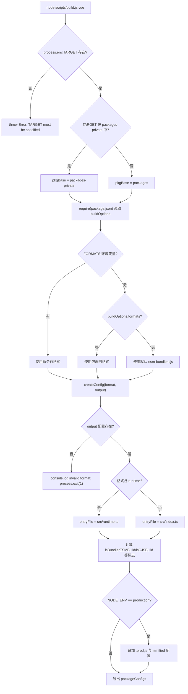

# Chapter 1: Macro Cognition: The Engineering Design Philosophy of the Core Repository

Before we begin tracing any single line of reactivity or virtual DOM implementation, we must first understand the engineering substrate upon which this code depends for its existence. Opening the Vue core repository, the first thing that catches the eye is not the framework's core logic, but`package.json`and`pnpm-workspace.yaml`and other engineering configuration files—they contain no runtime functionality whatsoever, yet they determine whether the entire framework can be correctly built, tested, and released. This chapter aims to answer precisely this preliminary question: what exactly is the core repository. It is not`@vue/runtime-core`that npm package, but rather the engineering substrate that hosts`runtime-core`、`reactivity`、`compiler-sfc`and more than a dozen publicly released packages, plus`sfc-playground`、`template-explorer`and other private experimental packages. Understanding how this substrate is organized is the prerequisite for all subsequent chapters (build, types, release, size budget). This chapter will unfold along three main threads: the dual-directory structure of the workspace, the unified constraints of root-level TypeScript and Rollup, and the decoupling philosophy between the "source repository" and "release artifacts."

# I. Dual-Directory Structure: Physical Isolation Between packages and packages-private

## Intuitive Model

Imagine the core repository as an R&D building.`packages/`is the official product line, where what is produced must be branded and sold to the market;`packages-private/`is the internal laboratory, where samples are used only for debugging and demonstration and are never shipped externally. Both share the same utilities (dependencies, build tools), but the access control system (release process) treats them differently.

Without this layer of physical isolation, an internal debugging playground package could easily be mistakenly published to npm—this is not a hypothetical, but a classic monorepo incident.

## Data Structure and Memory Layout

The workspace boundary is defined by`pnpm-workspace.yaml`. It has only three effective declarations:

[FACT:pnpm-workspace.yaml:1-3]

```yaml
packages:
  - 'packages/*'
  - 'packages-private/*'
```

These two globs tell pnpm:`packages/`and`packages-private/`each subdirectory under is an independent package. pnpm will create symbolic links for them, so that`@vue/runtime-core`when referencing`@vue/reactivity`points directly to the local source directory, rather than downloading from the registry.

Immediately following is the`catalog:`section, which is pnpm's**dependency version catalog**mechanism:

[FACT:pnpm-workspace.yaml:5-13]

```yaml
catalog:
  '@babel/parser': ^7.29.8
  '@babel/types': ^7.29.8
  'entities': '^7.0.1'
  'estree-walker': ^2.0.2
  'magic-string': ^0.30.21
  'source-map-js': ^1.2.1
  'vite': ^8.3.0
  '@vitejs/plugin-vue': ^6.0.9
```

Root`package.json`corresponds to`"@babel/parser": "catalog:"` [FACT:package.json:65-65]。`catalog:`is a placeholder, which pnpm replaces with the version declared in the catalog section during installation. The benefit of doing this is:`@babel/parser`the version of is maintained in only`pnpm-workspace.yaml`one place, and all packages referencing it automatically align, eliminating version drift where "Package A uses 7.28, Package B uses 7.29."

## Scenario-Driven Walkthrough: What Happens After a`pnpm install`Once

Suppose you execute`pnpm install`in the repository root. Plug into this scenario and trace step by step:

**Step 1: preinstall gate.**pnpm triggers the root`package.json`'s`preinstall`script before installation:

[FACT:package.json:45-45]

```json
"preinstall": "npx only-allow pnpm"
```

> **[Design Inference & Architectural Trade-offs]**
> `only-allow pnpm`checks whether the current package manager is pnpm, and if not, directly errors out and exits. The existence of this script means: installing the core repository with npm or yarn will fail. Why must pnpm be locked in? Because the core repository relies on pnpm's workspace symlinks and catalog mechanism, npm's workspaces do not support`catalog:`syntax, and yarn's PnP mode changes module resolution paths, causing`createRequire`behavior in build scripts to be inconsistent.

**Step 2: Resolve workspace.**pnpm reads`pnpm-workspace.yaml`, scans`packages/*`and`packages-private/*`, and for each directory containing`package.json`creates a package record.

**Step 3: Apply catalog replacement.**Root`package.json`all in`catalog:`The placeholders are replaced with the actual versions from the catalog section, then installed uniformly.

**Step 4: postinstall hook.**Triggered after installation completes:

[FACT:package.json:46-46]

```json
"postinstall": "simple-git-hooks"
```

`simple-git-hooks`Read the root`package.json`in the`simple-git-hooks`field, write the Git hook to`.git/hooks/`：

[FACT:package.json:48-51]

```json
"simple-git-hooks": {
  "pre-commit": "pnpm lint-staged && pnpm check",
  "commit-msg": "node scripts/verify-commit.js"
}
```

`pre-commit`The hook runs lint-staged and type checking before every commit,`commit-msg`The hook validates commit message format (Vue uses conventional commits). Note the`preinstall`and`postinstall`symmetry: the former guards the gate (only allows pnpm), the latter sets up defenses (installs Git hooks).

## Design thinking and pitfalls

> **[Design Inference & Architectural Trade-offs]**
> **Why use two globs instead of one`packages*/`？**Explicitly listing two directories makes the semantics of "public" and "private" visible at the configuration level. Any new developer reading`pnpm-workspace.yaml`immediately knows the repository has two types of packages. If written as`packages*/`, this semantics is hidden.

**`allowBuilds`and supply chain security.**Note this configuration:

[FACT:pnpm-workspace.yaml:15-21]

```yaml
allowBuilds:
  '@parcel/watcher': true
  '@swc/core': true
  'esbuild': true
  'puppeteer': true
  'simple-git-hooks': true
  'unrs-resolver': true
```

pnpm by default forbids dependency packages from executing install scripts (postinstall), because this is a common entry point for supply chain attacks.`allowBuilds`is a whitelist: only the listed packages are allowed to run build scripts.`@swc/core`、`esbuild`needs to download platform-specific native binaries,`puppeteer`needs to download Chromium,`simple-git-hooks`needs to write Git hooks—these are all legitimate build-time behaviors, so they are explicitly allowed.

**`minimumReleaseAge: 1440`The deeper meaning of.**This line of configuration requires that newly published dependency versions must be "at least 24 hours old" (1440 minutes) before they are allowed to be installed:

[FACT:pnpm-workspace.yaml:33-33]

```yaml
minimumReleaseAge: 1440
```

> **[Design Inference & Architectural Trade-offs]**
> This is a cooldown mechanism to defend against npm supply chain poisoning. After an attacker hijacks a package and publishes a malicious version, it is usually discovered and taken down within hours. Setting a 24-hour cooldown allows the core repository to avoid this window. And`minimumReleaseAgeExclude`allows exceptions for specific security patches:

[FACT:pnpm-workspace.yaml:36-38]

```yaml
minimumReleaseAgeExclude:
  # Renovate security update: vitest@4.1.11
  - vitest@4.1.11
```

The comment explicitly states that this is a security update triggered by Renovate and needs to take effect immediately, so the cooldown is exempted.

---

# Part Two: Root-level tsconfig: uniformly constraining the type boundaries of all subpackages

## Intuitive model

If each subpackage maintains its own tsconfig, there will be cracks like "package A uses`strict: false`, package B uses`strict: true`". The root-level tsconfig is the**constitution**: it defines the type rules that all subpackages must jointly obey, and subpackages can only append on top of it, not violate it.

## Data structures and memory layout

The root`tsconfig.json`'s`compilerOptions`is the foundation of the entire repository's type system. Pick out a few key fields:

[FACT:tsconfig.json:5-29]

```json
"target": "es2016",
"module": "esnext",
"moduleResolution": "bundler",
"strict": true,
"noUnusedLocals": true,
"isolatedModules": true,
"isolatedDeclarations": true,
"composite": true,
"paths": {
  "@vue/compat": ["./packages/vue-compat/src"],
  "@vue/*": ["./packages/*/src"],
  "vue": ["./packages/vue/src"]
}
```

Field-by-field interpretation:

- `target: es2016`: output syntax downgraded to ES2016. This echoes the esbuild`target`in the Rollup configuration (`isServerRenderer || isCJSBuild ? 'es2019' : 'es2016'` [FACT:rollup.config.js:337-337]）。
- `moduleResolution: bundler`: uses bundler-style module resolution, allowing omitted extensions and supporting the`exports`field.
- `strict: true`: enables all strict checks, including`strictNullChecks`、`noImplicitAny`, etc.
- `noUnusedLocals: true`: unused local variables directly error. This rule has practical significance in conjunction with Tree-shaking—unused variables are often a signal of dead code.
- `isolatedModules: true`: requires each file to be independently transpilable. This is a prerequisite for tools like esbuild/swc that "transpile file by file without cross-file type analysis."
- `isolatedDeclarations: true`: requires all exports to explicitly annotate types. This rule directly serves the`.d.ts`generation pipeline—only explicit annotations allow`tsc`to quickly generate declaration files without full type inference.
- `composite: true`: enables the incremental build metadata required for project references.

`paths`The field is the workspace's**type-layer mirror**：`@vue/*`mapped to`./packages/*/src`, allowing TypeScript to resolve directly to source code at compile time, rather than the symlinks in`node_modules`. This complements pnpm's runtime symlinks—runtime relies on pnpm, compile time relies on paths.

## Scenario-driven Walkthrough: one`pnpm check`type check

`check`The script is`tsc --incremental --noEmit` [FACT:package.json:15-15]. Substituting into this scenario:

**Step 1: Read the include scope.**tsconfig's`include`determines which files participate in checking:

[FACT:tsconfig.json:31-39]

```json
"include": [
  "packages/global.d.ts",
  "packages/*/src",
  "packages/*/__tests__",
  "packages/vue/jsx-runtime",
  "packages/runtime-dom/types/jsx.d.ts",
  "scripts/*",
  "rollup.*.js"
]
```

Note that`scripts/*`and`rollup.*.js`are also within the checking scope. This means the build scripts themselves are also subject to type constraints—`rollup.config.js`at the top of`// @ts-check` [FACT:rollup.config.js:1-1]combined with JSDoc type annotations allows this pure JS file to also be checked by`tsc`.

**Step 2: Apply exclude exclusions.**

[FACT:tsconfig.json:40-40]

```json
"exclude": ["packages-private/sfc-playground/src/vue-dev-proxy*"]
```

> **[Design Inference & Architectural Trade-offs]**
> `sfc-playground`The`vue-dev-proxy`files in are excluded. Why? Such files are usually dynamically generated proxy code at runtime, whose type shapes are unstable, and including them in checks would create noise.

**Step 3: Incremental checking.** `--incremental`lets`tsc`cache the previous check results to`.tsbuildinfo`, and only rechecks changed files.`--noEmit`means check only without output—type checking and artifact generation are two independent pipelines.

## Design thinking and pitfalls

**`isolatedDeclarations`The cost and benefit of.**After enabling this rule, any export must explicitly annotate the return type, for example`export function foo(): number`instead of`export function foo() { return 1 }`. This increases writing cost, but in exchange for a substantial increase in`.d.ts`generation speed—`tsc`declaration files can be produced without cross-file inference. This echoes the`build-dts`in the`tsc -p tsconfig.build.json --noCheck`script`--noCheck`: since types are already explicitly annotated, checking can even be skipped when generating declaration files.

**`types`Global injection of the field.**

[FACT:tsconfig.json:21-21]

```json
"types": ["vitest/globals", "puppeteer", "node"]
```

These three type packages are globally injected, meaning test files can directly use`describe`、`it`、`expect`without importing, and e2e tests can directly use the types of`puppeteer`. This is a trade-off between convenience and pollution—the more global types there are, the greater the risk of naming conflicts, but the better the writing experience for test code.

---

# 3. Rollup Configuration: A Unified Factory from buildOptions to Multi-Format Artifacts

## Intuitive Model

The Rollup configuration is the core repository's**final assembly plant**. It doesn't care what a specific package does; it only cares about "which formats this package needs to produce, where the entry file for each format is, and which dependencies should be externalized." The`package.json`in each sub-package's`buildOptions`field is the shipping manifest attached to the package, and the assembly plant works according to the manifest.

## Data Structures and Memory Layout

The entry point of the configuration file establishes the "build by package" model:

[FACT:rollup.config.js:32-44]

```js
if (!process.env.TARGET) {
  throw new Error('TARGET package must be specified via --environment flag.')
}
...
const privatePackages = fs.readdirSync('packages-private')
const pkgBase = privatePackages.includes(process.env.TARGET)
  ? `packages-private`
  : `packages`
const packagesDir = path.resolve(__dirname, pkgBase)
const packageDir = path.resolve(packagesDir, process.env.TARGET)
...
const pkg = require(resolve(`package.json`))
const packageOptions = pkg.buildOptions || {}
const name = packageOptions.filename || path.basename(packageDir)
```

Key design points:`TARGET`The environment variable specifies which package to build. The configuration uses`fs.readdirSync('packages-private')`to determine whether the package belongs to a public or private directory, thereby deciding`pkgBase`. This is a**runtime directory probe**—there's no need to maintain a list of "which packages are private"; the directory structure itself is the truth.

`buildOptions`is a custom field in the sub-package's`package.json`,`packageOptions.filename`determines the artifact filename prefix,`packageOptions.formats`determines the default build format.

The mapping from format to artifact is defined by`outputConfigs`:

[FACT:rollup.config.js:58-88]

```js
const outputConfigs = {
  'esm-bundler': { file: resolve(`dist/${name}.esm-bundler.js`), format: 'es' },
  'esm-browser': { file: resolve(`dist/${name}.esm-browser.js`), format: 'es' },
  cjs:           { file: resolve(`dist/${name}.cjs.js`),         format: 'cjs' },
  global:        { file: resolve(`dist/${name}.global.js`),      format: 'iife' },
  'esm-bundler-runtime': { file: resolve(`dist/${name}.runtime.esm-bundler.js`), format: 'es' },
  'esm-browser-runtime': { file: resolve(`dist/${name}.runtime.esm-browser.js`), format: 'es' },
  'global-runtime':      { file: resolve(`dist/${name}.runtime.global.js`),      format: 'iife' },
}
```

Seven formats covering three consumption scenarios:`esm-bundler`for consumption by bundlers like Vite/webpack,`esm-browser`for native browser ESM consumption,`global`for`<script>`tag consumption. Those with the`-runtime`suffix are "runtime-only" builds, open only to the main`vue`package.

## Scenario-Driven Walkthrough: The Complete Decision Flow of a Single`pnpm build vue`

Let's walk through the scenario of executing`node scripts/build.js vue`.`TARGET=vue`, tracing the decisions inside`createConfig`:

**Step 1: Determine the format list.**

[FACT:rollup.config.js:91-92]

```js
const defaultFormats = ['esm-bundler', 'cjs']
const inlineFormats = process.env.FORMATS && process.env.FORMATS.split(',')
const packageFormats = inlineFormats || packageOptions.formats || defaultFormats
const packageConfigs = process.env.PROD_ONLY
  ? []
  : packageFormats.map(format => createConfig(format, outputConfigs[format]))
```

Priority: command line`FORMATS`> sub-package`buildOptions.formats`> default`['esm-bundler', 'cjs']`。`PROD_ONLY`If the environment variable is true, skip non-production builds and keep only the subsequently appended`.prod.js`configuration.

**Step 2: Compute build flags.** `createConfig`Internally derives a set of boolean flags from the format string:

[FACT:rollup.config.js:131-142]

```js
const isProductionBuild = process.env.__DEV__ === 'false' || /\.prod\.js$/.test(output.file)
const isBundlerESMBuild = /esm-bundler/.test(format)
const isBrowserESMBuild = /esm-browser/.test(format)
const isServerRenderer = name === 'server-renderer'
const isCJSBuild = format === 'cjs'
const isGlobalBuild = /global/.test(format)
const isCompatPackage = pkg.name === '@vue/compat'
const isCompatBuild = !!packageOptions.compat
const isBrowserBuild =
  (isGlobalBuild || isBrowserESMBuild || isBundlerESMBuild) &&
  !packageOptions.enableNonBrowserBranches
```

These flags are the**single source of truth**for all subsequent decisions: entry file selection, define replacement, external determination, plugin assembly—all depend on them.

**Step 3: Select the entry file.**

[FACT:rollup.config.js:159-168]

```js
let entryFile = /runtime$/.test(format) ? `src/runtime.ts` : `src/index.ts`

if (isCompatPackage && (isBrowserESMBuild || isBundlerESMBuild)) {
  entryFile = /runtime$/.test(format)
    ? `src/esm-runtime.ts`
    : `src/esm-index.ts`
}
```

The default entry is`src/index.ts`, and runtime-only builds use`src/runtime.ts`. The compat package (`@vue/compat`, i.e., the Vue 2 compatibility build) needs to provide both default and named exports, which causes Rollup to error on non-ESM targets, so a separate`esm-index.ts` / `esm-runtime.ts`entry is used for the ESM build.

**Step 4: Generate the define replacement table.** `resolveDefine`Replaces compile-time constants like`__DEV__`、`__BROWSER__`in the source code with literals:

[FACT:rollup.config.js:170-201]

```js
const replacements = {
  __COMMIT__: `"${process.env.COMMIT}"`,
  __VERSION__: `"${masterVersion}"`,
  __TEST__: `false`,
  __BROWSER__: String(isBrowserBuild),
  __GLOBAL__: String(isGlobalBuild),
  __ESM_BUNDLER__: String(isBundlerESMBuild),
  __ESM_BROWSER__: String(isBrowserESMBuild),
  __CJS__: String(isCJSBuild),
  __SSR__: String(!isGlobalBuild),
  __COMPAT__: String(isCompatBuild),
  __FEATURE_SUSPENSE__: `true`,
  __FEATURE_OPTIONS_API__: isBundlerESMBuild ? `__VUE_OPTIONS_API__` : `true`,
  __FEATURE_PROD_DEVTOOLS__: isBundlerESMBuild ? `__VUE_PROD_DEVTOOLS__` : `false`,
  __FEATURE_PROD_HYDRATION_MISMATCH_DETAILS__: isBundlerESMBuild ? `__VUE_PROD_HYDRATION_MISMATCH_DETAILS__` : `false`,
}
```

There's an elegant layering here:**feature flags are not hardcoded in the esm-bundler build, but kept as identifiers like`__VUE_OPTIONS_API__`**, left for the end user's bundler to replace. This way users can disable Options API support via`define: { __VUE_OPTIONS_API__: false }`, thereby tree-shaking the related code. In global/esm-browser builds, however, these flags are hardcoded to`true`/`false`, because artifacts consumed directly by the browser have no bundler involved.

**Step 5: Allow environment variable overrides.**

[FACT:rollup.config.js:208-216]

```js
// allow inline overrides like
//__RUNTIME_COMPILE__=true pnpm build runtime-core
Object.keys(replacements).forEach(key => {
  if (key in process.env) {
    const value = process.env[key]
    assert(typeof value === 'string')
    replacements[key] = value
  }
})
```

Any define key can be overridden by an environment variable of the same name. The example given in the comments is`__RUNTIME_COMPILE__=true pnpm build runtime-core`—used for debugging specific compilation branches.

**Step 6: Assemble the plugin chain.**

[FACT:rollup.config.js:324-342]

```js
plugins: [
  json({ namedExports: false }),
  alias({ entries }),
  enumPlugin,
  ...resolveReplace(),
  esbuild({
    tsconfig: path.resolve(__dirname, 'tsconfig.json'),
    sourceMap: output.sourcemap,
    minify: false,
    target: isServerRenderer || isCJSBuild ? 'es2019' : 'es2016',
    define: resolveDefine(),
  }),
  ...resolveNodePlugins(),
  ...plugins,
],
```

Plugin order matters:`json`handles JSON imports first,`alias`maps`@vue/*`to source paths,`enumPlugin`does enum inlining,`replace`does string replacement,`esbuild`does TS transpilation. Note that`esbuild`'s`tsconfig`points to the root tsconfig—**all sub-packages share the same type configuration**, which is precisely the build-time manifestation of the "constitution" discussed in Section 2.

**Step 7: Append production builds.**If`NODE_ENV=production`：

[FACT:rollup.config.js:97-114]

```js
if (process.env.NODE_ENV === 'production') {
  packageFormats.forEach(format => {
    if (packageOptions.prod === false) {
      return
    }
    if (format === 'cjs') {
      packageConfigs.push(createProductionConfig(format))
    }
    if (/^(global|esm-browser)(-runtime)?/.test(format)) {
      packageConfigs.push(createMinifiedConfig(format))
    }
  })
}
```

The CJS format appends a`.prod.js`version (replacing with`__DEV__=false`), and the global and esm-browser formats append a minified version (minified with swc).`packageOptions.prod === false`Packages with

can opt out of this mechanism.



## Copy

**`external`Design Reflections and Pitfalls** `resolveExternal`'s three-branch strategy.

[FACT:rollup.config.js:257-283]

```js
function resolveExternal() {
  const treeShakenDeps = ['source-map-js', '@babel/parser', 'estree-walker', 'entities/decode']

  if (isGlobalBuild || isBrowserESMBuild || isCompatPackage) {
    if (!packageOptions.enableNonBrowserBranches) {
      return treeShakenDeps
    }
  } else {
    return [
      ...Object.keys(pkg.dependencies || {}),
      ...Object.keys(pkg.peerDependencies || {}),
      ...['path', 'url', 'stream'],
      ...treeShakenDeps,
    ]
  }
}
```

Copy`treeShakenDeps`Browser builds (global/esm-browser) inline all dependencies, listing only`dependencies`as external to suppress warnings—these dependencies are never actually referenced in the browser branch and will be removed by tree-shaking. Node/esm-bundler builds externalize all`peerDependencies`and

**`onwarn`, letting consumers manage dependency versions themselves.**

[FACT:rollup.config.js:344-348]

```js
onwarn: (msg, warn) => {
  if (msg.code !== 'CIRCULAR_DEPENDENCY') {
    warn(msg)
  }
},
```

Copy`runtime-core`Circular dependency warnings are silenced. Vue's`reactivity`and

**`treeshake.moduleSideEffects: false`have a legitimate circular reference (the reactivity system needs to reference the component instance type), and these cycles are safe at runtime, so they are filtered.**

[FACT:rollup.config.js:355-355]

```js
treeshake: {
  moduleSideEffects: false,
},
```

Copy**This tells Rollup: all modules have no side effects, so unreferenced imports can be safely removed. This is an**aggressive assumption

**—if a module executes side-effect code at the top level (such as registering a global variable), it might be incorrectly removed. Vue's source code guarantees by convention that all modules are pure, so this optimization can be enabled.`pure_getters`swc-minify's**

[FACT:rollup.config.js:373-388]

```js
async renderChunk(contents, _, { format }) {
  const { code } = await minifySwc(contents, {
    module: format === 'es',
    format: { comments: false },
    compress: { ecma: 2016, pure_getters: true },
    safari10: true,
    mangle: true,
  })
  return { code: banner + code, map: null }
}
```

`pure_getters: true`Copy`obj.foo`Tells the minifier that "property access has no side effects," so unused getter calls can be safely removed. This is dangerous for Vue's reactive code—`track()`) rather than implicit getter side effects, so it is safe.`map: null`indicates that no sourcemap is generated after compression—production artifacts do not need debugging mappings.

---

# Design thinking: why the source repository and release artifacts must be decoupled

Returning to the core proposition of this chapter. The engineering design of the core repository has a main thread running throughout:**The responsibility of the source repository is "production," and the responsibility of release artifacts is "consumption." The two are decoupled through the build pipeline.**。

This is specifically reflected in three aspects:

**First, source code is not published directly.** `package.json`The`private: true` [FACT:package.json:2-2]indicates that the root package is never published. In each subpackage's`package.json`the`main`/`module`/`exports`field points to`dist/`artifacts under, rather than`src/`. When users install`vue`what they get is the built`.js`and`.d.ts`, while the source code remains in the repository.

**Second, the artifact format is determined by the consumption scenario.**The seven formats are not listed arbitrarily, but correspond to seven real consumption paths: Vite users get`esm-bundler`, CDN users get`global`, Node SSR users get`cjs`. The format selection logic is centralized in`rollup.config.js`one place, and subpackages only need to declare in`buildOptions.formats`which ones are needed.

**Third, types and implementation are separated.** `build-dts`The script`tsc -p tsconfig.build.json --noCheck && rollup -c rollup.dts.config.js` [FACT:package.json:9-9]indicates that`.d.ts`generation is an independent pipeline.`isolatedDeclarations: true`allows declaration file generation to skip type checking (`--noCheck`), because the types have already been explicitly annotated.

> **[Design Inference & Architectural Trade-offs]**
> The deeper motivation for this decoupling is:**The way source code is organized serves developers, and the way artifacts are organized serves consumers; the optimal solutions for the two are different**. Source code needs a clear directory structure, complete type information, and debuggable sourcemaps; artifacts need minimal size, the correct module format, and a stable API surface. Forcing the two to be unified (for example, directly publishing TS source code) would harm the experience on both ends at the same time.

---

# Chapter summary

This chapter established a macro-level understanding of the core repository from three dimensions:

1. **Dual-directory structure**：`packages/`and`packages-private/`physical isolation, combined with pnpm workspace symlinks and the catalog version directory, achieves a clear boundary between "public packages" and "private packages."`preinstall`gatekeeping,`allowBuilds`whitelist,`minimumReleaseAge`and cooldown period together form the supply chain security defense line.

2. **Root-level tsconfig**: as the type constitution for all subpackages, it implements compile-time workspace resolution through`paths`mapping, and supports incremental builds and fast declaration file generation through`isolatedDeclarations`and`composite`.

3. **Rollup unified factory**: with the`TARGET`environment variable as the entry point, it reads subpackage metadata through`buildOptions`, and uses a set of boolean flags to drive entry selection, define replacement, external determination, and plugin assembly, ultimately producing artifacts in seven formats.

The core philosophy is**the decoupling of the source repository and release artifacts**: the repository is responsible for production, artifacts are responsible for consumption, and the build pipeline is the only bridge between the two.

---

# Chapter transition

This chapter answered "what the core repository is." But the static structure of the repository is only the stage; the real drama happens during the execution of a build request:`scripts/build.js`how command-line arguments are parsed, how the Rollup API is called, and how build failures and concurrency are handled. The next chapter will trace the end-to-end journey of a build request from input to artifact, transforming the static understanding established in this chapter into a dynamic execution view.

# Chapter reflection and self-test

Q1: If in`pnpm-workspace.yaml`the`minimumReleaseAge: 1440`were changed to`0`, what risk would be introduced in dependency upgrade scenarios? Why is`minimumReleaseAgeExclude`necessary?

**Reference analysis**：

`minimumReleaseAge: 1440` [FACT:pnpm-workspace.yaml:33-33]requires that newly published dependency versions must be at least 24 hours old before they are allowed to be installed. If changed to`0`, then any just-published version can be pulled in immediately.

Risk scenario: an attacker hijacks a transitive dependency (for example, a patch version of`@babel/parser`) and publishes a version containing a malicious postinstall script. During the 24-hour cooldown period, the community usually discovers the problem and removes that version; if the cooldown period is 0, the core repository's CI may automatically upgrade and execute the malicious script within the attack window.

`minimumReleaseAgeExclude` [FACT:pnpm-workspace.yaml:36-38]exists because the cooldown mechanism conflicts with the urgency of security patches. The`vitest@4.1.11`in the comment is a security update detected by Renovate—such updates need to take effect immediately, and waiting 24 hours would instead extend the exposure window. Therefore, an explicit exemption list is needed to let security updates bypass the cooldown period. This reflects the security design principle of "conservative by default, explicit for exceptions."

Q2: `rollup.config.js`In`resolveDefine`the handling of`__FEATURE_OPTIONS_API__`is`isBundlerESMBuild ? '__VUE_OPTIONS_API__' : 'true'`. If it were incorrectly changed to return`'true'`for all formats, what impact would that have on end users?

**Reference analysis**：

[FACT:rollup.config.js:192-194]

```js
__FEATURE_OPTIONS_API__: isBundlerESMBuild
  ? `__VUE_OPTIONS_API__`
  : `true`,
```

In the esm-bundler build,`__FEATURE_OPTIONS_API__`is preserved as the identifier`__VUE_OPTIONS_API__`and left for the end user's bundler to replace. Users can set`define: { __VUE_OPTIONS_API__: false }`in their own build configuration, thereby allowing Tree-shaking to remove all Options API-related code (`data`、`methods`、`computed`handling logic for options such as), significantly reducing artifact size.

If changed to return`'true'`for all formats, then the Options API code in the esm-bundler artifact would be hard-coded and retained, the user's`define`configuration would become ineffective, and Tree-shaking would be impossible. For a project that only uses the Composition API, this would add several KB to the artifact size for no reason.

The key insight of this design is:**the final form of the esm-bundler artifact is determined by the user's bundler, so feature flags must be deferred until the user's build time for resolution**. In contrast, global/esm-browser artifacts run directly in the browser, with no bundler involved, so they must be hard-coded.

Q3: `rollup.config.js`of`resolveExternal`, the browser build only returns`treeShakenDeps`as external, while the Node build returns all`dependencies`. Suppose one day someone adds a new runtime dependency`runtime-core`to`foo-lib`, but forgets to update`resolveExternal`'s logic. What happens in the browser build?

**Reference Analysis**：

[FACT:rollup.config.js:257-283]

The browser build (`isGlobalBuild || isBrowserESMBuild`) only returns`!packageOptions.enableNonBrowserBranches`when`treeShakenDeps`（`source-map-js`、`@babel/parser`、`estree-walker`、`entities/decode`). This means`foo-lib`is not in the external list,

At this point, we have seen from a macro level the overall design philosophy of the core repository as an engineering mothership: the dual-directory workspace structure defines the boundary between public packages and private experimental packages, the root-level TypeScript and Rollup configurations provide unified constraints, and the decoupling of the source repository from published artifacts makes multi-format output possible. These insights pave the way for deeper exploration of specific engineering pipelines later. In the next chapter, we will shift our view from static structure to dynamic flow, starting from`node scripts/build.js vue`as the starting point, tracing the end-to-end journey of a complete build request from command-line argument parsing, target package location, Rollup configuration generation, to artifact writing to disk, and seeing how build.js parses flags such as formats/devOnly/release through parseArgs, how it dynamically requires the target package's package.json and reads buildOptions, and ultimately drives rollup.config.js to produce multi-format artifacts such as esm-bundler, cjs, and global.
