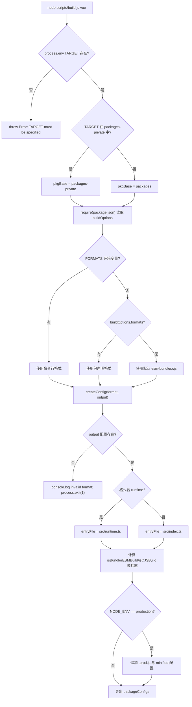

# Chapter 01: Macro Cognition: Engineering Philosophy of the core Repository


在开始追踪任何一行响应式或虚拟 DOM 的实现之前，我们首先需要理解这些代码赖以生存的工程化母体。打开 Vue core 仓库，最先映入眼帘的并非框架核心逻辑，而是 `package.json` 与 `pnpm-workspace.yaml` 这类工程配置文件——它们不包含任何运行时功能，却决定了整个框架能否被正确构建、测试与发布。本章要回答的正是这个前置问题：core 仓库到底是什么。它并非 `@vue/runtime-core` 那个 npm 包，而是承载 `runtime-core`、`reactivity`、`compiler-sfc` 等十余个公开发布包，外加 `sfc-playground`、`template-explorer` 等私有实验包的工程化母体。理解这个母体的组织方式，是后续所有章节（构建、类型、发布、体积预算）的前提。本章将沿三条主线展开：workspace 的Dual-Directory Workspace Architecture、根级 TypeScript 与 Rollup 的统一约束，以及「源码仓库」与「发布产物」的解耦哲学。


## Intuitive Architectural Model

把 core 仓库想象成一栋研发大楼。`packages/` 是正式产品线，生产出来的东西要贴上商标卖到市场上；`packages-private/` 是内部试验室，里面的样品只用于调试和演示，绝不对外发货。两者共用同一套水电（依赖、构建工具），但门禁系统（发布流程）对它们区别对待。

若没有这层物理隔离，一个内部调试用的 playground 包很容易被误发布到 npm——这不是假设，而是 monorepo 的经典事故。

## Data Structures & Memory Layout

workspace 的边界由 `pnpm-workspace.yaml` 定义。它只有三行有效声明：

[FACT:pnpm-workspace.yaml:1-3](https://github.com/vuejs/core/blob/4ab865a848a1da3d10fb674f857e5fff13094644/pnpm-workspace.yaml#L1-L3)

```yaml
packages:
  - 'packages/*'
  - 'packages-private/*'
```

这两条 glob 告诉 pnpm：`packages/` 和 `packages-private/` 下的每个子目录都是一个独立包。pnpm 会为它们建立符号链接，使 `@vue/runtime-core` 引用 `@vue/reactivity` 时直接指向本地源码目录，而非从 registry 下载。

紧接着的 `catalog:` 段是 pnpm 的**依赖版本目录**机制：

[FACT:pnpm-workspace.yaml:5-13](https://github.com/vuejs/core/blob/4ab865a848a1da3d10fb674f857e5fff13094644/pnpm-workspace.yaml#L5-L13)

```yaml
catalog:
  '@babel/parser': ^7.29.8
  '@babel/types': ^7.29.8
  'entities': '^7.0.1'
  'estree-walker': ^2.0.2
  'magic-string': ^0.30.21
  'source-map-js': ^1.2.1
  'vite': ^8.3.0
  '@vitejs/plugin-vue': ^6.0.9
```

根 `package.json` 中对应写的是 `"@babel/parser": "catalog:"` [FACT:package.json:65-65](https://github.com/vuejs/core/blob/4ab865a848a1da3d10fb674f857e5fff13094644/package.json#L65-L65)。`catalog:` 是一个占位符，pnpm 在安装时把它替换为 catalog 段中声明的版本。这样做的收益是：`@babel/parser` 的版本只在 `pnpm-workspace.yaml` 一处维护，所有引用它的包自动对齐，杜绝了「A 包用 7.28、B 包用 7.29」的版本漂移。

## 场景驱动 Walkthrough：一次 `pnpm install` 之后发生了什么

假设你在仓库根目录执行 `pnpm install`。代入这个场景，逐步追踪：

**第一步：preinstall 门禁。** pnpm 在安装前会触发根 `package.json` 的 `preinstall` 脚本：

[FACT:package.json:45-45](https://github.com/vuejs/core/blob/4ab865a848a1da3d10fb674f857e5fff13094644/package.json#L45-L45)

```json
"preinstall": "npx only-allow pnpm"
```

> **〔Design Inference & Architectural Trade-offs〕**
> `only-allow pnpm` 会检查当前包管理器是否为 pnpm，若不是则直接报错退出。这行脚本的存在意味着：用 npm 或 yarn 安装 core 仓库会失败。为什么必须锁死 pnpm？ 因为 core 仓库依赖 pnpm 的 workspace 符号链接与 catalog 机制，npm 的 workspaces 不支持 `catalog:` 语法，yarn 的 PnP 模式又会改变模块解析路径，导致构建脚本中的 `createRequire` 行为不一致。

**第二步：解析 workspace。** pnpm 读取 `pnpm-workspace.yaml`，扫描 `packages/*` 与 `packages-private/*`，为每个含 `package.json` 的目录建立包记录。

**第三步：应用 catalog 替换。** 根 `package.json` 中所有 `catalog:` 占位符被替换为 catalog 段的实际版本，随后统一安装。

**第四步：postinstall 钩子。** 安装完成后触发：

[FACT:package.json:46-46](https://github.com/vuejs/core/blob/4ab865a848a1da3d10fb674f857e5fff13094644/package.json#L46-L46)

```json
"postinstall": "simple-git-hooks"
```

`simple-git-hooks` 读取根 `package.json` 中的 `simple-git-hooks` 字段，把 Git 钩子写入 `.git/hooks/`：

[FACT:package.json:48-51](https://github.com/vuejs/core/blob/4ab865a848a1da3d10fb674f857e5fff13094644/package.json#L48-L51)

```json
"simple-git-hooks": {
  "pre-commit": "pnpm lint-staged && pnpm check",
  "commit-msg": "node scripts/verify-commit.js"
}
```

`pre-commit` 钩子在每次提交前跑 lint-staged 与类型检查，`commit-msg` 钩子校验提交信息格式（Vue 使用 conventional commits）。注意 `preinstall` 与 `postinstall` 的对称性：前者守门（只允许 pnpm），后者布防（安装 Git 钩子）。

## 设计思考与踩坑

> **〔Design Inference & Architectural Trade-offs〕**
> **为什么用两条 glob 而非一条 `packages*/`？**  显式列出两个目录，是为了让「公开」与「私有」的语义在配置层面就可见。任何新加入的开发者读到 `pnpm-workspace.yaml` 第一眼就知道仓库有两类包。若写成 `packages*/`，这个语义就被隐藏了。

**`allowBuilds` 与供应链安全。** 注意这段配置：

[FACT:pnpm-workspace.yaml:15-21](https://github.com/vuejs/core/blob/4ab865a848a1da3d10fb674f857e5fff13094644/pnpm-workspace.yaml#L15-L21)

```yaml
allowBuilds:
  '@parcel/watcher': true
  '@swc/core': true
  'esbuild': true
  'puppeteer': true
  'simple-git-hooks': true
  'unrs-resolver': true
```

pnpm 默认禁止依赖包执行安装脚本（postinstall），因为这是供应链攻击的常见入口。`allowBuilds` 是白名单：只有列出的包才被允许运行构建脚本。`@swc/core`、`esbuild` 需要下载平台相关的原生二进制，`puppeteer` 需要下载 Chromium，`simple-git-hooks` 需要写 Git 钩子——这些都是合法的构建期行为，因此被显式放行。

**`minimumReleaseAge: 1440` 的深意。** 这行配置要求新发布的依赖版本必须「满 24 小时」（1440 分钟）才允许被安装：

[FACT:pnpm-workspace.yaml:33-33](https://github.com/vuejs/core/blob/4ab865a848a1da3d10fb674f857e5fff13094644/pnpm-workspace.yaml#L33-L33)

```yaml
minimumReleaseAge: 1440
```

> **〔Design Inference & Architectural Trade-offs〕**
> 这是防御 npm 供应链投毒的冷却期机制。攻击者劫持某个包并发布恶意版本后，通常会在数小时内被发现并撤下。设置 24 小时冷却期，可以让 core 仓库避开这个窗口。而 `minimumReleaseAgeExclude` 则允许对特定安全补丁破例：

[FACT:pnpm-workspace.yaml:36-38](https://github.com/vuejs/core/blob/4ab865a848a1da3d10fb674f857e5fff13094644/pnpm-workspace.yaml#L36-L38)

```yaml
minimumReleaseAgeExclude:
  # Renovate security update: vitest@4.1.11
  - vitest@4.1.11
```

注释明确说明这是 Renovate 触发的安全更新，需要立即生效，因此豁免冷却期。

---


## Intuitive Architectural Model

如果每个子包各自维护一份 tsconfig，就会出现「A 包用 `strict: false`、B 包用 `strict: true`」的裂缝。根级 tsconfig 是**宪法**：它规定所有子包共同遵守的类型规则，子包只能在此基础上追加，不能违背。

## Data Structures & Memory Layout

根 `tsconfig.json` 的 `compilerOptions` 是整个仓库类型系统的地基。挑出几个关键字段：

[FACT:tsconfig.json:5-29](https://github.com/vuejs/core/blob/4ab865a848a1da3d10fb674f857e5fff13094644/tsconfig.json#L5-L29)

```json
"target": "es2016",
"module": "esnext",
"moduleResolution": "bundler",
"strict": true,
"noUnusedLocals": true,
"isolatedModules": true,
"isolatedDeclarations": true,
"composite": true,
"paths": {
  "@vue/compat": ["./packages/vue-compat/src"],
  "@vue/*": ["./packages/*/src"],
  "vue": ["./packages/vue/src"]
}
```

逐条解读：

- `target: es2016`：输出语法降级到 ES2016。这与 Rollup 配置中 esbuild 的 `target` 相呼应（`isServerRenderer || isCJSBuild ? 'es2019' : 'es2016'` [FACT:rollup.config.js:337-337](https://github.com/vuejs/core/blob/4ab865a848a1da3d10fb674f857e5fff13094644/rollup.config.js#L337-L337)）。
- `moduleResolution: bundler`：采用打包器风格的模块解析，允许省略扩展名、支持 `exports` 字段。
- `strict: true`：开启全部严格检查，包括 `strictNullChecks`、`noImplicitAny` 等。
- `noUnusedLocals: true`：未使用的局部变量直接报错。这条规则配合 Tree-shaking 有实际意义——未使用的变量往往是死代码的信号。
- `isolatedModules: true`：要求每个文件可独立转译。这是 esbuild/swc 这类「逐文件转译、不做跨文件类型分析」工具的前提。
- `isolatedDeclarations: true`：要求所有导出必须显式标注类型。这条规则直接服务于 `.d.ts` 生成流水线——只有显式标注才能让 `tsc` 快速生成声明文件而不做完整类型推断。
- `composite: true`：开启项目引用（project references）所需的增量构建元数据。

`paths` 字段是 workspace 的**类型层镜像**：`@vue/*` 映射到 `./packages/*/src`，让 TypeScript 在编译期直接解析到源码，而非 `node_modules` 中的符号链接。这与 pnpm 的运行时符号链接形成互补——运行时靠 pnpm，编译时靠 paths。

## 场景驱动 Walkthrough：一次 `pnpm check` 的类型检查

`check` 脚本是 `tsc --incremental --noEmit` [FACT:package.json:15-15](https://github.com/vuejs/core/blob/4ab865a848a1da3d10fb674f857e5fff13094644/package.json#L15-L15)。代入这个场景：

**第一步：读取 include 范围。** tsconfig 的 `include` 决定了哪些文件参与检查：

[FACT:tsconfig.json:31-39](https://github.com/vuejs/core/blob/4ab865a848a1da3d10fb674f857e5fff13094644/tsconfig.json#L31-L39)

```json
"include": [
  "packages/global.d.ts",
  "packages/*/src",
  "packages/*/__tests__",
  "packages/vue/jsx-runtime",
  "packages/runtime-dom/types/jsx.d.ts",
  "scripts/*",
  "rollup.*.js"
]
```

注意 `scripts/*` 与 `rollup.*.js` 也在检查范围内。这意味着构建脚本本身也受类型约束——`rollup.config.js` 顶部的 `// @ts-check` [FACT:rollup.config.js:1-1](https://github.com/vuejs/core/blob/4ab865a848a1da3d10fb674f857e5fff13094644/rollup.config.js#L1-L1) 配合 JSDoc 类型注解，让这个纯 JS 文件也能被 `tsc` 检查。

**第二步：应用 exclude 排除。**

[FACT:tsconfig.json:40-40](https://github.com/vuejs/core/blob/4ab865a848a1da3d10fb674f857e5fff13094644/tsconfig.json#L40-L40)

```json
"exclude": ["packages-private/sfc-playground/src/vue-dev-proxy*"]
```

> **〔Design Inference & Architectural Trade-offs〕**
> `sfc-playground` 中的 `vue-dev-proxy` 文件被排除。为什么？ 这类文件通常是运行时动态生成的代理代码，其类型形状不稳定，纳入检查会产生噪音。

**第三步：增量检查。** `--incremental` 让 `tsc` 把上次检查结果缓存到 `.tsbuildinfo`，只重新检查变更的文件。`--noEmit` 表示只检查不输出——类型检查与产物生成是两条独立的流水线。

## 设计思考与踩坑

**`isolatedDeclarations` 的代价与收益。** 开启这条规则后，任何导出都必须显式标注返回类型，例如 `export function foo(): number` 而非 `export function foo() { return 1 }`。这增加了书写成本，但换来的是 `.d.ts` 生成速度的大幅提升——`tsc` 无需做跨文件推断即可产出声明文件。这与 `build-dts` 脚本 `tsc -p tsconfig.build.json --noCheck` 中的 `--noCheck` 标志形成呼应：既然类型已显式标注，生成声明文件时甚至可以跳过检查。

**`types` 字段的全局注入。**

[FACT:tsconfig.json:21-21](https://github.com/vuejs/core/blob/4ab865a848a1da3d10fb674f857e5fff13094644/tsconfig.json#L21-L21)

```json
"types": ["vitest/globals", "puppeteer", "node"]
```

这三个类型包被全局注入，意味着测试文件可以直接使用 `describe`、`it`、`expect` 而无需 import，e2e 测试可以直接使用 `puppeteer` 的类型。这是便利性与污染性的权衡——全局类型越多，命名冲突风险越大，但测试代码的书写体验越好。

---


## Intuitive Architectural Model

Rollup 配置是 core 仓库的**总装车间**。它不关心某个包具体做什么，只关心「这个包要产出哪些格式、每种格式的入口文件在哪、哪些依赖要外部化」。每个子包的 `package.json` 中的 `buildOptions` 字段是贴在包裹上的发货单，总装车间照着单子干活。

## Data Structures & Memory Layout

配置文件的入口处就确立了「按包构建」的模型：

[FACT:rollup.config.js:32-44](https://github.com/vuejs/core/blob/4ab865a848a1da3d10fb674f857e5fff13094644/rollup.config.js#L32-L44)

```js
if (!process.env.TARGET) {
  throw new Error('TARGET package must be specified via --environment flag.')
}
...
const privatePackages = fs.readdirSync('packages-private')
const pkgBase = privatePackages.includes(process.env.TARGET)
  ? `packages-private`
  : `packages`
const packagesDir = path.resolve(__dirname, pkgBase)
const packageDir = path.resolve(packagesDir, process.env.TARGET)
...
const pkg = require(resolve(`package.json`))
const packageOptions = pkg.buildOptions || {}
const name = packageOptions.filename || path.basename(packageDir)
```

关键设计：`TARGET` 环境变量指定要构建哪个包。配置通过 `fs.readdirSync('packages-private')` 判断该包属于公开目录还是私有目录，从而决定 `pkgBase`。这是一个**运行时目录探测**——不需要维护一份「哪些包是私有的」清单，目录结构本身就是真相。

`buildOptions` 是子包 `package.json` 中的自定义字段，`packageOptions.filename` 决定产物文件名前缀，`packageOptions.formats` 决定默认构建格式。

格式到产物的映射由 `outputConfigs` 定义：

[FACT:rollup.config.js:58-88](https://github.com/vuejs/core/blob/4ab865a848a1da3d10fb674f857e5fff13094644/rollup.config.js#L58-L88)

```js
const outputConfigs = {
  'esm-bundler': { file: resolve(`dist/${name}.esm-bundler.js`), format: 'es' },
  'esm-browser': { file: resolve(`dist/${name}.esm-browser.js`), format: 'es' },
  cjs:           { file: resolve(`dist/${name}.cjs.js`),         format: 'cjs' },
  global:        { file: resolve(`dist/${name}.global.js`),      format: 'iife' },
  'esm-bundler-runtime': { file: resolve(`dist/${name}.runtime.esm-bundler.js`), format: 'es' },
  'esm-browser-runtime': { file: resolve(`dist/${name}.runtime.esm-browser.js`), format: 'es' },
  'global-runtime':      { file: resolve(`dist/${name}.runtime.global.js`),      format: 'iife' },
}
```

七种格式，覆盖三类消费场景：`esm-bundler` 给 Vite/webpack 等打包器消费，`esm-browser` 给浏览器原生 ESM 消费，`global` 给 `<script>` 标签消费。带 `-runtime` 后缀的是「仅运行时」构建，只对主 `vue` 包开放。

## 场景驱动 Walkthrough：一次 `pnpm build vue` 的完整决策流

代入执行 `node scripts/build.js vue` 的场景。`TARGET=vue`，追踪 `createConfig` 内部的决策：

**第一步：确定格式列表。**

[FACT:rollup.config.js:91-92](https://github.com/vuejs/core/blob/4ab865a848a1da3d10fb674f857e5fff13094644/rollup.config.js#L91-L92)

```js
const defaultFormats = ['esm-bundler', 'cjs']
const inlineFormats = process.env.FORMATS && process.env.FORMATS.split(',')
const packageFormats = inlineFormats || packageOptions.formats || defaultFormats
const packageConfigs = process.env.PROD_ONLY
  ? []
  : packageFormats.map(format => createConfig(format, outputConfigs[format]))
```

优先级：命令行 `FORMATS` > 子包 `buildOptions.formats` > 默认 `['esm-bundler', 'cjs']`。`PROD_ONLY` 环境变量若为真，则跳过非生产构建，只保留后续追加的 `.prod.js` 配置。

**第二步：计算构建标志位。** `createConfig` 内部根据格式字符串推导出一组布尔标志：

[FACT:rollup.config.js:131-142](https://github.com/vuejs/core/blob/4ab865a848a1da3d10fb674f857e5fff13094644/rollup.config.js#L131-L142)

```js
const isProductionBuild = process.env.__DEV__ === 'false' || /\.prod\.js$/.test(output.file)
const isBundlerESMBuild = /esm-bundler/.test(format)
const isBrowserESMBuild = /esm-browser/.test(format)
const isServerRenderer = name === 'server-renderer'
const isCJSBuild = format === 'cjs'
const isGlobalBuild = /global/.test(format)
const isCompatPackage = pkg.name === '@vue/compat'
const isCompatBuild = !!packageOptions.compat
const isBrowserBuild =
  (isGlobalBuild || isBrowserESMBuild || isBundlerESMBuild) &&
  !packageOptions.enableNonBrowserBranches
```

这些标志位是后续所有决策的**单一真相源**：入口文件选择、define 替换、external 判定、插件装配，全部依赖它们。

**第三步：选择入口文件。**

[FACT:rollup.config.js:159-168](https://github.com/vuejs/core/blob/4ab865a848a1da3d10fb674f857e5fff13094644/rollup.config.js#L159-L168)

```js
let entryFile = /runtime$/.test(format) ? `src/runtime.ts` : `src/index.ts`

if (isCompatPackage && (isBrowserESMBuild || isBundlerESMBuild)) {
  entryFile = /runtime$/.test(format)
    ? `src/esm-runtime.ts`
    : `src/esm-index.ts`
}
```

默认入口是 `src/index.ts`，仅运行时构建用 `src/runtime.ts`。compat 包（`@vue/compat`，即 Vue 2 兼容构建）需要同时提供 default 和 named 导出，这会让 Rollup 对非 ESM 目标报错，因此为 ESM 构建单独使用 `esm-index.ts` / `esm-runtime.ts` 入口。

**第四步：生成 define 替换表。** `resolveDefine` 把源码中的 `__DEV__`、`__BROWSER__` 等编译期常量替换为字面量：

[FACT:rollup.config.js:170-201](https://github.com/vuejs/core/blob/4ab865a848a1da3d10fb674f857e5fff13094644/rollup.config.js#L170-L201)

```js
const replacements = {
  __COMMIT__: `"${process.env.COMMIT}"`,
  __VERSION__: `"${masterVersion}"`,
  __TEST__: `false`,
  __BROWSER__: String(isBrowserBuild),
  __GLOBAL__: String(isGlobalBuild),
  __ESM_BUNDLER__: String(isBundlerESMBuild),
  __ESM_BROWSER__: String(isBrowserESMBuild),
  __CJS__: String(isCJSBuild),
  __SSR__: String(!isGlobalBuild),
  __COMPAT__: String(isCompatBuild),
  __FEATURE_SUSPENSE__: `true`,
  __FEATURE_OPTIONS_API__: isBundlerESMBuild ? `__VUE_OPTIONS_API__` : `true`,
  __FEATURE_PROD_DEVTOOLS__: isBundlerESMBuild ? `__VUE_PROD_DEVTOOLS__` : `false`,
  __FEATURE_PROD_HYDRATION_MISMATCH_DETAILS__: isBundlerESMBuild ? `__VUE_PROD_HYDRATION_MISMATCH_DETAILS__` : `false`,
}
```

这里有一个精妙的分层：**feature flags 在 esm-bundler 构建中不硬编码，而是保留为 `__VUE_OPTIONS_API__` 这样的标识符**，交给最终用户的打包器去替换。这样用户可以通过 `define: { __VUE_OPTIONS_API__: false }` 关闭 Options API 支持，从而 Tree-shake 掉相关代码。而在 global/esm-browser 构建中，这些 flag 被硬编码为 `true`/`false`，因为浏览器直接消费的产物没有打包器介入。

**第五步：允许环境变量覆盖。**

[FACT:rollup.config.js:208-216](https://github.com/vuejs/core/blob/4ab865a848a1da3d10fb674f857e5fff13094644/rollup.config.js#L208-L216)

```js
// allow inline overrides like
//__RUNTIME_COMPILE__=true pnpm build runtime-core
Object.keys(replacements).forEach(key => {
  if (key in process.env) {
    const value = process.env[key]
    assert(typeof value === 'string')
    replacements[key] = value
  }
})
```

任何 define 键都可以通过同名环境变量覆盖。注释给出的例子是 `__RUNTIME_COMPILE__=true pnpm build runtime-core`——用于调试特定编译分支。

**第六步：装配插件链。**

[FACT:rollup.config.js:324-342](https://github.com/vuejs/core/blob/4ab865a848a1da3d10fb674f857e5fff13094644/rollup.config.js#L324-L342)

```js
plugins: [
  json({ namedExports: false }),
  alias({ entries }),
  enumPlugin,
  ...resolveReplace(),
  esbuild({
    tsconfig: path.resolve(__dirname, 'tsconfig.json'),
    sourceMap: output.sourcemap,
    minify: false,
    target: isServerRenderer || isCJSBuild ? 'es2019' : 'es2016',
    define: resolveDefine(),
  }),
  ...resolveNodePlugins(),
  ...plugins,
],
```

插件顺序有讲究：`json` 先处理 JSON 导入，`alias` 把 `@vue/*` 映射到源码路径，`enumPlugin` 做枚举内联，`replace` 做字符串替换，`esbuild` 做 TS 转译。注意 `esbuild` 的 `tsconfig` 指向根 tsconfig——**所有子包共用同一份类型配置**，这正是第二节讨论的「宪法」在构建期的体现。

**第七步：生产构建追加。** 若 `NODE_ENV=production`：

[FACT:rollup.config.js:97-114](https://github.com/vuejs/core/blob/4ab865a848a1da3d10fb674f857e5fff13094644/rollup.config.js#L97-L114)

```js
if (process.env.NODE_ENV === 'production') {
  packageFormats.forEach(format => {
    if (packageOptions.prod === false) {
      return
    }
    if (format === 'cjs') {
      packageConfigs.push(createProductionConfig(format))
    }
    if (/^(global|esm-browser)(-runtime)?/.test(format)) {
      packageConfigs.push(createMinifiedConfig(format))
    }
  })
}
```

CJS 格式追加一个 `.prod.js` 版本（用 `__DEV__=false` 替换），global 与 esm-browser 格式追加一个压缩版本（用 swc 做 minify）。`packageOptions.prod === false` 的包可以退出这个机制。

整个决策流可以用下面的控制流图概括：



## 设计思考与踩坑

**`external` 的三分支策略。** `resolveExternal` 根据构建类型返回不同的外部化列表：

[FACT:rollup.config.js:257-283](https://github.com/vuejs/core/blob/4ab865a848a1da3d10fb674f857e5fff13094644/rollup.config.js#L257-L283)

```js
function resolveExternal() {
  const treeShakenDeps = ['source-map-js', '@babel/parser', 'estree-walker', 'entities/decode']

  if (isGlobalBuild || isBrowserESMBuild || isCompatPackage) {
    if (!packageOptions.enableNonBrowserBranches) {
      return treeShakenDeps
    }
  } else {
    return [
      ...Object.keys(pkg.dependencies || {}),
      ...Object.keys(pkg.peerDependencies || {}),
      ...['path', 'url', 'stream'],
      ...treeShakenDeps,
    ]
  }
}
```

浏览器构建（global/esm-browser）把所有依赖内联，只把 `treeShakenDeps` 列为 external 以抑制警告——这些依赖在浏览器分支中不会被实际引用，会被 Tree-shaking 移除。Node/esm-bundler 构建则把所有 `dependencies` 和 `peerDependencies` 外部化，让消费方自己管理依赖版本。

**`onwarn` 过滤循环依赖。**

[FACT:rollup.config.js:344-348](https://github.com/vuejs/core/blob/4ab865a848a1da3d10fb674f857e5fff13094644/rollup.config.js#L344-L348)

```js
onwarn: (msg, warn) => {
  if (msg.code !== 'CIRCULAR_DEPENDENCY') {
    warn(msg)
  }
},
```

循环依赖警告被静默。Vue 的 `runtime-core` 与 `reactivity` 之间存在合法的循环引用（响应式系统需要引用组件实例类型），这些循环在运行时是安全的，因此被过滤。

**`treeshake.moduleSideEffects: false` 的激进假设。**

[FACT:rollup.config.js:355-355](https://github.com/vuejs/core/blob/4ab865a848a1da3d10fb674f857e5fff13094644/rollup.config.js#L355-L355)

```js
treeshake: {
  moduleSideEffects: false,
},
```

这告诉 Rollup：所有模块都没有副作用，可以放心移除未引用的导入。这是一个**激进假设**——如果某个模块在顶层执行了副作用代码（如注册全局变量），它可能被错误移除。Vue 源码通过约定保证所有模块都是纯的，因此可以开启这个优化。

**swc-minify 的 `pure_getters` 陷阱。**

[FACT:rollup.config.js:373-388](https://github.com/vuejs/core/blob/4ab865a848a1da3d10fb674f857e5fff13094644/rollup.config.js#L373-L388)

```js
async renderChunk(contents, _, { format }) {
  const { code } = await minifySwc(contents, {
    module: format === 'es',
    format: { comments: false },
    compress: { ecma: 2016, pure_getters: true },
    safari10: true,
    mangle: true,
  })
  return { code: banner + code, map: null }
}
```

`pure_getters: true` 告诉压缩器「属性访问没有副作用」，可以安全移除未使用的 getter 调用。这对 Vue 的响应式代码是危险的——`obj.foo` 可能触发 getter 并收集依赖。但这里只用于 global/esm-browser 的生产构建，且 Vue 源码中依赖收集通过显式函数调用（`track()`）而非隐式 getter 副作用完成，因此是安全的。`map: null` 表示压缩后不生成 sourcemap——生产产物不需要调试映射。

---


回到本章的核心命题。core 仓库的工程化设计有一条贯穿始终的主线：**源码仓库的职责是「生产」，发布产物的职责是「消费」，两者通过构建流水线解耦**。

具体体现在三个层面：

**第一，源码不直接发布。** `package.json` 的 `private: true` [FACT:package.json:2-2](https://github.com/vuejs/core/blob/4ab865a848a1da3d10fb674f857e5fff13094644/package.json#L2-L2) 表明根包永不发布。每个子包的 `package.json` 中 `main`/`module`/`exports` 字段指向 `dist/` 下的产物，而非 `src/`。用户安装 `vue` 时拿到的是构建后的 `.js` 与 `.d.ts`，源码留在仓库里。

**第二，产物格式由消费场景决定。** 七种格式不是随意罗列，而是对应七种真实的消费路径：Vite 用户拿 `esm-bundler`，CDN 用户拿 `global`，Node SSR 用户拿 `cjs`。格式的选择逻辑集中在 `rollup.config.js` 一处，子包只需在 `buildOptions.formats` 中声明需要哪些。

**第三，类型与实现分离。** `build-dts` 脚本 `tsc -p tsconfig.build.json --noCheck && rollup -c rollup.dts.config.js` [FACT:package.json:9-9](https://github.com/vuejs/core/blob/4ab865a848a1da3d10fb674f857e5fff13094644/package.json#L9-L9) 表明 `.d.ts` 生成是独立流水线。`isolatedDeclarations: true` 让声明文件生成可以跳过类型检查（`--noCheck`），因为类型已显式标注。

> **〔Design Inference & Architectural Trade-offs〕**
> 这种解耦的深层动机是：**源码的组织方式服务于开发者，产物的组织方式服务于消费者，两者的最优解不同**。源码需要清晰的目录结构、完整的类型信息、可调试的 sourcemap；产物需要最小的体积、正确的模块格式、稳定的 API 表面。强行统一两者（例如直接发布 TS 源码）会同时损害两端的体验。

---


本章从三个维度建立了对 core 仓库的宏观认知：

1. **Dual-Directory Workspace Architecture**：`packages/` 与 `packages-private/` 的物理隔离，配合 pnpm workspace 的符号链接与 catalog 版本目录，实现了「公开包」与「私有包」的清晰边界。`preinstall` 门禁、`allowBuilds` 白名单、`minimumReleaseAge` 冷却期共同构成供应链安全防线。

2. **根级 tsconfig**：作为所有子包的类型宪法，通过 `paths` 映射实现编译期的 workspace 解析，通过 `isolatedDeclarations` 与 `composite` 支撑增量构建与快速声明文件生成。

3. **Rollup 统一工厂**：以 `TARGET` 环境变量为入口，通过 `buildOptions` 读取子包元信息，通过一组布尔标志位驱动入口选择、define 替换、external 判定与插件装配，最终产出七种格式的产物。

核心哲学是**源码仓库与发布产物的解耦**：仓库负责生产，产物负责消费，构建流水线是两者之间的唯一桥梁。

---


本章回答了「core 仓库是什么」。但仓库的静态结构只是舞台，真正的戏剧发生在一次构建请求的执行过程中：`scripts/build.js` 如何解析命令行参数、如何调用 Rollup API、如何处理构建失败与并发。下一章将追踪一次构建请求从输入到产物的端到端旅程，把本章建立的静态认知转化为动态的执行视图。


Q1: 若把 `pnpm-workspace.yaml` 中的 `minimumReleaseAge: 1440` 改为 `0`，在依赖升级场景下会引入什么风险？为什么 `minimumReleaseAgeExclude` 的存在是必要的？

**参考解析**：

`minimumReleaseAge: 1440` [FACT:pnpm-workspace.yaml:33-33](https://github.com/vuejs/core/blob/4ab865a848a1da3d10fb674f857e5fff13094644/pnpm-workspace.yaml#L33-L33) 要求新发布的依赖版本必须满 24 小时才允许安装。若改为 `0`，则任何刚发布的版本都可立即被拉入。

风险场景：攻击者劫持某个传递依赖（例如 `@babel/parser` 的某个 patch 版本），发布含恶意 postinstall 脚本的版本。在 24 小时冷却期内，社区通常会发现问题并撤下该版本；若冷却期为 0，core 仓库的 CI 可能在攻击窗口内自动升级并执行恶意脚本。

`minimumReleaseAgeExclude` [FACT:pnpm-workspace.yaml:36-38](https://github.com/vuejs/core/blob/4ab865a848a1da3d10fb674f857e5fff13094644/pnpm-workspace.yaml#L36-L38) 的存在是因为冷却期机制会与安全补丁的紧迫性冲突。注释中的 `vitest@4.1.11` 是 Renovate 检测到的安全更新——这类更新需要立即生效，等待 24 小时反而延长了暴露窗口。因此需要一个显式的豁免清单，让安全更新绕过冷却期。这体现了「默认保守、例外显式」的安全设计原则。

Q2: `rollup.config.js` 中 `resolveDefine` 对 `__FEATURE_OPTIONS_API__` 的处理是 `isBundlerESMBuild ? '__VUE_OPTIONS_API__' : 'true'`。如果错误地改成对所有格式都返回 `'true'`，会对最终用户产生什么影响？

**参考解析**：

[FACT:rollup.config.js:192-194](https://github.com/vuejs/core/blob/4ab865a848a1da3d10fb674f857e5fff13094644/rollup.config.js#L192-L194)

```js
__FEATURE_OPTIONS_API__: isBundlerESMBuild
  ? `__VUE_OPTIONS_API__`
  : `true`,
```

在 esm-bundler 构建中，`__FEATURE_OPTIONS_API__` 被保留为标识符 `__VUE_OPTIONS_API__`，交给最终用户的打包器替换。用户可以在自己的构建配置中设置 `define: { __VUE_OPTIONS_API__: false }`，从而让 Tree-shaking 移除所有 Options API 相关代码（`data`、`methods`、`computed` 等选项的处理逻辑），显著减小产物体积。

若改成对所有格式都返回 `'true'`，则 esm-bundler 产物中 Options API 代码被硬编码保留，用户的 `define` 配置失效，无法 Tree-shake。对于一个只用 Composition API 的项目，这会白白增加数 KB 的产物体积。

这个设计的关键洞察是：**esm-bundler 产物的最终形态由用户的打包器决定，因此 feature flag 必须延迟到用户构建期才解析**。而 global/esm-browser 产物直接运行在浏览器中，没有打包器介入，因此必须硬编码。

Q3: `rollup.config.js` 的 `resolveExternal` 中，浏览器构建只返回 `treeShakenDeps` 作为 external，而 Node 构建返回所有 `dependencies`。假设某天有人给 `runtime-core` 添加了一个新的运行时依赖 `foo-lib`，但忘记更新 `resolveExternal` 的逻辑。在浏览器构建中会发生什么？

**参考解析**：

[FACT:rollup.config.js:257-283](https://github.com/vuejs/core/blob/4ab865a848a1da3d10fb674f857e5fff13094644/rollup.config.js#L257-L283)

浏览器构建（`isGlobalBuild || isBrowserESMBuild`）在 `!packageOptions.enableNonBrowserBranches` 时只返回 `treeShakenDeps`（`source-map-js`、`@babel/parser`、`estree-walker`、`entities/decode`）。这意味着 `foo-lib` 不在 external 列表中，

至此，我们已经从宏观层面看清了 core 仓库作为工程化母体的整体设计哲学：双目录 workspace 结构划定了公开包与私有实验包的边界，根级 TypeScript 与 Rollup 配置提供了统一约束，而源码仓库与发布产物的解耦则让多格式输出成为可能。这些认知为后续深入具体工程链路铺平了道路。下一章，我们将把视线从静态结构转向动态流程，以 `node scripts/build.js vue` 为起点，追踪一次完整构建请求从命令行参数解析、目标包定位、Rollup 配置生成到产物落盘的端到端旅程，看看 build.js 如何通过 parseArgs 解析 formats/devOnly/release 等标志位，如何动态 require 目标包的 package.json 并读取 buildOptions，最终驱动 rollup.config.js 产出 esm-bundler、cjs、global 等多格式产物。