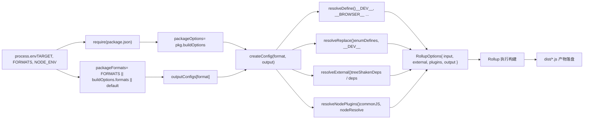

# Chapter 2: Main Trunk Lifecycle: The End-to-End Journey of a Build Request

In the previous chapter, we clarified the positioning of the core repository as an engineering mothership, and how the pnpm workspace and root-level configuration uniformly constrain all subpackages. Now, we go deep into the core of the build system and trace how a single command drives the entire build process.`node scripts/build.js vue`It appears simple, but it is the only entry point for all artifacts—esm-bundler, cjs, global. Understanding how it translates user intent into executable build tasks is a key step in mastering Vue's build mechanism.

# Rollup Configuration Generation: From Environment Variables to Multi-Format Artifacts

`build.js`After starting Rollup through`exec`, control shifts to`rollup.config.js`. This file is the "brain" of the build system—it reads environment variables and dynamically generates an array of Rollup configuration objects.

## Environment Variable Validation and Package Location

[FACT:rollup.config.js:27-29]

If`TARGET`is not set, throw an error directly. This is defensive programming: the Rollup configuration may be called directly (such as`rollup -c`), in which case there is no`build.js`injecting environment variables, so it must fail fast.

[FACT:rollup.config.js:32-44]

Here the private package determination logic from`build.js`is repeated—because`rollup.config.js`is an independent process and cannot share`build.js`'s in-memory state.`resolve`The function resolves a relative path to an absolute path under the package directory,`pkg`is the target package's`package.json`content,`packageOptions`is the`buildOptions`field within it,`name`is the artifact filename prefix (prefer`buildOptions.filename`, otherwise use the directory name).

## Format mapping table:`outputConfigs`

[FACT:rollup.config.js:58-88]

This table defines the mapping from 7 formats to output configurations. Key observations:

- `esm-bundler`、`esm-browser`、`esm-bundler-runtime`、`esm-browser-runtime`are all`format: 'es'`, the only difference is the filename.
- `cjs`is`format: 'cjs'`。
- `global`and`global-runtime`is`format: 'iife'`(immediately invoked function expression), suitable for direct inclusion via`<script>`tags.
- `runtime`Formats with the`vue`suffix are only meaningful for the main

## package—they do not include the compiler and are smaller in size.

[FACT:rollup.config.js:91-92]

Format Selection: Three Levels of Priority`FORMATS`Format selection follows three levels of priority: command-line`buildOptions.formats`environment variable > package's`['esm-bundler', 'cjs']`。`PROD_ONLY`> default

## The environment variable controls whether to skip the base configuration—if only building the production version, the base configuration array is empty, and only the production configuration is pushed afterward.

[FACT:rollup.config.js:97-114]

Production Configuration Append Logic`NODE_ENV === 'production'`When

- , for each format:`packageOptions.prod === false`If
- , skip (the package does not need a production version).`cjs`If it is`createProductionConfig`, append`.prod.js`—generate the
- file.`/^(global|esm-browser)(-runtime)?/`If it matches`createMinifiedConfig`, append

> **[Design Inference & Architectural Trade-offs]**
> 〔Design Inference and Architectural Trade-offs〕`cjs`Why does`createProductionConfig`use`global`/`esm-browser`while`createMinifiedConfig`uses

## `createConfig`? Because CJS is for Node, and the Node environment does not need minification (users will handle it themselves), but it does need to distinguish dev/prod branches; whereas artifacts directly included by the browser must be minified to reduce size. This difference is reflected in the implementations of the two factory functions.

`createConfig`: The Core of Configuration Generation

[FACT:rollup.config.js:125-142]

is the largest function; it receives the format and output configuration and returns the complete Rollup configuration object.

- `isProductionBuild`It begins with the calculation of a series of boolean flags:`__DEV__`: determined by the`.prod.js`environment variable or whether the filename contains
- `isBundlerESMBuild`、`isBrowserESMBuild`、`isCJSBuild`、`isGlobalBuild`.
- `isServerRenderer`: matched by a regular expression on the format name.`server-renderer`。
- `isCompatPackage`、`isCompatBuild`: whether the package name is
- `isBrowserBuild`: related to the Vue 2 compatibility build.

: global build or browser ESM build, and the non-browser branch is not enabled.`resolveDefine`、`resolveReplace`、`resolveExternal`These flags are used repeatedly in the subsequent

[FACT:rollup.config.js:144-157]

and are the core basis for configuration differentiation.`exports`Basic output configuration settings: banner copyright header,`auto`mode (compat packages use`named`, the rest use`esModule`), CJS build enables`externalLiveBindings: false`interop, sourcemap is controlled by environment variables,`reexportProtoFromExternal: false`and`output.name`are compatibility settings for Rollup 4. The global build additionally sets`window`, that is, the variable name mounted on

## .

[FACT:rollup.config.js:159-168]

Entry File Selection`src/index.ts`The default entry is`runtime`, but formats with the`src/runtime.ts`The ESM build of the compat package needs to export both default and named, so a separate`esm-index.ts` / `esm-runtime.ts`entry is used.

## Macro definitions:`resolveDefine`

[FACT:rollup.config.js:170-218]

`resolveDefine`Returns a replacement table that replaces`__COMMIT__`、`__VERSION__`、`__BROWSER__`and other macros in the source code with literals. These macros are used for conditional compilation in the source code—for example,`if (__DEV__) { ... }`will be replaced with`if (false) { ... }`in production builds, and then removed by Tree-shaking.

Key design:`__FEATURE_OPTIONS_API__`、`__FEATURE_PROD_DEVTOOLS__`Feature flags such as`esm-bundler`are kept as`__VUE_OPTIONS_API__`identifiers in the build, allowing end users to override them through bundler configuration; in other builds they are directly hardcoded as`true`or`false`。

[FACT:rollup.config.js:203-206]

Non-`esm-bundler`builds hardcode`__DEV__`because their dev/prod branches are already determined at build time.

[FACT:rollup.config.js:210-216]

The last step allows environment variables to override any macro definition, supporting`__RUNTIME_COMPILE__=true pnpm build runtime-core`inline overrides like this.

## Replacement plugin:`resolveReplace`

[FACT:rollup.config.js:222-255]

`resolveReplace`Handles replacements outside`resolveDefine`that esbuild cannot handle:

- Merge`enumDefines`(enum inline definitions from`inlineEnums`).
- In production browser builds, add`/*@__PURE__*/`annotations to error creation functions to help Tree-shaking.
- `esm-bundler`In the`__DEV__`build, replace`!!(process.env.NODE_ENV !== 'production')`with
- and let the bundler decide.`process.env`In the browser ESM build, replace

## with an empty object to avoid browser errors.`resolveExternal`

[FACT:rollup.config.js:257-283]

External dependencies:`treeShakenDeps`This is the core of the thought question at the end of the previous chapter. The browser build only returns`dependencies`as external—although these dependencies are imported, they are not actually executed in the browser branch, and are listed here only to suppress Rollup warnings. Node/ESM-bundler builds externalize all`peerDependencies`and`path`、`url`、`stream`as well as Node built-in modules such as

## Final configuration object

[FACT:rollup.config.js:319-352]

The returned configuration object contains:

- `input`: absolute path to the entry file.
- `external`: list of external dependencies.
- `plugins`: plugin array, in the order json → alias → enumPlugin → replace → esbuild → nodePlugins.
- `output`: output configuration.
- `onwarn`: filter out`CIRCULAR_DEPENDENCY`warnings (circular dependencies exist in Vue source code, but they are harmless at runtime).
- `treeshake.moduleSideEffects: false`: tell Rollup that all modules have no side effects, enabling aggressive Tree-shaking.

The following figure shows the data flow from environment variables to the final configuration:

# Artifact writing and size checking

## `exec`Process management for

`build.js`Starts the Rollup subprocess through`exec`:

[FACT:scripts/utils.js:64-114]

`exec`wraps`spawn`and returns a Promise. Key design:

- `stdio`defaults to`['ignore', 'pipe', 'pipe']`—stdin is ignored, stdout/stderr are captured through pipes.
- `shell: process.platform === 'win32'`—on Windows, a shell is required to correctly parse the command.
- Collect output through the`stderrChunks`and`stdoutChunks`arrays, concatenating in the`exit`event.
- Resolve when the exit code is 0; otherwise reject with the stderr content.

> **[Design Inference & Architectural Trade-offs]**
> Note that`build.js`calls`exec`with`{ stdio: 'inherit' }`, which overrides the default pipe configuration and lets Rollup output pass through directly to the terminal. This is the correct behavior for a build tool—users need to see build progress in real time.

## Size checking:`checkAllSizes`

[FACT:scripts/build.js:206-215]

Size checking has two skip conditions:`devOnly`is true, or a format is specified but does not include`global`. Because size checking only targets global build artifacts—those are the files directly imported by end users, and size is most sensitive there.

[FACT:scripts/build.js:222-228]

`checkSize`Check two files:`${target}.global.prod.js`and`${target}.runtime.global.prod.js`(the latter is checked only when no format is specified or`global-runtime`is specified).

[FACT:scripts/build.js:235-264]

`checkFileSize`Read the file, use`gzipSync`and`brotliCompressSync`to calculate the compressed size, and use`prettyBytes`to format the output. If`writeSize`is true, write the result to`temp/size/${fileName}.json`—this is the data source for size budget checks in CI.

## Type declaration build

[FACT:scripts/build.js:94-108]

If`buildTypes`is true, call`pnpm run build-dts`, and pass the target list through`--environment TARGETS:...`. This ensures type declarations are generated only for the packages actually being built.

# Design thinking and production pitfalls

**Why use`--environment`instead of passing parameters directly?**Rollup's`--environment`is the only way to pass parameters that can be read in the config file through`process.env`. Passing`--config`parameters directly requires parsing`process.argv`, whereas`--environment`provides structured key-value parsing.

**`fuzzyMatchTarget`Regex trap in** `target.match(partialTarget)`In`partialTarget`is user input. If the user inputs`runtime-core`，`-`it is a literal in the regex, so there is no problem; but if the input is`runtime.core`，`.`it will match any character and may match unexpected targets. This is the inherent risk of fuzzy matching, but Vue package names do not contain regex special characters, so it will not actually trigger.

**Resource contention in concurrent builds.** `runParallel`uses`cpus().length`as the concurrency limit, but each Rollup process itself also starts workers. In low-core CI containers, this may cause out-of-memory. In production, if OOM occurs, it can be mitigated by`--max-old-space-size`or by reducing the concurrency count.

**`scanEnums`Cache lifecycle of** `removeCache`is called in`finally`, but if`scanEnums`itself throws,`removeCache`will not be assigned, and the call in`finally`will fail. In fact, the function returned by`scanEnums`is already determined before`try`, so this risk does not exist—but this is a timing detail that needs to be confirmed when reading.

**`resolveExternal`Risk of omission in**The thought question in the previous chapter already pointed out: if a new dependency is added to`runtime-core`but`resolveExternal`is forgotten to be updated, the browser build will bundle that dependency in (because it is not in the external list), causing size bloat. This is the inherent cost of the "whitelist external" strategy.

# Chapter summary

The complete journey of one`node scripts/build.js vue`:

1. `parseArgs`parses the command line,`commit`is obtained synchronously.

2. `run()`Call`scanEnums`to generate the enum cache, parse the target (`fuzzyMatchTarget`or`allTargets`）。

3. `buildAll`through`runParallel`concurrently schedule`build`。

4. `build`locate the package directory, read`package.json`, filter private packages, clean`dist`, assemble`--environment`parameters, call`exec`Start Rollup.

5. `rollup.config.js`Read environment variables, through`createConfig`generate the configuration array,`resolveDefine`/`resolveReplace`/`resolveExternal`and handle macros, replacements, and external dependencies separately.

6. Rollup executes the build, and the artifacts are written to disk at`dist/`。

7. `checkAllSizes`Calculate gzip/brotli sizes, optionally write to`temp/size/`。

8. If`--withTypes`, call`build-dts`to generate type declarations.

# Chapter Review and Self-Test

Q1: In`build.js`'s`build`function,`if (!formats && fs.existsSync(...))`this condition determines whether to delete the`dist`directory. If the`!formats`condition is removed (i.e., delete`dist`regardless of whether the format is specified),`pnpm build-all-cjs`in a script like

**Reference Analysis**：

[FACT:scripts/build.js:172-175]

`pnpm build-all-cjs`corresponds to`node scripts/build.js vue runtime compiler reactivity shared -af cjs`(see[FACT:package.json:40]). It specifies`-f cjs`, so`formats`is`'cjs'`，`!formats`is false, and the current logic will not delete`dist`。

If`!formats`is removed, every build will delete`dist`. But`build-all-cjs`only builds the`cjs`format, so after deletion`dist`only contains the`cjs`artifacts, and previously built`esm-bundler`、`global`and other formats are all lost. More seriously,`build-runtime-esm`、`build-browser-esm`and other scripts will execute in sequence (see[FACT:package.json:39]'s`build-sfc-playground`script), and each script will delete the artifacts of the previous script, resulting in the final`dist`containing only the format of the last script. This would break the SFC Playground build—it requires artifacts in multiple formats to exist simultaneously.

Q2: `runParallel`In`if (maxConcurrency <= source.length)`what is the purpose of the`targets.length === 1`condition? If it is removed, what happens when building a single package (

**)?**：

[FACT:scripts/build.js:131-151]

Reference Analysis`maxConcurrency > source.length`This condition controls whether concurrency throttling is enabled. When`executing`, throttling is not needed—all tasks can start simultaneously. If this condition is removed, even if there is only one task, it will create the`await Promise.race(executing)`。

array and execute`executing`For a single task,`e`，`Promise.race`there is only one Promise in`executing.splice(executing.indexOf(e), 1)`that will wait for it to complete. This will not cause an error, but it introduces an unnecessary Promise chain and microtask scheduling overhead. More importantly,

still works correctly in the single-task scenario, so there is no functional difference, only a slight performance loss.`maxConcurrency`The real risk is: if`cpus().length`is 0 (theoretically impossible, because`executing.length >= 0`is at least 1),`Promise.race([])`is always true,`cpus().length`will hang forever. But

Q3: `resolveExternal`guarantees that this boundary will not be triggered.`treeShakenDeps`In

**, the browser build returns**：

[FACT:rollup.config.js:257-283]

`treeShakenDeps`as external, but these dependencies are not actually executed in the browser branch. What happens if they are removed from the external list (i.e., let Rollup try to bundle them)?`source-map-js`、`@babel/parser`、`estree-walker`、`entities/decode`Reference Analysis`compiler-sfc`includes`__BROWSER__`. These are dependencies of packages such as

, and are conditionally compiled out in the browser build through the`treeshake.moduleSideEffects: false`（[FACT:rollup.config.js:355-355]macro.`if (!__BROWSER__)`If removed from external, Rollup will try to resolve and bundle these dependencies. Because`__BROWSER__`), and the import statements of these dependencies are located in the`true`branch, esbuild's define will replace

with`onwarn`, causing the branch to be marked as dead code. Rollup's Tree-shaking will remove these imports, and the final artifact will not contain the code of these dependencies.

But the problem is: Rollup needs to resolve modules before Tree-shaking. If these dependencies are not installed (for example, in a minimal CI environment), Rollup will report a "cannot resolve module" error. Listing them as external is a defensive measure—even if the dependency does not exist, Rollup will not try to resolve it, and will only issue a warning (while`scripts/dev.js`will filter out warnings for non-circular dependencies).
